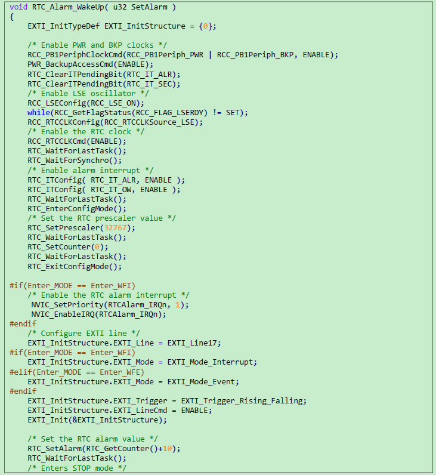
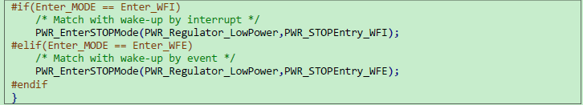
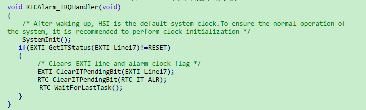
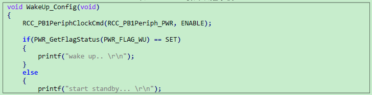
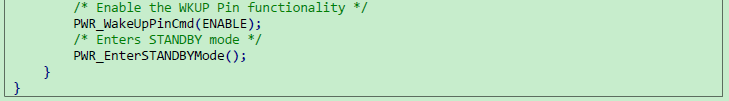
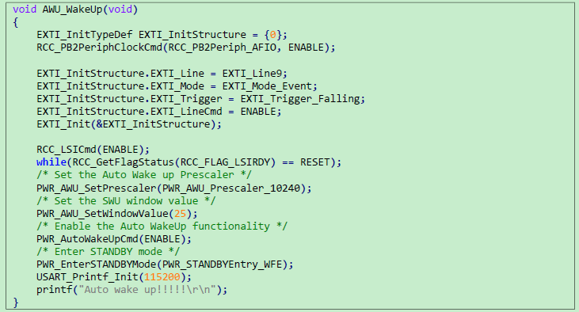
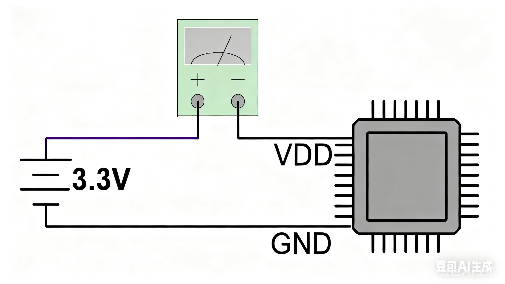

<table>
<colgroup>
<col style="width: 49%" />
<col style="width: 50%" />
</colgroup>
<thead>
<tr>
<th rowspan="2"></th>
<th></th>
</tr>
<tr>
<th></th>
</tr>
</thead>
<tbody>
</tbody>
</table>

说明

CH32系列微控制器提供了多种低功耗模式，本应用文档列举了不同低功耗模式的区别并提供了部分唤醒源将系统从低功耗模式唤醒的使用示例，介绍了从软件配置、硬件设计及测量误差等维度优化低功耗模式下功耗电流的方法，以及睡眠唤醒中的注意事项和使用技巧。

**适用范围**

| 适用范围 | 系列        |
|----------|-------------|
| 通用MCU  | CH32通用MCU |

目录

[说明 [1](#_Toc239526102)](#_Toc239526102)

[目录 [2](#_Toc239526103)](#_Toc239526103)

[表格索引 [2](#_Toc239526104)](#_Toc239526104)

[图片索引 [2](#_Toc239526105)](#_Toc239526105)

[第1章 低功耗模式 [1](#低功耗模式)](#低功耗模式)

[1.1 低功耗模式简介 [1](#低功耗模式简介)](#低功耗模式简介)

[1.1.1 SLEEP模式 [1](#sleep模式)](#sleep模式)

[1.1.2 STOP模式 [1](#stop模式)](#stop模式)

[1.1.3 STANDBY模式 [1](#standby模式)](#standby模式)

[1.2 部分唤醒源的使用 [1](#部分唤醒源的使用)](#部分唤醒源的使用)

[1.2.1 RTC 闹钟唤醒 [1](#rtc-闹钟唤醒)](#rtc-闹钟唤醒)

[1.2.2 WKUP引脚唤醒 [3](#wkup引脚唤醒)](#wkup引脚唤醒)

[1.2.3 AWU自动唤醒 [4](#awu自动唤醒)](#awu自动唤醒)

[1.2.4 LPTIM唤醒 [4](#lptim唤醒)](#lptim唤醒)

[1.2.5 PVD唤醒 [5](#pvd唤醒)](#pvd唤醒)

[第2章 低功耗注意事项 [6](#低功耗注意事项)](#低功耗注意事项)

[2.1 如何优化芯片睡眠电流
[6](#如何优化芯片睡眠电流)](#如何优化芯片睡眠电流)

[2.1.1 MCU引脚配置 [6](#mcu引脚配置)](#mcu引脚配置)

[2.1.2 关闭外设降低主频 [6](#关闭外设降低主频)](#关闭外设降低主频)

[2.1.3 开启电压调节器与RAM节能模式
[6](#开启电压调节器与ram节能模式)](#开启电压调节器与ram节能模式)

[2.1.4 代码从SRAM中运行 [6](#代码从sram中运行)](#代码从sram中运行)

[2.1.5 检查外围电路 [6](#检查外围电路)](#检查外围电路)

[2.1.6 减小电流测量误差 [7](#减小电流测量误差)](#减小电流测量误差)

[2.2 睡眠唤醒注意事项 [7](#睡眠唤醒注意事项)](#睡眠唤醒注意事项)

[2.2.1 正确睡眠唤醒 [7](#正确睡眠唤醒)](#正确睡眠唤醒)

[2.2.2 STANDBY模式引脚电平维持方法
[7](#standby模式引脚电平维持方法)](#standby模式引脚电平维持方法)

[2.2.3 WFE事件唤醒源获取方法
[7](#wfe事件唤醒源获取方法)](#wfe事件唤醒源获取方法)

[2.2.4 STANDBY模式RAM数据保持方法
[8](#standby模式ram数据保持方法)](#standby模式ram数据保持方法)

[历史版本 [9](#_Toc239526130)](#_Toc239526130)

[声明 [10](#_Toc239526131)](#_Toc239526131)

表格索引

[低功耗模式一览 [1](#_Toc239526132)](#_Toc239526132)

图片索引

[RTC闹钟唤醒配置示例 [2](#_Toc239526133)](#_Toc239526133)

[RTC闹钟唤醒中断示例 [3](#_Toc239526134)](#_Toc239526134)

[WKUP引脚唤醒示例 [3](#_Toc239526135)](#_Toc239526135)

[AWU自动唤醒示例 [4](#_Toc239526136)](#_Toc239526136)

[电流测量示意图 [7](#_Toc239526137)](#_Toc239526137)

# 低功耗模式

## 低功耗模式简介

CH32系列微控制器提供SLEEP\STOP\STANDBY等多种低功耗模式，并提供不同的唤醒方法让系统跳出此状态。当系统不需继续运行时，可以根据系统使用需求选择不同的低功耗模式来节省功耗。

<table>
<caption>
表 1‑1低功耗模式一览
</caption>
<colgroup>
<col style="width: 14%" />
<col style="width: 18%" />
<col style="width: 25%" />
<col style="width: 41%" />
</colgroup>
<thead>
<tr>
<th style="text-align: center;">模式</th>
<th style="text-align: center;">进入</th>
<th style="text-align: center;">唤醒</th>
<th style="text-align: center;">描述</th>
</tr>
</thead>
<tbody>
<tr>
<td rowspan="2" style="text-align: center;">SLEEP</td>
<td style="text-align: center;">WFI</td>
<td style="text-align: center;">任意中断唤醒</td>
<td
rowspan="2">内核时钟关闭，其他时钟无影响所有I/O引脚保持，唤醒后继续运行</td>
</tr>
<tr>
<td style="text-align: center;">WFE</td>
<td style="text-align: center;">任意事件唤醒</td>
</tr>
<tr>
<td style="text-align: center;">STOP（1）</td>
<td style="text-align: center;">
SLEEPDEEP置1

PDDS置0

WFI或WFE
</td>
<td style="text-align: center;">任意外部中断/事件（1）</td>
<td>关闭HSE、HSI、PLL和外设时钟，所有I/O引脚保持，唤醒后继续运行</td>
</tr>
<tr>
<td style="text-align: center;">STANDBY（1）</td>
<td style="text-align: center;">
SLEEPDEEP置1

PDDS置1

WFI或WFE
</td>
<td style="text-align: center;">任意事件等（1）</td>
<td>关闭HSE、HSI、PLL和外设时钟，唤醒后继续运行或复位（1）</td>
</tr>
</tbody>
</table>

*注：1.部分产品未提供STOP或STANDBY模式，不同产品唤醒源有所差别，部分产品STANDBY模式唤醒后系统会继续执行，具体细节请查阅芯片手册。*

### SLEEP模式

通过执行WFI或WFE指令进入睡眠状态。在SLEEP模式，所有的I/O引脚都保持它们在运行模式时的状态。所有的外设时钟都正常，所以进入睡眠模式前，尽量关闭无用的外设时钟，以减低功耗。该模式唤醒所需时间最短。

### STOP模式

此模式高频时钟（HSE/HSI/PLL）域被关闭，SRAM和寄存器内容保持，I/O引脚状态保持。该模式唤醒后系统可以继续运行，HSI为默认系统时钟。如果正在进行闪存编程，直到对内存访问完成，系统才进入停止模式；如果正在进行对PB的访问，直到对PB访问完成，系统才进入停止模式。STOP模式在功耗与灵活性之间取得了平衡，适合大多数低功耗应用。

### STANDBY模式

待机模式下，电压调节器关闭，除唤醒电路和后备域电路之外的电路将断电，实现最低功耗，在指定的唤醒条件下退出后，微控制器将被复位，并执行的是电源复位（部分芯片如CH32V00x、CH32X03x系列，在STANDBY模式下，SRAM和寄存器内容保持，I/O引脚状态保持，系统唤醒后继续执行，HSI默认为系统时钟）。STANDBY模式功耗最低，但通常唤醒后需要重启系统，适用于对实时性要求不高的场景。

## 部分唤醒源的使用

### RTC 闹钟唤醒

RTC可以实现无需外部中断的情况下自动唤醒。通过对时间基数进行编程，可周期性地从STOP或STANDBY模式下唤醒。

以CH32F/V20x_V30x为例，可选择精准的外部低频32.768kHz晶振LSE作为RTC时钟源，也可以选择内部LSI振荡器作为RTC时钟源，LSI的精度和功耗指标要差于LSE。如果使用事件唤醒，需要使能外部中断通道17的事件请求信号；如果使用中断唤醒，则需要使能外部中断通道17的中断请求信号，并且使能闹钟外部中断，编写中断服务函数。STOP模式支持用事件或中断唤醒，唤醒后系统继续运行。而STANDBY模式只能用事件唤醒，且无需配置外部中断线17,唤醒后系统复位。

<figure>

<figcaption>
图 ‑1 RTC闹钟唤醒配置示例
</figcaption>
</figure>

使能PWR和BKP时钟，配置RTC时钟源，待LSE/LSI时钟稳定后使能RTC时钟和闹钟中断，设置RTC时钟分频系数和闹钟值，执行STOP模式，10s后产生闹钟中断唤醒系统，需要注意的是醒来HSI为默认系统时钟，为保证程序正常运行，建议重新进行系统时钟初始化。

<figure>

<figcaption>
图 ‑2 RTC闹钟唤醒中断示例
</figcaption>
</figure>

上述示例中使用了RTC闹钟中断函数RTCAlarm_IRQHandler()，并没有用到RTC全局中断RTC_IRQHandler()。如果两个中断函数同时使用的话，我们必须这样设置才不会有漏洞，RTCAlarm_IRQHandler()函数的优先级一定要高于RTC_IRQHandler()。原因如下：

产生闹钟中断的前一瞬间，一定产生了秒中断，那么会先执行RTC_IRQHandler()中断函数，在RTC_IRQHandler()执行的过程中，闹钟中断标志又被挂起，由于RTC_IRQHandler()是全局中断函数，必须清除所有的中断标志，程序才能退出该函数，假如RTC_IRQHandler()和RTCAlarm_IRQHandler()是同样的优先级，要想让程序退出RTC_IRQHandler()函数，那么必须清除闹钟中断标志（如果不清除闹钟中断标志，程序会死在RTC_IRQHandler()，这样问题又出现了，清除闹钟中断标志后，程序就不会进入RTCAlarm_IRQHandler()，那么RTCAlarm_IRQHandler()函数永远也不会被执行。

设置闹钟中断函数RTCAlarm_IRQHandler()的优先级高于全局中断函数RTC_IRQHandler()，在执行全局中断函数RTC_IRQHandler()的时候，如果产生闹钟中断，那么中断嵌套去执行RTCAlarm_IRQHandler()，执行完毕RTCAlarm_IRQHandler()后，再去执行RTC_IRQHandler()。

### WKUP引脚唤醒

CH32F/V10x_20x_V30x,CH32L103等系列具有从低功耗模式唤醒MCU的专用硬件接口WKUP引脚(PA0)，使能后WKUP引脚强制配置为输入下拉状态，WKUP上升沿用于把MCU从STANDBY状态下唤醒。建议在初始化时检测唤醒标志（PWR_GetFlagStatus(PWR_FLAG_WU)），区分是否为唤醒启动。

<figure>

<figcaption>
图 ‑3 WKUP引脚唤醒示例
</figcaption>
</figure>

### AWU自动唤醒

对于RISC-V系列MCU中没有RTC功能的MCU如CH32V00x、CH32X03x系列，在低功耗模式下需要自动唤醒时，提供了AWU功能。AWU功能支持中断或者事件模式唤醒MCU，在事件模式唤醒MCU时代码更简单，flash占用也更少，对于小容量MCU来说是比较好的选择。

AWU模块是一个6位自加型计数器，当计数器计数到与写进去的值相等时，会从STOP模式或STANDBY模式下唤醒。

AWU时间计算公式：

T = Windows Value \* (Prescaler / AWU_CLK ) (S)

以CH32V00x为例，设置10240分频，窗口值设置25：内部低频128kHz时钟振荡器LSI作为自动唤醒计数时基，10240分频之后计数一次时间为1/12.5Hz，则唤醒时间间隔为25/12.5=2S。CH32X035计算方式与CH32V00x一致，但AWU模块时钟源不同，CH32X035
AWU模块时钟源为内部高速时钟HSI的47KHz分频时钟。

AWU事件唤醒的配置方法:首先配置AWU对应的外部中断中断线为事件模式，使能PWR时钟，使能LSI，待LSI稳定后配置AWU的预分频值与窗口比较值，配置完成后，再使能AWU功能，并通过WFE命令让MCU进入低功耗模式，即可实现通过事件唤醒低功耗模式下MCU的目的。而且AWU仅需配置一次，不需要每次唤醒后重新配置。

AWU中断唤醒的配置方法：首先配置AWU对应的外部中断线为中断模式（CH32V00x因为AWU连接到外部中断线9，同时外部中断只有0-7，所以需要使能AWU中断，在中断服务函数中清除外部中断9的中断标志位，对于CH32X035则直接进对应的外部中断，并清除相关的中断标志位即可），使能相应中断，并配置中断优先级，使能PWR外设时钟，配置AWU预分频器，配置AWU窗口比较值，使能AWU，执行WFI进入低功耗模式，此时就可以实现AWU的中断方式定时唤醒MCU。

<figure>

<figcaption>
图 ‑4 AWU自动唤醒示例
</figcaption>
</figure>

### LPTIM唤醒

CH32L103系列LPTIM外设是专为低功耗应用场景设计的低功耗定时器，LPTIM是一个16位上行计数的定时器，具有多种可选的时钟源（可选内部时钟源：LSE、LSI、HSI或PB1时钟，外部时钟源：LPTIM输入上的外部时钟），使得LPTIM能在除待机模式外的所有电源模式下运行。LPTIM在没有内部时钟源的情况下也能运行，依此可以将LPTIM
当作“脉冲计数器”使用。除此之外，LPTIM能够将系统从低功耗模式唤醒，所以LPTIM很适合以极低的功耗实现“超时功能”。

低功耗模式对LPTIM的影响:

SLEEP模式：无影响，LPTIM中断会导致设备退出睡眠模式。

STOP模式：LPTIM外围设备在由LSE或LSI计时时处于活动状态，LPTIM中断导致设备退出停止模式。

STANDBY模式：LPTIM外围设备已断电，必须在退出待机模式后重新初始化。

如果使用事件唤醒，需要使能外部中断通道21的事件请求信号；如果使用中断唤醒，则需要使能外部中断通道21的中断请求信号，并且使能LPTIM外部中断，编写中断服务函数。

### PVD唤醒

可编程电压监视器PVD，主要被用于监控系统主电源的变化，与电源控制寄存器PWR_CTLR的PLS\[2:0\]所设置的门槛电压相比较，配合外部中断寄存器（EXTI）设置，可产生相关事件中断，从SLEEP或STOP模式下唤醒。

配置方法如下:使能PWR时钟，然后设置电压监视阈值，随后使能PVDE开启电源电压监视功能。PVD功能内部连接EXTI模块的第16线的上升/下降边沿触发设置，配置EXTI相关寄存器，当VDD下降到PVD阀值以下或上升到PVD阀值之上时就会产生PVD事件或中断。SANDBY模式不支持PVD唤醒。

# 低功耗注意事项

## 如何优化芯片睡眠电流

### MCU引脚配置

●
在进入低功耗模式前，需要将所有I/O配置成为上拉/下拉输入或模拟输入，防止芯片I/O浮空产生漏电流。注意芯片引脚是否支持上拉/下拉输入或模拟输入功能（否则配置不生效，默认浮空态），根据具体情况选择。

●
对于芯片小封装型号，相较最大封装，未封装出的引脚，建议配置为上拉/下拉输入或模拟输入，否则可能影响电流指标。

●
释放SWD调试接口作为GPIO功能,并配置为上拉/下拉输入或模拟输入(唤醒后恢复SWD功能)
GPIO_PinRemapConfig(GPIO_Remap_SWJ_Disable, ENABLE)。

### 关闭外设降低主频

● 在SLEEP
模式下内核停止，但所有外设（包含内核私有外设）仍在运行，如果系统时钟频率越高，使能的外设越多，功耗就越大，建议睡眠前将未使用的外设禁用，关闭PLL切换低速时钟，实现节能。此外部分产品可配置HSI进入低功耗模式，如CH32L103系列
HSI使能低功耗模式后，输出频率从8MHz降为1MHz（使用UART时HSI为1MHz，波特率支持低于62.5Kbps）。

●
避免外设关闭不充分，STOP模式下或某些芯片的STANDBY模式，电压调节器未关闭，例如睡眠前使能了ADC，睡眠后会自动关闭ADC外设时钟，但ADC内部电路仍会存在部分电流消耗，在睡眠前需失能外设。

### 开启电压调节器与RAM节能模式

以CH32F/V20x_V30x为例:

在STOP模式下，可选LPDS位，LPDS=0，电压调节器工作在正常模式；LPDS=1，电压调节器工作在低功耗模式。在低功耗模式下，可以通过配置PWR_CTLR寄存器的RAMLV=1，使能RAM低电压模式，降低功耗。

在STANDBY模式下，当正常供电时，通过配置PWR_CTLR
寄存器的R2KSTY=1控制2K字节RAM不掉电，R30KSTY=1控制30K字节RAM不掉电；当使用VBAT供电时，通过配PWR_CTLR寄存器的R2KVBAT=1控制2K字节RAM不掉电，R32K_VBATEN=1控制30K字节RAM不掉电。在该基础之上，可以通过配置PWR_CTLR寄存器的RAMLV=1，使能RAM
低电压模式，降低功耗。

### 代码从SRAM中运行

以CH32L103系列为例，SLEEP或STOP模式下可将数据处理代码放SRAM中运行，同时配置flash进入低功耗，调节LDOTRIM降低数字内核电压，以降低功耗。

### 检查外围电路

●
注意外部电源转换器件漏电流：某些驱动、电源转换芯片如果是由软件使能，进入低功耗模式之后建议关闭，因为本身会有工作电流消耗；如果是由硬件使能，则需要查看芯片手册看静态工作电流是多少，如果比较高，只能修改硬件电路或者用低功耗芯片代替。

●
外围是否有闭合回路：比如电压采集分压电阻未断开，虽然ADC已经关闭，但是这个分压电路还是有电流消耗的，大小一般取决于电阻和电源电压；传感器、通信模块、LED指示灯等外围器件在进入低功耗前应切断供电。

●
GPIO状态是否冲突：根据设备原理图查看I/O引脚外部的连接电路，当引脚通过外围电路电阻接地被拉低时，如果引脚设置为上拉输入，则在芯片内部的上拉电阻和外围的下拉电阻构成回路，电流消耗取决于这两个电阻；当引脚通过外围电路电阻接电源被拉高时，如果引脚设置为下拉输入，则在芯片内部的下拉电阻和外围的上拉电阻构成回路，电流消耗也取决于这两个电阻。

### 减小电流测量误差

●
测量功耗电流时，断开外围模块供电（如传感器、通信芯片，LED、USB转串口芯片），避免外部器件漏电影响，仅保留MCU最小系统。

●
实测电流时要完全断开SWD调试器连接，仅保留供电线，万用表测量uA级静态电流时档位需切换至uA档，避免量程过大丢失精度。

<figure>

<figcaption>
图 ‑1电流测量示意图
</figcaption>
</figure>

## 睡眠唤醒注意事项

### 正确睡眠唤醒

●
睡眠前使能PWR外设时钟。不同的低功耗模式，唤醒资源是不一样的，通过查阅应用手册来保证低功耗的模式和唤醒源是匹配关系。

● 避免唤醒源持续触发，如持续中断会阻止睡眠，中断标志要清除彻底。

●
唤醒后时钟重建，退出停止模式后HSI自动作为系统时钟，若原用HSE/PLL需手动切换（未重配时钟导致外设失效），唤醒后调用时钟配置函数。

●
检查低功耗模式、进入睡眠方式（WFI/WFE）和唤醒方式（事件/中断）是否匹配，EXTI线路是否正确映射，并确认触发边沿（上升沿/下降沿）与实际信号一致,信号满足沿要求。

### STANDBY模式引脚电平维持方法

通常情况下，芯片进入STANDBY模式，芯片引脚并不会保持原来的状态，I/O默认为模拟输入。若希望芯片进入STANDBY模式且引脚电平保持，可通过如下方法实现：

第一步：配置引脚为上拉/下拉输入

第二步：打开AFIO时钟

> 第三步：将需要保持电平的引脚配置为外部中断输入引脚，操作AFIO_EXTICR\[x\]寄存器（以PA3为例，AFIO-\>EXTICR\[1\]=0）
>
> 第四步：使能外部中断通道的事件请求，操作EXT_EVENR寄存器（以PA3为例，EXTI-\>EVENR\|=(1\<\<3)）

注意：仅支持上/下拉输入的电平保持，不支持输出保持。该功能因为AFIO_EXTICR\[x\]，例PA3,PB3,操作的是AFIO_EXTICR\[x\]寄存器的相同位，所以不能同时保持相同EXTI通道引脚的电平。

### WFE事件唤醒源获取方法

WFE方式唤醒无需中断控制器介入，若使用WFE方式唤醒设备，且需要获取WFE唤醒源时，可通过如下方法：

第一步：配置外部或内部的EXTI 线为事件模式。

第二步：使能相应EXTI线的中断请求信号（EXTI_INTENR）。

第三步：执行WFE，唤醒后查询中断标志位寄存器（EXTI_INTFR），判断事件唤醒源。

### STANDBY模式RAM数据保持方法

通常情况STANDBY模式下，电压调节器关闭，除唤醒电路和后备域电路之外的电路将断电，默认所有RAM数据会丢失，在指定的唤醒条件下退出后，微控制器将被复位。

以CH32F/V20x_V30x为例，在待机模式下，当正常供电时，可以通过配置PWR_CTLR寄存器的R2KSTY=1控制2K字节RAM不掉电，R30KSTY=1控制30K字节RAM不掉电；当使用VBAT供电时，通过配置PWR_CTLR寄存器的R2KVBAT=1控制2K
字节RAM不掉电，R32K_VBATEN=1控制30K字节RAM不掉电。在该基础之上，可以通过配置PWR_CTLR
寄存器的RAMLV=1，使能RAM低电压模式，以降低功耗。

历史版本

| 日期     | 版本 | 变更内容 |
|----------|------|----------|
| 2026/7/8 | V1.0 | 初版发行 |

声明

本手册仅供参考。作者在不另行通知的情况下，可随时进行修改。
