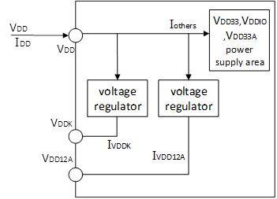
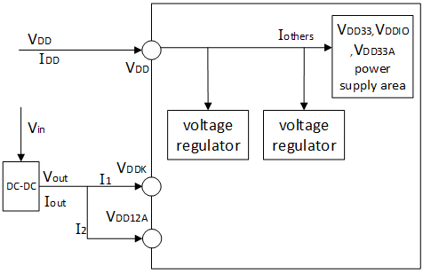
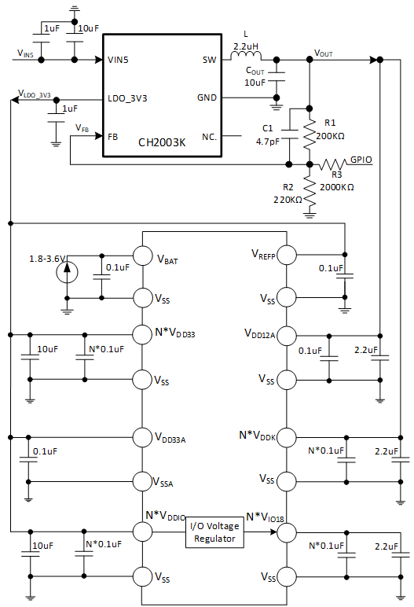

<table>
<colgroup>
<col style="width: 49%" />
<col style="width: 50%" />
</colgroup>
<thead>
<tr>
<th rowspan="2"></th>
<th></th>
</tr>
<tr>
<th></th>
</tr>
</thead>
<tbody>
</tbody>
</table>

<span id="_Toc239778327" class="anchor"></span>说明

CH32系列中部分高性能型号将1.2V的VDD12域（内核及高速外设供电域）通过引脚引出，支持外部DCDC直接供电，使负载电流可以由外部电源接管。本应用笔记详细介绍了通过外部DCDC降压转换器直接为VDD12域提供1.2V电压的方案，提升电源转换效率，降低系统整体功耗和芯片发热情况。

**适用范围**

| 适用范围 | 系列        |
|----------|-------------|
| 通用MCU  | CH32通用MCU |

<span id="_Toc239778328" class="anchor"></span>目录

[说明 [1](#_Toc239778327)](#_Toc239778327)

[目录 [2](#_Toc239778328)](#_Toc239778328)

[表格索引 [2](#_Toc239778329)](#_Toc239778329)

[图片索引 [2](#_Toc239778330)](#_Toc239778330)

[第1章 CH32H417供电架构 [1](#ch32h417供电架构)](#ch32h417供电架构)

[1.1 电源结构 [1](#电源结构)](#电源结构)

[1.2 选择合适的外供器件 [1](#选择合适的外供器件)](#选择合适的外供器件)

[1.3 外部DCDC供电方案 [2](#外部dcdc供电方案)](#外部dcdc供电方案)

[1.4 降低内部LDO输出电压
[3](#降低内部ldo输出电压)](#降低内部ldo输出电压)

[第2章 CH2003K单一5V供电 [4](#ch2003k单一5v供电)](#ch2003k单一5v供电)

[2.1 供电方案 [4](#供电方案)](#供电方案)

[2.2 系统总电流消耗 [5](#系统总电流消耗)](#系统总电流消耗)

[历史版本 [6](#_Toc239778339)](#_Toc239778339)

[声明 [7](#_Toc239778340)](#_Toc239778340)

<span id="_Toc239778329" class="anchor"></span>表格索引

[停止模式（调压器低功耗）芯片总供应电流
[5](#_Toc239778341)](#_Toc239778341)

<span id="_Toc239778330" class="anchor"></span>图片索引

[CH32H417电源结构框图 [1](#_Toc239778342)](#_Toc239778342)

[无DCDC功耗示意图 [2](#_Toc239778343)](#_Toc239778343)

[有DCDC功耗示意图 [2](#_Toc239778344)](#_Toc239778344)

[CH32H417 DCDC单一5V供电电路 [4](#_Toc239778345)](#_Toc239778345)

# CH32H417供电架构

## 电源结构

<figure>

<figcaption><p>图 ‑1 <span id="_Toc239778342"
class="anchor"></span>CH32H417电源结构框图</p></figcaption>
</figure>

- V<sub>DD33</sub> =
  2.4～3.6V：为部分I/O引脚和系统电压调节器LDO供电，包括内置的USB
  2.0、以太网PHY，同时，V<sub>DD33</sub>通过向内置的系统电压调节器LDO供电并在V<sub>DD12A</sub>和V<sub>DDK</sub>引脚上输出稳压电源。

- V<sub>DD33A</sub> =
  1.8～3.6V：为ADC、温度传感器、HSADC、OPA、CMP、DAC及PLL的模拟部分供电。

- V<sub>DDIO</sub> =
  1.65～3.6V：为部分常规I/O引脚供电，决定了引脚输出高压幅值，同时，V<sub>DDIO</sub>通过向内置的I/O引脚LDO调节器供电在V<sub>IO18</sub>引脚上输出稳压电源。

- V<sub>IO18</sub> =
  1.1～3.6V：为部分高速I/O引脚供电，决定了引脚输出高压幅值。

- V<sub>DD12A</sub> = 1.17～1.27V：为内置的USB 3.0模块和ETH
  PHY模块供电。正常工作时，V<sub>DD12A</sub>电压由V<sub>DD33</sub>供电的系统电压调节器LDO产生。为减少芯片LDO导致的自身发热，可选外供此电源（可由外部DCDC产生），外供电压建议略高于内部LDO输出电压值。

- V<sub>DDK</sub> =
  1.17～1.27V：为内核电路供电。正常工作时，V<sub>DDK</sub>电压由V<sub>DD33</sub>供电的系统电压调节器LDO产生。为减少芯片LDO导致的自身发热，可选外供此电源（可由外部DCDC产生），外供电压建议略高于内部LDO输出电压值。

## 选择合适的外供器件

为了降低芯片功耗并减少内部LDO产生的热量，可适当调低内部LDO的输出电压，同时由外部电源为同一电源域供电。当外部供电电压略高于内部LDO的设定值时，负载电流将由外部电源提供。

VDD12域由外部直接供电时，供电电压必须严格满足芯片规格要求，外供电源输出电流能力需充分覆盖CH32H417的VDD12域电流总需求。V<sub>DDK</sub>和V<sub>DD12A</sub>的电流分别取决于：

V<sub>DDK</sub>电流：与CPU主频、内核活动强相关。是芯片运行模式下的主要功耗来源。

V<sub>DD12A</sub>电流：与USB
3.0和以太网PHY的使用情况相关。USB3.0工作、以太网PHY全双工通信时，V<sub>DD12A</sub>域电流额外增加。

外供电源输出电流能力应满足：I<sub>DCDC</sub> ≥ I<sub>VDDK</sub> +
I<sub>VDD12A</sub> +
裕量。设计者应基于CH32H417的数据手册参数，结合具体的外设配置和系统负荷进行实际功耗测试，以确保外供电源选型满足系统在全工况下的供电裕量。

## 外部DCDC供电方案

<figure>

<figcaption><p>图 ‑2<span id="_Toc239778343"
class="anchor"></span>无DCDC功耗示意图</p></figcaption>
</figure>

在这里，芯片I<sub>DD</sub>消耗的总电流分为数字逻辑（CPU、Flash、RAM等）消耗的I<sub>VDDK</sub>和内置的USB
3.0模块和ETH
PHY模块消耗的I<sub>VDD12A</sub>，以及主要模拟部分消耗的I<sub>others</sub>。其中,V<sub>DDK</sub>=V<sub>DD12A</sub>=1.2V为例：

使用内部LDO总输出功率：

``` math
P_{out} = 1.2*(I_{VDDK}\  + \ I_{VDD12A})
```

使用内部LDO总功率损耗：

``` math
P_{LOSS} \approx (V_{DD} - 1.2)*(I_{VDDK}\  + \ I_{VDD12A})
```

使用内部LDO系统总功耗：

``` math
P_{TOTAL} \approx V_{DD}*(I_{VDDK}\  + \ I_{VDD12A} + I_{ohters})
```

<figure>

<figcaption><p>图 ‑3<span id="_Toc239778344"
class="anchor"></span>有DCDC功耗示意图</p></figcaption>
</figure>

使用DCDC总输出功率：

``` math
P_{DCDC\_ OUT} = 1.2*(I_{VDDK}\  + \ I_{VDD12A})
```

DCDC从VDD抽取的总功率损耗(考虑DCDC转换效率η)：

``` math
P_{DCDC\_ IN} = \frac{1.2*(I_{VDDK}\  + \ I_{VDD12A})}{\eta_{DCDC}}
```

``` math
P_{LOSS} = \frac{P_{DCDC\_ IN} - P_{DCDC\_ OUT} = 1.2*\left( I_{VDDK}\  + \ I_{VDD12A} \right)*(1 - \eta_{DCDC})}{\eta_{DCDC}}
```

使用DCDC系统总功耗：

``` math
P_{TOTAL} \approx \frac{1.2*\left( I_{VDDK}\  + \ I_{VDD12A} \right)}{\eta_{DCDC}} + V_{DD}*I_{others}
```

上述示意图具体细节请查阅芯片数据手册。

## 降低内部LDO输出电压

系统上电后，待外部1.2V电源稳定建立，在软件代码中配置相关寄存器，将内部LDO输出电压调至低于外部供电电压的值，使负载电流由外部电源接管。降低内部LDO输出电压示例:

    /*********************************************************************
     * @fn      PWR_VDD12ExternPower
     *
     * @brief   Reduce the internal VDD12 voltage when the chip's VDD12 power supply is externally provided.
     *
     * @return  none.
     */
    void PWR_VDD12ExternPower(void)
    {
        uint32_t cfg = 0;

        cfg = *(vu32*)SYS_CFGR0_BASE;
        cfg &= ~((0x7 << 4) | (0x7 << 14) | (0x7 << 17));
        cfg |= ((0x1 << 4) | (0x1 << 14) | (0x1 << 17));
        *(vu32*)SYS_CFGR0_BASE = cfg;    
    }

# CH2003K单一5V供电

## 供电方案

CH2003K 是DC-DC 降压转换器和LDO 降压器二合一芯片，集成了一个额定5V
降到3.3V 的LDO
低压差线性稳压器和一个电流模式DC-DC同步降压转换器及低内阻功率管。DC-DC支持2.5V～5.5V输入电压范围，通过FB
引脚外置分压电阻，支持最低0.6V 输出电压。

这里介绍采用CH2003K单一芯片为CH32H417供电的方案：LDO输出3.3V为VDD引脚供电，DC-DC输出为VDD12域供电，通过CH32H417的GPIO引脚可以动态调节DC-DC输出电压，在运行模式提供1.205V、STOP模式(电压调节器处于低功耗模式)降至0.875V，实现功耗的按需管理。

<figure>

<figcaption><p>图 ‑1 <span id="_Toc239778345"
class="anchor"></span>CH32H417 DCDC单一5V供电电路</p></figcaption>
</figure>

CH2003K的DCDC反馈端FB引脚典型电压为0.6V。在标准应用中，输出电压通过上拉电阻R1，和下拉电阻R2分压设定，满足
V<sub>OUT</sub> = 0.6×(1+R<sub>1</sub>/R<sub>2</sub>) V<sub>OUT</sub> =
0.6×(1+R<sub>1</sub>/R<sub>2</sub>)。通过引入CH32H417的1个GPIO引脚，经R3至CH2003K的FB节点，改变等效分压比实现电压切换。

GPIO输出高电平：

``` math
V_{OUT} = (\frac{V_{FB}}{R_{2} - \left( \frac{V_{DD} - V_{FB})}{R_{3}} \right)}*R_{1} + V_{FB}
```

``` math
{\ V}_{OUT} = 0.85V
```

GPIO输出低电平：

``` math
V_{OUT} = (\frac{R_{1}*(R_{2} + R_{3})}{{(R}_{2}*R_{3}) + 1)*V_{FB}}
```

``` math
V_{OUT} = 1.205V
```

运行模式需VDD12稳定在标称电压1.2V以上保证正常工作；STOP模式（电压调节器处于低功耗模式）下，外部DCDC输出可降至0.875V以减少功耗。

●软件配置流程：

上电初始化流程：硬件上电-\> GPIO输出低电平DCDC输出稳定-\>
调低芯片内部LDO电压-\>系统时钟和外设初始化。

切换至STOP模式流程：调高芯片内部LDO电压-\>关闭外设降低系统主频-\>GPIO输出高电平-\>进入停止模式-\>唤醒后GPIO输出低电平-\>调低芯片内部LDO输出。

## 系统总电流消耗

系统总电流消耗由流入DCDC支路的电流，流入LDO支路的电流，以及CH2003K自身静态电流三部分构成。

系统总电流消耗：

``` math
I \approx \frac{V_{DCDC}*(I_{VDDK} + I_{VDD12A})}{{(V}_{IN}*\eta_{DCDC}) + I_{others} + I_{q\_ ch2003k}}
```

<table style="width:98%;">
<caption><p>表 2‑1<span id="_Toc239778341"
class="anchor"></span>停止模式（调压器低功耗）芯片总供应电流</p></caption>
<colgroup>
<col style="width: 10%" />
<col style="width: 20%" />
<col style="width: 48%" />
<col style="width: 11%" />
<col style="width: 7%" />
</colgroup>
<thead>
<tr>
<th style="text-align: center;">符号</th>
<th style="text-align: center;">参数</th>
<th style="text-align: center;">条件</th>
<th style="text-align: center;">典型值</th>
<th style="text-align: center;">单位</th>
</tr>
</thead>
<tbody>
<tr>
<td rowspan="3" style="text-align: center;">I<sub>DD</sub></td>
<td rowspan="3"
style="text-align: left;">停止模式（调压器处于低功耗模式）芯片总供应电流</td>
<td style="text-align: left;">不使用CH2003K，常规供电</td>
<td style="text-align: center;">1.4</td>
<td style="text-align: center;">mA</td>
</tr>
<tr>
<td style="text-align: left;">使用CH2003V\CH2003K供电，DCDC提供1.2V</td>
<td style="text-align: center;">1.3</td>
<td style="text-align: center;">mA</td>
</tr>
<tr>
<td style="text-align: left;">使用CH2003K供电, DCDC提供0.875V</td>
<td style="text-align: center;">0.8</td>
<td style="text-align: center;">mA</td>
</tr>
</tbody>
</table>

本应用笔记所述的外部DCDC供电方案虽以CH32H417和CH2003K为例，但其思路同样适用于其他具备VDD12域引出引脚的CH32系列MCU。不同型号的VDD12域电压标称值、引脚定义以及低功耗模式下的供电行为可能存在差异，可查阅具体型号的数据手册和参考手册。

<span id="_Toc239778339" class="anchor"></span>历史版本

| 日期     | 版本 | 变更内容 |
|----------|------|----------|
| 2026/7/8 | V1.0 | 初版发行 |

<span id="_Toc239778340" class="anchor"></span>声明

本手册仅供参考。作者在不另行通知的情况下，可随时进行修改。
