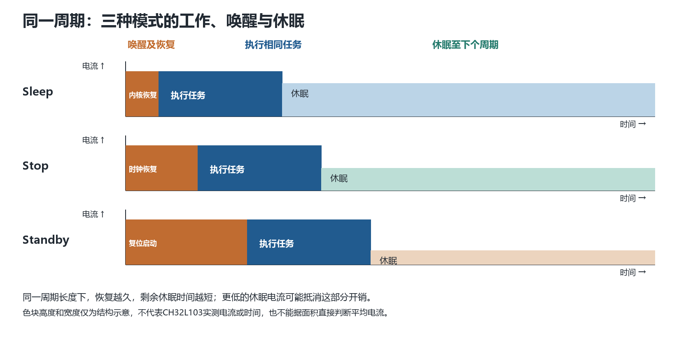
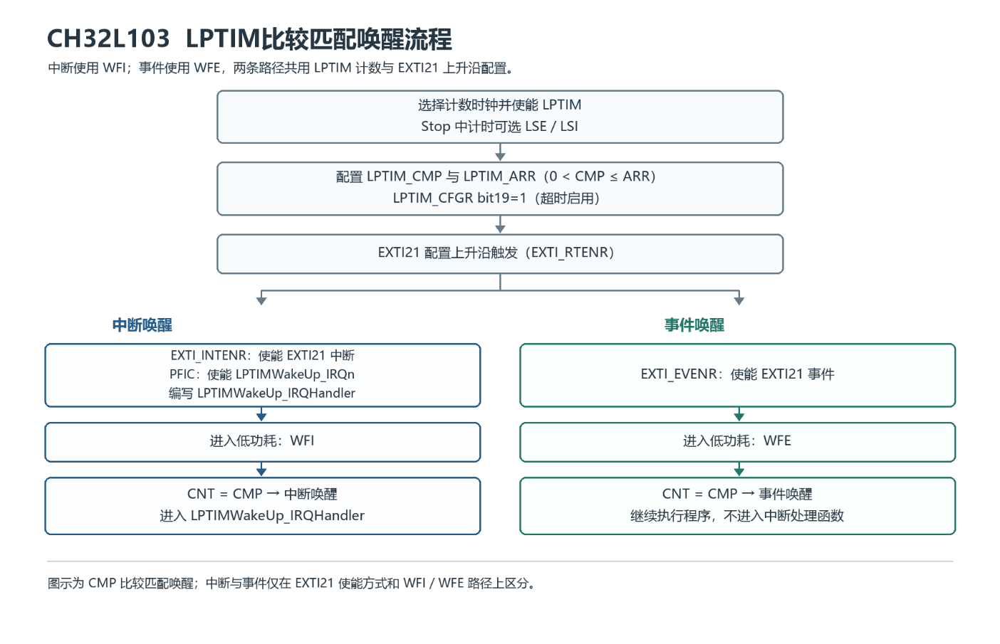
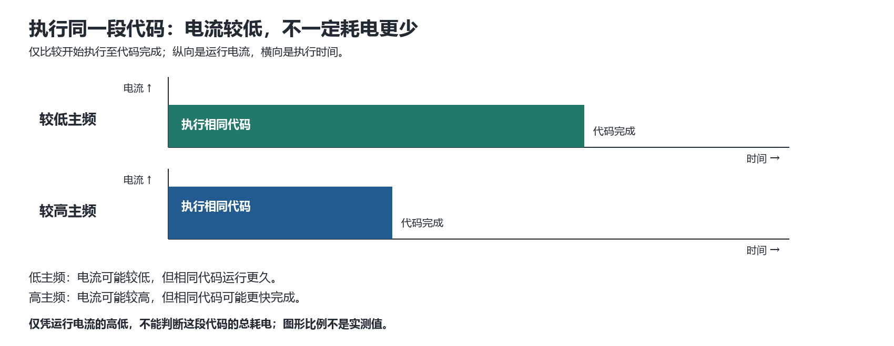
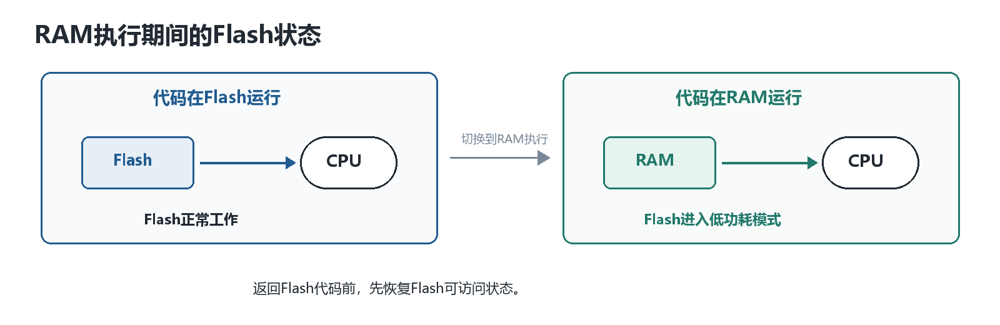

<table>
<colgroup>
<col style="width: 49%" />
<col style="width: 50%" />
</colgroup>
<thead>
<tr>
<th rowspan="2"></th>
<th>AN01002</th>
</tr>
<tr>
<th>V1.0</th>
</tr>
</thead>
<tbody>
</tbody>
</table>

说明

CH32L103 系列是基于 RISC-V
内核的工业级低功耗通用微控制器，集成了多种低功耗模式（Sleep、Stop、Standby）。在实际应用中，系统功耗不仅取决于芯片本身，同时取决于软件对电源模式、时钟系统和外设的合理配置。本文旨在帮助了解
CH32L103
的功耗来源，低功耗模式的选择逻辑及低功耗实现策略。文档涵盖低功耗模式对比、电流来源分析、休眠模式选择指南及运行阶段优化方法。

**适用范围**

| 适用范围 | 系列       |
|----------|------------|
| 通用MCU  | CH32L103等 |

目录

[说明 [1](#_Toc241659234)](#_Toc241659234)

[目录 [2](#_Toc241659235)](#_Toc241659235)

[表格索引 [2](#_Toc241659236)](#_Toc241659236)

[图片索引 [2](#_Toc241659237)](#_Toc241659237)

[第1章 低功耗模式与电流 [1](#低功耗模式与电流)](#低功耗模式与电流)

[1.1 低功耗模式 [1](#低功耗模式)](#低功耗模式)

[1.2 电流来源 [2](#电流来源)](#电流来源)

[1.2.1 运行模式下 [2](#运行模式下)](#运行模式下)

[1.2.2 低功耗模式期间 [2](#低功耗模式期间)](#低功耗模式期间)

[1.3 休眠模式选择 [2](#休眠模式选择)](#休眠模式选择)

[1.3.1 根据工作状态 [2](#根据工作状态)](#根据工作状态)

[1.3.2 完整周期比较 [3](#完整周期比较)](#完整周期比较)

[1.3.3 应用选择示例 [3](#应用选择示例)](#应用选择示例)

[1.4 低功耗模式的定时唤醒-LPTIM
[4](#低功耗模式的定时唤醒-lptim)](#低功耗模式的定时唤醒-lptim)

[第2章 运行阶段优化 [5](#运行阶段优化)](#运行阶段优化)

[2.1 主频与HSI低功耗 [5](#主频与hsi低功耗)](#主频与hsi低功耗)

[2.1.1 按任务类型调整主频 [5](#按任务类型调整主频)](#按任务类型调整主频)

[2.1.2 HSI-LP与HSE-LP [5](#hsi-lp与hse-lp)](#hsi-lp与hse-lp)

[2.1.3 PLL与外设时钟 [5](#pll与外设时钟)](#pll与外设时钟)

[2.2 FLASH与SRAM [5](#flash与sram)](#flash与sram)

[2.3 减少CPU参与时间 [6](#减少cpu参与时间)](#减少cpu参与时间)

[历史版本 [7](#_Toc241659255)](#_Toc241659255)

[声明 [8](#_Toc241659256)](#_Toc241659256)

表格索引

[低功耗模式一览 [1](#_Toc241659257)](#_Toc241659257)

[电流主要消耗 [2](#_Toc241659258)](#_Toc241659258)

图片索引

[三种模式周期任务电流 [3](#_Toc241659259)](#_Toc241659259)

[LPTIM低功耗唤醒配置 [4](#_Toc241659260)](#_Toc241659260)

[不同主频运行电流与持续时间 [5](#_Toc241659261)](#_Toc241659261)

[FLASH进入低功耗 [6](#_Toc241659262)](#_Toc241659262)

# 低功耗模式与电流

## 低功耗模式

不同模式在功耗、唤醒时间、时钟配置和状态保持方面存在显著差异。Stop
模式进一步细分为 Stop1~4，提供不同级别的功耗与 RAM
保持策略。选择模式时，需在功耗、唤醒速度、状态保持三者之间进行权衡。

<table>
<caption>
表 1‑1 低功耗模式一览
</caption>
<colgroup>
<col style="width: 26%" />
<col style="width: 19%" />
<col style="width: 19%" />
<col style="width: 16%" />
<col style="width: 18%" />
</colgroup>
<thead>
<tr>
<th style="text-align: center;">模式与关键配置</th>
<th style="text-align: center;">状态</th>
<th style="text-align: center;">可工作</th>
<th style="text-align: center;">唤醒源</th>
<th style="text-align: center;">唤醒后</th>
</tr>
</thead>
<tbody>
<tr>
<td>Sleep 
SLEEPDEEP=0 
执行 WFI 或 WFE</td>
<td>内核停止运行。其他时钟不因进入 Sleep 自动关闭，SRAM、寄存器和 IO
状态保持。</td>
<td>已使能并获得时钟的外设可继续工作。进入前关闭不用的外设时钟，以减少相应电流。</td>
<td>
WFI：由中断唤醒。

WFE：由唤醒事件唤醒；也可按手册配置由中断相关事件唤醒。
</td>
<td>不复位。WFI 唤醒后先执行中断服务函数；WFE
事件唤醒后继续执行，具体路径取决于事件配置。</td>
</tr>
<tr>
<td>Stop1 
SLEEPDEEP=1，PDDS=0 
LPDS=0；LDO 节能关闭 
执行 WFI 或 WFE</td>
<td rowspan="4">HSE、HSI、PLL 和外设时钟关闭；SRAM、寄存器和 IO
状态保持。Stop1～4 的时钟停止方式相同。</td>
<td rowspan="4">可运行模块：IWDG、RTC、LSI/LSE、LPTIM。</td>
<td rowspan="4">外部中断或事件、PVD 输出、RTC 闹钟事件、USB
唤醒信号、USB PD 唤醒信号、CMP、LPTIM；NRST 也可退出
Stop，但属于复位路径。</td>
<td rowspan="4">非复位唤醒后从原程序继续，HSI 为默认系统时钟；任务需要
HSE、PLL 或特定外设时钟时，由程序重新恢复。NRST 路径执行复位。</td>
</tr>
<tr>
<td>Stop2 
SLEEPDEEP=1，PDDS=0 
LPDS=0；AUTO_LDO_EC=1 或 LDO_EC=1执行 WFI 或 WFE</td>
</tr>
<tr>
<td>Stop3 
SLEEPDEEP=1，PDDS=0 
LPDS=1，RAMLV=0 
进入前 FLASH_LP=10b 
执行 WFI 或 WFE</td>
</tr>
<tr>
<td>Stop4 
SLEEPDEEP=1，PDDS=0 
LPDS=1，RAMLV=1 
进入前 FLASH_LP=10b 
执行 WFI 或 WFE</td>
</tr>
<tr>
<td>Standby 
SLEEPDEEP=1，PDDS=1 
执行 WFI 或 WFE 
进入前 FLASH_LP=10b</td>
<td>HSE、HSI、PLL
和外设时钟关闭，主电压调节器关闭；除唤醒电路与后备域外，其余电路断电。可按配置保持
2 KB、18 KB 或两部分 SRAM；普通寄存器和运行上下文不保留。</td>
<td>IWDG、RTC、LSI/LSE。</td>
<td>WKUP 引脚上升沿、RTC 闹钟事件、NRST、IWDG 复位；EXTI0～EXTI17
的外部事件也可唤醒，这里是外部事件路径，不是普通 EXTI 中断。</td>
<td>所有退出路径均按电源复位流程启动，不从进入 Standby
的位置继续执行。</td>
</tr>
</tbody>
</table>

## 电流来源

CH32L103
的电流消耗可分为动态电流（由内核、总线和数字外设运行引起）和静态电流（由模拟模块、内部调节器和漏电流引起）。在运行模式和低功耗模式下，电流来源及其在总功耗中的占比差异较大。

| 主要来源 | 产生电流主要活动 | 影响电流的配置/条件 |
|----|----|----|
| 内核与总线 | 执行指令、读写寄存器、搬运数据 | 系统主频、HSILP、PLLON |
| 时钟系统 | HSI/HSE、PLL 振荡和时钟分配 | 时钟源、频率、PLL 与模块时钟使能 |
| FLASH与SRAM | Flash 取指和读常量；SRAM 读写与数据保持 | 代码执行位置、Flash 低功耗、RAM 保持范围 |
| 数字与模拟外设 | 外设等模块工作所需电流 | 外设时钟使能、工作时间、工作模式 |
| IO接口 | 输入电路、内部上下拉和输出驱动工作 | 引脚模式、上下拉与输出翻转 |
| 内部供电调节等 | 调节器供电及 SRAM 状态保持 | LDO_EC、LPDS、RAMLV 与保留区域 |

表 1‑2 电流主要消耗

### 运行模式下

运行时，内核的电流消耗主要由取指和数据访问构成。与此同时，时钟信号通过时钟树分发到总线和各已使能的外设，驱动定时器、USART、SPI、I2C等模块工作。程序若反复查询同一状态位而不做有效工作，CPU、Flash和总线仍保持活动，这部分轮询开销不产生实际结果，但电流照常消耗。ADC、CMP等模拟模块在使能时也有独立的电流消耗。

因此，同样的主频下，代码从 Flash 还是 RAM
执行、模块时钟开启、是否反复轮询、IO
是否持续翻转，都会改变运行电流。降低主频可能降低瞬时电流，但也可能延长内核和外设工作的时间；关闭不使用的模块时钟与缩短任务时间解决的是不同来源的功耗。

### 低功耗模式期间

Sleep减少的主要是内核执行相关的活动。Stop保留
SRAM、寄存器、低速计时与唤醒所需电路；不同 Stop 档位还改变内部调节器和
RAM 的供电状态。Standby RTC、唤醒电路以及选中的 SRAM
保持区域仍可能耗电。

## 休眠模式选择

### 根据工作状态

首先考虑休眠期间需要保留哪些功能，唤醒后从哪里继续执行。

Sleep：内核停止，但外设时钟按原配置继续工作。如果休眠期间仍需高速时钟驱动的外设（如
USART 接收、ADC 连续转换、SPI 从机等），Sleep
通常是唯一可用的低功耗模式。

Stop：关闭高速时钟（HSE/HSI/PLL 域），SRAM、寄存器和 IO
状态保持。如果休眠期间只需低速计时（RTC、LPTIM）或事件唤醒（EXTI、CMP、PVD
等），且唤醒后需要从原程序继续执行，Stop 可以考虑。

Standby：主电压调节器关闭，大部分电路断电，可选保持部分
SRAM。唤醒后按电源复位流程启动。只有当唤醒源可用、启动时间可接受，并且程序状态能重建或通过允许的保留方式取得时，Standby
可以考虑。

### 完整周期比较

对周期性任务，以三种模式使用同一任务、同一唤醒周期比较为例，每一周期都包含唤醒与恢复、执行任务、再次休眠三段。Sleep
模式休眠电流较高，但内核恢复快；Stop
的休眠电流介于sleep和standby中间，唤醒后需恢复任务所需时钟和外设；Standby
模式可以进一步降低功耗，却要完成复位启动和状态重建。

<figure>

<figcaption>
图 1‑1 三种模式周期任务电流
</figcaption>
</figure>

图中，横向是时间，纵向是电流。同一周期平均电流取决于三段电流与各自持续时间的共同结果，不单纯比较休眠电流或比较唤醒电流峰值。

周期较短时：恢复与工作占比高，Stop 或 Standby
模式节省休眠电流的时间有限；此时 Sleep 可能得到更低的周期平均电流。

周期拉长：恢复成本分摊到更多休眠时间，Stop
、Standby的低休眠电流更容易形成净收益。

任务几乎不停执行：完整周期中没有足够长的休眠段。此时持续运行并降低运行电流也可进入选择，例如
HSI 低功耗 1 MHz，或 RAM 执行同时使 Flash
进入低功耗。它们改变的是持续工作的电流；与 Sleep、Stop、Standby
比较时，仍以相同任务和相同时间范围内的平均电流为准。

### 应用选择示例

◆
场景：智能门锁在无人操作时处于待机状态，指纹模块需周期性唤醒检测是否有手指按压，检测间隔约200ms~500ms检测一次手指按压。每次检测时间短，检测完成后立即回到休眠。

Stop4关闭HSE/HSI/PLL，仅保留低速模块，SRAM和寄存器内容不丢失，唤醒后从原程序继续，HSI作为默认系统时钟；LPTIM可用LSE或LSI作为计数时钟，二者在Stop模式下仍工作，因此能周期唤醒CPU。Sleep不关闭高速时钟，周期内时钟系统持续耗电；Standby唤醒后按电源复位流程启动，指纹模块需重新初始化。门锁待机时间占绝大部分，检测时间短，Stop4把待机功耗压到最低，LPTIM把周期定时交给硬件，CPU只在检测时短暂工作。Stop4配置为SLEEPDEEP=1、PDDS=0、LPDS=1电压调节器工作在低功耗模式，RAMLV=1
RAM在低电压模式，预置FLASH_LP\[1:0\]=10b。

◆
场景：电池供电的电子墨水屏显示设备，内容更新间隔远大于屏幕刷新时间。刷新完成后，屏幕在断电条件下保持显示内容。设备在两次更新之间没有持续性的计算或通信任务，MCU进入待机模式，等待下一次定时或外部事件唤醒。

MCU进入CH32L103的Standby模式。RTC配置为周期闹钟，作为主要唤醒源。跨复位周期需要保留的数据存放在保持RAM中，通过配置R2KSTY=1保持2KB
RAM不掉电。程序从保持RAM读取数据，通过SPI驱动墨水屏完成刷新，然后再次配置RTC闹钟和RAM保持，进入Standby。若存在外部事件唤醒需求，可将对应引脚配置为EXTI或WKUP唤醒源。

## 低功耗模式的定时唤醒-LPTIM

LPTIM（Low-Power
Timer）是专为超低功耗场景设计的定时器模块。LPTIM的核心价值在于能够在除待机模式外的所有电源模式下运行，以极低的功耗维持计时功能。

LPTIM具有内部-LSE（32.768kHz）、LSI（约40kHz）、HSI或HB时钟和外部LPTIM输入上的外部时钟等多种时钟源。

低功耗模式对LPTIM的影响：

SLEEP模式：无影响，LPTIM中断会导致设备退出睡眠模式。

STOP模式：LPTIM外围设备在由LSE或LSI计时时处于活动状态，LPTIM中断导致设备退出停止模式。

STANDBY模式：LPTIM外围设备已断电，必须在退出待机模式后重新初始化。

CH32L103 LPTIM低功耗唤醒配置流程如下：

<figure>

<figcaption>
图 1‑2 LPTIM低功耗唤醒配置
</figcaption>
</figure>

# 运行阶段优化

## 主频与HSI低功耗

### 按任务类型调整主频

主频提高后，内核与总线每秒运行的时钟周期增多，取指、读写数据等活动更频繁，因而同一配置下的运行电流通常会上升。主频降低时，这部分活动减少，运行电流可能下降；但每个时钟周期更长，同一段代码一般需要更久才能执行完。

<figure>

<figcaption>
图 2‑1 不同主频运行电流与持续时间
</figcaption>
</figure>

运行电流下降的幅度未必与主频下降的幅度相同：在代码执行期间，HSI、Flash、已开启的外设以及内部供电电路仍消耗电流。因此，低主频虽然减小部分运行电流，却让这些电路保持工作更久；降低电流得到的收益，可能被延长的执行时间抵消。反过来，较高主频虽抬高运行电流，只要同一段代码足够快地完成，其执行过程的总耗电也可能更低。

### HSI-LP与HSE-LP

HSI-LP：CH32L103 的 HSI 内部低功耗模式，开启（RCC_CTLR的HSILP位置1）后
HSI 输出由 8 MHz 降为 1 MHz。程序仍可执行，适合需要持续运行、且 1 MHz
已满足执行时间与外设时序的阶段，HSILP可降低这一阶段的运行电流；若程序本来很快就结束，收益取决于低速运行持续的时间。进入
HSILP 时，应将芯片对应的低功耗校准值装入
HSITRIM，并核对串口波特率、定时与软件超时。

HSE-LP：晶体振荡器可以通过RCC_CTRL寄存器将HSELP位置1进入低功耗模式。若外部晶体、时钟精度或启动时间对工作有要求，需在目标配置与工作条件下验证；HSE
未使用时，开启 HSELP 不能代替关闭不用的 HSE。

### PLL与外设时钟

关闭不需要的 PLL。若当前工作和其他功能已不需要 PLL
输出，可在完成时钟切换后关闭 PLL，减少低速运行期间的额外电流。

外设总线按需要分频。CH32L103 可分别配置
HCLK、PCLK1、PCLK2。内核需较高频率时，可把PB总线降到满足接口时序的频率；完全不用的外设则关闭对应模块时钟。

减少重复启动和切换。短任务之间反复启动
PLL、等待稳定或重新初始化外设，可能消耗掉低频运行带来的收益。

RTC的时钟源可在LSE、LSI或HSE/128之间选择。若RTC使用HSE分频作为时钟源，则RTC的持续计时依赖HSE，不能仅为降低运行电流而关闭HSE。长期计时可在初始化时选择满足精度要求的LSE或LSI，避免单为计时保留高速时钟。

## FLASH与SRAM

CH32L103有FLASH
低功耗模式配置位，可以将程序从Flash搬运到RAM中执行，同时通过FLASH_LP配置使Flash进入低功耗模式。这样，CPU持续运行期间不再从Flash取指，Flash的读取活动和静态电流一并降低，运行电流随之下降。该方案结合2.1.2节的HSILP，可进一步降低运行电流。适用于运行时间较长、规模较小、且期间不需要访问Flash的程序段。

<figure>

<figcaption>
图 2‑2 FLASH进入低功耗
</figcaption>
</figure>

## 减少CPU参与时间

在运行阶段，ADC规则组连续采样、USART收发和SPI通信等数据量较大的任务，可以使用DMA完成外设与RAM之间的数据搬运。CPU负责配置DMA通道、传输方向、外设与存储器地址、数据宽度、传输数量及中断条件；传输开始后，DMA根据外设请求完成数据搬运。CPU可在传输过半、传输完成或发生错误时集中处理数据，无需逐个数据读取或写入外设寄存器。

CPU逐项搬运数据时，需要反复读取状态、访问外设寄存器、读写RAM并更新缓冲区位置，同时伴随指令执行、Flash取指和总线访问。改用DMA后，这部分CPU执行和Flash访问可以减少，连续数据传输中的中断次数也可以降低。不过，DMA控制器、外设和总线时钟在传输期间仍然工作，DMA与CPU访问SRAM时也需要仲裁。因此，DMA更适合连续采样、较长数据包或需要循环缓冲的任务；对于数据量很小、传输不频繁的任务，其配置和结束处理开销可能抵消部分收益。

历史版本

| 日期      | 版本 | 变更内容 |
|-----------|------|----------|
| 2026/9/21 | V1.0 | 初版发行 |

声明

本手册仅供参考。作者在不另行通知的情况下，可随时进行修改。
