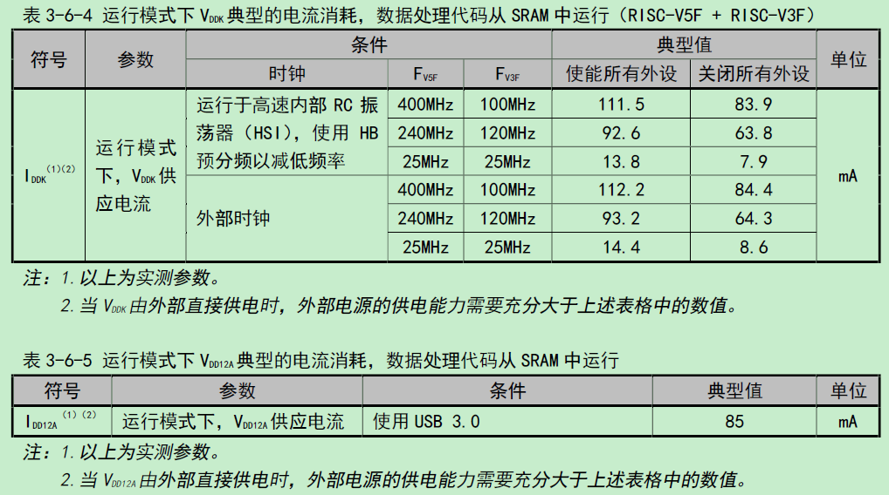
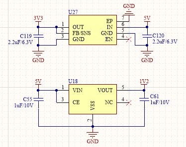
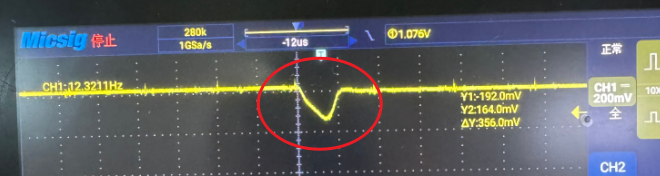

<table>
<colgroup>
<col style="width: 49%" />
<col style="width: 50%" />
</colgroup>
<thead>
<tr>
<th rowspan="2"></th>
<th></th>
</tr>
<tr>
<th></th>
</tr>
</thead>
<tbody>
</tbody>
</table>

说明

在MCU应用开发中，异常复位与死机是影响系统稳定性的常见问题。本文档围绕此类问题的分析思路与排查方法进行说明。内容分为两部分：第一部分以CH32H417为例，介绍一种实际应用中的异常现象及其分析过程；第二部分介绍复位与死机问题的一般分析思路与排查方向，涵盖异常复位与死机情况的定位方法。希望本文档能为开发者排查类似问题提供参考。

**适用范围**

| 适用范围 | 系列     |
|----------|----------|
| 通用MCU  | CH32 MCU |

目录

[说明 [1](#_Toc241659289)](#_Toc241659289)

[目录 [2](#_Toc241659290)](#_Toc241659290)

[表格索引 [2](#_Toc241659291)](#_Toc241659291)

[图片索引 [2](#_Toc241659292)](#_Toc241659292)

[第1章 CH32H417 VDDK外部供电切换异常现象
[1](#ch32h417-vddk外部供电切换异常现象)](#ch32h417-vddk外部供电切换异常现象)

[1.1 背景介绍 [1](#背景介绍)](#背景介绍)

[1.2 异常现象描述 [2](#异常现象描述)](#异常现象描述)

[1.3 原因分析 [2](#原因分析)](#原因分析)

[1.4 总结建议 [2](#总结建议)](#总结建议)

[1.4.1 外部电源必须具备独立承担负载的能力
[2](#外部电源必须具备独立承担负载的能力)](#外部电源必须具备独立承担负载的能力)

[1.4.2 在较低负载阶段完成供电接管
[3](#在较低负载阶段完成供电接管)](#在较低负载阶段完成供电接管)

[1.4.3 以VDDK实际电压作为最终判据
[3](#以vddk实际电压作为最终判据)](#以vddk实际电压作为最终判据)

[第2章 复位与死机排查思路 [4](#复位与死机排查思路)](#复位与死机排查思路)

[2.1 复位来源分析 [4](#复位来源分析)](#复位来源分析)

[2.2 死机定位分析 [5](#死机定位分析)](#死机定位分析)

[历史版本 [7](#_Toc241659304)](#_Toc241659304)

[声明 [8](#_Toc241659305)](#_Toc241659305)

表格索引

[复位标志 [4](#_Toc241659306)](#_Toc241659306)

图片索引

[运行模式下VDDK\VDD12A典型电流消耗 [1](#_Toc241659307)](#_Toc241659307)

[外部1.2V LDO原始电路 [1](#_Toc241659308)](#_Toc241659308)

[异常时VDDK波形 [2](#_Toc241659309)](#_Toc241659309)

# CH32H417 VDDK外部供电切换异常现象

## 背景介绍

在CH32H417系列MCU中，VDD12域（内核及高速外设供电域）通常由内部电压调节器提供电源。为了降低芯片内部调节器承担的电流，芯片支持通过外部电源向VDD12域供电，采用外部供电后，可以降低MCU自身的发热。

需要注意的是内部调节器的电压设定值和VDDK\VDD12A引脚上的实际电压，降低内部电压设定，是为了减少内部调节器的供电贡献；外部电源接管后，VDDK\VDD12A实际电压仍必须保持在芯片规定的工作范围内。芯片数据手册给出的VDDK\VDD12A供电范围为1.17～1.27V，并要求配置相应的引脚退耦电容。

VDD12域由外部直接供电时，供电电压必须严格满足芯片规格要求，外供电源输出电流能力需充分覆盖CH32H417的VDD12域电流总需求，手册中电流消耗数据（图1）参考。VDDK和VDD12A的电流分别取决于：

VDDK电流：与CPU主频、内核活动强相关。是芯片运行模式下的主要功耗来源。

VDD12A电流：与USB3.0和以太网PHY的使用情况相关。USB3.0工作、以太网PHY全双工通信时，VDD12A域电流额外增加。

<figure>

<figcaption>
图 1‑1 运行模式下VDDK\VDD12A典型电流消耗
</figcaption>
</figure>

*使能或关闭所有外设时钟的功耗。*

本案例的外部电源电路：

<figure>

<figcaption>
图 1‑2 外部1.2V LDO原始电路
</figcaption>
</figure>

外部1.2V电源由LDO产生，输入为5V。原电路中，LDO输入端配置1µF电容，输出端配置1µF电容，CE引脚连接输入电源。现场查看MCU的VDDK引脚附近仅配置了0.1µF电容。外部电源在软件执行供电调整之前已经上电。这种电路在静态测量时可以得到正常的1.2V电压，但静态电压正常，并不能说明其能够满足供电接管时的动态要求。

## 异常现象描述

异常发生在供电调整时刻：

设备上电后，MCU可以启动并执行程序，外部1.2V电源的静态输出也正常。但程序运行一段时间后出现异常。进一步定位发现，异常发生在软件降低内电压部调节器设定的阶段。该操作使内部调节器的供电贡献减少，负载转由外部电源承担。从程序执行位置看，故障与电源配置操作紧密相关；从硬件状态看，这一操作恰好改变了内核电源的供电来源。因此，排查重点转向VDDK在供电调整前后的电压变化。

在VDDK处观察到瞬态跌落：

监测VDDK电压发现，外部电源接管时，VDDK出现明显跌落，下降到非正常工作水平，并伴随MCU运行异常。这一测量结果将问题定位到供电接管期间的电源完整性：外部电源虽然已经建立静态输出，但在负载转移过程中，没有将VDDK的电压维持在正常范围内。

<figure>

<figcaption>
图 1‑3 异常时VDDK波形
</figcaption>
</figure>

针对接管时刻的电压跌落，现场进行了两项调整，异常得到改善：

在外部LDO的1.2V输出端额外并联10µF电容；在VDDK引脚附近额外并联2.2µF电容，保留原有0.1µF电容。

## 原因分析

内部调压器减少供电、外部电源需要增加输出电流，承担负载的过程中，原供电网络未能维持VDDK的动态电压稳定，瞬态欠压引起运行异常。

当VDDK跌出保证工作范围时，内核逻辑时序及内部状态的可靠性不再得到保证。即使电压随后恢复，也不能据此认为程序能够正常延续此前的运行状态。LDO输出端增加10µF电容，增强电源节点的短时供电能力。在输出电流调整过程中，电容能够提供暂态所需的部分电流，减小电压变化。此外数据手册中主VDDK引脚除0.1µF外还需并联2.2µF电容。原设计在VDDK附近仅使用0.1µF，也提示设计时应完整落实器件的去耦要求，不能因为采用外部供电就省略引脚附近的电容。

## 总结建议

### 外部电源必须具备独立承担负载的能力

VDD12外部电源应能够独立承担对应供电域的持续负载，并在接管过程中及时建立所需电流。如果完善电容和布局后，VDDK仍有超出允许范围的跌落，应重新评估或更换外部稳压器，重点检查负载瞬态响应、输出被其他电源预先抬高时的工作适用性、限流特性及持续带载能力。电容能够补偿短时电流缺口。

### 在较低负载阶段完成供电接管

软件应在外部电源稳定后，尽量于提高主频、启动高负载外设之前，按照流程完成供电调整，再逐步进入正常工作状态，以减小接管时的电流变化。这一措施有助于降低切换冲击，但不能替代硬件供电能力。

### 以VDDK实际电压作为最终判据

在接管、正常运行和负载变化期间，VDDK均应保持在规定工作范围内，同时避免不可接受的过冲和振荡。外部电源输出端应按照其数据手册要求配置输出电容，并结合实际负载变化评估是否需要增加容量。VDDK
去耦电容应尽量靠近对应电源引脚。

# 复位与死机排查思路

## 复位来源分析

CH32系列内置的控制/状态寄存器RCC_RSTSCKR（地址0x40021024）是异常复位排查的第一入口。该寄存器显示系统复位的所有复位分支。查看复位状态寄存器了解复位大方向，然后做进一步的拆解分析。

| 位     | 含义                      |
|:-------|:--------------------------|
| bit 31 | LPWRRSTF - 低功耗复位     |
| bit 30 | WWDGRSTF - 窗口看门狗复位 |
| bit 29 | IWDGRSTF - 独立看门狗复位 |
| bit 28 | SFTRSTF - 软件复位        |
| bit 27 | PORRSTF - 上电/掉电复位   |
| bit 26 | PINRSTF - NRST引脚复位    |
| bit 24 | RMVF - 清除复位标志       |

表 2‑1 复位标志

        uint32_t rst = RCC->RSTSCKR;
        printf("RSTSCKR=0x%08x\r\n", rst);
        RCC->RSTSCKR |= (1 << 24);  // 清除标志

此寄存器不掉电时所有位不会清零，为防止复位源不明确，需要在下次异常复位前将上次的复位原因清除。通过bit24清除后，所有标志归零，下次复位只记录新发生的复位源。

◆ 上电/掉电复位

芯片内置POR（上电复位）和PDR（掉电复位）电路，该电路始终处于工作状态，确保电源不低于复位电压时正常工作，VDD跌到POR/PDR阈值以下触发复位。可能原因，重点检查：

\(1\)
电源供电能力不足。电机启动、继电器吸合、无线模块发射等，会让同一电源上的负载突然增大，导致电压跌落。留意芯片工作状态变化（提高主频、退出低功耗、开启时钟、增加存储器和总线访问、执行更高活动率的程序导致电流增加；芯片与外部器件同时驱动同一信号且电平相反，或引脚配置错误，可能产生异常电流，电流足够大时会拖低相关电源）。电池电量不足，一带载就明显下降。

\(2\)
稳压器过温保护、触发限流或瞬态响应跟不上负载变化。LDO压差大、负载重、环境温度高或散热不足时，可能进入过温保护，若问题表现为运行一段时间后出现、降温后恢复，检查温度与掉电时刻的对应关系。负载电流或启动电流超过允许范围后，稳压器可能降低输出电压来限流，需核对器件的限流机制、阈值范围和恢复条件。负载电流快速增加时，稳压器需要时间调整，输出电容先提供差额电流，输出电压可能短时下降。

\(3\)
供电路径及芯片VDD端电压。线缆、连接器或接插件带载压降大，PCB供电路径或焊接连接问题等导致芯片端电压低于正常工作电压。

\(4\)
电源支路存在短路、漏电或保护器件导通。外围器件损坏、焊锡桥连、导电异物、线缆破损等，可能形成持续或间歇性负载。接口上的过压或瞬态事件可能使保护器件导通，影响芯片供电。

\(5\)
电容配置(电容漏装、装错、虚焊或损坏)。容量错误、焊接断开、开裂、漏电或短路，可能会影响供电。核对实际器件和焊接状态，电容短路或漏电还可能表现为额外负载。

\(6\)
软件与操作不当。软件误操作电源控制引脚，改变电源使能、负载开关或外部电源管理信号。负载尚未降低就切换到低功耗供电模式，或供电尚未恢复就唤醒大量负载，可能造成短时供电能力不足。

◆ 看门狗复位

\(1\)
检查下载代码时（ISP下载或者SWD上位机WCH-LinkUtility下载）是否误勾选了硬件看门狗选项。如果勾选了此选项，会硬件开启看门狗，若代码没有喂狗会一直处于看门狗复位状态。

\(2\)
看门狗复位可能是程序异常后的结果。建议检查复位前是否进入过异常处理函数、默认中断处理函数或错误等待循环。程序停在这些位置后无法继续喂狗，最终同样会触发看门狗复位。对于偶发、运行较长时间后出现，或由特定数据触发的问题，建议检查数组和缓冲区是否越界、指针是否有效、栈空间是否足够，以及DMA地址和传输长度是否正确。

◆ NRST引脚复位

用万用表或示波器测量NRST引脚对地电压。如果电压持续为低电平，芯片会一直处于复位状态无法启动。确认上拉电阻是否漏焊、虚焊或阻值错误。如果复位与电机启停、接口插拔或其他设备切换有关，建议同步观察NRST与相关动作信号，确认复位线上是否出现了足以触发复位的低电平脉冲。

◆ 软件复位

此复位由客户代码中添加，一般属于客户正常复位逻辑，但是有时会忘记自己的逻辑，需要留意，在工程中全局搜索NVIC_SystemReset，找到所有调用点。此外还需关注HardFault异常处理中的软件复位：如果HardFault处理函数中包含了软件复位逻辑，那么任何导致HardFault的异常（如指针越界、堆栈溢出）最终都会表现为软件复位。排查时需结合HardFault的异常信息进一步定位根因。

◆ 待机模式唤醒的上下电复位

用户选择字处有设置进入待机模式下自动复位的特性，一旦该配置被使能，芯片在进入待机后会自动复位，客户测试时便无法维持待机状态，因此也就测不到真实的待机功耗。解决方法使用ISP工具或者WCH-LinkUtility工具，选择低功耗下不复位即可。

## 死机定位分析

◆ hardfault异常追踪

当程序发生异常（如非法指令、总线错误、对齐错误）时会进入HardFault_Handler异常中断。RISC-V内核在进入异常时会自动将现场信息保存到三个CSR寄存器中：通过这三个寄存器，通常可以定位到某一行代码和具体的错误原因。在HardFault_Handler处理函数中增加寄存器打印：

    void HardFault_Handler(void)
    {
        printf("HardFault!\r\n");
        printf("mcause=0x%08x\r\n", __get_MCAUSE());
        printf("mtval=0x%08x\r\n", __get_MTVAL());
        printf("mepc=0x%08x\r\n", __get_MEPC());
        while(1);
    }

mcause：用于标识异常或中断的类型。

mepc：用于记录异常发生时的指令地址，或中断发生时的返回地址；具体含义需结合mcause的bit\[31\]判断（bit\[31\]=0为异常，bit\[31\]=1为中断）。

mtval：用于提供与异常相关的附加信息，可能为出错访问地址或非法指令编码，其他异常情况下通常为0。

示例：

        uint8_t data[10];
        for (int i = 0; i < 10; i++)
        {
            printf("%x ", *(uint16_t *)(data + i));
        }

程序运行后进入HardFault。通过串口打印异常寄存器，得到以下信息：

寄存器解读：

mcause：值0x00000004，表示Load地址不对齐。

mtval：值0x20007fe5，出错的访问地址，末尾为5（奇数），不满足2字节对齐。

mepc：值0x000001e8，触发异常的指令地址。

查看.lst反汇编文件，查找地址1e8，对应指令为：

    1e8: ff47d583    lhu a1, -12(a5)

定位到问题原因是：data是uint8_t数组，起始地址为偶数（如0x20007fe4）。当i使得data+i为奇数地址时，强制转换为uint16_t\*后用lhu读取16位，触发Load地址不对齐异常。

◆ 程序停在循环等待处

程序无法跳出循环，不再继续运行。这个循环可能是用户自己写的等待逻辑，也可能是库函数内部的等待循环，例如等待时钟稳定、等待外设标志位置位、等待超时计数结束等。常见的例如外设时钟未使能、外设未正确初始化、硬件未连接或引脚配置错误，导致类似while(FLAG==RESET)的条件永远成立。等待的中断事件永远不会发生，例如中断未使能、中断优先级配置错误，导致负责置位标志的中断根本没有执行。循环变量未加volatile，如果变量由中断修改，但主循环中未使用volatile修饰，编译器可能将其优化为常量，导致循环条件永远成立。

◆ 偶发性

偶发死机且无HardFault、无复位时，排查的关键是找到影响复现的条件。建议尝试改变单一条件，观察死机频率是否随之变化。可改变的条件包括：主频、供电电压、环境温度、运行时长、时钟源、外设开关、中断频率、DMA使用、代码运行位置等。若某个条件能显著影响复现率，说明问题与该条件相关，排查方向即可围绕该条件展开。例如：

提高主频死机变频繁：可以重点检查电源动态响应、去耦电容、时钟配置、Flash等待周期、供电纹波，确认是否在芯片规定的工作电压和频率范围内。主频升高，负载电流变化率增大，供电路径寄生电感上的瞬时压降变大。若稳压器响应跟不上，输出电压会在调整前跌落，让芯片工作电压低于要求的正常值，导致内部时序出现偶尔的错误，从而引发死机；CPU主频提高后，Flash取指时间相对缩短。若等待周期未同步增加，CPU会在数据准备好前采样，读到错误指令。

换用外部稳压源后死机消失：重点检查板上电源电路的稳定性和供电能力、供电路径压降、去耦布局和接地回路。

通过这些条件对比，逐步缩小问题范围。若始终无法找到影响复现的条件，说明问题可能依赖于多个因素的组合，或尚未被识别的条件。此时建议回到原始环境，通过IO翻转或串口打印记录程序执行轨迹，定位死机前最后执行到的函数或代码段。再结合芯片手册分析该操作对应的硬件行为，逐步缩小范围。

历史版本

| 日期      | 版本 | 变更内容 |
|-----------|------|----------|
| 2026/9/24 | V1.0 | 初版发行 |

声明

本手册仅供参考。作者在不另行通知的情况下，可随时进行修改。
