<table>
<colgroup>
<col style="width: 49%" />
<col style="width: 50%" />
</colgroup>
<thead>
<tr>
<th rowspan="2"></th>
<th></th>
</tr>
<tr>
<th></th>
</tr>
</thead>
<tbody>
</tbody>
</table>

说明

关于417双核芯片的中断，其部分使用方式有别于单核的芯片。主要在使能，权限分配，以及中断使用等方面。中断涉及寄存器主要是PFIC，双核芯片中增加了许多寄存器有着特殊功能。

**适用范围**

| 适用范围 | 系列       |
|----------|------------|
| 通用MCU  | CH32H417等 |

目录

[说明 [1](#_Toc236472713)](#_Toc236472713)

[目录 [2](#_Toc236472714)](#_Toc236472714)

[图片索引 [2](#_Toc236472715)](#_Toc236472715)

[第1章 中断的使能与权限分配
[1](#中断的使能与权限分配)](#中断的使能与权限分配)

[1.1 中断使能与状态读取 [1](#中断使能与状态读取)](#中断使能与状态读取)

[1.2 中断挂起状态读取 [2](#中断挂起状态读取)](#中断挂起状态读取)

[1.3 中断配置与全局状态寄存器
[2](#中断配置与全局状态寄存器)](#中断配置与全局状态寄存器)

[1.4 VTF中断 [2](#vtf中断)](#vtf中断)

[1.5 中断优先级阈值配置 [3](#中断优先级阈值配置)](#中断优先级阈值配置)

[1.6 中断挂起与状态清除 [3](#中断挂起与状态清除)](#中断挂起与状态清除)

[1.7 中断优先级与中断分配
[4](#中断优先级与中断分配)](#中断优先级与中断分配)

[第2章 内核的睡眠与唤醒 [6](#内核的睡眠与唤醒)](#内核的睡眠与唤醒)

[2.1 内核唤醒事件 [6](#内核唤醒事件)](#内核唤醒事件)

[2.2 内核本地唤醒 [6](#内核本地唤醒)](#内核本地唤醒)

[2.3 内核间唤醒 [6](#内核间唤醒)](#内核间唤醒)

[历史版本 [8](#_Toc236472728)](#_Toc236472728)

[声明 [9](#_Toc236472729)](#_Toc236472729)

图片索引

[中断使能寄存器 [1](#_Toc236472730)](#_Toc236472730)

[中断使能状态寄存器 [1](#_Toc236472731)](#_Toc236472731)

[中断使能清除寄存器 [1](#_Toc236472732)](#_Toc236472732)

[中断挂起状态寄存器 [2](#_Toc236472733)](#_Toc236472733)

[中断配置寄存器 [2](#_Toc236472734)](#_Toc236472734)

[中断全局状态寄存器 [2](#_Toc236472735)](#_Toc236472735)

[VTF中断寄存器 [3](#_Toc236472736)](#_Toc236472736)

[中断优先级阈值配置寄存器 [3](#_Toc236472737)](#_Toc236472737)

[中断挂起设置寄存器 [3](#_Toc236472738)](#_Toc236472738)

[中断挂起清除寄存器 [4](#_Toc236472739)](#_Toc236472739)

[中断优先级配置寄存器 [4](#_Toc236472740)](#_Toc236472740)

[INTSYSCR 寄存器 [4](#_Toc236472741)](#_Toc236472741)

[中断权限分配寄存器 [5](#_Toc236472742)](#_Toc236472742)

[中断权柄查询寄存器 [5](#_Toc236472743)](#_Toc236472743)

[PFIC 事件使能寄存器 [6](#_Toc236472744)](#_Toc236472744)

[SCTLR 寄存器 [7](#_Toc236472745)](#_Toc236472745)

# 中断的使能与权限分配

中断是相对内核来讲，作用是处理特殊任务。双核芯片重要的是使能与中断权限的分配。其中中断又分为私有和公有，对于私有中断，即不同内核所拥有的中断权限独立，如hardfault等。一般的外设中断为公有中断，即不同内核均享有处理该中断的权限，但是同时只能有一个内核享有此权限。

## 中断使能与状态读取

H417的双核芯片中，低32位为私有中断，对应中断号0~31，从32号开始，后续中断为公有中断。中断使能寄存器PFIC-\>IENR1，如下图1-1所示，中断编号0~11默认使能，12~31号中断可使能。

<figure>
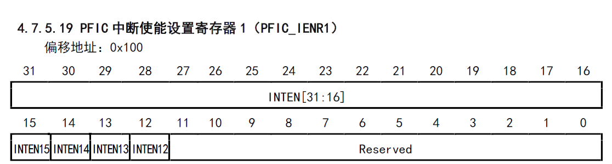
<figcaption>
图 1‑1 中断使能寄存器
</figcaption>
</figure>

中断使能状态可以通过寄存器读取PFIC-\>ISR1，如图1-2所示。

<figure>
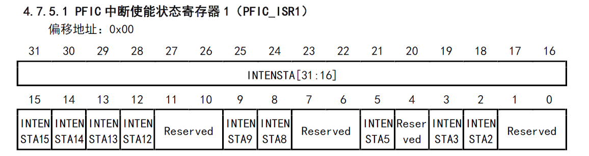
<figcaption>
图 1‑2 中断使能状态寄存器
</figcaption>
</figure>

中断关闭寄存器PFIC-\>IRER1，如图1-3所示

<figure>
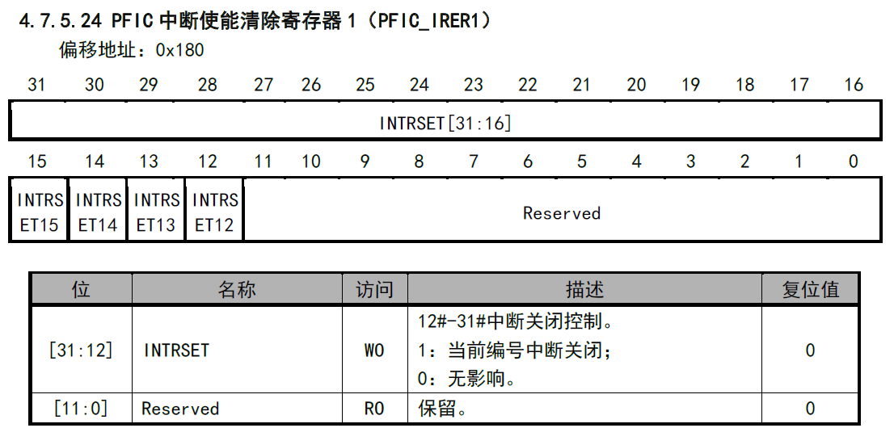
<figcaption>
图 1‑3 中断使能清除寄存器
</figcaption>
</figure>

使能中断函数调用：

    NVIC_EnableIRQ(WWDG_IRQn);

查询中断使能状态函数调用：

    NVIC_GetStatusIRQ(WWDG_IRQn);

关闭中断函数调用：

    NVIC_DisableIRQ(WWDG_IRQn);

## 中断挂起状态读取

<figure>
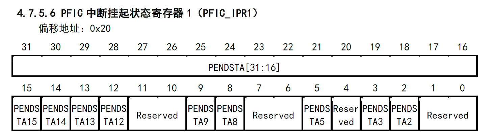
<figcaption>
图 1‑4中断挂起状态寄存器
</figcaption>
</figure>

通过中断挂起状态寄存器读取当前中断状态，寄存器如图1-4所示。函数调用如下：

    NVIC_GetPendingIRQ(WWDG_IRQn);

## 中断配置与全局状态寄存器

<figure>
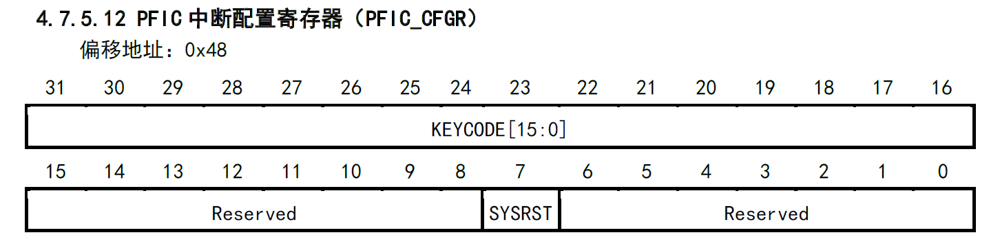
<figcaption>
图 1‑5 中断配置寄存器
</figcaption>
</figure>

CFGR寄存器如图1-5，主要功能实现系统复位，bit\[7\]置1，同时需要在在bit\[31:16\]写入对应key，对应key值为0xBEEF。

<figure>
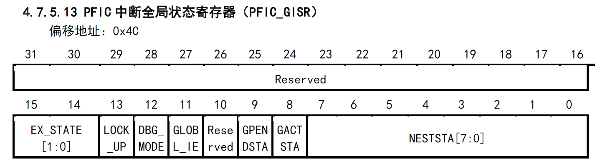
<figcaption>
图 1‑6 中断全局状态寄存器
</figcaption>
</figure>

GISR寄存器如图1-6，为内核私有寄存器，可以获取内核运行状态bit\[15:14\]，查询内核锁定状态bit\[13\]，内核调试状态bit\[12\]，查询全局中断使能状态bit\[11\]，查询当前是否有中断处于挂起或者执行bit\[9:8\]，查询当前中断嵌套状态bit\[7:0\]。

## VTF中断

VTF相关寄存器同样为内核私有，即每个内核都可以配置4组免表中断。

PFIC-\>VTFIDR为对应4组中断的编号，PFIC-\>VTFADDRRx
(x=0,1,2,3)寄存器，为对应中断组的回调函数地址bit\[31:1\]以及使能位bit\[0\]。VTFADDRR寄存器如图1-7所示。

<figure>
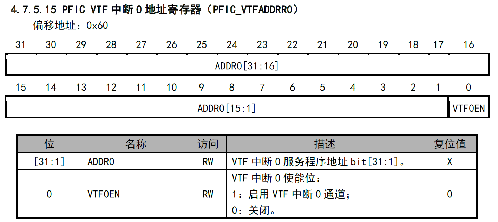
<figcaption>
图 1‑7 VTF中断寄存器
</figcaption>
</figure>

VTF设置函数调用：

    SetVTFIRQ((u32)WWDG_IRQHandler,WWDG_IRQn,0,ENABLE);

## 中断优先级阈值配置

配置中断优先级时，可以设置优先级的高阈值，设置成功后，优先级低于该阈值的中断挂起后不会执行中断服务函数，相应寄存器如图1-8，为内核私有寄存器。寄存器复位值为0，默认关闭阈值功能。

<figure>
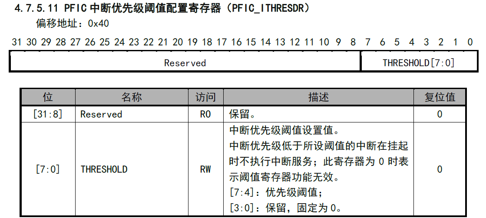
<figcaption>
图 1‑8 中断优先级阈值配置寄存器
</figcaption>
</figure>

## 中断挂起与状态清除

中断挂起可以通过写IPSR对应位，寄存器如图1-9，中断号前31为私有寄存器，其余双核均可配置。

<figure>
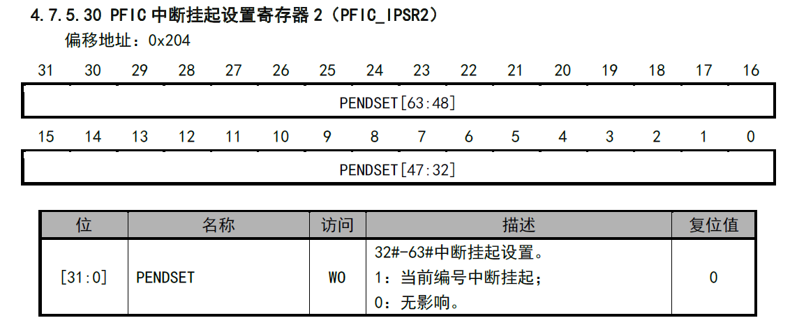
<figcaption>
图 1‑9 中断挂起设置寄存器
</figcaption>
</figure>

清除中断挂起状态，可以配置IPRR寄存器，如图1-10所示，对应位置1清除中断挂起。

<figure>
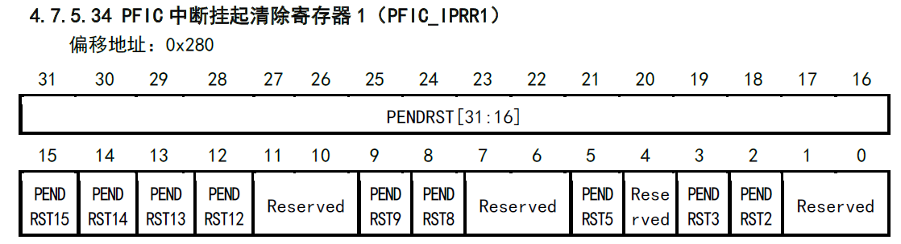
<figcaption>
图 1‑10 中断挂起清除寄存器
</figcaption>
</figure>

中断挂起函数：

    NVIC_SetPendingIRQ(WWDG_IRQn);

清除中断挂起函数：

    NVIC_ClearPendingIRQ(WWDG_IRQn);

## 中断优先级与中断分配

中断优先级通过寄存器PFIC_IPRIORx
(x=0~63)配置，私有中断（编号0~31）的优先级私有，剩余公有中断的优先级内核可以自行配置。如图1-11所示，根据CSR（0x804
bit\[3:1\]）寄存器的值，中断有不同的抢占与响应配置位，0x804寄存器可以在启动文件修改配置。

<figure>
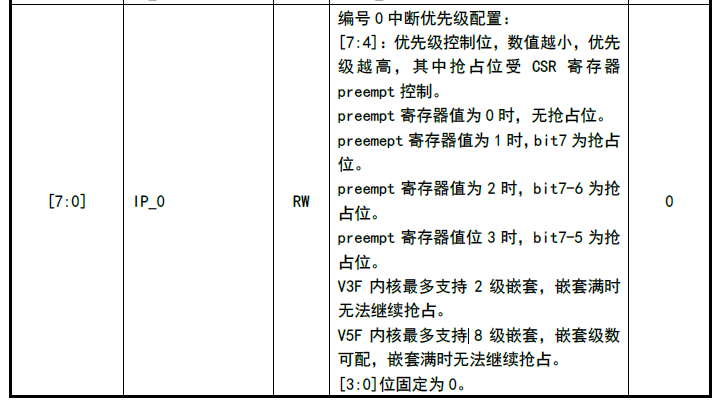
<figcaption>
图 1‑11 中断优先级配置寄存器
</figcaption>
</figure>

如图1-12，当0x804
bit1为0时关闭嵌套功能，则不分配抢占优先级配置位，响应优先级配置位bit\[7:4\]。只有嵌套功能使能，抢占位个数才有效。比如抢占位个数配置成2，即bit\[3:2\]值为10b，这时PFIC_IPRIOR抢占配置位bit\[7:6\]，剩余的bit\[5:4\]为响应配置位。

<figure>
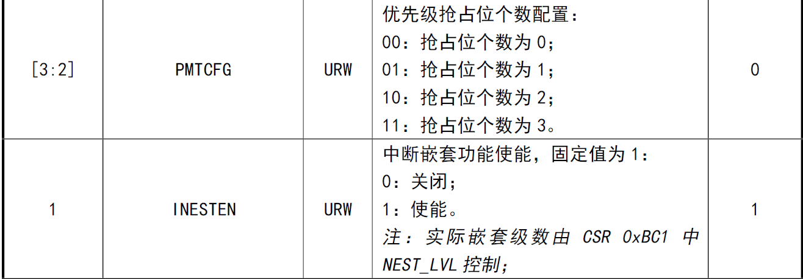
<figcaption>
图 1‑12 INTSYSCR 寄存器
</figcaption>
</figure>

同样中断权限可以通过寄存器分配。IALLOCR寄存器描述如图1-13所示。IALLOC_0~31为只读，对应前31号中断。编号32号后的中断可配置，同样权限可以由内核使能中断自动获取，并且IALLOC_x寄存器会更新保存内核ID。在中断发生前可以操作IALLOCR手动修改触发权限。

<figure>
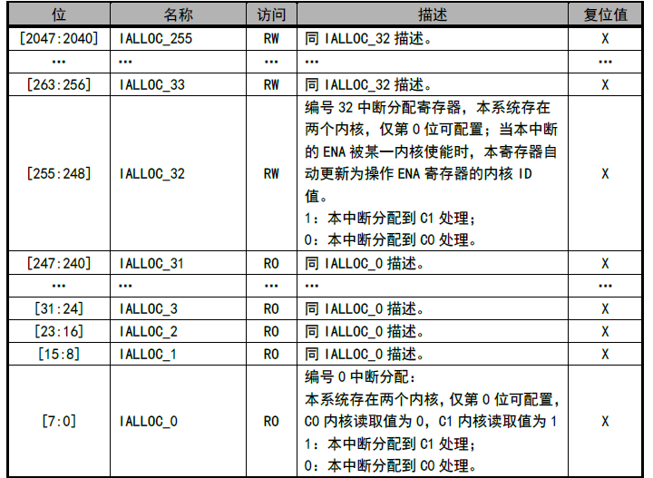
<figcaption>
图 1‑13 中断权限分配寄存器
</figcaption>
</figure>

查询中断分配，还可以通过内核私有寄存器IAUTR，如图1-14所示，返回当前中断的权柄，判断是否由本内核响应中断。

<figure>
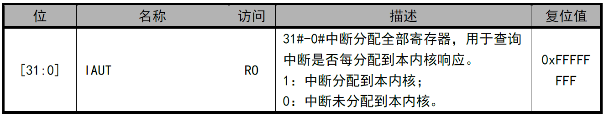
<figcaption>
图 1‑14 中断权柄查询寄存器
</figcaption>
</figure>

中断优先级设置函数：

    NVIC_SetPriority(WWDG_IRQn, 1<<4);

设置中断权限函数：

    NVIC_SetAllocateIRQ(WWDG_IRQn, Core_ID_V3F);

获取当前中断权限：

    NVIC_GetAllocateIRQ(WWDG_IRQn);

内核获取中断权柄函数：

    NVIC_OwnCoreGetAllocateIRQ(WWDG_IRQn);

# 内核的睡眠与唤醒

## 内核唤醒事件

内核的睡眠与唤醒可以在主要内核工作下睡眠次要内核，或者双核同时睡眠，达到降低功耗的目的，并且在需要工作的情况下能够主动唤醒。

内核唤醒事件可以通过寄存器配置，如图2-1所示。根据唤醒源来源，可以分为内核本地唤醒和内核间唤醒，默认均开启，可以根据实际需求关闭唤醒事件。常用的唤醒事件为中断挂起（#10），内核接收（#12），系统事件（#13）。内核唤醒后可以通过EWUPR寄存器查看唤醒源。

<figure>
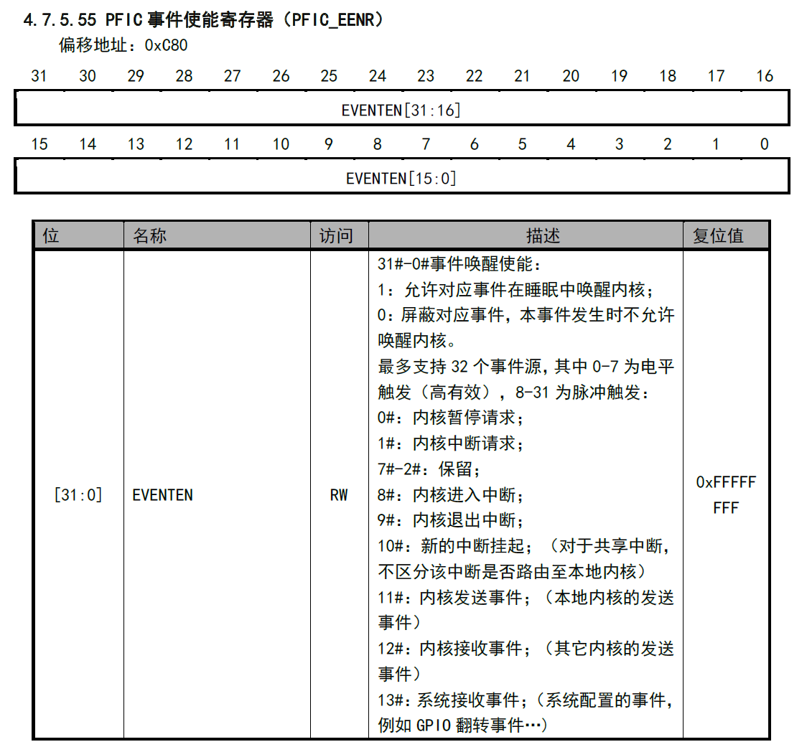
<figcaption>
图 2‑1 PFIC 事件使能寄存器
</figcaption>
</figure>

## 内核本地唤醒

内核的本地唤醒，可以选择WFI或者WFE进睡眠，唤醒条件可以是中断或者事件，如果是中断对应唤醒事件为#10，如果是事件则对应唤醒事件为#13。需要注意的是，事件唤醒，本地内核需要设置唤醒内核ID，即唤醒事件于唤醒内核一一对应，以达到分别唤醒的目的，主要代码如下。

    __WFE_IDSET(EXTI_Line0);

## 内核间唤醒

内核间唤醒，只能通过WFE方式进入睡眠，唤醒条件可以是中断或者事件。需要注意的是如果是中断唤醒，内核睡眠前需要将SCTLR
寄存器bit4置1，将所有挂起中断当作事件唤醒系统，寄存器如图2-2所示。

<figure>
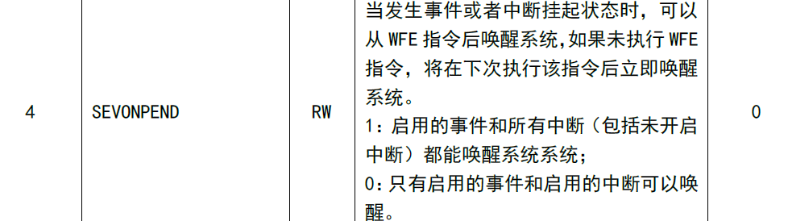
<figcaption>
图 2‑2 SCTLR 寄存器
</figcaption>
</figure>

历史版本

| 日期      | 版本 | 变更内容 |
|-----------|------|----------|
| 2026/7/15 | V1.0 | 初版发行 |

声明

本手册仅供参考。作者在不另行通知的情况下，可随时进行修改。
