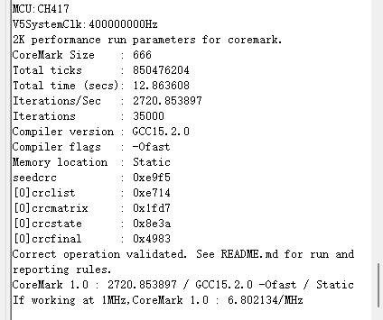
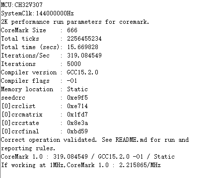
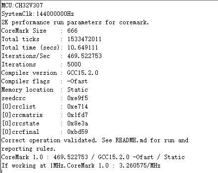
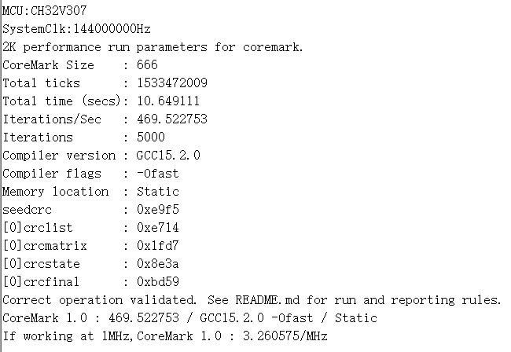
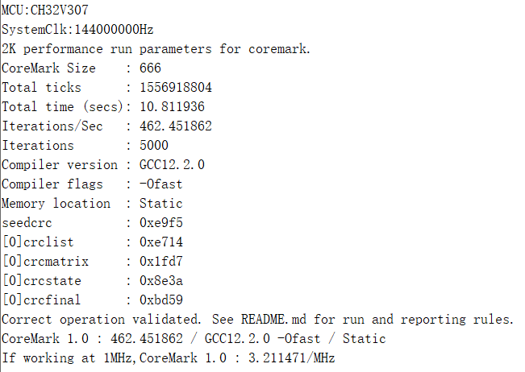
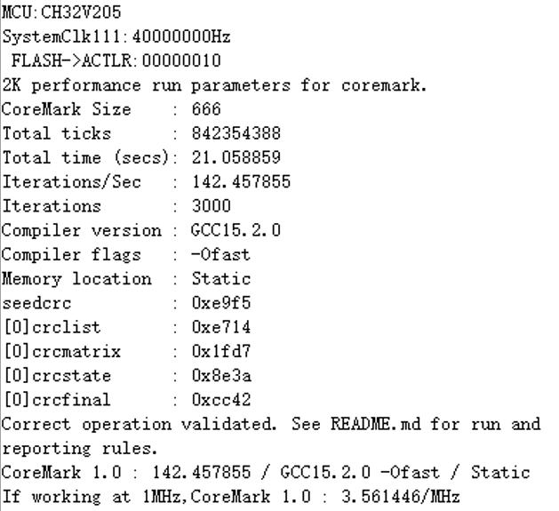
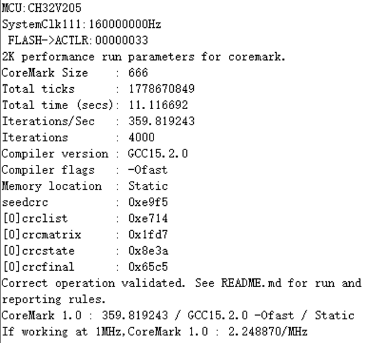

V1.0

# 说明

CoreMark是由EEMBC于2009年推出的嵌入式处理器性能评测标准，旨在取代过时的Dhrystone，现已成为业界公认的MCU性能衡量基准。

CoreMark通过运行三种核心算法评估处理器效率：矩阵运算（加减乘除及乘向量）、链表操作（排序与CRC校验）和状态机迁移（循环与分支控制）。测试代码量约2KB，数据量16KB，最终以Iterations/Sec（每秒迭代次数）作为输出结果，要求测试时长不少于10秒以确保准确性。

CoreMark得分受多种因素影响。编译器优化等级是最关键因素之一，从-O1到-Ofast，性能差异显著。特定优化选项如循环展开（-funroll-all-loops）、函数内联（-finline-limit）和指令调度（-fselective-scheduling）可进一步提升跑分。此外，不同GCC版本也会带来约1.5%的性能差异。

内存配置同样至关重要。RAM可实现零等待访问，而Flash读取较慢，高频下需插入等待周期，导致性能下降。将核心代码放入RAM执行可显著提升跑分。

适用范围

| 适用范围 | 系列                       |
|----------|----------------------------|
| 通用MCU  | CH32V307/CH32H417/CH32V205 |

目录

[说明 [i](#说明)](#说明)

[目录 [ii](#_Toc207035732)](#_Toc207035732)

[表格索引 [ii](#_Toc207035733)](#_Toc207035733)

[图片索引 [ii](#_Toc207035734)](#_Toc207035734)

[第1章 Coremark介绍 [3](#coremark介绍)](#coremark介绍)

> [1.1 Coremark简介 [3](#coremark简介)](#coremark简介)
>
> [1.2 Coremark测试内容 [3](#coremark测试内容)](#coremark测试内容)
>
> [1.3 Coremark测试结果 [3](#coremark测试结果)](#coremark测试结果)

[第2章 Coremark影响因素 [5](#coremark影响因素)](#coremark影响因素)

> [2.1 编译器/优化等级 [5](#编译器优化等级)](#编译器优化等级)
>
> [2.1.1 优化选项的直接影响
> [5](#优化选项的直接影响)](#优化选项的直接影响)
>
> [2.1.2 编译器版本差异 [6](#编译器版本差异)](#编译器版本差异)
>
> [2.2 内存系统配置 [6](#内存系统配置)](#内存系统配置)

[历史版本 [8](#历史版本)](#历史版本)

[声明 [9](#_Toc207035742)](#_Toc207035742)

表格索引

[表 1‑1 CoreMark文件 [3](#_Toc238218081)](#_Toc238218081)

[表 2‑1 GCC编译器设置 [5](#_Toc238218082)](#_Toc238218082)

图片索引

[图 1‑1 CH32H417 V5_CoreMark结果 [4](#_Toc214359258)](#_Toc214359258)

[图 2‑1 CH32V307 不同优化选项CoreMark结果
[5](#_Toc238218084)](#_Toc238218084)

[图 2‑2 CH32V307 不同编译器版本Coremark
[6](#_Toc238218085)](#_Toc238218085)

[图 2‑3 CH32V205 CoreMark 不同内存配置
[7](#_Toc238218086)](#_Toc238218086)

#  Coremark介绍

## Coremark简介

CoreMark是用来衡量嵌入式微控制器MCU性能的标准。

CoreMark由EEMBC(Embedded Microprocessor Benchmark
Consortium)于2009年提出并开发。用于替换过时的Dhrystone标准。目前该标准已经成为测量与比较各类处理器的业界标准测试。Coremark通过运行一组算法（2K代码，16K数据）来评估MCU
内核的效率。通过单位时间内同一组算法在不同MCU上运行的次数，来对比性能，Coremark得分越高意味着MCU性能越好。

## Coremark测试内容

Coremark工作负载主要包括三种常用的算法：

矩阵操作：Coremark中矩阵相关的实现在core_matrix.c文件中，在main函数中检测到需要进行矩阵测试的时候，调用core_init_matrix()函数来完成矩阵的初始化操作，然后使用函数matrix_test()来做测试，具体的测试为：为矩阵所有元素加上一个常数、矩阵乘一个常数、矩阵乘向量、矩阵乘矩阵、再次为矩阵所有元素加一个常数，之后将矩阵元素还原。

列表操作：Coremark中列表相关的实现在core_list_join.c文件中，在main函数中检测到需要进行列表测试的时候，会调用core_list_init()函数，core_list_init()函数会完成列表相关的初始化处理，之后会调用core_bench_list()函数来完成列表的排序、CRC校验的计算并恢复列表数据项。

状态机操作：Coremark中状态机相关的实现在core_state.c文件中，在main函数中检测到需要进行状态机测试的时候，调用core_bench_state()函数来完成状态机测试，测试函数为core_bench_state()，状态机的实现函数为core_state_transition()，core_state_transition()的函数实现与嵌入式中常采用的状态机实现一致，即使用for/while来做循环控制，使用switch
case来做状态迁移控制。

| 文件             | 功能                         |
|------------------|------------------------------|
| core_main.c      | 主程序                       |
| core_state.c     | 状态机相关函数               |
| core_list_join.c | 列表相关函数                 |
| core_matrix.c    | 矩阵相关函数                 |
| core_util.c      | CRC相关函数                  |
| coremark.h       | 配置定义、开关及相关数据结构 |

表 ‑ CoreMark文件

## Coremark测试结果

CoreMark输出结果为Interation/Sec，即每秒钟跑了多少次coremark测试（其中测试时间不少于10s）。这和MCU主频有关，所以我们评判一个MCU性能时，会将其对齐到每MHZ，即我们看到的更多的是Interation/Sec/MHZ，即最后需要的结果CoreMark/Mhz。

对比整体性能使用Iterations/Sec

对比不同MCU性能使用coremark/Mhz

例如CH32H417 Qingke
V5内核在400Mhz主频下，ITCM中运行Coremark跑分是2720.853897，每MHZ结果为2720.853897
/（400/1）= 6.802134 coremark/Mhz。

<figure>

<figcaption>
图 ‑
CH32H417 V5_CoreMark结果
</figcaption>
</figure>

#  Coremark影响因素

## 编译器/优化等级

CoreMark和编译器息息相关。编译器负责将C代码翻译成机器指令，而不同编译器、不同优化选项生成的指令在效率和顺序上天差地别。

### 优化选项的直接影响

除了编译器本身，传给编译器的“参数”（优化选项）也至关重要。现代编译器（如
GCC）提供了不同的优化级别，如 -O1、-O2、-O3、-Ofast 等。优化级别越高，编译器就越激进地尝试用更快的指令替换原有逻辑。

性能提升：通常情况下，开启更高级别优化能显著提升 CoreMark
分数。例如，CH32V307启用 –O1 ，跑分达到 **319.084549**。CH32V307启用 –Ofast ，跑分达到 **319.084549**。

图 ‑ CH32V307
不同优化选项CoreMark结果

沁恒通过设置GCC编译器的命令行选项-funroll-all-loops -finline-limit=600
-ftree-dominator-opts -fno-if-conversion2 -fselective-scheduling
-fno-code-hoisting，来控制编译器优化C代码。

| 编译选项 | 作用 |
|----|----|
| **-funroll-all-loops** | **循环展开**：将循环体内的代码复制多次，以减少或消除循环控制（如判断循环条件、跳转）的开销。 |
| **-finline-limit=600** | **函数内联**：当函数代码大小小于600个单位时，编译器会尝试将函数调用处直接替换为函数本身的代码，避免调用和返回的开销。 |
| **-ftree-dominator-opts** | **支配树优化**：一种高级的代码分析技术，用于消除冗余计算，比如将循环内结果不变的表达式提到循环外面。 |
| **-fno-if-conversion2** | **禁用第二次条件转换**：不让编译器将某些条件分支（如if语句）转换为算术指令或条件执行指令。 |
| **-fselective-scheduling** | **选择性指令调度**：编译器会尝试在不改变程序逻辑的前提下，重新排列指令的顺序，以更好地利用CPU的多个执行单元，减少“流水线停顿”。 |
| **-fno-code-hoisting** | **禁用代码上提**：不让编译器将循环内不变的计算提前到循环外面执行。这与-ftree-dominator-opts的效果有点像，但更激进 |

表 ‑ GCC编译器设置

Coremark是一个计算密集型、循环多、函数调用频繁的测试代码。

-funroll-all-loops把循环打开，减少分支跳转，CPU流水线跑的更满。

-finline-limit=600把小函数内联，消除函数调用开销。

-fselective-scheduling重排指令隐藏内存访问延迟。

### 编译器版本差异

即使都是
GCC，不同版本的性能也有区别。随着新版本的发布，编译器会加入对新架构的更好支持和新优化技术。例如，在测试
CH32V307 芯片时，GCC 15 相比 GCC 12 版本，在 CoreMark 跑分上就有 1.5%
的提升。

图 ‑ CH32V307
不同编译器版本Coremark

## 内存系统配置

将代码加载到RAM（ITCM）可大幅提升Coremark，因为避免了Flash访问延迟。

RAM：访问速度极快，通常与CPU同速，可以实现零等待。

Flash:
物理特性决定了它的读取速度比RAM慢很多。当CPU频率超过Flash的极限时，就需要插入等待周期。例如：当HCLK超过160MHz时，CPU访问flash时需要插入4个等待周期。CH32V205在160M情况下运行Coremark跑分为2.248/Mhz。CH32V205在40M情况下运行Coremark跑分为3.561/Mhz。

图 ‑ CH32V205 CoreMark
不同内存配置

# 历史版本

更新内容

| 日期      | 版本 | 变更内容 |
|-----------|------|----------|
| 2026/6/01 | V1.0 | 初版发行 |

声明

本手册版权所有为南京沁恒微电子股份有限公司（Copyright © Nanjing Qinheng
Microelectronics Co., Ltd. All Rights
Reserved），未经南京沁恒微电子股份有限公司书面许可，任何人不得因任何目的、以任何形式（包括但不限于全部或部分地向任何人复制、泄露或散布）不当使用本产品手册中的任何信息。

任何未经允许擅自更改本产品手册中的内容与南京沁恒微电子股份有限公司无关。

南京沁恒微电子股份有限公司所提供的说明文档只作为相关产品的使用参考，不包含任何对特殊使用目的的担保。南京沁恒微电子股份有限公司保留更改和升级本产品手册以及手册中涉及的产品或软件的权利。

参考手册中可能包含少量由于疏忽造成的错误。已发现的会定期勘误，并在再版中更新和避免出现此类错误。
