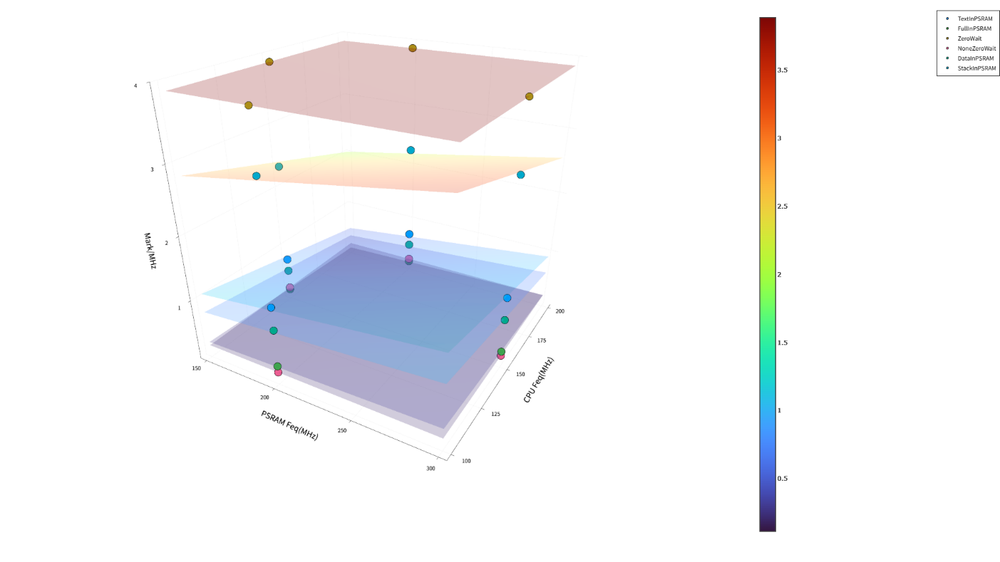

<table>
<colgroup>
<col style="width: 50%" />
<col style="width: 50%" />
</colgroup>
<thead>
<tr>
<th rowspan="2"></th>
<th></th>
</tr>
<tr>
<th></th>
</tr>
</thead>
<tbody>
</tbody>
</table>

说明

CH32V467 系列微控制器基于青稞 V4V内核，最高工作频率可达
200MHz。芯片内部集成了多种存储介质，包括 Flash 零等待区、Flash
非零等待区、SRAM 以及大容量
PSRAM。不同存储介质在访问延迟、带宽和容量上各有优劣，合理配置代码与数据的存放位置，对系统性能有显著影响。

本文旨在通过实测数据，量化 CH32V467
在不同存储介质配置下的性能差异，为开发者进行存储资源分配和系统优化提供参考依据。

**适用范围**

| 适用范围 | 系列         |
|----------|--------------|
| 通用MCU  | CH32V467系列 |

目录

[说明 [1](#_Toc239779587)](#_Toc239779587)

[目录 [2](#_Toc239779588)](#_Toc239779588)

[表格索引 [2](#_Toc239779589)](#_Toc239779589)

[图片索引 [2](#_Toc239779590)](#_Toc239779590)

[第1章 测试配置和说明 [1](#测试配置和说明)](#测试配置和说明)

[1.1 测试方法 [1](#测试方法)](#测试方法)

[1.2 测试配置说明 [1](#测试配置说明)](#测试配置说明)

[1.2.1 统一的编译选项说明 [1](#统一的编译选项说明)](#统一的编译选项说明)

[1.2.2 分组配置说明 [2](#分组配置说明)](#分组配置说明)

[1.3 测试配置流程 [2](#测试配置流程)](#测试配置流程)

[第2章 测试结果及分析 [4](#测试结果及分析)](#测试结果及分析)

[2.1 测试结果 [4](#测试结果)](#测试结果)

[2.2 性能分析 [4](#性能分析)](#性能分析)

[2.3 应用建议 [5](#应用建议)](#应用建议)

[历史版本 [6](#_Toc239779601)](#_Toc239779601)

[声明 [7](#_Toc239779602)](#_Toc239779602)

表格索引

[CH32V467存储器分布 [1](#_Toc239779603)](#_Toc239779603)

[测试环境 [1](#_Toc239779604)](#_Toc239779604)

[400/200频率分数对比 [4](#_Toc239779605)](#_Toc239779605)

[300/150频率分数对比 [5](#_Toc239779606)](#_Toc239779606)

图片索引

[Coremark测试结果分布 [4](#_Toc239779607)](#_Toc239779607)

# 测试配置和说明

## 测试方法

CH32V467 的片上存储资源分布如下表所示：

| 存储器类型 | 容量 | 地址范围 | 访问特性 |
|----|----|----|----|
| Flash 零等待区 | 最大 576KB（含可配置SRAM） | 0x00000000 起 | 零等待执行 |
| Flash 非零等待区 | 最大 416KB | 紧随零等待区之后 | 需插入等待周期 |
| SRAM | 200KB（可配置） | 0x20000000 起 | 单周期访问，最高速率 |
| PSRAM | 4MB / 8MB（型号相关） | 0x30000000 起 | 大容量，支持 DMA 高速访问 |

表 1‑1 CH32V467存储器分布

测试说明

| 项目     | 说明                    |
|----------|-------------------------|
| 芯片型号 | CH32V467xx              |
| 开发环境 | MounRiver Studio V2.5.0 |
| 编译器   | RISC-V Embedded GCC15   |
| 优化等级 | -OFast                  |

表 1‑2 测试环境

## 测试配置说明

### 统一的编译选项说明

在官方提供的工程模板基础上，添加专用编译选项以提升程序运行效率，以下为相关编译选项的详细说明：

*-funroll-all-loops：*展开所有循环。通过复制循环体代码来减少循环控制开销，以增加代码体积为代价提升执行速度。与-funroll-loops不同，它会对所有循环进行展开，包括不确定次数的循环。

*-finline-limit=600：*放宽内联大小限制。-finline-limit=n设定了自动内联函数的大小阈值（以“伪指令数”计）。默认值通常较小，设为600表示允许编译器将体积稍大的函数也进行内联展开，这是一种激进的、以空间换时间的优化

*-ftree-dominator-opts：*开启支配树优化。这是GCC基于SSA（静态单赋值）形式的优化之一，在-O1及以上级别默认开启。它利用“支配树”的数据流分析来移除冗余代码或简化控制流，是-O2/-O3优化组合的一部分。

*-fno-if-conversion2：*禁用第二次条件转换。-fif-conversion2尝试将条件分支转换为无分支的算术或逻辑运算（如条件移动）以提升流水线效率，但可能增加指令数。禁用此选项，是在部分无法受益的场景下进行指令数量与执行效率的权衡

*-fno-code-hoisting：*禁用代码提升。-fcode-hoisting是-O2及以上默认开启的优化，它将循环内不变的表达式移到循环外。禁用后，循环内不会执行此类“外提”优化，可能导致执行变慢，但能保证更保守的代码生成行为，便于调试或确保特定边界情况下的行为一致性。

*-fselective-scheduling：*启用选择性指令调度。尝试在处理器有多个功能单元时重新排列指令顺序，以更好地利用指令级并行（ILP），提升运行时性能。这通常在-O2及更高优化级别时默认启用。

-mno-save-restore：禁用使用save/restore指令。这些指令用于函数序言/尾声中批量保存/恢复寄存器。启用-msave-restore（默认可能开启）会调用库函数来执行此操作，以节省代码体积；-mno-save-restore则强制编译器在每次函数调用时显式生成保存/恢复代码，虽然会增大二进制体积，但可能因避免了库函数调用开销而带来轻微性能提升。

### 分组配置说明

1)  代码放 Flash 零等待区，数据放 SRAM

此配置为追求极致性能兼顾RAM大小的场景，将关键代码和中断服务程序置于零等待
Flash，频繁读写的全局变量、堆栈置于 SRAM。

2)  代码放 Flash 零等待区，数据放 PSRAM

此配置适用于需要大容量内存的数据处理场景（如图形显示、音频缓冲），数据存放于
PSRAM 中。

3)  代码放 Flash 非零等待区，数据放 SRAM

此配置作为性能基准线，用于量化零等待区与非零等待区的性能差异。

4)  代码放 Flash 非零等待区，数据放 PSRAM

此配置展示最差情况下的性能表现，帮助开发者评估性能下限。

5)  代码放 Flash 零等待区，全局数据放 SRAM，栈放在 PSRAM

此配置面向 SRAM 资源紧张、栈深度大的应用场景。全局变量保留在高速 SRAM
保证访问性能，堆栈分配至 PSRAM 释放 SRAM
空间，适合递归调用深、局部变量庞大，但全局数据量较小的业务。

6)  全部内容放在 PSRAM（代码 + 数据 + 栈均在 PSRAM）

此配置将代码、全局数据、堆栈全部加载至 PSRAM 中运行，Flash
仅保存固件镜像。多用于完整内存调试、代码动态修改、Flash
资源受限场景；整体性能受 PSRAM
访问时序制约，一般不作为产品正式运行配置。

## 测试配置流程

将工程结构配置为如下结构：

    C:.
    ├─.mrs
    ├─Core
    ├─Debug
    ├─Ld
    ├─Peripheral
    │  ├─inc
    │  └─src
    ├─Startup
    └─User
    └─coremark

将./User/coremark的不同段分配到不同存储器。

修改启动文件，不再使用例程中的时钟配置，使用我们自己写的\_\_late_init()函数配置时钟的同时配置好PSRAM。修改的启动文件片段：

        jal  __late_init
        li sp, 0x80100000
        la t0, main
        csrw mepc, t0

\_\_late_init中不仅需要配置时钟和PSRAM，还需要将额外需要搬移的数据/代码段搬运到响应位置：

    void __late_init() {
    #if defined(PSRAM_150MHz_150MHz)
        PSRAM_150MHz_HCLK_150M_HSE();
    #elif defined(PSRAM_200MHz_200MHz)
        PSRAM_200MHz_HCLK_200M_HSE();
    #elif defined(PSRAM_200MHz_100MHz)
        PSRAM_200MHz_HCLK_100M_HSE();
    #elif defined(PSRAM_300MHz_150MHz)
        PSRAM_300MHz_HCLK_150M_HSE();
    #endif
        SystemCoreClockUpdate();
        Delay_Init();
        USART_Printf_Init(115200);
        PSRAM_INIT();
        uint32_t *wp = __psram_vma;
        uint32_t *rp = __psram_lma;
        while (wp < __psram_vma_end) {
            *wp++ = *rp++;
        }
        asm("nop");
        wp = __psram_bss;
        while(wp < __psram_bss_end){
            *wp++ = 0;
        }
    }

此时，所有的code和data都已就绪，按照测试配置所要求栈存在的位置，将

    li sp, 0x80100000

注释或保留，由于没有在LD里设置第二个栈顶的位置，所以在手动重新指定栈的地址的时候，要确保这块区域绝对安全。随后通过mret跳转到./User/coremark/main.c的main函数下，开始进行测试。

# 测试结果及分析

## 测试结果

以下是多种配置在不同的PSRAM和CPU的频率测出的Coremark分数的汇总

<figure>

<figcaption>
图 2‑1 Coremark测试结果分布
</figcaption>
</figure>

## 性能分析

在所有测试配置下，各存储策略的综合性能排序为：

**ZeroWait（3.888）\> StackInPSRAM（2.265~3.076）\>
TextInPSRAM（0.710~1.271）\> DataInPSRAM（0.499~0.910）\>
NoneZeroWait（0.209）\> FullInPSRAM（0.161~0.313）**

1)  零等待模式性能最优且不受频率配置影响

ZeroWait 模式下 Mark 值恒定为 3.887938，与 PSRAM/CPU
频率组合无关。这表明在零等待状态下，处理器访问存储无任何等待周期，性能完全由
CPU 本身决定，频率配比不再成为瓶颈。

相比之下，NoneZeroWait 模式 Mark 值仅为
0.209140，性能衰减约94.6%，说明等待周期对执行效率影响极为显著。

2)  代码与数据全置于 PSRAM 时性能最差

FullInPSRAM 模式在所有频率配置下 Mark 值均最低（0.161~0.313），甚至低于
NoneZeroWait 模式。原因在于指令取指与数据访问同时竞争 PSRAM
带宽，总线冲突严重，导致实际执行效率大幅下降。

3)  栈置于 PSRAM 对性能影响相对最小

StackInPSRAM 模式 Mark 值在2.264~3.076之间，为所有 PSRAM
驻留策略中最高。这是因为栈访问具有高度的局部性特征，且访问模式可预测，处理器缓存机制能有效掩盖
PSRAM 访问延迟。

4)  当代码或数据存放地址在PSRAM中时，二者的频率对性能开始有影响

当 CPU 频率降至 PSRAM 频率的一半时，单位 MHz 性能得分显著提升。这说明在
PSRAM 驻留场景下，PSRAM 访问速度是主要瓶颈，降低 CPU 频率可减少处理器对
PSRAM 的访问压力，从而提升每 MHz 的有效执行效率。

| PSRAM/CPU | TextInPSRAM | FullInPSRAM | DataInPSRAM | StackInPSRAM |
|-----------|-------------|-------------|-------------|--------------|
| 200/200   | 0.71        | 0.161       | 0.499       | 2.264        |
| 200/100   | 1.271       | 0.313       | 0.91        | 3.076        |
| 提升幅度  | **79.01%**  | **94.41%**  | **82.36%**  | **35.87%**   |

表 2‑1 400/200频率分数对比

同理，对比 150/150 与 300/150（CPU 频率不变，PSRAM 频率翻倍）：

| PSRAM/CPU | TextInPSRAM | FullInPSRAM | DataInPSRAM | StackInPSRAM |
|-----------|-------------|-------------|-------------|--------------|
| 150/150   | 0.744       | 0.172       | 0.531       | 2.35         |
| 300/150   | 1.182       | 0.28        | 0.822       | 2.945        |
| 提升幅度  | **58.87%**  | **62.79%**  | **54.80%**  | **25.32%**   |

表 2‑2 300/150频率分数对比

PSRAM 频率翻倍带来了25%~62%的单位性能提升，进一步验证了 PSRAM
带宽是此类场景的性能瓶颈。

## 应用建议

**优先使用 ZeroWait
模式：**若硬件条件支持，零等待模式可获得最佳性能，且无需关注频率配比。

**避免 FullInPSRAM 配置：**代码与数据同时驻留 PSRAM
会导致严重的带宽竞争，应尽量将关键代码或数据放置于片内 SRAM/Flash。

**合理配置 PSRAM/CPU 频率比：**在必须使用 PSRAM
驻留代码或数据的场景下，应保证 PSRAM 频率不低于 CPU 频率，推荐 PSRAM:CPU
≥ 2:1，以最大化单位 MHz 执行效率。

**栈可优先放置于 PSRAM：**若片内存储资源紧张，栈置于 PSRAM
对整体性能影响最小，是优先级最低的搬迁对象。

历史版本

| 日期       | 版本 | 变更内容 |
|------------|------|----------|
| 2026/08/27 | V1.0 | 初版发行 |

声明

本手册仅供参考。作者在不另行通知的情况下，可随时进行修改。
