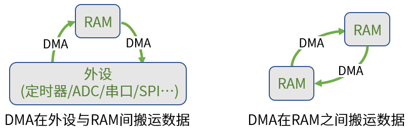
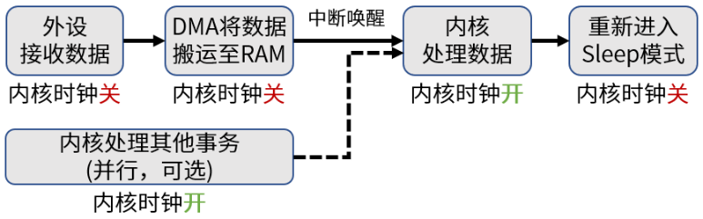
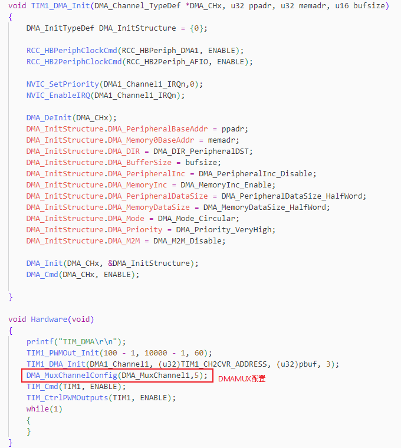
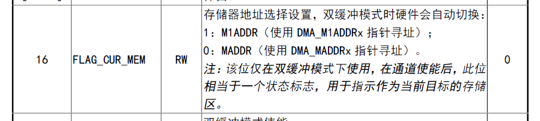
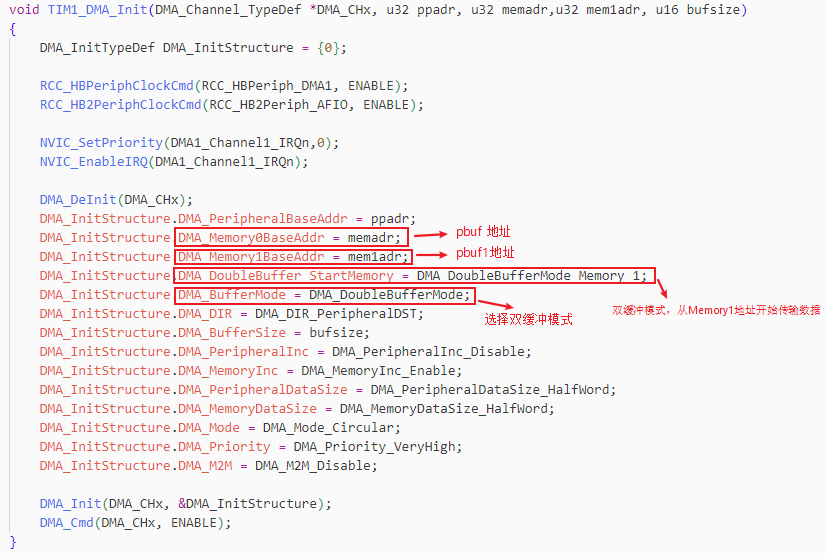
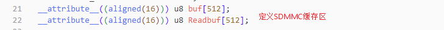
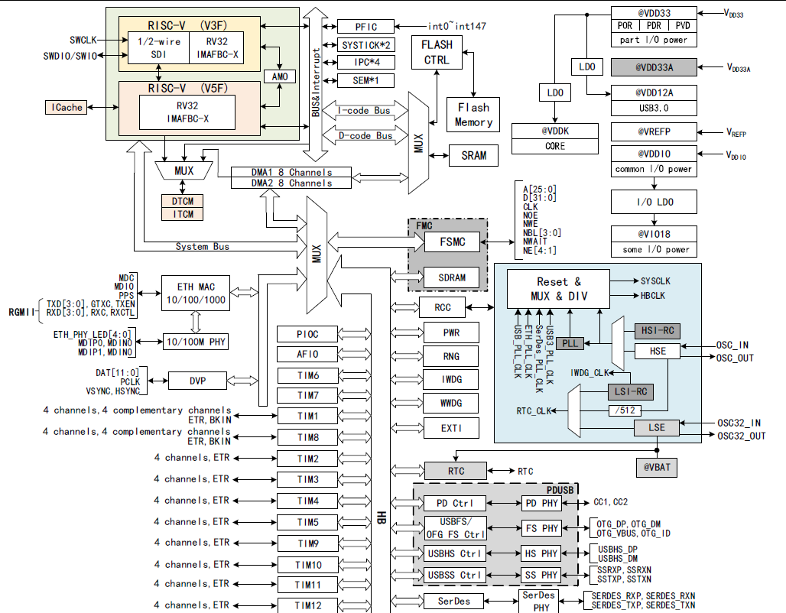
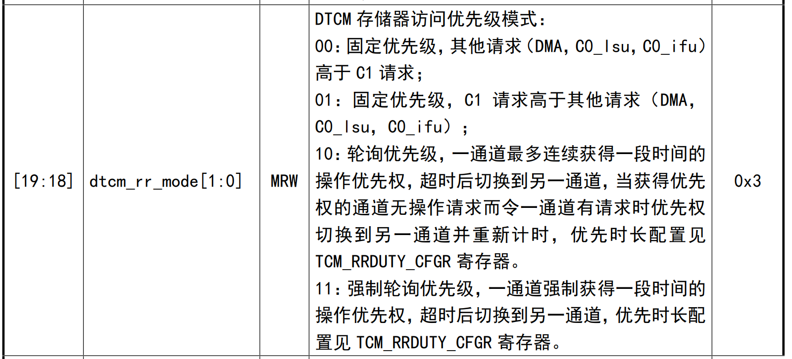

AN 08000

V1.0

***

说明

CH32H417/H416/H415系列MCU 是沁恒公司推出的基于青稞RISC-V5F 和RISC-V3F的双核产品。该系列产品相较与之前产品，在DMA上增加了请求复用器和双缓冲功能。本应用文档介绍了CH32H417/H416/H415 MCU的DMA特点，分析了CPU和DMA操作SRAM的仲裁优先级，DMA传输速率等。

适用范围

| 适用范围 | 系列               |
|----------|--------------------|
| 通用MCU  | CH32H417/H416/H415 |

目录

[说明](#_Toc214358709)

[目录](#_Toc214358710)

[表格索引](#_Toc214358711)

[图片索引](#_Toc214358712)

[第1章 正文标题](#_Toc214358713)

[1.1 DMA基本概念](#dma基本概念)

[1.2 CH32 DMA对比](#ch32-dma对比)

[1.3 DMA请求复用器](#dma请求复用器)

[1.4 DMA请求复用器](#dma请求复用器-1)

[1.5 外设专用DMA](#外设专用dma)

[第2章 CH32H417 DMA性能](#ch32h417-dma性能)

[2.1 CH32H417 SRAM分配](#ch32h417-sram分配)

[2.2 DMA传输速率](#dma传输速率)

[2.3 DMA/CPU仲裁优先级](#dmacpu仲裁优先级)

[历史版本](#_Toc214358723)

[声明](#_Toc214358724)

表格索引

[表 11 DMA功能对比](#_Toc214359252)

[表 12 DMAMAX输入资源分配表](#_Toc214359253)

[表 13 双缓冲模式下的源和目标地址寄存器](#_Toc214359254)

[表 14 专用DMA功能对比表](#_Toc214359255)

图片索引

[图 11 TIM1_UP触发DMA1_Channel1示例配置](#_Toc214359258)

[图 12 DMAy_CFGRx[16]寄存器](#_Toc214359259)

[图 13 DoubleBuffer_DMA示例配置](#_Toc214359260)

[图 14 SDMMC缓冲区地址定义](#_Toc214359261)

[图 21 CH32H417系统框图](#_Toc214359262)

[图 22 DTCM存储器访问优先级](#_Toc214359263)

# 正文标题

## DMA基本概念

DMA(Direct Memory Access，直接存储器访问)可以在外设和寄存器之间或存储器和存储器之间直接进行数据传输。

DMA数据传输过程中不需要CPU的干预，节省了CPU资源。相比传统数据传输方式需要CPU全程参与，提高了系统的数据传输效率和芯片性能。因为DMA数据传输时不需要CPU的参与，所以DMA在MCU进入sleep模式时仍然可以进行数据传输。

Sleep模式下灵活应用DMA，使内核在外设收发数据时保持停止状态，可以有效降低MCU的功耗。

## CH32 DMA对比

CH32H417 是沁恒推出的双核MCU产品，相对于之前系列产品在DMA功能上略有不同。

表 11 DMA功能对比

| MCU           | CH32H41X MCU           | CH32V30X MCU            |
|---------------|------------------------|-------------------------|
| DMA通道数量   | DMA1/DAM2(16 channels) | DMA1/DMA2(18 channels ) |
| 数据传输数量  | 0-65535                | 0-65535                 |
| 仲裁优先级    | 最高/高/中/低          | 最高/高/中/低           |
| 循环传输模式  | 支持                   | 支持                    |
| DMA请求复用器 | 支持                   | 不支持                  |
| 双缓冲模式    | 支持                   | 不支持                  |
| 数据传输位宽  | 8/16/32/256            | 8/16/32                 |

CH32H417系列MCU相比于CH32V30X增加了256 bit位宽和请求复用器，支持双循环模式。当DMA配置中选择不同的搬运位宽，搬运地址也要相应对齐。例如： DMA选择256bit 搬运位宽，搬运地址要32字节对齐。

## DMA请求复用器

CH32H417/H416/H415之前产品的每个DMA通道都直接连接专用的DMA请求。外设请求只能触发相应的DMA通道，一定程度上限制了DMA的使用。DMAMUX 请求复用器可重新配置芯片的外设和DMA 控制器之间的请求线。通过请求复用器外设请求可以使用DMA任意通道。

CH32H417 DMA提供16 个通道，其中DMAMUX 通道1 到8 与DMA1 通道1 到8 相连，DMAMUX 通道9 到16 与DMA2 通道1 到8 相连。

在外设触发DMA的传输应用中，CH32H417相比于CH32V30X需要按照DMAMAX输入资源分配表分配外设请求。

表 12 DMAMAX输入资源分配表

| DMA请求输入 | 外设      | DMA请求输入 | 外设       | DMA请求输入 | 外设       |
|-------------|-----------|-------------|------------|-------------|------------|
| 1           | TIM1_CH1  | 42          | TIM9_CH4   | 83          | I3C_TX     |
| 2           | TIM1_CH2  | 43          | TIM9_UP    | 84          | I3X_RX     |
| 3           | TIM1_CH3  | 44          | TIM9_TRIG  | 85          | USART1_TX  |
| 4           | TIM1_CH4  | 45          | TIM10_CH1  | 86          | USART1_RX  |
| 5           | TIM1_UP   | 46          | TIM10_CH2  | 87          | USART2_TX  |
| 6           | TIM1_COM  | 47          | TIM10_CH3  | 88          | USART2_RX  |
| 7           | TIM1_TRIG | 48          | TIM10_CH4  | 89          | USART3_TX  |
| 8           | TIM2_CH1  | 49          | TIM10_UP   | 90          | USART3_RX  |
| 9           | TIM2_CH2  | 50          | TIM10_TRIG | 91          | USART4_TX  |
| 10          | TIM2_CH3  | 51          | TIM11_CH1  | 92          | USART4_RX  |
| 11          | TIM2_CH4  | 52          | TIM11_CH2  | 93          | USART5_TX  |
| 12          | TIM2_UP   | 53          | TIM11_CH3  | 94          | USART5_RX  |
| 13          | TIM2_TRIG | 54          | TIM11_CH4  | 95          | USART6_TX  |
| 14          | TIM3_CH1  | 55          | TIM11_UP   | 96          | USART6_RX  |
| 15          | TIM3_CH2  | 56          | TIM11_TRIG | 97          | USART7_TX  |
| 16          | TIM3_CH3  | 57          | TIM12_CH1  | 98          | USART7_RX  |
| 17          | TIM3_CH4  | 58          | TIM12_CH2  | 99          | USART8_TX  |
| 18          | TIM3_UP   | 59          | TIM12_CH3  | 100         | USART8_RX  |
| 19          | TIM3_TRIG | 60          | TIM12_CH4  | 101         | SWPMI_TX   |
| 20          | TIM4_CH1  | 61          | TIM12_UP   | 102         | SWPMI_RX   |
| 21          | TIM4_CH2  | 62          | TIM12_TRIG | 103         | DAC1       |
| 22          | TIM4_CH3  | 63          | SPI1_TX    | 104         | DAC2       |
| 23          | TIM4_CH4  | 64          | SPI1_RX    | 105         | 保留       |
| 24          | TIM4_UP   | 65          | SPI2_TX    | 106         | 保留       |
| 25          | TIM4_TRIG | 66          | SPI2_RX    | 107         | DFSDM_DMA0 |
| 26          | TIM5_CH1  | 67          | SPI3_TX    | 108         | DFSDM_DMA1 |
| 27          | TIM5_CH2  | 68          | SPI3_RX    | 109         | 保留       |
| 28          | TIM5_CH3  | 69          | SPI4_TX    | 110         | 保留       |
| 29          | TIM5_CH4  | 70          | SPI4_RX    | 111         | SDIO       |
| 30          | TIM5_UP   | 71          | QSPI1_DMA  | 112         | SAI_A_TX   |
| 31          | TIM5_TRIG | 72          | QSPI2_DMA  | 113         | SAI_A_RX   |
| 32          | TIM8_CH1  | 73          | I2C1_TX    | 114         | SAI_B_TX   |
| 33          | TIM8_CH2  | 74          | I2C1_RX    | 115         | SAI_B_RX   |
| 34          | TIM8_CH3  | 75          | I2C2_TX    | 116         | 保留       |
| 35          | TIM8_CH4  | 76          | I2C2_RX    | 117         | 保留       |
| 36          | TIM8_UP   | 77          | I2C3_TX    | 118         | 保留       |
| 37          | TIM8_COM  | 78          | I2C3_RX    | 119         | 保留       |
| 38          | TIM8_TRIG | 79          | I2C4_TX    | 120         | ADC1       |
| 39          | TIM9_CH1  | 80          | I2C4_RX    | 121         | ADC2       |
| 40          | TIM9_CH2  | 81          | I3C_RS     | 122         | TIM6_UP    |
| 41          | TIM9_CH3  | 82          | I3C_TC     | 123         | TIM7_UP    |

示例中使用TIM1的更新事件触发DMA，在DMA的配置后，需要操作DMAMUX相关寄存器，分配TIM1更新事件到DMA1_Channel1.根据DMAMUX输入资源分配表，TIM1_UP事件的DMA请求输入序号为5，配置DMAMUX1_4_CFGR[0:6]或直接调用DMA_MuxChannelConfig()函数。

图 11 TIM1_UP触发DMA1_Channel1示例配置

## DMA请求复用器

CH32H417 DMA所有通道新增双缓冲功能。通过设置DMA_CFGRx寄存器的DOUBLE_MODE位置1，使能双缓冲模式，自动进入循环模式，并在完成一次循环后自动切换存储器地（DMA_MADDRx和DMA_M1ADDRx间交替切换）。

每次循环结束时DMA控制器都从一个存储器目标交换为另一个存储器目标，这样，软件在处理一个存储器区域的同时，DMA传输还可以填充或使用第二个存储器区域。双缓冲区通道可双向工作，如下表所示。

表 13 双缓冲模式下的源和目标地址寄存器

| DMA_CFGRx.DIR | 方向       | 源地址                 | 目标地址               |
|---------------|------------|------------------------|------------------------|
| 0             | 从外设读   | DMA_PADDRx             | DMA_MADDRx/DMA_M1ADDRx |
| 1             | 从存储器读 | DMA_MADDRx/DMA_M1ADDRx | DMA_PADDRx             |

双缓冲模式主要应用于外设与存储器之间进行数据传输，禁止应用于存储器到存储器模式。双缓冲模式有两个存储器地址（DMA_MADDRx和DMA_M1ADDRx），可通过配置DMAy_CFGRx[16]来确定从哪一个存储器地址（默认DMA_MADDRx）开始传输。DMAy_CFGRx[16]在通道使能后，此位相当于状态标志位，用于指示具体的存储器地址。

图 12 DMAy_CFGRx[16]寄存器

DoubleBuffer_DMA示例通过DMA1_Channel1把pbuf[3]和pbuf1[3]中的数据传输到TIM1_CH2CVR，用于修改定时器的占空比。

图 13 DoubleBuffer_DMA示例配置

## 外设专用DMA

HSADC ，SDMMC， USB等外设有外设专用DMA。之前章节涉及的DMA及通用DMA。外设专用DMA与通用DMA的根本区别在于设计目的，所属权和控制方法。

专用DMA：直接集成在特定外设内部（如ETH ，USB， SDMMC， DVP等），它是外设的专属DMA。外设无需仲裁，自主控制数据传输。

通用DMA：外设发出请求，DMA数据传输。当多个请求同时对一个DMA通道发出请求，DMA通道需要仲裁。

表 14 专用DMA功能对比表

| 特性     | 专用DMA                | 通用DMA                       |
|----------|------------------------|-------------------------------|
| 集成位置 | 集成在外设控制器内部   | 独立模块                      |
| 归属权   | 外设专属               | 系统共享                      |
| 设计目的 | 优化特定高速外设       | 为多个外设提供DMA功能         |
| 工作方式 | 外设自主控制数据传输   | 外设请求DAM数据传输           |
| 仲裁需求 | 无需仲裁               | 需仲裁（多个外设竞争）        |
| 性能     | 低延迟                 | 较高延迟（仲裁与共享通道）    |
| CPU负担  | 极低（仅初始化和结尾） | 较低（但需配置DMA控制寄存器） |

专用DMA在使用过程中也需要数据对齐。

1\. CH32H417 USBHS专用DMA 缓冲区地址需要4字节对齐

2\. CH32H417 ETH专用DMA 收发描述符队列和缓冲区都需要保证它们的起始地址在32字节对齐

3\. CH32H417 DVP专用DMA缓冲区地址需要32字节对齐

4\. CH32H417 USBPD专用DMA缓冲区地址需要4字节对齐

5\. CH32H417 SerDes专用DMA缓冲区地址在接收模式下需要16字节对齐，发送模式下不需要16字节对齐

6\. CH32H417 HSADC专用DMA缓冲区地址需要32字节对齐

7\. CH32H417 SDMMC专用DMA缓冲区地址需要16字节对齐

图 14 SDMMC缓冲区地址定义

# CH32H417 DMA性能

## CH32H417 SRAM分配

CH32H417内置总容量896K字节SRAM。SRAM分为3块：128KB的ITCM代码区、256KB的DTCM数据区、剩余512KB共享代码和数据区。

其中ITCM和DTCM在TCM总线上，TCM总线速率和RISC_V5速率相同。

共享代码区和数据区挂载在HB总线上，HB总线速率和RISC_V3速率相同。

512KB共享区可配置为RISC-V3F的零等待代码区和数据区，建议以128KB为单位根据需要灵活分配。

128KB的ITCM和256KB的DTCM合计384KB均可以配置为RISC-V5F的代码区，其中DTCM作为代码区在发生跳转时会增加1个时钟等待。

RISC-V3F可以按HCLK时钟2个等待访问ITCM或DTCM。

RISC-V5F和RISC-V3F可以按HCLK时钟零等待访问512KB共享区。

沁恒官方例程中ITCM和DTCM分配给RISC_V5，512KB共享区域部分分配给RISC_V3。

RISC_V5例程中使用的变量将会存储在DTCM区域，RISC_V3例程中使用的变量将会存储在共享数据区。

## DMA传输速率

在评估DMA性能时，需要考虑多个因素，其中DMA数据的传输速度是一个关键指标。DMA传输的速度直接受限于DMA访问的源地址和目的地址在总线上的位置。SRAM到SRAM的DMA传输非常快就是因为都挂载在HB高速总线上。CH32H417的大多数外设也是直接挂载在HB总线上，所以通过DMA在SRAM和外设之间传输速度和SRAM之间传输数据相同。CH32V30X系列芯片SRAM挂载在HB总线上，外设挂载在PB1/PB2总线上，DMA传输外设与SRAM 之间的数据必须经过PB-HB桥-HB-SRAM ，路径较长会限制DMA的传输速度。CH32H417 DTCM挂载在TCM总线上，CH32H417 例程变量存放在DTCM。DMA挂载在HB总线上。

图 21 CH32H417系统框图

CH32H417的RISC_V5通过DMA对DTCM进行数据传输时，DMA在读/写DTCM的过程中相比与传输SRAM数据传输会多等待一个HB周期。

## DMA/CPU仲裁优先级

当DMA和内核同时访问同一块SRAM时，会产生仲裁，确定访问的优先级。

CH32H417的DTCM按128K分成2块，当DMA，RISC_V5，RISC_V3同时操作同一块128K DTCM时，根据MEMARY_CFGR[18:19]优先级设置仲裁访问DTCM。

图 22 DTCM存储器访问优先级

CH32H417的共享RAM，按128K分成4块。当DMA，RISC_V5，RISC_V3同时操作同一块128K SRAM时，通过总线仲裁来访问SRAM。访问SRAM的仲裁规则是固定的，不可配置修改的。

仲裁规则：

DMA1 \> DMA2 \> RISC_V3 \> RISC_V5

赢得仲裁的主设备（例如DMA）可以访问SRAM，而其他设备（例如RISC_V3）将会临时挂起，等待DMA访问完成，当DMA访问SRAM结束后，挂起设备再操作SRAM。内核挂起只是插入等待周期，导致指令执行稍慢，不会产生异常或错误。整个过程由硬件自动完成。

注：用户要避免同时操作同一块SRAM，例如内核在累加SRAM中数组时，DMA会传输改变SRAM，导致内核最终累加数据错误。

解决方案：

1\. 使用双缓冲区功能，避免内核和DMA操作同一个缓冲区

2\. 确保内存区域不重合。为DMA和内核分配完全独立区域，根本上避免冲突

内核使用SRAM时关闭DMA功能，使用结束后开启DMA功能，只适用于实时性要求不高的场景。

历史版本

更新内容

| 日期       | 版本 | 变更内容 |
|------------|------|----------|
| 2025/11/18 | V1.0 | 初版发行 |

声明

本手册版权所有为南京沁恒微电子股份有限公司（Copyright © Nanjing Qinheng Microelectronics Co., Ltd. All Rights Reserved），未经南京沁恒微电子股份有限公司书面许可，任何人不得因任何目的、以任何形式（包括但不限于全部或部分地向任何人复制、泄露或散布）不当使用本产品手册中的任何信息。

任何未经允许擅自更改本产品手册中的内容与南京沁恒微电子股份有限公司无关。

南京沁恒微电子股份有限公司所提供的说明文档只作为相关产品的使用参考，不包含任何对特殊使用目的的担保。南京沁恒微电子股份有限公司保留更改和升级本产品手册以及手册中涉及的产品或软件的权利。

参考手册中可能包含少量由于疏忽造成的错误。已发现的会定期勘误，并在再版中更新和避免出现此类错误。
