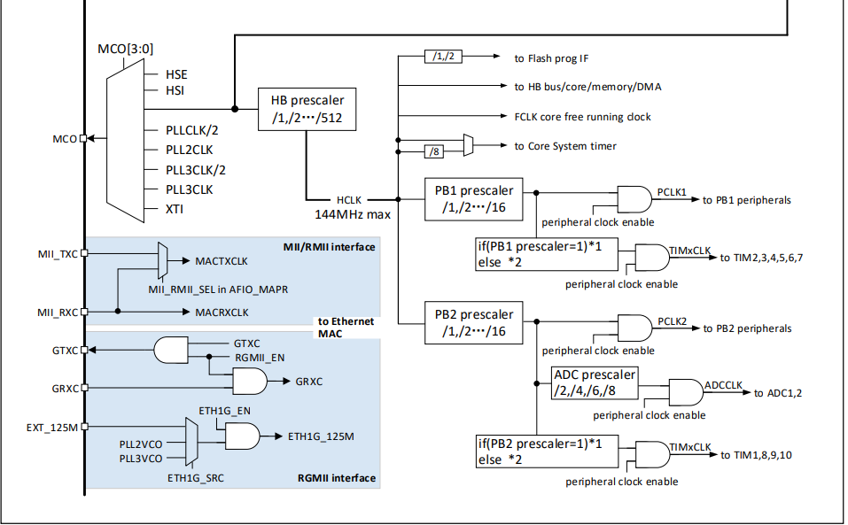

AN模板

V1.0

***

说明

本文主要介绍了CH32 通用MCU系列的12-bit ADC的使用方法以及注意事项。ADC主要的静态参数计算；想要在实际应用中达到标称的精度，需要在软件配置端与外围电路的设计上给予足够的重视。

适用范围

| 适用范围 | 系列         |
|----------|--------------|
| 通用MCU  | CH32 通用MCU |

目录

[说明](#_Toc214527316)

[目录](#_Toc214527317)

[表格索引](#_Toc214527318)

[图片索引](#_Toc214527319)

[第1章 ADC功能简介](#_Toc214527320)

[1.1 CH32通用系列ADC简介](#ch32通用系列adc简介)

[1.1.1 ADC采样配置](#_Toc214527322)

[1.1.2 ADC内部通道](#adc内部通道)

[1.1.3 ADC校准](#adc校准)

[1.1.4 ADC静态参数](#adc静态参数)

[第2章 ADC注意事项](#adc注意事项)

[2.1 ADC使用注意事项](#adc使用注意事项)

[2.1.1 ADC参考电源](#adc参考电源)

[2.1.2 ADC输入](#adc输入)

[历史版本](#_Toc214527330)

[声明](#_Toc214527331)

表格索引

[表 11 不同型号ADC参数](#_Toc216082063)

[表 21 最大输入阻抗](#_Toc216082064)

图片索引

[图 11-1时钟树框图](#_Toc214539187)

[图 1-12 ADC失调误差](#_Toc214539188)

[图 1-13 ADC增益误差](#_Toc214539189)

[图 1-14 ADC微分误差](#_Toc214539190)

[图 1-15 ADC积分误差](#_Toc214539191)

[图 21 ADC采集电压](#_Toc214539192)

[图 22 供电拓扑结构](#_Toc214539193)

[图 23 ADC采样电路](#_Toc214539194)

[图 24 ADC拓扑结构](#_Toc214539195)

[图 25 外部跟随器](#_Toc214539196)

[图 26跟随器输入电压与失调电压](#_Toc214539197)

# ADC功能简介

## CH32通用系列ADC简介

CH32通用系列，为逐次逼近型的模拟数字转换器，可支持外部通道与内部通道信号采集源。可支持单次转换，连续转换，扫描模式，间断模式与外部触发等功能。内置ADC缓冲器，并能配置输入增益可调，可实现小信号放大采样。不同CH32通用系列芯片具有不同的ADC配置，可依据下表进行芯片选型

表 11 不同型号ADC参数

| 芯片型号   | 外部通道数 | ADC最高时钟 | 最高采样率 | 分辨率 | 适用电压   | 是否有双ADC |
|------------|------------|-------------|------------|--------|------------|-------------|
| CH32F10x   | 16         | 14M         | 1M         | 12bit  | 3.0V～5.5V | N           |
| CH32V10x   | 16         | 14M         | 1M         | 12bit  | 3.0V～5.5V | N           |
| CH32F20x   | 16         | 14M         | 1M         | 12bit  | 2.4V～3.6V | Y           |
| CH32F208   | 16         | 14M         | 1M         | 12bit  | 2.4V～3.6V | N           |
| CH32V208   | 16         | 14M         | 1M         | 12bit  | 2.4V～3.6V | N           |
| CH32V20x   | 10         | 14M         | 1M         | 12bit  | 2.4V～3.6V | Y           |
| CH32V203RB | 16         | 14M         | 1M         | 12bit  | 2.4V～3.6V | N           |
| CH32V30x   | 16         | 14M         | 1M         | 12bit  | 2.4V～3.6V | Y           |
| CH32V003   | 8          | 6M          | 0.43M      | 10bit  | 2.8V～5.5V | N           |
|            |            | 12M         | 0.857M     | 10bit  | 3.2V～5.5V |             |
|            |            | 24M         | 1.71M      | 10bit  | 4.5V～5.5V |             |
| CH32V00x   | 8          | 48M         | 3M         | 12bit  | 4.5V～5.5V | N           |
|            |            |             | 1M         | 12bit  | 2.4V～5.5V |             |
| CH32L03x   | 10         | 48M         | 0.2M       | 12bit  | 1.8V～3.6V | N           |
|            |            |             | 2.4M       | 12bit  | 3.0V～3.6V |             |
| CH32X03x   | 14         | 8M          | 0.47M      | 12bit  | 3.0V～5.5V | N           |
| CH32V205   | 16         | 64M         | 4M         | 12bit  | 2.4V～3.6V | Y           |
| CH32V203CC | 16         | 64M         | 4M         | 12bit  | 2.4V～3.6V | Y           |
| CH32H41X   | 16         | 80M         | 2M         | 12bit  | 2.7V～3.6V | Y           |
|            |            |             | 5M         | 12bit  | 3V～3.6V   |             |

注：部分产品未提供内部通道与内部缓冲器，具体细节请查阅芯片手册。

### ADC采样配置

CH32通用系列，ADC运行不能超过允许最高时钟，每个型号最高时钟可参考表1-1。当配置ADC时钟时，需要注意ADC时钟源与ADC分频系数关系。以CH32V30x为例，ADC使用最高时钟为14M； ADC时钟源与ADCCLK与PCLK2同步，由RCC_CFGR0寄存器的ADCPRE[1:0]域配置分频，时钟数如图1-1所示；可以看出ADC时钟最高分频为8分频，可以得出在正常使用ADC的情况下AHPB2时钟应低于112M，若使用最高主频144M运行情况下，在使用ADC时，AHPB2时钟建议2分频以上。

根据ADC时钟，转换总时间为：

TCONV = 采样时间 + 12.5TADCCLK

其中采样时间在寄存器中的SMPx[2:0]位更改，采集周期时钟基准为ADCCLK，12.5TADCCLK为固定的12.5周期的转换周期。

以ADC时钟为12M，采样周期为7.5为例，可以算出：

采样频率为：TSAMP=12M/7.5=1.6M

转换频率为：TCONV=12M/(7.5+12.5)=0.8M

注：CH32V003的ADC分辨率为10bit，转换时间为11TADCCLK

图 11时钟树框图

### ADC内部通道

CH32通用系列，内置2个内部通道：

-   温度传感器：用来测量器件周围的温度（TA），温度传感器，转换电压（mV）与内部温度（℃）线性关系，需要参考不同芯片的应用手册。
-   VREFINT内部参考电压：用于采集芯片内部参考电压，典型电压为1.2V，提供了一个稳定的电压用于ADC参考电压比较。

在使用内部通道时，需要通过设置ADC_CTLR2寄存器的TSVREFE位置1，唤醒ADC内部采样通道。推荐设置采样时间大于17.1us。

所需注意：存在双ADC模块芯片，内部通道只有ADC1模块存在。

CH32V10x与CH32F10x系列中，使用外通道时，需要关闭内部通道使能。

### ADC校准

CH32通用系列，存在内部自校准模块，用于消除ADC的偏移误差。校准流程为：

（1）通过写 ADC_CTLR2 寄存器的 RSTCAL 位置 1 初始化校准寄存器，等待 RSTCAL 硬件清 0 表示初始化完成。

（2）置位 CAL 位，启动校准功能，一旦校准结束，硬件会自动清除 CAL 位，将校准码存储到 ADC_RDATAR 中。

### ADC静态参数

CH32通用系列为12位ADC，转换数值范围为2的12次方，若是理想的ADC模块，最小的采样电压变化单位以LSB表示，1LSB分辨电压为：

1LSB=Vref/212

其中Vref为ADC的参考电压，如在3.3V供电下，ADC最小分辨电压为0.805mV。

在ADC转换电压时会存在误差，其中典型的静态参数误差有：

（1）失调误差

失调误差（Offset Error），是指ADC输入0点时所转换电压的偏移值，这个偏移量被称为失调误差Eo：

Eo=实际的转换电压-理想的转换电压。

失调误差反映的是第一个标值点与实际点的偏置差异，当第一个点读取数值为4，可得出失调误差为4，若实际出现非0数值，对应的标值点为4，可得出失调误差为-3。

图 1-12 ADC失调误差

（2）增益误差

增益误差（Gain error）是指转换满值电压值与理想值之间的偏差，表示了ADC 在将模拟输入转换为数字输出时引入的放大或缩小的误差值，用符号EG表示。

图 1-13 ADC增益误差

若输入电压为Vref时未获得满值（0xffff），则为正增益；若输入电压在未满Vref时得到满值（0xffff）,则为负失调，此时增益误差为实际的转换电压-理想的转换电压。如在理想值为0xfffe时，采集电压为0xffff，则负失调电压为1LSB。

（3）微分误差

微分非线性误差（DNL），去除增益误差与失调误差下，每两个相邻的电压采集差，理想的ADC台阶宽度为1，即DNL为0，微分误差DNL计算为：

$$
D N L （ i ） = \  ( V S T P ( i ) - V L S B ) / \  V L S B
$$

$$
V S T P ( i ) = V c o n v ( i ) - V c o n v ( i - 1 )
$$

其中DNL（i）表示输出曲线中第i 个微分非线性误差，VSTEP（i）表示输出曲线中第i个量化区间的台阶宽度，VCONV表示采集的电压值。VLSB表示第i 个理想宽度。

例如在在理想ADC中，每个阶梯理想宽度为1，即VLSB=1，在第三的转换值与第三次转换值，阶梯宽度为2，则第3个阶梯的微分误差为1。

图 1-14 ADC微分误差

（4）积分误差

积分非线性误差（INL），为实际起点与终点之前的最大偏差，可以看作为实际起点与终点连线与理想电压线之间的最大值。

如图1-5所示，实际曲线为第一个实际转换值点与最后一个实际转换值点的线条。EL值为是每个理想值与实际曲线的偏差值。

图 1-15 ADC积分误差

# ADC注意事项

## ADC使用注意事项

在使用CH32通用系列ADC时，需要注意参考电压阈值，ADC输入阻抗与电压；可用过对软件更改采样时间，更改外部输入等方式可减少因ADC使用不当而引起的总误差。

### ADC参考电源

对于CH32通用系列，如果为全封装芯片，存在VREF引脚时，VREF引脚接入电压为ADC参考电压，在使用ADC时，参考电压不小于设计阈值；且不能高于VDDA供电电压。若无VREF引脚，参考电压供电引脚则为VDDA，且使用ADC时，VDDA供电压最小值可参考表1-1，这时供电关系为VDDA≤VDD。

为提高ADC采样精度，可参考供电方案：

（1）为获得最佳的ADC转换精度，可使ADC的动态范围与供电电压相匹配：

如下图所示：

图 21 ADC采集电压

若ADC参考电压为3.3V，转换电压信号幅值为2.5V，则会出现有992个未转换状态，也就意味着ADC精度受损。因此参考电压可改为转换电压峰幅值2.5V；最小分辨电压由0.85mV转为0.61mV提高采集精度。

（2）使用独立的外部电源作为参考电压：

如果有Vref或有VDDA独立引脚。可使用独立的参考电源，确保独立供电的稳定性。参考电压源尽量为低输出阻抗，以便以输入电压的准确性。如下图所示：

图 22 供电拓扑结构

若与VDD同一电源时，Vref与供电端存在压降，为Vref=VCC-IDD\*Rain，其中IDD为芯片供电电流，Rain为电源到电源引脚输入阻抗。由此可以看出当使用芯片功耗较大时，使用Vref与VDD短接的情况下，若外部阻抗较大，势必存在较大的压差，从而影响参考电压值，导致ADC增益误差较大。

### ADC输入

当配置采样周期时需要考虑外部输入阻抗的影响，ADC输入阻抗与采样率需要满足：

其中RAIN为外部输入阻抗，RADC为ADC开关阻抗，fADC为ADC时钟频率，CADC为内部采样电容，N为分辨率，对于CH32通用芯片，为12位采样ADC，即N=12。对于常用的CH32L103芯片举例，fADC = 14MHz时的最大RAIN:

表 21 最大输入阻抗

| TS(周期) | tS (us) | 最大RAIN(kΩ) |
|----------|---------|--------------|
| 1.5      | 0.11    | 1.2          |
| 7.5      | 0.54    | 12.3         |
| 13.5     | 0.96    | 23.3         |
| 28.5     | 2.04    | 50           |
| 41.5     | 2.96    | 75           |
| 55.5     | 3.96    | -            |
| 71.5     | 5.11    | -            |
| 239.5    | 17.1    | -            |

注：不同类型由于ADC内部采用电容与开关阻抗不同，。

使用ADC常用的ADC采样电路常用如下图：

图 23 ADC采样电路

通过电路可以看出，R51与R52为电阻分压，其结构为并联结构，因此输入到ADC电压可等效电阻计算为：

$$
R i n = R 51 / / R 52 = \  R 51 * R 52 / ( \  R 51 + R 52 ) = 3 . 2 0 K \Omega
$$

输入R53与输入并联等效阻抗为串联，因此ADC的输入端的阻抗为：

$$
R o u t = \  R i n + R 53 = 3 . 2 0 K \Omega + 1 K \Omega = 4 . 2 0 \  K \Omega
$$

在大多数情况下，为了降低外部噪声干扰，通常输入端会加入电容组成一个RC低通滤波器，以限制高频噪声进入。在选择电容时，通常会根据期望截止频率来选择，但在使用ADC采样时，选择电容大小也应考虑到充电响应时间，使用ADC采集拓扑结构如下图：

图 24 ADC拓扑结构

其中Cp表示外部电容，CADC为内部保持电容，当输入电压在采集变化时，需要计算采样时间周期，以满足，采样精度的需求，电容充电时长为：

$$
V ( t ) = V A I N * ( 1 - e - t / \tau )
$$

其中V(t)为在采样结束后，ADC输入端的实际电压，τ为RC充电参数，其值Rain\*(Cp//CADC)。

由此可得，当变化为幅值为VDD时，采样时长t需要满足：

$$
t \geq R a i n * （ C p / / C A D C ） * \  I n （ V A I N / ( \  V A I N - \  V ( t ) ) ）
$$

若输入端分辨率为1/2LSB，且输入端幅值满足Vref最大值，可以得出，采样时应不低于：

$$
T s \geq \  \cdot f A D C * ( R a i n * ( C p / / C A D C ) ) * \  I n ( 2 N + 1 )
$$

其中Ts为ADC的采样周期，fADC为ADC的采样频率。可得出，当采样过程中电压存在变化时，滤波电容的影响，需要调整采样周期大小，以确保ADC精度。

考虑输入阻抗对ADC精度影响，可通过以下方式进行改善：

（1）提高采样时间：在不影响采样率的情况下，可使用提高主频，增加采样周期的方式，以解决高阻抗输入源的影响。根据ADC转换总时间公式；如使用ADC主频为4M采样周期为3.5，则，采样时间为0.875uS。转换总时间为4uS；在此条件下采样时间不够的话，可调整为ADC主频为12M，采样周期为28.5，可允许外部阻抗提高；对应的转换总时间为3.4uS。

（2）使用电压跟随器：对输入阻抗较大，可在前级增加电源跟随器，如下图所示：

图 25 外部跟随器

根据跟随器的特性：高阻抗输入，低阻抗输出。ADC输入与外部负载无关，因此使用高ADC阻抗时，可使用电压跟随器解决这一问提。在ADC模块中，内部存在PGA模式，可通过开启ADC_CTLR1中BUFEN=1开启输入buff，选取增益为1即可，但运放器存在失调误差，而运放的失调影响ADC的采集精度，若电压跟随器为正失调，且失调电压为VOFFSET，则输入电压采集值为：Vin=Vout+VOFFSET

且失调电压值与输入电压具有相关性，失调电压典型模型为：

图 26跟随器输入电压与失调电压

因此可选择输入电压范围来确保ADC采集精度。例如在0.6V\~VDD-0.6V，跟随器的失调值稳定，ADC所采集值会出现固定偏差。以确保采集可靠性。因跟随器的失调电压有正负，因此只描述一种典型现象。

虽然电压跟随器具有输入阻抗低的特点，但并不意味着使用电压跟随器能适用于所有采样速率，在配置ADC采样速率时需要考虑跟随器的响应速度，采样速率应为跟随器的响应速度的几倍。如使用芯片内部跟随器，考虑到跟随器响应速度与内部寄生电容，采样时间应不低于0.2uS。

（3）CH32通用系列的ADC外设为开关电容式ADC。开关电容为内部采样和保持电容（CADC）。如果输入阻抗较大值时，当采样结束时，内部采样电容充电不足会出现信号压降。可以在ADC引脚外部添加一个远大于CADC的电容，以达到内部采样电容Cp向外部电容CADC充放电。Cp选择大小，与分辨率精度需求Ulsb关系大致为：

Cp≥(Umax/Ulsb)\*CADC

如使用CH32V20x芯片，内部采样和保持电容CADC=8pF,分辨精度需求为1LSB，若采集幅值为VDD，则外部电压CADC应满足：Cp≥(4095/1)\*8pF=32nF，因此可选外挂电容可选用47nF。若采集幅值非满值，则可对应减小外部电容。

历史版本

更新内容

| 日期       | 版本 | 变更内容 |
|------------|------|----------|
| 2025/11/20 | V1.0 | 初版发行 |

声明

本手册版权所有为南京沁恒微电子股份有限公司（Copyright © Nanjing Qinheng Microelectronics Co., Ltd. All Rights Reserved），未经南京沁恒微电子股份有限公司书面许可，任何人不得因任何目的、以任何形式（包括但不限于全部或部分地向任何人复制、泄露或散布）不当使用本产品手册中的任何信息。

任何未经允许擅自更改本产品手册中的内容与南京沁恒微电子股份有限公司无关。

南京沁恒微电子股份有限公司所提供的说明文档只作为相关产品的使用参考，不包含任何对特殊使用目的的担保。南京沁恒微电子股份有限公司保留更改和升级本产品手册以及手册中涉及的产品或软件的权利。

参考手册中可能包含少量由于疏忽造成的错误。已发现的会定期勘误，并在再版中更新和避免出现此类错误。
