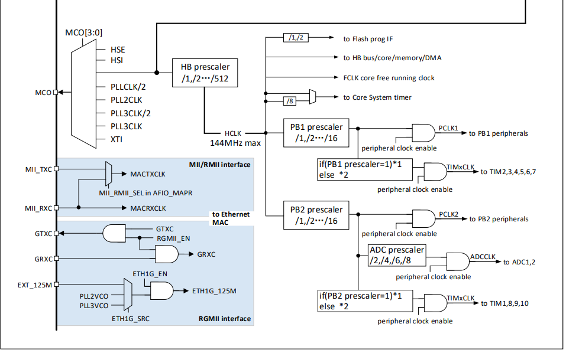
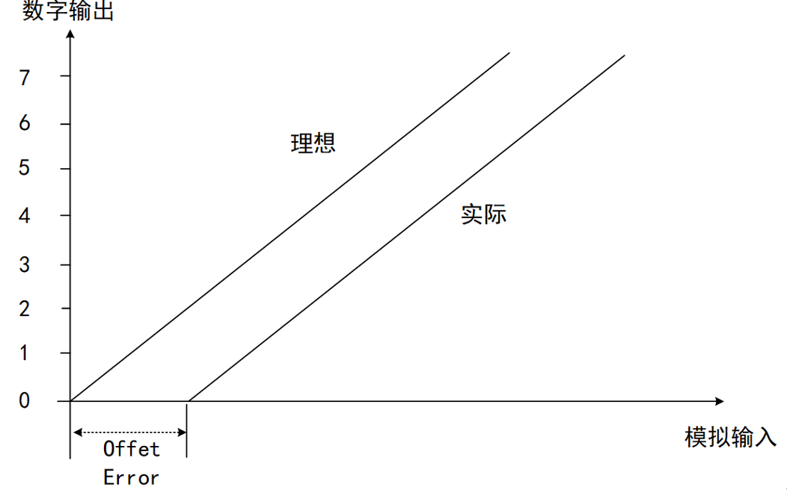
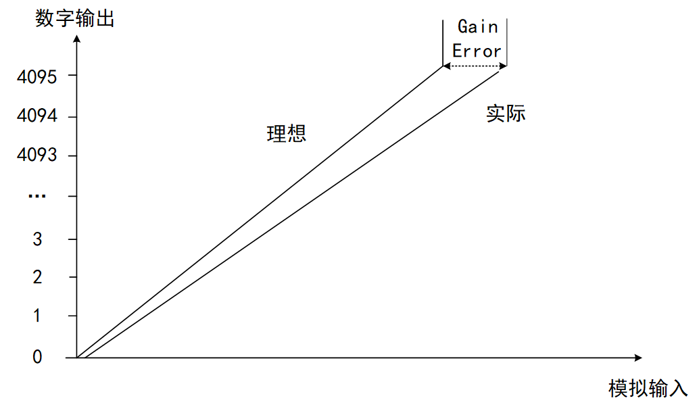
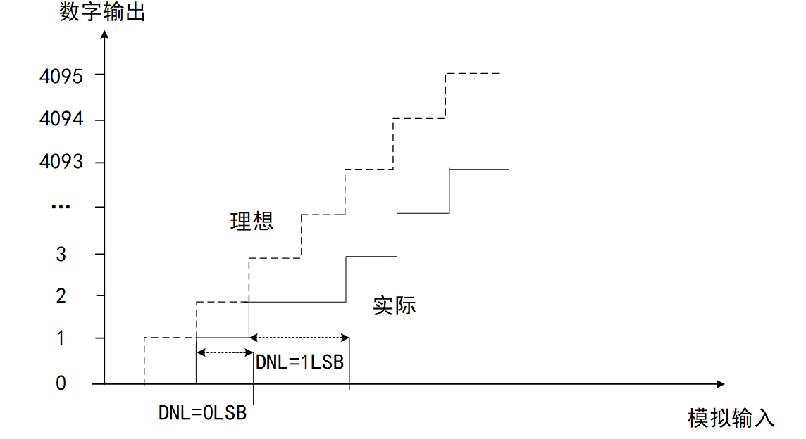
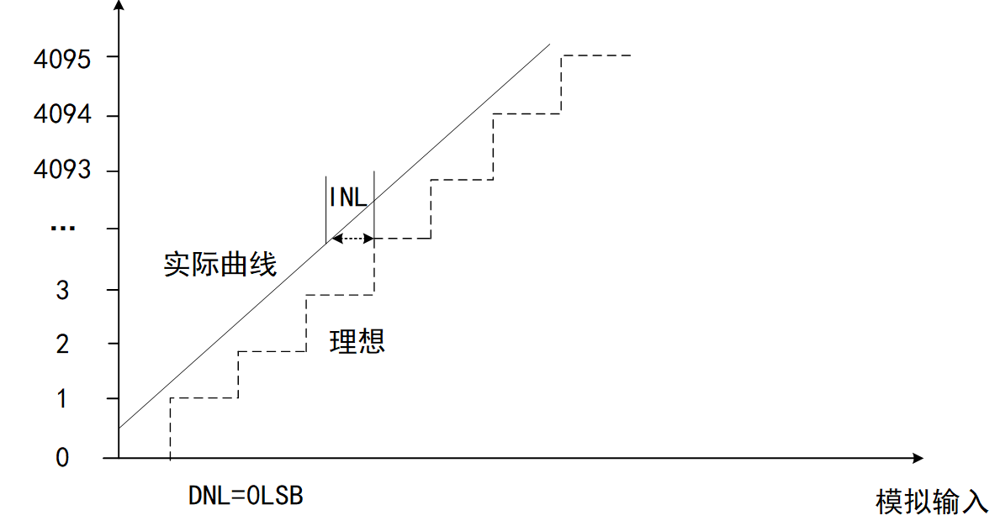
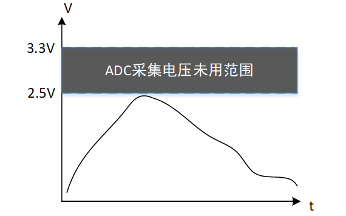
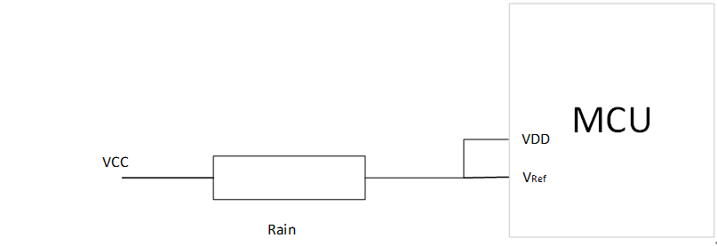
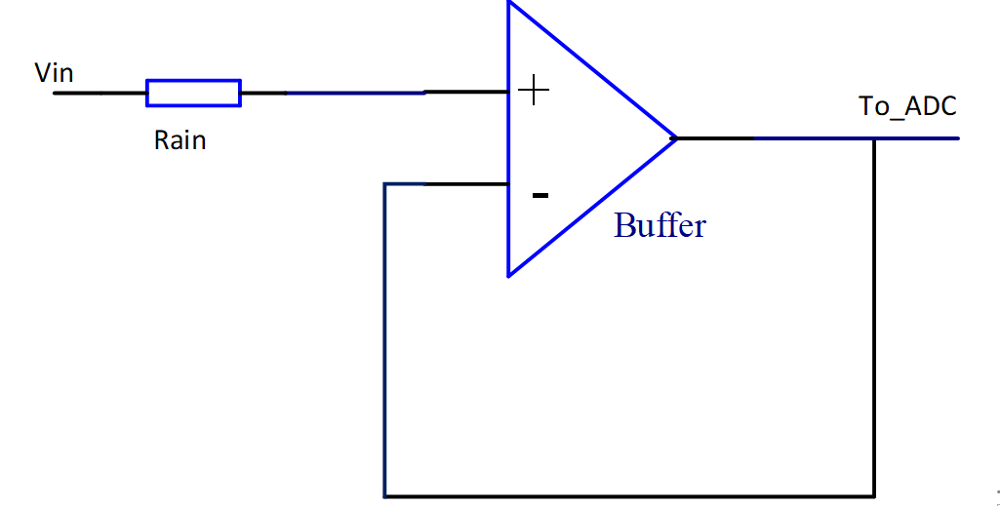
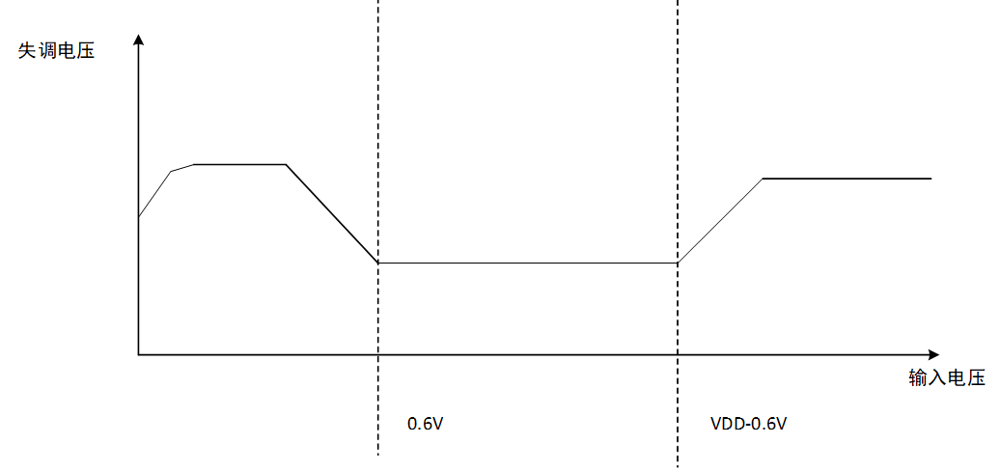

<table>
<colgroup>
<col style="width: 49%" />
<col style="width: 50%" />
</colgroup>
<thead>
<tr>
<th rowspan="2"></th>
<th></th>
</tr>
<tr>
<th>V1.1</th>
</tr>
</thead>
<tbody>
</tbody>
</table>

<span id="_Toc239866853" class="anchor"></span>说明

本文主要介绍了CH32通用MCU系列的12-bit
ADC的使用方法以及注意事项。ADC主要的静态参数计算；想要在实际应用中达到标称的精度，需要在软件配置端与外围电路的设计上给予足够的重视。

**适用范围**

| 适用范围 | 系列        |
|----------|-------------|
| 通用MCU  | CH32通用MCU |

<span id="_Toc239866854" class="anchor"></span>目录

[说明 [1](#_Toc239866853)](#_Toc239866853)

[目录 [2](#_Toc239866854)](#_Toc239866854)

[表格索引 [2](#_Toc239866855)](#_Toc239866855)

[图片索引 [2](#_Toc239866856)](#_Toc239866856)

[第1章 ADC功能简介 [1](#adc功能简介)](#adc功能简介)

[1.1 CH32通用系列ADC简介
[1](#ch32通用系列adc简介)](#ch32通用系列adc简介)

[1.2 ADC采样配置 [1](#adc采样配置)](#adc采样配置)

[1.2.1 ADC内部通道 [2](#adc内部通道)](#adc内部通道)

[1.2.2 ADC内部通道 [2](#adc内部通道-1)](#adc内部通道-1)

[1.2.3 ADC静态参数 [2](#adc静态参数)](#adc静态参数)

[第2章 ADC注意事项 [6](#adc注意事项)](#adc注意事项)

[2.1 ADC使用注意事项 [6](#adc使用注意事项)](#adc使用注意事项)

[2.1.1 ADC参考电源 [6](#adc参考电源)](#adc参考电源)

[2.1.2 ADC输入 [7](#adc输入)](#adc输入)

[历史版本 [10](#_Toc239866867)](#_Toc239866867)

[声明 [11](#_Toc239866868)](#_Toc239866868)

<span id="_Toc239866855" class="anchor"></span>表格索引

[不同型号ADC参数 [1](#_Toc239866869)](#_Toc239866869)

[最大输入阻抗 [7](#_Toc239866870)](#_Toc239866870)

<span id="_Toc239866856" class="anchor"></span>图片索引

[时钟树框图 [2](#_Toc239866871)](#_Toc239866871)

[ADC失调误差 [3](#_Toc239866872)](#_Toc239866872)

[ADC增益误差 [3](#_Toc239866873)](#_Toc239866873)

[ADC微分误差 [4](#_Toc239866874)](#_Toc239866874)

[ADC积分误差 [5](#_Toc239866875)](#_Toc239866875)

[ADC采集电压 [6](#_Toc239866876)](#_Toc239866876)

[供电拓扑结构 [6](#_Toc239866877)](#_Toc239866877)

[ADC采样电路 [7](#_Toc239866878)](#_Toc239866878)

[ADC拓扑结构 [8](#_Toc239866879)](#_Toc239866879)

[外部跟随器 [8](#_Toc239866880)](#_Toc239866880)

[跟随器输入电压与失调电压 [9](#_Toc239866881)](#_Toc239866881)

# ADC功能简介

## CH32通用系列ADC简介

CH32通用系列，为逐次逼近型的模拟数字转换器，可支持外部通道与内部通道信号采集源。可支持单次转换，连续转换，扫描模式，间断模式与外部触发等功能。内置ADC缓冲器，并能配置输入增益可调，可实现小信号放大采样。不同CH32通用系列芯片具有不同的ADC配置，可依据下表进行芯片选型。

<table style="width:96%;">
<caption><p>表1‑1 <span id="_Toc239866869"
class="anchor"></span>不同型号ADC参数</p></caption>
<colgroup>
<col style="width: 13%" />
<col style="width: 13%" />
<col style="width: 15%" />
<col style="width: 13%" />
<col style="width: 9%" />
<col style="width: 13%" />
<col style="width: 15%" />
</colgroup>
<thead>
<tr>
<th style="text-align: center;">芯片型号</th>
<th style="text-align: center;">外部通道数</th>
<th style="text-align: center;">ADC最高时钟</th>
<th style="text-align: center;">最高采样率</th>
<th style="text-align: center;">分辨率</th>
<th style="text-align: center;">适用电压</th>
<th style="text-align: center;">是否有双ADC</th>
</tr>
</thead>
<tbody>
<tr>
<td style="text-align: center;">CH32F10x</td>
<td style="text-align: center;">16</td>
<td style="text-align: center;">14MHz</td>
<td style="text-align: center;">1MHz</td>
<td style="text-align: center;">12bit</td>
<td style="text-align: center;">3.0V～5.5V</td>
<td style="text-align: center;">N</td>
</tr>
<tr>
<td style="text-align: center;">CH32V10x</td>
<td style="text-align: center;">16</td>
<td style="text-align: center;">14MHz</td>
<td style="text-align: center;">1MHz</td>
<td style="text-align: center;">12bit</td>
<td style="text-align: center;">3.0V～5.5V</td>
<td style="text-align: center;">N</td>
</tr>
<tr>
<td style="text-align: center;">CH32F20x</td>
<td style="text-align: center;">16</td>
<td style="text-align: center;">14MHz</td>
<td style="text-align: center;">1MHz</td>
<td style="text-align: center;">12bit</td>
<td style="text-align: center;">2.4V～3.6V</td>
<td style="text-align: center;">Y</td>
</tr>
<tr>
<td style="text-align: center;">CH32F208</td>
<td style="text-align: center;">16</td>
<td style="text-align: center;">14MHz</td>
<td style="text-align: center;">1MHz</td>
<td style="text-align: center;">12bit</td>
<td style="text-align: center;">2.4V～3.6V</td>
<td style="text-align: center;">N</td>
</tr>
<tr>
<td style="text-align: center;">CH32V208</td>
<td style="text-align: center;">16</td>
<td style="text-align: center;">14MHz</td>
<td style="text-align: center;">1MHz</td>
<td style="text-align: center;">12bit</td>
<td style="text-align: center;">2.4V～3.6V</td>
<td style="text-align: center;">N</td>
</tr>
<tr>
<td style="text-align: center;">CH32V20x</td>
<td style="text-align: center;">10</td>
<td style="text-align: center;">14MHz</td>
<td style="text-align: center;">1MHz</td>
<td style="text-align: center;">12bit</td>
<td style="text-align: center;">2.4V～3.6V</td>
<td style="text-align: center;">Y</td>
</tr>
<tr>
<td style="text-align: center;">CH32V203RB</td>
<td style="text-align: center;">16</td>
<td style="text-align: center;">14MHz</td>
<td style="text-align: center;">1MHz</td>
<td style="text-align: center;">12bit</td>
<td style="text-align: center;">2.4V～3.6V</td>
<td style="text-align: center;">N</td>
</tr>
<tr>
<td style="text-align: center;">CH32V30x</td>
<td style="text-align: center;">16</td>
<td style="text-align: center;">14MHz</td>
<td style="text-align: center;">1MHz</td>
<td style="text-align: center;">12bit</td>
<td style="text-align: center;">2.4V～3.6V</td>
<td style="text-align: center;">Y</td>
</tr>
<tr>
<td rowspan="3" style="text-align: center;">CH32V003</td>
<td rowspan="3" style="text-align: center;">8</td>
<td style="text-align: center;">6MHz</td>
<td style="text-align: center;">0.43MHz</td>
<td style="text-align: center;">10bit</td>
<td style="text-align: center;">2.8V～5.5V</td>
<td rowspan="3" style="text-align: center;">N</td>
</tr>
<tr>
<td style="text-align: center;">12MHz</td>
<td style="text-align: center;">0.857MHz</td>
<td style="text-align: center;">10bit</td>
<td style="text-align: center;">3.2V～5.5V</td>
</tr>
<tr>
<td style="text-align: center;">24MHz</td>
<td style="text-align: center;">1.71MHz</td>
<td style="text-align: center;">10bit</td>
<td style="text-align: center;">4.5V～5.5V</td>
</tr>
<tr>
<td rowspan="2" style="text-align: center;">CH32V00x</td>
<td rowspan="2" style="text-align: center;">8</td>
<td rowspan="2" style="text-align: center;">48MHz</td>
<td style="text-align: center;">3MHz</td>
<td style="text-align: center;">12bit</td>
<td style="text-align: center;">4.5V～5.5V</td>
<td rowspan="2" style="text-align: center;">N</td>
</tr>
<tr>
<td style="text-align: center;">1MHz</td>
<td style="text-align: center;">12bit</td>
<td style="text-align: center;">2.4V～5.5V</td>
</tr>
<tr>
<td rowspan="2" style="text-align: center;">CH32L03x</td>
<td rowspan="2" style="text-align: center;">10</td>
<td rowspan="2" style="text-align: center;">48MHz</td>
<td style="text-align: center;">0.2MHz</td>
<td style="text-align: center;">12bit</td>
<td style="text-align: center;">1.8V～3.6V</td>
<td rowspan="2" style="text-align: center;">N</td>
</tr>
<tr>
<td style="text-align: center;">2.4MHz</td>
<td style="text-align: center;">12bit</td>
<td style="text-align: center;">3.0V～3.6V</td>
</tr>
<tr>
<td style="text-align: center;">CH32X03x</td>
<td style="text-align: center;">14</td>
<td style="text-align: center;">8MHz</td>
<td style="text-align: center;">0.47MHz</td>
<td style="text-align: center;">12bit</td>
<td style="text-align: center;">3.0V～5.5V</td>
<td style="text-align: center;">N</td>
</tr>
<tr>
<td style="text-align: center;">CH32V205</td>
<td style="text-align: center;">16</td>
<td style="text-align: center;">64MHz</td>
<td style="text-align: center;">4MHz</td>
<td style="text-align: center;">12bit</td>
<td style="text-align: center;">2.4V～3.6V</td>
<td style="text-align: center;">N</td>
</tr>
<tr>
<td style="text-align: center;">CH32V203CC</td>
<td style="text-align: center;">16</td>
<td style="text-align: center;">64MHz</td>
<td style="text-align: center;">4MHz</td>
<td style="text-align: center;">12bit</td>
<td style="text-align: center;">2.4V～3.6V</td>
<td style="text-align: center;">N</td>
</tr>
<tr>
<td rowspan="2" style="text-align: center;">CH32H41X</td>
<td rowspan="2" style="text-align: center;">16</td>
<td rowspan="2" style="text-align: center;">80MHz</td>
<td style="text-align: center;">2MHz</td>
<td style="text-align: center;">12bit</td>
<td style="text-align: center;">2.7V～3.6V</td>
<td rowspan="2" style="text-align: center;">Y</td>
</tr>
<tr>
<td style="text-align: center;">5MHz</td>
<td style="text-align: center;">12bit</td>
<td style="text-align: center;">3V～3.6V</td>
</tr>
</tbody>
</table>

***注：部分产品未提供内部通道与内部缓冲器，具体细节请查阅芯片手册***。

## ADC采样配置

CH32通用系列，ADC运行不能超过允许最高时钟，每个型号最高时钟可参考表1-1。当配置ADC时钟时，需要注意ADC时钟源与ADC分频系数关系。以CH32V30x为例，ADC使用最高时钟为14MHz；ADC时钟源与ADCCLK与PCLK2同步，由RCC_CFGR0寄存器的ADCPRE\[1:0\]域配置分频，时钟数如图1-1所示；可以看出ADC时钟最高分频为8分频，可以得出在正常使用ADC的情况下PB2时钟应低于112MHz，若使用最高主频144MHz运行情况下，在使用ADC时，PB2时钟建议2分频以上。

根据ADC时钟，转换总时间为：

TCONV = 采样时间 + 12.5TADCCLK

其中采样时间在寄存器中的SMPx\[2:0\]位更改，采集周期时钟基准为ADCCLK，12.5TADCCLK为固定的12.5周期的转换周期。

以ADC时钟为12MHz，采样周期为7.5为例，可以算出：

采样频率为：

``` math
T_{SAMP} = \frac{12MHz}{7.5} = 1.6MHz
```

转换频率为：

``` math
T_{CONV} = \frac{12MHz}{7.5 + 12.5} = 0.8MHz
```

***注：CH32V003的ADC分辨率为10bit，转换时间为11TADCCLK。***

<figure>

<figcaption><p>图1‑1 <span id="_Toc239866871"
class="anchor"></span>时钟树框图</p></figcaption>
</figure>

### ADC内部通道

CH32通用系列，内置2个内部通道：

- 温度传感器：用来测量器件周围的温度（TA），温度传感器，转换电压（mV）与内部温度（℃）线性关系，需要参考不同芯片的应用手册。

- VREFINT内部参考电压：用于采集芯片内部参考电压，典型电压为1.2V，提供了一个稳定的电压用于ADC参考电压比较。

在使用内部通道时，需要通过设置ADC_CTLR2寄存器的TSVREFE位置1，唤醒ADC内部采样通道。推荐设置采样时间大于17.1us。

***注：存在双ADC模块芯片，内部通道只有ADC1模块存在。***

***CH32V10x与CH32F10x系列中，使用外通道时，需要关闭内部通道使能。***

### ADC内部通道

CH32通用系列，存在内部自校准模块，用于消除ADC的偏移误差。校准流程为：

（1）通过写ADC_CTLR2寄存器的RSTCAL位置1初始化校准寄存器，等待RSTCAL硬件清0表示初始化完成。

（2）置位CAL位，启动校准功能，一旦校准结束，硬件会自动清除CAL位，将校准码存储到ADC_RDATAR寄存器中。

### ADC静态参数

H32通用系列为12位ADC，转换数值范围为2的12次方，若是理想的ADC模块，最小的采样电压变化单位以LSB表示，1LSB分辨电压为：

1LSB=Vref/212

其中Vref为ADC的参考电压，如在3.3V供电下，ADC最小分辨电压为0.805mV。

在ADC转换电压时会存在误差，其中典型的静态参数误差有：

（1）失调误差

失调误差（Offset
Error），是指ADC输入0点时所转换电压的偏移值，这个偏移量被称为失调误差Eo：

Eo=实际的转换电压-理想的转换电压。

失调误差反映的是第一个标值点与实际点的偏置差异，当第一个点读取数值为4，可得出失调误差为4，若实际出现非0数值，对应的标值点为4，可得出失调误差为-3。

<figure>

<figcaption><p>图 ‑2 <span id="_Toc239866872"
class="anchor"></span>ADC失调误差</p></figcaption>
</figure>

（2）增益误差

增益误差（Gain error）是指转换满值电压值与理想值之间的偏差，表示了ADC
在将模拟输入转换为数字输出时引入的放大或缩小的误差值，用符号EG表示。

图1-1‑3 <span id="_Toc239866873" class="anchor"></span>ADC增益误差



若输入电压为Vref时未获得满值（0xffff），则为正增益；若输入电压在未满Vref时得到满值（0xffff），则为负失调，此时增益误差为实际的转换电压-理想的转换电压。如在理想值为0xfffe时，采集电压为0xffff，则负失调电压为1LSB。

（3）微分误差

微分非线性误差（DNL），去除增益误差与失调误差下，每两个相邻的电压采集差，理想的ADC台阶宽度为1，即DNL为0，微分误差DNL计算为：

``` math
D_{NL}(i) = \frac{V_{STP}(i) - V_{LSB}}{V_{LSB}}
```

``` math
V_{STP}(i) = V_{CONV}(i) - V_{CONV}(i - 1)
```

其中DNL（i）表示输出曲线中第i个微分非线性误差，VSTEP（i）表示输出曲线中第i个量化区间的台阶宽度，VCONV表示采集的电压值。VLSB表示第i个理想宽度。

例如在在理想ADC中，每个阶梯理想宽度为1，即VLSB=1，在第三的转换值与第三次转换值，阶梯宽度为2，则第3个阶梯的微分误差为1。

图1-1‑4 <span id="_Toc239866874" class="anchor"></span>ADC微分误差



（4）积分误差

积分非线性误差（INL），为实际起点与终点之前的最大偏差，可以看作为实际起点与终点连线与理想电压线之间的最大值。

如图1-5所示，实际曲线为第一个实际转换值点与最后一个实际转换值点的线条。EL值为是每个理想值与实际曲线的偏差值。

图1-1‑5 <span id="_Toc239866875" class="anchor"></span>ADC积分误差



# ADC注意事项

## ADC使用注意事项

在使用CH32通用系列ADC时，需要注意参考电压阈值，ADC输入阻抗与电压；可用过对软件更改采样时间，更改外部输入等方式可减少因ADC使用不当而引起的总误差。

### ADC参考电源

对于CH32通用系列，如果为全封装芯片，存在VREF引脚时，VREF引脚接入电压为ADC参考电压，在使用ADC时，参考电压不小于设计阈值；且不能高于VDDA供电电压。若无VREF引脚，参考电压供电引脚则为VDDA，且使用ADC时，VDDA供电压最小值可参考表1-1，这时供电关系为VDDA≤VDD。

为提高ADC采样精度，可参考供电方案：

（1）为获得最佳的ADC转换精度，可使ADC的动态范围与供电电压相匹配：

如下图所示：

图2‑1 <span id="_Toc239866876" class="anchor"></span>ADC采集电压



若ADC参考电压为3.3V，转换电压信号幅值为2.5V，则会出现有992个未转换状态，也就意味着ADC精度受损。因此参考电压可改为转换电压峰幅值2.5V；最小分辨电压由0.85mV转为0.61mV提高采集精度。

（2）使用独立的外部电源作为参考电压：

如果有Vref或有VDDA独立引脚。可使用独立的参考电源，确保独立供电的稳定性。参考电压源尽量为低输出阻抗，以便以输入电压的准确性。如下图所示：

图2‑2 <span id="_Toc239866877" class="anchor"></span>供电拓扑结构



若与VDD同一电源时，Vref与供电端存在压降，为Vref=VCC-IDD\*R<sub>ain</sub>，其中IDD为芯片供电电流，R<sub>ain</sub>为电源到电源引脚输入阻抗。由此可以看出当使用芯片功耗较大时，使用Vref与VDD短接的情况下，若外部阻抗较大，势必存在较大的压差，从而影响参考电压值，导致ADC增益误差较大。

### ADC输入

当配置采样周期时需要考虑外部输入阻抗的影响，ADC输入阻抗与采样率需要满足：


其中RAIN为外部输入阻抗，RADC为ADC开关阻抗，f<sub>ADC</sub>为ADC时钟频率，C<sub>ADC</sub>为内部采样电容，N为分辨率，对于CH32通用芯片，为12位采样ADC，即N=12。对于常用的CH32L103芯片举例，f<sub>ADC</sub>
= 14MHz时的最大R<sub>AIN</sub>：

表2‑1 <span id="_Toc239866870" class="anchor"></span>最大输入阻抗

| T<sub>S</sub>(周期) | t<sub>S</sub>(us) | 最大R<sub>AIN</sub>(kΩ) |
|:-------------------:|:-----------------:|:-----------------------:|
|         1.5         |       0.11        |           1.2           |
|         7.5         |       0.54        |          12.3           |
|        13.5         |       0.96        |          23.3           |
|        28.5         |       2.04        |           50            |
|        41.5         |       2.96        |           75            |
|        55.5         |       3.96        |           \-            |
|        71.5         |       5.11        |           \-            |
|        239.5        |       17.1        |           \-            |

使用ADC常用的ADC采样电路常用如下图：

图2‑3 <span id="_Toc239866878" class="anchor"></span>ADC采样电路


通过电路可以看出，R51与R52为电阻分压，其结构为并联结构，因此输入到ADC电压可等效电阻计算为：

R<sub>in</sub> = R<sub>51</sub>//R<sub>52</sub> =
R<sub>51</sub>\*R<sub>52</sub>/(R<sub>51</sub>+R<sub>52</sub>) = 3.20KΩ

输入R53与输入并联等效阻抗为串联，因此ADC的输入端的阻抗为：

R<sub>out</sub> = R<sub>in</sub> + R<sub>53</sub> = 3.20KΩ + 1KΩ =
4.20KΩ。

在大多数情况下，为了降低外部噪声干扰，通常输入端会加入电容组成一个RC低通滤波器，以限制高频噪声进入。在选择电容时，通常会根据期望截止频率来选择，但在使用ADC采样时，选择电容大小也应考虑到充电响应时间，使用ADC采集拓扑结构如下图：

<figure>

<figcaption><p>图2‑4 <span id="_Toc239866879"
class="anchor"></span>ADC拓扑结构</p></figcaption>
</figure>

其中C<sub>p</sub>表示外部电容，C<sub>ADC</sub>为内部保持电容，当输入电压在采集变化时需要计算采样时间周期，以满足，采样精度的需求，电容充电时长为：

``` math
V(t) = V_{AIN} \times （1 - e^{- t/\tau}）
```

其中V(t)为在采样结束后，ADC输入端的实际电压，τ为RC充电参数，其R<sub>ain</sub>\*(C<sub>p</sub>//C<sub>ADC</sub>)。

由此可得，当变化为幅值为VDD时，采样时长t需要满足：

``` math
t \geq R_{ain} \times (C_{p}//C_{ADC}) \times In(V_{VIN} - V(t))
```

若输入端分辨率为1/2LSB，且输入端幅值满足Vref最大值，可以得出，采样时应不低于：

``` math
T_{s} \geq f_{ADC} \times (R_{ain} \times C_{p}//C_{ADC})) \times In(2^{N + 1})
```

其中Ts为ADC的采样周期，fADC为ADC的采样频率。可得出，当采样过程中电压存在变化时，滤波电容的影响，需要调整采样周期大小，以确保ADC精度。

考虑输入阻抗对ADC精度影响，可通过以下方式进行改善：

（1）提高采样时间：在不影响采样率的情况下，可使用提高主频，增加采样周期的方式，以解决高阻抗输入源的影响。根据ADC转换总时间公式；如使用ADC主频为4MHz采样周期为3.5，则，采样时间为0.875us。转换总时间为4us；在此条件下采样时间不够的话，可调整为ADC主频为12MHz，采样周期为28.5，可允许外部阻抗提高；对应的转换总时间为3.4us。

（2）使用电压跟随器：对输入阻抗较大，可在前级增加电源跟随器，如下图所示：

图2‑5 <span id="_Toc239866880" class="anchor"></span>外部跟随器



根据跟随器的特性：高阻抗输入，低阻抗输出。ADC输入与外部负载无关，因此使用高ADC阻抗时，可使用电压跟随器解决这一问提。在ADC模块中，内部存在PGA模式，可通过开启ADC_CTLR1中BUFEN=1开启输入buff，选取增益为1即可，但运放器存在失调误差，而运放的失调影响ADC的采集精度，若电压跟随器为正失调，且失调电压为V<sub>OFFSET</sub>，则输入电压采集值为：

V<sub>in</sub>=V<sub>out</sub>+V<sub>OFFSET</sub>

且失调电压值与输入电压具有相关性，失调电压典型模型为：

图2‑6 <span id="_Toc239866881"
class="anchor"></span>跟随器输入电压与失调电压



因此可选择输入电压范围来确保ADC采集精度。例如在0.6V~VDD-0.6V，跟随器的失调值稳定，ADC所采集值会出现固定偏差。以确保采集可靠性。因跟随器的失调电压有正负，因此只描述一种典型现象。

虽然电压跟随器具有输入阻抗低的特点，但并不意味着使用电压跟随器能适用于所有采样速率，在配置ADC采样速率时需要考虑跟随器的响应速度，采样速率应为跟随器的响应速度的几倍。如使用芯片内部跟随器，考虑到跟随器响应速度与内部寄生电容，采样时间应不低于0.2us。

（3）CH32通用系列的ADC外设为开关电容式ADC。开关电容为内部采样和保持电容（C<sub>ADC</sub>）。如果输入阻抗较大值时，当采样结束时，内部采样电容充电不足会出现信号压降。可以在ADC引脚外部添加一个远大于C<sub>ADC</sub>的电容，以达到内部采样电容C<sub>p</sub>向外部电容C<sub>ADC</sub>充放电。C<sub>p</sub>选择大小，与分辨率精度需求U<sub>lsb</sub>关系大致为：

C<sub>p</sub>≥(U<sub>max</sub>/U<sub>lsb</sub>)\*C<sub>ADC</sub>

如使用CH32V20x芯片，内部采样和保持电容C<sub>ADC</sub>=8pF,分辨精度需求为1LSB，若采集幅值为VDD，则外部电压CADC应满足：C<sub>p</sub>≥(4095/1)\*8pF=32nF，因此可选外挂电容可选用47nF。若采集幅值非满值，则可对应减小外部电容。

<span id="_Toc239866867" class="anchor"></span>历史版本

| 日期     | 版本 | 变更内容                       |
|----------|------|--------------------------------|
| 2026/7/8 | V1.0 | 初版发行                       |
| 2026/9/7 | V1.1 | 勘误：表1-1中部分芯片没有双ADC |

<span id="_Toc239866868" class="anchor"></span>声明

本手册仅供参考。作者在不另行通知的情况下，可随时进行修改。
