V1.0

# 说明

本文主要介绍了CH32X315通用MCU具有四个ADC模块；ADC可使用级联的方式可以对4个ADC同时使用，可达到同时采集的目的。此外，CH32X315具有扫描输出功能，可配合开关芯片完成多个通道全自动自动扫描。

适用范围

| 适用范围 | 系列     |
|----------|----------|
| 通用MCU  | CH32X315 |

目录

[说明 [i](#说明)](#说明)

[目录 [ii](#_Toc207035732)](#_Toc207035732)

[表格索引 [ii](#_Toc207035733)](#_Toc207035733)

[图片索引 [ii](#_Toc207035734)](#_Toc207035734)

[第1章 ADC模式介绍 [1](#adc模式介绍)](#adc模式介绍)

> [1.1 CH32X315 ADC功能简介
> [1](#ch32x315-adc功能简介)](#ch32x315-adc功能简介)
>
> [1.2 ADC同步采样 [1](#adc同步采样)](#adc同步采样)
>
> [1.3 ADC扫描输出 [2](#adc扫描输出)](#adc扫描输出)

[第2章 ADC模式使用 [4](#adc模式使用)](#adc模式使用)

> [2.1 ADC模式配置 [4](#adc模式配置)](#adc模式配置)

[历史版本 [9](#历史版本)](#历史版本)

[声明 [10](#_Toc207035742)](#_Toc207035742)

表格索引

[表1-1 ADC引脚分配 [1](#_Toc229218027)](#_Toc229218027)

[表1-2 CH448控制表 [2](#_Toc229218028)](#_Toc229218028)

图片索引

[图1-1多通道同步模式转换 [1](#_Toc238218118)](#_Toc238218118)

[图1-2 4组ADC同步采样 [2](#_Toc238218119)](#_Toc238218119)

[图1-3 扫描输出引脚状态 [2](#_Toc238218120)](#_Toc238218120)

[图2-1 同步规则模式选择 [4](#_Toc229217470)](#_Toc229217470)

[图2-2 ADC级联模式配置 [4](#_Toc229217471)](#_Toc229217471)

[图2-3 CH448示意图 [5](#_Toc229217472)](#_Toc229217472)

[图2-4 CH448多通道开关拓扑图 [5](#_Toc229217473)](#_Toc229217473)

[图2-5 扫描输出配置 [6](#_Toc229217474)](#_Toc229217474)

[图2-6 ADC初始化 [6](#_Toc229217475)](#_Toc229217475)

[图2-7 DMA初始化 [7](#_Toc229217476)](#_Toc229217476)

[图2-8 定时器初始化 [7](#_Toc229217477)](#_Toc229217477)

[图2-9 CH448 外围电路 [8](#_Toc229217478)](#_Toc229217478)

#  ADC模式介绍

## CH32X315 ADC功能简介

CH32X315与通用相比，具有以下优点：

1)  具有4个ADC，支持多ADC转换模式。

2)  每个ADC通道均有独立引脚，4组ADC共提供4\*12=48个外部通道采样。

3)  具有扫描输出功能，可外加开关芯片实现ADC通道扩展。

ADC引脚分配见下表：

<table style="width:79%;">
<caption>
表1-
ADC引脚分配
</caption>
<colgroup>
<col style="width: 12%" />
<col style="width: 6%" />
<col style="width: 12%" />
<col style="width: 6%" />
<col style="width: 12%" />
<col style="width: 6%" />
<col style="width: 12%" />
<col style="width: 6%" />
</colgroup>
<thead>
<tr>
<th colspan="2" style="text-align: center;">ADC1</th>
<th colspan="2" style="text-align: center;">ADC2</th>
<th colspan="2" style="text-align: center;">ADC3</th>
<th colspan="2" style="text-align: center;">ADC4</th>
</tr>
</thead>
<tbody>
<tr>
<td>ADC通道</td>
<td style="text-align: center;">引脚</td>
<td style="text-align: center;">ADC通道</td>
<td style="text-align: center;">引脚</td>
<td style="text-align: center;">ADC通道</td>
<td style="text-align: center;">引脚</td>
<td style="text-align: center;">ADC通道</td>
<td style="text-align: center;">引脚</td>
</tr>
<tr>
<td>ADC1_IN0</td>
<td style="text-align: center;">PA2</td>
<td style="text-align: center;">ADC2_IN0</td>
<td style="text-align: center;">PB6</td>
<td style="text-align: center;">ADC3_IN0</td>
<td style="text-align: center;">PB10</td>
<td style="text-align: center;">ADC4_IN0</td>
<td style="text-align: center;">PD14</td>
</tr>
<tr>
<td>ADC1_IN1</td>
<td style="text-align: center;">PA3</td>
<td style="text-align: center;">ADC2_IN1</td>
<td style="text-align: center;">PB7</td>
<td style="text-align: center;">ADC3_IN1</td>
<td style="text-align: center;">PB11</td>
<td style="text-align: center;">ADC4_IN1</td>
<td style="text-align: center;">PD15</td>
</tr>
<tr>
<td>ADC1_IN2</td>
<td style="text-align: center;">PA4</td>
<td style="text-align: center;">ADC2_IN2</td>
<td style="text-align: center;">PC8</td>
<td style="text-align: center;">ADC3_IN2</td>
<td style="text-align: center;">PD8</td>
<td style="text-align: center;">ADC4_IN2</td>
<td style="text-align: center;">PC0</td>
</tr>
<tr>
<td>ADC1_IN3</td>
<td style="text-align: center;">PA5</td>
<td style="text-align: center;">ADC2_IN3</td>
<td style="text-align: center;">PC9</td>
<td style="text-align: center;">ADC3_IN3</td>
<td style="text-align: center;">PD9</td>
<td style="text-align: center;">ADC4_IN3</td>
<td style="text-align: center;">PC1</td>
</tr>
<tr>
<td>ADC1_IN4</td>
<td style="text-align: center;">PA6</td>
<td style="text-align: center;">ADC2_IN4</td>
<td style="text-align: center;">PC10</td>
<td style="text-align: center;">ADC3_IN4</td>
<td style="text-align: center;">PD10</td>
<td style="text-align: center;">ADC4_IN4</td>
<td style="text-align: center;">PC2</td>
</tr>
<tr>
<td>ADC1_IN5</td>
<td style="text-align: center;">PA7</td>
<td style="text-align: center;">ADC2_IN5</td>
<td style="text-align: center;">PC11</td>
<td style="text-align: center;">ADC3_IN5</td>
<td style="text-align: center;">PD11</td>
<td style="text-align: center;">ADC4_IN5</td>
<td style="text-align: center;">PC3</td>
</tr>
<tr>
<td>ADC1_IN6</td>
<td style="text-align: center;">PB0</td>
<td style="text-align: center;">ADC2_IN6</td>
<td style="text-align: center;">PC12</td>
<td style="text-align: center;">ADC3_IN6</td>
<td style="text-align: center;">PD12</td>
<td style="text-align: center;">ADC4_IN6</td>
<td style="text-align: center;">PC4</td>
</tr>
<tr>
<td>ADC1_IN7</td>
<td style="text-align: center;">PB1</td>
<td style="text-align: center;">ADC2_IN7</td>
<td style="text-align: center;">PC13</td>
<td style="text-align: center;">ADC3_IN7</td>
<td style="text-align: center;">PD13</td>
<td style="text-align: center;">ADC4_IN7</td>
<td style="text-align: center;">PC5</td>
</tr>
<tr>
<td style="text-align: left;">ADC1_IN8</td>
<td style="text-align: center;">PB2</td>
<td style="text-align: center;">ADC2_IN8</td>
<td style="text-align: center;">PC14</td>
<td style="text-align: center;">ADC3_IN8</td>
<td style="text-align: center;">PA8</td>
<td style="text-align: center;">ADC4_IN8</td>
<td style="text-align: center;">PC6</td>
</tr>
<tr>
<td style="text-align: left;">ADC1_IN9</td>
<td style="text-align: center;">PB3</td>
<td style="text-align: center;">ADC2_IN9</td>
<td style="text-align: center;">PC15</td>
<td style="text-align: center;">ADC3_IN9</td>
<td style="text-align: center;">PA9</td>
<td style="text-align: center;">ADC4_IN9</td>
<td style="text-align: center;">PC7</td>
</tr>
<tr>
<td style="text-align: left;">ADC1_IN10</td>
<td style="text-align: center;">PB4</td>
<td style="text-align: center;">ADC2_IN10</td>
<td style="text-align: center;">PB8</td>
<td style="text-align: center;">ADC3_IN10</td>
<td style="text-align: center;">PD4</td>
<td style="text-align: center;">ADC4_IN10</td>
<td style="text-align: center;">PA0</td>
</tr>
<tr>
<td style="text-align: left;">ADC1_IN11</td>
<td style="text-align: center;">PB5</td>
<td style="text-align: center;">ADC2_IN11</td>
<td style="text-align: center;">PB9</td>
<td style="text-align: center;">ADC3_IN11</td>
<td style="text-align: center;">PD5</td>
<td style="text-align: center;">ADC4_IN11</td>
<td style="text-align: center;">PA1</td>
</tr>
</tbody>
</table>

此外，4个ADC都支持使用DMA操作。

## ADC同步采样

CH32X315具有4个ADC，可分别支持双ADC模式，在双ADC模式下可配置同步模式，可对所对应通道进行同步采集。在双ADC模式下，只可对ADC1/ADC2与ADC3/ADC4进行配置，在同步模式下，主ADC只需一个触发源，次ADC同步进行转换，即完成电压信号同一时刻进行采集。图1-1为多通道同步模式转换示意图。

<figure>

<figcaption>
图1-多通道同步模式转换
</figcaption>
</figure>

在双ADC模式下，只可对ADC1/ADC2与ADC3/ADC4进行操作，因此可以与级联的方式进行4组ADC进行互联。CH32X315级联可配置前级ADC，可通过设置前级触发源与触发延时可对多ADC进行互联，在使用级联模式下，可与双ADC模式下配置，即可完成4个ADC进行采样。若设置触发延时为0，在使用一个触发源下，即可完成4组ADC同步采样。当触发延时为0，同时使用双ADC同步模式时，转换序列为：

<figure>
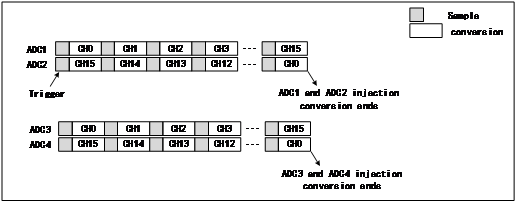
<figcaption>
图1-
4组ADC同步采样
</figcaption>
</figure>

在该模式下，可同时采集四个通道。与通用双ADC相比，采集速度可以提升一倍。由于每个ADC通道引脚均不互斥，因此CH32X315在使用该模式时与其他通用系列相比也没有通道转换序列限制。

## ADC扫描输出

CH32X315支持扫描输出模式，该模式下在ADC扫描完成后轮次计数后对应的ADCSx引脚进行扫描输出。依据ADC的配置：在一次触发源开启转换时到最后一个ADC序列采集完成后为一轮ADC采集完成。若设置为3位计数周期时，ADC采集一轮后对应的引脚输出状态为：

<figure>
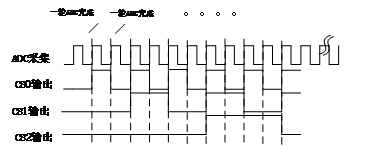
<figcaption>
图1-
扫描输出引脚状态
</figcaption>
</figure>

基于此功能，可外接8通道开关芯片进行ADC通道扩展；以选用CH448
2路8选一开关芯片为例，其控制表为：

<table style="width:60%;">
<caption>
表1-
CH448控制表
</caption>
<colgroup>
<col style="width: 7%" />
<col style="width: 7%" />
<col style="width: 6%" />
<col style="width: 6%" />
<col style="width: 6%" />
<col style="width: 11%" />
<col style="width: 11%" />
</colgroup>
<thead>
<tr>
<th>XEN#</th>
<th>YEN#</th>
<th>SEL2</th>
<th>SEL1</th>
<th>SEL0</th>
<th>AX</th>
<th>AY</th>
</tr>
</thead>
<tbody>
<tr>
<td colspan="2">0</td>
<td>0</td>
<td>0</td>
<td>0</td>
<td>选择 A0X</td>
<td>选择 A0Y</td>
</tr>
<tr>
<td colspan="2">0</td>
<td>0</td>
<td>0</td>
<td>1</td>
<td>选择 A1X</td>
<td>选择 A1Y</td>
</tr>
<tr>
<td colspan="2">0</td>
<td>0</td>
<td>1</td>
<td>0</td>
<td>选择 A2X</td>
<td>选择 A2Y</td>
</tr>
<tr>
<td colspan="2">0</td>
<td>0</td>
<td>1</td>
<td>1</td>
<td>选择 A3X</td>
<td>选择 A3Y</td>
</tr>
<tr>
<td colspan="2">0</td>
<td>1</td>
<td>0</td>
<td>0</td>
<td>选择 A4X</td>
<td>选择 A4Y</td>
</tr>
<tr>
<td colspan="2">0</td>
<td>1</td>
<td>0</td>
<td>1</td>
<td>选择 A5X</td>
<td>选择 A5Y</td>
</tr>
<tr>
<td colspan="2">0</td>
<td>1</td>
<td>1</td>
<td>0</td>
<td>选择 A6X</td>
<td>选择 A6Y</td>
</tr>
<tr>
<td colspan="2">0</td>
<td>1</td>
<td>1</td>
<td>1</td>
<td>选择 A7X</td>
<td>选择 A7Y</td>
</tr>
<tr>
<td colspan="2">1</td>
<td>x</td>
<td>x</td>
<td>x</td>
<td>全部断开</td>
<td>全部断开</td>
</tr>
</tbody>
</table>

可以看出，使用扫描输出模式可以依次完成对A0X-A7X，A0Y-A7Y的外部扩展通道依次采集。从而由2路ADC扩展至16路ADC通道。

#  ADC模式使用

## ADC模式配置

1.同步规则模式

在使用4个ADC同步采样时，首先需要配置双ADC同步模式，需要对ADC1，ADC2双ADC模式选择同步模式，示例已规则同步为例，此模式下用于转换规则通道序列，当ADC1触发转换时，同时它也将用于同步触发ADC2。转换完成时，将产生一个32位DMA传输请求。同样ADC3与ADC4也有相同的效果。

<figure>
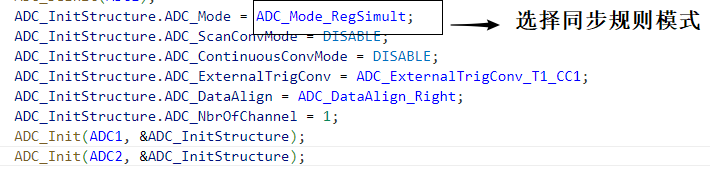
<figcaption>
图2-
同步规则模式选择
</figcaption>
</figure>

2.级联模式

配置ADC1/ADC2与ADC3/ADC4双ADC规则同步模式后，可使用级联模式达到一个触发源开启四个ADC转换。级联模式需要配置：

（1）选择前级ADC，根据ADC前级配置可选择ADC模块转换序列；如ADC3的前级配置为ADC1，则只需启动ADC1触发源，根据配置ADC3进行转换，不需要启动ADC3的触发源。

（2）选择级联使能；根据配置注入组或规则组触发选择级联使能为注入组或规则组；选择规则级联使能时，前级ADC规则组触发后，后级ADC规则组进行触发转换。

（3）设置触发延时；可配置规则/注入通道触发延时，设置步进为一个ADC时钟周期，如设置触发延时为0，可达到前级ADC触发转换时，后级ADC同时进行转换；可达到同步采集的效果。在使用触发延时；ADC的延迟设置配置的是后级的ADC的延迟
当前ADC没有后级不配置。

在该功能下，通过设置触发延时为0，使用双ADC同步采集模式下，可完成4个ADC同步采集；在扫描模式下，转换序列转换周期需要相同用于采集同一时刻信号源。

已规则同步为例，若使用4个ADC同步采样时，需要开启ADC3规则级联使能；前级ADC为ADC1，并ADC1触发延时为0。

<figure>
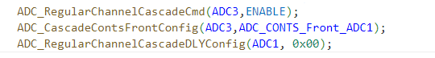
<figcaption>
图2-
ADC级联模式配置
</figcaption>
</figure>

3.扫描输出

ADC扫描输出模式引脚可外接开关芯片可外扩ADC通道扩展，并实现ADC通道自动切换。ADC扫描输出有3个引脚输出，因此可外接CH448为8选一开关芯片配合，进行2\*8个通道自动切换。扫描输出引脚为

| ADC扫描功能 | ADCS0     | ADCS1     | ADCS2     |
|-------------|-----------|-----------|-----------|
| 可选引脚    | PA10(AF5) | PA11(AF5) | PA12(AF5) |

表2- 扫描输出引脚

依据开关芯片控制表，只需将开关芯片开关的选择输入端SEL0-SEL2与ADC的扫描输出端ADCS0-
ADCS2短接，在每次ADC转换一轮后，ADC输入端AX/AY可以自动切换模拟开关的输入选择端A0X-A7X与A0Y-A7Y。

<figure>
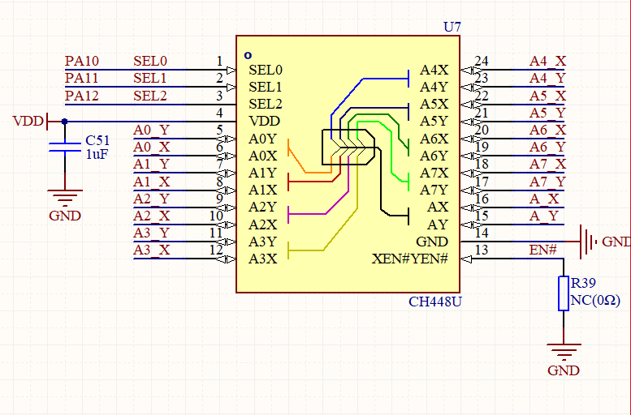
<figcaption>
图2-
CH448示意图
</figcaption>
</figure>

基于图，可外扩多个8选一的开关芯片，完成对ADC通道扩展，支持最多8\*48=384个ADC通道全自动切换。

<figure>
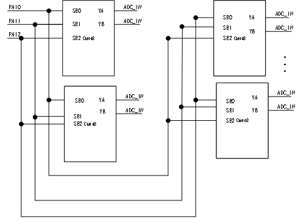
<figcaption>
图2-
CH448多通道开关拓扑图
</figcaption>
</figure>

在使用CH32X315扫描输出时，需要配置步骤如下;

（1）配置扫描输出配置源；通过ADCx_SCANCNT寄存器SCSCFG位选择规则通道或注入通道进行扫描通道源选择；来确认规则通道或者注入通道采集一轮后，ADCSx引脚输出发生变化。

（2）配置扫描周期计数使能位，过ADCx_SCANCNT寄存器使能SCANOEx位进行周期计数使能位使能，根据选择外接开关器件来配置周期计数使能位；若使用8选1开关CH448配置扫描周期计数使能为SCANOE0-
SCANOE2；若选用4选1开关CH444可配置描周期计数使能为SCANOE0- SCANOE1。

（3）设置扫描周期计数器输出ADC选择；通过设置R32_EXTEN_CTR寄存器ADC_SCAN_SEL\[1:0\]位选择ADCx扫描周期计数输出至GPIO。若选择为ADC1时，只有当ADC1一轮采集结束后，输出扫描引脚电平才会发生改变。

设置为规则组为配置扫描输出，扫描计数周期使能为SCANOE0-
SCANOE2，设置扫描周期计数为ADC1有效。

<figure>
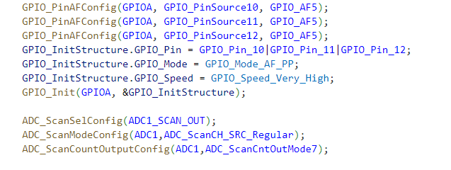
<figcaption>
图2-
扫描输出配置
</figcaption>
</figure>

4.整体配置

实现效果为，4个ADC同步采样，外接2个8选1开关芯片实现4\*8个外扩ADC通道，定时轮询采集；ADC初始化为:

<figure>
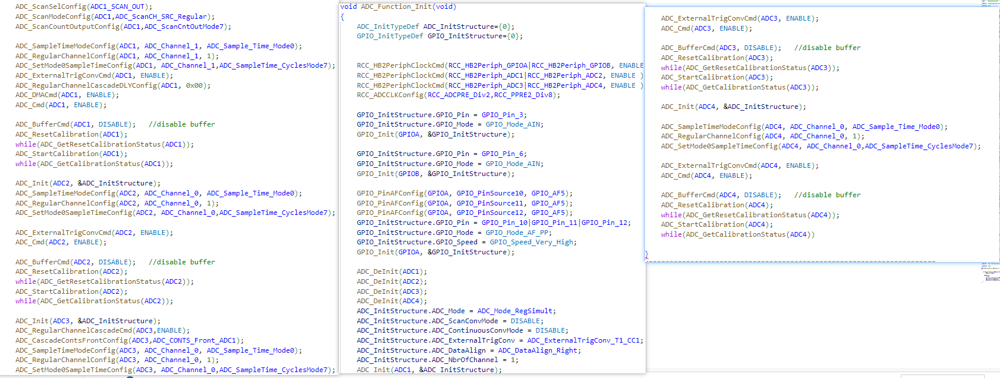
<figcaption>
图2-
ADC初始化
</figcaption>
</figure>

选择输出扫描引脚为ADCS0-ADCS2，扫描周期计数器输出**为ADC1有效，配置为双ADC同步**规则配置，使用级联为ADC3前级为ADC1且触发延时为0。选择外部触发源为TIM1_CC1，进行定时触发；分别配置ADC1-ADC4同序列通道相同采样周期。

DMA初始化：在双ADC同步规则模式下，转换完成时，将产生一个32位DMA传输请求，其中ADC1高低16位分别为ADC2与ADC1采集数值；ADC3高低16位分别为ADC4与ADC3采集数值。因此配置DMA初始化时只需使能ADC1与ADC3通道。

<figure>
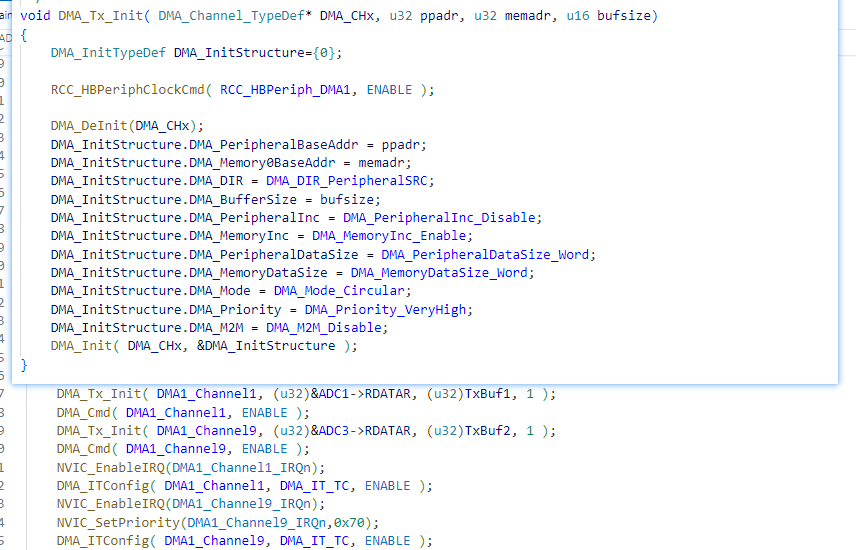
<figcaption>
图2-
DMA初始化
</figcaption>
</figure>

触发信号配置：选用定时器比较触发，用于定时采样。

<figure>
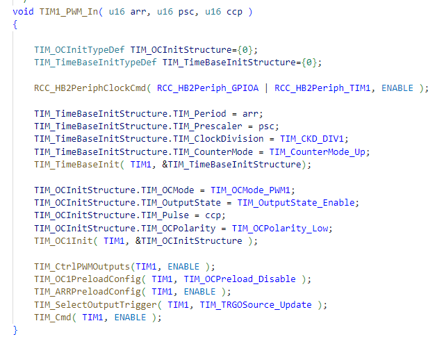
<figcaption>
图2-
定时器初始化
</figcaption>
</figure>

按照选择ADC通道，开关芯片X/Y公共端分别接入ADC2/ADC1与ADC3/ADC4的ADC输入通道；开关输入端口AxX与AxY分别接入被测信号，通过配置即可完成对ADC1通道1对A0Y-A7Y定时器轮询采样；ADC2通道0对A0X-A7X定时器轮询采样；ADC3通道0对A0Y_1-A7Y_1定时器轮询采样；ADC4通道0对A0X_1-A7X_1定时器轮询采样；外接开关芯片电路图：

<figure>
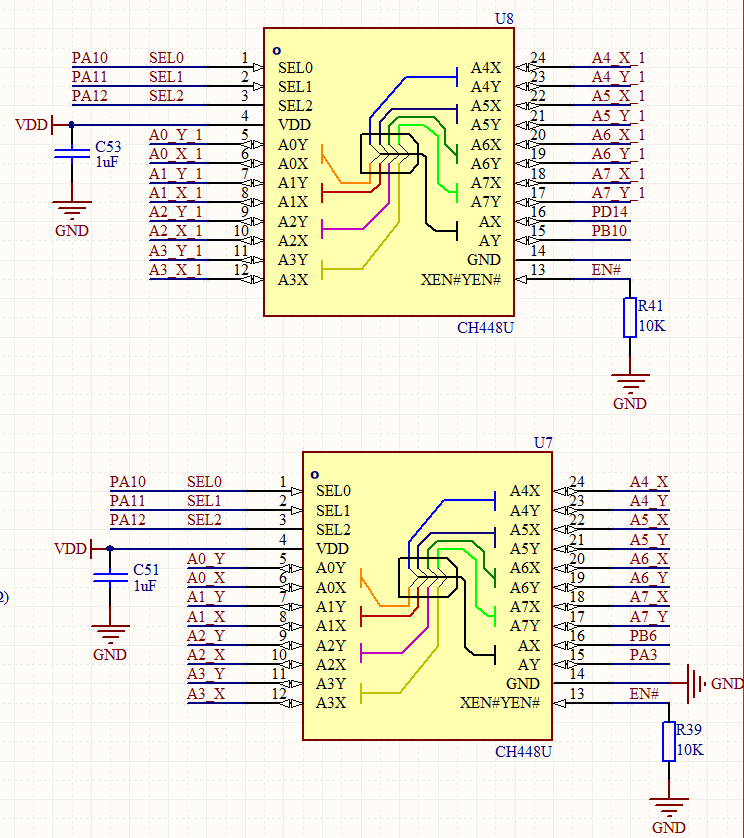
<figcaption>
图2- CH448
外围电路
</figcaption>
</figure>

# 历史版本

更新内容

| 日期       | 版本 | 变更内容 |
|------------|------|----------|
| 2025/11/20 | V1.0 | 初版发行 |

声明

本手册版权所有为南京沁恒微电子股份有限公司（Copyright © Nanjing Qinheng
Microelectronics Co., Ltd. All Rights
Reserved），未经南京沁恒微电子股份有限公司书面许可，任何人不得因任何目的、以任何形式（包括但不限于全部或部分地向任何人复制、泄露或散布）不当使用本产品手册中的任何信息。

任何未经允许擅自更改本产品手册中的内容与南京沁恒微电子股份有限公司无关。

南京沁恒微电子股份有限公司所提供的说明文档只作为相关产品的使用参考，不包含任何对特殊使用目的的担保。南京沁恒微电子股份有限公司保留更改和升级本产品手册以及手册中涉及的产品或软件的权利。

参考手册中可能包含少量由于疏忽造成的错误。已发现的会定期勘误，并在再版中更新和避免出现此类错误。
