<table>
<colgroup>
<col style="width: 49%" />
<col style="width: 50%" />
</colgroup>
<thead>
<tr>
<th rowspan="2"></th>
<th style="text-align: right;"></th>
</tr>
<tr>
<th style="text-align: right;"></th>
</tr>
</thead>
<tbody>
</tbody>
</table>

<span id="_Toc239519849" class="anchor"></span>说明

本指南介绍了沁恒微电子通用系列触摸按键检测的原理和不同类型对比并介绍PCB设计原则；良好的布板习惯可以大大简化后续软件的开发实现，开发过程中一定要遵循
PCB 设计准则。阅读本笔记有助于提升触摸应用的质量。

**适用范围**

| 适用范围 | 系列         |
|----------|--------------|
| 通用MCU  | CH32通用系列 |

<span id="_Toc239519850" class="anchor"></span>目录

[说明 [1](#_Toc239519849)](#_Toc239519849)

[目录 [2](#_Toc239519850)](#_Toc239519850)

[表格索引 [2](#_Toc239519851)](#_Toc239519851)

[图片索引 [2](#_Toc239519852)](#_Toc239519852)

[第1章 触摸原理介绍 [1](#触摸原理介绍)](#触摸原理介绍)

[1.1 触摸按键工作原理 [1](#触摸按键工作原理)](#触摸按键工作原理)

[1.2 触摸按键检测方案 [1](#触摸按键检测方案)](#触摸按键检测方案)

[1.2.1 恒流源充电方案 [1](#恒流源充电方案)](#恒流源充电方案)

[1.2.2 主动屏蔽 [2](#主动屏蔽)](#主动屏蔽)

[1.2.3 电荷迁移 [2](#电荷迁移)](#电荷迁移)

[第2章 PCB设计 [4](#pcb设计)](#pcb设计)

[2.1 触摸按键PCB设计 [4](#触摸按键pcb设计)](#触摸按键pcb设计)

[2.1.1 触摸按键布线 [4](#触摸按键布线)](#触摸按键布线)

[2.1.2 触摸按键PAD选择 [5](#触摸按键pad选择)](#触摸按键pad选择)

[2.2 触摸按键EMC防护 [6](#触摸按键emc防护)](#触摸按键emc防护)

[历史版本 [9](#_Toc239519864)](#_Toc239519864)

[声明 [10](#_Toc239519865)](#_Toc239519865)

<span id="_Toc239519851" class="anchor"></span>表格索引

[表 2‑1相对介电常数表 [5](#_Toc238831760)](#_Toc238831760)

<span id="_Toc239519852" class="anchor"></span>图片索引

[触摸板简化模型 [1](#_Toc238831797)](#_Toc238831797)

[恒流源充电时序 [1](#_Toc238831798)](#_Toc238831798)

[主动屏蔽工作示意图 [2](#_Toc238831799)](#_Toc238831799)

[电荷迁移工作时序 [3](#_Toc238831800)](#_Toc238831800)

[通道布线 [4](#_Toc238831801)](#_Toc238831801)

[通讯线与触摸按键布线建议图 [4](#_Toc238831802)](#_Toc238831802)

[铺入网格地示意图 [5](#_Toc238831803)](#_Toc238831803)

[不同触摸按键示意图 [5](#_Toc238831804)](#_Toc238831804)

[触摸按键与接地网格的间隙示意图 [6](#_Toc238831805)](#_Toc238831805)

[建议退耦电容布线示意图 [6](#_Toc238831806)](#_Toc238831806)

[使用串联电阻示意图 [7](#_Toc238831807)](#_Toc238831807)

# 触摸原理介绍

## 触摸按键工作原理

触摸按键检测按键原理为控按键与周围的“地信号”构成一个感应电容，当手指靠近电容上方区域时，它会干扰电场，从而引起寄生电容发生变化。根据这个电容量的变化，可以检测是否有人体接近或接触该触控按键。一般应用中，可用手指与触摸板的电容模型简化代替人体与触摸板的电容模型，如图1-1所示。

<figure>
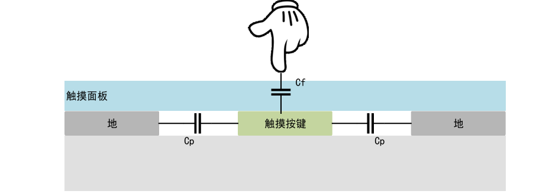
<figcaption><p>图 ‑1 <span id="_Toc238831797"
class="anchor"></span>触摸板简化模型</p></figcaption>
</figure>

当触摸按键没有触碰时，PCB 上的触摸
pad（触摸按键）与附近的地构成寄生电容Cp。当手指触碰触摸按键时，手指将引入额外电容CF并与寄生电容并联使得总电容值变为：Cx=Cp+CF，由手指引入的电容的增量，在不同的检测模式下可以引起电压值的变化，可通过ADC检测电压变动，进行判断触摸按键是否按下。

## 触摸按键检测方案

### 恒流源充电方案

电流源充电方案可认作为芯片的某一固定GPIO为电流源，对外部电容进行充电，对通用系类支持恒流源充电方案工作方式如下：

<figure>
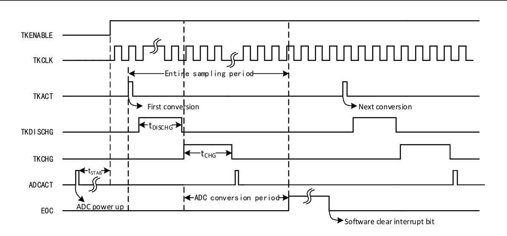
<figcaption><p>图 ‑2 <span id="_Toc238831798"
class="anchor"></span>恒流源充电时序</p></figcaption>
</figure>

1.  在使用触摸按键时，需保证ADC在正常工作模式下；当触摸按键使能后，首先对触摸按键进行放电，使得每轮检测外部引脚电平从0V电压开始。

2.  对触摸按键进行进行恒流源充电，恒流源电流大小可根据寄存器配置35/17.5uA。调节不同的充电时长，使得空板检测电压建议在VDD\*3/4附近，方便识别手指按下。

3.  充电完成后，ADC进行触发转换，检测引脚电压值。ADC转换完成后会重复动作1-2进行触摸按键连续工作。

恒流源触摸方式核心工作原理为恒流源为电容充电，充电电压可计算为：

``` math
\mathbf{V =}\frac{\mathbf{I*T}}{\mathbf{C}}
```

其中I：内部恒流源电流；t：固定充电时间；C：按键总电容。

### 主动屏蔽

可以看出当手指按下时会使得寄生电容增加，使得前后电压发生变化，从而可以判断触摸按键是否按下，在一些应用场景下可能由于外界因素导致外部材质寄生电容增大，如水滴滴落；从而引起触摸按键误判按下，因此可以使用主动屏蔽功能进行消除增量电容影响。

当MCU开启主动屏蔽功能后，屏蔽电极环绕触摸电极，屏蔽电极由MCU驱动，其电压总与触摸电极电压相同。经屏蔽电极保护后，GND的有害干扰经寄生电容Cp2先被屏蔽电极吸收，从而削弱GND对触摸电极的干扰。由于触摸电极与屏蔽电极不存在电压差，因此触摸电极与屏蔽电极之间的寄生电容Cp1不参与有害干扰的传导，因此外部干扰对触摸按键的影响减小，按键可靠性提升。当有水滴滴落PCB板上时，按键上的水滴会在触摸电极与屏蔽电极之间的寄生电容引入较大的增量，当开启主动屏蔽后，由于触摸电极与屏蔽电极电压总是相等，水滴引入的电容增量不参与充放电过程，故不对检测造成影响。

<figure>
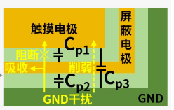
<figcaption><p>图 ‑3 <span id="_Toc238831799"
class="anchor"></span>主动屏蔽工作示意图</p></figcaption>
</figure>

开启主动屏蔽只需开启主动屏蔽使能，并开启选择所需转换通道的主动屏蔽位；若所需触摸按键为通道2与通道3使用库函数配置如下：

ADC_TKey_MulShieldCmd(ADC1, *ENABLE*); // 开启主动屏蔽

ADC_TKey_ChannelxMulShieldCmd(ADC1,ADC_Channel_2, *ENABLE*);//
选择通道2主动屏蔽

ADC_TKey_ChannelxMulShieldCmd(ADC1,ADC_Channel_3, *ENABLE*);//
选择通道3主动屏蔽

### 电荷迁移

对CH32V205芯片，触摸按键支持电荷迁移方式，与恒流源充电方式相比，通过多次电荷搬运，可适配更大的电极寄生电容；只增加循环次数，不会出现单次充电时间爆炸，对
PCB 走线带来的寄生电容容忍度更高，对环境干扰容忍更大，工作更稳定。

使用电荷迁移方式需要外部参考电容Cx ，与芯片的某一固定 GPIO
相连，其电容值在 nF 量级，通过触摸按键电容段Cs端进行充电。工作过程为:

1.  设置外部参考电容Cx通道（一个通道），触摸按键电容段Cs通道。首先对触摸按键进行放电，使得每轮检测外部引脚电平从0V电压开始。

2.  设置TKEY对Cx充电开关切换时间与Cs通道充电开关切换时间。开关切Cs端通过设置t2周期完成对参考电容进充电。

3.  开关切Cx端通过设置t4周期完成对Cs端向Cx通道进行充电使得Cx端电压缓慢上升。

4.  通过设置次数电荷搬移模式的搬移周期数重复步骤2-3使得Cx端电压到达合适电压。

<figure>
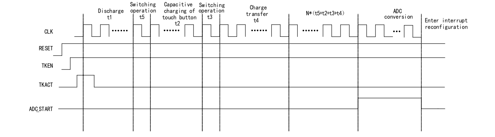
<figcaption><p>图 ‑4<span id="_Toc238831800"
class="anchor"></span>电荷迁移工作时序</p></figcaption>
</figure>

随着Cx的充电和 Cs对
Cx放电次数增加，Cx上的电平不断抬高。当手指触碰按键时，会导致外围环境的寄生电容将变大，由
Cp变为 Cp
+Cf，Cs端的相同充电次数与时长会使得Cx电压上升，从而判断按键是否按下。当使用多通道电荷搬移连续模式时，使用主动屏蔽所有通道需要全开才可生效。

# PCB设计

## 触摸按键PCB设计

触摸按键的状态与寄生电容的微小变化相关，因此对干扰会更加敏感。为了保证触摸按键灵敏度，在PCB设计中需要注意：减少按键自身寄生电容与减少PCB板干扰。

### 触摸按键布线

减小走线的长度即可降低触摸按键的寄生电容也可增强抗噪能力，减小噪声，
提高信噪比。因此在PCB设计中触摸按键应避免走长线；也需注意在多通道应用重不同的线距可能会影响触摸按键触碰结果，因此在PCB布线重也需使得每个通道线距相同以避免通道间走线差异。

<figure>
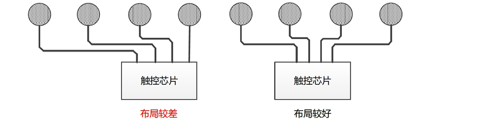
<figcaption><p>图 ‑1 <span id="_Toc238831801"
class="anchor"></span>通道布线</p></figcaption>
</figure>

如果触摸按键与信号线（如SPI信号）相近，需要触摸按键布线与信号线两者垂直走线，如果无法避免也需进行接地进行屏蔽信号线干扰，切记信号线与触摸按键不要走平行线，以免通讯信号影响触摸按键检测。

<figure>
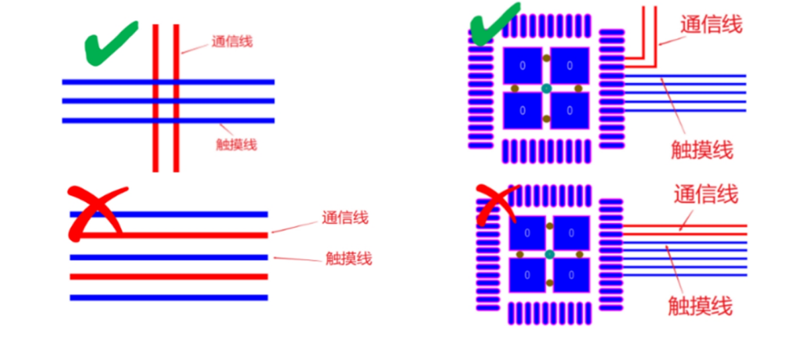
<figcaption><p>图 ‑2 <span id="_Toc238831802"
class="anchor"></span>通讯线与触摸按键布线建议图</p></figcaption>
</figure>

若背面安装LED，若LED信号线与触摸按键在同层走平行线时，当LED翻转时触摸按键可能会耦合电容式干扰，导致触摸按键误触发，因此触摸按键走线建议：1.对低频翻转的LED等IO端可走触摸按键另一层；2.可原理触摸按键走线，与信号相同垂直走线。

1.  触摸按键铺铜

一般情况下；PCB板器件下方铺GND可抑制由于外部噪声影响引起的电位波动，但若是实心地时会增加触摸按键寄生电容会导致触摸按键按下阈值减少。在触摸按键PCB设计时，触摸按键上下应该为网格地，用以减少触摸按键寄生电容；尽量把不同层上的接地层互相拼接在一起，大量拼接各层可降低接地电感，并使芯片接地层更加靠近电源接地层。此外触摸
Pad 底层正下方不铺地，顶层若需要铺地隔离，一般采用网络铺地。

<figure>
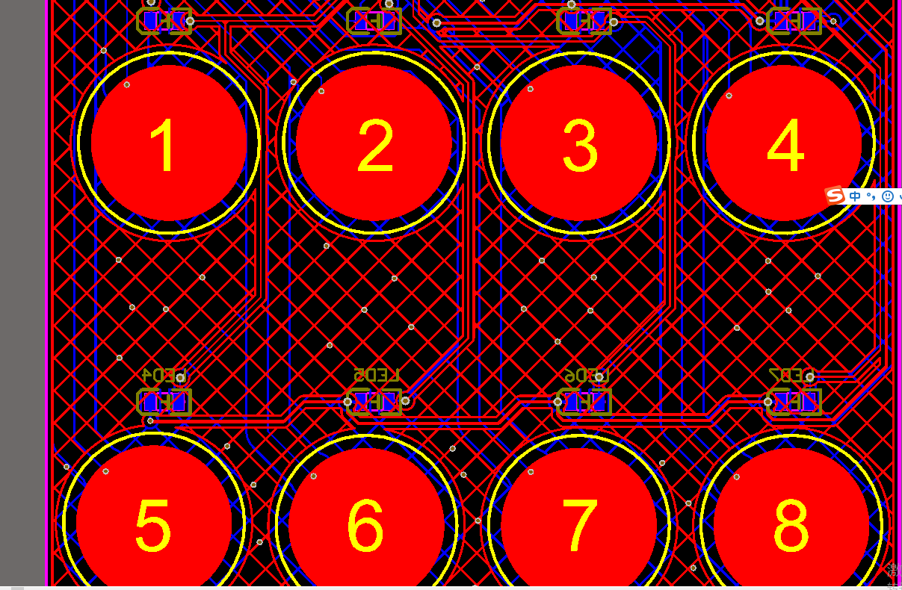
<figcaption><p>图 ‑3<span id="_Toc238831803"
class="anchor"></span>铺入网格地示意图</p></figcaption>
</figure>

### 触摸按键PAD选择

触摸按键寄生电容大小为：

``` math
\mathbf{C =}\frac{\mathbf{\varepsilon}\mathbf{*}\mathbf{S}}{\mathbf{d}}
```

其中ε：相对介电常数，S：电极的正对面积，d：电极间距

可以看出当触摸按键距离一致时，硬件参数与触摸按键接触面积成正比，PCB设计时可适当增加触摸按键面积以提高触摸按键灵敏度。但是要注意避免
Pad 图案中出现尖角或者线宽较窄总线较长条形形状，容易引起天线效应。

<figure>
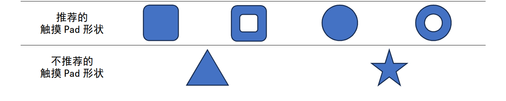
<figcaption><p>图 ‑4 <span id="_Toc238831804"
class="anchor"></span>不同触摸按键示意图</p></figcaption>
</figure>

触摸面板为绝缘或者非导电材料的，一般介电常数ε越小的介质材料越不容易导电。手指触碰相对变化数值越小，但若介电常数过大会增加按键间串扰，不利于按键的准确识别。触摸面板为绝缘或者非导电材料的，建议介电常数在
1.5～4 之间。

| 材料           | 相对介电常数 |
|----------------|--------------|
| 空气           | 1            |
| 木制           | 1.2−2.5      |
| 亚克力         | 2.8          |
| 玻璃           | 7.6−8        |
| 水             | 48−80        |
| 聚碳酸酯（PC） | 2.7−2.9      |

<span id="_Toc238831760" class="anchor"></span>表 ‑1相对介电常数表

触摸按键与接地网格的间隙间距增加可以减少触摸按键寄生电容，在设计PCB时可增加触摸按键包围间距用以提升触摸按键灵敏度，建议接地网格间与触摸按键间距为1.5mm左右。

<figure>

<figcaption><p>图 ‑5<span id="_Toc238831805"
class="anchor"></span>触摸按键与接地网格的间隙示意图</p></figcaption>
</figure>

## 触摸按键EMC防护

由于CH32通用MCU检测触摸按键触摸电压为ADC检测模块，其参考源为VDD电压。（有单独Vref引脚芯片除外）若MCU
的电源存在较强干扰，或电源纹波较大会使得检测结果存在误差，因此在电源端建议在LDO端接入磁珠处理后再供给MCU。LDO输入端可接入较大容值钽电容进行稳压滤波。在MCU的VDD端与VSS引脚可多并联电容，且靠近VSS端与VDD端。

| **不推荐原理VSS与GND** | 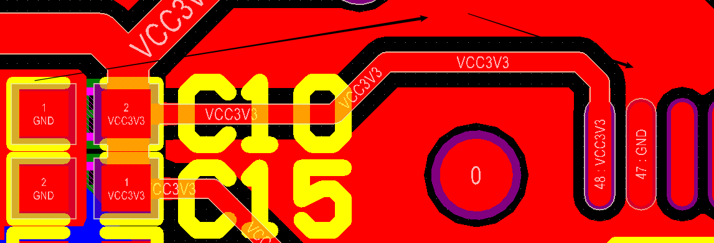  |
|------------------------|---------------------------------------------|
| **建议靠近VDD与GND**   | 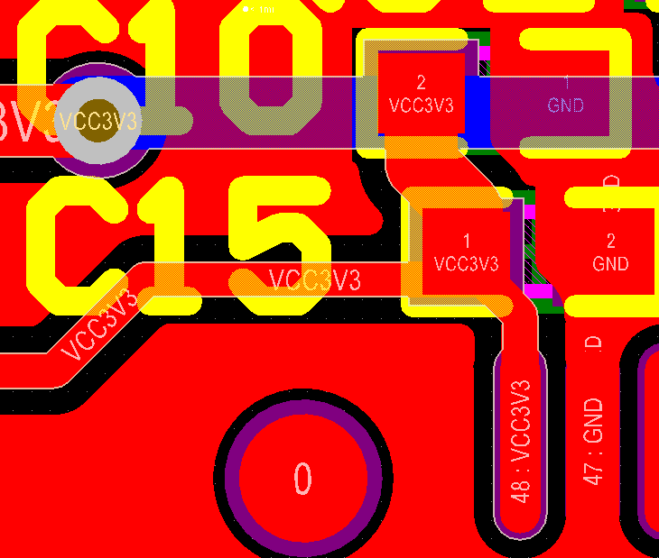  |

图 ‑6 <span id="_Toc238831806"
class="anchor"></span>建议退耦电容布线示意图

此外建议在按键通道引线上靠近芯片端串联500欧姆左右电阻，可以降低脉冲电平边沿的陡峭程度，减小高次谐波。

<figure>
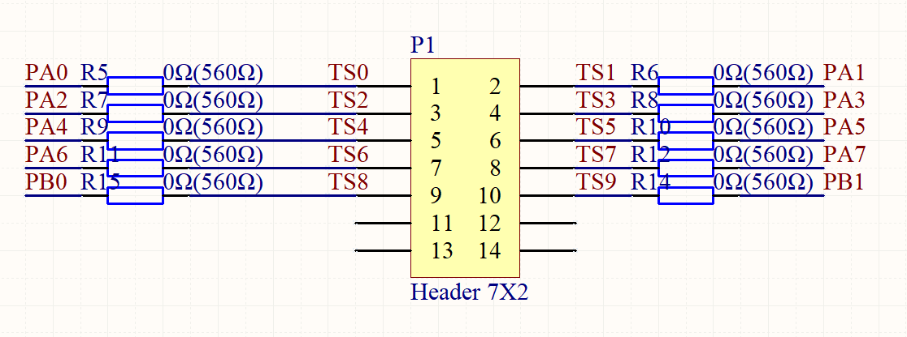
<figcaption><p>图 ‑7<span id="_Toc238831807"
class="anchor"></span>使用串联电阻示意图</p></figcaption>
</figure>

**附录**

|   型号   | 是否支持主动屏蔽 |  触摸按键类型   |
|:--------:|:----------------:|:---------------:|
| CH32L103 |        Y         |     恒流源      |
| CH32V00x |        Y         |     恒流源      |
| CH32V205 |        Y         | 恒流源+电荷迁移 |
| CH32V20x |        N         |     恒流源      |
| CH32V30x |        N         |     恒流源      |
| CH32H4x7 |        Y         |     恒流源      |
| CH32X035 |        N         |     恒流源      |

<span id="_Toc239519864" class="anchor"></span>历史版本

| 日期     | 版本 | 变更内容 |
|----------|------|----------|
| 2026/7/8 | V1.0 | 初版发行 |

<span id="_Toc239519865" class="anchor"></span>声明

本手册仅供参考。作者在不另行通知的情况下，可随时进行修改。
