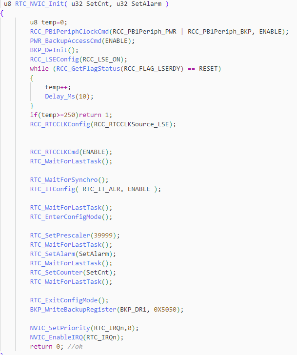
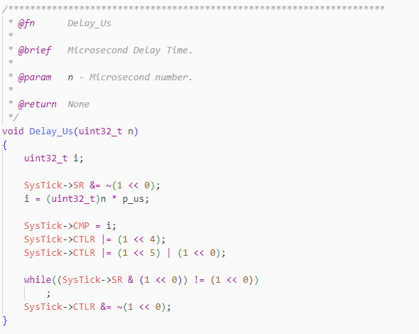

AN11000

V1.0

# 说明

定时器用途广泛，是MCU中常见的外设。沁恒微电子的MCU配置了多种定时器器资源，包括高级/通用/基本定时器（TIM）,实时时钟（RTC）和滴答定时器（Systick）。随着用户对低功耗产品需求越来越严格，沁恒在CH32L/CH32H系列产品增加了低功耗定时器（LPTIM）。这四种定时器在设计初衷、应用上各有侧重。本应用文档对比这四类定时器，帮助用户掌握定时器的特色与应用场景。

适用范围

| 适用范围 | 系列          |
|----------|---------------|
| 通用MCU  | CH32V/F/L/H/X |

目录

[说明 [i](#说明)](#说明)

[目录 [ii](#_Toc207035732)](#_Toc207035732)

[表格索引 [ii](#_Toc207035733)](#_Toc207035733)

[图片索引 [ii](#_Toc207035734)](#_Toc207035734)

[第1章 TIM/RTC/Systick [3](#timrtcsystick)](#timrtcsystick)

> [1.1 高级/通用定时器（TIM）
> [3](#高级通用定时器tim)](#高级通用定时器tim)
>
> [1.1.1 应用场景 [3](#应用场景)](#应用场景)
>
> [1.1.2 注意事项 [4](#注意事项)](#注意事项)
>
> [1.2 实时时钟（RTC） [4](#实时时钟rtc)](#实时时钟rtc)
>
> [1.2.1 应用场景 [4](#应用场景-1)](#应用场景-1)
>
> [1.2.2 闹钟示例 [4](#闹钟示例)](#闹钟示例)
>
> [1.2.3 注意事项 [5](#注意事项-1)](#注意事项-1)
>
> [1.3 系统滴答定时器（Systick）
> [5](#系统滴答定时器systick)](#系统滴答定时器systick)
>
> [1.3.1 工作原理 [6](#工作原理)](#工作原理)
>
> [1.3.2 应用场景 [6](#应用场景-2)](#应用场景-2)
>
> [1.3.3 注意事项 [6](#注意事项-2)](#注意事项-2)

[第2章 LPTIM [8](#lptim)](#lptim)

> [2.1 功能概述 [8](#功能概述)](#功能概述)
>
> [2.1.1 核心特色 [8](#核心特色)](#核心特色)
>
> [2.1.2 应用场景 [8](#应用场景-3)](#应用场景-3)
>
> [2.1.3 RTC/Systick/TIM与LPTIM对比
> [9](#rtcsysticktim与lptim对比)](#rtcsysticktim与lptim对比)
>
> [2.1.4 注意事项 [9](#注意事项-3)](#注意事项-3)

[历史版本 [10](#历史版本)](#历史版本)

[声明 [11](#_Toc207035742)](#_Toc207035742)

表格索引

[表 2‑1 RTC/Systick/TIM/LPTIM对比 [9](#_Toc239781064)](#_Toc239781064)

图片索引

[图 1‑1 RTC闹钟示例 [5](#_Toc239781065)](#_Toc239781065)

[图 1‑2 Systick延时 [6](#_Toc239781066)](#_Toc239781066)

#  TIM/RTC/Systick

## 高级/通用定时器（TIM）

TIM最为丰富，包括高级定时器，通用定时器，基本定时器。高级定时器支持互补
PWM、死区、刹车，主要用于电机驱动；通用定时器支持输入捕获、输出比较、编码器接口、DMA
触发。基本定不具备输入捕获、输出比较、编码器接口等高级功能，其唯一使命是提供高精度、低开销的周期性更新事件（Update
Event）。基本定时器是替代系统滴答定时器器、ADC/DAC同步触发、DMA数据搬运节拍控制的理想选择。

时钟源：TIM根据芯片不同挂载在PB1,PB2或HB总线上，TIM时钟直接来自挂载总线。

低功耗行为：进入 Stop 睡眠模式，TIM时钟关闭，TIM
直接停止计数，所以TIM无法在休眠状态下计数。

特色：

多种计数模式：支持向上、向下、中央对齐三种计数模式

多通道功能：每个定时器通常有4个独立通道，支持：

输出比较：产生指定脉冲或波形

PWM生成：输出任意占空比可调的PWM信号

输入捕获：测量输入信号脉冲宽度、频率

编码器接口（部分型号）：用于电机位置/速度检测

DMA支持：可与DMA配合，实现高效数据传输

外部时钟计数：支持外部输入引脚计数

定时器级联：多个定时器可以级联使用，如TIM2的更新事件可触发TIM11计数

数字滤波器：TIM作为输入计数时，支持数字滤波器配置

###  应用场景

电机控制（高级定时器）：高级定时器（TIM1、TIM8）是电机控制的核心外设。在直流无刷电机（BLDC）驱动中：

互补PWM输出驱动三相逆变桥

死区时间防止功率管直通

刹车输入实现过流保护

编码器接口读取电机转速和位置

在吸尘器、高速吹风筒、无叶风扇等产品中，高速风机控制正是此类定时器的重要应用方向。

信号测量（输入捕获）：\
通过输入捕获模式，TIM可测量外部信号的脉冲宽度，典型应用包括：

- 红外遥控信号解码

- 超声波测距模块的回波时间测量

- 霍尔传感器信号解析

- 频率计

传感器数据采集：定时器可触发ADC进行周期性采样，实现传感器数据的定时采集，确保采样间隔的精确性。

精确定时中断：TIM可产生高精度定时中断（如125μs、1ms等），用于自定义通信协议的时间控制、步进电机的脉冲生成等高速场合。

呼吸灯效果：通过动态改变PWM占空比，可产生柔和的呼吸灯效果。

###  注意事项

所有定时器外设默认处于时钟关闭状态，使用前必须先使能对应外设时钟

高级定时器需要调用TIM_CtrlPWMOutputs()使能主输出才能输出PWM信号

不同定时器可能挂载在不同的APB总线上（APB1或APB2），时钟频率可能不同，需查阅数据手册确认。

在PWM输出模式下，需注意GPIO的复用功能配置是否正确

使用输入捕获时，需注意输入信号的电压范围和频率上限

## 1.2 实时时钟（RTC）

RTC(Real-Time
Clock)时钟可以选择HSI/LSI/LSE。LSE和RTC可以由Vbat供电，及当VDD掉电时，RTC和LSE切换到Vbat供电。只要Vbat还有能量，RTC就不会停摆。基于这个特点RTC主要应用于电子时钟/日历等产品。

CH32H417 RTC主要特点：

位宽：32位可编程计数器

时基：支持20位预分频器

后备供电：RTC模块位于后备供电区域，主电源掉电后仍然可依靠Vbat继续运行

闹钟功能：可配置闹钟将系统从低功耗模式唤醒

时钟输出：可以输出秒脉冲，闹钟脉冲，RTC时钟

### 1.2.1 应用场景

低功耗定时唤醒：RTC是最常用的低功耗唤醒源之一。设别进入停止或待机模式后，RTC继续运行，到达预设的闹钟时间后唤醒MCU。

日历/时钟功能：在需要记录真实时间的应用中（如电子钟、万年历、数据记录仪的时间戳），RTC提供精确的日期时间信息。配合LCD或LTDC显示控制器，可实现完整的时钟显示界面。

定期数据采集：在环境监测、智能农业等场景中，RTC可配置为每小时或每天定时唤醒，唤醒后采集温度、湿度、光照等数据并存储或上报，其余时间系统处于深度休眠状态，极大延长电池寿命。

### 1.2.2 闹钟示例

由于RTC的特殊用途，其预分频寄存器，预分频重装值，主计数器和闹钟处于后备域。所以在配置RTC相关寄存器时，要打开后备域时钟。RTC的控制寄存器受系统复位和电源复位控制。

<figure>

<figcaption>
图 ‑
RTC闹钟示例
</figcaption>
</figure>

### 1.2.3 注意事项

1\.
当RTC使用外部LSE做为时钟源时，需注意晶振的匹配电容和PCB布局，以确保起振可靠

2\.
当RTC使用LSI/HSE作为时钟源时，在仅Vbat供电情况下RTC计数时，RTC会暂停工作（时钟停止）

## 1.3 系统滴答定时器（Systick）

Systick是系统内核内置时基定时器，属于内核外设，没有外部输出引脚。Systick无需额外配置外设寄存器，目前，所有沁恒通用MCU均有滴答定时器。它设计的初衷是为操作系统提供稳定的时间基准。

CH32V407Systick特色：

内核集成：不占用外设总线资源，响应速度快，中断优先级高。

32位计数器：与RAM的24bit
Systick不同，CH32V407的Systick位32bit,单次计数时间更长，为长时间定时提供了基础。

时钟源灵活：Systick的时钟源可以选择HCLK或HCLK/8，开发者可根据精度灵活配置。

### 1.3.1 工作原理

CH32V407的Systick核心寄存器包括：

STK_CTLR(控制寄存器)：控制定时器的使能、时钟选择、中断使能。

STK_SR(状态寄存器)：计数比较中断标志和滴答定时器软件中断触发控制位

STK_CNT(当前计数寄存器)：读取当前计数值。

STK_CMP(计数比较寄存器)：设置计数比较值。

计数过程如下：当Systick使能后，
STK_CTLR中计数模式选择向下计数，每个时钟周期STK_CNT减1。STK_CNT减到零，触发中断（使能中断情况下）；当计数模式选择向上计数时，每个时钟周期加1，
STK_CNT等于STK_CMP触发中断（使能中断情况下）。

当使能自动重装载功能时，向上计数到比较值后STK_CNT重新从0 开始计数;
向下计数到0后，重新从比较值开始计数；

### 1.3.2 应用场景

RTOS系统节拍:Systick最经典的应用是作为RTOS的系统时钟节拍。在freertos等实时操作系统中，systick中断负责：

1.更新系统时钟计数

2.触发任务调度

3.检查任务状态列表的作用

CH32H417的Freertos例程中，两个内核各自运行Freertos，使用各自的Systick作为时钟节拍。

利用Systick实现延时：

<figure>

<figcaption>
图 ‑
Systick延时
</figcaption>
</figure>

### 1.3.3 注意事项

1.不适用于深度睡眠：Systick依赖主时钟运行，在深度睡眠模式下主时钟停止，Systick也随之停止。

2.双核中断处理：在CH32H417双核芯片中，要注意哪个内核响应中断。

3.时钟源选择：当选择HCLK/8作为时钟源时，延时时间会增加，但定时精度会降低。

#  LPTIM

##  功能概述

LPTIM（Low-Power
Timer）是专为超低功耗场景设计的定时器模块。LPTIM的核心价值在于能够在MCU进入深度睡眠模式时继续运行，以极低的功耗维持计时功能。

### 核心特色

LPTIM具有多种时钟源：

- 内部时钟源：LSE（32.768kHz）、LSI（约40kHz）、HSI或HB时钟

- 外部时钟源：LPTIM输入上的外部时钟

无时钟运行：

LPTIM在没有内部时钟源的情况下也能运行，依此可以将LPTIM当作 **“**脉冲计数器**”** 使用。这一特性使其可以在系统深度休眠时对外部脉冲进行计数，无需MCU主动参与。

低功耗唤醒：

LPTIM能将系统从低功耗模式唤醒，所以LPTIM很适合以极低的功耗实现 “超时功能” 。在STOP2模式下，LPTIM是少数可以持续运行的定时器之一。

数字滤波器：

LPTIM输入无论是外部输入还是内部输入，都受到数字滤波器的保护，以防止任何毛刺和噪声干扰在LPTIM内部传播，进而避免产生意外计数或触发。

数字滤波器分为两组：

一组为数字滤波器保护LPTIM外部输入，由CKFLT位控制数字滤波器的灵敏度

另一组数字滤波器保护LPTIM内部触发输入，由TRGFLT位控制数字滤波器的灵敏度

滤波器的灵敏度会影响相同的连续采样的数量，在LPTIM输入上检测到此类连续的采样时，才能将某信号电平变化视为有效切换。

在CH32H417中对于数字滤波器的配置也非常简单，只需要配置LPTIMx_CFGR寄存器的bit\[7:6\]位即可。TRGFLT\[1:0\]的详细说明如下：

00：任何触发器的更改都被视为有效触发器

01：触发激活电平变化必须稳定至少2个时钟周期，然后才视为有效触发器

10：触发激活电平变化必须稳定至少4个时钟周期，然后才视为有效触发器

11：触发激活电平变化必须稳定至少8个时钟周期，然后才视为有效触发器

### 2.1.2 应用场景

电池供电物联网传感器节点：

这类场景要求用一节电池供电运行数月甚至数年。LPTimer可配置为固定周期唤醒MCU。例如在温湿度传感器中设置为每5分钟唤醒一次，MCU完成数据采样后立刻进入低功耗休眠模式，LPTimer则持续计时等待下一次唤醒。

智能穿戴设备的低功耗计数：

以智能手环的步数统计为例：LPTimer支持无MCU参与的异步脉冲计数，加速度计检测到步数产生的外部脉冲可以直接驱动LPTimer计数，整个过程MCU都处于STOP低功耗模式，不需要频繁唤醒处理。

工业设备状态监测：

在工厂无人值守的设备振动监测场景中：LPTimer的异步脉冲计数功能可以直接接入振动传感器输出的脉冲信号，统计设备的振动频率，全程不需要MCU主动运行，无需额外增加供电电路，就能实现长期低功耗监测。

低功耗静态显示设备：

比如电子墨水屏制作桌面日历、台钟：只需要每分钟唤醒一次刷新屏幕即可，LPTimer定时30分钟唤醒MCU刷新后，MCU立刻进入STOP2低功耗模式，整套方案可以做到非常低的功耗，一节钮扣电池就能供电运行数月。

RTOS Tickless低功耗模式的定时唤醒：

在RTOS的深度休眠Tickless模式下，当MCU进入低功耗后，传统的系统滴答定时器（SysTick）会停止运行。此时LPTimer是STOP2模式下少数可以持续运行的定时器，可以负责定时唤醒系统，补偿系统时钟计数，同时实现极低的待机功耗。

### 2.1.3 RTC/Systick/TIM与LPTIM对比

RTC/Systick/TIM与LPTIM各有侧重：

|    对比维度    |     Systick      |     TIM     |     RTC     |        LPTIM        |
|:--------------:|:----------------:|:-----------:|:-----------:|:-------------------:|
|      位宽      | 32_bit(CH32H417) |   16_bit    |   32_bit    |       16_bit        |
|     时钟源     |     内核HCLK     | APB总线时钟 | LSE/LSI/HSE | LSE/LSI/HSI/HB/外部 |
|   低功耗运行   |        否        |     否      |     是      |         是          |
|    Vbat供电    |        否        |     否      |     是      |         否          |
|    PWM输出     |        否        |     是      |     否      |         是          |
|    输入捕获    |        否        |     是      |     否      |         是          |
|    DMA支持     |        否        |     是      |     否      |         否          |
| 无时钟脉冲计数 |        否        |     否      |     否      |         是          |
|   数字滤波器   |        否        |     是      |     否      |         是          |

表 ‑
RTC/Systick/TIM/LPTIM对比

SysTick主要应用与RTOS系统节拍,精确延时中。RTC主要应用于万年历，低功耗唤醒，掉电保持的应用中。TIM应用广泛，但目前应用最广泛的是电机领域。LPTIM主要应用于超低功耗应用，休眠时对外部时钟计数，深度睡眠情况下唤醒的应用中。

实际应用中，可能同时使用多个定时器。如电机应用中，利用TIM驱动电机，实现刹车保护等功能。RTC在待机时保持时间，定时唤醒。如数据采集系统中，TIM
触发ADC进行周期性采样，RTC为采集的数据添加时间戳，LPTIM在设备休眠时维持低功耗定时唤醒。

### 2.1.4 注意事项

1.  时钟源选择：LPTIM的时钟源选择直接影响功耗和精度

2.  Stop模式运行：在Stop模式下使用LPTIM，需确保所选时钟源在Stop模式下仍保持运行

3.  数字滤波器配置：启用数字滤波器需消耗一定的时钟周期，可能影响计数精度

4.  寄存器写入延迟：LPTIM寄存器写入可能需要等待时钟周期

# 历史版本

更新内容

| 日期      | 版本 | 变更内容 |
|-----------|------|----------|
| 2026/8/26 | V1.0 | 初版发行 |

声明

本手册仅供参考。作者在不另行通知的情况下，可随时进行修改。
