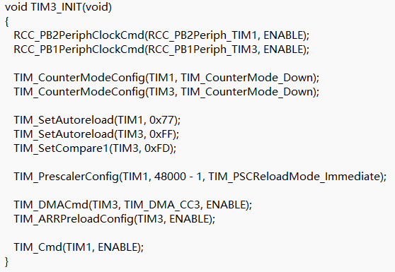
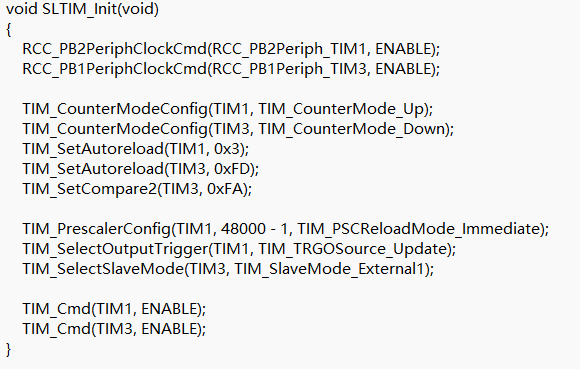

<table>
<colgroup>
<col style="width: 50%" />
<col style="width: 50%" />
</colgroup>
<thead>
<tr>
<th rowspan="2"></th>
<th></th>
</tr>
<tr>
<th></th>
</tr>
</thead>
<tbody>
</tbody>
</table>

说明

CH32V006/CH32M007是南京沁恒微电子基于青稞（QingKe）RISC-V内核设计的工业级通用微控制器。CH32V006/CH32M007拥有了丰富的外设资源，其中精简定时器是CH32V006/
CH32M007区别于其他通用MCU
的特色外设之一。本文将以精简定时器为核心，深入介绍其工作原理、应用场景及配置方式。

**适用范围**

| 适用范围 | 系列                |
|----------|---------------------|
| 通用MCU  | CH32V006/CH32M007等 |

目录

[说明 [1](#_Toc239063552)](#_Toc239063552)

[目录 [2](#_Toc239063553)](#_Toc239063553)

[表格索引 [2](#_Toc239063554)](#_Toc239063554)

[图片索引 [2](#_Toc239063555)](#_Toc239063555)

[第1章 精简定时器介绍 [1](#精简定时器介绍)](#精简定时器介绍)

[1.1 SLTM的内部结构 [1](#sltm的内部结构)](#sltm的内部结构)

[1.1.1 功能 [1](#功能)](#功能)

[1.1.2 时钟源 [1](#时钟源)](#时钟源)

[1.1.3 比较输出模式 [1](#比较输出模式)](#比较输出模式)

[1.1.4 同步模式 [1](#同步模式)](#同步模式)

[1.1.5 SLTM与TIM对比 [2](#sltm与tim对比)](#sltm与tim对比)

[1.1.6 应用案例 [2](#应用案例)](#应用案例)

[1.1.7 常见问题 [2](#常见问题)](#常见问题)

[第2章 SLTM配置与使用 [3](#sltm配置与使用)](#sltm配置与使用)

[2.1 配置流程 [3](#配置流程)](#配置流程)

[2.2 SLTM触发DMA [3](#sltm触发dma)](#sltm触发dma)

[2.3 SLTM触发ADC [4](#sltm触发adc)](#sltm触发adc)

[2.4 总结 [5](#总结)](#总结)

[历史版本 [5](#_Toc239063570)](#_Toc239063570)

[声明 [6](#_Toc239063571)](#_Toc239063571)

表格索引

[定时器内部触发连接 [1](#_Toc239063572)](#_Toc239063572)

[定时器对比 [2](#_Toc239063573)](#_Toc239063573)

图片索引

[SLTM触发DMA [4](#_Toc239063574)](#_Toc239063574)

[SLTM触发ADC [4](#_Toc239063575)](#_Toc239063575)

# 精简定时器介绍

精简定时器（SLTM）是CH32V006中一个16位定时器模块。与高级定时器和通用定时器相比，精简定时器的功能定位更加聚焦——它不直接对外输出PWM波形，而是专注于内部定时触发和脉冲产生功能。

精简定时器的设计初衷是在满足特定应用场景（如ADC定时触发、事件计数等）的前提下，以最精简的硬件逻辑实现定时功能，从而降低功耗和芯片面积。

## SLTM的内部结构

### 功能

精简定时器的核心功能模块：

1.  16位计数器（CNT）：定时器的核心，在时钟驱动下递增计数。

2.  自动重装载寄存器（ATRLR）：设定计数上限，当CNT达到ARR值时产生溢出事件。

3.  控制寄存器（CTLR）：控制定时器的使能、方向、更新事件使能等。

4.  状态寄存器（DMAINTENR）：DMA使能，比较寄存器预装载使能。

5.  比较寄存器（CHxCVR）：比较寄存器通道x 的值。

### 时钟源

精简定时器的时钟可以来自于HB总线时钟（在CH32V006/CH32M007中，HB最高为48MHz）。精简定时器的时钟还可以来自于其他具有时钟输出功能的定时器（ITR1）。这些输入的时钟信号经过设定的滤波操作后成为
CK_PSC 时钟，输出给核心计数器部分。
精简定时器的核心是一个16位计数器（CNT）。CK_PSC 不分频直接输给 CNT，CNT
支持增计数模式、减计数模式和增减计数模式，并有一个自动重装值寄存器（ATRLR）在每个计数周期结束后为CNT重装载初始化值。（SLTM无预分频器，没有预分频功能）

### 比较输出模式

比较输出模式是定时器的基本功能之一。比较输出模式的原理是在核心计数器（CNT）的值与比较寄存器的值一致时，通道1，2
输出事件触发ADC。通道3，4 在产生比较一致事件时，如果预先设置了CCxDE
位，则会产生一个DMA 请求。SLTM不能直接输出波形。

配置为比较输出模式的步骤为下：

1） 配置核心计数器（CNT）的时钟源和自动重装值；

2） 设置好需要对比的计数值到比较寄存器（R16_TIMx_CHxCVR）中；

3） 保持OCxPE 为0，禁用比较获寄存器的预装载寄存器；

4） 置CEN 位启动定时器。

### 同步模式

SLTM的时钟有两种选择，一种直接通过HB总线，一种通过TIM1(同步模式)。精简定时器只能接收定时器1
的输入（ITRx）。定时器内部触发连接如表

<table>
<caption>
表 1‑1定时器内部触发连接
</caption>
<colgroup>
<col style="width: 20%" />
<col style="width: 20%" />
<col style="width: 20%" />
<col style="width: 20%" />
<col style="width: 20%" />
</colgroup>
<thead>
<tr>
<th style="text-align: center;">从定时器</th>
<th style="text-align: center;">ITR0 
(TS=000)</th>
<th style="text-align: center;">ITR1 
(TS=001)</th>
<th style="text-align: center;">ITR2 
(TS=010)</th>
<th style="text-align: center;">ITR3 
(TS=011)</th>
</tr>
</thead>
<tbody>
<tr>
<td style="text-align: center;">SLTM</td>
<td style="text-align: center;">TIM1</td>
<td style="text-align: center;">-</td>
<td style="text-align: center;">-</td>
<td style="text-align: center;">-</td>
</tr>
</tbody>
</table>

### SLTM与TIM对比

为了更好地理解精简定时器的定位，下面从功能维度对高级定时器/通用定时器/精简定时器进行对比：

| 功能特性   | 高级定时器 | 通用定时器 | 精简定时器 |
|------------|------------|------------|------------|
| 位宽       | 16 bit     | 16 bit     | 16 bit     |
| 自动重装载 | 支持       | 支持       | 支持       |
| 输出波形   | 支持       | 支持       | 不支持     |
| 死区控制   | 支持       | 不支持     | 不支持     |
| 刹车功能   | 支持       | 不支持     | 不支持     |
| 输入捕获   | 支持       | 支持       | 不支持     |
| 编码器     | 支持       | 支持       | 不支持     |
| 定时中断   | 支持       | 支持       | 不支持     |
| DMA        | 支持       | 支持       | 支持       |

表 1‑2定时器对比

从上表可以清晰地看出，精简定时器保留了最核心的定时计数，而去除了波形输出、信号捕获等复杂功能。这种“减法”设计使其在特定场景下成为更优的选择。

在实际项目中，往往需要多个定时器协同工作。其中PWM输出，电机控制，主要选择高级定时器。输入捕获、脉冲测量、编码器主要选择通用定时器。ADC触发，DMA触发可以选择精简定时器。

### 应用案例

在电机控制应用中，高级定时器（TIM1）产生PWM驱动信号，而精简定时器（TIM3）负责定期触发ADC采集电流/电压反馈信号。两者配合实现了完整的控制闭环：

TIM1产生互补PWM信号，驱动功率器件

TIM3以固定频率（如20kHz）触发ADC采样

ADC采样值通过DMA自动存入缓冲区

CPU在TIM3中断中读取最新采样值，执行控制算法

控制算法结果更新TIM1的PWM占空比

这种架构中，精简定时器扮演了“采样时钟”的角色，确保了控制环路的实时性和确定性。

### 常见问题

1.  精简定时器不支持波形输出功能。如果需要PWM输出，应使用高级定时器（TIM1）或通用定时器（TIM2）。

2.  如果想实现更长的定时周期，可以通过同步模式（SLTM没有分频寄存器，不支持分频配置）

3.  SLTM不支持中断，没有更新中断等其他中断。

# SLTM配置与使用

## 配置流程

使用精简定时器的基本流程如下：\
步骤1：使能定时器时钟

在使用外设之前，首先需要使能其时钟。精简定时器的时钟使能通过RCC（复位与时钟控制）模块的相关寄存器进行配置。

步骤2：设置SLTM计数模式

通过配置TIM3-\>CTLR,确定SLTM的计数方式

步骤3：配置自动重装载值

根据所需的定时周期计算ARR值并写入TIM3-\>ARR寄存器。

步骤4：使能DMA

如果希望SLTM触发DMA ,需要配置TIM3-\>DMAINTENR寄存器。

步骤5：使能定时器

设置TIM3-\>CTLR寄存器中的使能位（CEN），启动定时器

## SLTM触发DMA

SLTM的通道3和通道4的比较事件可以触发DMA。如希望触发DMA需要配置DMAINTENR的CCxDE位。

CH32V007、CH32V006、CH32M007都拥有SLTM（TIM3）。都能通过SLTM的通道3和通道4触发DMA。但是CH32V007、CH32V006想比CH32M007触发DMA却存在数量上的差异。

CH32M007的TIM3产生一次CH3事件，可以触发DMA1的1、2、3通道；TIM3产生一次CH4事件，可以触发DMA1的4、5、6通道。

CH32V006、CH32V007的TIM3产生一次CH3事件，仅可以触发DMA1的通道1；TIM3产生一次CH4事件，仅可以触发通道4。

<figure>

<figcaption>
图 ‑1 SLTM触发DMA
</figcaption>
</figure>

CH32V007、CH32V006、CH32M007共用一个EVT:
<https://www.wch.cn/downloads/CH32V006EVT_ZIP.html>

其中的SLTM_DMA例程中根据芯片的型号配置了DMA通道的数量。

## SLTM触发ADC

SLTM的通道1和通道2的比较事件可以触发ADC。

<figure>

<figcaption>
图 ‑2 SLTM触发ADC
</figcaption>
</figure>

SLTM没有更新事件，如果想延长定时事件可以通过增大比较寄存器；与定时器级联实现。

## 总结

CH32V006的精简定时器是一个16位定时器模块，虽然功能精简（不支持PWM输出和输入捕获），但在基础定时场景中表现出色。它的存在使得CH32V006在保留高级定时器和通用定时器全部功能的同时，额外获得了一个独立的定时资源。

历史版本

| 日期     | 版本 | 变更内容 |
|----------|------|----------|
| 2026/7/8 | V1.0 | 初版发行 |

声明

本手册版权所有为南京沁恒微电子股份有限公司（Copyright © Nanjing Qinheng
Microelectronics Co., Ltd. All Rights
Reserved），未经南京沁恒微电子股份有限公司书面许可，任何人不得因任何目的、以任何形式（包括但不限于全部或部分地向任何人复制、泄露或散布）不当使用本产品手册中的任何信息。

任何未经允许擅自更改本产品手册中的内容与南京沁恒微电子股份有限公司无关。

南京沁恒微电子股份有限公司所提供的说明文档只作为相关产品的使用参考，不包含任何对特殊使用目的的担保。南京沁恒微电子股份有限公司保留更改和升级本产品手册以及手册中涉及的产品或软件的权利。

参考手册中可能包含少量由于疏忽造成的错误。已发现的会定期勘误，并在再版中更新和避免出现此类错误。
