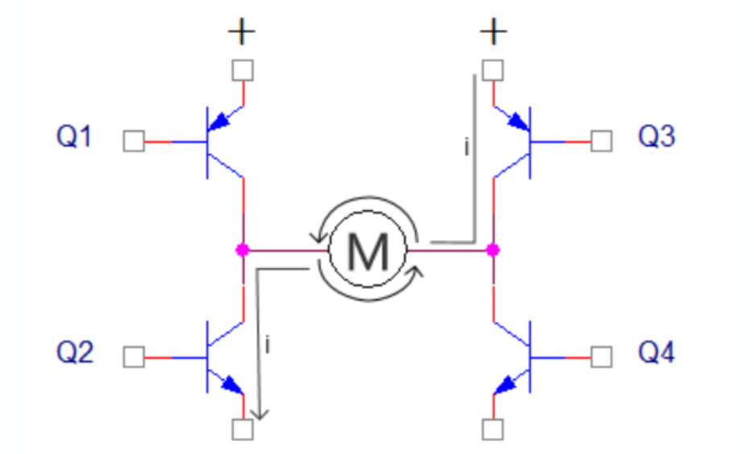
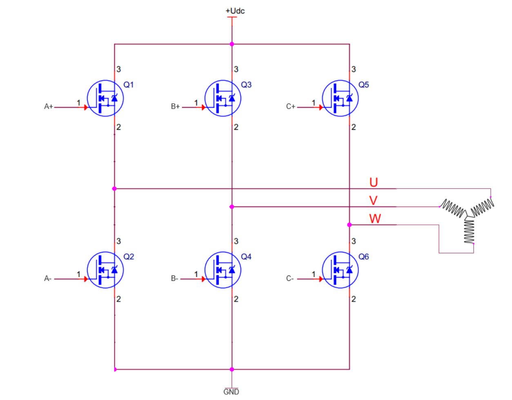

<table>
<colgroup>
<col style="width: 49%" />
<col style="width: 50%" />
</colgroup>
<thead>
<tr>
<th rowspan="2"></th>
<th></th>
</tr>
<tr>
<th></th>
</tr>
</thead>
<tbody>
</tbody>
</table>

说明

沁恒微电子（WCH）基于青稞RISC-V内核的CH32系列微控制器，集成了丰富且功能强大的定时器资源，包括高级定时器（ADTM）、通用定时器（GPTM）和精简定时器，广泛应用于BLDC（无刷直流电机）和PMSM（永磁同步电机）的FOC控制中。本应用笔记系统梳理了沁恒芯片在电机应用中定时器的核心使用技巧，涵盖互补PWM生成、死区时间配置、刹车保护机制、ADC采样触发、编码器接口、DMA协同工作以及中断管理等方面。

**适用范围**

| 适用范围 | 系列                                     |
|----------|------------------------------------------|
| 通用MCU  | CH32M007、CH32M030、CH32V203、CH32V307等 |

目录

[说明 [1](#_Toc241658843)](#_Toc241658843)

[目录 [2](#_Toc241658844)](#_Toc241658844)

[表格索引 [2](#_Toc241658845)](#_Toc241658845)

[图片索引 [2](#_Toc241658846)](#_Toc241658846)

[第1章 电机控制 [1](#电机控制)](#电机控制)

[1.1 电机控制 [1](#电机控制-1)](#电机控制-1)

[1.2 定时器资源与电机控制选型
[2](#定时器资源与电机控制选型)](#定时器资源与电机控制选型)

[第2章 电机应用定时器 [3](#电机应用定时器)](#电机应用定时器)

[2.1 PWM模式配置 [3](#pwm模式配置)](#pwm模式配置)

[2.1.1 边沿对齐PWM配置 [3](#边沿对齐pwm配置)](#边沿对齐pwm配置)

[2.1.2 中央对齐PWM配置 [4](#中央对齐pwm配置)](#中央对齐pwm配置)

[2.1.3 边沿对齐与中央对齐的工程取舍
[4](#边沿对齐与中央对齐的工程取舍)](#边沿对齐与中央对齐的工程取舍)

[2.2 互补输出与死区时间配置
[4](#互补输出与死区时间配置)](#互补输出与死区时间配置)

[2.3 刹车功能配置 [5](#刹车功能配置)](#刹车功能配置)

[2.4 预装载机制 [5](#预装载机制)](#预装载机制)

[2.5 定时器触发ADC [5](#定时器触发adc)](#定时器触发adc)

[2.6 编码器配置 [6](#编码器配置)](#编码器配置)

[2.7 TIM触发DMA [7](#tim触发dma)](#tim触发dma)

[2.8 定时器中断管理与优化
[7](#定时器中断管理与优化)](#定时器中断管理与优化)

[历史版本 [9](#_Toc241658862)](#_Toc241658862)

[声明 [10](#_Toc241658863)](#_Toc241658863)

表格索引

图片索引

[H桥电路 [1](#_Toc241658864)](#_Toc241658864)

[三相逆变电路 [2](#_Toc241658865)](#_Toc241658865)

# 电机控制

## 电机控制

沁恒MCU可支持直流有刷电机、无刷直流电机（BLDC）、永磁同步电机(PMSM)的调速或位置控制。不同电机对定时器的功能要求差异明显。

直流有刷电机的调速仅需一路PWM，方向由普通GPIO控制H桥。一个定时器的多个通道还能同时驱动多路电机。PWM占空比改变电机端电压，从而实现转速调节。

<figure>

<figcaption>
图 ‑1 H桥电路
</figcaption>
</figure>

直流无刷电机（BLDC）六步方波控制需要三路PWM信号驱动三相逆变桥，并配合霍尔传感器进行换相。由于单片机无法直接驱动MOS管，需配置专用驱动芯片。高级定时器的互补输出与死区插入在此发挥作用——尽管六步方波同一时刻只有两相导通，但互补输出仍是防止上下桥臂直通的关键。

<figure>

<figcaption>
图 ‑2 三相逆变电路
</figcaption>
</figure>

PMSM
FOC控制对定时器资源要求最高。TIM需产生三路中央对齐互补PWM，更新事件触发ADC电流采样，编码器或霍尔信号由通用定时器捕获。无感FOC在此基础上增加观测器运算，但定时器配置与有感FOC基本一致，仅对ADC触发时机精度要求更高。

## 定时器资源与电机控制选型

定时器分为高级定时器、通用定时器、精简/基本定时器以及系统时基定时器四类。在电机控制中，它们的角色分工明确。

高级定时器（ADTM）
是电机功率级的核心驱动单元。以CH32V203为例，其高级定时器为16位自动装载递增/递减计数器，除完整的通用定时器功能外，额外增加了面向电机控制的专用特性：带可编程死区时间的互补PWM输出、刹车输入、重复计数器以及多模式DMA触发能力。CH32V203的评估板硬件设计中，由TIM1输出的三组互补PWM执行控制指令。

通用定时器（GPTM）
在电机控制中承担辅助角色。通用定时器不具备互补输出和死区插入功能，无法直接驱动三相逆变桥的上下桥臂，因此不宜替代高级定时器完成功率级PWM输出。通常使用捕获信号。

精简定时器和基本定时器
提供基础延时和辅助脉冲功能。CH32M007系列配备1个16位精简定时器，配合高级定时器完成特定频率的脉冲输出或延时控制。

CH32V003
集成1个高级定时器和1个通用定时器，支持PWM互补输出及增量编码器输入，适合仅需一路PWM调速的直流有刷电机。

# 电机应用定时器

## PWM模式配置

在电机控制中，PWM波形生成是定时器基础的功能。沁恒定时器支持两种PWM模式：

PWM模式1：核心计数器值小于比较捕获寄存器值时，OCxREF为高电平；大于时为低电平。

PWM模式2：与PWM模式1相反，核心计数器值小于比较捕获寄存器值时OCxREF为低电平。

按计数器模式不同，可产生两种PWM波形：

边沿对齐PWM：计数器仅增计数或减计数，周期由ATRLR决定，占空比由CHxCVR决定。

中央对齐PWM：计数器增/减交替，周期由2×ATRLR决定，占空比由2×CHxCVR决定。

### 边沿对齐PWM配置

以下代码展示TIM1生成三路互补PWM的典型初始化：

    void TIM1_PWM_Init(u16 arr, u16 psc)
    {
        TIM_TimeBaseInitTypeDef TIM_TimeBaseInitStructure = {0};
        TIM_OCInitTypeDef TIM_OCInitStructure = {0};
        GPIO_InitTypeDef GPIO_InitStructure = {0};
        /* 使能时钟 */
        RCC_APB2PeriphClockCmd(RCC_APB2Periph_TIM1, ENABLE);
        RCC_APB2PeriphClockCmd(RCC_APB2Periph_GPIOA | RCC_APB2Periph_GPIOB, ENABLE);
        /* 配置PWM输出引脚 */
        GPIO_InitStructure.GPIO_Pin = GPIO_Pin_8 | GPIO_Pin_9 | GPIO_Pin_10;
        GPIO_InitStructure.GPIO_Mode = GPIO_Mode_AF_PP;
        GPIO_InitStructure.GPIO_Speed = GPIO_Speed_50MHz;
        GPIO_Init(GPIOA, &GPIO_InitStructure);
        /* 配置互补输出引脚 */
        GPIO_InitStructure.GPIO_Pin = GPIO_Pin_13 | GPIO_Pin_14 | GPIO_Pin_15;
        GPIO_Init(GPIOB, &GPIO_InitStructure);
        /* 时基配置 */
        TIM_TimeBaseInitStructure.TIM_Period = arr;
        TIM_TimeBaseInitStructure.TIM_Prescaler = psc;
        TIM_TimeBaseInitStructure.TIM_ClockDivision = TIM_CKD_DIV1;
        TIM_TimeBaseInitStructure.TIM_CounterMode = TIM_CounterMode_Up;
        TIM_TimeBaseInit(TIM1, &TIM_TimeBaseInitStructure);
        /* PWM通道配置 */
        TIM_OCInitStructure.TIM_OCMode = TIM_OCMode_PWM1;
        TIM_OCInitStructure.TIM_OutputState = TIM_OutputState_Enable;
        TIM_OCInitStructure.TIM_OutputNState = TIM_OutputNState_Enable;
        TIM_OCInitStructure.TIM_Pulse = arr / 2;  /* 初始占空比50% */
        TIM_OCInitStructure.TIM_OCPolarity = TIM_OCPolarity_High;
        TIM_OCInitStructure.TIM_OCNPolarity = TIM_OCNPolarity_High;
        TIM_OCInitStructure.TIM_OCIdleState = TIM_OCIdleState_Reset;
        TIM_OCInitStructure.TIM_OCNIdleState = TIM_OCNIdleState_Reset;
        TIM_OC1Init(TIM1, &TIM_OCInitStructure);
        TIM_OC2Init(TIM1, &TIM_OCInitStructure);
        TIM_OC3Init(TIM1, &TIM_OCInitStructure);
        /* 使能预装载 */
        TIM_OC1PreloadConfig(TIM1, TIM_OCPreload_Enable);
        TIM_OC2PreloadConfig(TIM1, TIM_OCPreload_Enable);
        TIM_OC3PreloadConfig(TIM1, TIM_OCPreload_Enable);
        TIM_ARRPreloadConfig(TIM1, ENABLE);
        TIM_CtrlPWMOutputs(TIM1, ENABLE);
        TIM_Cmd(TIM1, ENABLE);
    }

配置要点：

预装载使能：使能OCxPE和ARPE，保证参数在更新事件时同步生效。确保PWM参数在更新事件时同步更新，避免波形畸变。

UG位初始化：在启动计数器之前，置UG位初始化所有寄存器，初始化预装载寄存器。

主输出使能：TIM_CtrlPWMOutputs用于使能高级定时器的主输出（MOE位），通用定时器无需此步。

### 中央对齐PWM配置

FOC控制通常选用中央对齐模式，因为波形对称，便于安排电流采样时刻。配置时只需修改计数模式：

    TIM_TimeBaseInitStructure.TIM_CounterMode = TIM_CounterMode_CenterAligned1;

中央对齐PWM周期为：

TPWM=2×(ATRLR+1)×(PSC+1)/fCLK​

其中fCLK为定时器时钟频率。启动计数器前建议置UG位，确保预装载值正确加载。

### 边沿对齐与中央对齐的工程取舍

在FOC控制中，中央对齐PWM（CAPWM）模式是首选。该模式下计数器递增和递减交替进行，PWM波形关于周期中心对称，为电流采样提供了固定的时间窗口——计数器到达峰值时三相下桥臂同时导通，采样电阻上的电流即为母线电流，信噪比最优。CAPWM的周期由2×ATRLR决定，占空比由2×CHxCVR决定。启动计数器之前，应置UG位产生一次软件更新事件，确保预装载寄存器值正确加载后再使能计数器。

对于六步方波BLDC控制，边沿对齐模式即可满足需求。该模式下计数器仅增计数，PWM周期由ATRLR直接决定，配置更为简洁。

## 互补输出与死区时间配置

三相逆变桥同一桥臂的上下MOSFET不能同时导通，否则直通短路。高级定时器通过互补输出和死区插入解决该问题。

死区时间通过BDTR寄存器的DTCFG位域配置：

    TIM_BDTRInitTypeDef TIM_BDTRInitStructure = {0};
    TIM_BDTRInitStructure.TIM_OSSIState = TIM_OSSIState_Enable;
    TIM_BDTRInitStructure.TIM_OSSRState = TIM_OSSRState_Enable;
    TIM_BDTRInitStructure.TIM_LOCKLevel = TIM_LOCKLevel_1;
    TIM_BDTRInitStructure.TIM_DeadTime = DEAD_TIME_VALUE;
    TIM_BDTRInitStructure.TIM_Break = TIM_Break_Disable;
    TIM_BDTRInitStructure.TIM_BreakPolarity = TIM_BreakPolarity_Low;
    TIM_BDTRInitStructure.TIM_AutomaticOutput = TIM_AutomaticOutput_Enable;
    TIM_BDTRConfig(TIM1, &TIM_BDTRInitStructure);

死区时间的计算公式为：

TDT= DTCFG×TDTS​

其中 TDTS为死区时间步长，与系统时钟和分频配置有关。

死区时间选择建议：

死区时间应大于MOSFET的关断时间，通常为几百纳秒到几微秒；

死区时间过大会导致输出波形畸变，影响电机效率；

## 刹车功能配置

刹车功能是电机控制中的重要保护机制。当发生过流、过压或其他故障时，刹车输入信号可以立即将定时器输出置于安全状态。

刹车配置注意事项：

    /* 刹车引脚配置为上拉输入（低电平触发时） */
    GPIO_InitStructure.GPIO_Pin = GPIO_Pin_12;
    GPIO_InitStructure.GPIO_Mode = GPIO_Mode_IPU;  /* 上拉输入 */
    GPIO_Init(GPIOB, &GPIO_InitStructure);
    /* 刹车功能配置 */
    TIM_BDTRInitStructure.TIM_Break = TIM_Break_Enable;
    TIM_BDTRInitStructure.TIM_BreakPolarity = TIM_BreakPolarity_Low;
    TIM_BDTRInitStructure.TIM_AutomaticOutput = TIM_AutomaticOutput_Disable;

常见问题：配置刹车时，若引脚模式设置不当，可能出现“无法刹车”或“上电即触发刹车”的问题。建议将刹车引脚配置为上拉输入（低电平触发时），确保引脚在空闲状态下处于非触发电平。

刹车事件产生后，MOE位被清零，BIF标志位置1。若使能了对应的中断和DMA，可触发刹车中断进行处理。

## 预装载机制

PWM参数（占空比、周期）的更新需通过预装载寄存器实现双缓冲。配置时应同时使能OCxPE（通道预装载）和ARPE（自动重装载预装载），确保参数在更新事件时同步生效，避免PWM波形在更新瞬间出现毛刺或不完整周期。

## 定时器触发ADC 

在FOC控制中，电流采样必须与PWM波形同步，以确保在MOSFET导通期间采集到准确的相电流。定时器可以通过TRGO（触发输出）信号触发ADC采样。

高级定时器的时钟源可以输出为TRGO信号，用于触发其他定时器、ADC等外设。

    /* 配置TIM1 TRGO触发ADC */
    TIM_SelectOutputTrigger(TIM1, TIM_TRGOSource_Update);
    /* ADC外部触发配置 */
    ADC_InitStructure.ADC_ExternalTrigConv = ADC_ExternalTrigConv_T1_CC1;
    ADC_InitStructure.ADC_ExternalTrigConvEdge = ADC_ExternalTrigConvEdge_Rising;
    ADC_Init(ADC1, &ADC_InitStructure);
    /* 使能ADC外部触发 */
    ADC_ExternalTrigConvCmd(ADC1, ENABLE);

中央对齐模式下的采样时机：在中央对齐PWM中，计数器在计数到峰值（ATRLR值）时产生更新事件。此时三相下桥臂全部导通，采样电阻上的电流为母线电流，是电流采样的最佳时刻。推荐将ADC触发配置为在计数器峰值处触发。

在单电阻方案中，需要根据SVPWM的扇区判断，在特定的时间窗口内触发ADC采样。通常使用定时器的比较事件（而非更新事件）来触发ADC，以精确控制采样时刻。

## 编码器配置 

高级定时器和通用定时器均支持增量编码器模式。编码器模式是定时器的典型应用，可用于接入编码器的双相输出，核心计数器的计数方向与编码器转轴方向同步，编码器每输出一个脉冲就会使核心计数器加一或减一。

将SMS字段设置为001b（仅在TI2边沿计数）、010b（仅在TI1边沿计数）或011b（在TI1和TI2边沿均计数）即可启用编码器模式。

    void Encoder_Init(void)
    {
        TIM_TimeBaseInitTypeDef TIM_TimeBaseInitStructure = {0};
        TIM_ICInitTypeDef TIM_ICInitStructure = {0};
        GPIO_InitTypeDef GPIO_InitStructure = {0};
        /* 使能时钟 */
        RCC_APB1PeriphClockCmd(RCC_APB1Periph_TIM3, ENABLE);
        RCC_APB2PeriphClockCmd(RCC_APB2Periph_GPIOA, ENABLE);
        /* 配置编码器A/B相输入引脚 */
        GPIO_InitStructure.GPIO_Pin = GPIO_Pin_6 | GPIO_Pin_7;
        GPIO_InitStructure.GPIO_Mode = GPIO_Mode_IN_FLOATING;
        GPIO_Init(GPIOA, &GPIO_InitStructure);
        /* 时基配置 */
        TIM_TimeBaseInitStructure.TIM_Period = 65535;
        TIM_TimeBaseInitStructure.TIM_Prescaler = 0;
        TIM_TimeBaseInitStructure.TIM_ClockDivision = TIM_CKD_DIV1;
        TIM_TimeBaseInitStructure.TIM_CounterMode = TIM_CounterMode_Up;
        TIM_TimeBaseInit(TIM3, &TIM_TimeBaseInitStructure);
        /* 编码器接口配置 */
        TIM_EncoderInterfaceConfig(TIM3, TIM_EncoderMode_TI12, TIM_ICPolarity_Rising,
        TIM_ICPolarity_Rising);
        /* 输入捕获滤波配置 */
        TIM_ICInitStructure.TIM_Channel = TIM_Channel_1;
        TIM_ICInitStructure.TIM_ICFilter = 0x0F;
        TIM_ICInit(TIM3, &TIM_ICInitStructure);
        TIM_ICInitStructure.TIM_Channel = TIM_Channel_2;
        TIM_ICInit(TIM3, &TIM_ICInitStructure);
        TIM_Cmd(TIM3, ENABLE);
    }

倍频配置：通过选择编码器模式，可实现不同的倍频效果：

仅在TI1边沿计数：1倍频

仅在TI2边沿计数：1倍频

在TI1和TI2边沿均计数：2倍频

方向判断：通过读取TIMx-\>CR1寄存器中的DIR位来判断编码器旋转方向。

在PMSM的FOC控制中，编码器用于获取转子位置和速度。配置步骤包括：

初始化编码器接口定时器，设置合适的计数范围；

在每个控制周期读取计数器值，计算位置增量；

通过位置增量计算转速；

结合位置信息进行Park变换和逆Park变换。

注意：计数器溢出时需正确处理。建议在中断中记录溢出次数，结合计数器值计算总位置。

## TIM触发DMA 

定时器支持在多种模式下使用DMA。定时器可以通过以下事件触发DMA请求：

更新事件（UEV）

比较/捕获事件（CCx）

触发事件（TRG）

DMA可用于自动更新定时器的比较寄存器值，减轻CPU负担。在电机控制中，DMA的典型应用包括：

PWM占空比批量更新：在多个PWM周期中自动更新占空比值，实现预定义的波形序列。

ADC采样数据搬运：将ADC转换结果自动搬运到指定内存区域，供FOC算法使用。

    /* 配置TIM1更新事件触发DMA */
    TIM_DMACmd(TIM1, TIM_DMA_Update, ENABLE);
    /* DMA配置 */
    DMA_InitStructure.DMA_PeripheralBaseAddr = (u32)&TIM1->CH1CVR;
    DMA_InitStructure.DMA_MemoryBaseAddr = (u32)pwm_buffer;
    DMA_InitStructure.DMA_DIR = DMA_DIR_PeripheralDST;
    DMA_InitStructure.DMA_BufferSize = BUFFER_SIZE;
    DMA_InitStructure.DMA_PeripheralInc = DMA_PeripheralInc_Disable;
    DMA_InitStructure.DMA_MemoryInc = DMA_MemoryInc_Enable;
    DMA_InitStructure.DMA_PeripheralDataSize = DMA_PeripheralDataSize_HalfWord;
    DMA_InitStructure.DMA_MemoryDataSize = DMA_MemoryDataSize_HalfWord;
    DMA_InitStructure.DMA_Mode = DMA_Mode_Circular;
    DMA_InitStructure.DMA_Priority = DMA_Priority_High;
    DMA_Init(DMA1_Channel1, &DMA_InitStructure);
    DMA_Cmd(DMA1_Channel1, ENABLE);

DMA控制器支持环形缓冲区管理。在电机控制中，循环模式特别适合ADC采样数据的连续搬运，无需CPU干预即可实现采样数据的自动更新。

## 定时器中断管理与优化 

MCU默认关闭中断嵌套，需要手动配置PLIC的优先级和中断使能。在电机控制中，中断优先级的合理配置至关重要：

最高优先级：刹车中断（TIM1_BRK_IRQHandler）——确保故障时立即响应

高优先级：ADC采样完成中断——用于电流环计算

中优先级：定时器更新中断——用于转速环计算和PWM更新

低优先级：编码器捕获中断——用于位置更新

    /* 配置中断优先级 */
    NVIC_SetPriority(TIM1_BRK_IRQn, 0);      /* 刹车中断最高优先级 */
    NVIC_SetPriority(ADC_IRQn, 1);         /* ADC中断高优先级 */
    NVIC_SetPriority(TIM1_UP_IRQn, 2);        /* 定时器更新中断 */
    NVIC_SetPriority(TIM3_IRQn, 3);           /* 编码器中断 */

    NVIC_EnableIRQ(TIM1_BRK_IRQn);
    NVIC_EnableIRQ(ADC1_2_IRQn);
    NVIC_EnableIRQ(TIM1_UP_IRQn);
    NVIC_EnableIRQ(TIM3_IRQn);

为提高电机控制的实时性，中断服务程序应尽量简洁：

ADC中断：仅执行电流采样和坐标变换，FOC算法核心部分可在此完成。

定时器更新中断：用于转速环计算，频率通常为电流环的1/10~1/5。

刹车中断：立即关闭PWM输出，记录故障状态。

    void TIM1_BRK_IRQHandler(void)
    {
        if (TIM_GetITStatus(TIM1, TIM_IT_Break) != RESET)
        {
            /* 立即关闭PWM输出 */
            TIM_CtrlPWMOutputs(TIM1, DISABLE);
            /* 记录故障状态 */
            motor_state.fault_flag = FAULT_BREAK;
            /* 清除中断标志 */
            TIM_ClearITPendingBit(TIM1, TIM_IT_Break);
        }
    }

历史版本

| 日期     | 版本 | 变更内容 |
|----------|------|----------|
| 2026/7/8 | V1.0 | 初版发行 |

声明

本手册仅供参考。作者在不另行通知的情况下，可随时进行修改。
