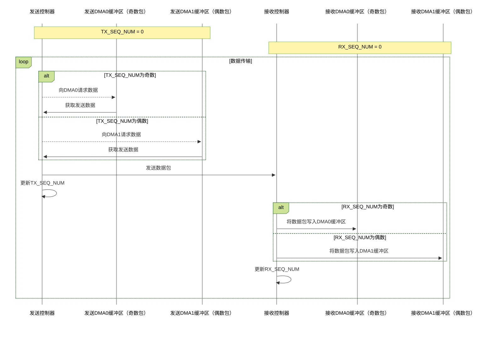
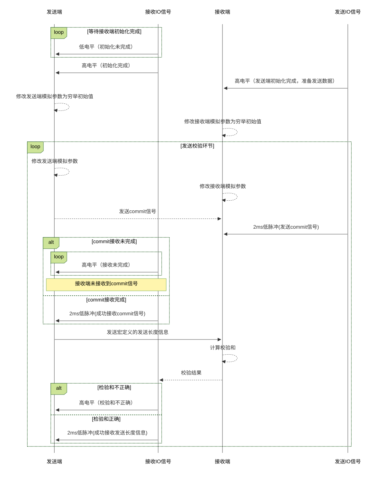

AN14000

V1.0

# 说明

CH32H417 作为一款功能强大的芯片，集成了 SerDes
模块，为用户提供了高效、高速的数据传输解决方案。本应用笔记将深入探讨
CH32H417 芯片中 SerDes
的使用方法、配置流程、应用场景以及常见问题与解决方案，帮助用户充分利用该芯片的
SerDes 功能。

适用范围

| 适用范围 | 系列         |
|----------|--------------|
| 通用MCU  | CH32H417系列 |

目录

[说明 [i](#说明)](#说明)

[目录 [ii](#_Toc207035732)](#_Toc207035732)

[表格索引 [ii](#_Toc207035733)](#_Toc207035733)

[图片索引 [ii](#_Toc207035734)](#_Toc207035734)

[第1章 功能介绍及注意事项 [1](#功能介绍及注意事项)](#功能介绍及注意事项)

> [1.1 功能简介 [1](#功能简介)](#功能简介)
>
> [1.1.1 扰码功能 [1](#扰码功能)](#扰码功能)
>
> [1.1.2 收发双缓冲 [1](#收发双缓冲)](#收发双缓冲)
>
> [1.2 注意事项 [2](#注意事项)](#注意事项)
>
> [1.2.1 数据传输可靠性对程序运行的影响
> [2](#数据传输可靠性对程序运行的影响)](#数据传输可靠性对程序运行的影响)
>
> [1.2.2 实测不同线长最高传输速率
> [2](#实测不同线长最高传输速率)](#实测不同线长最高传输速率)

[第2章 硬件设计 [3](#硬件设计)](#硬件设计)

> [2.1 SerDes硬件接口 [3](#serdes硬件接口)](#serdes硬件接口)
>
> [2.2 硬件设计注意事项 [3](#硬件设计注意事项)](#硬件设计注意事项)

[第3章 SerDes的软件配置 [4](#serdes的软件配置)](#serdes的软件配置)

> [3.1 软件配置流程 [4](#软件配置流程)](#软件配置流程)
>
> [3.2 模拟参数调整 [5](#模拟参数调整)](#模拟参数调整)

[历史版本 [6](#历史版本)](#历史版本)

[声明 [7](#_Toc207035742)](#_Toc207035742)

表格索引

[表 1‑1实测最高传输速率 [2](#_Toc239782990)](#_Toc239782990)

图片索引

[图 1‑1双缓冲传输时序图Chnn [1](#_Toc239782991)](#_Toc239782991)

[图 1‑2线长对最高传输速率影响的趋势 [2](#_Toc239782992)](#_Toc239782992)

[图 3‑1自动获取模拟参数流程 [5](#_Toc239782993)](#_Toc239782993)

#  功能介绍及注意事项

## 功能简介

SerDes，即串行器（Serializer）/解串器（Deserializer）的简称，是一种在现代高速数据传输中发挥关键作用的技术。其核心功能在于实现信号传输形式的巧妙转换，在发送端，它如同一位高效的“整理员”，将多路低速并行信号有条理地转换成高速串行信号。这就好比把多个零散的小包裹整合打包成一个大包裹，以便于更高效地运输。这些高速串行信号随后通过各种传输媒体，如常见的光缆或铜线进行传输。而在接收端，SerDes又化身为一位精准的“拆分员”，将接收到的高速串行信号重新还原为低速并行信号，方便后续电路进行处理，就像把大包裹准确无误地拆分成原来的各个小包裹。

这种点对点的串行通信技术，充分挖掘了传输媒体的信道容量潜力。通过减少所需的传输信道数量，以及大幅削减器件引脚数目，不仅有效降低了硬件成本，还提升了信号的传输速度，在当今对数据传输效率和成本控制要求极高的电子领域中，已然成为不可或缺的存在。

### 扰码功能

开启扰码功能后，会将在线路空闲时发送的Sync信号用CONT和扰码数据代替，开启此功能后有如下优点：

1.  避免长连“0”或长连“1”：原始数据可能出现连续相同比特，导致接收端时钟同步失锁，扰码后可打散连续比特，确保时钟稳定提取。

2.  降低信号频谱集中：连续相同比特会使信号频谱能量集中在特定频率，易引发电磁干扰（EMI），扰码后频谱更分散。

3.  适配传输链路特性：部分传输介质对固定模式信号衰减较大，扰码后的随机化信号能更好适配链路，减少信号失真。

### 收发双缓冲

在收发过程中，若开启了双缓冲模式，则在接收端收到RX_SEQ_NUM为奇数的数据包将存入DMA0指向的区域，RX_SEQ_NUM为偶数的数据包将被存入DMA1指向的区域。

<figure>

<figcaption>
图
1‑1双缓冲传输时序图Chnn
</figcaption>
</figure>

## 注意事项

### 数据传输可靠性对程序运行的影响

SerDes接收方对数据包的结束的判定完全是根据发送方发送的总线空闲信号。若通信质量非常不佳，在发送端发送完数据后发送空闲信号的第一时间，接收方并没有收到空闲信号，那么DMA会继续将接收到的错误消息存入后续的存储空间，直至接收到总线空闲信号。这会导致在通信质量非常不佳的情况下，SerDes接收端会有极低的概率冲掉其他的数据区导致程序运行出错。因此要考虑在通信质量没办法保证的情况下使用SerDes对程序运行时的数据结构产生的影响。

### 实测不同线长最高传输速率

以下数据来源于较好的6类网线实测数据：

| 传输距离（m） | 线材规格 | 最高传输速度（GHz） |
|---------------|----------|---------------------|
| 1             | CAT6     | 1.8                 |
| 5             | CAT6     | 1.68                |
| 10            | CAT6     | 1.6                 |
| 100           | CAT6     | 0.56                |

表 1‑1实测最高传输速率

图
1‑2线长对最高传输速率影响的趋势

#  硬件设计

## SerDes硬件接口

在连接方式上，SerDes接口采用差分信号传输，通过一对差分线（Tx+/-，Rx+/-）来传输数据，这种方式能够有效减少信号干扰，提高抗干扰能力，保证数据在高速传输过程中的准确性。在CH32H417上有两组收发器，可以灵活配置两对差分接口的收发方向，且可配置差分接口的极性。

从电气特性来看，CH32H417的SerDes接口支持多种速率，可根据不同的应用需求进行灵活配置，最高速率能够满足高速数据传输的严苛要求。同时，该接口还具备良好的信号驱动能力，能够保证信号在长距离传输过程中不失真。

需要特别注意的是，CH32H417的SerDes采用WCH自定义协议，该协议不与其他厂商的SerDes产品兼容，其核心应用场景聚焦于WCH芯片生态内的板间通讯（如通过光纤实现的远距离互联）和板内通讯，这一特性决定了其在系统设计中需遵循WCH芯片的配套使用原则。

## 硬件设计注意事项

在进行基于CH32H417的硬件设计时，为确保SerDes能够稳定、高效地工作，需要在多个方面加以注意。

在PCB布局方面，应将SerDes相关的器件尽量靠近CH32H417芯片放置，以缩短信号传输路径，减少信号的传输延迟和损耗。例如，将SerDes的发送端和接收端器件与芯片的对应引脚紧密相邻，避免信号在PCB上的过长走线。同时，要合理规划其他元器件的位置，避免对SerDes信号产生干扰。比如，将高频噪声源器件远离SerDes信号走线，防止其对高速信号造成影响。

布线长度也是一个关键因素。高速信号在传输过程中，随着布线长度的增加，信号的衰减、延迟和失真都会加剧。因此，应尽量缩短SerDes差分线的布线长度，确保信号能够快速、准确地传输。一般来说，差分线的长度应控制在合理范围内，避免出现过长的走线。

阻抗匹配对于SerDes的正常工作同样至关重要。CH32H417的SerDes差分信号传输线特性阻抗需严格控制，这是保障高速信号传输质量的关键参数。如果阻抗不匹配，信号在传输过程中会发生反射，导致信号失真，严重影响数据传输的可靠性。在设计过程中，需要根据SerDes接口的特性和传输线的参数，精确计算并调整阻抗，确保发送端、传输线和接收端的阻抗一致。通常采用的方法是在传输线的两端添加合适的匹配电阻，如终端电阻、源端电阻等，以实现同时通过控制PCB差分线的线宽、线间距以及介质层厚度等参数，将差分阻抗稳定控制在100Ω，以实现最佳的阻抗的匹配效果。

此外，在SerDes差分传输线路靠近CH32H417芯片的一侧，建议串联较小容值的电容（通常选择0.1μF~1μF的高频陶瓷电容）。该电容主要起到隔直作用，能够阻断传输线路中的直流分量，避免直流偏置影响SerDes模块内部电路的正常工作，同时不会对高速串行信号的交流分量产生明显衰减。在选型时，需优先选择高频特性好、等效串联电阻（ESR）低的陶瓷电容，确保其在SerDes工作频率范围内能够稳定发挥作用，进一步保障信号传输的纯净度。

#  SerDes的软件配置

## 软件配置流程

首先，需要使能SerDes控制器的时钟。在CH32H417中，通过对RCC（复位和时钟控制）寄存器的相关位进行设置来实现，使能SerDes模块的时钟，为后续的配置操作提供时钟信号。

接下来，要配置SerDes时钟的来源以及使能对应时钟，SerDesPLL的时钟来源是HSE，所以在最开始要使能HSE时钟，并确保HSE正常起振。

<table>
<colgroup>
<col style="width: 100%" />
</colgroup>
<thead>
<tr>
<th style="text-align: left;">
if (!(<strong>RCC</strong>-&gt;CTLR
&amp; <strong>RCC_HSERDY</strong>))

{

    <strong>RCC</strong>-&gt;CTLR |=
((uint32_t)<strong>RCC_HSEON</strong>);

    do

    {

        time_out++;

    } while (((<strong>RCC</strong>-&gt;CTLR &amp;
<strong>RCC_HSERDY</strong>) == 0) &amp;&amp; (time_out !=
<strong>HSE_STARTUP_TIMEOUT</strong>));

    if (time_out == <strong>HSE_STARTUP_TIMEOUT</strong>)

        return <strong>__LINE__</strong>;

}
</th>
</tr>
</thead>
<tbody>
</tbody>
</table>

然后，还要确定收发双方的SerDes时钟频率，并开启SerDesPLL。需要注意的是，配置PLL时钟需要配置SerDes控制器的配置位，该操作需要接收模块上电。

<table>
<colgroup>
<col style="width: 100%" />
</colgroup>
<thead>
<tr>
<th style="text-align: left;">
<strong>SDS_Rx_Pwrp</strong>(SDSx);

<strong>RCC_SERDESPLLMulConfig</strong>(<strong>RCC_SERDESPLL_MUL50</strong>);

<strong>RCC_SERDES_PLLCmd</strong>(ENABLE);
</th>
</tr>
</thead>
<tbody>
</tbody>
</table>

等待SerDesPLL时钟就绪后，便可将配置写入SerDes控制寄存器。配置选项包含收/发模块上电使能、模块收/发使能、扰码功能使能、差分极性反转使能、发送时插入ALIGN信号使能。文章后续将介绍部分功能。

<table>
<colgroup>
<col style="width: 100%" />
</colgroup>
<thead>
<tr>
<th style="text-align: left;">
SDS_CFG_TypeDef sds_cfg = {.ClearALL =
0,

                           .DMA_Enable = 1,

                           .INIBusy_En = 1,

                           .InsertAlign = 1,

                           .RxPowerUp = 0,

                           .TxPowerUp = 1,

                           .ReplaceSYNCwithCONT = 1,

                           .RxEn = 0,

                           .TxEn = 1,

                           .SwitchRxPolarity = 0,

                           .ResetLink = 0};

<strong>SDS_Config</strong>(SDSx, &amp;sds_cfg);
</th>
</tr>
</thead>
<tbody>
</tbody>
</table>

在配置完功能和时钟之后，发送端应当发送一段时间的COMINIT信号给接收端用以时钟的同步，接收端则应等待该信号的到来，再进入接收数据状态。需要注意的是在接收同步信号的时间段内，接收端会接收到多次的同步信号，因此在这段时间接收到同步信号的标志位也会反复置位，但只要接收到同步信号，就表明同步已经成功。

<table>
<colgroup>
<col style="width: 100%" />
</colgroup>
<thead>
<tr>
<th style="text-align: left;">
//发送120Ms的同步信号

sds_rtx_ctrl.SDSRTXCtrl_LinkInit = 1;

<strong>SDS_RTX_Ctrl</strong>(TxSDS, &amp;sds_rtx_ctrl);

<strong>Delay_Ms</strong>(120);

sds_rtx_ctrl.SDSRTXCtrl_LinkInit = 0;

<strong>SDS_RTX_Ctrl</strong>(TxSDS, &amp;sds_rtx_ctrl);
</th>
</tr>
</thead>
<tbody>
<tr>
<td style="text-align: left;">
//等待同步信号

while (!(<strong>SDS_ReadIT</strong>(RxSDS) &amp;
(SDSIT_FLAG_Cominit)));
</td>
</tr>
</tbody>
</table>

接下来就可以正式收发数据了，收发数据都由DMA搬运，传输过程中产生的错误和传输阶段事件会触发SerDes中断，详见CH32H417RM.PDF

## 模拟参数调整

软件可调节SerDes收发器的信号的均衡和加重，以适配不同线材长度和材料对信号的影响。可以调整的项目有发送端的幅度和幅度加重，接收端的反馈电容及电阻。

不同的线材往往有不同的传输性能，而线材传输性能对SerDes传输质量的影响是不可忽略的，因此在使用新线材时，需要重新计算合适的模拟参数。另外，也可以通过穷举法快速挑选出较为合适的模拟参数，详见《CH32H417
EVT》

其大致思路入下图：

<figure>

<figcaption>
图
3‑1自动获取模拟参数流程
</figcaption>
</figure>

# 历史版本

更新内容

| 日期       | 版本 | 变更内容 |
|------------|------|----------|
| 2025/11/17 | V1.0 | 初版发行 |

声明

本手册仅供参考。作者在不另行通知的情况下，可随时进行修改。
