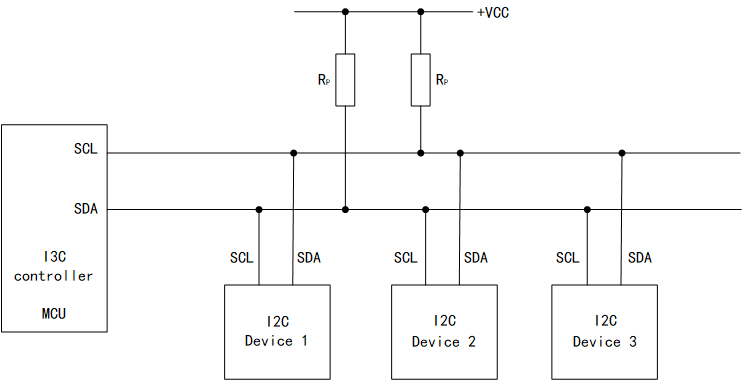
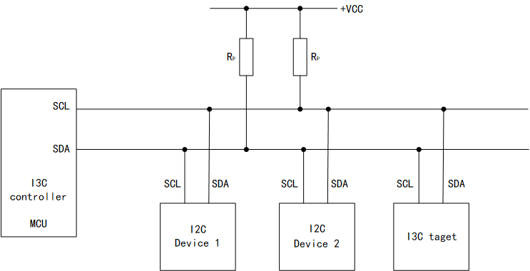

<table>
<colgroup>
<col style="width: 50%" />
<col style="width: 50%" />
</colgroup>
<thead>
<tr>
<th rowspan="2"></th>
<th>AN16001</th>
</tr>
<tr>
<th>V1.0</th>
</tr>
</thead>
<tbody>
</tbody>
</table>

说明

集成电路间总线（I2C）和改良型集成电路间总线（I3C）均为同步串行通信协议，广泛用于连接传感器、加速度计、触控芯片及低功耗外设等。两者在物理层均使用两根信号线（时钟SCL及数据SDA），但I3C在保留向后兼容性的基础上，对总线性能、功耗和管理能力进行了显著增强。

**适用范围**

| 适用范围 | 系列                 |
|----------|----------------------|
| 通用MCU  | CH32H417 CH32V407 等 |

目录

[说明 [1](#_Toc238825245)](#_Toc238825245)

[目录 [2](#_Toc238825246)](#_Toc238825246)

[表格索引 [2](#_Toc238825247)](#_Toc238825247)

[图片索引 [2](#_Toc238825248)](#_Toc238825248)

[第1章 I3C 介绍 [1](#i3c-介绍)](#i3c-介绍)

[1.1 I3C 是什么 [1](#i3c-是什么)](#i3c-是什么)

[1.2 I2C 的局限 [1](#i2c-的局限)](#i2c-的局限)

[1.3 I3C 的核心特性 [1](#i3c-的核心特性)](#i3c-的核心特性)

[1.3.1 高速传输 [1](#高速传输)](#高速传输)

[1.3.2 动态地址分配（DAA） [1](#动态地址分配daa)](#动态地址分配daa)

[1.3.3 带内中断（IBI） [1](#带内中断ibi)](#带内中断ibi)

[1.3.4 可靠性 [2](#可靠性)](#可靠性)

[1.4 I3C 与 I2C 对比 [2](#i3c与i2c对比)](#i3c与i2c对比)

[1.5 I3C应用场景 [2](#i3c应用场景)](#i3c应用场景)

[第2章 在 I3C 硬件上驱动 I2C 设备
[3](#在-i3c-硬件上驱动-i2c-设备)](#在-i3c-硬件上驱动-i2c-设备)

[2.1 I3C兼容性机制 [3](#i3c兼容性机制)](#i3c兼容性机制)

[2.2 物理连接方式 [3](#物理连接方式)](#物理连接方式)

[2.3 地址管理与冲突避免 [4](#地址管理与冲突避免)](#地址管理与冲突避免)

[2.4 控制器初始化与配置 [4](#控制器初始化与配置)](#控制器初始化与配置)

[2.5 收发流程 [6](#收发流程)](#收发流程)

[2.6 示例代码 [6](#示例代码)](#示例代码)

[历史版本 [10](#_Toc238825266)](#_Toc238825266)

[声明 [11](#_Toc238825267)](#_Toc238825267)

表格索引

[I2C的问题 [1](#_Toc238825268)](#_Toc238825268)

[I3C 与 I2C 对比 [2](#_Toc238825269)](#_Toc238825269)

[I3C的配置项目 [6](#_Toc238825270)](#_Toc238825270)

图片索引

[只有I2C设备 [3](#_Toc238825271)](#_Toc238825271)

[混合设备 [3](#_Toc238825272)](#_Toc238825272)

# I3C 介绍

## I3C 是什么

I3C（Improved Inter-Integrated Circuit）由 MIPI 联盟于 2017 年发布，是
I2C 的演进标准。它沿用 I2C 的两线制（SCL/SDA），改变集中在三处：

\- 速率：重定义物理层时序与帧格式，SDR 模式下最高 12.5 Mbit/s；

\- 管理：支持动态地址、带内中断、多控制器；

\- 兼容：与普通 I2C 设备共存于同一总线。

##  I2C 的局限

| **I2C**                         | **问题**                                |
|---------------------------------|-----------------------------------------|
| 速率低（100 kbit/s ~ 1 Mbit/s） | 无法满足传感器/图像传感器等高速数据需求 |
| 中断需额外 **INT** 引脚         | 从机数量多时 GPIO 占用、走线复杂        |
| 地址固定（7-bit，硬件决定）     | 同型号设备地址冲突时只能改硬件或不用    |
| 无统一总线管理                  | 从机无法动态加入/退出                   |
| 多主机仲裁效率低                | 总线利用率低                            |

表 1‑1 I2C的问题

## I3C 的核心特性

> I3C在保留两线（SCL、SDA）串行接口的基础上，实现了大飞跃

### 高速传输

I3C 数据帧以 SDR（Single Data Rate，单倍数据率） 为基础，最高 12.5
Mbit/s，远超I2C的上限

高速源于混合驱动：传输数据时总线用推挽（push-pull）驱动，只有仲裁、应答（ACK/NACK）这类需要"线与"的阶段才切回开漏（open-drain）。推挽驱动无需等外部上拉电容/电阻缓慢充电，电平翻转更快，SCL
才能拉到 12.5 Mbit/s 档；开漏则保证仲裁与应答的逻辑同 I2C
一致。驱动切换由控制器在帧内自动完成，对设备透明。

### 动态地址分配（DAA）

I 3C 从机不再用固定地址，总线初始化时由控制器通过 ENTDAA 命令为每个 I3C
从机分配动态地址，范围为 0x08 ~
0x77。同型号设备可批量部署，地址由控制器统一管理。

### 带内中断（IBI）

I3C 从机可直接在 SCL/SDA 上发起中断请求，无须单独的 INT
引脚，由控制器决定接受与否。多传感器场景下可省下不少 GPIO。

\- 中断走总线而非引脚：从机在总线空闲时主动拉低
SDA、发一个特殊起始序列，把"中断请求"带给控制器，替代 I2C
那根独立的中断（Interrupt/Data Ready）引脚。从机越多，省 GPIO
效果越明显。

I3C的中断也分为以下几类:

\- 不带数据：只发请求，具体事件靠后续读取或事件寄存器表达；

\- 带数据：请求时捎带几个事件字节，省去控制器一次读操作；

请求不一定被接受：控制器可按当前负载对某从机的 IBI
应答或拒绝（NACK）。多控制器场景下，I3C
从机可被指派为"target"，其它主机可借 IBI 向其发起会话管理请求，这是 I2C
从机没有的能力。

IBI 仅对 I3C 设备有效。legacy I2C 设备挂上总线后中断仍只能走外部 GPIO

### 可靠性

I3C 在协议层引入的检错手段：

\- 地址奇偶校验：SDR 帧的地址字段带位偶校验（odd parity）。

\- 数据 CRC：数据部分可选用 CRC（CRC-8/CRC-32）。

\- 行为校验与 ERR 信号：SDR
帧可对地址之后的数据及行为字段逐一校验；从机也能通过 ERR（Error）信号
通知控制器本帧出错，由控制器决定重传还是终止。

I2C 只有总线级仲裁和
ACK/NACK，协议本身不做位级校验，出错靠上层软件（读回比对、应用层自算
CRC）。

##  I3C与I2C对比

|          | **I2C**         | **I3C**                   |
|----------|-----------------|---------------------------|
| 线数     | 2（SCL/SDA）    | 2（SCL/SDA）              |
| 最高速率 | 1 Mbit/s（FM+） | 12.5 Mbit/s（SDR）        |
| 从机地址 | 固定 7-bit      | 动态 7-bit（DAA）         |
| 中断     | 需外部 INT 引脚 | 带内中断 IBI              |
| 校验     | 无              | 地址奇偶校验 / 数据 CRC   |
| 兼容性   | —               | 支持（legacy 设备可共存） |

表 1‑2 I3C 与 I2C 对比

##  I3C应用场景

\- MEMS 传感器（加速度计、陀螺仪、磁力计、压力/湿度传感器）；

\- MIPI 生态器件 —— 摄像头/显示屏（配套 MIPI CSI/DSI）；

\- PMIC、充电管理、LED 驱动等外设；

\- 内存模组（DDR 的 SPD / PMIC 控制）；

\- 多传感器、低引脚数、高吞吐的嵌入式平台。

# 在 I3C 硬件上驱动 I2C 设备

## I3C兼容性机制

MIPI I3C 规范规定：I3C 控制器必须向后兼容 I2C，挂在 I3C 总线上的 I2C
设备以 legacy（传统）设备（下称"legacy
设备"）身份存在，然后I3C控制器使用 SDR 模式 + I2C
兼容的字节时序与I2C设备通信；从协议看，控制器对I2C设备发出的就是一帧标准
I2C 传输：

START → 7bit地址 + R/W → ACK → 数据 → ACK ... → STOP

对于I2C 设备而言，I3C 控制器与 I2C 控制器几乎无差别：设备接收流程的仍是
START / 7位地址+R/W / ACK / 数据，… / STOP，应答靠开漏 +
上拉完成；推挽/开漏切换、SDR
帧时序等差异发生在控制器内部，设备感知不到。原有驱动的读写流程无需修改

## 物理连接方式

I3C 允许多个I2C和I3C设备都挂载到总线上并且可以正常通信。

- 场景 A：总线上只有 I2C 设备

<figure>

<figcaption>
图 2‑1 只有I2C设备
</figcaption>
</figure>

- 场景 B：I3C 与 I2C 设备混合

<figure>

<figcaption>
图 2‑2 混合设备
</figcaption>
</figure>

## 地址管理与冲突避免

由于I2C设备与I3C设备之间可能存在地址冲突所以需要一定的办法防止冲突。以下是各设备地址的介绍

\- I2C legacy 设备：固定 7-bit 静态地址，由硬件决定；

\- I3C 设备：动态地址，控制器 DAA 阶段分配，范围 0x08 ~ 0x77；

\- 广播地址 0x7E：I3C 专用，用于发送 CCC 命令（I2C
设备一般不识别、不响应，不受影响）。

混合总线上执行 DAA 时，控制器不得把某 I2C 设备的静态地址再分配给 I3C
从机。实现上，控制器维护一张"已占用地址表"，把 legacy
静态地址登记进去并在 DAA 时跳过。

## 控制器初始化与配置

初始化时，首先使能I3C外设时钟、AFIO复用功能时钟以及GPIOB端口时钟，为后续配置提供时钟基础；然后配置GPIO，将PB10和PB11引脚分别配置为I3C_SCL和I3C_SDA，引脚模式设置为复用推挽输出（GPIO_Mode_AF_PP），输出速度设置为高速，使其能够承载I3C总线的通信速率；

接着配置I3C外设，具体分为三个步骤：第一步，配置I3C总线的时序参数，包括SDA保持时间、等待时间、SCL在推挽模式和开漏模式下的高低电平持续时间、总线释放时间和总线空闲时间，这些参数共同决定了I3C总线的通信速率和时序特性；第二步，配置I3C控制器的行为参数，包括设置控制器的动态地址为0x22、禁止热加入功能、禁止ACK停顿、禁止CCC命令停顿、禁止发送停顿和接收停顿等，这些配置决定了控制器作为I3C主设备的工作模式和响应策略；第三步，配置FIFO相关的阈值参数，包括接收FIFO阈值和发送FIFO阈值均设置为1/4满触发，并禁用控制FIFO，这些配置决定了数据缓存和中断/DMA触发的水线；

最后，将上述三个配置结构体分别通过I3C_Ctrl_Init、I3C_Ctrl_Config和I3C_SetConfigFifo函数写入硬件寄存器，完成所有底层配置后，调用I3C_Cmd(ENABLE)使能I3C外设，使其正式进入工作状态，开始作为I3C控制器响应总线通信。

    void I3C_Config(void)
    {
        I3C_Ctrl_BusTypeDef   I3C_Ctrl_BusInit   = {0};
        I3C_CtrlConfTypeDef   I3C_CtrlConfInit   = {0};
        I3C_FifoConfTypeDef   I3C_FifoConfInit   = {0};
        GPIO_InitTypeDef GPIO_InitStructure = {0};

        RCC_PB2PeriphClockCmd(RCC_PB2Periph_AFIO,  ENABLE);
        RCC_PB2PeriphClockCmd(RCC_PB2Periph_GPIOB, ENABLE);
        RCC_HBPeriphClockCmd(RCC_HBPeriph_I3C, ENABLE);

        /* PB10=SCL，PB11=SDA，复用推挽输出 */
        GPIO_InitStructure.GPIO_Pin   = GPIO_Pin_10 | GPIO_Pin_11;
        GPIO_InitStructure.GPIO_Speed = GPIO_Speed_High;
        GPIO_InitStructure.GPIO_Mode  = GPIO_Mode_AF_PP;
        GPIO_Init(GPIOB, &GPIO_InitStructure);

        /* 总线时序。Duration 字段按控制器时钟换算，值由目标 SCL 频率与对应设备
         * AC 规格决定；推挽段与开漏段、I3C 帧与 legacy I2C 帧分别定高低电平。 */
        I3C_Ctrl_BusInit.SDAHoldTime        = I3C_SDAHoldTime_1_5;  /* SDA 相对 SCL 的保持时间 */
        I3C_Ctrl_BusInit.WaitTime           = I3C_WaitTime_State_2; /* 帧内时钟等待状态数 */
        I3C_Ctrl_BusInit.SCLPPLowDuration   = 0x69;                 /* 推挽段 SCL 低电平 */
        I3C_Ctrl_BusInit.SCLI3CHighDuration = 0x68;                 /* I3C 帧 SCL 高电平 */
        I3C_Ctrl_BusInit.SCLODLowDuration   = 0x68;                 /* 开漏段 SCL 低电平 */
        I3C_Ctrl_BusInit.SCLI2CHighDuration = 0x48;                 /* legacy I2C 帧 SCL 高电平 */
        I3C_Ctrl_BusInit.BusFreeDuration    = 0x67;                 /* 总线自由（free）时间 */
        I3C_Ctrl_BusInit.BusIdleDuration    = 0x6e;                 /* 总线空闲（idle）时间 */

        /* 控制器行为 */
        I3C_CtrlConfInit.DynamicAddr       = 0x22;   /* 控制器作为从设备被访问时的地址 */
        I3C_CtrlConfInit.StallTime         = 0x10;   /* 从设备响应等待时延 */
        I3C_CtrlConfInit.PullUp            = ENABLE; 
        I3C_CtrlConfInit.HotJoinAllowed_EN = DISABLE;
        I3C_CtrlConfInit.ACKStallState     = DISABLE;  /* 各阶段 stall（等待从设备响应）关闭 */
        I3C_CtrlConfInit.CCCStallState     = DISABLE;
        I3C_CtrlConfInit.TxStallState      = DISABLE;
        I3C_CtrlConfInit.RxStallState      = DISABLE;

        /* FIFO：收发阈值 1/4，控制 FIFO 关闭 */
        I3C_FifoConfInit.RxFifoThreshold = I3C_RXFIFO_THRESHOLD_1_4;
        I3C_FifoConfInit.TxFifoThreshold = I3C_TXFIFO_THRESHOLD_1_4;
        I3C_FifoConfInit.ControlFifo     = I3C_CONTROLFIFO_DISABLE;

        I3C_Ctrl_Init(&I3C_Ctrl_BusInit);     /* 下发总线时序 */
        I3C_Ctrl_Config(&I3C_CtrlConfInit);   /* 下发控制器行为 */
        I3C_SetConfigFifo(&I3C_FifoConfInit); /* 下发 FIFO 配置 */
        I3C_Cmd(ENABLE);                      /* 使能控制器 */
    }

| **项目** | **字段** | **说明** |
|----|----|----|
| 时钟 | RCC_HBPeriph_I3C | I3C 外设时钟，先使能 |
| 引脚 | GPIOB.PB10/PB11，AF_PP | SCL/SDA 用复用推挽 |
| SCL 低电平 | SCLPPLowDuration / SCLODLowDuration | 推挽（SDR 数据段）与开漏（ACK/仲裁段）各一套 |
| SCL 高电平 | SCLI3CHighDuration / SCLI2CHighDuration | I3C 帧与 legacy I2C 帧分开，后者须配合 I2C 器件 AC 时序，不能超其最大 SCL |
| SDA 保持 | SDAHoldTime | 相对 SCL 的保持时间，快速率下需加大 |
| 动态地址 | DynamicAddr=0x22 | 控制器作从设备被访问时的地址；纯 I2C 场景可忽略 |
| FIFO | RX/TxFifoThreshold | 收发FIFO动作水位，影响中断/轮询时机 |

表 2‑1 I3C的配置项目

## 收发流程

对 legacy I2C 设备的读写即是标准 I2C 帧。

发流程

    START → [从机地址 | W=0] → ACK → [寄存器地址] → ACK → [数据...] → ACK → STOP

收流程

    第 1 帧：START → [从机地址 | W=0] → ACK → [寄存器地址] → ACK → STOP
    第 2 帧：START → [从机地址 | R=1] → ACK → [D0] ACK ... [Dn-1] → NACK → STOP

## 示例代码

本示例代码使用I3C对一个I2C EEPROM设备(AT24C02)进行读写操作

发送数据的代码

    uint32_t i2c_Transmit(uint8_t addr, uint8_t* send_buf, uint8_t send_len)
    {
        I3C_ClearFlag(I3C_FLAG_FCF);      /* 清帧完成标志 */
        I3C_ClearFlag(I3C_CEVR_CERRF);   /* 清错误标志   */

        /* addr 为 7-bit 从地址；LEGACY_I2C 按 I2C 帧时序发送；帧尾产生 STOP */
        I3C_ControllerHandleMessage(addr, send_len, I3C_Direction_WR,
                                    I3C_CONTROLLER_MTYPE_LEGACY_I2C, I3C_GENERATE_STOP);

        for (size_t i = 0; i < send_len; i++)
        {
            while (I3C_GetFlagStatus(I3C_EVR_TXFNFF) == RESET) {} /* 等 TX FIFO 非满 */
            I3C_WriteByte(send_buf[i]);
        }

        while ((I3C_GetFlagStatus(I3C_EVR_FCF) == RESET) &&
               (I3C_GetFlagStatus(I3C_EVR_ERRF) == RESET)) {}     /* 帧完成，或出错 */

        if (I3C_GetFlagStatus(I3C_EVR_ERRF) == SET)     /* 出错：清错误标志后返回 1 */
        {
            I3C_ClearFlag(I3C_CEVR_CERRF);
            return 1;
        }
        if (I3C_GetFlagStatus(I3C_EVR_FCF) == SET)      /* 完成：清帧完成标志 */
        {
            I3C_ClearFlag(I3C_FLAG_FCF);
        }
        return 0;
    }

收数据的代码

    uint32_t i2c_Receive(uint8_t addr, uint8_t* recv_buf, uint8_t recv_len)
    {
        I3C_ClearFlag(I3C_FLAG_FCF);
        I3C_ClearFlag(I3C_CEVR_CERRF);

        I3C_ControllerHandleMessage(addr, recv_len, I3C_Direction_RD,
                                    I3C_CONTROLLER_MTYPE_LEGACY_I2C, I3C_GENERATE_STOP);

        for (size_t i = 0; i < recv_len; i++)
        {
            while (I3C_GetFlagStatus(I3C_EVR_RXFNEF) == RESET) {} /* 等 RX FIFO 非空 */
            recv_buf[i] = I3C_ReadByte();
        }

        while ((I3C_GetFlagStatus(I3C_EVR_FCF) == RESET) &&
               (I3C_GetFlagStatus(I3C_EVR_ERRF) == RESET)) {}

        if (I3C_GetFlagStatus(I3C_EVR_ERRF) == SET)
        {
            I3C_ClearFlag(I3C_CEVR_CERRF);
            return 1;
        }
        if (I3C_GetFlagStatus(I3C_EVR_FCF) == SET)
        {
            I3C_ClearFlag(I3C_FLAG_FCF);
        }
        return 0;
    }

发送数据然后收数据的代码

    uint32_t i2c_TransmitReceive(uint8_t addr, uint8_t* send_buf, uint8_t send_len,
                                uint8_t* recv_buf, uint8_t recv_len)
    {
        if (i2c_Transmit(addr, send_buf, send_len) != 0)
        {
            return 1;
        }

        return i2c_Receive(addr, recv_buf, recv_len);
    }

对AT24C02的相关操作

    #define AT24CXX_PAGE_SIZE 8        /* AT24C02 每页 8 字节 */

    /* 单字节写：一帧内"寻址 + 数据" */
    void AT24CXX_WriteOneByte(u16 WriteAddr, u8 DataToWrite)
    {
        uint8_t wr_data[] = {(uint8_t)WriteAddr, DataToWrite};
        i2c_Transmit(0xA0 >> 1, wr_data, 2);      /* 0xA0>>1 = 0x50 是 7bit 从地址 */
    }

    /* 单字节读：先写目标地址，再读 1 字节（两帧） */
    u8 AT24CXX_ReadOneByte(u16 ReadAddr)
    {
        uint8_t wr_data[] = {(uint8_t)ReadAddr};
        uint8_t rd_data[1];

        i2c_TransmitReceive(0xA0 >> 1, wr_data, 1, rd_data, 1);
        return rd_data[0];
    }

    /* 页写：跨页前按页切片，每页写完等内部写周期 */
    u8 AT24CXX_WriteBytes(u16 WriteAddr, u8* pBuffer, u16 NumToWrite)
    {
        while (NumToWrite)
        {
            /* 本页剩余字节数；跨页时地址回卷会覆盖页首数据，须切到页边界 */
            u8 chunk = AT24CXX_PAGE_SIZE - (WriteAddr % AT24CXX_PAGE_SIZE);
            u8 wr_data[AT24CXX_PAGE_SIZE + 1];
            u8 i;

            if (chunk > NumToWrite)
            {
                chunk = (u8)NumToWrite;
            }

            wr_data[0] = (u8)WriteAddr;
            for (i = 0; i < chunk; i++)
            {
                wr_data[i + 1] = pBuffer[i];
            }

            if (i2c_Transmit(0xA0 >> 1, wr_data, chunk + 1) != 0)
            {
                return 1;
            }

            Delay_Ms(5);               /* 等待该页内部写周期结束（约 5 ms） */
            WriteAddr += chunk;
            pBuffer   += chunk;
            NumToWrite -= chunk;
        }

        return 0;
    }

主流程

    ...
        I3C_Config();                     /* 控制器初始化 */
        I3C_ArbitrationHeaderCmd(ENABLE); /* 禁用仲裁头使能  */

        AT24CXX_WriteBytes(100, (u8*)TEXT_Buffer, sizeof(TEXT_Buffer));
        Delay_Ms(50);

        AT24CXX_ReadBytes(100, data, sizeof(TEXT_Buffer));
        printf("%s\r\n", data);
    ...

历史版本

| 日期      | 版本 | 变更内容 |
|-----------|------|----------|
| 2026/8/26 | V1.0 | 初版发行 |

声明

本手册版权所有为南京沁恒微电子股份有限公司（Copyright © Nanjing Qinheng
Microelectronics Co., Ltd. All Rights
Reserved），未经南京沁恒微电子股份有限公司书面许可，任何人不得因任何目的、以任何形式（包括但不限于全部或部分地向任何人复制、泄露或散布）不当使用本产品手册中的任何信息。

任何未经允许擅自更改本产品手册中的内容与南京沁恒微电子股份有限公司无关。

南京沁恒微电子股份有限公司所提供的说明文档只作为相关产品的使用参考，不包含任何对特殊使用目的的担保。南京沁恒微电子股份有限公司保留更改和升级本产品手册以及手册中涉及的产品或软件的权利。

参考手册中可能包含少量由于疏忽造成的错误。已发现的会定期勘误，并在再版中更新和避免出现此类错误。
