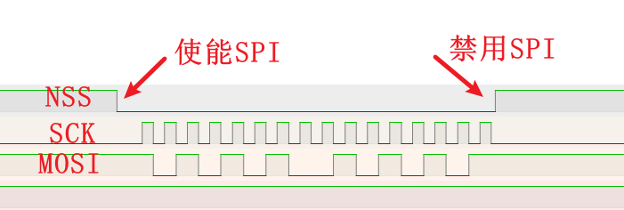
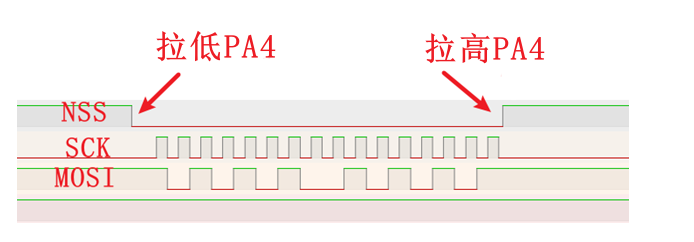

AN17001.DOCX

V1.0

***

说明

串行外设接口（SPI）是一种常用的同步串行通信协议，广泛用于连接传感器、存储器、显示器等外设。SPI通信中，主设备通过片选信号NSS选择从设备进行通信。

本应用笔记重点介绍如何在SPI主机模式下使用NSS输出功能，以提高通信可靠性。

适用范围

| 适用范围 | 系列                                  |
|----------|---------------------------------------|
| 通用MCU  | CH32V103 CH32V203 CH32V307 CH32L103 … |

目录

[说明](#_Toc215579738)

[目录](#_Toc215579739)

[表格索引](#_Toc215579740)

[图片索引](#_Toc215579741)

[第1章 使用硬件控制NSS](#_Toc215579742)

[1.1 硬件NSS工作原理](#硬件nss工作原理)

[1.2 硬件NSS 配置步骤](#硬件nss-配置步骤)

[1.2.1 硬件连接](#硬件连接)

[1.2.1 软件代码](#软件代码)

[第2章 使用软件控制NSS](#_Toc215579747)

[2.1 软件NSS的介绍](#软件nss的介绍)

[2.2 软件NSS 配置步骤](#软件nss-配置步骤)

[2.2.1 硬件连接](#硬件连接-1)

[2.2.1 软件代码](#软件代码-1)

[2.3 软件NSS的优点](#软件nss的优点)

[第3章 常用CH32芯片的SPI速度](#常用ch32芯片的spi速度)

[3.1 常用CH32芯片最大速度](#常用ch32芯片最大速度)

[历史版本](#_Toc215579755)

[声明](#_Toc215579756)

表格索引

[表 11 硬件NSS的SPI1硬件连接](#_Toc215579735)

[表 21 软件NSS的SPI1硬件连接](#_Toc215579736)

[表 31 常用CH32的SPI最大速度表](#_Toc215579737)

图片索引

[图 11 硬件NSS通信示意图](#_Toc215579757)

[图 21 软件NSS通信示意图](#_Toc215579758)

# 使用硬件控制NSS

## 硬件NSS工作原理

当SPI配置为主机且启用了硬件NSS输出时：

-   NSS引脚在SPI使能（SPE = 1）后自动拉低（有效电平，通常为低电平）。
-   每次SPI传输开始，NSS保持低电平。
-   若SPI被禁用（SPE = 0），NSS将恢复为高电平。

图 11 硬件NSS通信示意图



## 硬件NSS 配置步骤

### 硬件连接

在使用SPI1时，使用PA4连接目标的NSS引脚提供功能，具体连接如表格所示。

表 11 硬件NSS的SPI1硬件连接

| 引脚 | 功能      | 目标              |
|------|-----------|-------------------|
| PA5  | SPI1_SCK  | 从机SCK           |
| PA6  | SPI1_MISO | 从机MISO          |
| PA7  | SPI1_MOSI | 从机MOSI          |
| PA4  | SPI1_NSS  | 从机NSS（低有效） |

### 软件代码

配置时，先启用SPI1和GPIO；配置PA4、PA5、PA7为复用功能GPIO_Mode_AF_PP，将PA6配置 GPIO_Mode_IN_FLOATING。然后将SPI模式设置为2Lines_FullDuplex，并开启硬件NSS功能，然后开启NSS输出功能。注意此时不要使能SPI。

```C
	void SPI_FullDuplex_Init(void)
{
    GPIO_InitTypeDef GPIO_InitStructure = {0};
    SPI_InitTypeDef  SPI_InitStructure  = {0};

    RCC_APB2PeriphClockCmd(RCC_APB2Periph_GPIOA | RCC_APB2Periph_SPI1, ENABLE);

    GPIO_InitStructure.GPIO_Pin   = GPIO_Pin_4;
    GPIO_InitStructure.GPIO_Mode  = GPIO_Mode_AF_PP;
    GPIO_InitStructure.GPIO_Speed = GPIO_Speed_50MHz;
    GPIO_Init(GPIOA, &GPIO_InitStructure);

    GPIO_InitStructure.GPIO_Pin   = GPIO_Pin_5;
    GPIO_InitStructure.GPIO_Mode  = GPIO_Mode_AF_PP;
    GPIO_InitStructure.GPIO_Speed = GPIO_Speed_50MHz;
    GPIO_Init(GPIOA, &GPIO_InitStructure);

    GPIO_InitStructure.GPIO_Pin  = GPIO_Pin_6;
    GPIO_InitStructure.GPIO_Mode = GPIO_Mode_IN_FLOATING;
    GPIO_Init(GPIOA, &GPIO_InitStructure);

    GPIO_InitStructure.GPIO_Pin   = GPIO_Pin_7;
    GPIO_InitStructure.GPIO_Mode  = GPIO_Mode_AF_PP;
    GPIO_InitStructure.GPIO_Speed = GPIO_Speed_50MHz;
    GPIO_Init(GPIOA, &GPIO_InitStructure);

    SPI_InitStructure.SPI_Direction         = SPI_Direction_2Lines_FullDuplex;
    SPI_InitStructure.SPI_Mode              = SPI_Mode_Master;
    SPI_InitStructure.SPI_DataSize          = SPI_DataSize_16b;
    SPI_InitStructure.SPI_CPOL              = SPI_CPOL_Low;
    SPI_InitStructure.SPI_CPHA              = SPI_CPHA_1Edge;
    SPI_InitStructure.SPI_NSS               = SPI_NSS_Hard;  // 使用硬件NSS
    SPI_InitStructure.SPI_BaudRatePrescaler = SPI_BaudRatePrescaler_64;
    SPI_InitStructure.SPI_FirstBit          = SPI_FirstBit_MSB;
    SPI_InitStructure.SPI_CRCPolynomial     = 7;
    SPI_Init(SPI1, &SPI_InitStructure);

    // 开启 SPI 的NSS输出功能
    SPI_SSOutputCmd(SPI1, ENABLE);
}
```

使用时，需要先使能SPI再进行发送接收，此时硬件NSS会拉低NSS的IO，然后再开始发送；

在结束时，需要先等待SPI当前的流程完成再关闭SPI，此时硬件NSS会拉高NSS的IO，结束流程。

```C
// 使能 SPI NSS拉低
    SPI_Cmd(SPI1, ENABLE);

    while (SPI_I2S_GetFlagStatus(SPI1, SPI_I2S_FLAG_TXE) == RESET)
    {
    }

    SPI_I2S_SendData(SPI1, 0xaa55);

    while (SPI_I2S_GetFlagStatus(SPI1, SPI_I2S_FLAG_RXNE) == RESET)
    {
    }

    SPI_I2S_ReceiveData(SPI1);

    // 禁用 SPI NSS拉高
    SPI_Cmd(SPI1, DISABLE);
```

# 使用软件控制NSS

## 软件NSS的介绍

-   在许多实际应用中，尤其是多从机系统的场景，软件控制NSS（也称为“GPIO方式控制NSS”）是更常用且灵活的选择。

图 21 软件NSS通信示意图



## 软件NSS 配置步骤

### 硬件连接

在使用软件NSS的SPI1时，仍然可以使用PA4连接目标的NSS引脚提供功能，此时使用软件对NSS进行管理，具体连接如表格所示。

表 21 软件NSS的SPI1硬件连接

| 引脚 | 功能        | 目标              |
|------|-------------|-------------------|
| PA5  | SPI1_SCK    | 从机SCK           |
| PA6  | SPI1_MISO   | 从机MISO          |
| PA7  | SPI1_MOSI   | 从机MOSI          |
| PA4  | GPIO_Output | 从机NSS（低有效） |

### 软件代码

配置时，先启用SPI1和GPIO；将PA4配置 GPIO_Mode_Out_PP，并设置输出高，配置PA5、PA7为复用功能GPIO_Mode_AF_PP，将PA6配置 GPIO_Mode_IN_FLOATING。然后将SPI模式设置为2Lines_FullDuplex，并使用软件NSS。

```C
void SPI_FullDuplex_Init(void)
{
    GPIO_InitTypeDef GPIO_InitStructure = {0};
    SPI_InitTypeDef  SPI_InitStructure  = {0};

    RCC_APB2PeriphClockCmd(RCC_APB2Periph_GPIOA | RCC_APB2Periph_SPI1, ENABLE);

    GPIO_InitStructure.GPIO_Pin   = GPIO_Pin_4;
    GPIO_InitStructure.GPIO_Mode  = GPIO_Mode_Out_PP;
    GPIO_InitStructure.GPIO_Speed = GPIO_Speed_50MHz;
GPIO_Init(GPIOA, &GPIO_InitStructure);
    GPIO_SetBits(GPIOA, GPIO_Pin_4);


    GPIO_InitStructure.GPIO_Pin   = GPIO_Pin_5;
    GPIO_InitStructure.GPIO_Mode  = GPIO_Mode_AF_PP;
    GPIO_InitStructure.GPIO_Speed = GPIO_Speed_50MHz;
    GPIO_Init(GPIOA, &GPIO_InitStructure);

    GPIO_InitStructure.GPIO_Pin  = GPIO_Pin_6;
    GPIO_InitStructure.GPIO_Mode = GPIO_Mode_IN_FLOATING;
    GPIO_Init(GPIOA, &GPIO_InitStructure);

    GPIO_InitStructure.GPIO_Pin   = GPIO_Pin_7;
    GPIO_InitStructure.GPIO_Mode  = GPIO_Mode_AF_PP;
    GPIO_InitStructure.GPIO_Speed = GPIO_Speed_50MHz;
    GPIO_Init(GPIOA, &GPIO_InitStructure);

    SPI_InitStructure.SPI_Direction         = SPI_Direction_2Lines_FullDuplex;
    SPI_InitStructure.SPI_Mode              = SPI_Mode_Master;
    SPI_InitStructure.SPI_DataSize          = SPI_DataSize_16b;
    SPI_InitStructure.SPI_CPOL              = SPI_CPOL_Low;
    SPI_InitStructure.SPI_CPHA              = SPI_CPHA_1Edge;
    SPI_InitStructure.SPI_NSS               = SPI_NSS_Soft;  // 使用软件NSS
    SPI_InitStructure.SPI_BaudRatePrescaler = SPI_BaudRatePrescaler_64;
    SPI_InitStructure.SPI_FirstBit          = SPI_FirstBit_MSB;
    SPI_InitStructure.SPI_CRCPolynomial     = 7;
    SPI_Init(SPI1, &SPI_InitStructure);
}
```

使用时，需要先拉低PA4，此时NSS被拉低，然后再开始发送；

在结束时，需要先等待SPI当前的流程完成再拉高PA4，此时NSS被拉高，结束流程。

```C
// 拉低PA4 NSS拉低
    GPIO_ResetBits(GPIOA, GPIO_Pin_4);

    while (SPI_I2S_GetFlagStatus(SPI1, SPI_I2S_FLAG_TXE) == RESET)
    {
    }

    SPI_I2S_SendData(SPI1, 0xaa55);

    while (SPI_I2S_GetFlagStatus(SPI1, SPI_I2S_FLAG_RXNE) == RESET)
    {
    }

    SPI_I2S_ReceiveData(SPI1);

    // 拉高PA4 NSS拉高
GPIO_ResetBits(GPIOA, GPIO_Pin_4);
```

## 软件NSS的优点

软件NSS相对于硬件NSS有一些优点：

-   支持多从机，可通过多个GPIO分别控制不同从设备，轻松扩展系统。
-   时序完全可控，可在任意时刻拉低/拉高NSS，满足特殊协议要求（如需NSS在整个事务期间保持低电平）。
-   兼容性好，适用于所有SPI从设备，无论其对NSS时序是否有特殊要求。
-   无硬件限制，不依赖特定NSS引脚，可使用任意GPIO，布线更自由。

# 常用CH32芯片的SPI速度

## 常用CH32芯片最大速度

一般CH32芯片的SPI设计最大速度是对应的总线频率的一半，详细见下表。

表 31 常用CH32的SPI最大速度表

| 芯片系列 | 最大主频 | 最大SPI速度 |
|----------|----------|-------------|
| CH32V317 | 144MHz   | 72MHz       |
| CH32V30x | 144MHz   | 72MHz       |
| CH32V203 | 144MHz   | 72MHz       |
| CH32V205 | 144MHz   | 72MHz       |
| CH32V208 | 144MHz   | 72MHz       |
| CH32V208 | 144MHz   | 72MHz       |
| CH32V103 | 72MHz    | 36MHz       |
| CH32V00x | 48MHz    | 24MHz       |
| CH32X035 | 48MHz    | 24MHz       |
| CH32L103 | 96MHz    | 48MHz       |
| CH32M030 | 72MHz    | 36MHz       |

历史版本

更新内容

| 日期       | 版本 | 变更内容 |
|------------|------|----------|
| 2025/11/17 | V1.0 | 初版发行 |

声明

本手册版权所有为南京沁恒微电子股份有限公司（Copyright © Nanjing Qinheng Microelectronics Co., Ltd. All Rights Reserved），未经南京沁恒微电子股份有限公司书面许可，任何人不得因任何目的、以任何形式（包括但不限于全部或部分地向任何人复制、泄露或散布）不当使用本产品手册中的任何信息。

任何未经允许擅自更改本产品手册中的内容与南京沁恒微电子股份有限公司无关。

南京沁恒微电子股份有限公司所提供的说明文档只作为相关产品的使用参考，不包含任何对特殊使用目的的担保。南京沁恒微电子股份有限公司保留更改和升级本产品手册以及手册中涉及的产品或软件的权利。

参考手册中可能包含少量由于疏忽造成的错误。已发现的会定期勘误，并在再版中更新和避免出现此类错误。
