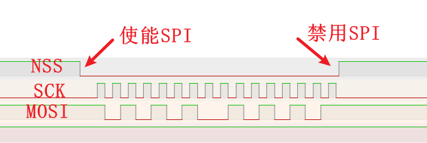
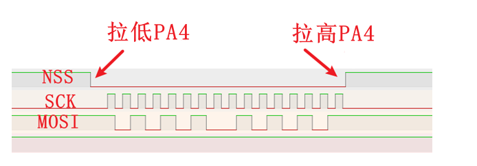

AN17000

V1.0

# 说明

串行外设接口（SPI）是一种常用的同步串行通信协议，广泛用于连接传感器、存储器、显示器等外设。SPI通信中，主设备通过片选信号NSS选择从设备进行通信。

本应用笔记重点介绍如何在SPI主机模式下使用NSS输出功能，以提高通信可靠性。

适用范围

| 适用范围 | 系列                                  |
|----------|---------------------------------------|
| 通用MCU  | CH32V103 CH32V203 CH32V307 CH32L103 … |

目录

[说明 [i](#说明)](#说明)

[目录 [ii](#_Toc207035732)](#_Toc207035732)

[表格索引 [ii](#_Toc207035733)](#_Toc207035733)

[图片索引 [ii](#_Toc207035734)](#_Toc207035734)

[第1章 使用硬件控制NSS [1](#使用硬件控制nss)](#使用硬件控制nss)

> [1.1 硬件NSS工作原理 [1](#硬件nss工作原理)](#硬件nss工作原理)
>
> [1.2 硬件NSS 配置步骤 [1](#硬件nss-配置步骤)](#硬件nss-配置步骤)
>
> [1.2.1 硬件连接 [1](#硬件连接)](#硬件连接)
>
> [1.2.1 软件代码 [1](#软件代码)](#软件代码)

[第2章 使用软件控制NSS [4](#使用软件控制nss)](#使用软件控制nss)

> [2.1 软件NSS的介绍 [4](#软件nss的介绍)](#软件nss的介绍)
>
> [2.2 软件NSS 配置步骤 [4](#软件nss-配置步骤)](#软件nss-配置步骤)
>
> [2.2.1 硬件连接 [4](#硬件连接-1)](#硬件连接-1)
>
> [2.2.1 软件代码 [4](#软件代码-1)](#软件代码-1)
>
> [2.3 软件NSS的优点 [6](#软件nss的优点)](#软件nss的优点)

[第3章 常用CH32芯片的SPI速度
[7](#常用ch32芯片的spi速度)](#常用ch32芯片的spi速度)

> [3.1 常用CH32芯片最大速度
> [7](#常用ch32芯片最大速度)](#常用ch32芯片最大速度)

[历史版本 [8](#历史版本)](#历史版本)

[声明 [9](#_Toc207035742)](#_Toc207035742)

表格索引

[表 1‑1 硬件NSS的SPI1硬件连接 [1](#_Toc239781166)](#_Toc239781166)

[表 2‑1 软件NSS的SPI1硬件连接 [4](#_Toc239781167)](#_Toc239781167)

[表 3‑1 常用CH32的SPI最大速度表 [7](#_Toc239781168)](#_Toc239781168)

图片索引

[图 1‑1 硬件NSS通信示意图 [1](#_Toc207035713)](#_Toc207035713)

[图 2‑1 软件NSS通信示意图 [4](#_Toc239781170)](#_Toc239781170)

#  使用硬件控制NSS

## 硬件NSS工作原理

当SPI配置为主机且启用了硬件NSS输出时：

- NSS引脚在SPI使能（SPE = 1）后自动拉低（有效电平，通常为低电平）。

- 每次SPI传输开始，NSS保持低电平。

- 若SPI被禁用（SPE = 0），NSS将恢复为高电平。

<figure>

<figcaption>
图 1‑1
硬件NSS通信示意图
</figcaption>
</figure>

## 硬件NSS 配置步骤

### 硬件连接

在使用SPI1时，使用PA4连接目标的NSS引脚提供功能，具体连接如表格所示。

| 引脚 |   功能    |       目标        |
|:----:|:---------:|:-----------------:|
| PA5  | SPI1_SCK  |      从机SCK      |
| PA6  | SPI1_MISO |     从机MISO      |
| PA7  | SPI1_MOSI |     从机MOSI      |
| PA4  | SPI1_NSS  | 从机NSS（低有效） |

表 ‑
硬件NSS的SPI1硬件连接

### 软件代码

配置时，先启用SPI1和GPIO；配置PA4、PA5、PA7为复用功能GPIO_Mode_AF_PP，将PA6配置
GPIO_Mode_IN_FLOATING。然后将SPI模式设置为2Lines_FullDuplex，并开启硬件NSS功能，然后开启NSS输出功能。注意此时不要使能SPI。

<table>
<colgroup>
<col style="width: 100%" />
</colgroup>
<thead>
<tr>
<th style="text-align: left;">
void SPI_FullDuplex_Init(void)

{

    GPIO_InitTypeDef GPIO_InitStructure = {0};

    SPI_InitTypeDef  SPI_InitStructure  = {0};

    RCC_APB2PeriphClockCmd(RCC_APB2Periph_GPIOA |
RCC_APB2Periph_SPI1, ENABLE);

    GPIO_InitStructure.GPIO_Pin   = GPIO_Pin_4;

    GPIO_InitStructure.GPIO_Mode  = GPIO_Mode_AF_PP;

    GPIO_InitStructure.GPIO_Speed = GPIO_Speed_50MHz;

    GPIO_Init(GPIOA, &amp;GPIO_InitStructure);

    GPIO_InitStructure.GPIO_Pin   = GPIO_Pin_5;

    GPIO_InitStructure.GPIO_Mode  = GPIO_Mode_AF_PP;

    GPIO_InitStructure.GPIO_Speed = GPIO_Speed_50MHz;

    GPIO_Init(GPIOA, &amp;GPIO_InitStructure);

    GPIO_InitStructure.GPIO_Pin  = GPIO_Pin_6;

    GPIO_InitStructure.GPIO_Mode = GPIO_Mode_IN_FLOATING;

    GPIO_Init(GPIOA, &amp;GPIO_InitStructure);

    GPIO_InitStructure.GPIO_Pin   = GPIO_Pin_7;

    GPIO_InitStructure.GPIO_Mode  = GPIO_Mode_AF_PP;

    GPIO_InitStructure.GPIO_Speed = GPIO_Speed_50MHz;

    GPIO_Init(GPIOA, &amp;GPIO_InitStructure);

    SPI_InitStructure.SPI_Direction         =
SPI_Direction_2Lines_FullDuplex;

    SPI_InitStructure.SPI_Mode              = SPI_Mode_Master;

    SPI_InitStructure.SPI_DataSize          = SPI_DataSize_16b;

    SPI_InitStructure.SPI_CPOL              = SPI_CPOL_Low;

    SPI_InitStructure.SPI_CPHA              = SPI_CPHA_1Edge;

    SPI_InitStructure.SPI_NSS               = SPI_NSS_Hard;  //
使用硬件NSS

    SPI_InitStructure.SPI_BaudRatePrescaler =
SPI_BaudRatePrescaler_64;

    SPI_InitStructure.SPI_FirstBit          = SPI_FirstBit_MSB;

    SPI_InitStructure.SPI_CRCPolynomial     = 7;

    SPI_Init(SPI1, &amp;SPI_InitStructure);

    // 开启 SPI 的NSS输出功能

    SPI_SSOutputCmd(SPI1, ENABLE);

}
</th>
</tr>
</thead>
<tbody>
</tbody>
</table>

使用时，需要先使能SPI再进行发送接收，此时硬件NSS会拉低NSS的IO，然后再开始发送；

在结束时，需要先等待SPI当前的流程完成再关闭SPI，此时硬件NSS会拉高NSS的IO，结束流程。

<table>
<colgroup>
<col style="width: 100%" />
</colgroup>
<thead>
<tr>
<th style="text-align: left;">
// 使能 SPI NSS拉低

    SPI_Cmd(SPI1, ENABLE);

    while (SPI_I2S_GetFlagStatus(SPI1, SPI_I2S_FLAG_TXE) ==
RESET)

    {

    }

    SPI_I2S_SendData(SPI1, 0xaa55);

    while (SPI_I2S_GetFlagStatus(SPI1, SPI_I2S_FLAG_RXNE) ==
RESET)

    {

    }

    SPI_I2S_ReceiveData(SPI1);

    // 禁用 SPI NSS拉高

    SPI_Cmd(SPI1, DISABLE);
</th>
</tr>
</thead>
<tbody>
</tbody>
</table>

#  使用软件控制NSS

## 软件NSS的介绍

- 在许多实际应用中，尤其是多从机系统的场景，软件控制NSS（也称为“GPIO方式控制NSS”）是更常用且灵活的选择。

<figure>

<figcaption>
图 2‑1
软件NSS通信示意图
</figcaption>
</figure>

## 软件NSS 配置步骤

### 硬件连接

在使用软件NSS的SPI1时，仍然可以使用PA4连接目标的NSS引脚提供功能，此时使用软件对NSS进行管理，具体连接如表格所示。

| 引脚 |    功能     |       目标        |
|:----:|:-----------:|:-----------------:|
| PA5  |  SPI1_SCK   |      从机SCK      |
| PA6  |  SPI1_MISO  |     从机MISO      |
| PA7  |  SPI1_MOSI  |     从机MOSI      |
| PA4  | GPIO_Output | 从机NSS（低有效） |

表 ‑
软件NSS的SPI1硬件连接

### 软件代码

配置时，先启用SPI1和GPIO；将PA4配置
GPIO_Mode_Out_PP，并设置输出高，配置PA5、PA7为复用功能GPIO_Mode_AF_PP，将PA6配置
GPIO_Mode_IN_FLOATING。然后将SPI模式设置为2Lines_FullDuplex，并使用软件NSS。

<table>
<colgroup>
<col style="width: 100%" />
</colgroup>
<thead>
<tr>
<th style="text-align: left;">
void SPI_FullDuplex_Init(void)

{

    GPIO_InitTypeDef GPIO_InitStructure = {0};

    SPI_InitTypeDef  SPI_InitStructure  = {0};

    RCC_APB2PeriphClockCmd(RCC_APB2Periph_GPIOA |
RCC_APB2Periph_SPI1, ENABLE);

    GPIO_InitStructure.GPIO_Pin   = GPIO_Pin_4;

    GPIO_InitStructure.GPIO_Mode  = GPIO_Mode_Out_PP;

    GPIO_InitStructure.GPIO_Speed = GPIO_Speed_50MHz;

GPIO_Init(GPIOA, &amp;GPIO_InitStructure);

    GPIO_SetBits(GPIOA, GPIO_Pin_4);

    GPIO_InitStructure.GPIO_Pin   = GPIO_Pin_5;

    GPIO_InitStructure.GPIO_Mode  = GPIO_Mode_AF_PP;

    GPIO_InitStructure.GPIO_Speed = GPIO_Speed_50MHz;

    GPIO_Init(GPIOA, &amp;GPIO_InitStructure);

    GPIO_InitStructure.GPIO_Pin  = GPIO_Pin_6;

    GPIO_InitStructure.GPIO_Mode = GPIO_Mode_IN_FLOATING;

    GPIO_Init(GPIOA, &amp;GPIO_InitStructure);

    GPIO_InitStructure.GPIO_Pin   = GPIO_Pin_7;

    GPIO_InitStructure.GPIO_Mode  = GPIO_Mode_AF_PP;

    GPIO_InitStructure.GPIO_Speed = GPIO_Speed_50MHz;

    GPIO_Init(GPIOA, &amp;GPIO_InitStructure);

    SPI_InitStructure.SPI_Direction         =
SPI_Direction_2Lines_FullDuplex;

    SPI_InitStructure.SPI_Mode              = SPI_Mode_Master;

    SPI_InitStructure.SPI_DataSize          = SPI_DataSize_16b;

    SPI_InitStructure.SPI_CPOL              = SPI_CPOL_Low;

    SPI_InitStructure.SPI_CPHA              = SPI_CPHA_1Edge;

    SPI_InitStructure.SPI_NSS               = SPI_NSS_Soft;  //
使用软件NSS

    SPI_InitStructure.SPI_BaudRatePrescaler =
SPI_BaudRatePrescaler_64;

    SPI_InitStructure.SPI_FirstBit          = SPI_FirstBit_MSB;

    SPI_InitStructure.SPI_CRCPolynomial     = 7;

    SPI_Init(SPI1, &amp;SPI_InitStructure);

}
</th>
</tr>
</thead>
<tbody>
</tbody>
</table>

使用时，需要先拉低PA4，此时NSS被拉低，然后再开始发送；

在结束时，需要先等待SPI当前的流程完成再拉高PA4，此时NSS被拉高，结束流程。

<table>
<colgroup>
<col style="width: 100%" />
</colgroup>
<thead>
<tr>
<th style="text-align: left;">
// 拉低PA4 NSS拉低

    GPIO_ResetBits(GPIOA, GPIO_Pin_4);

    while (SPI_I2S_GetFlagStatus(SPI1, SPI_I2S_FLAG_TXE) ==
RESET)

    {

    }

    SPI_I2S_SendData(SPI1, 0xaa55);

    while (SPI_I2S_GetFlagStatus(SPI1, SPI_I2S_FLAG_RXNE) ==
RESET)

    {

    }

    SPI_I2S_ReceiveData(SPI1);

    // 拉高PA4 NSS拉高

GPIO_ResetBits(GPIOA, GPIO_Pin_4);
</th>
</tr>
</thead>
<tbody>
</tbody>
</table>

## 软件NSS的优点

软件NSS相对于硬件NSS有一些优点：

- 支持多从机，可通过多个GPIO分别控制不同从设备，轻松扩展系统。

- 时序完全可控，可在任意时刻拉低/拉高NSS，满足特殊协议要求（如需NSS在整个事务期间保持低电平）。

- 兼容性好，适用于所有SPI从设备，无论其对NSS时序是否有特殊要求。

- 无硬件限制，不依赖特定NSS引脚，可使用任意GPIO，布线更自由。

#  常用CH32芯片的SPI速度

## 常用CH32芯片最大速度

一般CH32芯片的SPI设计最大速度是对应的总线频率的一半，详细见下表。

| 芯片系列 | 最大主频 | 最大SPI速度 |
|:--------:|:--------:|:-----------:|
| CH32V317 |  144MHz  |    72MHz    |
| CH32V30x |  144MHz  |    72MHz    |
| CH32V203 |  144MHz  |    72MHz    |
| CH32V205 |  144MHz  |    72MHz    |
| CH32V208 |  144MHz  |    72MHz    |
| CH32V208 |  144MHz  |    72MHz    |
| CH32V103 |  72MHz   |    36MHz    |
| CH32V00x |  48MHz   |    24MHz    |
| CH32X035 |  48MHz   |    24MHz    |
| CH32L103 |  96MHz   |    48MHz    |
| CH32M030 |  72MHz   |    36MHz    |

表 3‑
常用CH32的SPI最大速度表

# 历史版本

更新内容

| 日期       | 版本 | 变更内容 |
|------------|------|----------|
| 2025/11/17 | V1.0 | 初版发行 |

声明

本手册仅供参考。作者在不另行通知的情况下，可随时进行修改。
