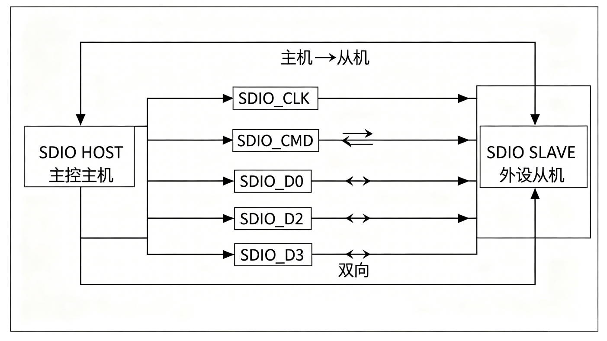

<table>
<colgroup>
<col style="width: 49%" />
<col style="width: 50%" />
</colgroup>
<thead>
<tr>
<th rowspan="2"></th>
<th>AN21000</th>
</tr>
<tr>
<th>V1.0</th>
</tr>
</thead>
<tbody>
</tbody>
</table>

说明

本应用笔记介绍了如何使用CH32系列芯片的SDIO接口将其配置为从机设备，以响应外部SDIO主机的命令并进行数据传输。为此，文中以CH32V407为例，首先概述了SDIO控制器特性，然后提供了一个完整的SDIO从模式设计实例，包括硬件连接图、寄存器配置方法、命令的响应机制以及数据收发流程。

**适用范围**

| 适用范围 | 系列                       |
|----------|----------------------------|
| 通用MCU  | CH32V307 CH32H417 CH32V407 |

目录

[说明 [1](#_Toc239509876)](#_Toc239509876)

[目录 [2](#_Toc239509877)](#_Toc239509877)

[表格索引 [2](#_Toc239509878)](#_Toc239509878)

[图片索引 [2](#_Toc239509879)](#_Toc239509879)

[第1章 CH32系列SDIO接口概述
[1](#ch32系列sdio接口概述)](#ch32系列sdio接口概述)

[1.1 概述 [1](#概述)](#概述)

[第2章 SDIO从模式设计实例 [2](#sdio从模式设计实例)](#sdio从模式设计实例)

[2.1 硬件连接 [2](#硬件连接)](#硬件连接)

[2.1.1 引脚连接 [2](#引脚连接)](#引脚连接)

[2.2 寄存器配置 [2](#寄存器配置)](#寄存器配置)

[2.2.1 主机配置 [2](#主机配置)](#主机配置)

[2.2.2 从机配置 [5](#从机配置)](#从机配置)

[第3章 测试与验证 [8](#测试与验证)](#测试与验证)

[历史版本 [9](#_Toc239509889)](#_Toc239509889)

[声明 [10](#_Toc239509890)](#_Toc239509890)

表格索引

[信号引脚分配 [2](#_Toc239509839)](#_Toc239509839)

图片索引

[SDIO主从通信示意图 [1](#_Toc239509840)](#_Toc239509840)

# CH32系列SDIO接口概述

## 概述

SDIO接口是指微控制器上一个为操作SD卡等外部存储卡或其他设备而设计的通信接口，是微控制器的一个外设。微控制器的SDIO直接挂载在HB总线上，由HCLK直接提供时钟，能实现较高的通讯速度，微控制器的SDIO用作SDIO主机，被控制的设备也被统称SDIO设备或者SDIO
的从机，本文章主要就是指导用户如何将MCU配置成SDIO的从机设备，从而和主机设备通信，完成数据快速传输。

CH32系列作为青稞RISC-V生态中的工业级互联型MCU，其SDIO从机控制器并非传统的数据透传通道，而是构建通信系统的关键硬件加速单元。在大数据量通信的嵌入式系统设计中，主机处理器（如应用级ARM
SoC、另一颗RISC-V
MCU或FPGA逻辑阵列）通常需要与CH32系列之间以高吞吐量、低延迟、零CPU干预的方式交换数据包与实时控制指令，直接在寄存器层与总线级完成数据搬运。配合CH32系列的DMA控制器，提供的多维度数据传输能力，从机控制器可通过DMA和中断协同机制，在无需内核主动参与的情况下，完成从数据接收、搬移到回复的全链路闭环，将物理层传输效率推向接口极限。其硬件设计严格遵循SDIO规范
，所以可以和多种符合协议的主机设备进行通信。

<figure>

<figcaption>
图 1‑1 SDIO主从通信示意图
</figcaption>
</figure>

SDIO有1位、4位和8位三种数据线宽度可选

# SDIO从模式设计实例

## 硬件连接

SDIO接口最多需要10根信号线组成（8位模式下使用DATA0-
DATA7数据线，4位模式下使用DATA0-
DATA3数据线，1位模式仅使用DATA0），本设计举例4位模式。

### 引脚连接

实例中，将两个CH32V407进行连接，一个做主机，一个做从机，进行命令和数据的通信。

| 信号名称 | 方向 | 描述                 | CH32V407引脚 |
|----------|------|----------------------|--------------|
| SDIO_CLK | 输入 | 时钟信号，由主机提供 | PC12         |
| SDIO_CMD | 双向 | 命令/响应线          | PD2          |
| SDIO_D0  | 双向 | 数据线0              | PC8          |
| SDIO_D1  | 双向 | 数据线1              | PC9          |
| SDIO_D2  | 双向 | 数据线2              | PC10         |
| SDIO_D3  | 双向 | 数据线3              | PC11         |

表 2‑1信号引脚分配

硬件连接要点：

1.  上拉电阻：CMD和DATA信号线在空闲时应保持高电平，通常需要在主机制板端配置10kΩ～50kΩ的上拉电阻，以确保总线空闲时信号线状态稳定。

2.  电平匹配：CH32V407的I/O电平以VDDIO电源域为基准。若主机I/O电压与CH32V407
    VDDIO（通常为3.3V）不一致，必须增加电平转换电路。

3.  信号完整性：SDIO接口在4线模式下可达80MHz传输速率，高速通信时建议进行阻抗匹配设计，避免使用杜邦线连接，推荐采用PCB短距直连方式。

## 寄存器配置

主机和从机分别进行配置。SDIO总线遵循“主机发起、从机响应”的通信原则，所有数据传输操作均由主机通过发送命令启动。

### 主机配置

主机配置如下：包括初始化IO口，时钟，数据位宽，采样边沿等：

    SD_Init( void )
    {    
    GPIO_InitTypeDef  GPIO_InitStructure;
        SD_Error errorstatus = SD_OK;

        RCC_PB2PeriphClockCmd(RCC_PB2Periph_GPIOC | RCC_PB2Periph_GPIOD, ENABLE );
        RCC_HBPeriphClockCmd( RCC_HBPeriph_SDIO, ENABLE );
        RCC_PB2PeriphClockCmd( RCC_PB2Periph_AFIO, ENABLE );

        GPIO_InitStructure.GPIO_Pin =  GPIO_Pin_10 | GPIO_Pin_11 | GPIO_Pin_12;
        GPIO_InitStructure.GPIO_Mode = GPIO_Mode_AF_PP;
        GPIO_InitStructure.GPIO_Speed = GPIO_Speed_50MHz;
        GPIO_Init( GPIOC, &GPIO_InitStructure );

     

        GPIO_InitStructure.GPIO_Pin =   GPIO_Pin_8 | GPIO_Pin_9 ;
        GPIO_InitStructure.GPIO_Mode = GPIO_Mode_AF_PP;
        GPIO_InitStructure.GPIO_Speed = GPIO_Speed_50MHz;
        GPIO_Init( GPIOC, &GPIO_InitStructure );

        GPIO_InitStructure.GPIO_Pin = GPIO_Pin_2;
        GPIO_InitStructure.GPIO_Mode = GPIO_Mode_AF_PP;
        GPIO_InitStructure.GPIO_Speed = GPIO_Speed_50MHz;
        GPIO_Init( GPIOD, &GPIO_InitStructure );

        SDIO_DeInit();

        errorstatus = SD_PowerON();

        return errorstatus;
     }

    SD_Error SD_PowerON( void )
    {

        SD_Error errorstatus = SD_OK;
        SDIO_InitStructure.SDIO_ClockDiv = 0;   //设置分频系数 SDIOCLK=HCLK/（ClockDiv+2）
        SDIO_InitStructure.SDIO_ClockEdge = SDIO_ClockEdge_Falling; //设置采样边沿
        SDIO_InitStructure.SDIO_ClockBypass = SDIO_ClockBypass_Disable; //是否开启时钟旁路
        SDIO_InitStructure.SDIO_ClockPowerSave = SDIO_ClockPowerSave_Disable;//空闲时时钟关闭使能
        SDIO_InitStructure.SDIO_BusWide = SDIO_BusWide_4b;//数据位宽
        SDIO_InitStructure.SDIO_HardwareFlowControl = SDIO_HardwareFlowControl_Disable;//硬件流
        SDIO_Init( &SDIO_InitStructure );

        SDIO_SetPowerState( SDIO_PowerState_ON );//设置为上电状态

        SDIO_ClockCmd(Enable ); //开启时钟

    return( errorstatus );
    }

初始化完成后，主机开始发送CMD，提示从机已经做好准备，等待从机回复。从机只支持R1类型的应答：

    while ((SDIO->STA&SDIO_FLAG_CMDREND)==0)
    {
     SDIO_CmdInitStructure.SDIO_Argument = 0x6; //发送的ARG
    SDIO_CmdInitStructure.SDIO_CmdIndex = 0x05;//发送的CMD
     SDIO_CmdInitStructure.SDIO_Response = SDIO_Response_Short; //等待响应类型
     SDIO_CmdInitStructure.SDIO_Wait = SDIO_Wait_No;
     SDIO_CmdInitStructure.SDIO_CPSM = SDIO_CPSM_Enable;//使能发送
     SDIO_SendCommand( &SDIO_CmdInitStructure );
    }

当状态机改变，主机状态变为CMDREND：，已经收到响应，CRC检验成功；主机开始发送数据

    //DMA 配置函数
     void SD_DMA_Config( u32 *mbuf, u32 bufsize, u32 DMA_DIR )
    {
        DMA_InitTypeDef DMA_InitStructure;

        RCC_HBPeriphClockCmd( RCC_HBPeriph_DMA2, ENABLE );

        DMA_DeInit( DMA2_Channel4 );
        DMA_Cmd( DMA2_Channel4, DISABLE );

        DMA_InitStructure.DMA_PeripheralBaseAddr = ( u32 )&SDIO->FIFO;
        DMA_InitStructure.DMA_MemoryBaseAddr = ( u32 )mbuf;
        DMA_InitStructure.DMA_DIR = DMA_DIR;
        DMA_InitStructure.DMA_BufferSize = bufsize/4 ;
        DMA_InitStructure.DMA_PeripheralInc = DMA_PeripheralInc_Disable;
        DMA_InitStructure.DMA_MemoryInc = DMA_MemoryInc_Enable;
        DMA_InitStructure.DMA_PeripheralDataSize = DMA_PeripheralDataSize_Word;
        DMA_InitStructure.DMA_MemoryDataSize = DMA_MemoryDataSize_Word;
        DMA_InitStructure.DMA_Mode = DMA_Mode_Normal;
        DMA_InitStructure.DMA_Priority = DMA_Priority_High;
        DMA_InitStructure.DMA_M2M = DMA_M2M_Disable;
        DMA_Init( DMA2_Channel4, &DMA_InitStructure );
    }
    //主机发送函数
    Void HOST_Send()
    {
    SD_DMA_Config(( u32 * )buf,512,DMA_DIR_PeripheralDST);//调用DMA配置传参
        SDIO_DataInitStructure.SDIO_DataBlockSize = 9 << 4; ; //传输数据块长度：512B
        SDIO_DataInitStructure.SDIO_DataLength = 512 ;
        SDIO_DataInitStructure.SDIO_DataTimeOut = SD_DATATIMEOUT ;//设置超时时间
        SDIO_DataInitStructure.SDIO_DPSM = SDIO_DPSM_Enable;
        SDIO_DataInitStructure.SDIO_TransferDir = SDIO_TransferDir_ToCard; //传输方向
        SDIO_DataInitStructure.SDIO_TransferMode = SDIO_TransferMode_Block;//块模式传输
    SDIO_DataConfig( &SDIO_DataInitStructure );

        SDIO_DMACmd( ENABLE );//使能DMA
        DMA_Cmd( DMA2_Channel4, ENABLE );
        while( ( ( DMA2->INTFR & 0X2000 ) == RESET ) ) //等待DMA传输完成标志
        {
        }
        while(((SDIO->STA&SDIO_FLAG_DBCKEND)==0)) //等待已经发送或者接受了数据块且CRC校验通过的标志。
        {
        }
        SDIO->DCTRL&=~(1<<0); //关闭SDIO发送
        SDIO_DMACmd( DISABLE );
        DMA_Cmd( DMA2_Channel4, DISABLE );//关闭DMA
        printf("data send OK!!!\r\n");
    SDIO->ICR=0xFFFFFF; //清除SDIO状态位
    }

### 从机配置

从机配置如下：包括初始化IO口，数据位宽等

<table style="width:100%;">
<colgroup>
<col style="width: 99%" />
</colgroup>
<thead>
<tr>
<th><pre><code>SD_Init( void )
{    
GPIO_InitTypeDef  GPIO_InitStructure;
    SD_Error errorstatus = SD_OK;
&#10;    RCC_PB2PeriphClockCmd(RCC_PB2Periph_GPIOC | RCC_PB2Periph_GPIOD, ENABLE );
    RCC_HBPeriphClockCmd( RCC_HBPeriph_SDIO, ENABLE );
    RCC_PB2PeriphClockCmd( RCC_PB2Periph_AFIO, ENABLE );
&#10;    GPIO_InitStructure.GPIO_Pin =  GPIO_Pin_10 | GPIO_Pin_11 | GPIO_Pin_12;
    GPIO_InitStructure.GPIO_Mode = GPIO_Mode_AF_PP;
    GPIO_InitStructure.GPIO_Speed = GPIO_Speed_50MHz;
    GPIO_Init( GPIOC, &amp;GPIO_InitStructure );
&#10; 
&#10;    GPIO_InitStructure.GPIO_Pin =   GPIO_Pin_8 | GPIO_Pin_9 ;
    GPIO_InitStructure.GPIO_Mode = GPIO_Mode_AF_PP;
    GPIO_InitStructure.GPIO_Speed = GPIO_Speed_50MHz;
    GPIO_Init( GPIOC, &amp;GPIO_InitStructure );
&#10;
    GPIO_InitStructure.GPIO_Pin = GPIO_Pin_2;
    GPIO_InitStructure.GPIO_Mode = GPIO_Mode_AF_PP;
    GPIO_InitStructure.GPIO_Speed = GPIO_Speed_50MHz;
    GPIO_Init( GPIOD, &amp;GPIO_InitStructure );
&#10;    SDIO_DeInit();
&#10;    errorstatus = SD_PowerON();
&#10;    return errorstatus;
 }
&#10;SD_Error SD_PowerON( void )
{
&#10;    SD_Error errorstatus = SD_OK;
    SDIO_InitStructure.SDIO_ClockDiv = 0;   //设置分频系数 SDIOCLK=HCLK/（ClockDiv+2）
    SDIO_InitStructure.SDIO_ClockEdge = SDIO_ClockEdge_Falling; //设置采样边沿
    SDIO_InitStructure.SDIO_ClockBypass = SDIO_ClockBypass_Disable; //是否开启时钟旁路
    SDIO_InitStructure.SDIO_ClockPowerSave = SDIO_ClockPowerSave_Disable;//空闲时时钟关闭使能
    SDIO_InitStructure.SDIO_BusWide = SDIO_BusWide_4b;//数据位宽
    SDIO_InitStructure.SDIO_HardwareFlowControl = SDIO_HardwareFlowControl_Disable;//硬件流
    SDIO_Init( &amp;SDIO_InitStructure );
&#10;    SDIO_SetPowerState( SDIO_PowerState_ON );//设置为上电状态
&#10;SDIO_ClockCmd(Enable ); //开启时钟
&#10;SDIO-&gt;DCTRL2|=(1&lt;&lt;24);////SLV 模式开启
    return( errorstatus );
}</code></pre></th>
</tr>
</thead>
<tbody>
<tr>
<td><pre><code></code></pre></td>
</tr>
</tbody>
</table>

初始化完成后，从机配置CMD 的R1回复，方便在收到主机的CMD
后自动回复，以提示主机已经做好准备，并进入等待主机发送CMD状态。

    SDIO->ARG=0x13;///////////R1回复主机0x13;
    while ((SDIO->STA&SDIO_FLAG_CMDSENT)==0) 
    {
    }

当状态机改变，从机状态变为CMDREND：，已经收到响应；从机开始接收数据。

    //DMA 配置函数
    void SD_DMA_Config( u32 *mbuf, u32 bufsize, u32 DMA_DIR )
    {
        DMA_InitTypeDef DMA_InitStructure;

        RCC_HBPeriphClockCmd( RCC_HBPeriph_DMA2, ENABLE );

        DMA_DeInit( DMA2_Channel4 );
        DMA_Cmd( DMA2_Channel4, DISABLE );

        DMA_InitStructure.DMA_PeripheralBaseAddr = ( u32 )&SDIO->FIFO;
        DMA_InitStructure.DMA_MemoryBaseAddr = ( u32 )mbuf;
        DMA_InitStructure.DMA_DIR = DMA_DIR;
        DMA_InitStructure.DMA_BufferSize = bufsize/4 ;
        DMA_InitStructure.DMA_PeripheralInc = DMA_PeripheralInc_Disable;
        DMA_InitStructure.DMA_MemoryInc = DMA_MemoryInc_Enable;
        DMA_InitStructure.DMA_PeripheralDataSize = DMA_PeripheralDataSize_Word;
        DMA_InitStructure.DMA_MemoryDataSize = DMA_MemoryDataSize_Word;
        DMA_InitStructure.DMA_Mode = DMA_Mode_Normal;
        DMA_InitStructure.DMA_Priority = DMA_Priority_High;
        DMA_InitStructure.DMA_M2M = DMA_M2M_Disable;
        DMA_Init( DMA2_Channel4, &DMA_InitStructure );
    } 
    //主机发送函数
    Void SLV_Rec()
    {
        SDIO_DataInitStructure.SDIO_DataBlockSize = 9 << 4; ; //传输数据块长度：512B
        SDIO_DataInitStructure.SDIO_DataLength = 512 ;
        SDIO_DataInitStructure.SDIO_DataTimeOut = SD_DATATIMEOUT ;
        SDIO_DataInitStructure.SDIO_DPSM = SDIO_DPSM_Enable;
        SDIO_DataInitStructure.SDIO_TransferDir = SDIO_TransferDir_ToSDIO; //传输方向为接收
        SDIO_DataInitStructure.SDIO_TransferMode = SDIO_TransferMode_Block;//块模式传输
    SDIO_DataConfig( &SDIO_DataInitStructure );

    SD_DMA_Config(( u32 * )Readbuf,512,DMA_DIR_PeripheralSRC);

        SDIO_DMACmd( ENABLE );//使能DMA
        DMA_Cmd( DMA2_Channel4, ENABLE );
        while( ( ( DMA2->INTFR & 0X2000 ) == RESET ) ) //等待DMA传输完成标志
        {
        }
        while(((SDIO->STA&SDIO_FLAG_DBCKEND)==0)) //等待已经发送或者接受了数据块且CRC校验通过的标志。
        {
        }
        SDIO->DCTRL&=~(1<<0); //关闭SDIO接收
        SDIO_DMACmd( DISABLE );
        DMA_Cmd( DMA2_Channel4, DISABLE );//关闭DMA
        printf("data send OK!!!\r\n");
    SDIO->ICR=0xFFFFFF; //清除SDIO状态位
    }

完成上述配置后，可以完成一轮的主机发送，从机接收的操作。

# 测试与验证

完成上述配置后，建议按照以下步骤分阶段验证SDIO从机功能：

1\.
硬件连通性测试：使用示波器测量CMD线和DATA线上是否有信号波形，确认主机与从机的物理连接正常。

2\.
命令识别测试：从机在检测到SDIO_FLAG_CMDSENT后，打印接收到的命令参数会放在RESP1，接收到的命令索引会放在RESP2，查看CMD发送是否正确，或者使用逻辑分析仪进行抓取解码。

3\.
批量数据收发测试：从主机端发送，从机通过串口打印接收到的数据内容，验证接收功能。

查看主机和从机的STA，是否有异常报错。

历史版本

| 日期      | 版本 | 变更内容 |
|-----------|------|----------|
| 2026/6/25 | V1.0 | 初版发行 |

声明

本手册仅供参考。作者在不另行通知的情况下，可随时进行修改。
