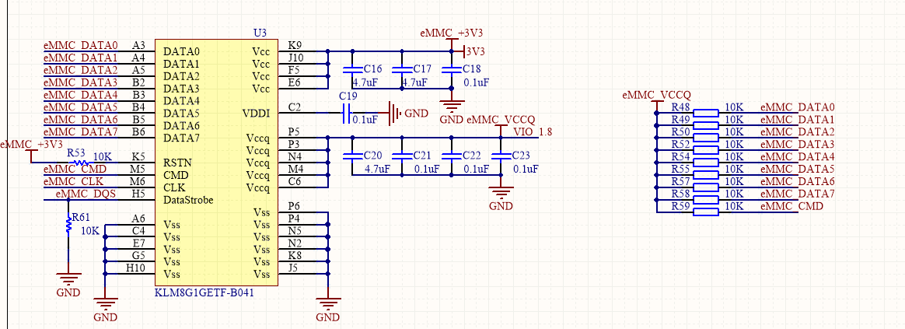
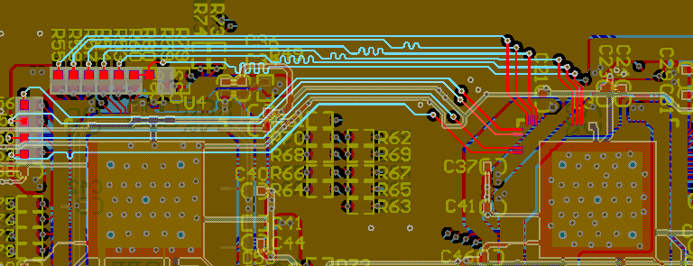
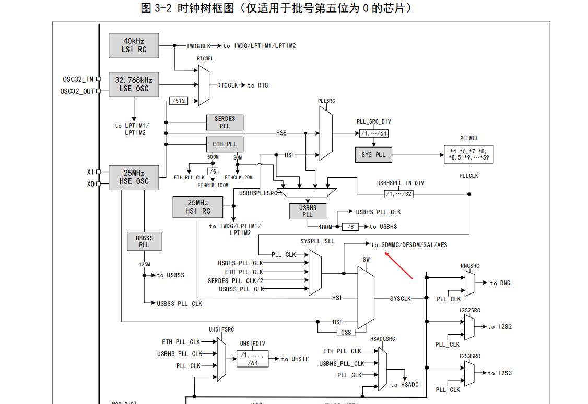
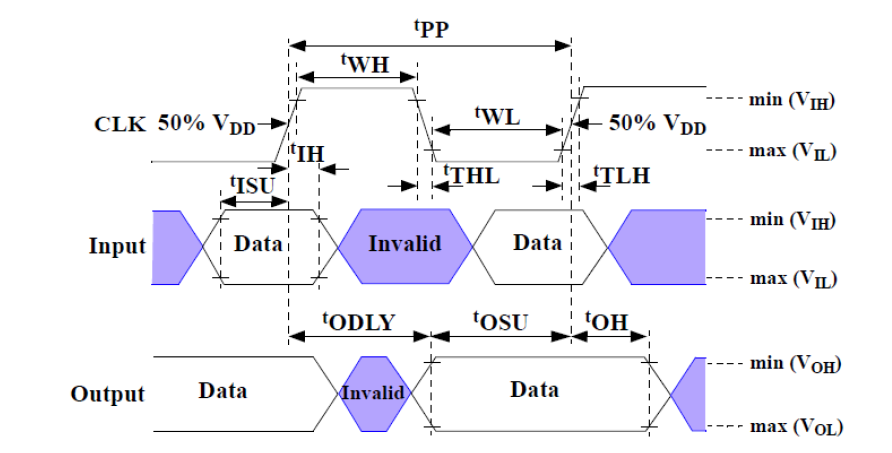
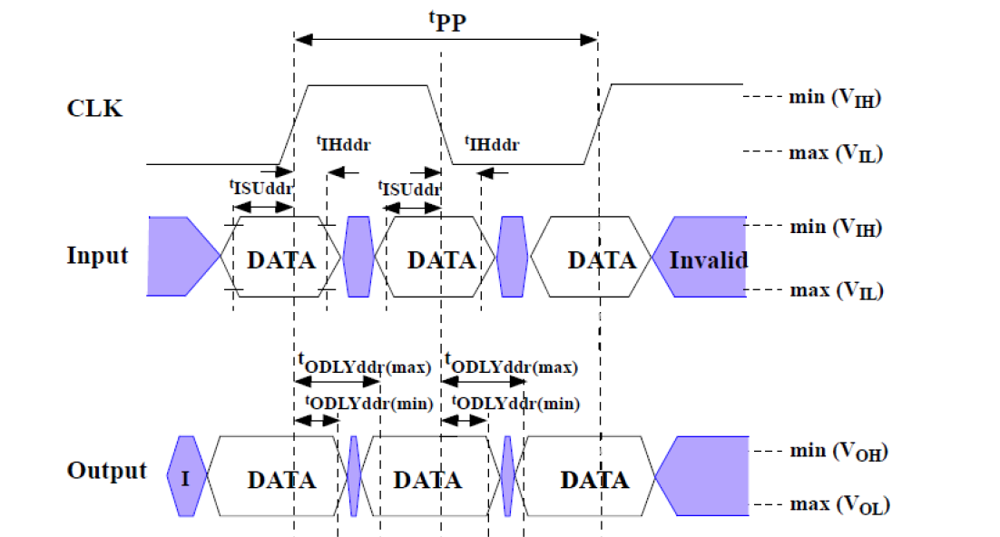

AN22000

V1.0

***

说明

本应用笔记详细介绍了如何使用沁恒微电子（WCH）的高性能RISC-V微控制器CH32H417的高速SDMMC接口，来驱动嵌入式多媒体卡（eMMC）和从模式通信。eMMC集成了NAND Flash和控制器，并采用标准MMC接口，提供了高集成度、高可靠性和简化的软件驱动方式，是嵌入式大容量存储的首选方案之一。CH32H417的SDMMC主机控制器完全兼容eMMC协议，支持高达200MHz的时钟频率，可实现高速的数据读写。本文将围绕SDMMC接口介绍、接口硬件设计、协议基础和软件驱动配置进行详细说明。

适用范围

| 适用范围 | 系列              |
|----------|-------------------|
| 通用MCU  | CH32H417/CH32H416 |

目录

[说明](#_Toc209601082)

[目录](#_Toc209601083)

[表格索引](#_Toc209601084)

[图片索引](#_Toc209601085)

[第1章 简介](#简介)

[1.1 CH32H417芯片简介](#ch32h417芯片简介)

[1.1.1 SDMMC接口概述](#sdmmc接口概述)

[1.1.2 SDMMC接口特性](#sdmmc接口特性)

[1.2 SD、SDMMC与eMMC概念](#sdsdmmc与emmc概念)

[1.3 协议简介](#协议简介)

[1.4 常用术语解释](#常用术语解释)

[第2章 硬件设计与接口规范](#硬件设计与接口规范)

[2.1 接口引脚定义](#接口引脚定义)

[2.2 核心电路设计](#核心电路设计)

[2.3 PCB布局布线指南](#pcb布局布线指南)

[第3章 协议基础](#协议基础)

[3.1 命令格式](#命令格式)

[3.2 响应格式](#响应格式)

[3.3 数据包格式](#数据包格式)

[第4章 软件驱动开发](#软件驱动开发)

[4.1 初始化配置](#初始化配置)

[4.2 命令配置](#命令配置)

[4.3 数据配置](#数据配置)

[4.3.1 单缓冲模式](#单缓冲模式)

[4.3.2 双缓冲模式](#双缓冲模式)

[4.4 时序调整](#时序调整)

[4.5 中断配置](#中断配置)

[第5章 eMMC驱动流程实例](#emmc驱动流程实例)

[5.1 High Speed SDR配置流程](#high-speed-sdr配置流程)

[5.2 High Speed DDR配置流程](#high-speed-ddr配置流程)

[5.3 HS200配置流程](#hs200配置流程)

[5.4 HS400配置流程](#hs400配置流程)

[历史版本](#_Toc209601114)

[声明](#_Toc209601115)

表格索引

[表1-1 SDMMC接口特性](#_Toc208567457)

[表2-1 SDMMC接口定义](#_Toc208567460)

[表2-2 SDMMC映射引脚](#_Toc208567461)

[表3-1命令格式](#_Toc208567462)

[表3-2响应格式](#_Toc208567463)

[表4-1引脚初始化配置](#_Toc208567464)

[表5-1 eMMC模式](#_Toc209601069)

[表5-2 CID信息](#_Toc209601070)

图片索引

[图2-1 eMMC卡接线图](#_Toc209969544)

[图2-2主从通信等长布线PCB图](#_Toc209969545)

[图4-1 SDMMC时钟树](#_Toc208567851)

[图4-2 SDR模式时序图](#_Toc208567852)

[图4-3 DDR模式时序图](#_Toc208567853)

# 简介

## CH32H417芯片简介

CH32H417是基于青稞RISC-V5F和RISC-V3F双内核设计的互联型通用微控制器。它集成了一个完整的SDMMC主机控制器（兼容SD/MMC/SDIO协议），该控制器支持eMMC设备，可配置工作在1位、4位或8位总线模式下，最高通信时钟可达200MHz，为大数据量的存储提供了硬件基础。

### SDMMC接口概述

系统提供1组SDMMC控制器主机/从机接口，传输时钟可达200MHz，支持双沿采样，支持1/4/8线通讯模式，可外接SD/TF卡、eMMC卡等器件。应用程序代码可灵活设置数据收发的各种命令、应答包、有效数据包的模式和长度，双缓冲长度切换界限等参数。

SDMMC接口的主要特性如下：

-   支持SD物理层1.0、2.0规范，支持SD3.0规范的UHS-I SDR50、DDR50和SDR104模式
-   符合eMMC卡4.4和4.5.1规范；支持eMMC卡5.0规范的HS200，HS400
-   通讯模式支持单线、四线、八线模式
-   最高通讯时钟可达200MHz
-   支持双沿采样
-   灵活可设置的数据包长度、命令格式、应答状态
-   提供硬件自动在数据块间隔时停止时钟功能
-   支持SD卡、SDIO卡、eMMC卡等符合SD接口协议的设备
-   支持SDIO从机接口，可以完成支持SDIO主机接口的芯片的数据交换
-   DMA双缓冲功能

### SDMMC接口特性

表1-1 SDMMC接口特性

| 符号                                | 参数                     | 条件                  | 最小值 | 最大值 | 单位 |    |
|-------------------------------------|--------------------------|-----------------------|--------|--------|------|----|
| fCK/tCK                             | 数据传输模式下的时钟频率 | CL≤30pF               |        | 100    | MHz  |    |
|                                     |                          | CL≤10pF，VDD18 = 1.8V |        | 200    | MHz  |    |
| tW（CKL）                           | 时钟低电平时间           | CL≤10pF               | 2.2    |        | ns   |    |
| tW（CKH）                           | 时钟高电平时间           | CL≤10pF               | 2,2    |        |      |    |
| tr（CK）                            | 上升时间                 | CL≤10pF               |        | 1.2    |      |    |
| tf（CK）                            | 下降时间                 | CL≤10pF               |        | 1.2    |      |    |
| CMD/DAT输入（参考CK）               |                          |                       |        |        |      |    |
| tISU                                | 输入建立时间             | CL≤10pF               | 0.4    |        | ns   |    |
| tIH                                 | 输入保持时间             | CL≤10pF               | 0.4    |        |      |    |
| 在高速模式下，CMD/DAT输出（参考CK） |                          |                       |        |        |      |    |
| tOV                                 | 输出有效时间             | CL≤10pF               | 主模式 |        | 1.2  | ns |
|                                     |                          |                       | 从模式 |        | 6    |    |
| tOH                                 | 输出保持时间             | CL≤10pF               | 4.5    |        |      |    |
| 在默认模式下，CMD/DAT输出（参考CK） |                          |                       |        |        |      |    |
| tOVD                                | 输出有效默认时间         | CL≤10pF               | 主模式 |        | 1.2  | ns |
|                                     |                          |                       | 从模式 |        | 6    |    |
| tOHD                                | 输出保持默认时间         | CL≤10pF               | 4.5    |        |      |    |

## SD、SDMMC与eMMC概念

-   **SD Card (Secure Digital Memory Card)**：一种遵循SD标准，主要用于存储数据的闪存卡。协议主要包含物理层（Physical Layer）、文件系统层（File System Layer）和应用层（Application Layer）。
-   **SDMMC (SD/EMMC Controller)**：在SD标准基础上扩展的接口标准，允许设备在共享SD接口的基础上实现额外功能。常见的SDMMC接口设备包括Wi-Fi模块、蓝牙模块、GPS模块等。SDMMC设备在初始化后，主机可以通过特定的I/O命令与其功能单元（Function）进行通信，而非简单的块读写。
-   **eMMC (embedded MultiMediaCard)**：将MMC接口、NAND Flash及主控制器集成在一个BGA封装内的嵌入式存储解决方案。它对主机隐藏了NAND管理的复杂性，提供了与SD卡类似的块设备接口，但引脚定义和部分高级特性存在差异。

## 协议简介

SD协议采用主从式、命令-响应型的串行通信方式。

-   **总线拓扑**：

    支持1个主机（Host）和多个从设备（Card）的连接。通过设备地址（RCA）进行寻址。

-   **通信通道**：

    CMD线：用于双向传输命令和响应。该信号是一个双向命令通道，用于设备的初始化和命令传输。CMD信号有两种工作模式：初始化模式为开漏模式，快速命令传输推挽模式。命令从主机控制器发送到从设备，响应从设备发送到主机。

DAT线：用于双向传输数据。支持1-bit、4-bit、8-bit模式。

CLK线：由主机产生，为所有传输提供同步时钟。该信号每个周期在CMD线上进行一位传输，在所有DAT线上进行一位(1x)或两位(2x)传输。频率可以在零到最大时钟频率之间变化。

-   **数据传输模式**：

    分为单数据速率（SDR） 和双数据速率（DDR）

## 常用术语解释

-   **RCA (Relative Card Address)：**主机在初始化过程中分配给卡的相对地址，用于后续寻址。
-   **CID (Card Identification Number)：**卡的唯一标识符，包含制造商、序列号等信息。
-   **CSD (Card Specific Data)：**卡的特性数据，包含容量、块大小、支持的最大传输速度等信息。
-   **OCR (Operating Conditions Register)：**操作条件寄存器，包含卡的电压范围和支持的模式信息。
-   **Block (块)：**eMMC卡读写的最小逻辑单位，通常为512字节

# 硬件设计与接口规范

## 接口引脚定义

SDMMC接口共有11根接口线，一根时钟线（CLK），一根命令线（CMD），八根数据线（DAT[7:0]）和一根数据选通信号线（STR），每根线的类型和描述如下表。

表2-1 SDMMC接口定义

| SD/EMMC引脚 | 类型                 | 描述                                 |
|-------------|----------------------|--------------------------------------|
| CLK         | 主机输出<br>从机输入 | 同步时钟信号                         |
| CMD         |  双向，开漏          | 命令/响应信号线，**必须上拉**。      |
| DAT[7:0]    |  双向，开漏          | 数据线。至少需要DAT0。**必须上拉**。 |
| STR         | 从机输出             | 返回时钟信号，用于HS400模式          |
| VDD         | 电源                 | 核心供电电压（3.3V典型值）           |
| VCCQ        | 电源                 | I/O供电电压（3.3V-\>1.8V）           |
| VSS         | 电源                 | 地                                   |
| RST         | 输入                 | 硬件复位，默认上拉，低电平复位       |

注：STR信号由设备生成，用于HS400模式下的输出。该信号的频率跟随CLK的频率。对于数据输出，该信号的每个周期都会在数据上传输两个位(2x)——一个位用于正边沿，另一个位用于负边沿。对于CRC状态响应输出和CMD响应输出仅在HS400增强型脉冲模式下启用），CRC状态和CMD响应仅在正边沿被锁存，而在负边沿不关心。

## 核心电路设计

上拉电阻：CMD和所有DAT线必须使用电阻上拉到VDD。这是协议强制要求的，用于确保在总线空闲时处于高电平状态，并提供稳定的直流偏置。即使MCU内部有上拉，也强烈建议使用更可靠的外部上拉电阻。

电源电路：提供干净、稳定的电源。电源引脚必须并联多个电容进行去耦。

图2-1 eMMC卡接线图



CH32H417QEU6提供了三组SDMMC映射引脚，根据封装可以选择对应的组，CH32H417对应的SDMMC引脚如下表：

表2-2 SDMMC映射引脚

| SDMMC功能              | SDMMC_RM=00<br>默认映射引脚 | SDMMC_RM=01<br>重映射引脚 | SDMMC_RM=1x<br>重映射引脚 |
|------------------------|-----------------------------|---------------------------|---------------------------|
| SDMMC_STS/SDMMC_CMD    | PD2                         | PD12                      | PC10                      |
| SDMMC_SDCK/SDMMC_SLVCK | PC12                        | PD11                      | PC12                      |
| SDMMC_STR              | PD3                         | PD10                      | PC11                      |
| SDMMC_D0               | PC8                         | PB13                      | PD0                       |
| SDMMC_D1               | PC9                         | PC9                       | PD1                       |
| SDMMC_D2               | PC10                        | PB10                      | PD2                       |
| SDMMC_D3               | PC11                        | PB11                      | PD3                       |
| SDMMC_D4               | PA14                        | PA14                      | PD4                       |
| SDMMC_D5               | PA15                        | PA15                      | PD5                       |
| SDMMC_D6               | PC6                         | PC6                       | PD6                       |
| SDMMC_D7               | PC7                         | PC7                       | PD7                       |

## PCB布局布线指南

1.  等长布线：对于DAT[3:0] 一组信号线，走线长度差异应控制在150mil（约3.8mm） 以内。在eMMC 8-bit模式下，DAT[7:0]最好也能做等长处理。
2.  优先布线：CLK线应尽可能短，并远离其他高速信号和模拟信号，以减少干扰。
3.  参考平面：所有SDMMC信号线下方必须有完整的地平面作为参考，避免跨分割。
4.  过孔：尽量减少过孔数量，如需使用，应使用小尺寸过孔

图2-2主从通信等长布线PCB图



# 协议基础

## 命令格式

所有命令帧均为48位固定长度，格式如下：

表3-1命令格式

| 位   | 47     | 46     | 45:40  | 39:8     | 7:1    | 0      |
|------|--------|--------|--------|----------|--------|--------|
| 值   | 0      | 1      | Index  | Argument | CRC7   | 1      |
| 说明 | 起始位 | 传输位 | 命令号 | 命令参数 | 校验位 | 结束位 |

示例：CMD0 (GO_IDLE_STATE)：重置所有卡到空闲状态。

-   Index = 0x0
-   Argument = 0x00000000
-   CRC7 = 0x94 (对于CMD0，CRC是可选的，但通常发送这个值)
-   最终48位数据：0x400000000095

## 响应格式

最常见的响应是R1（48位），格式如下：

表3-2响应格式

| 位   | 47     | 46     | 45:40    | 39:8           | 7:1    | 0      |
|------|--------|--------|----------|----------------|--------|--------|
| 值   | 0      | 0      | Index    | Card Status    | CRC7   | 1      |
| 说明 | 起始位 | 传输位 | 原命令号 | 32位状态寄存器 | 校验位 | 结束位 |

在32位状态寄存器中，每一位代表一个状态，例如第31位是ADDRESS\_ OUT_OF_RANGE错误，第8位是READY_FOR_DATA（表明卡已准备好传输数据）。

## 数据包格式

数据通过DAT线传输，以数据块为单位。每个数据块前有一个起始位，后跟数据内容和CRC16校验码。

-   读数据（设备 -\> 主机）：  
    [Start Bit (0)] + [Data] + [CRC16] + [End Bit (1)]
-   写数据（主机 -\> 设备）：  
    [Start Bit (0)] + [Data] + [CRC16] + [End Bit (1)]

数据块大小可以在初始化时配置（通常为512字节，与硬盘扇区兼容）。在HS400等高速模式下，数据在时钟的上升沿和下降沿都会传输（DDR）。

# 软件驱动开发

## 初始化配置

SDMMC初始化配置，首先对所用到的GPIO进行配置，选择实际的映射引脚，IO速度等。

表4-1引脚初始化配置

| SD/EMMC引脚 | 配置                                                 |
|-------------|------------------------------------------------------|
| CLK         | 主模式：推挽复用输出<br>从模式：推挽复用输出         |
| CMD         |  推挽复用输出                                        |
| D[7:0]      |  推挽复用输出（根据配置的有效数据宽度配置引脚个数）  |
| STR         | 推挽复用输出（HS400模式需要时配置）                  |

接下来就是配置对应的SDMMC寄存器，实现相应的功能。

首先选择SDMMC的角色，配置RB_SLV_MODE，设为主机或者从机模式。

紧接着就是配置时钟，控制器接口提供了2种时钟模式：低速模式和高速模式。一般SD协议规定对于SD接口的设备的前期初始化使用400KHz左右的通讯时钟来保证更好的通讯兼容性，当获取了外接设备的参数信息后，可以根据其内部支持的配置，切换到更高的时钟频率进行通讯。

图4-1 SDMMC时钟树



根据时钟树的指示，SDMMC的时钟来源于SYSPLL_SEL，根据R16_EMMC_CLK_DIV寄存器中的RB_EMMC_CLKOE选择：

当RB_EMMC_CLKMode = 1，则SDCLK =SYSPLL_SEL/RB_EMMC_DIV_MASK；

当RB_EMMC_CLKMode = 0，则SDCLK = SYSPLL_SEL/RB_EMMC_DIV_MASK/64。

**最小值为2，写1等效关闭SDC模时钟。主机经过上述配置后对外输出对应时钟，从机的时钟为直接输入值，无需经过上述的计算，但是RB_EMMC_DIV_MASK必须配置成最小值2。通讯时钟最大支持输出200M。**

在和外部SDIO接口设备通讯时，由于较高的时钟频率、硬件走线、器件特性等因素，会导致信号采样出错。系统SDIO控制器主机接口提供了输出时钟相位翻转（偏移180°）功能，通过设置寄存器R16_EMMC_CLK_DIV寄存器的bit10位写1，可以让输出的时钟信号物理翻转，但是控制器内部的时钟仍然保持不变。这种方式可以调节通讯时序。在SDR模式下，可以更改RB_EMMC_NEGSMP位，改变数据采样边沿，以此来改善通讯时序。

根据实际使用的数据位宽，配置RB_EMMC_LW_MASK位，根据配置，选择1/4/8线模式，根据协议规定，初始化SD/EMMC时，使用单线模式，数据通讯时，SD一般选择4线模式，EMMC一般选择8线模式。

如果需要对收发器进行复位，可以RB_EMMC_RST_LGC位和RB_EMMC_ALL_CLR位先写1，再写0。正常使用控制器前需确保上述两位为0。

为了后续数据的顺利收发，初始化时期，配置RB_EMMC_DMAEN，使能DMA。配置RB_EMMC_TOCNT_MASK，设置应答/数据超时时间：SDCLK \* 4194304 \* RB_EMMC_TOCNT_MASK，当发生如下四种情况时，对应的超时中断标志就会置位。

1）R1b应答之后的D[0] busy超时；

2）写数据块时，CRC status之后的D[0] busy超时；

3）写数据块时，等待CRC status超时；

4）读数据块时，等待起始位超时。

## 命令配置

主机发送CMD，配置EMMC_ARGUMENT（参数），RB_EMMC_CMDIDX_MASK（发送的索引号）和RB_EMMC_RPTY_MASK（期望的应答类型），从机返回的响应参数存在R32_EMMC_RESPONSE寄存器中。

从机接收CMD，接收到的参数存在R32_EMMC_RESPONSE3中，接收的索引存在R32_EMMC_RESPONSE2中，回复主机的响应参数需写入EMMC_ARGUMENT。

## 数据配置

数据配置时，主机和从机采用同样的配置方式。为了防止读写之间抢占，可以在读和写之前，查看R32_EMMC_STATUS寄存器的RB_EMMC_DAT0STA位，查看数据线D0的状态，等到高电平之后再进行读写操作。

### 单缓冲模式

发送数据时，RB_EMMC_MODE_BOOT设置为正常模式，RB_EMMC_DMA_DIR设置传输的方向为控制器到SD。设置发送单块传输大小RB_EMMC_BKSIZE_MASK（1-2048字节），设置发送的传输块总数RB_EMMC_BKNUM_MASK（1～65535块），最后配置R32_EMMC_DMA_BEG1寄存器，将用于存储发送数据缓存区起始地址写入，注意16字节对齐，开始发送数据。

接收数据时，RB_EMMC_MODE_BOOT设置为正常模式，RB_EMMC_DMA_DIR设置传输的方向为SD到控制器。配置接收的单块传输大小RB_EMMC_BKSIZE_MASK（1-2048字节），设置接收的传输块总数RB_EMMC_BKNUM_MASK（1～65535块），最后设置R32_EMMC_DMA_BEG1寄存器，将用于存储数据缓存区起始地址写入，注意16字节对齐，开始等待接收数据。

如需使用DDR模式，则在上述的基础上开启RB_DDR_MODE位使能DDR。

如果连续读写多块，在每完成一块后，需要写入R32_EMMC_WRITE_CONT任意值，以启动下一块的发送。

主从通信时，如果从机在收发过程中出现内部FIFO溢出，硬件会自动强制本次收发的数据块为CRC错误，以此通知主机传输有问题；从机可以设置RB_SLV_FORCE_ERR，强制回复主机数据块CRC错误。

### 双缓冲模式

根据4.3.1配置发送和接收模式，在以上基础上需再使能RB_EMMC_DULEDMA_EN，开启双缓冲模式，配置RB_EMMC_DMATN_CNT位，设置缓冲区切换的块计数值，配置R32_EMMC_DMA_BEG2寄存器，用于存放另一个数据缓存区起始地址。

当R32_EMMC_DMA_BEG1寄存器地址开始的数据块长度阈值传输完成，硬件将切换到R32_EMMC_DMA_BEG2设置地址区域进行数据传输，并在达到传输阈值后再次切换到R32_EMMC_DMA_BEG1区，以此循环，直到RB_EMMC_BKNUM_MASK配置的总数据块数量全部传输完成。

## 时序调整

在较高SDCLK频率下，若推荐的时序调节寄存器值不能稳定通信，用户需发起总线采样tuning序列寻找更佳的采样点。

可以通过示波器观察数据采样波形，根据观测到的波形调整对应的延迟。此时不要使用逻辑分析仪，一般的逻辑分析仪采样速率已经无法正确采样数据收发的波形。

以主从机通信，主机发送从机接收为例：

1、如果CLK采样边沿慢于有效数据

主机端可以调整R32_EMMC_TUNE_DATO寄存器，设置单根数据线输出延时，输出延迟=0.1ns \* RB_TUNNE_DATx_O；

从机端可以调整R32_EMMC_TUNE_DATI寄存器，设置单根数据线输入延时，输入延迟=0.1ns \* RB_TUNNE_DATx_I，

2、如果CLK采样边沿快于有效数据

主机端可以配置RB_TUNNE_CLK_O位，延迟CLK输出，延迟=0.2ns \* RB_TUNNE_CLK_O；

从机端可以配置RB_TUNNE_CLK_I位，延迟CLK输入，延迟=0.2ns \* RB_TUNNE_CLK_I；

通过1和2的配置将有效数据位正确对应在CLK的采样边沿上。

图4-2 SDR模式时序图



图4-3 DDR模式时序图



3、如果CLK采样边沿慢于有效CMD

主机端可以调整RB_TUNNE_CMD_O，设置CMD输出延时，延迟值=0.2ns \* RB_TUNNE_CMD_O；

从机端可以调整RB_TUNNE_CMD_I，设置CMD输入延时，延迟值=0.2ns \* RB_TUNNE_CMD_I；

4、如果CLK采样边沿快于有效CMD

主机端可以配置RB_TUNNE_CLK_O位，延迟CLK输出，延迟=0.2ns \* RB_TUNNE_CLK_O；

从机端可以配置RB_TUNNE_CLK_I位，延迟CLK输入，延迟=0.2ns \* RB_TUNNE_CLK_I；

通过3和4的配置将有效CMD正确对应在CLK的采样边沿上。

## 中断配置

使能对应的中断配置，可以在及时反馈数据/命令收发的状态。配置中断使能寄存器（R16_EMMC_INT_EN），使能需要开启的中断，配置完后，调用NVIC_EnableIRQ( SDMMC_IRQn )函数，使用快速中断。进行函数编写，可在中断中处理对应的操作。

```C
void SDMMC_IRQHandler (void) __attribute__((interrupt("WCH-Interrupt-fast")))
void SDMMC_IRQHandler( void )
{
	If(Interruptflag){
	……
	……
}
Clear Interruptflag;
}
```

处理完后，对中断标志寄存器（R16_EMMC_INT_FG）进行写1，清除中断标志。

# eMMC驱动流程实例

eMMC定义了多种运行模式，本章节介绍了几种模式的配置流程和注意事项，以下表格总结了几种模式的一些特性。

表5-1 eMMC模式

| 模式名称          | 采样边沿 | IO电压       | 数据位宽 | 时钟频率  | 理论上最大传输数据量（8线） |
|-------------------|----------|--------------|----------|-----------|-----------------------------|
| 向后兼容旧版MMC卡 | 单边沿   | 3V/1.8V/1.2V | 1，4，8  | 0-26 MHz  | 26 MB/s                     |
| High Speed SDR    | 单边沿   | 3V/1.8V/1.2V | 1，4，8  | 0-52 MHz  | 52 MB/s                     |
| High Speed DDR    | 双边沿   | 3V/1.8V/1.2V | 4，8     | 0-52 MHz  | 104 MB/s                    |
| HS200             | 单边沿   | 1.8V/1.2V    | 4，8     | 0-200 MHz | 200 MB/s                    |
| HS400             | 双边沿   | 1.8V/1.2V    | 8        | 0-200 MHz | 400 MB/s                    |

## High Speed SDR配置流程

1.  上电3.3V，必须保持初始频率≤400KHz。

RCC_HB1PeriphClockCmd(RCC_HB1Periph_PWR, ENABLE);

PWR_VIO18ModeCfg(PWR_VIO18CFGMODE_SW);

PWR_VIO18LevelCfg(PWR_VIO18Level_MODE3);

调用上述函数，将IO电平模式切换成软件配置模式，配置初始化时的数据线的高电平为3.3V。

配置R16_EMMC_CLK_DIV寄存器的RB_EMMC_CLKMode位为低速模式，RB_EMMC_DIV_MASK写入合适的值，计算出的SDMMC输出频率小于400kHz。例程中：SYSPLL_SEL配置为600M，RB_EMMC_DIV_MASK配置为0x1F，实际输出的SDMMC_CLK=600M/0x1F/64=302kHz。

2.  循环发送CMD0 (GO_IDLE_STATE)：发送硬件复位命令，使eMMC进入Idle状态。

该指令最大循环发送74个循环，当控制器反馈无错误，即可退出。

3.  循环发送CMD1 (SEND_OP_COND)。

参数设置：Argument = 0x40FF8080

循环发送，协商工作电压（3.3V/1.8V）和主机能力。

等待r3回复的最高位为1时，退出循环。

4.  发送CMD2 (ALL_SEND_CID)：等待R2回复，获取卡片CID。

表5-2 CID信息

| Name                 | Width | CID-Slice |
|----------------------|-------|-----------|
| Manufacturer ID      | 8     | [127:120] |
| Reserved             | 6     | [119:114] |
| Device/BGA           | 2     | [113:112] |
| OEM/Application ID   | 8     | [111:104] |
| Product name         | 48    | [103:56]  |
| Product revision     | 8     | [55:48]   |
| Product revision     | 32    | [47:16]   |
| Manufacturing date   | 8     | [15:8]    |
| CRC7 checksum        | 7     | [7:1]     |
| not used, always “1” | 1     | [0:0]     |

5.  发送CMD3 (SET_RELATIVE_ADDR)：为卡片分配相对地址（RCA）。

例程中配置的RCA为0x1A86，发送CMD时的参数设置为RCA\<\<16：Argument = 0x1A860000。

6.  发送CMD9 (SD_CMD_SEND_CSD)：获取卡片的CSD信息。

参数设置：Argument = RCA\<\<16，等待返回的对应的数据。

7.  发送CMD7 (SELECT_CARD)：通过RCA选中目标卡片，进入传输模式（Transfer State）。
8.  发送CMD8 (SEND_EXT_CSD)

用于读取512字节的Ext_CSD寄存器，详见《Embedded Multi-Media Card (e•MMC) Electrical Standard (5.1)》P173。

重点检查[196] DEVICE_TYPEG 字段：支持的模式类型，用于判断后续是否可以切换模式提高读写速度。

检查 [189] CMD_SET_REV字段：支持的eMMC协议版本。

检查[215:212] SEC_COUNT字段：eMMC卡的块数

检查[61] DATA_SECTOR_SIZE字段：单块的容量，一般为512B

通过块数和单块的容量，可以计算出eMMC卡的总的容量：SEC_COUNT\*DATA_SECTOR_SIZE

9.  发送发送切换指令CMD6 (SWITCH_FUNCTION)：

参数设置：Argument = 0x03B70200

上述命令操作，用于通知eMMC卡，切换为8线传输模式。（如果使用四线模式，指令可以换成Argument = 0x03B70100）

此时，切换SDMMC控制器，R16_EMMC_CONTROL寄存器的RB_EMMC_LW_MASK位，设置成收发器使用D[7:0]，8 数据线。（如果使用四线模式，RB_EMMC_LW_MASK同样设置成四线）

10. 发送切换指令CMD6 (SWITCH_FUNCTION)：

参数设置：Argument = 0x03B90100

[31:24] = 0x03：访问模式（写Ext_CSD）

[23:16] = 0xB9：目标寄存器（HS_TIMING）

[15:8] = 0x01：写入值（0x01=HS模式）

完成High Speed SDR模式的配置完成。配置完可以再次读取Ext_CSD，查看是否已经配置上对应的值。

11. 将SDMMC控制器时钟从初始频率（400KHz）提升至52MHz。

完成上述流程即可正常收发数据。

## High Speed DDR配置流程

低速双边沿采样模式，可以提高一倍的速率，在5.1的前提操作下，发送发送切换指令CMD6 (SWITCH_FUNCTION)，参数设置：Argument = 0x03B70600，通知eMMC卡，切换为8线传输的DDR模式，即 High Speed DDR模式。注意，必须在HS_TIMING的值为1时，才能配置DDR模式。（包括四线DDR，Argument = 0x03B70500）

## HS200配置流程

基于5.1 High Speed SDR模式，我们想进一步提高速度，需要再往下配置（5.1的第8条中提到的支持更高速模式的前提下）：

1.  切换IO电压为1.8/1.2V，需参照eMMC手册，查看可以配置的电压。

例程中将电压切换至1.8V：PWR_VIO18LevelCfg(PWR_VIO18Level_MODE1);

2.  发送切换指令CMD6 (SWITCH_FUNCTION)：

参数设置：Argument = 0x03B90200

[31:24] = 0x03：访问模式（写Ext_CSD）

[23:16] = 0xB9：目标寄存器（HS_TIMING）

[15:8] = 0x02：写入值（0x02=HS200模式）

完成HS200模式的配置完成。配置完可以再次读取Ext_CSD，查看是否已经配置上对应的值。

3.  切换SDMMC控制器的时钟。

    例程中，设置配置R16_EMMC_CLK_DIV寄存器的RB_EMMC_CLKMode位为高速模式，如果SYSPLL_SEL配置为600M，RB_EMMC_DIV_MASK配置为0x3，将SDMMC_CLK输出200MHz。

    4、发送CMD21（Send Tuning Block），然后配置成接收模式，接收128B的数据，对照《Embedded Multi-Media Card (e•MMC) Electrical Standard (5.1)》P53的Tuning block pattern for 8 bit mode，如果一致，则时序为最优时序，否则即按照4.4章节调整，直至数据对应准确。

## HS400配置流程

在5.3的基础上，还可以将速度再次进行翻倍，进入HS400模式，按照如下配置。

1.  SDMMC_CLK降至52M以下，进入 High Speed DDR模式，具体流程详见5.2章节。
2.  发送切换指令CMD6 (SWITCH_FUNCTION)：

    参数设置：Argument = 0x03B90300

[31:24] = 0x03：访问模式（写Ext_CSD）

[23:16] = 0xB9：目标寄存器（HS_TIMING）

[15:8] = 0x03：写入值（0x03=HS400模式）

3.  将速度再次提升至200MHz，按照5.3的4进行时序调节。

历史版本

更新内容

| 日期      | 版本 | 变更内容 |
|-----------|------|----------|
| 2025/9/15 | V1.0 | 初版发行 |

声明

本手册版权所有为南京沁恒微电子股份有限公司（Copyright © Nanjing Qinheng Microelectronics Co., Ltd. All Rights Reserved），未经南京沁恒微电子股份有限公司书面许可，任何人不得因任何目的、以任何形式（包括但不限于全部或部分地向任何人复制、泄露或散布）不当使用本产品手册中的任何信息。

任何未经允许擅自更改本产品手册中的内容与南京沁恒微电子股份有限公司无关。

南京沁恒微电子股份有限公司所提供的说明文档只作为相关产品的使用参考，不包含任何对特殊使用目的的担保。南京沁恒微电子股份有限公司保留更改和升级本产品手册以及手册中涉及的产品或软件的权利。

参考手册中可能包含少量由于疏忽造成的错误。已发现的会定期勘误，并在再版中更新和避免出现此类错误
