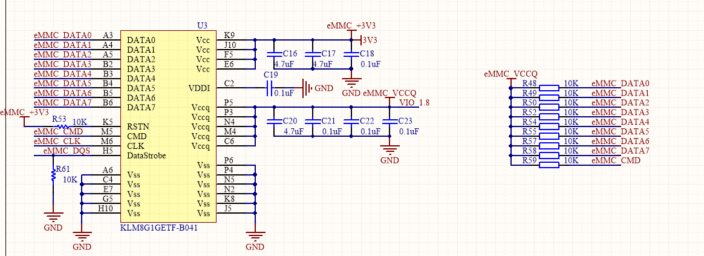
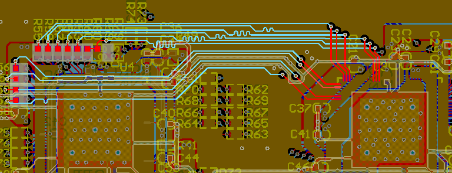
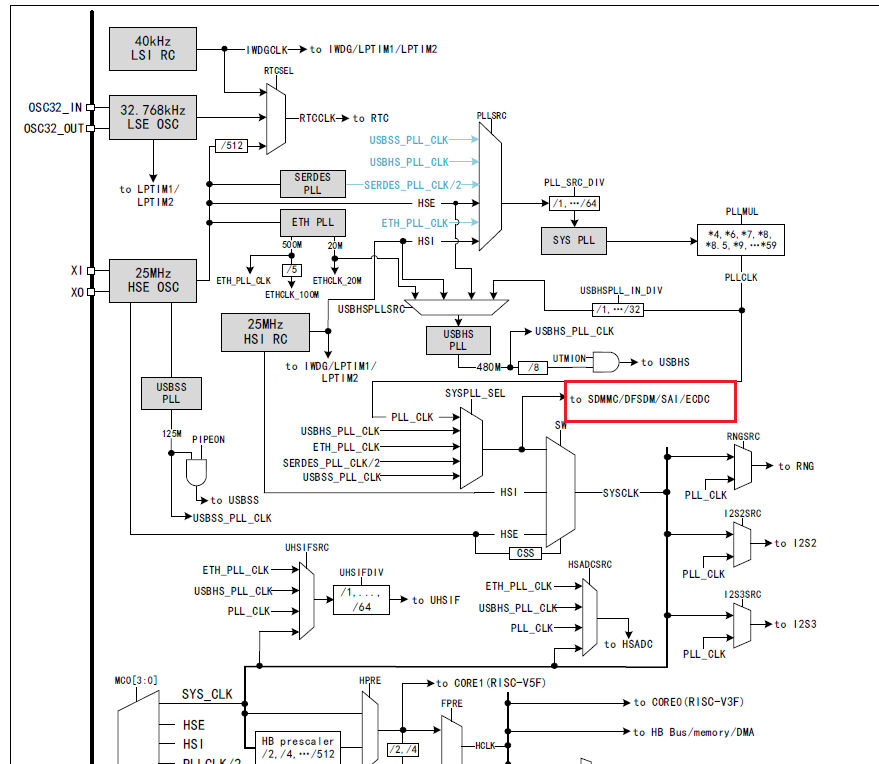
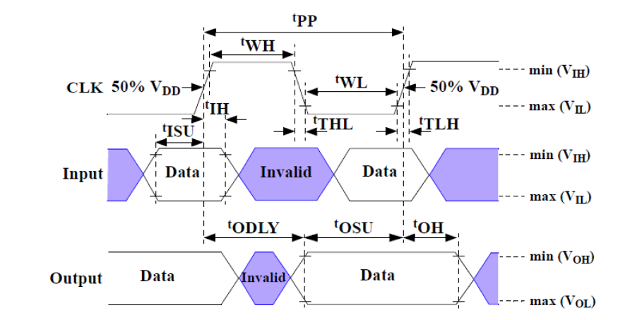
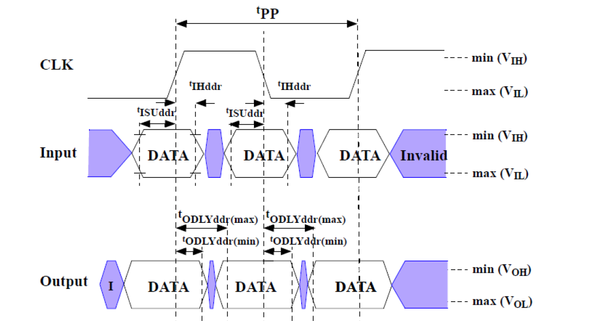

<table>
<colgroup>
<col style="width: 49%" />
<col style="width: 50%" />
</colgroup>
<thead>
<tr>
<th rowspan="2"></th>
<th></th>
</tr>
<tr>
<th></th>
</tr>
</thead>
<tbody>
</tbody>
</table>

说明

本应用笔记详细介绍了如何使用沁恒微电子（WCH）的高性能RISC-V微控制器CH32H417的高速SDMMC接口，来驱动嵌入式多媒体卡（eMMC）和从模式通信。eMMC集成了NAND
Flash和控制器，并采用标准MMC接口，提供了高集成度、高可靠性和简化的软件驱动方式，是嵌入式大容量存储的首选方案之一。CH32H417的SDMMC主机控制器完全兼容eMMC协议，支持高达200MHz的时钟频率，可实现高速的数据读写。本文将围绕SDMMC接口介绍、接口硬件设计、协议基础和软件驱动配置进行详细说明。

**适用范围**

| 适用范围 | 系列     |
|----------|----------|
| 通用MCU  | CH32H417 |

目录

[说明 [1](#_Toc239520150)](#_Toc239520150)

[目录 [2](#_Toc239520151)](#_Toc239520151)

[表格索引 [2](#_Toc239520152)](#_Toc239520152)

[图片索引 [2](#_Toc239520153)](#_Toc239520153)

[第1章 简介 [1](#简介)](#简介)

[1.1 CH32H417芯片简介 [1](#ch32h417芯片简介)](#ch32h417芯片简介)

[1.2 SD、SDMMC与eMMC概念 [1](#sdsdmmc与emmc概念)](#sdsdmmc与emmc概念)

[1.3 协议简介 [1](#协议简介)](#协议简介)

[1.4 常用术语解释 [1](#常用术语解释)](#常用术语解释)

[第2章 硬件设计与接口规范 [2](#硬件设计与接口规范)](#硬件设计与接口规范)

[2.1 接口引脚定义 [2](#接口引脚定义)](#接口引脚定义)

[2.2 核心电路设计 [2](#核心电路设计)](#核心电路设计)

[2.3 PCB布局布线指南 [3](#pcb布局布线指南)](#pcb布局布线指南)

[第3章 协议基础 [4](#协议基础)](#协议基础)

[3.1 命令格式 [4](#命令格式)](#命令格式)

[3.2 响应格式 [4](#响应格式)](#响应格式)

[3.3 数据包格式 [4](#数据包格式)](#数据包格式)

[第4章 软件驱动开发 [5](#软件驱动开发)](#软件驱动开发)

[4.1 初始化配置 [5](#初始化配置)](#初始化配置)

[4.2 命令配置 [6](#命令配置)](#命令配置)

[4.3 数据配置 [6](#数据配置)](#数据配置)

[4.3.1 单缓冲模式 [6](#单缓冲模式)](#单缓冲模式)

[4.3.2 双缓冲模式 [7](#双缓冲模式)](#双缓冲模式)

[4.4 时序调整 [7](#时序调整)](#时序调整)

[4.5 中断配置 [8](#中断配置)](#中断配置)

[第5章 eMMC驱动流程实例 [9](#emmc驱动流程实例)](#emmc驱动流程实例)

[5.1 High Speed SDR配置流程
[9](#high-speed-sdr配置流程)](#high-speed-sdr配置流程)

[5.2 High Speed DDR配置流程
[10](#high-speed-ddr配置流程)](#high-speed-ddr配置流程)

[5.3 HS200配置流程 [10](#hs200配置流程)](#hs200配置流程)

[5.4 HS400配置流程 [11](#hs400配置流程)](#hs400配置流程)

[历史版本 [12](#_Toc239520180)](#_Toc239520180)

[声明 [13](#_Toc239520181)](#_Toc239520181)

表格索引

[SDMMC接口定义 [2](#_Toc239520182)](#_Toc239520182)

[SDMMC映射引脚 [2](#_Toc239520183)](#_Toc239520183)

[命令格式 [4](#_Toc239520184)](#_Toc239520184)

[响应格式 [4](#_Toc239520185)](#_Toc239520185)

[引脚初始化配置 [5](#_Toc239520186)](#_Toc239520186)

[eMMC模式 [9](#_Toc239520187)](#_Toc239520187)

[CID信息 [9](#_Toc239520188)](#_Toc239520188)

图片索引

[eMMC卡接线图 [2](#_Toc239520189)](#_Toc239520189)

[主从通信等长布线PCB图 [3](#_Toc239520190)](#_Toc239520190)

[SDMMC时钟树 [5](#_Toc239520191)](#_Toc239520191)

[SDR模式时序图 [7](#_Toc239520192)](#_Toc239520192)

[DDR模式时序图 [8](#_Toc239520193)](#_Toc239520193)

# 简介

## CH32H417芯片简介

CH32H417是基于青稞RISC-V5F和RISC-V3F双内核设计的互联型通用微控制器。它集成了一个完整的SDMMC主机控制器（兼容SD/MMC/SDIO协议），该控制器支持eMMC设备，可配置工作在1位、4位或8位总线模式下，最高通信时钟可达200MHz，为大数据量的存储提供了硬件基础

## SD、SDMMC与eMMC概念

- SD Card (Secure Digital Memory
  Card)：一种遵循SD标准，主要用于存储数据的闪存卡。协议主要包含物理层（Physical
  Layer）、文件系统层（File System Layer）和应用层（Application
  Layer）。

- SDMMC (SD/EMMC
  Controller)：在SD标准基础上扩展的接口标准，允许设备在共享SD接口的基础上实现额外功能。常见的SDMMC接口设备包括Wi-Fi模块、蓝牙模块、GPS模块等。SDMMC设备在初始化后，主机可以通过特定的I/O命令与其功能单元（Function）进行通信，而非简单的块读写。

- eMMC (embedded MultiMediaCard)：将MMC接口、NAND
  Flash及主控制器集成在一个BGA封装内的嵌入式存储解决方案。它对主机隐藏了NAND管理的复杂性，提供了与SD卡类似的块设备接口，但引脚定义和部分高级特性存在差异。

## 协议简介

SD协议采用主从式、命令-响应型的串行通信方式。

- 总线拓扑：

  - 支持1个主机（Host）和多个从设备（Card）的连接。通过设备地址（RCA）进行寻址。

- 通信通道：

  - CMD线：用于双向传输命令和响应。该信号是一个双向命令通道，用于设备的初始化和命令传输。CMD信号有两种工作模式：初始化模式为开漏模式，快速命令传输推挽模式。命令从主机控制器发送到从设备，响应从设备发送到主机。

  - DAT线：用于双向传输数据。支持1-bit、4-bit、8-bit模式。

  - CLK线：由主机产生，为所有传输提供同步时钟。该信号每个周期在CMD线上进行一位传输，在所有DAT线上进行一位(1x)或两位(2x)传输。频率可以在零到最大时钟频率之间变化。

- 数据传输模式：

  - 分为单数据速率（SDR） 和双数据速率（DDR）

## 常用术语解释

- RCA (Relative Card
  Address)：主机在初始化过程中分配给卡的相对地址，用于后续寻址。

- CID (Card Identification
  Number)：卡的唯一标识符，包含制造商、序列号等信息。

- CSD (Card Specific
  Data)：卡的特性数据，包含容量、块大小、支持的最大传输速度等信息。

- OCR (Operating Conditions
  Register)：操作条件寄存器，包含卡的电压范围和支持的模式信息。

- Block (块)：eMMC卡读写的最小逻辑单位，通常为512字节

# 硬件设计与接口规范

## 接口引脚定义

SDMMC接口共有11根接口线，一根时钟线（CLK），一根命令线（CMD），八根数据线（DAT\[7:0\]）和一根数据选通信号线（STR），每根线的类型和描述如下表。

<table style="width:89%;">
<caption>
表 2‑1 SDMMC接口定义
</caption>
<colgroup>
<col style="width: 22%" />
<col style="width: 20%" />
<col style="width: 46%" />
</colgroup>
<thead>
<tr>
<th style="text-align: center;">SD/EMMC引脚</th>
<th style="text-align: center;">类型</th>
<th style="text-align: center;">描述</th>
</tr>
</thead>
<tbody>
<tr>
<td style="text-align: center;">CLK</td>
<td style="text-align: center;">
主机输出

从机输入
</td>
<td style="text-align: center;">同步时钟信号</td>
</tr>
<tr>
<td style="text-align: center;">CMD</td>
<td style="text-align: center;"> 双向，开漏</td>
<td
style="text-align: center;">命令/响应信号线，<strong>必须上拉</strong>。</td>
</tr>
<tr>
<td style="text-align: center;">DAT[7:0]</td>
<td style="text-align: center;"> 双向，开漏 </td>
<td
style="text-align: center;">数据线。至少需要DAT0。<strong>必须上拉</strong>。</td>
</tr>
<tr>
<td style="text-align: center;">STR</td>
<td style="text-align: center;">从机输出</td>
<td style="text-align: center;">返回时钟信号，用于HS400模式</td>
</tr>
<tr>
<td style="text-align: center;">VDD</td>
<td style="text-align: center;">电源</td>
<td style="text-align: center;">核心供电电压（3.3V典型值）</td>
</tr>
<tr>
<td style="text-align: center;">VCCQ</td>
<td style="text-align: center;">电源</td>
<td style="text-align: center;">I/O供电电压（3.3V-&gt;1.8V）</td>
</tr>
<tr>
<td style="text-align: center;">VSS</td>
<td style="text-align: center;">电源</td>
<td style="text-align: center;">地</td>
</tr>
<tr>
<td style="text-align: center;">RST</td>
<td style="text-align: center;">输入</td>
<td style="text-align: center;">硬件复位，默认上拉，低电平复位</td>
</tr>
</tbody>
</table>

## 核心电路设计

上拉电阻：CMD和所有DAT线必须使用电阻上拉到VDD。这是协议强制要求的，用于确保在总线空闲时处于高电平状态，并提供稳定的直流偏置。即使MCU内部有上拉，也强烈建议使用更可靠的外部上拉电阻。

电源电路：提供干净、稳定的电源。电源引脚必须并联多个电容进行去耦

<figure>

<figcaption>
图 2‑1 eMMC卡接线图
</figcaption>
</figure>

CH32H417QEU6提供了三组SDMMC映射引脚，根据封装可以选择对应的组，CH32H417对应的SDMMC引脚如下表

<table style="width:77%;">
<caption>
表 2‑2 SDMMC映射引脚
</caption>
<colgroup>
<col style="width: 27%" />
<col style="width: 16%" />
<col style="width: 17%" />
<col style="width: 15%" />
</colgroup>
<thead>
<tr>
<th style="text-align: center;">SDMMC功能</th>
<th>
SDMMC_RM=00

默认映射引脚
</th>
<th>
SDMMC_RM=01

重映射引脚
</th>
<th>
SDMMC_RM=1x

重映射引脚
</th>
</tr>
</thead>
<tbody>
<tr>
<td>SDMMC_STS/SDMMC_CMD</td>
<td>PD2</td>
<td>PD12</td>
<td>PC10</td>
</tr>
<tr>
<td>SDMMC_SDCK/SDMMC_SLVCK</td>
<td>PC12</td>
<td>PD11</td>
<td>PC12</td>
</tr>
<tr>
<td>SDMMC_STR</td>
<td>PD3</td>
<td>PD10</td>
<td>PC11</td>
</tr>
<tr>
<td>SDMMC_D0</td>
<td>PC8</td>
<td>PB13</td>
<td>PD0</td>
</tr>
<tr>
<td>SDMMC_D1</td>
<td>PC9</td>
<td>PC9</td>
<td>PD1</td>
</tr>
<tr>
<td>SDMMC_D2</td>
<td>PC10</td>
<td>PB10</td>
<td>PD2</td>
</tr>
<tr>
<td>SDMMC_D3</td>
<td>PC11</td>
<td>PB11</td>
<td>PD3</td>
</tr>
<tr>
<td>SDMMC_D4</td>
<td>PA14</td>
<td>PA14</td>
<td>PD4</td>
</tr>
<tr>
<td>SDMMC_D5</td>
<td>PA15</td>
<td>PA15</td>
<td>PD5</td>
</tr>
<tr>
<td>SDMMC_D6</td>
<td>PC6</td>
<td>PC6</td>
<td>PD6</td>
</tr>
<tr>
<td>SDMMC_D7</td>
<td>PC7</td>
<td>PC7</td>
<td>PD7</td>
</tr>
</tbody>
</table>

## PCB布局布线指南

1\. 等长布线：对于DAT\[3:0\]
一组信号线，走线长度差异应控制在150mil（约3.8mm） 以内。在eMMC
8-bit模式下，DAT\[7:0\]最好也能做等长处理。

2\.
优先布线：CLK线应尽可能短，并远离其他高速信号和模拟信号，以减少干扰。

3\.
参考平面：所有SDMMC信号线下方必须有完整的地平面作为参考，避免跨分割。

4\. 过孔：尽量减少过孔数量，如需使用，应使用小尺寸过孔

<figure>

<figcaption>
图 2‑2主从通信等长布线PCB图
</figcaption>
</figure>

# 协议基础

## 命令格式

所有命令帧均为48位固定长度，格式如下:

| 位   | 47     | 46     | 45:40  | 39:8     | 7:1    | 0      |
|------|--------|--------|--------|----------|--------|--------|
| 值   | 0      | 1      | Index  | Argument | CRC7   | 1      |
| 说明 | 起始位 | 传输位 | 命令号 | 命令参数 | 校验位 | 结束位 |

表 3‑1命令格式

## 响应格式

最常见的响应是R1（48位），格式如下

|  位  |   47   |   46   |  45:40   |      39:8      |  7:1   |   0    |
|:----:|:------:|:------:|:--------:|:--------------:|:------:|:------:|
|  值  |   0    |   0    |  Index   |  Card Status   |  CRC7  |   1    |
| 说明 | 起始位 | 传输位 | 原命令号 | 32位状态寄存器 | 校验位 | 结束位 |

表 3‑2响应格式

在32位状态寄存器中，每一位代表一个状态，例如第31位是ADDRESS\_
OUT_OF_RANGE错误，第8位是READY_FOR_DATA（表明卡已准备好传输数据）

## 数据包格式

数据通过DAT线传输，以数据块为单位。每个数据块前有一个起始位，后跟数据内容和CRC16校验码。

读数据（设备 -\> 主机）：\
\[Start Bit (0)\] + \[Data\] + \[CRC16\] + \[End Bit (1)\]

写数据（主机 -\> 设备）：\
\[Start Bit (0)\] + \[Data\] + \[CRC16\] + \[End Bit (1)\]

数据块大小可以在初始化时配置（通常为512字节，与硬盘扇区兼容）。在HS400等高速模式下，数据在时钟的上升沿和下降沿都会传输（DDR）。

# 软件驱动开发

## 初始化配置

SDMMC初始化配置，首先对所用到的GPIO进行配置，选择实际的映射引脚，IO速度等。

<table style="width:61%;">
<caption>
表 4‑1引脚初始化配置
</caption>
<colgroup>
<col style="width: 24%" />
<col style="width: 36%" />
</colgroup>
<thead>
<tr>
<th style="text-align: center;">SD/EMMC引脚</th>
<th style="text-align: center;">配置</th>
</tr>
</thead>
<tbody>
<tr>
<td style="text-align: center;">CLK</td>
<td style="text-align: center;">
主模式：推挽复用输出

从模式：推挽复用输出
</td>
</tr>
<tr>
<td style="text-align: center;">CMD</td>
<td style="text-align: center;"> 推挽复用输出</td>
</tr>
<tr>
<td style="text-align: center;">D[7:0]</td>
<td
style="text-align: center;"> 推挽复用输出（根据配置的有效数据宽度配置引脚个数） </td>
</tr>
<tr>
<td style="text-align: center;">STR</td>
<td style="text-align: center;">推挽复用输出（HS400模式需要时配置）</td>
</tr>
</tbody>
</table>

接下来就是配置对应的SDMMC寄存器，实现相应的功能。

首先选择SDMMC的角色，配置RB_SLV_MODE，设为主机或者从机模式。

紧接着就是配置时钟，控制器接口提供了2种时钟模式：低速模式和高速模式。一般SD协议规定对于SD接口的设备的前期初始化使用400KHz左右的通讯时钟来保证更好的通讯兼容性，当获取了外接设备的参数信息后，可以根据其内部支持的配置，切换到更高的时钟频率进行通讯

<figure>

<figcaption>
图 4‑1 SDMMC时钟树
</figcaption>
</figure>

根据时钟树的指示，SDMMC的时钟来源于SYSPLL_SEL，根据R16_EMMC_CLK_DIV寄存器中的RB_EMMC_CLKOE选择：

当RB_EMMC_CLKMode = 1，则SDCLK =SYSPLL_SEL/RB_EMMC_DIV_MASK；

当RB_EMMC_CLKMode = 0，则SDCLK = SYSPLL_SEL/RB_EMMC_DIV_MASK/64。

**主机经过上述配置后对外输出对应时钟，从机的时钟为直接输入值，无需经过上述的计算，但是RB_EMMC_DIV_MASK必须配置成最小值2。通讯时钟最大支持输出200M。**

通过设置寄存器R16_EMMC_CLK_DIV寄存器的bit10位写1，可以让输出的时钟信号物理翻转，但是控制器内部的时钟仍然保持不变。这种方式可以调节通讯时序。在SDR模式下，可以更改RB_EMMC_NEGSMP位，改变数据采样边沿，以此来改善通讯时序。

根据实际使用的数据位宽，配置RB_EMMC_LW_MASK位，根据配置，选择1/4/8线模式，根据协议规定，初始化SD/EMMC时，使用单线模式，数据通讯时，SD一般选择4线模式，EMMC一般选择8线模式。

如果需要对收发器进行复位，可以RB_EMMC_RST_LGC位和RB_EMMC_ALL_CLR位先写1，再写0。正常使用控制器前需确保上述两位为0。

为了后续数据的顺利收发，初始化时期，配置RB_EMMC_DMAEN，使能DMA。配置RB_EMMC_TOCNT_MASK，设置应答/数据超时时间：SDCLK
\* 4194304 \*
RB_EMMC_TOCNT_MASK，当发生如下四种情况时，对应的超时中断标志就会置位。

1）R1b应答之后的D\[0\] busy超时；

2）写数据块时，CRC status之后的D\[0\] busy超时；

3）写数据块时，等待CRC status超时；

4）读数据块时，等待起始位超时。

## 命令配置

主机发送CMD，配置EMMC_ARGUMENT（参数），RB_EMMC_CMDIDX_MASK（发送的索引号）和RB_EMMC_RPTY_MASK（期望的应答类型），从机返回的响应参数存在R32_EMMC_RESPONSE寄存器中。

从机接收CMD，接收到的参数存在R32_EMMC_RESPONSE3中，接收的索引存在R32_EMMC_RESPONSE2中，回复主机的响应参数需写入EMMC_ARGUMENT

## 数据配置

数据配置时，主机和从机采用同样的配置方式。为了防止读写之间抢占，可以在读和写之前，查看R32_EMMC_STATUS寄存器的RB_EMMC_DAT0STA位，查看数据线D0的状态，等到高电平之后再进行读写操作

### 单缓冲模式

发送数据时，RB_EMMC_MODE_BOOT设置为正常模式，RB_EMMC_DMA_DIR设置传输的方向为控制器到SD。设置发送单块传输大小RB_EMMC_BKSIZE_MASK（1-2048字节），设置发送的传输块总数RB_EMMC_BKNUM_MASK（1～65535块），最后配置R32_EMMC_DMA_BEG1寄存器，将用于存储发送数据缓存区起始地址写入，注意16字节对齐，开始发送数据。

接收数据时，RB_EMMC_MODE_BOOT设置为正常模式，RB_EMMC_DMA_DIR设置传输的方向为SD到控制器。配置接收的单块传输大小RB_EMMC_BKSIZE_MASK（1-2048字节），设置接收的传输块总数RB_EMMC_BKNUM_MASK（1～65535块），最后设置R32_EMMC_DMA_BEG1寄存器，将用于存储数据缓存区起始地址写入，注意16字节对齐，开始等待接收数据。

如需使用DDR模式，则在上述的基础上开启RB_DDR_MODE位使能DDR。

如果连续读写多块，在每完成一块后，需要写入R32_EMMC_WRITE_CONT任意值，以启动下一块的发送。

主从通信时，如果从机在收发过程中出现内部FIFO溢出，硬件会自动强制本次收发的数据块为CRC错误，以此通知主机传输有问题；从机可以设置RB_SLV_FORCE_ERR，强制回复主机数据块CRC错误

### 双缓冲模式

根据4.3.1配置发送和接收模式，在以上基础上需再使能RB_EMMC_DULEDMA_EN，开启双缓冲模式，配置RB_EMMC_DMATN_CNT位，设置缓冲区切换的块计数值，配置R32_EMMC_DMA_BEG2寄存器，用于存放另一个数据缓存区起始地址

## 时序调整

在较高SDCLK频率下，若推荐的时序调节寄存器值不能稳定通信，用户需发起总线采样tuning序列寻找更佳的采样点。

可以通过示波器观察数据采样波形，根据观测到的波形调整对应的延迟。此时不要使用逻辑分析仪，一般的逻辑分析仪采样速率已经无法正确采样数据收发的波形。

以主从机通信，主机发送从机接收为例：

1、如果CLK采样边沿慢于有效数据

主机端可以调整R32_EMMC_TUNE_DATO寄存器，设置单根数据线输出延时，输出延迟=0.1ns
\* RB_TUNNE_DATx_O；

从机端可以调整R32_EMMC_TUNE_DATI寄存器，设置单根数据线输入延时，输入延迟=0.1ns
\* RB_TUNNE_DATx_I，

2、如果CLK采样边沿快于有效数据

主机端可以配置RB_TUNNE_CLK_O位，延迟CLK输出，延迟=0.2ns \*
RB_TUNNE_CLK_O；

从机端可以配置RB_TUNNE_CLK_I位，延迟CLK输入，延迟=0.2ns \*
RB_TUNNE_CLK_I；

通过1和2的配置将有效数据位正确对应在CLK的采样边沿上。

<figure>

<figcaption>
图 4‑2 SDR模式时序图
</figcaption>
</figure>

<figure>

<figcaption>
图 4‑3 DDR模式时序图
</figcaption>
</figure>

3、如果CLK采样边沿慢于有效CMD

主机端可以调整RB_TUNNE_CMD_O，设置CMD输出延时，延迟值=0.2ns \*
RB_TUNNE_CMD_O；

从机端可以调整RB_TUNNE_CMD_I，设置CMD输入延时，延迟值=0.2ns \*
RB_TUNNE_CMD_I；

4、如果CLK采样边沿快于有效CMD

主机端可以配置RB_TUNNE_CLK_O位，延迟CLK输出，延迟=0.2ns \*
RB_TUNNE_CLK_O；

从机端可以配置RB_TUNNE_CLK_I位，延迟CLK输入，延迟=0.2ns \*
RB_TUNNE_CLK_I；

通过3和4的配置将有效CMD正确对应在CLK的采样边沿上。

## 中断配置

使能对应的中断配置，可以在及时反馈数据/命令收发的状态。配置中断使能寄存器（R16_EMMC_INT_EN），使能需要开启的中断，配置完后，调用NVIC_EnableIRQ(
SDMMC_IRQn )函数，使用快速中断。进行函数编写，可在中断中处理对应的操作。

    void SDMMC_IRQHandler (void) __attribute__((interrupt("WCH-Interrupt-fast")))
    void SDMMC_IRQHandler( void )
    {
    	If(Interruptflag){
    	……
    	……
    }
    Clear Interruptflag;
    }

处理完后，对中断标志寄存器（R16_EMMC_INT_FG）进行写1，清除中断标志

# eMMC驱动流程实例

eMMC定义了多种运行模式，本章节介绍了几种模式的配置流程和注意事项，以下表格总结了几种模式的一些特性

| 模式名称 | 采样边沿 | IO电压 | 数据位宽 | 时钟频率 | 理论上最大传输数据量（8线） |
|:--:|:--:|:--:|:--:|:--:|:--:|
| 向后兼容旧版MMC卡 | 单边沿 | 3V/1.8V/1.2V | 1，4，8 | 0-26 MHz | 26 MB/s |
| High Speed SDR | 单边沿 | 3V/1.8V/1.2V | 1，4，8 | 0-52 MHz | 52 MB/s |
| High Speed DDR | 双边沿 | 3V/1.8V/1.2V | 4，8 | 0-52 MHz | 104 MB/s |
| HS200 | 单边沿 | 1.8V/1.2V | 4，8 | 0-200 MHz | 200 MB/s |
| HS400 | 双边沿 | 1.8V/1.2V | 8 | 0-200 MHz | 400 MB/s |

表 5‑1 eMMC模式

## High Speed SDR配置流程

1\. 上电3.3V，必须保持初始频率≤400KHz。

RCC_HB1PeriphClockCmd(RCC_HB1Periph_PWR, ENABLE);

PWR_VIO18ModeCfg(PWR_VIO18CFGMODE_SW);

PWR_VIO18LevelCfg(PWR_VIO18Level_MODE3);

调用上述函数，将IO电平模式切换成软件配置模式，配置初始化时的数据线的高电平为3.3V。

配置R16_EMMC_CLK_DIV寄存器的RB_EMMC_CLKMode位为低速模式，RB_EMMC_DIV_MASK写入合适的值，计算出的SDMMC输出频率小于400kHz。例程中：SYSPLL_SEL配置为600M，RB_EMMC_DIV_MASK配置为0x1F，实际输出的SDMMC_CLK=600M/0x1F/64=302kHz。

2\. 循环发送CMD0 (GO_IDLE_STATE)：发送硬件复位命令，使eMMC进入Idle状态。

该指令最大循环发送74个循环，当控制器反馈无错误，即可退出。

3\. 循环发送CMD1 (SEND_OP_COND)。

参数设置：Argument = 0x40FF8080

循环发送，协商工作电压（3.3V/1.8V）和主机能力。

等待r3回复的最高位为1时，退出循环。

4\. 发送CMD2 (ALL_SEND_CID)：等待R2回复，获取卡片CID

|         Name         | Width |  CID-Slice  |
|:--------------------:|:-----:|:-----------:|
|   Manufacturer ID    |   8   | \[127:120\] |
|       Reserved       |   6   | \[119:114\] |
|      Device/BGA      |   2   | \[113:112\] |
|  OEM/Application ID  |   8   | \[111:104\] |
|     Product name     |  48   | \[103:56\]  |
|   Product revision   |   8   |  \[55:48\]  |
|   Product revision   |  32   |  \[47:16\]  |
|  Manufacturing date  |   8   |  \[15:8\]   |
|    CRC7 checksum     |   7   |   \[7:1\]   |
| not used, always “1” |   1   |   \[0:0\]   |

表 5‑2 CID信息

5\. 发送CMD3 (SET_RELATIVE_ADDR)：为卡片分配相对地址（RCA）。

例程中配置的RCA为0x1A86，发送CMD时的参数设置为RCA\<\<16：Argument =
0x1A860000。

6\. 发送CMD9 (SD_CMD_SEND_CSD)：获取卡片的CSD信息。

参数设置：Argument = RCA\<\<16，等待返回的对应的数据。

7\. 发送CMD7 (SELECT_CARD)：通过RCA选中目标卡片，进入传输模式（Transfer
State）。

8\. 发送CMD8 (SEND_EXT_CSD)

用于读取512字节的Ext_CSD寄存器，详见《Embedded Multi-Media Card (e•MMC)
Electrical Standard (5.1)》P173。

重点检查\[196\] DEVICE_TYPEG
字段：支持的模式类型，用于判断后续是否可以切换模式提高读写速度。

检查 \[189\] CMD_SET_REV字段：支持的eMMC协议版本。

检查\[215:212\] SEC_COUNT字段：eMMC卡的块数

检查\[61\] DATA_SECTOR_SIZE字段：单块的容量，一般为512B

通过块数和单块的容量，可以计算出eMMC卡的总的容量：SEC_COUNT\*DATA_SECTOR_SIZE

9\. 发送发送切换指令CMD6 (SWITCH_FUNCTION)：

参数设置：Argument = 0x03B70200

上述命令操作，用于通知eMMC卡，切换为8线传输模式。（如果使用四线模式，指令可以换成Argument
= 0x03B70100）

此时，切换SDMMC控制器，R16_EMMC_CONTROL寄存器的RB_EMMC_LW_MASK位，设置成收发器使用D\[7:0\]，8
数据线。（如果使用四线模式，RB_EMMC_LW_MASK同样设置成四线）

10\. 发送切换指令CMD6 (SWITCH_FUNCTION)：

参数设置：Argument = 0x03B90100

\[31:24\] = 0x03：访问模式（写Ext_CSD）

\[23:16\] = 0xB9：目标寄存器（HS_TIMING）

\[15:8\] = 0x01：写入值（0x01=HS模式）

完成High Speed
SDR模式的配置完成。配置完可以再次读取Ext_CSD，查看是否已经配置上对应的值。

11\. 将SDMMC控制器时钟从初始频率（400KHz）提升至52MHz。

完成上述流程即可正常收发数据

## High Speed DDR配置流程

低速双边沿采样模式，可以提高一倍的速率，在5.1的前提操作下，发送发送切换指令CMD6
(SWITCH_FUNCTION)，参数设置：Argument =
0x03B70600，通知eMMC卡，切换为8线传输的DDR模式，即 High Speed
DDR模式。注意，必须在HS_TIMING的值为1时，才能配置DDR模式。（包括四线DDR，Argument
= 0x03B70500）

## HS200配置流程

基于5.1 High Speed
SDR模式，我们想进一步提高速度，需要再往下配置（5.1的第8条中提到的支持更高速模式的前提下）：

1.  切换IO电压为1.8/1.2V，需参照eMMC手册，查看可以配置的电压。

例程中将电压切换至1.8V：PWR_VIO18LevelCfg(PWR_VIO18Level_MODE1);

2.  发送切换指令CMD6 (SWITCH_FUNCTION)：

参数设置：Argument = 0x03B90200

\[31:24\] = 0x03：访问模式（写Ext_CSD）

\[23:16\] = 0xB9：目标寄存器（HS_TIMING）

\[15:8\] = 0x02：写入值（0x02=HS200模式）

完成HS200模式的配置完成。配置完可以再次读取Ext_CSD，查看是否已经配置上对应的值。

3.  切换SDMMC控制器的时钟。

> 例程中，设置配置R16_EMMC_CLK_DIV寄存器的RB_EMMC_CLKMode位为高速模式，如果SYSPLL_SEL配置为600M，RB_EMMC_DIV_MASK配置为0x3，将SDMMC_CLK输出200MHz。

4、发送CMD21（Send Tuning
Block），然后配置成接收模式，接收128B的数据，对照《Embedded Multi-Media
Card (e•MMC) Electrical Standard (5.1)》P53的Tuning block pattern for 8
bit
mode，如果一致，则时序为最优时序，否则即按照4.4章节调整，直至数据对应准确

## HS400配置流程

在5.3的基础上，还可以将速度再次进行翻倍，进入HS400模式，按照如下配置。

1、 SDMMC_CLK降至52M以下，进入 High Speed DDR模式，具体流程详见5.2章节。

2、 发送切换指令CMD6 (SWITCH_FUNCTION)：

参数设置：Argument = 0x03B90300

\[31:24\] = 0x03：访问模式（写Ext_CSD）

\[23:16\] = 0xB9：目标寄存器（HS_TIMING）

\[15:8\] = 0x03：写入值（0x03=HS400模式）

3、 将速度再次提升至200MHz，按照5.3的4进行时序调节

历史版本

| 日期      | 版本 | 变更内容 |
|-----------|------|----------|
| 2025/9/15 | V1.0 | 初版发行 |

声明

本手册仅供参考。作者在不另行通知的情况下，可随时进行修改。
