<table>
<colgroup>
<col style="width: 50%" />
<col style="width: 50%" />
</colgroup>
<thead>
<tr>
<th rowspan="2"></th>
<th></th>
</tr>
<tr>
<th></th>
</tr>
</thead>
<tbody>
</tbody>
</table>

<span id="_Toc238632319" class="anchor"></span>说明

本文主要介绍CH32通用系列OPA外设使用介绍，简要说明OPA参数指标用于对CH32通用系列OPA选型；以及对OPA几种使用模式介绍与几个典型模式使用介绍。

**适用范围**

| 适用范围 | 系列     |
|----------|----------|
| 通用MCU  | CH32系列 |

<span id="_Toc238632320" class="anchor"></span>目录

[说明 [1](#_Toc238632319)](#_Toc238632319)

[目录 [2](#_Toc238632320)](#_Toc238632320)

[表格索引 [2](#_Toc238632321)](#_Toc238632321)

[图片索引 [2](#_Toc238632322)](#_Toc238632322)

[第1章 CH32系列 [1](#ch32系列)](#ch32系列)

[1.1 CH32 OPA介绍 [1](#ch32-opa介绍)](#ch32-opa介绍)

[1.1.1 OPA 基础指标 [1](#opa-基础指标)](#opa-基础指标)

[第2章 OPA模式使用 [4](#opa模式使用)](#opa模式使用)

[2.1 OPA不同模式 [4](#opa不同模式)](#opa不同模式)

[2.2 OPA功能模式使用 [7](#opa功能模式使用)](#opa功能模式使用)

[2.3 2.3 OPA使用示例 [11](#opa使用示例)](#opa使用示例)

[附录 [1](#_Toc238632330)](#_Toc238632330)

[历史版本 [2](#_Toc238632331)](#_Toc238632331)

[声明 [3](#_Toc238632332)](#_Toc238632332)

<span id="_Toc238632321" class="anchor"></span>表格索引

[表 2‑1 OPA输出偏置电压VB<sub>OPAOUT</sub>
[6](#_Toc238632333)](#_Toc238632333)

[表 2‑2OPA输出增益Gain<sub>OPAOUT</sub>
[6](#_Toc238632334)](#_Toc238632334)

[表 2‑3 OPA偏置电压 [7](#_Toc238832013)](#_Toc238832013)

[表 2‑4OPA增益 [7](#_Toc238808513)](#_Toc238808513)

[附表 1不同型号OPA支持功能 [1](#_Toc238832016)](#_Toc238832016)

<span id="_Toc238632322" class="anchor"></span>图片索引

[图 1‑1 OPA拓扑图 [1](#_Toc238632336)](#_Toc238632336)

[图 1‑2 OPA 输出采样结果 [2](#_Toc238832027)](#_Toc238832027)

[图 1‑3OPA失调电压示意图 [2](#_Toc238832028)](#_Toc238832028)

[图 1‑4输入电压与失调值示意图 [3](#_Toc238832029)](#_Toc238832029)

[图 1‑5输出失真示意图 [3](#_Toc238832030)](#_Toc238832030)

[图 2‑1电压比较示意图 [4](#_Toc238832031)](#_Toc238832031)

[图 2‑2跟随器示意图 [4](#_Toc238832032)](#_Toc238832032)

[图 2‑3 内部PGA增益示意图 [5](#_Toc238832033)](#_Toc238832033)

[图 2‑4CH32V006内部差分示意图 [5](#_Toc238832034)](#_Toc238832034)

[图 2‑5 CH32M030内部增益示意图 [6](#_Toc238832035)](#_Toc238832035)

[图 2‑6OPA差分简易图 [7](#_Toc238832036)](#_Toc238832036)

[图 2‑7OPA自动触发轮询功能 [8](#_Toc238832037)](#_Toc238832037)

[图 2‑8 OPA自动延时触发轮询 [8](#_Toc238832038)](#_Toc238832038)

[图 2‑9 QII解码放大器示意图 [11](#_Toc238832039)](#_Toc238832039)

[图 2‑10 调制解码输出结果 [11](#_Toc238832040)](#_Toc238832040)

# CH32系列

## CH32 OPA介绍

OPA运放常用于信号放大，并支持多种模式用于小信号采集。对于OPA基本特性为：高输入阻抗；低输出阻抗；高开环增益。

<figure>
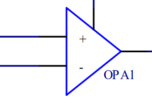
<figcaption><p><span id="_Toc238632336" class="anchor"></span>图 ‑1
OPA拓扑图</p></figcaption>
</figure>

OPA器件如上图所示包含2个输入端——正向输入端（INP）；反向输入端（INN）。一个输出端（OUT）。根据引脚特性可简单总结为：当正向输入电压升高输出电压同步升高，当反向输入电压升高输出电压同步降低。输出端电压为放大后的输出电压。依据OPA不同的架构可分为轨到轨输入/输出与非轨到轨输入/输出。在CH32通用系列产品中CH32V30x中的OPA外设为非轨到轨输入/输出。其余为轨到轨输入/输出。

在CH32通用系列中，所支持：

- OPA 输入引脚或通道可选择

- OPA 输出引脚可选择通用 I/O 口或 ADC 采样通道

- OPA 支持正端输入轮询功能

- OPA 支持内部PGA增益选择

- OPA 中断可使系统从睡眠模式中唤醒

- OPA 支持高速输出模式

对于不同型号产品支持功能见附件表。

### OPA 基础指标

对于理想型OPA有：

开环增益无线大

失调电压为0

高单位增益带宽

快速压摆率

具有独立的输入输出端

1)  压摆率

压摆率（SR）也为转换速率，是指OPA输出电压上升/下降的最大斜率单位为（V/uS）:

``` math
S_{r} = \frac{dV_{out}}{dt}
```

压摆率反映了运放对幅值信号变化的响应能力；当压摆率越大时，代表着OPA输出响应速度越快，意味着采集输出电压变化率越快。当压摆率低可能会出现：采集交流信号失真；采集输出电压为非稳定状态。通常如果使用ADC采集时对应配置合适的采样时间确保OPA输出稳定的情况下进行采样。

<figure>
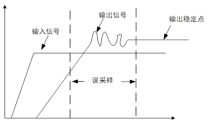
<figcaption><p><span id="_Toc238832027" class="anchor"></span>图 ‑2 OPA
输出采样结果</p></figcaption>
</figure>

在CH32通用系列中，可支持OPA输出高速模式，在该模式下以牺牲功耗与校准失调用于提高OPA输出摆率，在对CH32系列测试中，使用定时器引脚输出波形对比查看输出的上升沿与下降沿对比结果可以看出，当使用OPA输出高速模式时，OPA输出摆率有明显提高。

2)  失调值

OPA失调电压是评估OPA使用的重要参数，理想的OPA下失调电压为0，最直观的感受为：当OPA为开环增益下：V+≤V-时，OPA输出0；V+＞V-时，OPA输出为VDD。但当实际使用中存在输入失调从而出现输入电平比较偏移：

<figure>
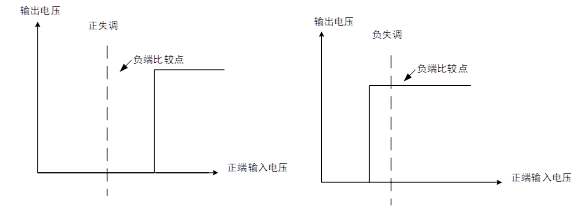
<figcaption><p><span id="_Toc238832028" class="anchor"></span>图
‑3OPA失调电压示意图</p></figcaption>
</figure>

若做信号放大采集时若运放倍数为Au；OPA失调电压为Voffest；则输出电压为Vout=Au\*(Vin+Voffest)。可见当待测的为输入弱信号，失调电压可能会使OPA高低饱和输出，从而导致输出失真。因此在使用小信号放大时输入失调为不可忽略的参数之一。根据输入电压范围，OPA失调值可以看做阶梯变化；当输入在一定范围内可以看做固定失调值。

<figure>
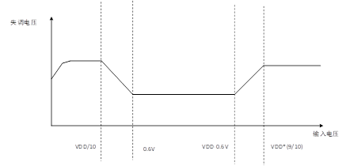
<figcaption><p><span id="_Toc238832029" class="anchor"></span>图
‑4输入电压与失调值示意图</p></figcaption>
</figure>

3)  单位增益带宽

单位增益带宽在做跟随器模式下（增益为1），输出幅值下降到直流增益的0.707倍时所对应的信号频率。当输入信号为频率信号（如正弦波），在确保输出不失真时，在满足OPA压摆率条件下也需满足单位增益带宽。若增益为24倍，单位增益带宽为16M。输入频率限制需为：FCLK≤GBW/Au=(16M/24)=0.67Mhz

在CH32通用系列中使用高速模式时，可以提高OPA单位增益带宽。经由对比OPA高速模式下可适用于：

不在意低功耗模式场景下

- 输入信号频率高

- 输出振幅大且所需采集响应快

在有些通用系列中，OPA正常模式时可适用于：

- 低功耗模式场景下

- 低输入失调电压

- 输入信号频率低

4)  高低饱和输出

虽然OPA为轨到轨输出，但仍存在高低饱和输出，具有输出限制；

高饱和输出：高饱和输出为OPA输出最高电压极限值，其数值大小受负载电流影响，一般情况下接近于VDD电压，详细参数需参考对应芯片的数据手册。

低饱和输出：低饱和输出为OPA输出最低电压极限值，其数值大小受负载电流影响，一般情况下接近于GND电压，详细参数需参考对应芯片的数据手册。

若输出不考虑高/低饱和输出时，输出电压会出现高低失真情况：

<figure>
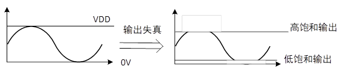
<figcaption><p><span id="_Toc238832030" class="anchor"></span>图
‑5输出失真示意图</p></figcaption>
</figure>

# OPA模式使用

## OPA不同模式

在CH32通用系列中内部支持可独立配置的OPA，具有多个独立的输入输出引脚选择；可独立使用OPA或者选择不同模式。

1)  电压比较

依据OPA具有高开环增益这一特性，可具备电压比较功能，若V-为固定电平时，正端输出存在变化时，若正端输入超出负端输入时OPA输出为VDD电平，若正端输入低于负端输入时OPA输出为GND电平。根据这一特性根据比较固定电压可依据OPA输出高低电平进行判断，依据这一特性可作为：过压监测保护；调制方波输出。

<figure>
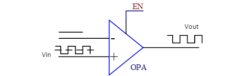
<figcaption><p><span id="_Toc238832031" class="anchor"></span>图
‑1电压比较示意图</p></figcaption>
</figure>

使用该模式，可进行以下配置：

- 选择PSEL为GPIO输出口；NSEL为GPIO输出口。

- 选择OUT端为输出。

- 关闭内部反馈电阻。

2)  电压跟随

电压跟随器具有输出增益为1这一个特点，即输入与输出相同。依据OPA具有高输入低输出这一特性，在使用电压跟随器时，输出只与输入幅值有关，因此经由跟随器可完美的隔离后级电路，且输出电压具有高带载能力。在这类应用中可适用于外部较大不满足需求时，经由跟随器进行阻抗变换。在CH32通用系列中，ADC与DAC外设中依据这一特性均具有内部buff（跟随器）用于减少输入阻抗与增加驱动能力。

<figure>
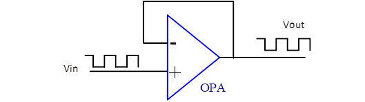
<figcaption><p><span id="_Toc238832032" class="anchor"></span>图
‑2跟随器示意图</p></figcaption>
</figure>

当CH32通用系列内部不支持电压跟随模式，需要配置为独立模式下进行NSEL与VOUT短接，当绘制PCB时需要短接先尽量短，防止寄生电感电容引起输出震荡。

3)  PGA增益

CH32通用系列中内部支持可选择的固定增益模式，在该模式下，负端输入内部接入GND，因此OPA输出只与正端输入有关。当在固定增益（Au）模式下输入与输出为：VOUT=Au\*Vin。基于此可以进行输入信号放大效果，用以采集输入小信号。因CH32通用系列支持OPA独立输出。因此只需外接电阻即可调配不同的增益输出：

<figure>
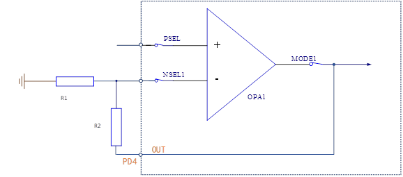
<figcaption><p><span id="_Toc238832033" class="anchor"></span>图 ‑3
内部PGA增益示意图</p></figcaption>
</figure>

如图所示其配置增益为：

``` math
Vout = \left( 1 + \frac{R2}{R1} \right) \times Vin
```

在该模式下由于只需要单端输入，电路方便可有效放大输入小信号，但由于输入失调且没有存在偏置电压会导致输出信号失真，因此可适应于输入幅值较大输出精度较低的场景。

4)  差分输入

差分输入模式具有PSEL与NSEL进行电平比较放大功能，其输出电压有PSEL输入电压与NSEL输入电压决定的，输出电压为：VOUT=(V+-V-)\*Au。因此在输入两端电压可有效抑制共摸干扰。CH32通用系列中，CH32V00x与CH32M030型号产品内部自带偏置电压，以确保能够满量程输出。以CH32V006/007系列为例带有偏置电压差分输入；内部结构如下图所示：

<figure>
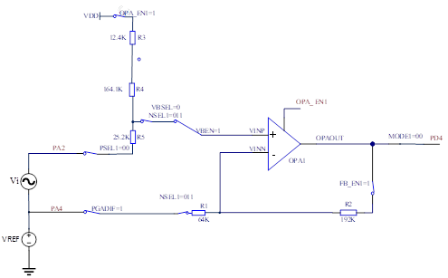
<figcaption><p><span id="_Toc238832034" class="anchor"></span>图
‑4CH32V006内部差分示意图</p></figcaption>
</figure>

依据OPA虚断可知

$`V + = \frac{R5}{R3 + R4 + R5} \times VDD + \frac{R3 + R4}{R3 + R4 + R5} \times （VREF + Vi）`$

OPA虚短可知：

``` math
\frac{(VREF - V - )}{R1} = \frac{（V - - VOUT）}{R2}
```

由此可得：

``` math
VOUT = \frac{(R1 + R2)*V - \ }{R1} - \frac{R2}{R1 \times VREF}
```

由虚短可知：

V+=V-，因此

``` math
VOUT = \frac{(R2 + R1) \times (R4 + R3)}{R1 \times (R3 + R4 + R5)} \times (Vi - VREF) + \frac{(R2 + R1) \times R5}{R1 \times (R3 + R4 + R5)} \times VDD - - \frac{R2}{R1 \times VREF}
```

依据不同的电阻分压可简易得到不同的增益与偏置值：

|        VRFBIAS         | VB<sub>OPAOUT</sub> |
|:----------------------:|:-------------------:|
|     ISP_VRFBIAS =0     |        0.55V        |
| ISP_VRFBIAS VRFBIAS =1 |        1.6V         |

<span id="_Toc238632333" class="anchor"></span>表 ‑1
OPA输出偏置电压VB<sub>OPAOUT</sub>

|     Gain      | Gain<sub>OPAOUT</sub> |
|:-------------:|:---------------------:|
| ISP\_ Gain =0 |           4           |
| ISP\_ Gain =1 |           8           |
| ISP\_ Gain =2 |          16           |
| ISP\_ Gain =3 |          55           |

<span id="_Toc238632334" class="anchor"></span>表
‑2OPA输出增益Gain<sub>OPAOUT</sub>

同理CH3M030系列则为更简易的电路通过调节内部参考电压（VRFBIAS）得到不同的输入偏置电压。

其内部结构如下：

<figure>
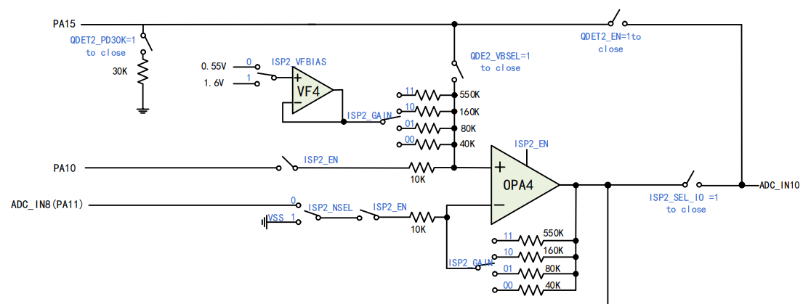
<figcaption><p><span id="_Toc238832035" class="anchor"></span>图 2‑5
CH32M030内部增益示意图</p></figcaption>
</figure>

可简分为：

<figure>

<figcaption><p><span id="_Toc238832036" class="anchor"></span>图
‑6OPA差分简易图</p></figcaption>
</figure>

根据上述计算可得：

``` math
V + \  = \frac{R1}{(R1 + R2)} \times VRFBIAS + \frac{R2}{(R1 + R2)} \times (VREF + Vi)
```

``` math
VOUT = \frac{(R1 + R2) \times V - \ }{R1} - \frac{R2}{R1} \times VREF
```

由V-=V+可得：

``` math
VOUT = \frac{R2}{R1} \times Vi + VRFBIAS
```

根据不同寄存位选择得到不同的偏置与增益：

|        VRFBIAS         | VB<sub>OPAOUT</sub> |
|:----------------------:|:-------------------:|
|     ISP_VRFBIAS =0     |        0.55V        |
| ISP_VRFBIAS VRFBIAS =1 |        1.6V         |

<span id="_Toc238832013" class="anchor"></span>表 ‑3 OPA偏置电压

|     Gain      | Gain<sub>OPAOUT</sub> |
|:-------------:|:---------------------:|
| ISP\_ Gain =0 |           4           |
| ISP\_ Gain =1 |           8           |
| ISP\_ Gain =2 |          16           |
| ISP\_ Gain =3 |          55           |

<span id="_Toc238808513" class="anchor"></span>表 ‑4OPA增益

对于没有OPA失调校准类型芯片，OPA可能会存在高失调，因此在输出电压时需要考虑失调，所以在使用OPA时需要掉失调进行校准，在对校准前需要考虑最大失调值，以免输出高低饱和输出导致输出超出阈量；从而引起输出失真。简易的计算为：

``` math
Vout = （Vin + Voffest） \times Au
```

依据失调的最大值与增益值，最高最低输出应该要再高低饱和电压之间；以CH32M030带有偏置电压为例；将PSEL与NSEL短接，即Vin=0；引入失调电压为Voffest，由此可以得出输出电压为：

``` math
Voffest = （VOUT - \ VRFBIAS）*（R1/R2）
```

即可带入固定值进行补偿运算可以弥补失调误差带来影响；此外需注意时应注意V+输入电压值，输入范围应为OPA失调固定稳定范围内。大致误差图参考图1-4。

## OPA功能模式使用

CH32通用系列支持不同的数字功能，配合不同OPA模式进行使用，具有监控方便，减少OPA外围器件等优点。

1)  OPA轮询模式

使用OPA轮询功能时，OPA负端输入固定，通过软件配置正端输入数以及轮询触发间隔即可对不同的输入信号进行轮询采集，该功能通过正端轮询可有效减少OPA数目进行不同信号采集。在CH32通用系列中可支持OPA轮询功能；详情外设参考附表，以CH32V00x系列OPA轮询通过ADC触发，触发轮询后到采集期间需要建立OPA稳定时间，确保输出稳定后进行采集。按照功能可分为自动触发与自动延时触发；

自动触发：当配置位AUTO_ADC_CFG为1时配置轮询通道以及触发源，经过TOPASETUP，ADC开始采样，在采样完成后，轮询通道切换；等待后续轮询触发事件再次发生后重复上述流程。其流程可以分为：OPA建立时间，ADC采集与ADC转换。

<figure>

<figcaption><p><span id="_Toc238832037" class="anchor"></span>图
‑7OPA自动触发轮询功能</p></figcaption>
</figure>

自动延时触发：当配置AUTO_ADC_CFG位为0时，配置的轮询触发事件发生后，经过TOPASETUP，ADC开始采样，在采样完成后，轮询通道切换，再经过TOPASETUP，进行下一次ADC采样，重复ADC采样后的流程。在配置自动延时触发时需要注意为：设置OPA建立时间需大于ADC转换时间。

<figure>

<figcaption><p><span id="_Toc238832038" class="anchor"></span>图 ‑8
OPA自动延时触发轮询</p></figcaption>
</figure>

对于不同的轮询模式在实际使用时，若ADC转换时间大于OPA建立时间时，应选用自动触发，配合ADC扫描模式使用。若ADC转换时间小于OPA建立时间，应选用自动延时触发，同时配合ADC单次模式使用。

CH32V006使用自动延时触发配置为：

初始化OPA选择

    void OPA1_Init( void )
    {
        GPIO_InitTypeDef GPIO_InitStructure = {0};
        OPA_InitTypeDef  OPA_InitStructure = {0};
        RCC_PB2PeriphClockCmd(RCC_PB2Periph_GPIOA|RCC_PB2Periph_GPIOD, ENABLE);
        GPIO_InitStructure.GPIO_Pin = GPIO_Pin_1|GPIO_Pin_2;
        GPIO_InitStructure.GPIO_Mode = GPIO_Mode_AIN;
        GPIO_Init( GPIOA, &GPIO_InitStructure );

        GPIO_InitStructure.GPIO_Pin = GPIO_Pin_7|GPIO_Pin_3;
        GPIO_InitStructure.GPIO_Mode = GPIO_Mode_AIN;
        GPIO_Init( GPIOD, &GPIO_InitStructure );

        OPA_InitStructure.Mode = OUT_IO_OUT0;
        OPA_InitStructure.POLL_NUM = CHP_POLL_NUM_3; //设置正端输入轮询数量
        OPA_InitStructure.PSEL_POLL = CHP_OPA_POLL_ON; //轮询使能开启
        OPA_InitStructure.POLL_CH1 = OPA_POLL_CH1_PA2;//轮询设置通道1
        OPA_InitStructure.POLL_CH2 = OPA_POLL_CH2_PD7;//轮询设置通道2
        OPA_InitStructure.POLL_CH3 = OPA_POLL_CH3_PD3;//轮询设置通道3
        OPA_InitStructure.POLL_AT = OPA_POLL_AUTO_OFF; //设置为自动延时轮询
        OPA_InitStructure.NSEL = CHN0;
        OPA_InitStructure.SETUP_CFG = OPA_SETUP_CFG_2;  //设置建立时长
        OPA_InitStructure.OPA_HS = HS_ON;
        OPA_InitStructure.POLL_SEL = OPA_POLL_SEL_TIM2_CH4;  //设置轮询触发源
        OPA_InitStructure.OPA_HS = HS_ON;
        OPA_Init(&OPA_InitStructure);
        OPA_Cmd( ENABLE );
    }

初始化ADC

    void ADC_Function_Init(void)
    {
        ADC_InitTypeDef  ADC_InitStructure = {0};
        NVIC_InitTypeDef NVIC_InitStructure = {0};
        RCC_PB2PeriphClockCmd(RCC_PB2Periph_ADC1, ENABLE);
        RCC_ADCCLKConfig( RCC_PCLK2_Div1 );

        ADC_DeInit(ADC1);
        ADC_InitStructure.ADC_Mode = ADC_Mode_Independent;
        ADC_InitStructure.ADC_ScanConvMode = ENABLE;
        ADC_InitStructure.ADC_ContinuousConvMode = DISABLE;
        ADC_InitStructure.ADC_ExternalTrigConv = ADC_ExternalTrigInjecConv_Ext_PD1_PA2_OPA;
        ADC_InitStructure.ADC_DataAlign = ADC_DataAlign_Right;
        ADC_InitStructure.ADC_NbrOfChannel = 1;
        ADC_Init(ADC1, &ADC_InitStructure);
        ADC_ExternalTrigInjectedConvCmd(ADC1, ENABLE);
        ADC_InjectedExTrigConvConfig(ADC1, ADC_InjectedExTrigConv_OPA);
        ADC_InjectedSequencerLengthConfig(ADC1, 3);
        ADC_InjectedChannelConfig(ADC1, ADC_Channel_OPA, 1, ADC_SampleTime_CyclesMode0);
        ADC_InjectedChannelConfig(ADC1, ADC_Channel_OPA, 2, ADC_SampleTime_CyclesMode0);
        ADC_InjectedChannelConfig(ADC1, ADC_Channel_OPA, 3, ADC_SampleTime_CyclesMode0);

        ADC_Cmd(ADC1, ENABLE);
    }

2)  OPA定时器触发

当OPA输出端与定时器输入端相重合，可依据输出高低电平进行输入捕获，以确认输出状态，使用时可做电压比较通过定时器捕获输出状态以确认输入电压。如CH32L103型号芯片，OPA输出引脚PB1同样为定时器3通道4的输入引脚。因此可以进行输入捕获，定时器可配置为

    void Input_Capture_Init(u16 arr, u16 psc)
    {
        TIM_ICInitTypeDef       TIM_ICInitStructure = {0};
        TIM_TimeBaseInitTypeDef TIM_TimeBaseInitStructure = {0};
        NVIC_InitTypeDef        NVIC_InitStructure = {0};

        RCC_PB1PeriphClockCmd(RCC_PB1Periph_TIM3, ENABLE);

        TIM_TimeBaseInitStructure.TIM_Period = arr;
        TIM_TimeBaseInitStructure.TIM_Prescaler = psc;
        TIM_TimeBaseInitStructure.TIM_ClockDivision = TIM_CKD_DIV1;
        TIM_TimeBaseInitStructure.TIM_CounterMode = TIM_CounterMode_Up;
        TIM_TimeBaseInitStructure.TIM_RepetitionCounter = 0x00;
        TIM_TimeBaseInit(TIM3, &TIM_TimeBaseInitStructure);

        TIM_ICInitStructure.TIM_Channel = TIM_Channel_4;
        TIM_ICInitStructure.TIM_ICPrescaler = TIM_ICPSC_DIV1;
        TIM_ICInitStructure.TIM_ICFilter = 0x00;
        TIM_ICInitStructure.TIM_ICPolarity = TIM_ICPolarity_Rising;
        TIM_ICInitStructure.TIM_ICSelection = TIM_ICSelection_DirectTI;

        TIM_ICInit(TIM3, &TIM_ICInitStructure);

        NVIC_InitStructure.NVIC_IRQChannel = TIM3_IRQn;
        NVIC_InitStructure.NVIC_IRQChannelPreemptionPriority = 1;
        NVIC_InitStructure.NVIC_IRQChannelSubPriority = 0;
        NVIC_InitStructure.NVIC_IRQChannelCmd = ENABLE;
        NVIC_Init(&NVIC_InitStructure);

        TIM_ITConfig(TIM3, TIM_IT_CC4 , ENABLE);

        TIM_SelectInputTrigger(TIM3, TIM_TS_TI1FP1);
        TIM_SelectSlaveMode(TIM3, TIM_SlaveMode_Reset);
        TIM_SelectMasterSlaveMode(TIM3, TIM_MasterSlaveMode_Enable);
        TIM_Cmd(TIM3, ENABLE);
    }

3)  OPA引脚配置

OPA引脚配置为输入引脚，配置输入模式分为浮空输入与模拟输入，区别为：

模拟输入：配置模拟输入时，与数字部分断开；当配置为模拟输入时，定时器捕获功能失效；优点为：模拟输入防止漏电行为，可以降低运行功耗。

浮空输入：配置浮空输入时，当配置为模拟输入时，定时器捕获功能生效；缺点为：浮空输入存在漏电，会提高运行功耗。

## 2.3 OPA使用示例

CH32M030内置交流小信号放大解码器（QII）包括 1 个前级的可调增益放大器 OPA
和 1 个后级的电压比较器
CMP。前级可以对QI无线充线圈交流信号进行放大，后端比较将线圈的高频正弦波信号转换为方波信号：

<figure>
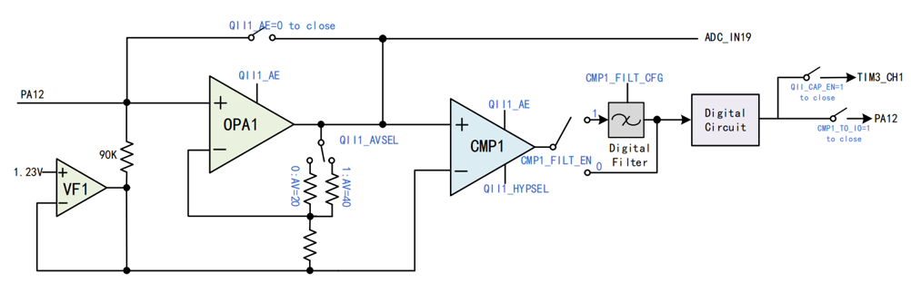
<figcaption><p><span id="_Toc238832039" class="anchor"></span>图 ‑9
QII解码放大器示意图</p></figcaption>
</figure>

前端并联小电容构成低通滤波器，消除高频噪声源；在线圈与运放之间接入电容消除直流信号；只允许QI协议的通信信号通过。经由OPA放大后送入比较器。调制波信号

<figure>
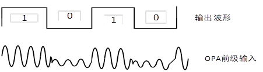
<figcaption><p><span id="_Toc238832040" class="anchor"></span>图 ‑10
调制解码输出结果</p></figcaption>
</figure>

使用配合步骤为：

- 配置 QII1_AE 位，可使能 QII1 模块；配置 QII1_AVSEL 位，可选择 QII1
  模块运放增益大小。

- 配置 QII1_HYPSEL 位，可选择 QII1 模块比较器迟滞电压；配置 CMP1_TO_IO
  位可使能 QII 输出内部 直接送至 TIM3 通道 1 捕获。

- 

<span id="_Toc238632330" class="anchor"></span>附录

| 芯片型号 | 是否支持轮询 | 是否支持内部差分 | 内部是否有增益 | 是否支持高速模式 |
|:--------:|:------------:|:----------------:|:--------------:|:----------------:|
| CH32V30X |      N       |        N         |       N        |        Y         |
| CH32V20X |      N       |        N         |       N        |        N         |
| CH32V00X |      Y       |        Y         |       Y        |        Y         |
| CH32V003 |      N       |        N         |       N        |        N         |
| CH32H417 |      N       |        Y         |       Y        |        Y         |
| CH32V407 |      N       |        Y         |       Y        |        Y         |
| CH32X035 |      Y       |        Y         |       Y        |        N         |
| CH32V205 |      Y       |        Y         |       Y        |        Y         |
| CH32L03x |      Y       |        Y         |       Y        |        Y         |
| CH32M030 |      N       |        Y         |       Y        |        Y         |

<span id="_Toc238832016" class="anchor"></span>附表 1不同型号OPA支持功能

<span id="_Toc238632331" class="anchor"></span>历史版本

| 日期     | 版本 | 变更内容 |
|----------|------|----------|
| 2026/7/8 | V1.0 | 初版发行 |

<span id="_Toc238632332" class="anchor"></span>声明

本手册仅供参考。作者在不另行通知的情况下，可随时进行修改。
