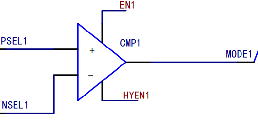
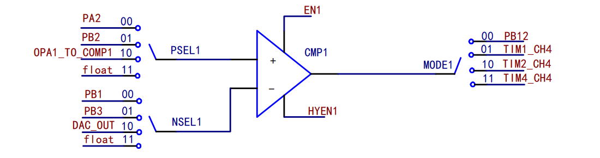

<table>
<colgroup>
<col style="width: 49%" />
<col style="width: 50%" />
</colgroup>
<thead>
<tr>
<th rowspan="2"></th>
<th>AN24001</th>
</tr>
<tr>
<th>V1.0</th>
</tr>
</thead>
<tbody>
</tbody>
</table>

说明

本文主要介绍CH32通用系列CMP外设使用介绍，简要说明CMP参数指标用于对CH32通用系列CMP选型；以及对CMP几种使用模式介绍。

**适用范围**

| 适用范围 | 系列         |
|----------|--------------|
| 通用MCU  | CH32通用系列 |

目录

[说明 [1](#_Toc239069169)](#_Toc239069169)

[目录 [2](#_Toc239069170)](#_Toc239069170)

[表格索引 [2](#_Toc239069171)](#_Toc239069171)

[图片索引 [2](#_Toc239069172)](#_Toc239069172)

[第1章 CMP模式介绍 [1](#cmp模式介绍)](#cmp模式介绍)

[1.1 CH32 CMP外设介绍 [1](#ch32-cmp外设介绍)](#ch32-cmp外设介绍)

[1.1.1 CMP定时器输出 [1](#cmp定时器输出)](#cmp定时器输出)

[1.1.2 CMP迟滞功能 [2](#cmp迟滞功能)](#cmp迟滞功能)

[1.1.3 CMP低功耗唤醒 [3](#cmp低功耗唤醒)](#cmp低功耗唤醒)

[1.1.4 CMP数字滤波 [3](#cmp数字滤波)](#cmp数字滤波)

[第2章 CMP应用举例 [4](#cmp应用举例)](#cmp应用举例)

[2.1 CMP使用举例 [4](#cmp使用举例)](#cmp使用举例)

[2.1.1 过流保护 [4](#过流保护)](#过流保护)

[2.1.2 解码功能 [4](#解码功能)](#解码功能)

[2.1.3 模拟电压比较 [4](#模拟电压比较)](#模拟电压比较)

[历史版本 [6](#_Toc239069184)](#_Toc239069184)

[声明 [7](#_Toc239069185)](#_Toc239069185)

表格索引

[表 1‑1 数字滤波边沿采样结果 [3](#_Toc238830131)](#_Toc238830131)

图片索引

[图 1‑1CM P器件图 [1](#_Toc238807477)](#_Toc238807477)

[图 1‑2 CMP1外设框图 [1](#_Toc238807478)](#_Toc238807478)

[图 1‑3迟滞输出结果 [2](#_Toc238807479)](#_Toc238807479)

[图 1‑4数字滤波结果 [3](#_Toc238807480)](#_Toc238807480)

[图 2‑1 CMP过流保护拓扑图 [4](#_Toc238807422)](#_Toc238807422)

[图 2‑2 解码结果图 [4](#_Toc238807423)](#_Toc238807423)

[图 2‑3模拟电压比较拓扑图 [5](#_Toc238807424)](#_Toc238807424)

# CMP模式介绍

## CH32 CMP外设介绍

这CMP最直观功能可以作为2模拟量的比较器，输出端依据比较结果输出对应逻辑电平：当INP（正端输入）\>INM（负端输入）时，输出电平为高电平；当INP\<INM时，输出电平为低电平。

<figure>

<figcaption>
图 1‑1CM
P器件图
</figcaption>
</figure>

相较于OPA开环比较，比较器具有：

- 功耗低

- 输出响应快

在CH32通用系列产品中带有CMP外设，主要功能支持：

- CMP端输入引脚与输出引脚可选择

<!-- -->

- CMP 输出可使用TIM定时器内部相连

- CMP支持中断可从低功耗唤醒

- CMP 支持数字滤波

- CMP支持双迟滞比较

> 对于不同型号产品支持功能见附件表。

### CMP定时器输出

CMP输出可与定时器相连，通过捕获功能来判定输出电平状态，以CH32V205为例，CMP1外设框图如下：

<figure>

<figcaption>
图 1‑2
CMP1外设框图
</figcaption>
</figure>

可通过配置MODEx\[1:0\]可选择 CMPx 的输出 通道为普通 I/O
口或内部定时器通道，当选择为定时器通道时，可通过配置定时捕获用以输出电平判断。输出为定时器选择捕获输出

    void Input_Capture_Init( u16 arr, u16 psc )
    {
    	TIM_ICInitTypeDef TIM_ICInitStructure={0};
    	TIM_TimeBaseInitTypeDef TIM_TimeBaseInitStructure={0};

        RCC_PB1PeriphClockCmd(RCC_PB1Periph_TIM4, ENABLE);

    	TIM_TimeBaseInitStructure.TIM_Period = arr;
    	TIM_TimeBaseInitStructure.TIM_Prescaler = psc;
    	TIM_TimeBaseInitStructure.TIM_ClockDivision = TIM_CKD_DIV1;
    	TIM_TimeBaseInitStructure.TIM_CounterMode = TIM_CounterMode_Up;
    	TIM_TimeBaseInitStructure.TIM_RepetitionCounter =  0x00;
    	TIM_TimeBaseInit( TIM4, &TIM_TimeBaseInitStructure);

    	TIM_ICInitStructure.TIM_Channel = TIM_Channel_4;
    	TIM_ICInitStructure.TIM_ICPrescaler = TIM_ICPSC_DIV1;
    	TIM_ICInitStructure.TIM_ICFilter = 0x00;
    	TIM_ICInitStructure.TIM_ICPolarity = TIM_ICPolarity_Rising;
    	TIM_ICInitStructure.TIM_ICSelection = TIM_ICSelection_DirectTI;

    	TIM_ICInit( TIM4, &TIM_ICInitStructure );

        NVIC_EnableIRQ(TIM4_IRQn);
    	TIM_ITConfig( TIM4, TIM_IT_CC4, ENABLE );

    	TIM_SelectInputTrigger( TIM4, TIM_TS_TI1FP1 );
    	TIM_SelectSlaveMode( TIM4, TIM_SlaveMode_Reset );
    	TIM_SelectMasterSlaveMode( TIM4, TIM_MasterSlaveMode_Enable );
    	TIM_Cmd( TIM4, ENABLE );
    }

### CMP迟滞功能

CMP迟滞功能是为了防止由于输入纹波导致正负端电压在比较点附近来回震荡；CH32通用系列中，可配置迟滞电压，不需要额外接入器件做迟滞比较。以CH32V205为例；配置
HYENx 位，可使能 CMPx 迟滞功能可选12.5mV，25mV与50mV的迟滞电压。

<figure>

<figcaption>
图
1‑3迟滞输出结果
</figcaption>
</figure>

### CMP低功耗唤醒

比较器有专属的外部中断（EXTI）线，可产生中断或事件，可用于SLEEP、 STOP
模式下唤醒。以CH32V205为例，使用外部中断唤醒时，所需条件为：

- 使能 PVD 功能；

- 配置对应的外部中断通道的事件使能位（EXTI_EVENR）；

- 配置比较器输出触发；

- 在内核的 PFIC 中配置 EXTI 中断，以保证其可以正确响应。

- 使能 CMP。

使用低功耗唤醒时需注意，在 STOP 模式下需关闭数字滤波功能。

### CMP数字滤波

为了消除CMP输入抖动，CMP外设支持数字滤波功能，可通过设置数字滤波时基进行比较输出，用于滤除高频信号干扰。以CH32H417为例：配置
FILT_BASE\[2:0\]位，可配置 CMP
输出数字滤波采样的时间基准，分频时钟为HSE或HSI(开启HSE时为HSE，不开启HSE时为HSI)；配置
FILT_CFG\[8:0\]位配置滤波采样间隔，最后配置 FILT_EN 位，使能 CMP
输出数字滤波功能。输出结果为：

图 1‑4数字滤波结果

数字滤波器时钟频率为：滤波时间时基\*滤波采样间隔，生效为时钟采集单边沿结果，边沿采集结果表为：

| 边沿采样 | 输出结果 |
|----------|----------|
| 000      | 0        |
| 001      | 0        |
| 010      | 0        |
| 011      | 1        |
| 100      | 0        |
| 101      | 1        |
| 110      | 1        |
| 111      | 1        |

表 1‑1
数字滤波边沿采样结果

为了使得输出结果准确性应为：采样间隔设置要大于噪声宽度，小于两倍噪
声宽度；

# CMP应用举例

## CMP使用举例

根据CMP比较器特性，常用于典型案例可以包括：

- 过流保护

- PWM解码功能

- 模拟电压比较

### 过流保护

在电机堵转或过载时会产生过大电流如不及时控制会引起器件损坏，在CH32通用系列中，CMP的输出端可内部连接至定时器的刹车信号，当电流信号超出设置阈值，CMP输出高电平刹车信号有效，用以关断PWM，在这种条件下不受系统进程影响能够快速的影响，关断输出信号。

<figure>

<figcaption>
图 2‑1
CMP过流保护拓扑图
</figcaption>
</figure>

以CH32V205为例使用CMP输出作为刹车信号配置为：通过设置 CMP_CTLR
寄存器中的 BKIN_SEL 位可选择定时器刹车信号源，当 BKIN_SEL=0 时，CMP1
的输出作为定时器的刹车源；当 BKIN_SEL=1 时，CMP2
的输出作为定时器刹车源。

### 解码功能

使用比较器时，可与定时器输入捕获通道进行采集，基于这个可以实现对脉冲宽度进行测量，可对QI协议的通信信号通过OPA运放后经由比较器调制成PWM波，经由比较器输入捕获功能进行脉宽信号测量，在CMP负端接入OPA偏置电压作为比较器的参考电压值，CMP正端高于参考电压定时器输入捕获端口产生一个上升沿，并被存储定时器寄存器中；CMP正端低于参考电压定时器输入捕获端口产生一个上下降沿，两次脉冲的经过时间为高低脉冲宽度，依据高低电平占空比完成对QI信号的译码功能。

<figure>

<figcaption>
图 2‑2
解码结果图
</figcaption>
</figure>

### 模拟电压比较

对比与ADC比较采集，使用比较器电压比较具有响应速度快，电流功耗低，可进行模拟电压进行比较，可使用过压/过温保护与电压唤醒功能。

对与CH32V205为例，CMP的负端输入源为DAC，内置4为DAC作为负端输入的参考电压，正端输入可使用电阻分压的方式监控电压范围，若正端电压大于参考电压时，可通过GPIO口直接关断电源或进入中断进行过压处理，相同可通过串联一个热敏电阻，进行过温保护功能。

<figure>

<figcaption>
图
2‑3模拟电压比较拓扑图
</figcaption>
</figure>

在MCU处于睡眠或STOP工作模式下，CMP外设仍处于工作状态，因此可通过CMP专属的事件或者中断的方式进行唤醒。当电源低于参考阈值时MCU处于低功耗状态用于节省电量。一旦电源电压高于参考值时，CMP产生中断或事件从而唤醒MCU进行正常工作，在这种电压监控模式下，不需要ADC外设采集可有效降低使用功耗。

历史版本

| 日期     | 版本 | 变更内容 |
|----------|------|----------|
| 2026/7/8 | V1.0 | 初版发行 |

声明

本手册版权所有为南京沁恒微电子股份有限公司（Copyright © Nanjing Qinheng
Microelectronics Co., Ltd. All Rights
Reserved），未经南京沁恒微电子股份有限公司书面许可，任何人不得因任何目的、以任何形式（包括但不限于全部或部分地向任何人复制、泄露或散布）不当使用本产品手册中的任何信息。

任何未经允许擅自更改本产品手册中的内容与南京沁恒微电子股份有限公司无关。

南京沁恒微电子股份有限公司所提供的说明文档只作为相关产品的使用参考，不包含任何对特殊使用目的的担保。南京沁恒微电子股份有限公司保留更改和升级本产品手册以及手册中涉及的产品或软件的权利。

参考手册中可能包含少量由于疏忽造成的错误。已发现的会定期勘误，并在再版中更新和避免出现此类错误。
