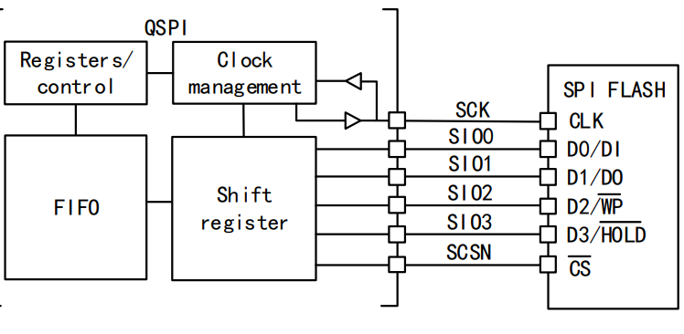

<table>
<colgroup>
<col style="width: 50%" />
<col style="width: 50%" />
</colgroup>
<thead>
<tr>
<th rowspan="2"></th>
<th></th>
</tr>
<tr>
<th></th>
</tr>
</thead>
<tbody>
</tbody>
</table>

说明

SPI（Serial Peripheral Interface）是 MOTOROLA
提出的四线同步串行协议，广泛用于连接LCD屏幕、FLASH、ADC及其他外设等。SPI外设则是为了SPI协议而设计的外设，具有速度快，灵活性高等特点。而QSPI外设则是专门用于兼容用于连接支持四线（Quad）传输模式的SPI闪存（如Quad-SPI
NOR Flash）等设备的增强型外设。

**适用范围**

| 适用范围 | 系列                |
|----------|---------------------|
| 通用MCU  | CH32H417 CH32V205等 |

目录

[说明 [1](#_Toc239781368)](#_Toc239781368)

[目录 [2](#_Toc239781369)](#_Toc239781369)

[表格索引 [2](#_Toc239781370)](#_Toc239781370)

[图片索引 [2](#_Toc239781371)](#_Toc239781371)

[第1章 SPI与QSPI [1](#spi与qspi)](#spi与qspi)

[1.1 SPI的简介 [1](#spi的简介)](#spi的简介)

[1.2 QSPI的介绍 [1](#qspi的介绍)](#qspi的介绍)

[1.2.1 可编程命令帧 [1](#可编程命令帧)](#可编程命令帧)

[1.2.2 功能模式 [1](#功能模式)](#功能模式)

[1.2.3 XIP能力 [2](#xip能力)](#xip能力)

[1.2.4 QSPI的功能框图 [2](#qspi的功能框图)](#qspi的功能框图)

[1.3 SPI与QSPI的对比 [3](#spi与qspi的对比)](#spi与qspi的对比)

[第2章 QSPI读取FLASH例程 [4](#qspi读取flash例程)](#qspi读取flash例程)

[2.1 QSPI 初始化 [4](#qspi-初始化)](#qspi-初始化)

[2.2 QSPI 进行读取 [4](#qspi-进行读取)](#qspi-进行读取)

[2.3 QSPI 进行写入 [5](#qspi-进行写入)](#qspi-进行写入)

[2.4 QSPI 轮询状态 [6](#qspi-轮询状态)](#qspi-轮询状态)

[历史版本 [8](#_Toc239781385)](#_Toc239781385)

[声明 [9](#_Toc239781386)](#_Toc239781386)

表格索引

[帧配置 [1](#_Toc239781387)](#_Toc239781387)

[SPI与QSPI对比 [3](#_Toc239781388)](#_Toc239781388)

图片索引

[QSPI框图 [2](#_Toc239781389)](#_Toc239781389)

# SPI与QSPI

## SPI的简介

SPI（Serial Peripheral Interface）是四线同步串行协议，需要引脚
MISO、MOSI、SCK、NSS。时钟（SCK）始终由主机产生，数据以全双工方式在
MOSI/MISO 上同拍收发；MISO/MOSI 在主从模式下的方向互换（主模式 MOSI
输出、MISO 输入，从模式反之）。

一般来说，SPI外设的使用比较灵活，用户可以选择字长（8/16位）、位序（MSB/LSB在前）以及四种时钟模式（由CPOL和CPHA组合决定）；在片选管理上，既支持通过软件配合GPIO灵活控制多个从机，也支持硬件自动管理NSS。

这样使得SPI外设可以支持几乎所有SPI设备的需要。

## QSPI的介绍

QSPI（QuadSPI）是目标用于连接 SPI FLASH
存储介质的主控制器。但是也可以连接其他兼容其协议的设备，如PSRAM，LCD屏幕等。相对SPI外设来说，QSPI的灵活性没有SPI高，但是QSPI可以同时使用多个IO进行传输，使得QSPI有更高的带宽。

QSPI使用的引脚为 SCK、SCSN、SIO0/SIO1/SIO2/SIO3，其中 SIO0-SIO3
是双向复用数据线，可单独组态为 1/2/4 线传输；不用 4
线的引脚可释放作其它用途。

### 可编程命令帧

QSPI在通信时，每次交互是一条命令，至多由五个阶段组成，任一阶段都可跳过，但是至少需要保留一个阶段，各阶段的线数（1/2/4）独立可配；对应的流程如下：

nCS↓ \| 指令 \| 地址 \| 交替字节 \| 空指令 \| 数据 \| nCS↑

对应 CCR 寄存器的字段：

| **阶段** | **对应可配置内容** | **配置内容** |
|----|----|----|
| 指令 | INSTRUCTION、IMODE | 8 位操作码（如 0x03 读、0x02 页写）；1/2/4 线 |
| 地址 | AR.ADDRESS、ADSIZE、ADMODE | 1~4 字节地址；1/2/4 线/无 |
| 交替字节 | ABR.ALTERNATE、ABSIZE、ABMODE | 地址后紧跟的控制字节（不常用） |
| 空指令 | DCYC | 空闲的 SCK 周期，供 设备 准备数据 |
| 数据 | DR/DLR、DMODE\[1:0\] | 任意长度数据，经 32 字节 FIFO 收发；1/2/4 线/无 |

表 1‑1 帧配置

IMODE/ADMODE/ABMODE/DMODE = 00b 即跳过对应阶段；DummyCycles = 0
略过空指令。整条帧由硬件组合完成，软件只需写各组成寄存器并给出最后一项自行开启。

### 功能模式

QSPI在配置命令时可以选择多种功能模式：

- 间接模式（00 写 / 01 读）：数据经 DR 寄存器 + 32 字节 FIFO 手动或 DMA
  搬移，DLR 指定字节数。适合频繁的读写。

- 自动轮询模式（10）：硬件周期性启动命令读取 FLASH 状态寄存器，按 PSMKR
  屏蔽、与 PSMAR 匹配，命中即置 SMF
  并可选中断。在实际使用中用于"等擦除/写周期结束"这类忙等待，替代软件循环读
  SR。

- 内存映射模式（11）：FLASH 映射进 CPU
  地址空间，当作内部存储器直接读（含 XIP 取指）；FIFO 作预取缓冲，可开
  TCEN 超时在空闲后释放 nCS 降功耗。仅支持读。

### XIP能力

QSPI 通过配置寄存器（CCR.FMODE=11b）使能内存映射模式，在此 XIP
模式下，QSPI
硬件将会接管总线中对应的一片地址区域——片上总线一旦命中该区域，QSPI
就会在访问时自动发起一次针对 SPI FLASH
的读帧，把片选拉低、地址、空指令、按需读数据的整个过程全部交由硬件组帧完成，软件无需逐字节操作寄存器，只需把这片区域当作普通只读存储器直接读即可；内部
32 字节 FIFO 充当预取缓冲以吸收连续读的吞吐，并可配置 TCEN
在空闲超时后自动拉高 nCS 以降低功耗。

但需要注意

- 仅支持读：XIP/内存映射模式下 FLASH
  只能当只读存储区直读，写、擦除等仍需切回间接模式（FMODE=00/01）操作。

- 时序完全硬件化：CCR（指令/线数）、AR（地址）、DCYC（空指令）、FIFO
  阈值等配置一次后即生效，后续所有命中均按同一帧自动执行。

- 配置前提：DCR.FSIZE
  声明的容量范围必须覆盖被访问的地址，否则命中超界地址会置 TEF标志。

### QSPI的功能框图

<figure>

<figcaption>
图 ‑1 QSPI框图
</figcaption>
</figure>

## SPI与QSPI的对比

|  | **SPI** | **QSPI** |
|----|----|----|
| 主从配置 | 通用收发器，可主可从 | 仅主，面向 SPI FLASH 存储介质 |
| 数据线 | MISO / MOSI 方向固定 | SIO0-3 双向复用，1/2/4 线可配 |
| 全双工 | 支持 | 否，读/写分时单向 |
| 帧组织 | 由用户自定义 | 五阶段（指令/地址/交替/空指令/数据）全可编程，集成地址与空指令 |
| nCS | 软件 GPIO 或硬件 NSS，支持多从 | 硬件 CS |
| 时钟模式 | CPOL/CPHA 四种模式 | 仅模式 0 / 模式 3（CKMODE），可等价 SPI 的模式 0 / 模式 3 |
| 状态等待 | 软件循环读状态寄存器判 BUSY | 硬件自动轮询，掩码+匹配命中置 SMF 或中断 |
| 内存映射 | 无 | 支持，FLASH 映射入地址空间直接读 / XIP |
| 最高读吞吐 | 1 × SCK | 单线同 SPI；4 线 = 4 × SCK |
| 双闪存 | 无 | DFM 双片并行，吞吐/容量翻倍 |
| 典型负载 | 传感器、ADC/DAC、小容量存储 | 大容量 NOR/NAND、代码存储、XIP |

表 1‑2 SPI与QSPI对比

# QSPI读取FLASH例程

本章介绍如何使用QSPI替代SPI来操作FLASH。

## QSPI 初始化

配置并初始化QSPI外设，设置时钟分频为2分频、SCK空闲时为高电平的Mode3模式、片选保持时间至少8个SCK周期，并将Flash大小设为22（对应2^23=8MB容量），同时选择单闪存FLASH1且禁用双闪存模式，最后调用初始化函数并设置FIFO阈值为4字节。

    QSPI_InitStructure.QSPI_Prescaler = 1;            /* 值+1 为分频：FSCK = FHCLK/2 */
    QSPI_InitStructure.QSPI_CKMode    = QSPI_CKMode_Mode3; /* CKMODE=1，空闲 SCK 高 */
    QSPI_InitStructure.QSPI_CSHTime   = QSPI_CSHTime_7Cycle; /* 命令间 nCS 高电平 >= 8 个 SCK */
    /* 外部容量 2^(FSIZE+1)=2^23=8MB；地址超界置 TEF */
    QSPI_InitStructure.QSPI_FSize     = 22;

    QSPI_InitStructure.QSPI_FSelect  = QSPI_FSelect_1;    /* 单闪存选 FLASH1 */
    QSPI_InitStructure.QSPI_DFlash   = QSPI_DFlash_Disable; /* DFM=0，不用双闪存 */
    QSPI_Init(QSPI1, &QSPI_InitStructure);
    QSPI_SetFIFOThreshold(QSPI1, 4);  /* FTHRES：FIFO 有效字节 */

## QSPI 进行读取

> 下面的代码用于QSPI通过单线读取FLASH中的数据，其效果与后续的SPI读取类似。

    /* 指令+地址走单线，数据单线；FastRead(0x0B) 带 8 个空指令周期（DCYC=8），
     * 在中高速率下给 FLASH 数据输出稳定时间，与普通读 0x03 不完全一致。 */
    QSPI_ComConfig_InitStructure.QSPI_ComConfig_IMode  = QSPI_ComConfig_IMode_1Line;
    QSPI_ComConfig_InitStructure.QSPI_ComConfig_ADMode = QSPI_ComConfig_ADMode_1Line;
    QSPI_ComConfig_InitStructure.QSPI_ComConfig_DMode  = QSPI_ComConfig_DMode_1Line;
    QSPI_ComConfig_InitStructure.QSPI_ComConfig_FMode  = QSPI_ComConfig_FMode_Indirect_Read; /* 间接读模式 */
    QSPI_ComConfig_InitStructure.QSPI_ComConfig_ADSize = QSPI_ComConfig_ADSize_24bit; /*  地址宽度24位 */
    QSPI_ComConfig_InitStructure.QSPI_ComConfig_Ins    = FLASH_CMD_FastRead; /* 0x0B */
    QSPI_ComConfig_InitStructure.QSPI_ComConfig_DummyCycles = 8; /*  空指令周期=8 */
    QSPI_ComConfig_Init(QSPI1, &QSPI_ComConfig_InitStructure);
    QSPI_SetAddress(QSPI1, addr);           /* ADDRESS：24 位目标地址 */
    QSPI_SetDataLength(QSPI1, len);         /* DLR：待读字节数 */
    QSPI_Rx_DMA(data, len);                 /* DMA, 从 DR 迁走 len 字节 */
    QSPI_DMACmd(QSPI1, ENABLE);             /* DMAEN */
    QSPI_Start(QSPI1);
    DMA_Cmd(DMA2_Channel1, ENABLE);

    while (DMA_GetFlagStatus(DMA2, DMA_FLAG_TC1) == RESET) /* 等 DMA 搬完 */
        ;

配置QSPI通信参数为指令、地址和数据全部采用单线模式，使用快速读指令0x0B并设置8个空指令周期以提供数据输出稳定时间，然后调用通信配置初始化函数，接着设置目标地址和待读取数据长度，启动DMA传输并将数据从QSPI数据寄存器搬移到内存，使能QSPI的DMA功能并启动QSPI传输，同时使能DMA通道后等待DMA传输完成标志置位。这样就完成了一次读取。

下面为效果相似的SPI代码：

        GPIO_WriteBit(GPIOA, GPIO_Pin_2, 0);  /*  拉低片选（nCS），选中FLASH设备，开始通信 */
        SPI1_ReadWriteByte(FLASH_CMD_FastRead);  /*  发送快速读指令（0x0B） */
        SPI1_ReadWriteByte((u8)((ReadAddr) >> 16));  /*  发送24位地址的高8位 */
        SPI1_ReadWriteByte((u8)((ReadAddr) >> 8));   /*  发送24位地址的中间8位 */
        SPI1_ReadWriteByte((u8)ReadAddr);            /*  发送24位地址的低8位 */
        SPI1_ReadWriteByte((u8)DUMMY_BYTE);          /*  发送一个空指令周期（Dummy Byte） */

        for (i = 0; i < size; i++)  /*  循环读取数据 */
        {
            pBuffer[i] = SPI1_ReadWriteByte(0XFF);  /*  发送一个0xFF（产生SCK时钟），同时读取一个字节并存入缓冲区 */
        }

        GPIO_WriteBit(GPIOA, GPIO_Pin_2, 1);  /*  拉高片选，结束本次通信 */

## QSPI 进行写入

> 下面的代码用于QSPI通过单线向FLASH中写入的数据，其效果与后续的SPI写入一致。

    /*  配置QSPI通信参数：指令、地址、数据均采用单线模式 */
    QSPI_ComConfig_InitStructure.QSPI_ComConfig_IMode  = QSPI_ComConfig_IMode_1Line;
    QSPI_ComConfig_InitStructure.QSPI_ComConfig_ADMode = QSPI_ComConfig_ADMode_1Line;
    QSPI_ComConfig_InitStructure.QSPI_ComConfig_DMode  = QSPI_ComConfig_DMode_1Line;
    QSPI_ComConfig_InitStructure.QSPI_ComConfig_FMode = QSPI_ComConfig_FMode_Indirect_Write;  /*  间接写模式 */
    QSPI_ComConfig_InitStructure.QSPI_ComConfig_ADSize = QSPI_ComConfig_ADSize_24bit; /*  地址宽度24位 */
    QSPI_ComConfig_InitStructure.QSPI_ComConfig_Ins = FLASH_CMD_PageProgram; /*  页编程指令（0x02） */
    QSPI_ComConfig_InitStructure.QSPI_ComConfig_DummyCycles = 0; /*  无空指令周期 */
    QSPI_ComConfig_Init(QSPI1, &QSPI_ComConfig_InitStructure); 

    QSPI_SetAddress(QSPI1, addr);  /*  设置24位目标起始地址 */
    QSPI_SetDataLength(QSPI1, len); /*  设置待写入数据长度 */

    QSPI_DMACmd(QSPI1, ENABLE);    /*  使能QSPI的DMA功能 */
    QSPI_Tx_DMA(data, len);        /*  配置DMA从内存将len字节数据搬移到QSPI发送寄存器 */
    DMA_Cmd(DMA2_Channel1, ENABLE); /*  使能DMA通道开始传输 */

    QSPI_Start(QSPI1);             /*  启动QSPI通信，开始发送指令+地址+数据 */

    while (DMA_GetFlagStatus(DMA2, DMA_FLAG_TC1) == RESET) /*  等待DMA传输完成标志 */
    {
    }

上面的代码配置QSPI为单线模式、间接写模式，使用24位地址和页编程指令（0x02），无交替字节和空指令周期，初始化后设置目标地址和数据长度，使能QSPI的DMA功能并通过DMA将内存数据搬移到发送寄存器，随后启动QSPI传输，并循环等待DMA传输完成标志以确认数据已全部发送完毕。

下面为效果相似的SPI代码：

    GPIO_WriteBit(GPIOA, GPIO_Pin_2, 0);  /*  拉低片选（nCS） */
    SPI1_ReadWriteByte(FLASH_CMD_PageProgram); /*  发送页编程指令（0x02）*/
    SPI1_ReadWriteByte((u8)((WriteAddr) >> 16)); /*  发送24位目标地址的高8位 */
    SPI1_ReadWriteByte((u8)((WriteAddr) >> 8));  /*  发送24位目标地址的中间8位 */
    SPI1_ReadWriteByte((u8)WriteAddr);           /*  发送24位目标地址的低8位 */

    for (i = 0; i < size; i++)  /*  循环写入数据 */
    {
        SPI1_ReadWriteByte(pBuffer[i]);  /*  逐个字节将待写入数据发送给FLASH */
    }

    GPIO_WriteBit(GPIOA, GPIO_Pin_2, 1);  /*  拉高片选，结束通信，触发FLASH内部编程执行 */

## QSPI 轮询状态

在实际使用 SPI 时，常需要用到轮询来检查外设状态——最典型的例子就是在对
SPI FLASH 做擦除或页写之后，反复读取状态寄存器判断忙等（BUSY）是否结束：

    uint8_t sr = 0;  /*  定义状态寄存器变量 */
    do 
    {
        Delay_Ms(1);  /*  延时1ms */
        GPIO_WriteBit(GPIOA, GPIO_Pin_2, 0);  /*  拉低片选 */
        SPI1_ReadWriteByte(FLASH_CMD_ReadStatus_REG1);  /*  发送读取状态寄存器1指令（0x05） */
        sr = SPI1_ReadWriteByte(0Xff);  /*  发送0xFF产生时钟，同时读取状态寄存器1的值 */
        GPIO_WriteBit(GPIOA, GPIO_Pin_2, 1);  /*  拉高片选*/
        
    } while ((sr & 0x01) == 0x01);  /*  检查状态寄存器最低位（BUSY位），若为1表示FLASH正忙，则循环等待 */

这种写法每轮都占用 CPU。QSPI 的自动轮询模式（Auto-polling
Mode）就是为此设计的硬件化替代：软件只需一次性配置"去读哪条状态命令、检查哪几位、匹配到何值就认为完成"，之后
QSPI 硬件便按设定的间隔自动发起读帧、自判位、命中即置 SMF
标志（可选中断），整个过程不需要CPU反复介入：

    /* 读 SR1(0x05，单线)，掩码 0x01 只关注 BUSY 位（PSMKR），
     * 匹配希望值 0x00（即不再忙，PSMAR），PMM_AND 全位匹配；命中置 SMF。 */
    QSPI_AutoPollingMode_Config(QSPI1, 0x0000, 0x01, QSPI_PMM_AND);
    QSPI_AutoPollingModeStopCmd(QSPI1, ENABLE);      /* APMS：命中即停 */
    QSPI_AutoPollingMode_SetInterval(QSPI1, 2500);   /* 轮询间隔*/
    QSPI_ComConfig_InitStructure.QSPI_ComConfig_Ins = FLASH_CMD_ReadStatus_REG1; /* 0x05 */
    QSPI_ComConfig_InitStructure.QSPI_ComConfig_FMode = QSPI_ComConfig_FMode_Auto_Polling;
    QSPI_Start(QSPI1);
    while (QSPI_GetFlagStatus(QSPI1, QSPI_FLAG_SM) == RESET) /* 等状态匹配 */
        ;

历史版本

| 日期     | 版本 | 变更内容 |
|----------|------|----------|
| 2026/7/8 | V1.0 | 初版发行 |

声明

本手册仅供参考。作者在不另行通知的情况下，可随时进行修改。
