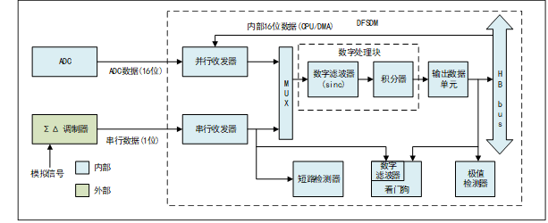
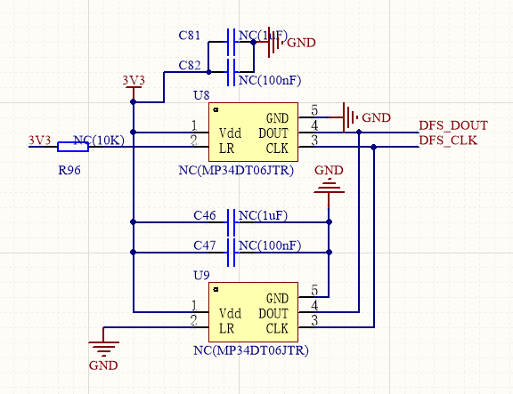
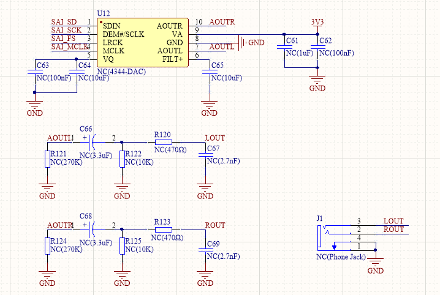

<table>
<colgroup>
<col style="width: 49%" />
<col style="width: 50%" />
</colgroup>
<thead>
<tr>
<th rowspan="2"></th>
<th>AN31001</th>
</tr>
<tr>
<th>V1.0</th>
</tr>
</thead>
<tbody>
</tbody>
</table>

<span id="_Toc239075378" class="anchor"></span>说明

CH32H417内部集成了一种专用于外部ΣΔ调制器的高性能数字滤波器模块DFSDM。DFSDM包含数字串行接口和2
个数字滤波器，通过串行接口可对外部ΣΔ调制器输出的串行数据流进行滤波。此外，DFSDM还特有可选择来自内部ADC
外设或者设备存储器的并行数据流输入。本文说明了DFSDM的框图结构及主要组成模块，并介绍使用DFSDM采集PDM立体声麦克风数据由SAI接口进行音频输出的方法。

**适用范围**

| 适用范围 | 系列     |
|----------|----------|
| 通用MCU  | CH32H417 |

<span id="_Toc239075379" class="anchor"></span>目录

[说明 [1](#_Toc239075378)](#_Toc239075378)

[目录 [2](#_Toc239075379)](#_Toc239075379)

[表格索引 [2](#_Toc239075380)](#_Toc239075380)

[图片索引 [2](#_Toc239075381)](#_Toc239075381)

[第1章 功能描述 [1](#功能描述)](#功能描述)

[1.1 DFSDM框图 [1](#dfsdm框图)](#dfsdm框图)

[1.2 DFSDM 组件 [1](#dfsdm-组件)](#dfsdm-组件)

[1.3 ΣΔ调制器 [2](#σδ调制器)](#σδ调制器)

[第2章 MAC音频采集案例 [3](#mac音频采集案例)](#mac音频采集案例)

[2.1 概述 [3](#概述)](#概述)

[2.2 通道输入选择 [3](#通道输入选择)](#通道输入选择)

[2.3 立体声采集原理图 [3](#立体声采集原理图)](#立体声采集原理图)

[2.4 时钟与音频采样率 [4](#时钟与音频采样率)](#时钟与音频采样率)

[2.5 外设配置 [5](#外设配置)](#外设配置)

[2.5.1 三级标题 [8](#_Toc239075392)](#_Toc239075392)

[历史版本 [10](#_Toc239075393)](#_Toc239075393)

[声明 [11](#_Toc239075394)](#_Toc239075394)

<span id="_Toc239075380" class="anchor"></span>表格索引

[音频数据输出速率 [5](#_Toc239075395)](#_Toc239075395)

<span id="_Toc239075381" class="anchor"></span>图片索引

[DFSDM外设框图 [1](#_Toc239075396)](#_Toc239075396)

[DFSDM与 ΣΔ调制器连接图 [2](#_Toc239075397)](#_Toc239075397)

[麦克风与DFSDM连接图 [3](#_Toc239075398)](#_Toc239075398)

[立体声采集原理图 [4](#_Toc239075399)](#_Toc239075399)

# 功能描述

## DFSDM框图

<figure>

<figcaption><p>图 1‑1 <span id="_Toc239075396"
class="anchor"></span>DFSDM外设框图</p></figcaption>
</figure>

上图展示了CH32H417系列DFSDM外设框图，串行收发器接收外部ΣΔ调制器的数据与时钟（SPI协议）；并行路径可选内部ADC或存储器数据。输入通道经复用器连接滤波通道，滤波层每通道含可配置阶数的Sinc滤波器和可选积分器，对1位数据流进行抽取、累加、平均，降低数据率并提升分辨率。处理后数据经HB总线供CPU/DMA读取。此外提供模拟看门狗（阈值监控）、短路检测器（监测连续相同逻辑值）、极值检测器（记录输出极值）等功能。

## DFSDM 组件

串行收发器

该外设有2
个复用串行数据通道，可以通过各个滤波器、模拟看门狗或者短路检测器将其选择用于转换。这些串行收发器接收来自外部ΣΔ
调制器的数据流。数据流能以SPI 格式进行发送。

- 并行收发器

并行收发器是一个内部16位并行输入寄存器，可通过
HB总线由CPU/DMA访问，或者直接由内部ADC访问。其功能在于对内部信号进行后期处理。使用示例：

对内部ADC捕获的数据进行滤波；

对存储器缓冲区中保存的任何16位数据进行滤波（DMA传输到DFSDM并行收发器）

- 数字滤波器

DFSDM
包含Sincx类型数字滤波器实现。此Sincx滤波器执行输入数字数据流滤波，这会导致减小输出数据速率（抽取）以及增大输出数据分辨率。可对Sincx数字滤波器进行配置，以达到所需输出数据速率和所需输出数据分辨率。可配置参数有：

- 滤波器阶数/类型： FastSinc、Sinc1...Sinc5

- 滤波器过采样/抽取率：

\- FOSR=1-1024——适用于FastSinc滤波器和Sincx滤波器x=FORD=1..3

\- FOSR=1-215——适用于Sincx滤波器x=FORD=4

\- FOSR=1-73——适用于Sincx滤波器x=FORD=5

- Sincx滤波器类型：

> 
> ``` math
> H(z) = \left( \frac{1 - z^{- FOSR}}{1 - z^{- 1}} \right)^{x}
> ```

- FastSinc滤波器类型：

> 
> ``` math
> \left( \frac{1 - z^{- FOSR}}{1 - z^{- 1}} \right)^{2} \times （1 + z^{- （2 \times FOSR）}）
> ```

- 积分器

积分器会对来自数字滤波器的数据进一步提升抽取率和分辨率。对于来自滤波器的给定数量的数据采样，积分器对其进行简单的求和。积分器过采样率参数定义了将多少个数据的和作为积分器的一个数据输出。IOSR
可设置为介于1～256 范围内。

- 输出数据单元

输出数据单元执行最终校正，这包括向右移位，以及对来自积分器的数据执行偏移校正。向右移位用于：将32位内部输出适配到最终的24位寄存器中；进一步限制最终分辨率（例如，在音频数据的情况下为16位）。偏移校正可校准外部ΣΔ调制器的偏移误差。

- 模拟看门狗

模拟看门狗用于在达到或超出给定阈值上限或者达到或低于给定阈值下限时，触发外部信号（断路或中断）。可以通过专用的可配置数字滤波器（FOSR=1...32，FORD=1...3），直接从串行收发器监控串行数据。模拟看门狗滤波器转换的工作方式类似于常规的快速连续转换（无积分器）。

- 短路检测器

使用短路检测器的目的在于，当模拟信号超出满量程范围并保持给定的时间时，短路检测器可以在极快的响应时间内发出信号。该特性可检测短路或断路故障（例如过流或过压）。

短路检测器的输入数据取自通道收发器输出。各个输入通道上都有一个递增计数器，用于对串行数据接收器输出上的连续0
或1
进行计数。如果该计数器达到短路阈值寄存器值，则会调用短路事件，否则会重新计数。

- 极值检测器

极值检测器简单地分析最终输出数据样本，将最小值和最大值存储到极值寄存器中。通过读
取这些极值寄存器，可以在一段时间内监控转换信号的最大和最小电平。

## ΣΔ调制器

外部ΣΔ调制器作为CH32H417微控制器DFSDM外设所需的模拟前端，承担模数转换的核心任务。它利用内部的1位模数转换器对模拟输入信号进行高速采样，生成由逻辑0和1交替构成的串行数据流（DATA与CLK信号）。在足够长的观测时间内，该位流中逻辑1所占的平均比例，即反映了同一时间段内模拟输入信号的平均幅度；而这一平均周期的长短，直接决定了采样结果的精度。

<figure>

<figcaption><p>图 1‑2 <span id="_Toc239075397"
class="anchor"></span>DFSDM与 ΣΔ调制器连接图</p></figcaption>
</figure>

随后，DFSDM获取并处理该1位流，通过数字滤波与均值运算，输出数据样本。相较于输入的位流速率，DFSDM以更低的输出数据速率和更高的分辨率提供结果，用户可通过配置其数字滤波器参数，灵活设定所需的分辨率与数据速率，以满足不同应用场景对分辨率与输出数据速率的要求。

除基本滤波功能外，DFSDM还集成了多种与ADC相关的辅助特性：每个通道均配备独立的模拟看门狗，用于检测输入信号是否超出预设的最小或最大电压阈值；每个通道还包含短路检测器，当输入电压达到某个模拟量程极限并持续超过预设时长时发出指示；此外，极值检测器可记录输入电压偏移的最小值和最大值，方便追踪信号动态范围。

# MAC音频采集案例

## 概述

在音频应用领域的标准化规定中，PDM（脉冲密度调制）是数字麦克风常用的输出格式。由于
PDM 信号本质上等效于 ΣΔ 调制信号，因此 DFSDM 可以直接支持 PDM 信号。

数字麦克风需要外部为其提供时钟信号（即麦克风的 CLK 输入），数据则作为
PDM 调制信号通过 DATA 线发送，时钟频率通常在 1 MHz 至 3.2 MHz
之间。DFSDM 模块通过其输出信号 DFSDM_CKOUT
为麦克风提供该时钟，该时钟决定了麦克风输出数据的速率，DFSDM
使用该时钟的边沿同步捕获 DATA 线上的 PDM
数据，并进行后续处理。立体声数字麦克风和DFSDM之间典型接线图如下。

<figure>

<figcaption><p>图 2‑1<span id="_Toc239075398"
class="anchor"></span>麦克风与DFSDM连接图</p></figcaption>
</figure>

## 通道输入选择

DATINy和CKINy引脚的串行输入（数据和时钟信号）可从后续通道引脚重定向。通道重定向可用于从PDM（脉冲密度调制）立体声麦克风中采集音频数据。PDM立体声麦克风包含一个数据和一个时钟信号，其中数据信号为左右音频通道提供信息（时钟上升沿采样用于左通道，时钟下降沿采样用于右通道）。

PDM麦克风输入串行通道的配置：

- PDM麦克风信号（数据、时钟）将连接到DFSDM输入串行通道y（DATINy，CKOUT）引脚

- 将通道y进行以下配置：CHINSEL=0（输入来自给定通道引脚：DATINy和CKINy）

- 将通道(y-1)（模2）进行以下配置：

> CHINSEL=1（输入来自后续通道（(y-1)+1）引脚：DATINy和CKINy）

- 通道y：SITP=0（上升沿选通数据）即通道y的左音频通道

- 通道(y-1)：SITP=1（下降沿选通数据）即通道y-1的右音频通道

- 两个DFSDM滤波器将分配至通道y和通道(y-1)（用于对PDM麦克风的左右通道进行滤波）

## 立体声采集原理图

DFSDM模块使用两个串行通道与外部两个ΣΔ调制器连接，而信号线是共享一组DATA
和CLK 信号线。

<figure>

<figcaption><p>图 2‑2<span id="_Toc239075399"
class="anchor"></span>立体声采集原理图</p></figcaption>
</figure>



## 时钟与音频采样率

DFSDM要输出指定采样频率的音频数据，需要配置DFSDM模块CKOUT时钟、通道滤波器参数和积分器参数。使用串行数据流作为输入源，DFSDM输出音频数据的计算公式如下表。

<table style="width:90%;">
<caption><p>表 2‑1<span id="_Toc239075395"
class="anchor"></span>音频数据输出速率</p></caption>
<colgroup>
<col style="width: 13%" />
<col style="width: 21%" />
<col style="width: 22%" />
<col style="width: 33%" />
</colgroup>
<thead>
<tr>
<th style="text-align: center;">输入源</th>
<th style="text-align: center;">转换模式</th>
<th style="text-align: center;">滤波器类型</th>
<th style="text-align: center;">输出数据速率(采样数/秒)</th>
</tr>
</thead>
<tbody>
<tr>
<td rowspan="3" style="text-align: center;">串行输入</td>
<td style="text-align: center;"><p>FAST=0，</p>
<p>非快速转换模式</p></td>
<td style="text-align: center;">Sinc<sup>x</sup></td>
<td style="text-align: center;"><span
class="math display">$$\frac{f_{CKOUT}}{F_{OSR}*\left( 2^{IOSR} +
F_{ORD} + 1 \right) + 2}$$</span></td>
</tr>
<tr>
<td style="text-align: center;"><p>FAST=0，</p>
<p>非快速转换模式</p></td>
<td style="text-align: center;">FastSinc</td>
<td style="text-align: center;"><span
class="math display">$$\frac{f_{CKOUT}}{F_{OSR}*\left( 2^{IOSR} + 5
\right) + 2}$$</span></td>
</tr>
<tr>
<td style="text-align: center;"><p>FAST=1，</p>
<p>快速转换模式</p></td>
<td style="text-align: center;">Sinc<sup>x</sup>，FastSinc</td>
<td style="text-align: center;"><span
class="math display">$$\frac{f_{CKOUT}}{F_{OSR}*2^{IOSR}}$$</span></td>
</tr>
</tbody>
</table>

注：表中FOSR表示Sinc
滤波器过采样率，积分器过采样率为2IOSR，IOR表示积分器过采样率，fCKOUT表示DFSDM输出的时钟CKOUT

## 外设配置

以快速模式为例，假设要配置的音频采样率FS =
16KHz，DFSDM模块的滤波器选择3阶Sinc滤波器，过采样率为128，积分采样率为1（积分器旁路），则fCKOUT
= FS \* FOSR =
2.048MHz。如果DFSDM输出串行时钟源来自音频时钟，系统时钟SYSCLK =
295MHz，输出串行时钟分频系数应设置为144。SAI主时钟分频器MCLKDIV =
(SYSCLK / 6) / (FS \* 256)= 12。

    void DFSDM_Function_Init(void)
    {
        DFSDM_ChannelInitTypeDef DFSDM_ChannelInitStructure = {0};
        DFSDM_FilterInitTypeDef DFSDM_FilterInitStructure = {0}; 
        DFSDM_RcInitTypeDef DFSDM_RcInitStructure = {0};

        RCC_HB2PeriphClockCmd(RCC_HB2Periph_DFSDM, ENABLE);

        /* Configure output serial clock source and divider */
        DFSDM_OutSerialClkConfig(DFSDM_AudioClk, ClkoutDiv);

        /* initialize the parameters of DFSDM */
        DFSDM_ChannelStructInit(&DFSDM_ChannelInitStructure);
        DFSDM_FilterStructInit(&DFSDM_FilterInitStructure);
        DFSDM_RcStructInit(&DFSDM_RcInitStructure);

        /* initialize DFSDM channel 0 */
        DFSDM_ChannelInitStructure.DFSDM_ChAWDSincFilterOrder = DFSDM_AWD_FastSinc;
        DFSDM_ChannelInitStructure.DFSDM_ChAWDFilterOverSample = DFSDM_AWD_FLT_Bypass;
        DFSDM_ChannelInitStructure.DFSDM_ChSPIClockSource = DFSDM_InternalClkOut;
        DFSDM_ChannelInitStructure.DFSDM_ChSerialInterface = DFSDM_SPIFalling;
        DFSDM_ChannelInitStructure.DFSDM_ChCalibrationOffset = 0;
        DFSDM_ChannelInitStructure.DFSDM_ChDataPackMode = DFSDM_StandardMode;
        DFSDM_ChannelInitStructure.DFSDM_ChDataMultiplexer = DFSDM_SerialInput;
        DFSDM_ChannelInitStructure.DFSDM_ChInPinSelect = DFSDM_SelectNext;
        DFSDM_ChannelInitStructure.DFSDM_ChShortCircuitDetMode = ENABLE;
        DFSDM_ChannelInitStructure.DFSDM_ChSCDCntthreshold = SCDCntthreshold;
        DFSDM_ChannelInitStructure.DFSDM_ChDataRightBitShift = DataRightBitShift;
        DFSDM_ChannelInit(DFSDM_Channel0, &DFSDM_ChannelInitStructure);  

        /* initialize DFSDM channel 1 */
        DFSDM_ChannelInitStructure.DFSDM_ChAWDSincFilterOrder = DFSDM_AWD_FastSinc;
        DFSDM_ChannelInitStructure.DFSDM_ChAWDFilterOverSample = DFSDM_AWD_FLT_Bypass;
        DFSDM_ChannelInitStructure.DFSDM_ChSPIClockSource = DFSDM_InternalClkOut;
        DFSDM_ChannelInitStructure.DFSDM_ChSerialInterface = DFSDM_SPIRising;  
        DFSDM_ChannelInitStructure.DFSDM_ChInPinSelect = DFSDM_SelectCurrent; 
        DFSDM_ChannelInitStructure.DFSDM_ChSCDCntthreshold = SCDCntthreshold; 
        DFSDM_ChannelInitStructure.DFSDM_ChDataRightBitShift = DataRightBitShift; 
        DFSDM_ChannelInit(DFSDM_Channel1, &DFSDM_ChannelInitStructure);  

        /* initialize DFSDM filter 0 and filter 1 */ 
        DFSDM_FilterInitStructure.DFSDM_FltSincOrder = FLT_SincOrder;
        DFSDM_FilterInitStructure.DFSDM_FltOverSample = FLT_OverSample;
        DFSDM_FilterInitStructure.DFSDM_FltIntegratorOverSample = FLT_IntegrOverSample;
        DFSDM_FilterInit(DFSDM_FLT0, &DFSDM_FilterInitStructure);
        DFSDM_FilterInit(DFSDM_FLT1, &DFSDM_FilterInitStructure);  

        /* initialize DFSDM filter 0 regular conversions */
        DFSDM_RcInitStructure.DFSDM_RcChannel = DFSDM_RC_Channel0;
        DFSDM_RcInitStructure.DFSDM_RcContinuousMode = ENABLE;
        DFSDM_RcInitStructure.DFSDM_RcFastMode = ENABLE;
        DFSDM_RcInitStructure.DFSDM_RcDMAMode = ENABLE;
        DFSDM_RcInit(DFSDM_FLT0, &DFSDM_RcInitStructure);

        /* initialize DFSDM filter 1 regular conversions */
        DFSDM_RcInitStructure.DFSDM_RcChannel = DFSDM_RC_Channel1;
        DFSDM_RcInitStructure.DFSDM_RcContinuousMode = ENABLE;
        DFSDM_RcInitStructure.DFSDM_RcFastMode = ENABLE;
        DFSDM_RcInitStructure.DFSDM_RcDMAMode = ENABLE;
        DFSDM_RcInit(DFSDM_FLT1, &DFSDM_RcInitStructure);
        
        /* enable DFSDM channel 0 and channel 1*/
        DFSDM_ChannelCmd(DFSDM_Channel0, ENABLE);
        DFSDM_ChannelCmd(DFSDM_Channel1, ENABLE);

        /* enable DFSDM filter 0 and filter 1 */
        DFSDM_FilterCmd(DFSDM_FLT0, ENABLE);
        DFSDM_FilterCmd(DFSDM_FLT1, ENABLE);

        /* enable DFSDM interface */
        DFSDM_Cmd(ENABLE);
        
        /* enable regular channel conversion by software */
        DFSDM_RcSoftStartConversion(DFSDM_FLT0);
        DFSDM_RcSoftStartConversion(DFSDM_FLT1);
    }

    void SAI_Config(uint32_t SampleRate)
    {

        SAI_InitTypeDef      SAI_InitStructure      = {0};
        SAI_FrameInitTypeDef SAI_FrameInitStructure = {0};
        SAI_SlotInitTypeDef  SAI_SlotInitStructure  = {0};

        RCC_HB2PeriphClockCmd(RCC_HB2Periph_SAI, ENABLE);

        /* The SAI Clock configuration is calculated as follows:
        SAI_CK_x  = SysClk / 6
        MCLK_x = SAI_CK_x / MCKDIV[5:0] with MCLK_x = 256 * FS
        FS = SAI_CK_x / (MCKDIV[5:0] * 256)
        MCKDIV[5:0] = (SysClk / 6) / (FS * 256) */

        RCC_ClocksTypeDef RCC_ClocksStatus = {0};
        RCC_GetClocksFreq(&RCC_ClocksStatus);

        const uint32_t tmpdiv = (RCC_ClocksStatus.SYSCLK_Frequency / 6) / (SampleRate * 256);

        SAI_InitStructure.SAI_NoDivider     = SAI_MasterDivider_Enabled;
        SAI_InitStructure.SAI_MasterDivider = tmpdiv;
        SAI_InitStructure.SAI_AudioMode     = SAI_Mode_MasterTx;
        SAI_InitStructure.SAI_Protocol      = SAI_Free_Protocol;
        SAI_InitStructure.SAI_DataSize      = SAI_DataSize_16b;
        SAI_InitStructure.SAI_FirstBit      = SAI_FirstBit_MSB;
        SAI_InitStructure.SAI_ClockStrobing = SAI_ClockStrobing_RisingEdge;
        SAI_InitStructure.SAI_Synchro       = SAI_Asynchronous;
        SAI_InitStructure.SAI_FIFOThreshold = SAI_FIFOThreshold_HalfFull;
        SAI_Init(SAI_Block_A, &SAI_InitStructure);

        SAI_FrameInitStructure.SAI_FrameLength       = 32;
        SAI_FrameInitStructure.SAI_ActiveFrameLength = 16;
        SAI_FrameInitStructure.SAI_FSDefinition      = SAI_FS_StartFrame;
        SAI_FrameInitStructure.SAI_FSPolarity        = SAI_FS_ActiveLow;
        SAI_FrameInitStructure.SAI_FSOffset          = SAI_FS_FirstBit;
        SAI_FrameInit(SAI_Block_A, &SAI_FrameInitStructure);

        SAI_SlotInitStructure.SAI_FirstBitOffset = 0;
        SAI_SlotInitStructure.SAI_SlotSize       = SAI_SlotSize_DataSize;
        SAI_SlotInitStructure.SAI_SlotNumber     = 2;
        SAI_SlotInitStructure.SAI_SlotActive     = SAI_SlotActive_ALL;
        SAI_SlotInit(SAI_Block_A, &SAI_SlotInitStructure);

        SAI_FlushFIFO(SAI_Block_A);

        NVIC_EnableIRQ(SAI_IRQn);
        NVIC_SetPriority(SAI_IRQn, 1);

        SAI_Cmd(SAI_Block_A, ENABLE);
    }

DFSDM用于采集外部PDM麦克风数据。初始化时先开启DFSDM时钟，并配置 CKOUT
输出时钟由音频时钟分频得到，用于驱动外部PDM麦克风。配置DFSDM通道0和通道1分别采集左右声道数据，通道时钟源选择内部，数据输入采用串行模式，滤波器采用相同的Sinc抽取参数，并通过DMA连续搬运转换结果。最终，PDM比特流经DFSDM
滤波后转换为PCM数据。SAI用于输出PCM音频数据。根据目标采样率计算主时钟分频系数，SAI配置为主发送模式，数据宽度16bit，双声道输出，帧长度32bit，每帧包含左右两个16bit
Slot，适用于标准立体声音频传输。

<span id="_Toc239075393" class="anchor"></span>历史版本

| 日期     | 版本 | 变更内容 |
|----------|------|----------|
| 2026/7/8 | V1.0 | 初版发行 |

<span id="_Toc239075394" class="anchor"></span>声明

本手册版权所有为南京沁恒微电子股份有限公司（Copyright © Nanjing Qinheng
Microelectronics Co., Ltd. All Rights
Reserved），未经南京沁恒微电子股份有限公司书面许可，任何人不得因任何目的、以任何形式（包括但不限于全部或部分地向任何人复制、泄露或散布）不当使用本产品手册中的任何信息。

任何未经允许擅自更改本产品手册中的内容与南京沁恒微电子股份有限公司无关。

南京沁恒微电子股份有限公司所提供的说明文档只作为相关产品的使用参考，不包含任何对特殊使用目的的担保。南京沁恒微电子股份有限公司保留更改和升级本产品手册以及手册中涉及的产品或软件的权利。

参考手册中可能包含少量由于疏忽造成的错误。已发现的会定期勘误，并在再版中更新和避免出现此类错误。
