AN36000

V1.0

# 说明

CH32V467是南京沁恒微电子基于青稞RISC-V3V内核设计的工业级互联型微控制器，系统主频高达200MHz。该芯片在CH32V407的基础上，额外内置了4MB/8MB的片内扩展PSRAM存储器，为数据密集型应用提供了充足的存储资源。

PSRAM（Pseudo Static
RAM）是一种伪静态随机存储器，相较于传统SDRAM，PSRAM功耗更低，同时比SRAM具有更高的存储密度和更优的成本效益。CH32V467内置的PSRAM通过芯片内部总线直接与内核和DMA控制器相连，支持高达600MB/s的数据传输速率，非常适合图形显示、音频处理、数据采集等大容量数据缓存场景。

本手册旨在帮助开发人员快速掌握CH32V467内置PSRAM的功能特性、配置方法和典型应用。

适用范围

| 适用范围 | 系列     |
|----------|----------|
| 通用MCU  | CH32V467 |

目录

[说明 [i](#说明)](#说明)

[目录 [ii](#_Toc207035732)](#_Toc207035732)

[表格索引 [ii](#_Toc207035733)](#_Toc207035733)

[图片索引 [ii](#_Toc207035734)](#_Toc207035734)

[第1章 PSRAM功能特性 [3](#psram功能特性)](#psram功能特性)

> [1.1 PSRAM基本框架原理 [3](#psram基本框架原理)](#psram基本框架原理)
>
> [1.1.1 PSRAM电源 [3](#psram电源)](#psram电源)
>
> [1.1.2 PSRAM时钟 [4](#psram时钟)](#psram时钟)
>
> [1.2 PSRAM特性 [5](#psram特性)](#psram特性)

[第2章 配置方法 [6](#配置方法)](#配置方法)

> [2.1 PSRAM初始化配置 [6](#psram初始化配置)](#psram初始化配置)
>
> [2.1.1 PSRAM时钟初始化 [6](#psram时钟初始化)](#psram时钟初始化)
>
> [2.1.2 PSRAM控制器配置 [6](#psram控制器配置)](#psram控制器配置)
>
> [2.1.3 PSRAM写Latency配置
> [8](#psram写latency配置)](#psram写latency配置)
>
> [2.1.4 PSRAM读Latency配置
> [9](#psram读latency配置)](#psram读latency配置)
>
> [2.2 PSRAM低功耗 [12](#psram低功耗)](#psram低功耗)

[第3章 读写应用 [13](#读写应用)](#读写应用)

> [3.1 CPU读写 [13](#cpu读写)](#cpu读写)
>
> [3.2 专用DMA读写 [13](#专用dma读写)](#专用dma读写)
>
> [3.3 问题查找 [15](#问题查找)](#问题查找)

[历史版本 [16](#历史版本)](#历史版本)

[声明 [17](#_Toc207035742)](#_Toc207035742)

表格索引

[表 1‑1适用范围 [i](#_Toc207094845)](#_Toc207094845)

[表 2‑1更新内容 [16](#_Toc207094846)](#_Toc207094846)

图片索引

[图 1‑1 PSRAM框架 [3](#_Toc207035713)](#_Toc207035713)

[图 1‑2 PSRAM电源框架 [4](#_Toc233030393)](#_Toc233030393)

[图 1‑3 VDD18框架 [4](#_Toc233030394)](#_Toc233030394)

[图 1‑4 PSRAM时钟来源 [4](#_Toc233030395)](#_Toc233030395)

[图 2‑1 PSRAM时钟配置 [6](#_Toc207094874)](#_Toc207094874)

[图 2‑2 PSRAM读写周期范围 [7](#_Toc233030397)](#_Toc233030397)

[图 2‑3 PSRAM退出睡眠模式时间范围 [7](#_Toc233030398)](#_Toc233030398)

[图 2‑4 PSRAM MR2寄存器的容量定义 [7](#_Toc233030399)](#_Toc233030399)

[图 2‑5 PSRAM MR寄存器Write Latency的定义
[8](#_Toc233030400)](#_Toc233030400)

[图 2‑6 PSRAM MR4寄存器的定义 [8](#_Toc233030401)](#_Toc233030401)

[图 2‑7 PSRAM MR寄存器Read Latency的定义
[9](#_Toc233030403)](#_Toc233030403)

[图 2‑8 PSRAM MR0寄存器的定义 [10](#_Toc233030404)](#_Toc233030404)

[图 2‑9 PSRAM MR6存器的定义 [10](#_Toc233030404)](#_Toc233030404)2

# PSRAM功能特性

## PSRAM基本框架原理

PSRAM通过选择器，可以协调多个总线主机（如CPU、DMA1、DMA2、DVP和USB）对包括PSRAM在内的存储器和外设的访问，PSRAM的控制器挂载在HB时钟上。

<figure>
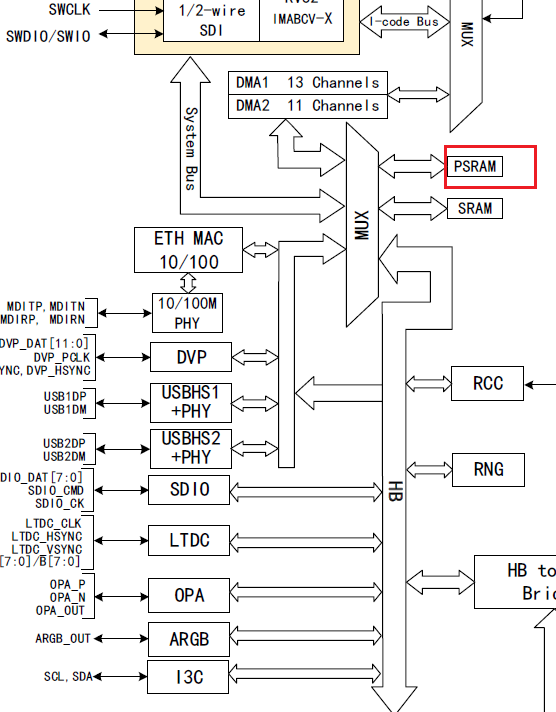
<figcaption>
图 1‑1
PSRAM框架
</figcaption>
</figure>

### PSRAM电源

PSRAM通过内部VDD18供电，典型值1.8V，可以通过配置抬高至1.9V，该电源可以通过外供VDD，经过内部LDO降压后，专一供电给PSRAM。也可以通过外供VDD18引脚提供。

<figure>
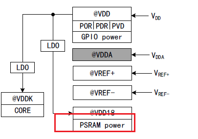
<figcaption>
图 1‑2
PSRAM电源框架
</figcaption>
</figure>

VDD18引脚引出，输出电压，需外接0.1uF 并联2.2uF
容量的高频电容，MCU上电运行后无需外供即可输出。也可上电运行后通过软件关闭内部LDO，再外部直接供给VDD18引脚稳定的1.8V电压。

<figure>
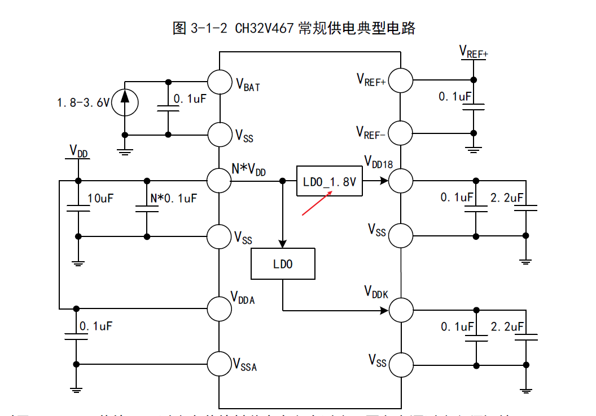
<figcaption>
图 1‑3
VDD18框架
</figcaption>
</figure>

### PSRAM时钟

PSRAM的工作时钟由SYSCLK提供，用户可通过配置系统时钟频率，使PSRAM接口达到最高300MHz的运行速率。

图 1‑4 PSRAM时钟来源

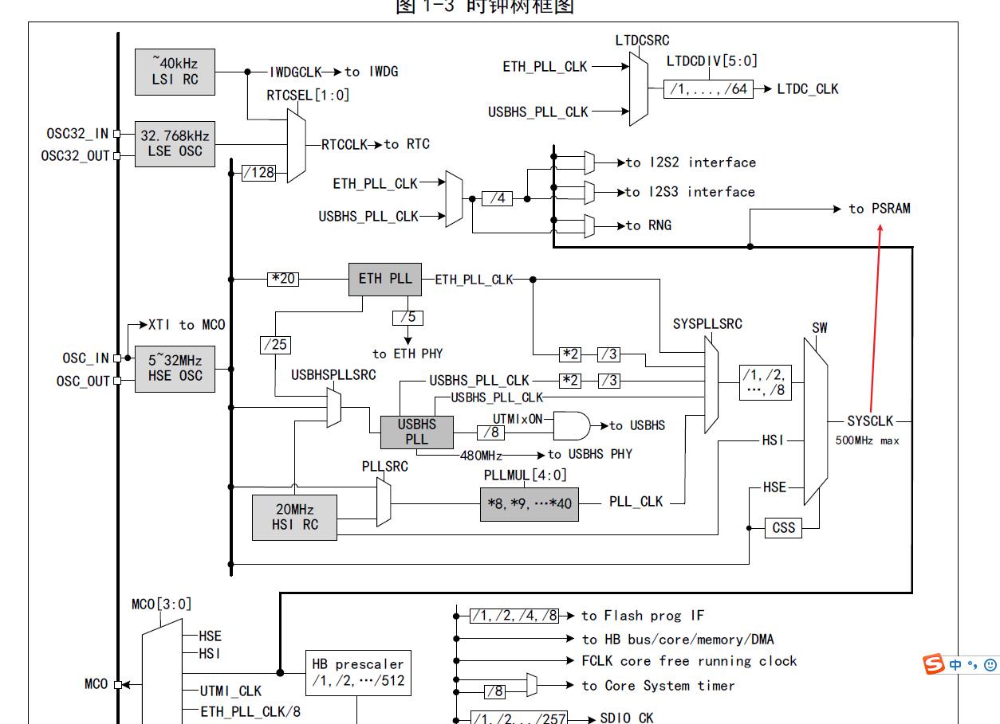

## PSRAM特性

内置的PSRAM特性：

1.  容量：CH32V467RET6(4M x 8bits, 32Mb; 页面大小：1024
    字节)；CH32V467VET6和CH32V467WEU6（8M x 8bits, 64Mb; 页面大小：1024
    字节）

2.  最大时钟频率: 300MHz，最大数据速率: 600MBps

3.  低功耗模式：部分阵列自刷新；自动温度补偿自刷新；可配置刷新率；保留数据的半睡眠模式

4.  可软件复位：通过命令发送完成复位功能

# 配置方法

## PSRAM初始化配置

PSRAM的初始化包括，控制时钟初始化，PSRAM控制器初始化，PSRAM的Write
Latency配置和Read Latency 配置。

### PSRAM时钟初始化

PSRAM的时钟源于SYSCLK，工程下的main.c文件中已经进行了配置。如图所示，代码的SYSCLK为300MHz。

<figure>
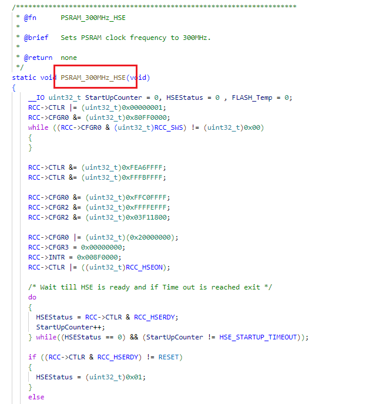
<figcaption>
图 2‑1
PSRAM时钟配置
</figcaption>
</figure>

### PSRAM控制器配置

PSRAM控制器的初始化首先要使能HB线上的PSRAM控制器时钟，开启时钟后，开始配置PSRAM相关寄存器：

**PSRAM_trc**为读写周期的最小时间配置值，
实际Trc=PSRAM_trc\*PSRAM 时钟的周期，必须要满足Write／Read
Cycle Trc≥60ns。

<figure>
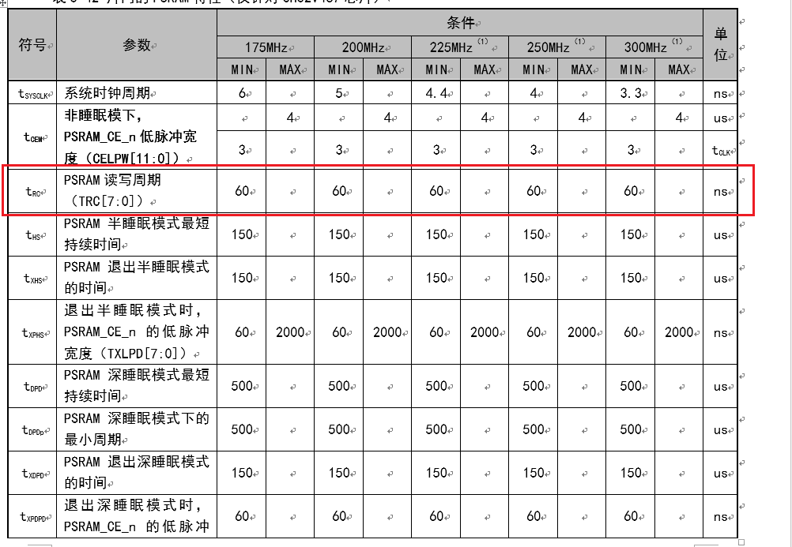
<figcaption>
图 2‑2
PSRAM读写周期范围
</figcaption>
</figure>

**PSRAM_tcph**为两个连续突发之间的最小间隔配置值，实际tCPH = PSRAM_tcph
\* PSRAM 时钟的周期，需满足图中最小值。

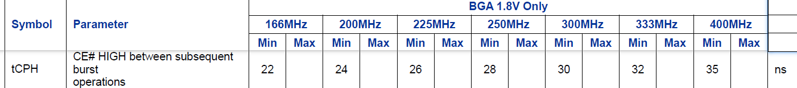

**PSRAM_txlpd**为退出低功耗时（半睡眠和深睡眠）PSRAM_CE_n
持续的脉冲宽度，tXPHS/tXPDPD=PSRAM_txlpd\* HSI
时钟的周期，需满足图中的极值需求。

<figure>
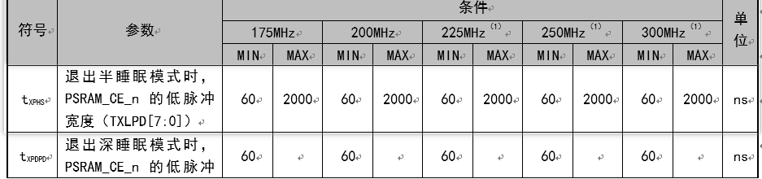
<figcaption>
图 2‑3
PSRAM退出睡眠模式时间范围
</figcaption>
</figure>

**PSRAM_cap_cfg**为PSRAM的容量配置，该值需要根据芯片的型号来区分，一般设置为32Mb或者64Ｍb。该值可以通过读取MR2寄存器来获取。

<figure>
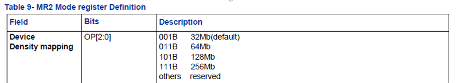
<figcaption>
图 2‑4
PSRAM MR2寄存器的容量定义
</figcaption>
</figure>

**PSRAM_cfifo**为设置的DMA 写操作清空 FIFO
方式选择，一般设置为：：写地址和读 buf 中的地址匹配才把读 FIFO 清空。

**PSRAM_exti_lpmd**表示PSRAM
退出当前低功耗状态使能，当初始化的时候应该配置为退出低功耗模式，相关寄存器配置完成后，延时等待初始化完成。

### PSRAM写Latency配置

Write Latency配置主要使用到MR4寄存器的\[5:7\]bit。

<figure>
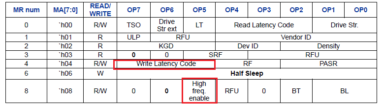
<figcaption>
图 2‑5
PSRAM MR寄存器Write Latency的定义
</figcaption>
</figure>

根据配置的不同的PSRAM时钟，设置MR4对应的值。配置参数需小于等于300Mhz。

<figure>
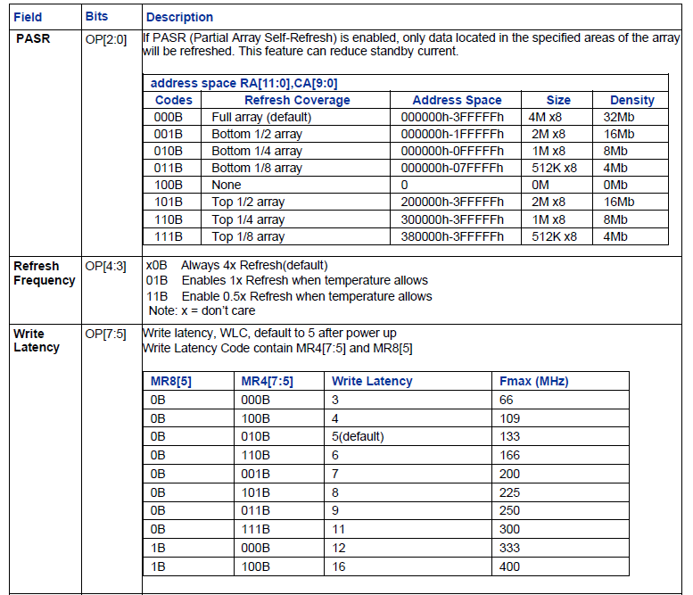
<figcaption>
图 2‑6
PSRAM MR4寄存器的定义
</figcaption>
</figure>

设置对应库函数，赋值PSRAM_Fre和对应的Write_Latency

/\*\*\*\*\*\*\*\*\*\*\*\*\*\*\*\*\*\*\*\*\*\*\*\*\*\*\*\*\*\*\*\*\*\*\*\*\*\*\*\*\*\*\*\*\*\*\*\*\*\*\*\*\*\*\*\*\*\*\*\*\*\*\*\*\*\*\*\*\*

\* @fn PSRAMSetWrLatency

\*

\* @brief PSRAM set write Latency

\*

\* @param PSRAM_Fre - MR4_Write_66M

MR4_Write_109M

MR4_Write_133M

MR4_Write_166M

MR4_Write_200M

MR4_Write_225M

MR4_Write_250M

MR4_Write_300M

MR4_Write_333M

MR4_Write_400M

Write_Latency - Latency_66M

Latency_109M

Latency_133M

Latency_166M

Latency_200M

Latency_225M

Latency_250M

Latency_300M

Latency_333M

Latency_400M

\* @return none

\*/ void SetWrLatency(uint32_t PSRAM_Fre, uint32_t Write_Latency)

{

PSRAMSetData(PSRAM_Fre\<\<5);

PSRAMSetWrLatency(Write_Latency);

PSRAM_Set_MR_ADDR(CMD_MR_ADDR_4);

PSRAM_Set_CMD(CMD_MR_WRITE);

PSRAM_Set_Busy(ENABLE);

PSRAM_Set_MW(ENABLE);

Wait_Busy_0();

if((PSRAM_Fre==MR4_Write_333M)\|(PSRAM_Fre==MR4_Write_400M))

{

//High frequency latency enable for 333Mhz/400MHz .

PSRAMSetData(Hfreq_En\<\<5);

PSRAM_Set_MR_ADDR(CMD_MR_ADDR_8);

PSRAM_Set_CMD(CMD_MR_WRITE);

PSRAM_Set_Busy(ENABLE);

PSRAM_Set_MW(ENABLE);

Wait_Busy_0();

}

}

### PSRAM读Latency配置

配置Read　Latency需要对MR0寄存器的\[2:4\]bit。

<figure>
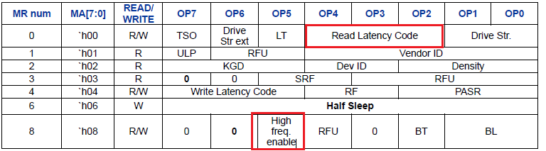
<figcaption>
图 2‑7
PSRAM MR寄存器Read Latency的定义
</figcaption>
</figure>

根据配置的不同的PSRAM时钟，设置MR0对应的值。配置参数需小于等于300Mhz。

<figure>
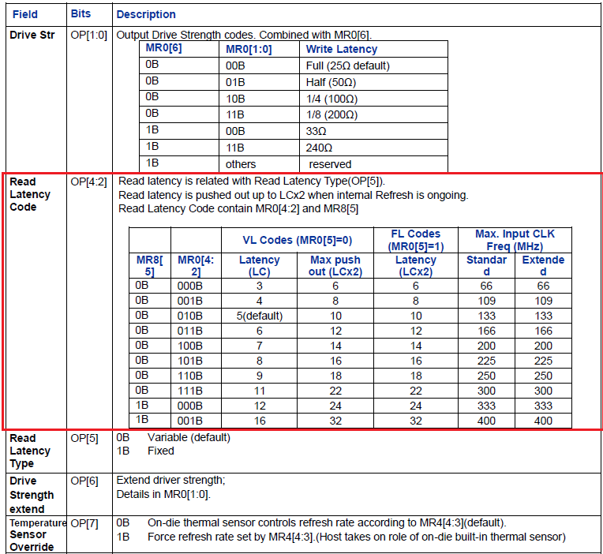
<figcaption>
图 2‑8
PSRAM MR0寄存器的定义
</figcaption>
</figure>

设置对应库函数，赋值PSRAM_Fre和对应的Read_Latency

/\*\*\*\*\*\*\*\*\*\*\*\*\*\*\*\*\*\*\*\*\*\*\*\*\*\*\*\*\*\*\*\*\*\*\*\*\*\*\*\*\*\*\*\*\*\*\*\*\*\*\*\*\*\*\*\*\*\*\*\*\*\*\*\*\*\*\*\*\*

 \* @fn      PSRAMSetRdLatency

 \*

 \* @brief   PSRAM set read Latency

 \*

 \* @param   PSRAM_Fre - MR0_Read_66M      

                        MR0_Read_109M        

                        MR0_Read_133M    

                        MR0_Read_166M      

                        MR0_Read_200M        

                        MR0_Read_225M

                        MR0_Read_250M      

                        MR0_Read_300M      

                        MR0_Read_333M      

                        MR0_Read_400M        

 \*          Read_Latency -  Latency_66M        

                            Latency_109M      

                            Latency_133M      

                            Latency_166M    

                            Latency_200M      

                            Latency_225M    

                            Latency_250M      

                            Latency_300M      

                            Latency_333M      

                            Latency_400M  

 \*

 \* @return  none

 \*/

void SetRdLatency(uint32_t PSRAM_Fre, uint32_t Read_Latency,uint32_t
Read_Latency_Type)

{

    PSRAMSetData(PSRAM_Fre\<\<2);

    PSRAMSetRdLatency(Read_Latency);

    PSRAM_Set_MR_ADDR(CMD_MR_ADDR_0);

    PSRAM_Set_CMD(CMD_MR_WRITE);

    PSRAM_Set_Busy(ENABLE);

    PSRAM_Set_MW(ENABLE);

    Wait_Busy_0();

//High frequency latency enable for 333Mhz .

   if((PSRAM_Fre==MR0_Read_333M)\|(PSRAM_Fre==MR0_Read_400M))

   {

    PSRAMSetData(Hfreq_En\<\<5);

    PSRAM_Set_MR_ADDR(CMD_MR_ADDR_8);

    PSRAM_Set_CMD(CMD_MR_WRITE);

    PSRAM_Set_Busy(ENABLE);

    PSRAM_Set_MW(ENABLE);

    Wait_Busy_0();

    }

    if(Read_Latency_Type==Read_Fixed)

    {

    PSRAMSetData(Read_Fixed\<\<5);

    PSRAMSetRdLatency(Read_Latency);

    PSRAM_Set_MR_ADDR(CMD_MR_ADDR_0);

    PSRAM_Set_CMD(CMD_MR_WRITE);

    PSRAM_Set_Busy(ENABLE);

    PSRAM_Set_MW(CMD_MW_Write);

    Wait_Busy_0();

    }

}

\
PSRAM低功耗
-----------

PSRAM可以配置进入半睡眠模式，通过对MR6寄存器进行写入0XF0的值后，可以进入半睡眠，该模式可以对数据进行保持，唤醒后数据依然存在。

<figure>
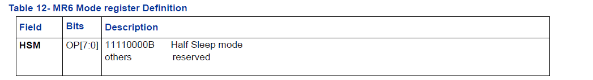
<figcaption>
图 2‑9PSRAM MR6存器的定义
</figcaption>
</figure>

    PSRAMWriteReg(CMD_MR_ADDR_6,0xF0 );//进入半睡眠模式

    Delay_Us(150);

    Delay_Us(50);

    PSRAM-\>CTLR\|=1\<\<16;//退出低功耗模式

    Delay_Us(150);

Delay_Us(50);

# 读写应用

PSRAM的读写可以通过直接CPU读写也可以通过专用DMA进行读写。

## CPU读写

通过CPU直接读写PSRAM，支持8位、16位或32位随机或成块读写，经过测试，在时钟设置为200MHz的情况下，32位写的速度为：130MB/s，读的速度为：111MB/s。由于测试时需要运行for循环代码，会损耗CPU的运行时间，所以测试出的速度会略低于

    printf("CPU write data\r\n");

    for(i=0; i\<BUFFER_SIZE; i++)

    {

      \*(u32\*)(PSRAM_ADDR + 4\*i) = TxBuffer\[i\];

    }

    printf("CPU Read data\r\n");

    for(i=0; i\<BUFFER_SIZE; i++)

    {

      RxBuffer\[i\]= \*(vu32\*)(PSRAM_ADDR + 4\*i);  

    }

## 专用DMA读写

通过PSRAM专用DMA读写PSRAM，经过测试，在时钟设置为300MHz的情况下，写的速度为：562MB/s，读的速度为：550MB/s。调用PSRAMDMAWrite和PSRAMDMARead函数，函数需要传递的为：存储写入和读取的buff，写入或者读取的起始地址，数据宽度（可以选择16位或者32位），DMA一次突发长度，两次突发之间暂停时间（这个参数值越小，连续读写的速度越快）。

/\*\*\*\*\*\*\*\*\*\*\*\*\*\*\*\*\*\*\*\*\*\*\*\*\*\*\*\*\*\*\*\*\*\*\*\*\*\*\*\*\*\*\*\*\*\*\*\*\*\*\*\*\*\*\*\*\*\*\*\*\*\*\*\*\*\*\*\*\*

\* @fn PSRAMDMAWrite

\*

\* @brief PSRAM write data by DMA

\*

\* @param pBuffer - data

\* WriteAddr - PSRAM address.

\* dataWidth - PSRAM_MEMORYSIZE_16bit:16bit

\* PSRAM_MEMORYSIZE_32bit:32bit

\* ONEBL - DMA_BRST_NUM2: 2 times Burst Length

DMA_BRST_NUM4: 4 times Burst Length

DMA_BRST_NUM6: 6 times Burst Length

DMA_BRST_NUM8: 8 times Burst Length

DMA_BRST_NUM16:16 times Burst Length

\* TOWBL_TOUT- DMA_PAUSE_TIM0 pause 0 times

DMA_PAUSE_TIM1 pause 1 times

DMA_PAUSE_TIM2 pause 2 times

DMA_PAUSE_TIM3 pause 3 times

DMA_PAUSE_TIM4 pause 4 times

DMA_PAUSE_TIM5 pause 5 times

DMA_PAUSE_TIM6 pause 6 times

DMA_PAUSE_TIM7 pause 7 times

DMA_PAUSE_TIM8 pause 8 times

DMA_PAUSE_TIM9 pause 9 times

DMA_PAUSE_TIM10 pause 10 times

DMA_PAUSE_TIM11 pause 11 times

DMA_PAUSE_TIM12 pause 12 times

DMA_PAUSE_TIM13 pause 13 times

DMA_PAUSE_TIM14 pause 14 times

DMA_PAUSE_TIM15 pause 15 times

\*

\* @return none

\*/

Void PSRAMDMAWrite(uint32_t \*pBuffer,uint32_t WriteAddr,uint32_t
n,uint32_t dataWidth,uint32_t ONEBL,uint32_t TOWBL_TOUT)

{

PSRAMDMATypeDef PSRAMDMAStruct={0};

PSRAMDMAStruct.PSRAM_DMA_DAT_DIR=DMA_DIR_PSRAM;

PSRAMDMAStruct.PSRAM_DMA_DATA_NUM=n;

PSRAMDMAStruct.PSRAM_DMA_DMA_ONEBL=ONEBL;

PSRAMDMAStruct.PSRAM_DMA_MEMORY_SIZE=dataWidth;

PSRAMDMAStruct.PSRAM_DMA_TOWBL_TOUT=TOWBL_TOUT;

PSRAMDMASet(pBuffer,WriteAddr,&PSRAMDMAStruct);

PSRAM_DMA_Cmd(ENABLE);

while (((PSRAM-\>ISR)&0x00000002)==0 ){

}

PSRAM_ClearITPendingBit(PSRAM_DMATF);

PSRAM_DMA_Cmd(DISABLE);

}

/\*\*\*\*\*\*\*\*\*\*\*\*\*\*\*\*\*\*\*\*\*\*\*\*\*\*\*\*\*\*\*\*\*\*\*\*\*\*\*\*\*\*\*\*\*\*\*\*\*\*\*\*\*\*\*\*\*\*\*\*\*\*\*\*\*\*\*\*\*

\* @fn PSRAMDMARead

\*

\* @brief PSRAM write data by DMA

\*

\* @param pBuffer - data

\* WriteAddr - PSRAM address.

\* dataWidth- Data bit width

\* ONEBL - DMA_BRST_NUM2: 2 times Burst Length

DMA_BRST_NUM4: 4 times Burst Length

DMA_BRST_NUM6: 6 times Burst Length

DMA_BRST_NUM8: 8 times Burst Length

DMA_BRST_NUM16:16 times Burst Length

\* TOWBL_TOUT- DMA_PAUSE_TIM0 pause 0 times

DMA_PAUSE_TIM1 pause 1 times

DMA_PAUSE_TIM2 pause 2 times

DMA_PAUSE_TIM3 pause 3 times

DMA_PAUSE_TIM4 pause 4 times

DMA_PAUSE_TIM5 pause 5 times

DMA_PAUSE_TIM6 pause 6 times

DMA_PAUSE_TIM7 pause 7 times

DMA_PAUSE_TIM8 pause 8 times

DMA_PAUSE_TIM9 pause 9 times

DMA_PAUSE_TIM10 pause 10 times

DMA_PAUSE_TIM11 pause 11 times

DMA_PAUSE_TIM12 pause 12 times

DMA_PAUSE_TIM13 pause 13 times

DMA_PAUSE_TIM14 pause 14 times

DMA_PAUSE_TIM15 pause 15 times

\*

\* @return none

\*/

void PSRAMDMARead(uint32_t \*pBuffer,uint32_t ReadAddr,uint32_t
n,uint32_t dataWidth,uint32_t ONEBL,uint32_t TOWBL_TOUT)

{

PSRAMDMATypeDef PSRAMDMAStruct={0};

PSRAMDMAStruct.PSRAM_DMA_DAT_DIR=DMA_DIR_MEM;

PSRAMDMAStruct.PSRAM_DMA_DATA_NUM=n;

PSRAMDMAStruct.PSRAM_DMA_DMA_ONEBL=ONEBL;

PSRAMDMAStruct.PSRAM_DMA_MEMORY_SIZE=dataWidth;

PSRAMDMAStruct.PSRAM_DMA_TOWBL_TOUT=TOWBL_TOUT;

PSRAMDMASet(pBuffer,ReadAddr,&PSRAMDMAStruct);

PSRAM_DMA_Cmd(ENABLE);

while (((PSRAM-\>ISR)&0x00000002)==0 ){};

PSRAM_ClearITPendingBit(PSRAM_DMATF);

PSRAM_DMA_Cmd(DISABLE);

}

## 问题查找

当PSRAM出现读写错误可以从一下方向查找问题根源：

1.  检查芯片丝印，查看是否为CH32V467，如果是CH32V407，则无内置PSRAM，需更换芯片。

2.  测量VDD18引脚是否有稳定的1.8V电压输出。如果电压波动较大，则外供1.8V尝试。

3.  软件复位后，退出低功耗再试 ，可能芯片误操作进入了低功耗模式。

4.  重新查看初始化参数，是否与PSRAM时钟相匹配。

5.  读取PSRAM内部参数，如：ID，容量等，如果有误，则判断为PSRAM时序有误，降低PSRAM时钟，重新配置读写Latency后查看是否可以正常读写。注意PSRAM初始化时PSRAM时钟需要大于150MHz。

# 历史版本

更新内容

| 日期       | 版本 | 变更内容 |
|------------|------|----------|
| 2026/07/25 | V1.0 | 初版发行 |

声明

本手册版权所有为南京沁恒微电子股份有限公司（Copyright © Nanjing Qinheng
Microelectronics Co., Ltd. All Rights
Reserved），未经南京沁恒微电子股份有限公司书面许可，任何人不得因任何目的、以任何形式（包括但不限于全部或部分地向任何人复制、泄露或散布）不当使用本产品手册中的任何信息。

任何未经允许擅自更改本产品手册中的内容与南京沁恒微电子股份有限公司无关。

南京沁恒微电子股份有限公司所提供的说明文档只作为相关产品的使用参考，不包含任何对特殊使用目的的担保。南京沁恒微电子股份有限公司保留更改和升级本产品手册以及手册中涉及的产品或软件的权利。

参考手册中可能包含少量由于疏忽造成的错误。已发现的会定期勘误，并在再版中更新和避免出现此类错误
