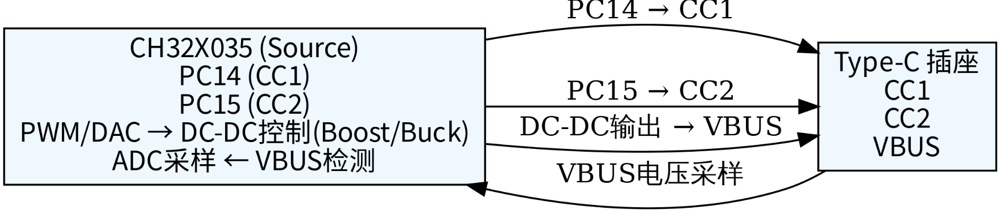
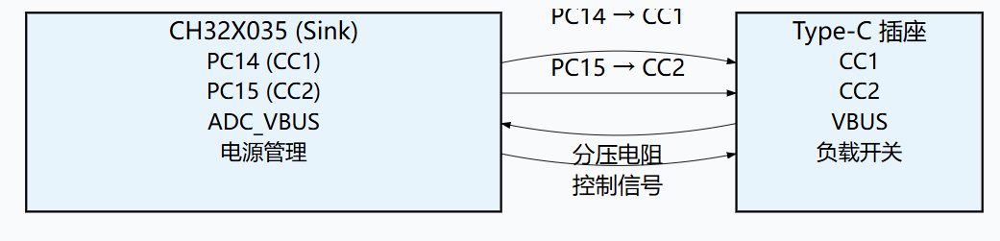
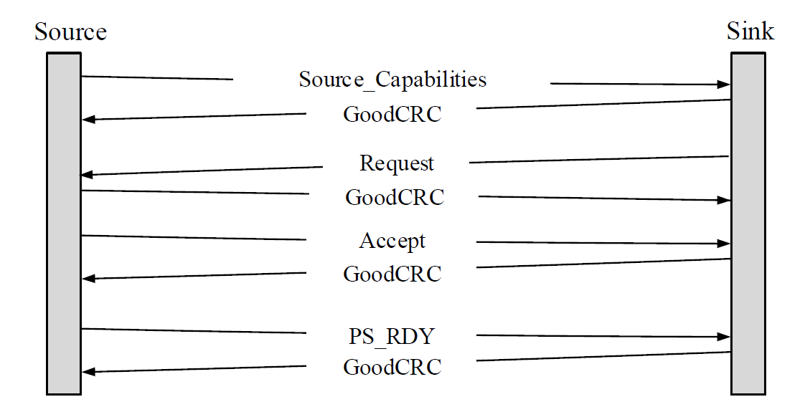

<table>
<colgroup>
<col style="width: 49%" />
<col style="width: 50%" />
</colgroup>
<thead>
<tr>
<th rowspan="2"></th>
<th></th>
</tr>
<tr>
<th></th>
</tr>
</thead>
<tbody>
</tbody>
</table>

说明

本应用笔记介绍了如何使用CH32系列芯片的USB PD（Power
Delivery）接口将其配置为供电端（Source）或受电端（Sink）设备，以响应外部设备的功率协商请求并进行电能传输。为此，文中举例，首先概述了USB
PD控制器特性，然后简析USB
PD应用设计实例，包括硬件连接图、寄存器配置方法、协议命令的响应机制以及数据收发流程。最后阐述了各个带PD功能的MCU的特点及选型侧重点，以帮助开发者快速选型和开发。

**适用范围**

| 适用范围 | 系列                                                 |
|----------|------------------------------------------------------|
| 通用MCU  | CH32X035、CH32L103、CH32V205、CH32H417、CH32M030等等 |

目录

[说明 [1](#_Toc241672116)](#_Toc241672116)

[目录 [2](#_Toc241672117)](#_Toc241672117)

[表格索引 [2](#_Toc241672118)](#_Toc241672118)

[图片索引 [2](#_Toc241672119)](#_Toc241672119)

[第1章 USB PD控制器概述 [1](#usb-pd控制器概述)](#usb-pd控制器概述)

[1.1 USB PD接口简介 [1](#usb-pd接口简介)](#usb-pd接口简介)

[1.2 CH32系列USB PD控制器主要特性
[1](#ch32系列usb-pd控制器主要特性)](#ch32系列usb-pd控制器主要特性)

[1.3 典型应用场景 [1](#典型应用场景)](#典型应用场景)

[第2章 硬件设计 [2](#硬件设计)](#硬件设计)

[2.1 引脚定义与连接 [2](#引脚定义与连接)](#引脚定义与连接)

[2.2 硬件设计注意事项 [2](#硬件设计注意事项)](#硬件设计注意事项)

[第3章 协议工作原理 [3](#协议工作原理)](#协议工作原理)

[3.1 数据包格式 [3](#数据包格式)](#数据包格式)

[3.2 命令传输机制(SOP\*） [3](#命令传输机制sop)](#命令传输机制sop)

[3.3 响应机制 [3](#响应机制)](#响应机制)

[3.4 数据收发流程 [4](#数据收发流程)](#数据收发流程)

[第4章 寄存器配置 [5](#寄存器配置)](#寄存器配置)

[4.1 PD控制寄存器 [5](#pd控制寄存器)](#pd控制寄存器)

[4.2 CC状态检测寄存器 [5](#cc状态检测寄存器)](#cc状态检测寄存器)

[4.3 发送与接收FIFO [5](#发送与接收fifo)](#发送与接收fifo)

[4.4 中断与状态寄存器 [5](#中断与状态寄存器)](#中断与状态寄存器)

[第5章 软件设计实例 [6](#软件设计实例)](#软件设计实例)

[5.1 初始化流程 [6](#初始化流程)](#初始化流程)

[5.2 命令接收与解析（协议状态机）
[6](#命令接收与解析协议状态机)](#命令接收与解析协议状态机)

[5.3 数据发送流程 [7](#数据发送流程)](#数据发送流程)

[5.4 数据接收流程 [8](#数据接收流程)](#数据接收流程)

[5.5 中断服务程序设计 [8](#中断服务程序设计)](#中断服务程序设计)

[第6章 调试与常见问题 [10](#调试与常见问题)](#调试与常见问题)

[6.1 无法检测到设备接入 [10](#无法检测到设备接入)](#无法检测到设备接入)

[6.2 协商失败，电压无法切换
[10](#协商失败电压无法切换)](#协商失败电压无法切换)

[第7章 定位对比 [11](#定位对比)](#定位对比)

[7.1 优点与侧重点 [11](#优点与侧重点)](#优点与侧重点)

[第8章 总结 [14](#总结)](#总结)

[历史版本 [15](#_Toc241672149)](#_Toc241672149)

[声明 [16](#_Toc241672150)](#_Toc241672150)

表格索引

[PD引脚 [2](#_Toc241672151)](#_Toc241672151)

[协议数据包 [3](#_Toc240881507)](#_Toc240881507)

[寄存器描述 [5](#_Toc240881508)](#_Toc240881508)

图片索引

[Source（供电端）应用 [2](#_Toc240881486)](#_Toc240881486)

[Sink（受电端）应用 [2](#_Toc240881487)](#_Toc240881487)

[响应机制 [4](#_Toc240881488)](#_Toc240881488)

# USB PD控制器概述

## USB PD接口简介

USB PD（Power
Delivery）是USB‑IF协会制定的快充协议标准，利用Type‑C接口中的CC（Configuration
Channel）引脚作为通信链路，实现供电端（Source）和受电端（Sink）之间的功率协商。该协议支持最高240W的电力传输，并允许动态调整电压和电流。相较于传统外置PD协议芯片的方案，CH32系列MCU将PD
PHY（物理层）集成在芯片内部，硬件自动完成BMC编解码软件仅需处理数据包内容，可直接通过CC线进行PD通信，大幅降低了系统成本和设计复杂度。

## CH32系列USB PD控制器主要特性

以CH32X035为例，其USB PD控制器具备以下特性：

- 物理层集成：内置BMC编码/解码器，支持CC线信号收发，无需外部PHY芯片

- 角色支持：可配置为Source（供电端）、Sink（受电端）或DRP（双角色端口）

- 协议兼容：支持USB PD
  3.0规范（SPR标准功率范围），通过软件配置可扩展至EPR扩展功率范围

- 最高功率：支持100W（20V/5A），搭配外部DC‑DC可拓展至240W

- 低功耗检测：内置Type‑C连接检测逻辑，支持自动识别设备接入

- 中断支持：提供完备的中断机制，便于实现事件驱动的协议处理

## 典型应用场景

- 单口快充充电器（Source模式）

- 受电设备如手机、平板、笔记本电脑（Sink模式）

- 双向快充移动电源（DRP模式）

- PD协议分析工具（监听模式）

# 硬件设计

## 引脚定义与连接

以CH32X035为例，USB PD功能使用以下引脚：

| **引脚名称** | **引脚号** | **功能描述**                        |
|--------------|------------|-------------------------------------|
| CC1          | PC14       | Type‑C接口CC1线（PD通信与连接检测） |
| CC2          | PC15       | Type‑C接口CC2线（PD通信与连接检测） |

表 2‑1 PD引脚

在硬件设计中，应将CC1和CC2分别连接至Type‑C插座对应的CC1/CC2焊盘。

不同芯片的CC引脚分配不同：CH32X035使用PC14/PC15；CH32M030提供4个耐28V高压的CC引脚（支持双路PD）；CH32V205等型号的CC引脚分配请参考对应数据手册。

PD作为Source和Sink端的应用接线如下图:

<figure>

<figcaption>
图 2‑1 Source（供电端）应用
</figcaption>
</figure>

<figure>

<figcaption>
图 2‑2 Sink（受电端）应用
</figcaption>
</figure>

VCONN供电方案:

CH32系列芯片内置的PD
PHY不直接提供VCONN电源输出。若需要为线缆内eMarker芯片供电（支持VCONN），推荐采用
CH32 + CH211
的组合方案。CH211是Type‑C/PD高压接口芯片，集成了高压LDO、CC引脚高压保护和VCONN供电管理功能**。**

## 硬件设计注意事项

- CC引脚电平：CC线正常通信电平为1.2V，但引脚可耐受更高电压（如CH32X035的PC引脚耐受VDD+6V）。在高压快充应用中需注意电平匹配。

- VBUS采样：Sink模式下需通过电阻分压网络将VBUS电压降至ADC输入范围，建议分压比考虑最高输入电压。

- DC DC控制：Source模式下，电压切换通常通过PWM或DAC控制外部DC
  DC的反馈端，需确保控制信号与DC DC的电压范围匹配。

- 保护电路：建议在VBUS路径上添加过压/过流保护（如保险丝、TVS管）。

- PCB布局：CC线走线应尽量短且等长，避免过孔；高压区域与低压控制区域保持足够间距

# 协议工作原理

## 数据包格式

USB PD协议的数据包由以下字段组成：

| 字段                     | 长度        | 说明                           |
|--------------------------|-------------|--------------------------------|
| 前导码（Preamble）       | 64 bits     | 交替的0/1，用于同步            |
| SOP\*                    | 20 bits     | 标识通信对象（SOP/SOP'/SOP''） |
| 功能码（Message Header） | 16 bits     | 包含消息类型、角色、版本等信息 |
| 数据码（Byte0‑n）        | 0~7×32 bits | 数据消息的有效载荷             |
| CRC32                    | 32 bits     | 校验码                         |
| 结束码（EOP）            | 5 bits      | 固定为01101                    |

表 3‑1协议数据包

除前导码外，所有数据均需经过4b5b编码和BMC编码后通过CC线传输。CH32芯片的硬件PD
PHY自动完成BMC编码/解码和4b5b编码/解码，软件只需处理原始数据包内容。

## 命令传输机制(SOP\*）

SOP字段用于标识通信对象：

- SOP：Source与Sink之间的通信

- SOP'：Source与线缆近端E‑Marker通信

- SOP''：Source与线缆远端E‑Marker通信

当作为Sink时，它接收来自Source的SOP命令；当作为Source时，它主动发送SOP命令。

## 响应机制

每次正确接收到一个数据包（CRC校验通过）后，接收方必须回复 GoodCRC
消息（控制消息），告知发送方数据已正确接收。GoodCRC消息中携带与接收消息相同的Message
ID。

当发送方未在超时时间内收到GoodCRC时，会以相同Message
ID重传，默认重传次数由协议栈配置。

对于特定命令（如Request），接收方（Source）还需要回复Accept或Reject等状态响应

<figure>

<figcaption>
图 3‑1响应机制
</figcaption>
</figure>

## 数据收发流程

完整的PD功率协商流程包括以下步骤：

1)  连接检测：Source在CC引脚上检测到Sink的下拉电阻（Rd），识别设备接入。

2)  数据发送
    ：Source发送Source_Capabilities数据消息，其中包含多个PDO（电源能力数据对象）。

3)  响应确认：Sink回复GoodCRC。

4)  请求（数据接收）
    ：Sink从PDO列表中选择合适的档位，发送Request数据消息。

5)  响应确认：Source回复GoodCRC。

6)  接受/拒绝（控制消息发送）
    ：Source判断请求是否可满足，回复Accept或Reject。

7)  电源就绪（控制消息发送）
    ：若接受，Source调整电压/电流后发送PS_Ready。

协商完成：Sink回复GoodCRC，VBUS切换至目标电压。

# 寄存器配置

## PD控制寄存器

CH32系列芯片的USB PD控制器提供了一套专用的寄存器，用于配置PD
PHY的工作模式、角色和协议参数。

| 寄存器            | 功能描述                                              |
|-------------------|-------------------------------------------------------|
| R32_USBPD_CONTROL | PD控制寄存器，配置角色（Source/Sink/DRP）、使能PD功能 |
| R32_USBPD_PORT    | CC引脚配置，设置下拉电阻（Rd）和上拉电流能力          |
| R32_USBPD_CONFIG  | 中断使能寄存器，控制哪些事件触发中断                  |
| R32_USBPD_STATUS  | 中断状态寄存器，指示当前中断源                        |

表 4‑1寄存器描述

## CC状态检测寄存器

PD_CC_STA寄存器用于读取当前CC引脚的状态，包括：

- 是否检测到对端设备接入

- 正反插方向（CC1或CC2有效）

- 对端是否为Source/Sink

## 发送与接收FIFO

PD控制器内部包含发送FIFO和接收FIFO，用于缓冲待发送和已接收的数据包。

发送FIFO：软件将待发送的数据包（含功能码和数据码）按字（32位）写入发送FIFO，硬件自动进行BMC编码后发送。

接收FIFO：硬件接收并解码数据包后，将有效载荷存入接收FIFO，软件从中读取。

## 中断与状态寄存器

中断系统支持以下事件：

- 数据包接收完成（含GoodCRC响应）

- 数据包发送完成

- 连接状态变化（插入/拔出）

- 超时错误

- CRC错误

软件应在中断服务程序中读取PD_INT_STA以确定事件类型，并进行相应处理

# 软件设计实例

## 初始化流程

初始化步骤包括：

1)  使能PD控制器时钟

2)  配置CC引脚为PD功能（复用功能）

3)  设置角色（Source/Sink/DRP）

4)  配置中断使能

5)  启动PD控制器

示例代码（Sink模式）：

    void PD_Sink_Init(void)
    {
        // 1. 使能PD时钟（具体参考MCU寄存器手册）
        RCC->APB2ENR |= RCC_APB2ENR_PDEN;
        
        // 2. 配置CC引脚复用
        GPIO_InitTypeDef gpio;
        gpio.Pin = GPIO_PIN_14 | GPIO_PIN_15;
        gpio.Mode = GPIO_MODE_AF_PP;
        gpio.Pull = GPIO_NOPULL;
        gpio.Speed = GPIO_SPEED_FREQ_HIGH;
        gpio.Alternate = GPIO_AF_PD;    // 复用为PD功能
        HAL_GPIO_Init(GPIOC, &gpio);
        
        // 3. 设置Sink角色，使能PD
        PD->CTL = PD_ROLE_SINK | PD_ENABLE;
        
        // 4. 配置中断
        NVIC_EnableIRQ(PD_IRQn);
        PD->INT_EN = PD_INT_RX_DONE | PD_INT_CONNECT | PD_INT_ERROR;
        
        // 5. 启动PD
        PD->CTL |= PD_START;
    }

## 命令接收与解析（协议状态机）

PD协议栈通常以状态机方式实现。主循环或定时器中断中需周期性调用协议处理函数

    void PD_Main_Proc(void)
    {
        // 检测连接状态
        PD_Det_Proc();
        
        // 处理接收到的消息
        if (PD_RxReady()) {
            uint32_t header = PD_GetRxHeader();
            uint8_t msgType = (header >> 8) & 0x1F;  // Message Type
            uint8_t numData = (header >> 12) & 0x07; // Number of Data Objects
            
            switch(msgType) {
                case MSG_SOURCE_CAP:
                    // 收到Source能力，保存PDO列表
                    SaveSourceCap(PD_GetRxData());
                    // 选择合适的电压并发送Request
                    SendRequest(selected_pdo_index);
                    break;
                case MSG_ACCEPT:
                    // 请求被接受，等待PS_Ready
                    break;
                case MSG_PS_READY:
                    // 电源已就绪，VBUS电压已切换
                    OnPowerReady();
                    break;
                // ... 处理其他消息
            }
        }
    }

## 数据发送流程

Source模式下，需要主动发送Source_Capabilities数据消息。发送流程如下：

    void SendSourceCapabilities(void)
    {
        uint32_t pdo_list[] = {0x1A21912C, 0x0002D12C, 0x0003C12C}; // 5V/3A, 9V/3A, 12V/3A
        uint8_t num_pdo = 3;
        
        // 1. 构建功能码（Message Header）
        uint16_t header = (MSG_SOURCE_CAP << 8) | (num_pdo << 12) | 
                          (PD_VERSION << 4) | (PORT_ROLE_SOURCE << 2);
        
        // 2. 写入发送FIFO：先写功能码
        PD->TX_FIFO = header;
        
        // 3. 写入数据码（每个PDO 32位）
        for (int i = 0; i < num_pdo; i++) {
            PD->TX_FIFO = pdo_list[i];
        }
        
        // 4. 启动发送
        PD->CTL |= PD_TX_START;
    }

## 数据接收流程

Sink接收到Source_Capabilities后，需要解析PDO并发送Request：

    void HandleSourceCap(void)
    {
        uint32_t pdo[7];
        uint8_t num = PD_GetRxDataCount();
        for (int i = 0; i < num; i++) {
            pdo[i] = PD_GetRxDataWord(i);
        }
        
        // 选择最佳档位（例如最高电压）
        int chosen = ChooseBestPDO(pdo, num);
        
        // 构建Request消息
        uint16_t req_header = (MSG_REQUEST << 8) | (1 << 12) | 
                              (PD_VERSION << 4) | (PORT_ROLE_SINK << 2);
        uint32_t req_data = (chosen << 16) |  // 目标PDO索引
                            (desired_voltage << 8) | desired_current;
        
        PD->TX_FIFO = req_header;
        PD->TX_FIFO = req_data;
        PD->CTL |= PD_TX_START;
    }

## 中断服务程序设计

中断服务程序负责快速响应硬件事件，建议采用事件队列或标志位方式将处理任务推迟到主循环：

    void PD_IRQHandler(void)
    {
        uint32_t status = PD->INT_STA;
        
        if (status & PD_INT_RX_DONE) {
            // 接收完成，设置标志
            pd_rx_done = 1;
            PD->INT_STA = PD_INT_RX_DONE;  // 清中断
        }
        if (status & PD_INT_TX_DONE) {
            pd_tx_done = 1;
            PD->INT_STA = PD_INT_TX_DONE;
        }
        if (status & PD_INT_CONNECT) {
            // 连接状态变化（插入/拔出）
            connection_state = (PD->CC_STA & CC_CONNECTED) ? 1 : 0;
            PD->INT_STA = PD_INT_CONNECT;
        }
        if (status & PD_INT_ERROR) {
            // 处理错误（超时、CRC错误等）
            HandleError();
            PD->INT_STA = PD_INT_ERROR;
        }
    }

# 调试与常见问题

## 无法检测到设备接入

现象：Source模式下，CC引脚检测不到Sink下拉电阻。

可能原因：

1)  CC引脚上下拉状态不对

2)  Type‑C线缆或插座接触不良

解决：确认硬件连接，检查芯片是否内置下拉电阻，如果存在，需手动配置寄存器关闭下拉电阻。且配置上拉电流。检查CC引脚的GPIO是否已经配置成复用模式。

## 协商失败，电压无法切换

现象：VBUS一直保持5V。

可能原因：

1)  Sink的PDO列表不包含Source支持的档位

2)  发送的Request消息格式错误（如索引越界）

3)  外部DC‑DC控制电路未正确响应

解决：使用PD分析仪抓取CC通信日志，确认协商过程中的消息序列；检查Request数据码中的PDO索引和电压/电流值。

# 定位对比

基于自研青稞 RISC‑V 内核，沁恒推出了多款内置 USB PD PHY 的 MCU
产品。根据应用场景的不同，可分为两大类：

PD MCU（专业 Type‑C 方案） ：以 CH32M030、CH32M103、CH641
为代表，专注于纯 PD 功率传输应用，外围精简，部分型号内置高压
LDO，可直接工作在较高电压下。

PDUSB MCU（功率 + 数据传输一体化） ：以
CH32V205、CH32H417、CH32L103、CH32X035 为代表，内置 PD PHY 与 USB2.0 或
USB3.0 控制器，可同时支持 Type‑C 功率传输和数据通信

各系列的对比如下：

| 芯片 | 分类 | PD 核心优势 | 关键差异化 | 最典型场景 |
|----|----|----|----|----|
| CH32M030 | PD MCU | 双路 PD PHY，4 个耐 28V CC 引脚，原生 140W | 内置 28V 高压 LDO + 4 对 N 管预驱 + 可编程灌电流 | 双 C 口充电器、大功率 PD 电源 |
| CH641 | PD MCU | 专为 PD + 无线充设计，外围最精简 | 内置 12V 高压 IO、差分电流采样、小信号解码器 | PD 快充线、无线充电、电动工具 |
| CH32H417 | PDUSB MCU | PD 3.2 + EPR ，双核 400MHz | 内置 USB 3.2 Gen1 + 百兆以太网 PHY | PD + 超高速数据 + 网络复合设备 |
| CH32V205 | PDUSB MCU | PD 3.2 + EPR，480Mbps USB 高速 | 192MHz 主频，256KB Flash，8 路串口 | PD + USB 高速数据传输（存储、扩展坞） |
| CH32X315 | PDUSB MCU | PD 3.2 + EPR，USB 3.0 + 4 组 5Msps ADC | 480MHz 内核，48 路 ADC 通道 | PD + USB传输+高速多通道数据采集 |
| CH32L103 | PDUSB MCU | PDUSB，低功耗设计 | 1.8~3.6V 供电，睡眠/停止/待机模式 | 电池供电的便携 PD 设备 |
| CH32X035 | PDUSB MCU | 性价比最高的 PDUSB 入门款 | 48MHz，2~5.5V 宽压，2 运放 + 3 比较器 | 单口充电器、受电设备、PD 分析工具 |

## 优点与侧重点

1.  **CH32M030 —— 双 C 口大功率的专业选择**

这是沁恒 PD MCU 产品线中定位最高的型号。它的核心优势在于原生双路
PD：内置两组 PD PHY，提供 4 个 CC 引脚，无需外置 PD 芯片即可支持双
Type-C 接口，原生支持 140W（28V@5A），搭配外部 DC-DC 可拓展至 240W。

芯片工作电压可达 28V，内置高压 LDO，可直接从 VBUS
取电。它还配备了两路可编程灌电流模块，可对两组外部 DC-DC
的输出电压实现实时、动态的精细化控制，这让 PPS
动态调压策略的实现变得非常简单。此外，内置 4 个运放、3 个比较器和 4 对 N
管栅极预驱，模拟信号链和功率驱动外围都能大幅精简。

**侧重点：**如果你要做的是多口充电器，或者需要PD
与电机驱动/大功率控制结合的方案，CH32M030 是唯一不需要外置 PD
芯片就能原生支持双 C 口的选择。

2.  **CH641 —— 极致精简的 PD 专用 SoC**

CH641 的定位非常特殊：它不是通用 MCU，而是PD
及无线充电专用控制器。内核只有 48MHz，Flash 仅 16KB，SRAM 仅
2KB，但它的外围集成度极高。

它内置了 PD PHY、BC
接口、差分输入电流采样（ISP/ISN）和交流小信号放大解码器（QII），还提供 4
个高压驱动引脚，可直接驱动 MOS 管。这意味着做 PD
快充线或无线充电方案时，几乎不需要额外的模拟前端和驱动电路。它还支持 OVP
过压保护和 OTP 过温保护，硬件层面就具备了一定的安全冗余。

**侧重点：**如果你的产品是PD 快充线（一线多充）
、无线充电底座，或者需要极小 PCB 面积、极低 BOM 成本的 PD 应用，CH641
是专用性最强的选择。但它资源有限，不适合需要复杂协议栈或大量数据处理的场景。

3.  **CH32H417 —— PD + 超高速数据 + 网络的旗舰复合芯片**

CH32H417 是 PDUSB MCU 中性能最强的型号。它采用 RISC-V5F + V3F
双核架构，V5F 主频高达 400MHz，SRAM 达 896KB，Flash 达 960KB。

在 PD 方面，它支持 PD 3.2 和 EPR，支持 100W 或 240W 快充，支持
DRP、Sink、Source 全角色。但它的真正价值在于数据接口的丰富程度：内置 USB
3.2 Gen1 控制器和 PHY（5Gbps）、USB 2.0 高速 PHY、百兆以太网 MAC 和
PHY、SerDes 高速隔离收发器、SD/eMMC 控制器、DVP 摄像头接口、LCD
控制器等。

**侧重点：**如果你需要在一颗芯片上同时实现 PD 充电 + 超高速数据传输 +
网络通信，比如工业网关、高端扩展坞、带 PD 的工业相机，CH32H417
是唯一的选择。它的 PD 功能是作为整个高速互连体系的一部分存在的。

4.  **CH32V205 —— PD + USB 高速数据传输的均衡之选**

CH32V205 可以看作是 CH32X035 的“高速升级版”。它基于 RISC-V3B 内核，主频
192MHz，Flash 256KB，SRAM 32KB。

PD 方面，它支持 PD 3.2 和 EPR，支持 DRP、Sink、Source，内置 PD PHY 和
Type-C 控制器。它的核心差异化在于内置 480Mbps USB 2.0 高速
PHY，可以同时提供一个高速 USB 接口用于数据传输，以及一个 PD
接口用于功率协商。此外还提供 8 路 USART、QSPI、CAN、双 SPI、双 I2C
等丰富外设。

**侧重点：**如果你需要 PD 充电 + USB 480Mbps 数据传输，但不需要 USB 3.0
的超高速率和 CH32H417 的复杂度，CH32V205
是一个更均衡、成本更可控的选择。典型场景包括带 PD 的 USB
存储设备、便携式扩展坞。

5.  **CH32X315 —— PD + 高速多通道数据采集**

CH32X315 的定位比较独特。它基于青稞 RISC-V 内核，内核 480MHz，系统
313MHz，内置 USB 3.0 超高速 PHY（5Gbps）和 USB 2.0 高速 PHY，同时集成
Type-C/PD 控制器，支持 PD 3.2 和 EPR。

但它最突出的特点是模拟采集能力：内置 4 组 5Msps 高速 12 位 ADC
单元，提供 48 个 ADC 输入通道且支持自动扫描，还支持 ARGB 单线 RGB
灯带控制。CH32X305 是它的精简版，去掉了 USB 3.0 模块。

**侧重点：**如果你的 PD 应用同时需要高速、多通道的模拟信号采集，比如 PD
电源的精密电压/电流监测、多路传感器数据采集与 PD 充电一体化，CH32X315 的
ADC 资源是其他型号无法替代的。

6.  **CH32L103 —— 低功耗优先的 PDUSB 方案**

CH32L103 的定位非常明确：PDUSB 低功耗微控制器。它基于 RISC-V4C
内核，主频最高 96MHz，Flash 64KB，SRAM 20KB。

它的核心差异化在于供电范围和功耗管理：系统供电范围
1.8~3.6V，支持睡眠、停止、待机多种低功耗模式。PD 功能方面，它内置 PD
PHY，支持 USB Host/Device、PD 及 Type-C 快充，支持
DRP、Sink、Source。此外还提供 1 组 OPA、3 组 CMP、CAN 接口、10 路
TouchKey 等外设。

**侧重点：**如果你的产品是电池供电的便携设备，或者对系统功耗有严格限制，CH32L103
是唯一在 PDUSB 系列中明确以低功耗为核心卖点的型号。它的 PD
功能完整，但主频和存储资源比 X035 略高，功耗控制更好。

7.  **CH32X035 —— 性价比最高的 PDUSB 入门款**

CH32X035 是沁恒 PDUSB 系列中成本最低、生态最成熟的型号。基于 RISC-V4C
内核，48MHz，Flash 64KB，SRAM 20KB，供电范围 2.0~5.5V（宽压）。

它内置 USB 和 PD PHY，支持 USB Host/Device、PDUSB 及 Type-C 快充，支持
PD 2.0/3.0，支持 DRP、Sink、Source。芯片还提供 2 组 OPA、3 组 CMP、4 组
USART、I2C、SPI、12 位 ADC、14 路 TouchKey 等外设，以及可编程协议 I/O
控制器（PIOC）。封装选择极为丰富，从 LQFP64 到 QFN12 都有。

**侧重点：**CH32X035 是单口 PD 充电器、受电设备（如 PD 诱骗器）、PD
分析工具的首选入门芯片。它的资料最全、EVT
例程最丰富，社区开源项目也最多。如果不需要高压、不需要多口、不需要高速数据，选它是最稳妥的方案。

# 总结

CH32系列芯片通过内置PD
PHY和完整的寄存器支持，为开发者提供了低成本、高集成度的USB
PD解决方案。本文档以CH32X035为例，从硬件连接、协议原理、寄存器配置到软件实现，系统性地介绍了如何将CH32芯片配置为USB
PD
Source或Sink设备，并实现完整的功率协商与传输流程。借助官方提供的EVT例程和静态协议库，开发者可以快速完成产品原型开发，并灵活扩展至多口充电、PPS可编程电源等高级应用场景。

历史版本

| 日期       | 版本 | 变更内容 |
|------------|------|----------|
| 2026/09/21 | V1.0 | 初版发行 |

声明

本手册仅供参考。作者在不另行通知的情况下，可随时进行修改。
