AN90000

V1.0

***

说明

CH32H417QEU-R1-1v1开发板是基于 沁恒青稞RISC-V5F 和RISC-V3F 双内核CH32H417QEU6微控制器的完整演示与开发平台。

微控制器具备以下特性：CH32H417 集成了USB 3.2 Gen1 控制器和收发器、百兆以太网MAC 及PHY、SerDes 高速隔离收发器、Type-C/PD 控制器及PHY，提供SD/EMMC 控制器、500MBytes 通用高速接口UHSIF、DVP 数字图像接口、单线协议主接口SWPMI、可编程协议I/O 控制器PIOC、灵活存储控制器FMC、DFSDM、LTDC、GPHA、DMA 控制器、多组定时器、8 组串口、I3C、4 组I2C、2 组QSPI、4 组SPI，2 组I2S、3 组CAN 等外设资源，内置了5M 采样率双12 位ADC 单元、20M 采样率10 位高速HSADC 单元、16 路Touchkey、双DAC 单元、3组运放OPA、电压比较器CMP 等模拟资源，支持10M/100M 以太网通讯，支持USB 2.0 和USB 3.0，支持USB Host 主机和USB Device 设备功能、Type-C 和PDUSB 快充功能，支持SerDes 高速隔离及远距离传输，支持双内核分工提升网络协议处理效率和通讯响应速度。CH32H417QEU-R1-1v1开发板能帮助用户快速入门并开发应用程序。

如图 1 和图 2 所示的CH32H417QEU-R1-1v1开发板，可作为用户应用程序在移植到最终产品前的原型参考设计。

CH32H417QEU-R1-1v1板的硬件外设有助于用户通过评估几乎所有外设（例如 USB、100Mb/s 以太网、eMMC、USART、带音频插孔输入输出的 SAI 音频 DAC 立体声、DVP摄像头、数字麦克风、SDRAM、QSPI 闪存以及带电容式多点触摸面板的 RGB 接口 LCD）来提升其应用开发效率。

CH32H417QEU-R1-1v1板集成了 LINKE，作为 MCU 的嵌入式在线调试器、编程器以及 USB 虚拟 COM 端口桥接器。

CH32H417QEU-R1-1v1开发板随附 MCU 软件包，该软件包提供了全面的库以及各种软件示例。

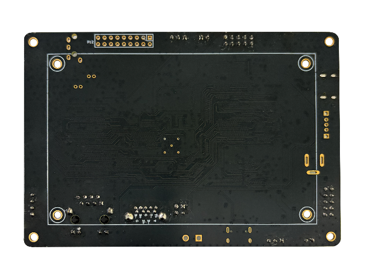 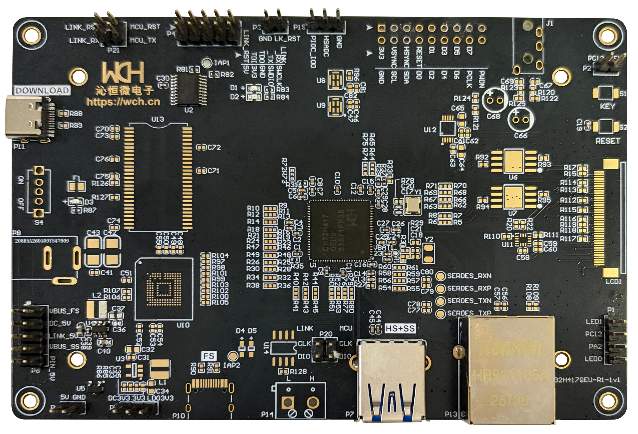

图1 板子正面 图2 板子背面

适用范围

| 适用范围   | 系列               |
|------------|--------------------|
| 单一开发板 | CH32H417QEU-R1-1v1 |

目录

[说明](#_Toc224633861)

[目录](#_Toc224633862)

[表格索引](#_Toc224633863)

[图片索引](#_Toc224633864)

[第1章 特征概述](#特征概述)

[第2章 硬件布局与配置](#硬件布局与配置)

[2.1 板卡供电选择](#板卡供电选择)

[2.2 MCU供电选择](#mcu供电选择)

[2.3 时钟源](#时钟源)

[2.4 eMMC](#emmc)

[2.5 ETH](#eth)

[2.6 SDRAM](#sdram)

[2.7 QSPI FLASH](#qspi-flash)

[2.8 RGB LCD](#rgb-lcd)

[2.9 LINK](#link)

[2.10 SAI](#sai)

[2.11 DVP](#dvp)

[2.12 I3C](#i3c)

[2.13 DFSDM](#dfsdm)

[2.14 CAN](#can)

[2.15 USBPD](#usbpd)

[2.16 USB](#usb)

[2.17 KEY&LED](#keyled)

[第3章 开发板的I/O引脚分配](#开发板的io引脚分配)

[3.1 引脚功能及复用分配](#引脚功能及复用分配)

[历史版本](#_Toc224633886)

[声明](#_Toc224633887)

表格索引

[表 11适用范围](#_Toc207095534)

[表 21更新内容](#_Toc207095535)

图片索引

[图 11 硬件框图](#_Toc224635659)

[图 21 eMMC示意图](#_Toc224635660)

[图 22 SDRAM示意图](#_Toc224635661)

[图 23 QSPI FLASH示意图](#_Toc224635662)

[图 24 LCD示意图](#_Toc224635663)

[图 25 LINK短接示意图](#_Toc224635664)

[图 26 LINK清除代码选择示意图](#_Toc224635665)

[图 27 SAI接口示意图](#_Toc224635666)

[图 28 DVP接口示意图](#_Toc224635667)

[图 29 I3C接口姿态传感器示意图](#_Toc224635668)

[图 210 DFSDM接口麦克风示意图](#_Toc224635669)

[图 211 CAN接口示意图](#_Toc224635670)

[图 212 LED接口示意图](#_Toc224635671)

[图 213 KEY接口示意图](#_Toc224635672)

[图 214 PCB示意图](#_Toc224635673)

# 特征概述

•青稞RISC-V5F 和RISC-V3F 双内核内核的微控制器，提供960KB程序存储区CodeFlash以及896KB的SRAM，采用QFN128封装

• 4.3英寸RGB接口LCD接口，带I2C触摸面板连接器接口

• 1个摄像头 DVP接口

•符合IEEE 802.3-2002标准的百兆以太网

• USB OTG FS，兼容USB 2.0全速规范

• 支持USB 2.1、USB 2.0、USB 1.1、USB 1.0协议规范的USB HS，支持USB Host主机功能和USB Device设备功能

• 5Gbps的USBSS超高速信号，USB 3.0接口

• SAI音频编解码器

• 一个DFSDM数字麦克风

• 2个QSPI NOR Flash 接口

• 1个 16-bit 并行接口的 SDRAM

• 1个8 -bit SDMMC 接口eMMC

• 1个I3C接口姿态传感器

• 1个用户按键和1个复位按键

• 1个HSADC接口

• 1个PIOC接口

• 1个SERDES接口

• 1个CAN 接口

• 板载连接器：

– USB FS Type-C连接器

– USB 3.0 Type-A Receptacle连接器

– LINKE Type-C USB连接器，支持串口转USB

– POWER_JACK供电连接器

– 以太网RJ45接口

– 立体声耳机插孔

– GPIO引脚

– CAN 端子接口

– FPC上翻盖 LED接口

• 灵活的电源选项：

– LINKE USB连接器，USB FS/USBPD连接器，USB SS+HS连接器

– 通过POWER_JACK提供5V电压（以太网供电）

– 通过排针外部连接器提供5V电压

• 板载LINKE调试器/编程器，支持debug调试；支持外接下载。

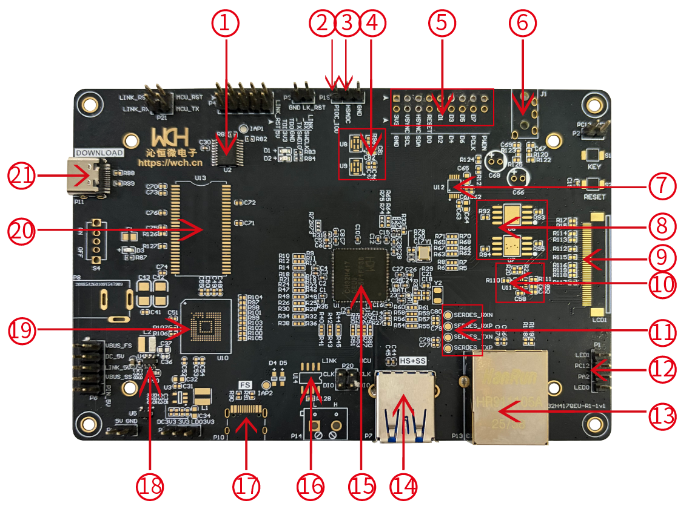

模块说明:

| 1.LINK         | 2.PIOC接口      | 3.HSADC接口           |
|----------------|-----------------|-----------------------|
| 4.麦克风       | 5.DVP摄像头接口 | 6.耳机孔              |
| 7.音频处理芯片 | 8.QSPI FLASH    | 9.LCD FPC座           |
| 10.姿态传感器  | 11.SERDES接口   | 12.KEY&LED            |
| 13.以太网口    | 14.USBSS+HS口   | 15.MCU                |
| 16.CAN         | 17.USBFS/USBPD  | 18.电源芯片           |
| 19.eMMC卡      | 20.SDRAM        | 21.Debug/Download接口 |

# 硬件布局与配置

CH32H417QEU-R1-1V1开发板是根据CH32H417QEU6微控制器设计的，微控制器采用QFN128封装。硬件框图（见图1-1）展示了微控制器与板载外设的连接关系，包括SDRAM、eMMC、QSPI、CAN、LTDC、USBSS、USBHS、USBFS、USBPD、USRAT、ETH、SAI、I3C、DFSDM、DVP、板载Link下载器。

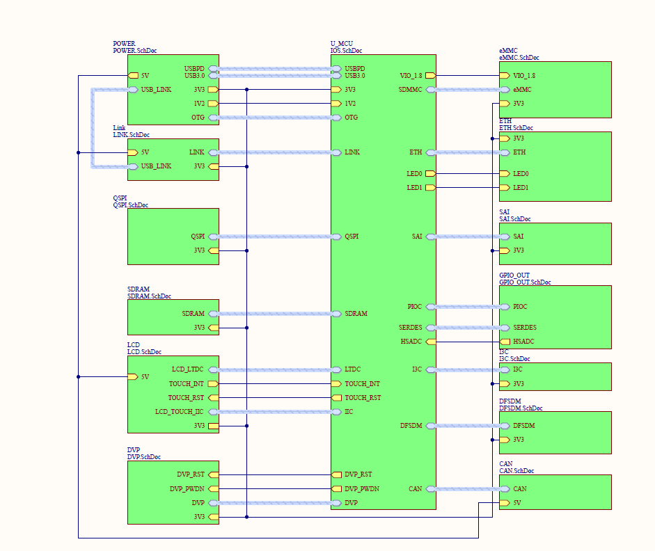

图 21 硬件框图

## 板卡供电选择

设计为板卡直流电源供电5V。通过适当的板卡配置，可选择使用以下任意一种5V直流电源输入：

• LINK 的 Type_C口为板卡提供高达 500 mA 的电流（P6左右 跳接丝印上的LINK_5V 位置）。

• USBSS+HS 的 Type-A Receptacle口为板卡提供高达 900 mA 的电流（P6左右 跳接丝印上的VBUS_SS 位置）。

• USBFS 的 Type_C口为板卡提供高达 500 mA 的电流（P6左右 跳接丝印上的VBUS_FS 位置），需要短接二极管D4/D5。如果使用USBPD快充头供电该接口，则只能诱骗5V电压。高于该电压则需要焊接二极管，防止电压过高损坏DCDC。

• POWER_JACK可以直接供电DC 5V，（P6左右 跳接丝印上的DC_5V 位置）

• P9双排针可以直接供电DC 5V，（P6左右 跳接丝印上的PIN_5V 位置）

## MCU供电选择

设计为MCU直流电源供电3.3V。通过适当的板卡配置，可选择使用以下任意一种 3.3V直流电源输入：

• P5排针可以直接供电DC_3V3，或者 LDO_3V3。

• P5排针可以直接短接DC_3V3和3V3，或者 短接LDO_3V3和3V3

注：CH2003V和DCDC均可实现5V转3.3V输出，可根据实际负载电流需求选择二者其一。

当标记为3V3的电源线上出现电压时， LED 指示灯 D3 亮起。MCU运行所需的所有电源电压均由该 3V3线路产生。

## 时钟源

板卡可以使用内部HSI，25MHz时钟源，或者使用外部HSE，焊接25M无源晶振于Y1位置。

## eMMC

板卡的MCU通过SDMMC接口连接eMMC（U10），封装为FBGA-153(11.5x13)。使用时需焊接0Ω电阻：R14、R18、R21、R24、R26、R30、R34、R38、R41、R43、R45。图2-1中标注NC的器件也需要焊接。

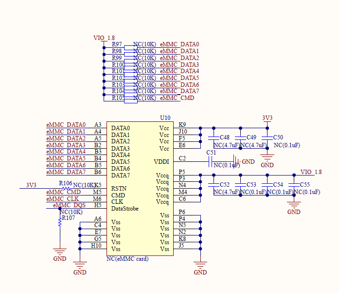

图 22 eMMC示意图

## ETH

板卡MCU内置10/100Mbps 以太网PHY 物理层收发器，通过P13接入网线，烧录代码后，实现通信。

## SDRAM

板载1个16 位总线宽度的SDRAM接口，TSOP-54封装，使用时需焊接0Ω电阻：R11、R46、R48、R50、R52、R54、R76。图2-2中标注NC的器件也需要焊接。

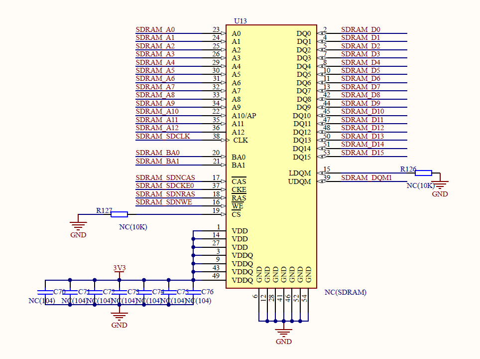

图 22 SDRAM示意图

## QSPI FLASH

板载两个QSPI FLASH接口，SOIC-8封装，兼容WSON-8封装。使用时需要焊接0Ω电阻：R5、R7、R62、R67、R69、R71、R73、R75。图2-3上标注NC的器件也需要焊接。

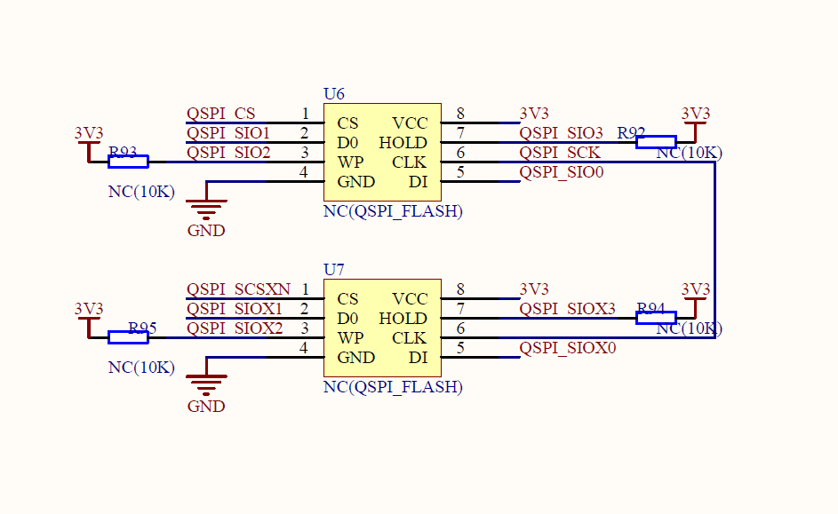

图 23 QSPI FLASH示意图

## RGB LCD

板载1个LTDC接口控制的（RGB565）的LCD接口。采用FPC-40封装下接的测试座，通过排线，可以直接液晶显示屏。使用时需要焊接0Ω电阻：R28、R32、R36、R42、R66。图2-4上标注NC的器件也需要焊接。

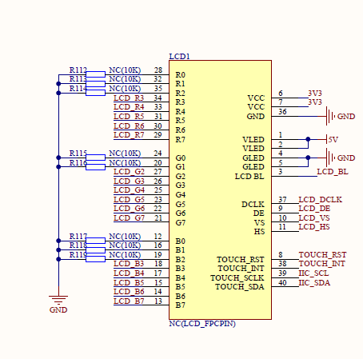

图 24 LCD示意图

## LINK

板载1个LINK调试下载器，下载器可以为主控-CH32H417下载代码，也可以通过引出的接口对LINKE型号适配的MCU进行调试和下载。如果只操作板上MCU，需左右短接图2-5中引脚（P20的1和2短接，3和4短接；P21的1和2短接，3和4短接）。使用过程中擦除芯片FLASH的模式仅限于复位擦，如图2-6所示。

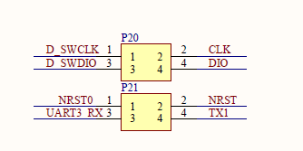

图 25 LINK短接示意图

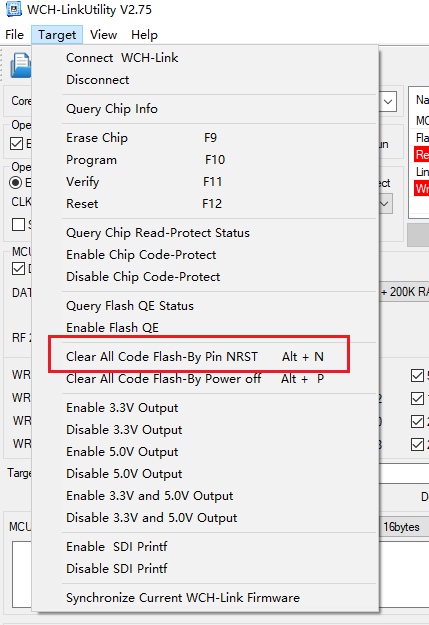

图 26 LINK清除代码选择示意图

## SAI

板载1 组串行音频接口，通过立体声耳机插孔输出音频。使用时需要焊接0Ω电阻：R68、R70。图2-7上标注NC的器件也需要焊接。

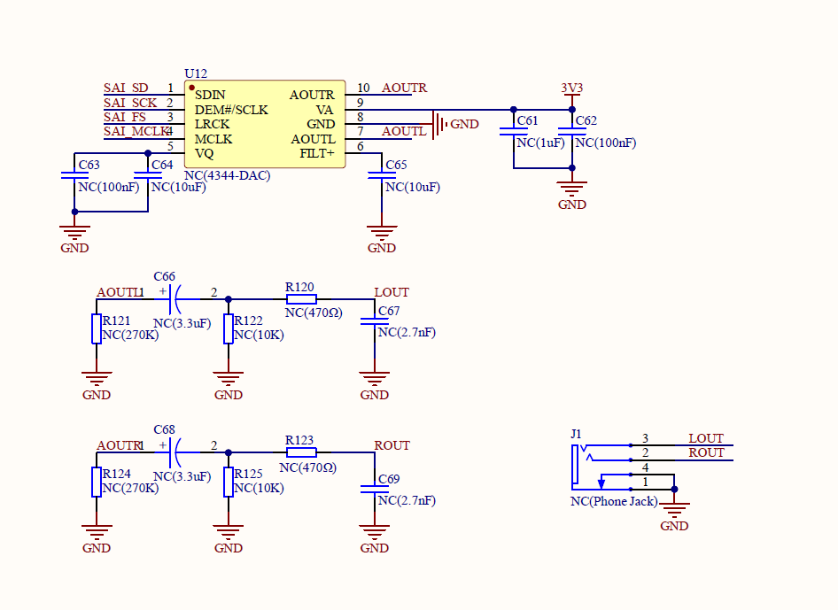

图 27 SAI接口示意图

## DVP

板载1 组数字图像接口DVP，用来连接摄像头模块获取图像数据流，可外接摄像头。使用时需要焊接0Ω电阻：R1、R13、R16、R19、R23、R44、R56、R58、R60、R74、R79。图2-8标注NC的器件也需要焊接。

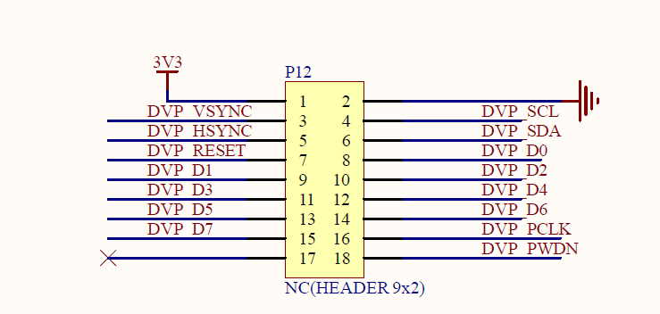

图 28 DVP接口示意图

## I3C

板载1 组双线制串行单端多分支总线I3C，可连接姿态传感器。使用时需要焊接0Ω电阻：R6、R8。图2-9标注NC的器件也需要焊接。

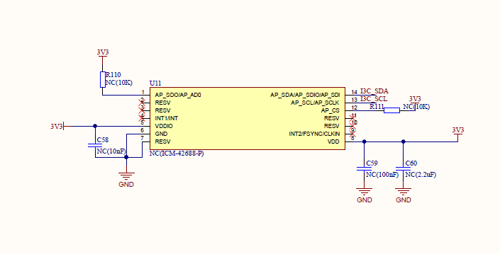

图 29 I3C接口姿态传感器示意图

## DFSDM

板载1 组一种专用于将外部ΣΔ调制器连接到MCU的高性能模块DFSDM，可外接麦克风模块，对接收到的音频信号处理。图2-10标注NC的器件需要焊接。

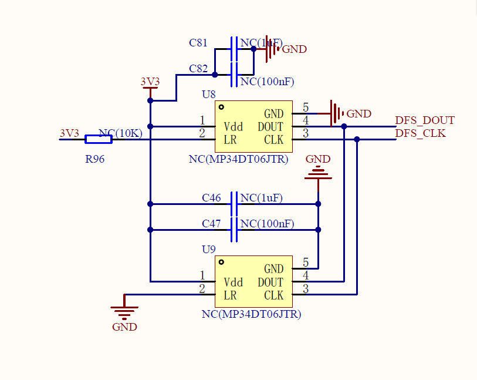

图 210 DFSDM接口麦克风示意图

## CAN

板载1 组CAN接口，兼容规范2.0A和2.0B(主动)，波特率高达1Mbits/s，支持时间触发通

信功能。使用时需要焊接0Ω电阻：R77、R80。图2-11标注NC的器件也需要焊接。

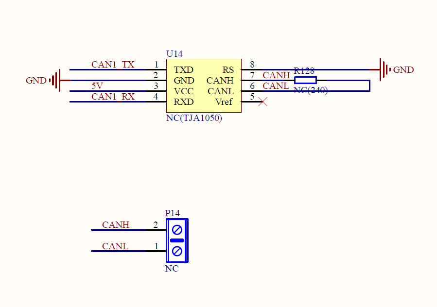

图 211 CAN接口示意图

## USBPD

板载1 组USB Power Delivery控制器和PD物理层收发器PHY。使用时需要焊接0Ω电阻：R51、R53。作为SINK使用时，需焊接下拉电阻5.1K:R90、R91。

## USB

板载一组USB OTG FS接口，使用时需要焊接0Ω电阻：R47和R49。

板载一组USBSS+USBHS接口，默认可以使用，无需短接电阻。

## KEY&LED

板载两组LED灯接口，LED和网口灯共用，预留GPIO：PA2和PC12。使用时短接图2-12中P1对应接口即可。低电平灯亮，高电平灯灭。

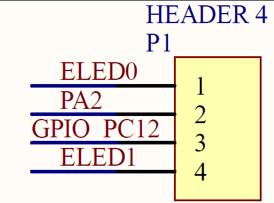

图 212 LED接口示意图

板载1个KEY，预留GPIO- PC13。使用时短接图2-13中P2对应接口即可。按下按键检测低电平，松开检测高电平。

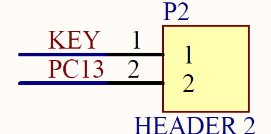

图 213 KEY接口示意图

## PCB

整体PCB设计四层板，电阻电容常规使用0402封装，排针为2.54mm间距，四角预留螺柱孔，方便固定。整体布局如图所示

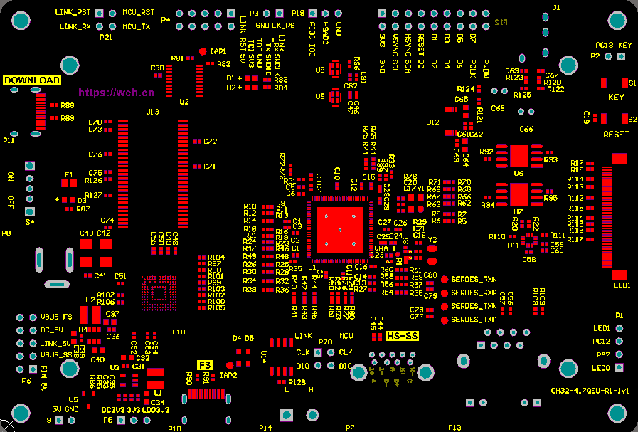

图 214 PCB示意图

# 开发板的I/O引脚分配

## 引脚功能及复用分配

| 引脚号 | 默认IO | 功能              | 复用 | 功能                | 复用 |
|--------|--------|-------------------|------|---------------------|------|
| 0      | VSS    |                   |      |                     |      |
| 1      | PE2    | SAI_MCLK_A        | AF6  |                     |      |
| 2      | PE3    | SDRAM DQM1        | AF1  | SDRAM_DQM1          | AF1  |
| 3      | PE4    | DVP D4            | AF13 | SERDES_TXN          |      |
| 4      | PE5    | DVP D6            | AF13 | SERDES_RXP          |      |
| 5      | PE6    | DVP D7            | AF13 | SERDES_RXN          |      |
| 6      | VDDIO  |                   |      |                     |      |
| 7      | VBAT   |                   |      |                     |      |
| 8      | PC13   | RTC               |      | KEY                 |      |
| 9      | PC14   | OSC32_IN          |      | DVP_RESET           |      |
| 10     | PC15   | OSC32_OUT         |      | TOUCH INT           |      |
| 11     | VDDK   |                   |      |                     |      |
| 12     | MDIRN  |                   |      |                     |      |
| 13     | MDIRP  |                   |      |                     |      |
| 14     | MDITN  |                   |      |                     |      |
| 15     | MDITP  |                   |      |                     |      |
| 16     | VDD33  |                   |      |                     |      |
| 17     | PF6    | QSPI2 SCK         | AF4  | I3C_SCL             | AF5  |
| 18     | PF7    | QSPI2 SCSN        | AF4  | I3C_SDA             | AF5  |
| 19     | PF8    | QSPI2 SIO0        | AF4  |                     |      |
| 20     | PF9    | QSPI2 SIO1        | AF4  |                     |      |
| 21     | PF10   | QSPI2 SIO2        | AF4  |                     |      |
| 22     | VSS    |                   |      |                     |      |
| 23     | XI     |                   |      |                     |      |
| 24     | XO     |                   |      |                     |      |
| 25     | NRST   |                   |      |                     |      |
| 26     | PC0    | QSPI2 SIO3        | AF10 | HSADC               |      |
| 27     | PC1    | LTDC G5           | AF14 | QSPI_SCSXN          | AF10 |
| 28     | PC2    | SAI_SCK_A         | AF7  | QSPI_SIOX0          | AF10 |
| 29     | PC3    | SAI_FS_A          | AF7  | QSPI_SIOX1          | AF10 |
| 30     | VDDIO  |                   |      |                     |      |
| 31     | VSSA   |                   |      |                     |      |
| 32     | VREFP  |                   |      |                     |      |
| 33     | VDD33A |                   |      |                     |      |
| 34     | PA0    | USART6 TX         | AF8  | PIOC_IO0            | AF5  |
| 35     | PA1    | DVP_SDA           |      | QSPI_SIOX3          | AF9  |
| 36     | PA2    | KEY               |      |                     |      |
| 37     | PA3    | LTDC B5           | AF14 |                     |      |
| 38     | VDDIO  |                   |      |                     |      |
| 39     | PA4    | DVP HSYNC         | AF13 |                     |      |
| 40     | PA5    | LTDC R4           | AF14 |                     |      |
| 41     | PA6    | LTDC G2           | AF14 |                     |      |
| 42     | PA7    | SDRAM SDNWE       | AF12 |                     |      |
| 43     | PC4    | DVP_SCL           |      |                     |      |
| 44     | PC5    | LTDC DE           | AF14 |                     |      |
| 45     | PB0    | DFS_CLK           | AF6  |                     |      |
| 46     | PB1    | SDRAM BA0         | AF7  |                     |      |
| 47     | PB2    | SAI_SD_A          | AF6  |                     |      |
| 48     | PF11   | SDRAM RAS         | AF12 |                     |      |
| 49     | PF12   | SDRAM CAS         | AF12 |                     |      |
| 50     | PF13   | DVP PCLK          | AF11 |                     |      |
| 51     | VDDIO  |                   |      |                     |      |
| 52     | PE7    | SDRAM D4          | AF12 |                     |      |
| 53     | PE8    | SDRAM D5          | AF12 |                     |      |
| 54     | PE9    | SDRAM D6          | AF12 |                     |      |
| 55     | PE10   | SDRAM D7          | AF12 |                     |      |
| 56     | PE11   | SDRAM D8          | AF12 |                     |      |
| 57     | PE12   | SDRAM D9          | AF12 |                     |      |
| 58     | PE13   | SDRAM D10         | AF12 |                     |      |
| 59     | PE14   | SDRAM A3          | AF15 |                     |      |
| 60     | PE15   | SDRAM D12         | AF12 |                     |      |
| 61     | PB10   | LTDC G4           | AF15 |                     |      |
| 62     | PB11   | SDRAM A6          | AF0  |                     |      |
| 63     | VIO18  |                   |      |                     |      |
| 64     | VDDIO  |                   |      |                     |      |
| 65     | PB12   | DFS_DOUT          | AF6  |                     |      |
| 66     | PB13   | I2C_SDA（触摸屏） |      | QSPI_SIOX2          | AF11 |
| 67     | PB14   | SDRAM A9          | AF0  |                     |      |
| 68     | PB15   | LTDC G7           | AF14 |                     |      |
| 69     | PD8    | SDRAM D13         | AF12 |                     |      |
| 70     | PD9    | SDRAM D14         | AF12 |                     |      |
| 71     | PD10   | SDRAM A10         | AF0  |                     |      |
| 72     | PD11   | SDRAM A11         | AF0  |                     |      |
| 73     | PD12   | SDRAM A12         | AF0  |                     |      |
| 74     | PD13   | SDRAM D0          | AF0  |                     |      |
| 75     | PD14   | SDRAM D1          | AF0  |                     |      |
| 76     | PD15   | SDRAM D2          | AF0  |                     |      |
| 77     | PF0    | 以太网灯          | AF10 | I2C_SCL（触摸屏）   |      |
| 78     | PF1    | LTDC CLK          | AF14 |                     |      |
| 79     | PF2    | 以太网灯          | AF10 | SDRAM_SDCLK         | AF12 |
| 80     | VDDK   |                   |      |                     |      |
| 81     | VIO18  |                   |      |                     |      |
| 82     | VDDIO  |                   |      |                     |      |
| 83     | PC6    | SDMMC D6          |      | DVP D0              | AF13 |
| 84     | PC7    | SDMMC D7          |      | DVP D1              | AF13 |
| 85     | PC8    | SDMMC D0          |      | DVP D2              | AF13 |
| 86     | PC9    | SDMMC D1          |      | DVP D3              | AF13 |
| 87     | PA8    | LTDC R6           | AF14 |                     |      |
| 88     | PA9    | LTDC R5           | AF14 |                     |      |
| 89     | PA10   | SDRAM D11         | AF0  |                     |      |
| 90     | PA11   | SDRAM A7          | AF10 | OTG_FS_DM           |      |
| 91     | PA12   | SDRAM A8          | AF10 | OTG_FS_DP           |      |
| 92     | PA13   | SDRAM BA1         | AF3  |                     |      |
| 93     | VDD33  |                   |      |                     |      |
| 94     | PA14   | SDMMC D4          |      | TOUCH RST（触摸屏） |      |
| 95     | PA15   | SDMMC D5          |      | LTDC B6             | AF14 |
| 96     | PC10   | SDMMC D2          |      | LTDC HSYNC          | AF15 |
| 97     | PC11   | SDMMC D3          |      | LTDC VSYNC          | AF15 |
| 98     | PC12   | SDMMC CLK         |      | GPIO_PC12           |      |
| 99     | PD0    | LTDC R3           | AF15 |                     |      |
| 100    | PD1    | SDRAM D3          | AF12 |                     |      |
| 101    | PD2    | SDMMC CMD         |      | LTDC B7             | AF9  |
| 102    | PD3    | SDMMC DQS         |      | DVP_PWDN            |      |
| 103    | PD4    | LTDC R7           | AF15 |                     |      |
| 104    | PD5    | SDRAM D15         | AF1  |                     |      |
| 105    | VIO18  |                   |      |                     |      |
| 106    | PD6    | LTDC G3           | AF15 |                     |      |
| 107    | PD7    | LTDC B3           | AF14 |                     |      |
| 108    | PF3    | SDRAM_SDCKE0      | AF4  |                     |      |
| 109    | PF4    | LTDC G6           | AF15 |                     |      |
| 110    | PF5    | SDRAM A0          | AF15 |                     |      |
| 111    | PE0    | LTDC B4           | AF9  |                     |      |
| 112    | PE1    | SDRAM A4          | AF0  |                     |      |
| 113    | PF14   | DVP D5            | AF11 |                     |      |
| 114    | VDDIO  |                   |      |                     |      |
| 115    | PB3    | SDRAM A1          | AF12 | CC1                 | AF4  |
| 116    | PB4    | SDRAM A2          | AF12 | CC2                 | AF4  |
| 117    | PB5    | LTDC BL           |      |                     |      |
| 118    | PB6    | SDRAM A5          | AF11 | CAN1_RX             | AF3  |
| 119    | PB7    | DVP VSYNC         | AF13 | CAN1_TX             | AF3  |
| 120    | PB8    | USB2DP            |      | SWCLK               |      |
| 121    | PB9    | USB2DM            |      | SWDIO               |      |
| 122    | VSS    |                   |      |                     |      |
| 123    | SSTXB  |                   |      |                     |      |
| 124    | SSTXA  |                   |      |                     |      |
| 125    | VDD12A |                   |      |                     |      |
| 126    | SSRXB  |                   |      |                     |      |
| 127    | SSRXA  |                   |      |                     |      |
| 128    | VDD33  |                   |      |                     |      |

历史版本

更新内容

| 日期      | 版本 | 变更内容 |
|-----------|------|----------|
| 2026/3/17 | V1.0 | 初版发行 |

声明

本手册版权所有为南京沁恒微电子股份有限公司（Copyright © Nanjing Qinheng Microelectronics Co., Ltd. All Rights Reserved），未经南京沁恒微电子股份有限公司书面许可，任何人不得因任何目的、以任何形式（包括但不限于全部或部分地向任何人复制、泄露或散布）不当使用本产品手册中的任何信息。

任何未经允许擅自更改本产品手册中的内容与南京沁恒微电子股份有限公司无关。

南京沁恒微电子股份有限公司所提供的说明文档只作为相关产品的使用参考，不包含任何对特殊使用目的的担保。南京沁恒微电子股份有限公司保留更改和升级本产品手册以及手册中涉及的产品或软件的权利。

参考手册中可能包含少量由于疏忽造成的错误。已发现的会定期勘误，并在再版中更新和避免出现此类错误。
