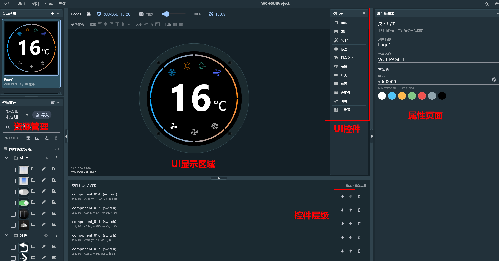
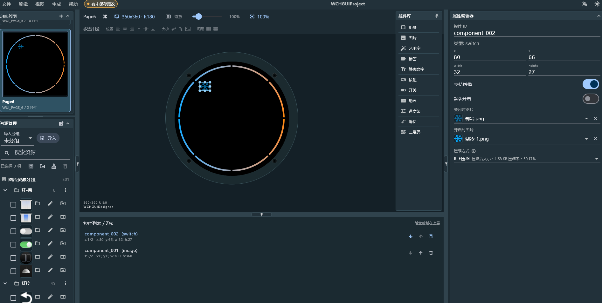
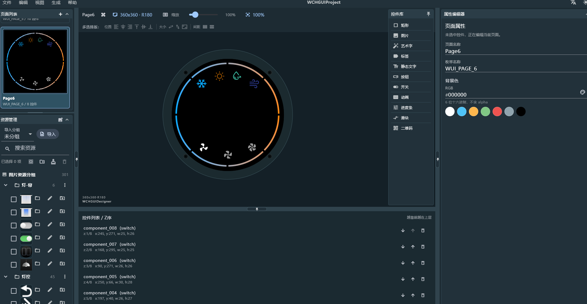
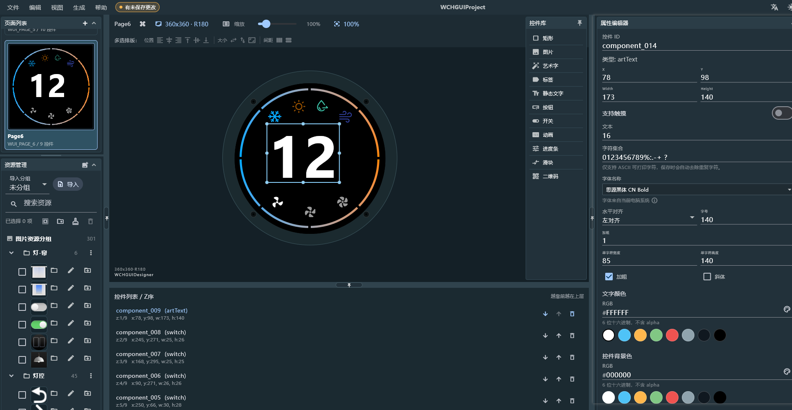
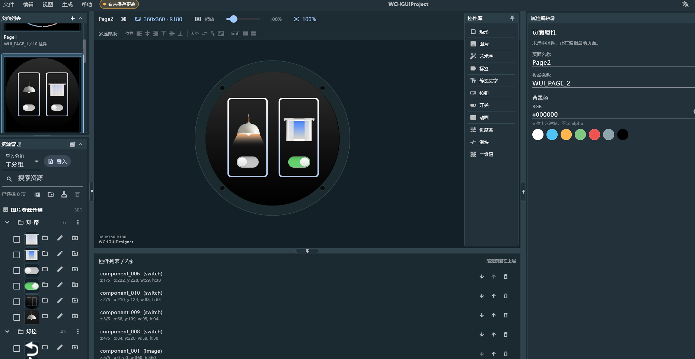
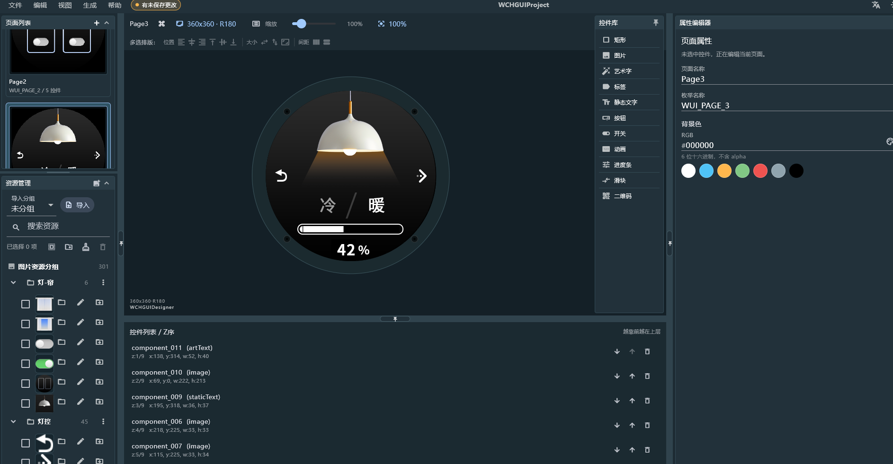
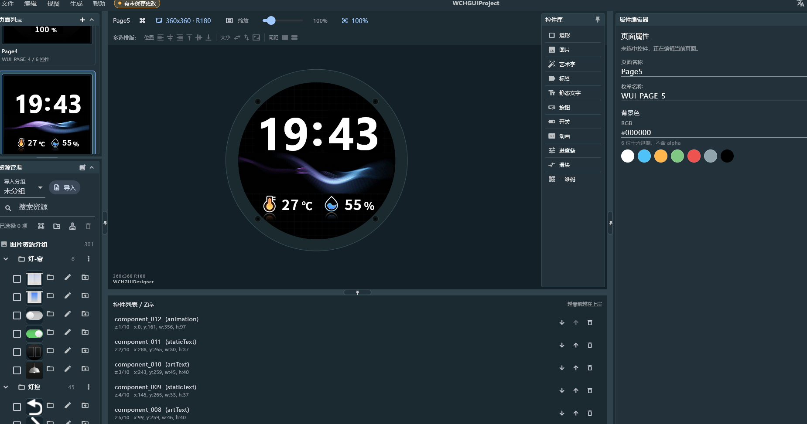
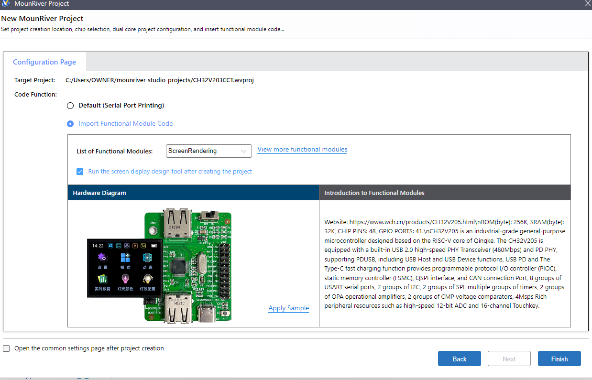
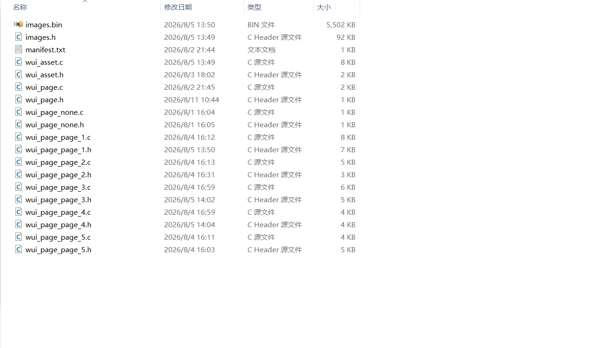

<table>
<colgroup>
<col style="width: 49%" />
<col style="width: 50%" />
</colgroup>
<thead>
<tr>
<th rowspan="2"></th>
<th></th>
</tr>
<tr>
<th></th>
</tr>
</thead>
<tbody>
</tbody>
</table>

说明

WCHGUI 是沁恒微电子为 CH32系列MCU 配套的轻量级 GUI 库，配合
WCHGUIDesigner​ 上位机，采用"声明式 UI + 自动代码生成 +
硬件抽象层"的路线，在几KB RAM 的嵌入式设备上也能跑多页面界面。本文以
CH32V203CCT6 + ST77916 LCD + SPI Flash 为例，梳理从 Designer 出图到 main
函数刷帧的完整闭环，并给出进度条、开关、按钮、图片等常用控件的业务层写法，帮助开发人员快速掌握。

**适用范围**

| 适用范围 | 系列                           |
|----------|--------------------------------|
| 通用MCU  | CH32L103、CH32V006、CH32V203等 |

目录

[说明 [1](#_Toc238218128)](#_Toc238218128)

[目录 [2](#_Toc238218129)](#_Toc238218129)

[图片索引 [2](#_Toc238218130)](#_Toc238218130)

[第1章 UI设计 [1](#ui设计)](#ui设计)

[1.1 上位机界面分区描述 [1](#上位机界面分区描述)](#上位机界面分区描述)

[1.2 控件选型 [2](#控件选型)](#控件选型)

[1.3 UI绘制 [2](#ui绘制)](#ui绘制)

[第2章 资源导出与底层代码集成
[8](#资源导出与底层代码集成)](#资源导出与底层代码集成)

[2.1 资源导出 [8](#资源导出)](#资源导出)

[2.2 底层代码集成 [8](#底层代码集成)](#底层代码集成)

[2.2.1 生成文件结构说明 [9](#生成文件结构说明)](#生成文件结构说明)

[2.2.2 HAL 接口职责说明 [9](#hal-接口职责说明)](#hal-接口职责说明)

[2.2.3 刷新机制简述 [10](#刷新机制简述)](#刷新机制简述)

[第3章 项目实战：控制盒子 [11](#项目实战控制盒子)](#项目实战控制盒子)

[3.1 系统功能需求定义 [11](#系统功能需求定义)](#系统功能需求定义)

[3.2 系统功能实现 [11](#系统功能实现)](#系统功能实现)

[3.2.1 启动页 [11](#启动页)](#启动页)

[3.2.2 空调控制页 [13](#空调控制页)](#空调控制页)

[3.2.3 场景控制页 [16](#场景控制页)](#场景控制页)

[3.2.4 灯光控制页 [17](#灯光控制页)](#灯光控制页)

[3.2.5 窗帘控制页 [19](#窗帘控制页)](#窗帘控制页)

[第4章 常见问题与调试技巧
[21](#常见问题与调试技巧)](#常见问题与调试技巧)

[4.1 UI 卡顿 [21](#ui-卡顿)](#ui-卡顿)

[4.2 触摸不灵敏 [21](#触摸不灵敏)](#触摸不灵敏)

[4.3 控件显示异常 [21](#控件显示异常)](#控件显示异常)

[历史版本 [22](#_Toc238218156)](#_Toc238218156)

[声明 [23](#_Toc238218157)](#_Toc238218157)

图片索引

[上位机界面分区 [1](#_Toc238218158)](#_Toc238218158)

[控件拖拽 [2](#_Toc238218159)](#_Toc238218159)

[控件属性设置 [3](#_Toc238218160)](#_Toc238218160)

[控件在UI视图中的显示 [4](#_Toc238218161)](#_Toc238218161)

[多个开关控件的显示 [4](#_Toc238218162)](#_Toc238218162)

[艺术字控件的设置 [5](#_Toc238218163)](#_Toc238218163)

[静态文字控件的设置 [5](#_Toc238218164)](#_Toc238218164)

[场景控制页展示 [6](#_Toc238218165)](#_Toc238218165)

[灯光控制页展示 [6](#_Toc238218166)](#_Toc238218166)

[窗帘控制页展示 [7](#_Toc238218167)](#_Toc238218167)

[启动页展示 [7](#_Toc238218168)](#_Toc238218168)

[MCU C代码生成 [8](#_Toc238218169)](#_Toc238218169)

[WCHGUI工程代码新建 [9](#_Toc238218170)](#_Toc238218170)

[UI代码的移植 [9](#_Toc238218171)](#_Toc238218171)

# UI设计

## 上位机界面分区描述

上位机主要功能区域可以分为资源管理、UI显示视图、控件工具箱、属性面板、控件层级树等区域，如下图1-1所示。

<figure>

<figcaption>
图 1‑1上位机界面分区
</figcaption>
</figure>

- 资源管理

> 功能：用于导入外部资源（如 PNG/JPG
> 图片、GIF动画）、资源分区、资源清理及删除。
>
> 作用：用户导入所需的外部资源，从而形成类似资源池的概念，用于后续控件的开发加载。此处导入相关资源并不会占用外部flash的内存，用户无需担心。且在加载gif图片时候上位机可以实现自动抽帧处理。

- UI 显示视图

> 功能：提供实时的界面预览，方便用户对实际的界面进行判断处理。
>
> 作用：通过此功能开发者无需频繁烧录 MCU
> 即可直观确认布局、配色和图片叠加效果，从而实现所看即所得。

- 控件工具箱

> 功能：提供丰富的内置控件库，如标签（Label）、按钮（Button）、进度条（Progress
> Bar）、开关（Switch）、静态图片（Image）等
>
> 作用：支持拖拽式添加控件，快速搭建界面。

- 属性面板

> 功能：用于配置选中控件的详细参数。包括该页面下控件唯一
> ID、控件坐标、控件区域、触摸控制、背景色、页面名称等
>
> 作用：精准控制控件表现，所有配置最终会转化为 C 语言中的
> wui_widget_desc_t
> 结构体。每个页面中包含的控件信息都存放在对应的h文件中，用户可以直观的在代码中看到所设置的属性。

- 控件层级树

> 功能：以树状结构展示当前页面的控件的叠放顺序。
>
> 作用：方便管理复杂界面中的控件遮挡关系，支持调整控件的层级以便编辑。

## 控件选型

WCHGUI 的控件选择直接影响后续的业务逻辑开发，建议遵循以下原则：

- 状态型图标（开/关）：优先使用 开关
  控件，而非图片序列，可简化业务逻辑。

- 触发动作类图标：按钮（Button）与开关（Switch）在视觉上均可表现为可点击的图标，但其交互语义与数据模型完全不同，开关（Switch）用于切换持久性状态，切换后状态持续有效。按钮（Button）用于触发一次性动作，如页面跳转、指令发送、弹窗确认等。

- 数值型显示：优先使用艺术字（ExString），避免使用静态文字，因为静态文字是以图片的形式存在spi
  flash中无法改变数值。

- 动画型控件：GIF 由上位机自动抽帧，适合启动动画，业务动画。

- 进度条控件：由背景与填充区域组成，默认采用纯色填充（背景色 +
  前景色），适用于美观度要求不高的场景。

- 滑块控件：本质和进度条类似，但由背景图与滑块图两张图片拼接而成：背景图作为轨道，滑块图作为可移动的手柄，适用于需要反应手柄位置的场景,可操作性更强。

**注意：**

> 触摸区域：控件默认触摸区域等于显示区域，对于小图标建议手动扩大touch_areas_page_x，以提升用户体验。

## UI绘制

本节以圆形 LCD 为例，介绍 UI
界面的绘制流程。有关工程创建、环境配置等基础操作，请参见 WCHGUIDesigner
上位机“帮助”菜单下的《WCHGUIDesigner
使用指南》。下文将重点阐述基于控件库的界面搭建方法。

以图 1-1 所示界面为例，UI 绘制流程如下：

1、新建页面：根据屏幕尺寸配置页面属性。

2、添加图：从右侧控件库拖入图片控件（Image）至 UI 显示视图。

<figure>

<figcaption>
图 1‑2 控件拖拽
</figcaption>
</figure>

3、在属性面板中，为该图片控件指定对应的外部图片资源。此处首先选择页面背景图，并将控件坐标（X,
Y）均设为（0, 0），使其完整覆盖整个显示区域。

**关于图片类型：**

单张图片：适用于静态背景或固定图标。

图片序列：适用于需要动态切换显示内容的场景（如动画、状态切换）。本例背景为静态，因此选择“单张图片”。

**关于压缩方式：**

WCHGUIDesigner 支持对图片资源进行压缩，以减小最终 images.bin
的体积。压缩率越高，资源占用越小，但图片质量会相应下降。开发者应根据屏幕分辨率、色彩丰富度及
Flash 容量综合权衡。

**关于触摸配置：**

控件库中的所有控件均默认支持触摸功能。开启后，默认触摸区域即为控件自身的显示区域。由于本控件为背景图层，不参与交互，因此无需开启触摸使能，以避免遮挡上层功能控件的触摸事件响应。

<figure>

<figcaption>
图 1‑3 控件属性设置
</figcaption>
</figure>

如图1-4所示，界面中的功能图标（如制冷模式）需要在触摸后实现状态切换。虽然此类需求可通过“图片序列（MultiState）”控件实现，但考虑到制冷模式仅存在“开启”与“关闭”两种离散状态，从逻辑简洁性角度考虑，优先选用开关（Switch）控件更为合理，这能显著降低后续业务逻辑的开发复杂度。

在属性面板中，除常规的坐标与触摸配置外，需重点配置以下参数：

**状态图片：**分别指定“开启”与“关闭”状态下的显示图片。

**压缩方式：**根据显示效果需求权衡压缩率。

**初始状态：**开发者可根据产品默认行为，预设开关的初始状态（开/关）。

WCHGUIDesigner 支持在设计阶段模拟运行状态。在 UI
显示视图中直接点击该开关控件，即可实时预览开/关状态的切换效果，无需频繁烧录固件，真正实现了“所见即所得”的设计体验。由于开关控件位于背景图之上，且已开启触摸功能，因此无需担心背景图遮挡触摸事件的问题。

<figure>

<figcaption>
图 1‑4 控件在UI视图中的显示
</figcaption>
</figure>

4、采用上述相同的设计方法，依次完成其余功能图标的绘制。在拖拽控件、配置状态图片及触摸区域后，即可完成整个页面的布局。绘制完成后的界面效果如图
1-5 所示。

<figure>

<figcaption>
图 1‑5 多个开关控件的显示
</figcaption>
</figure>

5、界面中央的温度数值为动态变量，需支持运行时刷新，因此选用艺术字控件进行绘制。在属性面板中，首先划定显示区域，随后对字体类型、字号、对齐方式、字重（加粗）、字体颜色及背景色等属性进行配置。

此外，艺术字控件与前述开关控件在交互逻辑上形成互补：开关负责状态切换（开/关），艺术字负责状态反馈（当前温度值），二者共同构成了空调控制页的核心交互闭环。

<figure>

<figcaption>
图 1‑6 艺术字控件的设置
</figcaption>
</figure>

6、相较于动态变化的温度数值，单位符号“℃”属于固定显示内容，因此选用静态文字控件实现。在属性面板中完成字体与布局的常规配置后，务必开启“透明背景”选项。此举可避免静态文字控件自带的不透明背景覆盖底层装饰纹理，确保界面层次干净、自然。

<figure>

<figcaption>
图 1‑7 静态文字控件的设置
</figcaption>
</figure>

至此，页面 1 的 UI 绘制流程已完整呈现。WCHGUI
采用统一的控件配置逻辑，无论是进度条、滑块还是图片序列，其操作方法均与上述步骤一致。遵循“从底向上”的图层构建原则，依次完成其余页面的设计。各页面最终效果如下图所示。

<figure>

<figcaption>
图 1‑8 场景控制页展示
</figcaption>
</figure>

<figure>

<figcaption>
图 1‑9 灯光控制页展示
</figcaption>
</figure>

<figure>

<figcaption>
图 1‑10 窗帘控制页展示
</figcaption>
</figure>

<figure>

<figcaption>
图 1‑11 启动页展示
</figcaption>
</figure>

# 资源导出与底层代码集成

1.  

## 资源导出

完成 UI 绘制后，需执行资源导出操作。如图 2-1
所示，在“生成”功能页中，首先执行文件校验，确认无误后点击“生成”按钮。该操作将在输出路径下创建
generated/wui_user/ 文件夹，内含两类关键输出：

- **资源文件**：images.bin，包含所有图片、字体等资源的压缩包，需烧录至外部
  SPI Flash。

- **源代码：**页面描述、控件定义及资源索引文件（如
  wui_page.c/.h），用于集成至 MCU 工程。

至此，上位机开发流程结束，后续工作将转入嵌入式软件集成阶段。

<figure>

<figcaption>
图 2‑1 MCU
C代码生成
</figcaption>
</figure>

## 底层代码集成

将 generated/wui_user/ 目录下的全部源文件与头文件，拷贝至 CH32V203CCT6
工程目录下的 User/wui_user 文件夹中。本工程基于 MounRiver Studio II
新建，选用官方“屏显 DEMO”作为模板。完成文件拷贝后，即完成了上位机 UI
代码至嵌入式工程的迁移工作。

<figure>

<figcaption>
图 2‑2 WCHGUI工程代码新建
</figcaption>
</figure>

<figure>

<figcaption>
图 2‑3 UI代码的移植
</figcaption>
</figure>

### 生成文件结构说明

生成文件可分为三类：

- 资源层：wui_asset.c/h，定义图片、字体、控件 ID 的映射关系。

- 页面层：wui_page_page_x.c/h，每个页面对应一个文件，包含控件表与页面逻辑。

- 管理层：wui_page.c/h，维护页面切换与生命周期。

### HAL 接口职责说明

WCHGUI 通过 HAL（Hardware Abstraction
Layer）与底层硬件解耦。用户只需实现以下接口：

touch_read：读取电阻/电容屏坐标。

flash_read ：从 SPI Flash 读 images.bin 段，WCHGUI 负责解码与缓存。

lcd_set_windows：设定 LCD 绘图窗口，是局部刷新的基础。

lcd_dma\_\*：WCHGUI 通过 DMA 批量发送 RGB565 数据，避免 CPU 逐点写屏。

    /*********************************************************************
     * @fn      wui_get_hal
     *
     * @brief   Get WUI HAL interface structure.
     *          User should register implemented HAL functions in this function.
     *
     * @return  Pointer to HAL interface structure.
     */
    const wui_hal_t* wui_get_hal(void)
    {
        static const wui_hal_t hal = {
            .touch_read      = touch_read,
            .flash_read      = spi_flash_read,
            .lcd_set_windows = lcd_set_windows,
            .lcd_dma_start   = lcd_dma_start,
            .lcd_dma_send    = lcd_dma_send,
            .lcd_dma_wait    = lcd_dma_wait,
            .lcd_dma_end     = lcd_dma_end,
        };

        return &hal;
    }

### 刷新机制简述

WCHGUI 采用脏矩形刷新机制：仅当控件内容发生变化时，才通过
lcd_set_windows() 划定更新区域并启动 DMA
传输。因此，切勿在业务代码中直接调用 LCD_DrawPoint()
等底层绘图函数，否则会破坏 GUI
一致性，所以开发者请勿额外直接操作底层函数进行绘制。

# 项目实战：控制盒子

2.  

## 系统功能需求定义

系统共包含 5
个功能页面，页面切换逻辑由旋转编码器方向及触摸事件共同驱动，页面关系如下：

- 页面 5（启动页/主页）：系统上电默认显示页面。

- 页面 1（空调控制页）：负责空调温度调节、空调模式选择与风速管理。

- 页面 2（场景控制页）：提供灯光与窗帘的入口。

- 页面 3（灯光控制页）：用于灯光类型与亮度的调节。

- 页面 4（窗帘控制页）：用于窗帘开合度的调节。

本章将基于前述 WCHGUI
框架与控制盒子功能需求，详细阐述业务逻辑的软件实现方法。有关 API
的详细说明，请参照《沁恒 WCHGUI 软件说明文档》。鉴于 MounRiver Studio II
新建的 WCHGUI 工程已集成了 ST77916 LCD 及 Nor Flash 驱动，本章将聚焦于
WCHGUI 的业务层开发，不再赘述底层外设驱动的实现细节。

## 系统功能实现

### 启动页

启动页包含轮播动画效果。该效果无需编写业务代码，仅需在上位机
WCHGUIDesigner
中选中动画控件，并在属性面板勾选“循环”复选框，即可实现动画的自动循环播放。

- 默认显示：系统上电或复位后，自动加载并显示页面 5。

- 跳转逻辑：等待编码器输入，左旋跳转至页面 1，右旋跳转至页面 2。

在wui_page.h中将启动页面设置为页面5，这一步只需修改宏定义的值即可。

\#define WUI_START_PAGE WUI_PAGE_5

当系统切换至页面 5 时，WCHGUI 将自动调用 wui_page_page_5_init()
函数完成页面初始化。该函数主要承担三项职责：

1、控件状态初始化：恢复页面进入时的默认显示状态。

2、事件回调注册：注册编码器或按键等输入设备的事件处理函数（如
page_5_on_key）。

3、业务逻辑预处理：执行页面所需的特定业务初始化操作。

以时间显示为例，通过调用 wui_widget_exstring_set_str()
接口，将当前时、分数值写入对应的艺术字控件，即可完成启动页时间信息的首次刷新。

    /*********************************************************************
     * @fn      wui_page_page_5_init
     *
     * @brief   Initialize page 5.
     *          Displays current time from RTC.
     *
     * @return  none
     */
    void wui_page_page_5_init(void)
    {
        /* Initialize page widgets */
        wui_page_init(widgets_page_5, sizeof(widgets_page_5) / sizeof(widgets_page_5[0]));

        /* Register event handlers */
        wui_register_key_handler(page_5_on_key);

        /* Initialize time display from RTC */
        time_hour = calendar.hour;
        time_min = calendar.min;

        sprintf(page5_hourstr, "%d", time_hour);
        wui_widget_exstring_set_str(COMPONENT_005, page5_hourstr);

        sprintf(page5_minstr, "%d", time_min);
        wui_widget_exstring_set_str(COMPONENT_006, page5_minstr);
    }

页面 5 加载时，已通过 wui_register_key_handler() 注册 page_5_on_key()
回调函数。该回调由 WCHGUI
内核管理，当编码器发生旋转时自动触发，无需在业务代码中轮询键值。

在回调函数中，通过判断传入的键值识别编码器旋转方向，并调用
wui_page_switch() 接口完成页面切换逻辑：左旋跳转至页面
1（空调控制页），右旋跳转至页面 2（场景控制页）。

    /*********************************************************************
     * @fn      page_5_on_key
     *
     * @brief   Key event handler for page 5.
     *          - 'R' key: Navigate to page 2
     *          - 'L' key: Navigate to page 1
     *
     * @param   key - Key code
     *
     * @return  none
     */
    static void page_5_on_key(uint32_t key)
    {
        switch (key) {
        case 'R':
            wui_page_switch(WUI_PAGE_2);
            break;

        case 'L':
            wui_page_switch(WUI_PAGE_1);
            break;

        case 'S':
            /* Reserved for future use */
            printf("key s\r\n");
            break;

        default:
            break;
        }
    }

RTC需要实时更新因此在开启RTC硬件后可以将需要显示的时间放在wui_page_page_5_loop函数中（该函数只是只是一个普通的函数指针，调用节奏是用户自己去设置的。刷新节奏是通过wui_page_ui_update()
内部会调用当前页面的
page_loop()，因此开发者应避免在该函数中执行阻塞延时或复杂运算，以确保界面流畅刷新，该函数在当前页面生命周期内持续运行，页面切换后自动停止。），在判断需要对控件的值进行更新时可以通过wui_widget_exstring_set_str函数改变艺术字的值。具体代码逻辑如下：

    /*********************************************************************
     * @fn      wui_page_page_5_loop
     *
     * @brief   Page 5 main loop function.
     *          Updates time display when RTC minute changes.
     *
     * @return  none
     */
    void wui_page_page_5_loop(void)
    {
        /* Check if update is needed */
        if (!need_updata) {
            return;
        }

        /* Clear update flag */
        need_updata = 0;

        /* Check if minute has changed */
        if (time_min == calendar.min) {
            return;
        }

        /* Update time cache and display */
        time_hour = calendar.hour;
        time_min = calendar.min;

        sprintf(page5_hourstr, "%d", time_hour);
        wui_widget_exstring_set_str(COMPONENT_005, page5_hourstr);

        sprintf(page5_minstr, "%d", time_min);
        wui_widget_exstring_set_str(COMPONENT_006, page5_minstr);
    }

### 空调控制页

- 温度调节：通过旋转编码器进行温度数值的增减调节。

- 风速控制：支持 低、中、高​ 三挡风速切换。

- 自动回跳逻辑：当风速处于 2挡（中速）​
  时，若检测到空调功能状态发生过变化（如开关切换或挡位调节），系统自动跳转回页面
  5。此逻辑用于模拟“设置完成自动返回主页”的用户体验。

在 UI
设计阶段，空调功能选用开关（Switch）控件，并已开启触摸使能，上位机将在
cwui_page_page_1.h
中自动生成对应的触摸区域描述符。然而，对于尺寸较小的功能图标，其默认触摸区域（即控件显示区域）可能不足以提供良好的交互体验，易导致触摸失灵或误触。

为解决此问题，建议在页面初始化阶段通过 wui_touch_area_t
结构体手动调整触摸区域。通过适当扩大 (x, y)
坐标范围与宽高，可在不改变视觉效果的前提下，显著提升触摸命中率与用户体验。

    static const wui_touch_area_t touch_areas_page_1[] = {
        {
            .widget_id = COMPONENT_015,
            .x         = 80,
            .y         = 66,
            .w         = 45,
            .h         = 45,
    },
    //其他控件等……
    }

在页面 1 的初始化函数 wui_page_page_1_init() 中，首先需调用
wui_register_touch_layer() 注册前述定义的触摸区域及其回调函数
page_1_on_touch，使能手动扩展的触摸响应区。

随后，需对页面内的控件状态进行同步刷新，包括空调功能模式与风速档位。此举旨在确保页面显示状态与系统全局变量（即退出页面时的最后状态）保持一致，避免产生状态跳变或显示歧义。

本例采用在初始化阶段强制同步状态的策略，逻辑清晰且实现简单。开发者可根据项目复杂度，选择将此逻辑封装为独立的
app_functions_refresh函数，或采用状态机管理等更优架构。。

    /*********************************************************************
     * @fn      wui_page_page_1_init
     *
     * @brief   Initialize page 1.
     *          This function initializes widgets, registers event handlers.
     *
     * @return  none
     */
    void wui_page_page_1_init (void) {
        /* Initialize page widgets */
        wui_page_init (widgets_page_1, sizeof (widgets_page_1) / sizeof (widgets_page_1[0]));

        /* Register key event handler */
        wui_register_key_handler (page_1_on_key);

        /* Register touch layer */
        wui_register_touch_layer (touch_areas_page_1, sizeof (touch_areas_page_1) / sizeof (touch_areas_page_1[0]), page_1_on_touch);

        /* USER CODE BEGIN: Init */
        sprintf (label_str, "%d", Temperature_value);
        wui_widget_exstring_set_str (COMPONENT_014, label_str);
        app_functions_refresh();
        app_windspeed_refresh();

        /* USER CODE END: Init */
    }

页面 1 的初始化、刷新逻辑与启动页类似，本节重点解析触摸回调函数
page_1_on_touch() 的实现。当用户触摸屏幕时，WCHGUI
自动调用该函数，并传入触发事件的控件 ID。

回调函数通过比对控件
ID，识别当前操作对象。当判定为功能模式或风速档位控件时，调用
wui_widget_switch_set_on()
更新开关状态。本逻辑的核心目的在于实现“互斥机制”：确保同一时刻仅有一个功能模式（如制冷）和一种风速档位（如中速）处于激活状态。

需特别说明的是，若仅需实现“点击切换图片”的效果，WCHGUI
在上位机配置后无需编写任何业务代码即可自动完成。本例中的代码逻辑旨在实现复杂的业务规则（互斥控制），属于业务层增强逻辑。。

    /*********************************************************************
     * @fn      page_1_on_touch
     *
     * @brief   Touch event handler for page 1.
     *
     * @param   widget_id - Widget ID that triggered the event.
     * @param   event - Event type.
     *
     * @return  none
     */
    static void page_1_on_touch(uint16_t widget_id, uint16_t event)
    {
        /* Check if touched widget is a function mode button */
        for (uint8_t i = 0; i < FUNCTIONS_COUNT; i++) {
            if (functions_item_ids[i] == widget_id) {
                /* Update function mode state */
                functions_last = functions_current;
                functions_current = (Functions_Index_e)i;

                /* Update all function mode switches */
                for (uint8_t j = 0; j < FUNCTIONS_COUNT; j++) {
                    wui_widget_switch_set_on(functions_item_ids[j],
                                              (functions_item_ids[j] == widget_id));
                }
                return;
            }
        }

        /* Check if touched widget is an airspeed level button */
        for (uint8_t i = 0; i < AIRSPEED_LEVEL; i++) {
            if (airspeed_ids[i] == widget_id) {
                /* Update airspeed level state */
                speed_last = speed_current;
                speed_current = (Speed_Level_e)i;

                /* Update all airspeed level switches */
                for (uint8_t j = 0; j < AIRSPEED_LEVEL; j++) {
                    wui_widget_switch_set_on(airspeed_ids[j],
                                              (speed_last != speed_current) ?
                                              (airspeed_ids[j] == widget_id) : 0);
                }
                return;
            }
        }
    }

### 场景控制页

- 设备入口：页面布局包含“台灯”与“窗帘”两个独立的功能图标。

- 页面跳转：

点击 台灯图标，跳转至页面 3（灯光控制页）。

点击 窗帘图标，跳转至页面 4（窗帘控制页）。

- 设备控制：页面内集成开关控件，可直接控制灯光与窗帘的开启与关闭。

页面 2
延续了开关控件的使用方式，触摸回调注册等基础流程不再赘述。本页的核心设计重点在于状态联动机制。

在触摸回调函数中，通过 wui_widget_switch_is_on()
接口实时获取台灯与窗帘开关的当前状态，并据此驱动硬件或更新全局状态变量。关键在于，页面
2 作为控制中枢，其状态变更必须同步至其他关联页面（如页面 3
灯光控制页、页面 4 窗帘控制页）。

为此，本设计引入全局状态变量存储台灯与窗帘的开关状态。在页面 2
触发状态切换时，同步修改全局变量；当系统切换至页面 3 或页面 4
时，其初始化函数（wui_page_page_3_init()
等）将读取该全局变量并刷新控件状态。这种基于全局状态的管理策略，有效避免了跨页面操作导致的逻辑不一致问题。

    static void page_2_on_touch(uint16_t widget_id, uint16_t event)
    {
        /* Light control button */
        if (widget_id == COMPONENT_008) {
            uint8_t is_on = wui_widget_switch_is_on(COMPONENT_008);
            wui_widget_switch_set_on(COMPONENT_009, is_on);
            set_Intensity_percent(is_on ? 100 : 0);
        }
        /* Curtain control button */
        else if (widget_id == COMPONENT_006) {
            uint8_t is_on = wui_widget_switch_is_on(COMPONENT_006);
            wui_widget_switch_set_on(COMPONENT_010, is_on);
            set_CurtainDegree(is_on ? 0 : 100);
        }
        /* Light intensity adjustment button */
        else if (widget_id == COMPONENT_009) {
            wui_page_switch(WUI_PAGE_3);
        }
        /* Curtain degree adjustment button */
        else if (widget_id == COMPONENT_010) {
            wui_page_switch(WUI_PAGE_4);
        }
    }

### 灯光控制页

- 灯光类型：支持多种灯光模式切换（如暖光、冷光）。

- 亮度调节：通过进度条，调整当前灯光模式的亮度强度。

- 状态反馈：亮度值实时映射至该页面的图片控件，根据进度条的值去显示不同的图片。

在加载该页面时，除了保证注册触摸回调，还需要保证进度条占比和艺术字的值相互匹配，同时根据占比去调整灯光的强度。

本页面展示了 WCHGUI 的多控件联动机制：进度条-\> 亮度百分比、艺术字-\>
亮度数值显示、图片序列-\>
灯光强度可视化，三者通过同一数据源驱动，确保显示一致性。对于进去条控件来说wui_widget_pb_set_value函数可以设置进度条的占比，对于图片序列则是使用wui_widget_multistate_set_index用于设置指定的图片。

    /*********************************************************************
     * @fn      wui_page_page_3_init
     *
     * @brief   Initialize page 3.
     *          Sets up light control UI with current intensity and type.
     *
     * @return  none
     */
    void wui_page_page_3_init(void)
    {
        /* Initialize page widgets */
        wui_page_init(widgets_page_3, sizeof(widgets_page_3) / sizeof(widgets_page_3[0]));

        /* Register event handlers */
        wui_register_key_handler(page_3_on_key);
        wui_register_touch_layer(touch_areas_page_3,
                                  sizeof(touch_areas_page_3) / sizeof(touch_areas_page_3[0]),
                                  page_3_on_touch);

        /* Initialize intensity display */
        uint8_t Intensity_percent = get_Intensity_percent();
        wui_widget_pb_set_value(COMPONENT_004, Intensity_percent);
        sprintf(Intensity_str, "%d", Intensity_percent);
        wui_widget_exstring_set_str(COMPONENT_011, Intensity_str);

        /* Set light image based on current state */
        if (Intensity_percent == 0) {
            wui_widget_multistate_set_index(COMPONENT_010, 0);
        } else {
            if (lightingtype == Cold_light) {
                wui_widget_multistate_set_index(COMPONENT_010, Intensity_percent / 5);
                wui_widget_multistate_set_index(COMPONENT_006, Warm_light);
                wui_widget_multistate_set_index(COMPONENT_007, 0);
            } else {
                wui_widget_multistate_set_index(COMPONENT_010, Intensity_percent / 5 + 20);
                wui_widget_multistate_set_index(COMPONENT_006, Cold_light);
                wui_widget_multistate_set_index(COMPONENT_007, 1);
            }
        }
    }

在触摸回调函数中，除了对控件的判断还需要增加对触摸的判断。对于大部分控件，触摸事件共分为4种分别是触摸按下、触摸移动、触摸长按、触摸抬起，本页面的控件使用触摸按下用来消抖。开关控件和进度条控件有他们自己的触摸类型，因此不适用上述4种类型的触摸事件。通过
wui_widget_multistate_next()
切换图片序列索引，实现灯光类型的循环切换。该接口内部自动处理索引边界，无需用户额外判断。若需要获取当前图片序列的序号则可以使用wui_widget_multistate_get_index。通过先获取目前灯光的类型后，去调整灯光的颜色和强度。

    /*********************************************************************
     * @fn      page_3_on_touch
     *
     * @brief   Touch event handler for page 3.
     *          Handles light type switching and intensity adjustment.
     *
     * @param   widget_id - Widget ID that triggered the event
     * @param   event - Event type
     *
     * @return  none
     */
    static void page_3_on_touch(uint16_t widget_id, uint16_t event)
    {
        /* Light type toggle buttons (COMPONENT_006 and COMPONENT_007) */
        if ((widget_id == COMPONENT_006 || widget_id == COMPONENT_007) &&
            (event == WUI_TOUCH_DOWN)) {
            /* Toggle light type */
            wui_widget_multistate_next(COMPONENT_006);
            wui_widget_multistate_next(COMPONENT_007);
            lightingtype = (lightingtype == Warm_light) ? Cold_light : Warm_light;

            /* Update light image based on type and intensity */
            uint8_t light_type = wui_widget_multistate_get_index(COMPONENT_006);
            uint8_t img_index = wui_widget_multistate_get_index(COMPONENT_010);

            if (img_index > 0) {
                img_index = (light_type == 1) ? (img_index - 20) : (img_index + 20);
            }

            wui_widget_multistate_set_index(COMPONENT_010, img_index);
        }
        /* Intensity adjustment progress bar */
        else if (widget_id == COMPONENT_004) {
            uint8_t Intensity_percent = wui_widget_pb_get_value(COMPONENT_004);

            /* Update intensity state and display */
            set_Intensity_percent(Intensity_percent);
            sprintf(Intensity_str, "%d", Intensity_percent);
            wui_widget_exstring_set_str(COMPONENT_011, Intensity_str);

            /* Update light image based on intensity */
            if (Intensity_percent != 0) {
                uint8_t light_type = wui_widget_multistate_get_index(COMPONENT_006);
                uint8_t img_index = (light_type == 0) ? (Intensity_percent / 5 + 20)
                                                       : (Intensity_percent / 5);
                wui_widget_multistate_set_index(COMPONENT_010, img_index);
            } else {
                wui_widget_multistate_set_index(COMPONENT_010, 0);
            }
        }
        /* Navigate to page 2 */
        else if (widget_id == COMPONENT_001) {
            wui_page_switch(WUI_PAGE_2);
        }
        /* Navigate to page 4 */
        else if (widget_id == COMPONENT_002) {
            wui_page_switch(WUI_PAGE_4);
        }
    }

### 窗帘控制页

- 开合控制：通过旋转编码器调节窗帘的开合百分比。

- 实时反馈：窗帘的开合程度通过艺术字控件实时显示，调节过程中不触发页面跳转，直至用户退出该页面。

窗帘开合度的调节采用旋转编码器实现，而非触摸操作。这一设计体现了 WCHGUI
的核心架构优势：UI 逻辑与输入设备解耦。WCHGUI
内核并不感知具体的输入来源（无论是编码器、按键还是触摸），它仅关注“控件值”的变化。开发者只需将编码器的物理转动映射为控件值的增减，即可驱动
UI 更新，无需针对特定硬件修改 GUI 内核。

在本页中，旋转编码器的转动被转换为图片控件的数值变化。WCHGUI
接收到数值变更后，自动完成图片序列得重绘与显示刷新。这种“输入设备 -\>
业务逻辑 -\> 控件值 -\> UI
刷新”的单向数据流，极大提升了代码的可移植性与可维护性。

关于触摸切换页面的逻辑，因在页面 2 及页面 3 中已有详述，本节不再重复。。

    /*********************************************************************
     * @fn      page_4_on_key
     *
     * @brief   Key event handler for page 4.
     *          - 'R' key: Increase curtain degree by 5
     *          - 'L' key: Decrease curtain degree by 5
     *
     * @param   key - Key code
     *
     * @return  none
     */
    static void page_4_on_key(uint32_t key)
    {
        uint8_t Degree = get_CurtainDegree();

        switch (key) {
        case 'R':
            /* Increase degree with limit */
            Degree = (Degree >= DEGREE_MAX) ? DEGREE_MAX : Degree + DEGREE_STEP;
            break;

        case 'L':
            /* Decrease degree with limit */
            Degree = (Degree <= DEGREE_MIN) ? DEGREE_MIN : Degree - DEGREE_STEP;
            break;

        case 'S':
            /* Reserved for future use */
            break;

        default:
            return;
        }

        /* Update degree state and display */
        set_CurtainDegree(Degree);
        sprintf(Degree_str, "%d", Degree);
        wui_widget_exstring_set_str(COMPONENT_007, Degree_str);

        /* Update curtain image */
        uint8_t img_index = (Degree == 0) ? 0 : Degree / DEGREE_STEP;
        wui_widget_multistate_set_index(COMPONENT_005, img_index);
    }

# 常见问题与调试技巧

3.  

## UI 卡顿

- 检查 page_loop() 中是否存在阻塞延时

- 确认 DMA 传输未被中断打断。

## 触摸不灵敏

- 检查 wui_touch_area_t 是否过小

- 确认触摸坐标与 LCD 方向一致

## 控件显示异常

- 确认 images.bin 已正确烧录至 SPI Flash

- 检查 lcd_set_windows() 实现是否正确

- 若使用其他驱动屏幕，是否修改初始化函数

历史版本

| 日期      | 版本 | 变更内容 |
|-----------|------|----------|
| 2026/8/20 | V1.0 | 初版发行 |

声明

本手册版权所有为南京沁恒微电子股份有限公司（Copyright © Nanjing Qinheng
Microelectronics Co., Ltd. All Rights
Reserved），未经南京沁恒微电子股份有限公司书面许可，任何人不得因任何目的、以任何形式（包括但不限于全部或部分地向任何人复制、泄露或散布）不当使用本产品手册中的任何信息。

任何未经允许擅自更改本产品手册中的内容与南京沁恒微电子股份有限公司无关。

南京沁恒微电子股份有限公司所提供的说明文档只作为相关产品的使用参考，不包含任何对特殊使用目的的担保。南京沁恒微电子股份有限公司保留更改和升级本产品手册以及手册中涉及的产品或软件的权利。

参考手册中可能包含少量由于疏忽造成的错误。已发现的会定期勘误，并在再版中更新和避免出现此类错误。
