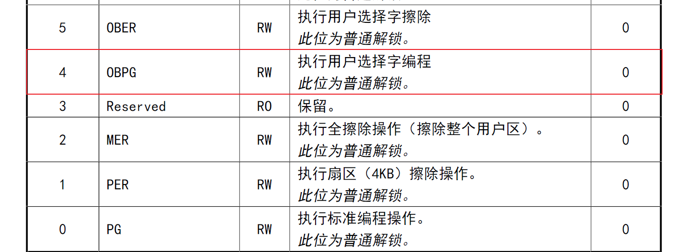
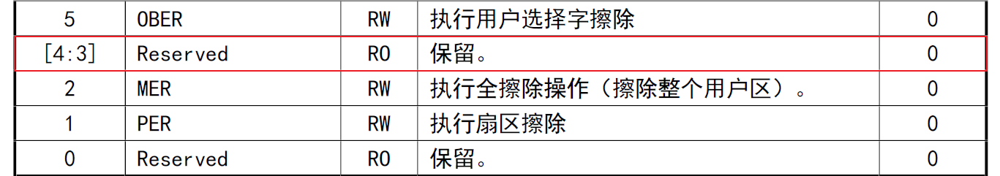

<table>
<colgroup>
<col style="width: 49%" />
<col style="width: 50%" />
</colgroup>
<thead>
<tr>
<th rowspan="2"></th>
<th>AN90002</th>
</tr>
<tr>
<th>V1.0</th>
</tr>
</thead>
<tbody>
</tbody>
</table>

说明

在一些应用中经常需要保存一些数据，便于芯片在在重新上电后读取芯片上次保存重要信息，或者判断芯片特殊状态。其特征是掉电后数据不丢失，一般芯片FLASH能够实现该功能，但是如果FLASH资源有限时，可以利用芯片用户字区域的FLASH来实现。本文主要讲述，在将用户字区域作为DataFlash存储数据的一些注意事项。

**适用范围**

| 适用范围 | 系列        |
|----------|-------------|
| 通用MCU  | 所有通用MCU |

目录

[说明 [1](#_Toc241517975)](#_Toc241517975)

[目录 [2](#_Toc241517976)](#_Toc241517976)

[表格索引 [2](#_Toc241517977)](#_Toc241517977)

[图片索引 [2](#_Toc241517978)](#_Toc241517978)

[第1章 用户字编程差异 [1](#用户字编程差异)](#用户字编程差异)

[1.1 用户字半字编程 [1](#用户字半字编程)](#用户字半字编程)

[1.2 用户字快速编程 [1](#用户字快速页编程)](#用户字快速页编程)

[第2章 用户字区域作DataFlash
[2](#用户字区域作dataflash)](#用户字区域作dataflash)

[2.1 用户字区域半字编程存储数据
[2](#用户字区域半字编程存储数据)](#用户字区域半字编程存储数据)

[2.2 用户字区域快速页编程存储数据
[4](#用户字区域快速页编程存储数据)](#用户字区域快速页编程存储数据)

[第3章 使用注意事项 [7](#使用注意事项)](#使用注意事项)

[3.1 宏定义区别 [7](#宏定义区别)](#宏定义区别)

[3.2 实际可用的用户字区域FLASH大小
[7](#实际可用的用户字区域flash大小)](#实际可用的用户字区域flash大小)

[3.3 与工具的搭配使用 [7](#与工具的搭配使用)](#与工具的搭配使用)

[历史版本 [8](#_Toc241517989)](#_Toc241517989)

[声明 [9](#_Toc241517990)](#_Toc241517990)

表格索引

[芯片用户字FLASH实际容量 [7](#_Toc241517991)](#_Toc241517991)

图片索引

[用户字编程位 [1](#_Toc241517994)](#_Toc241517994)

[CTLR寄存器描述 [1](#_Toc241517995)](#_Toc241517995)

# 用户字编程差异

通用MCU不同系列芯片的用户字编程方式是有区别的，其差异点在于是否支持半字编程。

## 用户字半字编程

用户字编程使能功能位于CTLR寄存器bit4，如图1-1所示，OBPG功能，该功能使用前需要执行FLASH普通解锁，操作过程中硬件自动8位取反写入地址+1的位置。支持该功能的芯片主要有，CH32V2/3、CH32V1、CH32V003、CH641、CH32M030、CH32H417、CH32V205、CH32V407、CH32X315等等。

<figure>

<figcaption>
图 ‑1用户字编程位
</figcaption>
</figure>

用户选择字区域FLASH操作流程如下：先执行FLASH普通解锁，然后执行用户字擦除（对应图1-1的bit5），接着开始用户字编程，编程结束FLASH上锁防止误操作。如果过程中修改了用户字功能位，需系统复位后加载到OBR寄存器才生效。

## 用户字快速页编程

对一些不支持半字编程的芯片，只能通过快速页编程方式，寄存器描述如图1-2所示，
bit0和bit4均为保留位。这种方式较于半字编程还是有很大区别的。首先不会硬件8位取反写入地址+1的位置，本质上把用这当做一块普通FLASH，所以操作逻辑和用户区的FLASH类似。因此擦除方式选择快速页擦和用户字擦除都是可行的。所以在作为DataFlash存储数据的时候，以快速页编程方式写入数据，如果要尽可能存储更多的数据可以忽略取反要求，当做普通FLASH存储数据即可。支持该功能的芯片主要有，CH32V006、CH32L103、CH32X035、CH643等。

<figure>

<figcaption>
图 ‑2 CTLR寄存器描述
</figcaption>
</figure>

用户选择字区域FLASH操作流程如下：先执行FLASH快速解锁，然后执行用户字擦除（对应图1-1的bit5），或者快速页擦除，接着开始用快速编程，编程结束FLASH上锁防止误操作。如果过程中修改了用户字功能位，需系统复位后加载到OBR寄存器才生效。

# 用户字区域作DataFlash

## 用户字区域半字编程存储数据

由于写FLASH前需要擦除，所以在最开始需要先将关键的数据读取并保存在缓存中，写步骤除了写目标地址，还要将其他数据填充。以V203为例来实现。

关键宏定义：

    /* DATAFLASH Size */
    #define Size_DataFlash             (0x400-8)
    #define Size_DataFlash_OB          (0x400)

缓存数组：

    uint8_t  rBuf[Size_DataFlash_OB];
    uint8_t  wBuf[Size_DataFlash];

实现函数如下：

    /*********************************************************************
     * @fn      FLASH_DataFlash_WRTTE
     *
     * @brief   Storing Data Segments to User Word Areas .
     *
     * @param   Rbuf - Array saved before user word erase
     *          Rlen - the length of array 'Rbuf' , and the value of Rlen shoud be no more than 1024.
     *          Wbuf - Array of data you want to store .
     *          Wlen - the length of array 'Wbuf' which will be store,and the value of Wlen shoud be no more than (Rlen-8).
     *          Wadr - the starting address to be store.the value of Wadr should fulfill (Wadr/2 ==0)
     *
     * @return  FLASH Status - The returned value can be: FLASH_ADR_RANGE_ERROR,
     *        FLASH_ALIGN_ERROR, FLASH_OP_RANGE_ERROR or FLASH_COMPLETE.
     */
    FLASH_Status FLASH_DataFlash_WRTTE(uint8_t * Rbuf, uint16_t Rlen, uint8_t * Wbuf, uint16_t Wlen, uint32_t Wadr)
    {
        uint32_t Addr = OB_BASE;
        uint16_t i;
        uint8_t * Rbuf1 = Rbuf;
        uint8_t * Wbuf1 = Wbuf;
        FLASH_Status status = FLASH_COMPLETE;

        if(Rlen > Size_DataFlash_OB || Rlen <= (Size_DataFlash_OB-Size_DataFlash))
        {
            return FLASH_ADR_RANGE_ERROR;
        }

        if((Wadr < (OB_BASE+0x10)) || ((Wadr+(Wlen<<1)) > (OB_BASE+(Rlen<<1))))
        {
            return FLASH_OP_RANGE_ERROR;
        }

        if((Wadr & 1) || (Wlen == 0))
        {
            return FLASH_ALIGN_ERROR;
        }

        /* OptionBytes and DataFlash Unlock*/
        FLASH->OBKEYR = FLASH_KEY1;
        FLASH->OBKEYR = FLASH_KEY2;

        /* Read OptionBytes and DataFlash */
        for(i = 0; i < Size_DataFlash_OB; i++)
        {
            *(uint8_t *)Rbuf1 = *(uint8_t *)(OB_BASE + 2 * i);
            Rbuf1 += 1;
        }
        /* Erase OptionBytes and DataFlash */
        FLASH->CTLR |= CR_OPTER_Set;
        FLASH->CTLR |= CR_STRT_Set;
        while(FLASH->STATR & SR_BSY)
            ;
        FLASH->CTLR &= ~CR_OPTER_Set;

        /* Write OptionBytes and DataFlash */
        Rbuf1 = (Rbuf + ((Wadr - OB_BASE) >> 1));

        for(i = 0; i < Wlen; i++)
        {
            *(uint8_t *)Rbuf1 = *(uint8_t *)Wbuf1;
            Rbuf1 += 1;
            Wbuf1 += 1;
        }

        FLASH->CTLR |= CR_OPTPG_Set;

        while(Rlen)
        {
            *(uint16_t*)Addr =  ((uint16_t)(*(uint8_t*)Rbuf) &0x00FF) | ((uint16_t)(~(*(uint8_t*)Rbuf))<<8);
            Addr += 2;
            while(FLASH->STATR & SR_BSY)
                ;
            Rbuf += 1;
            Rlen -= 1;
        }

        FLASH->CTLR &= ~CR_OPTPG_Set;

        /* OptionBytes and DataFlash Lock*/
        FLASH->CTLR &= ~(0x00000200);

        return status;
    }

## 用户字区域快速页编程存储数据

关键宏定义：

    /* DATAFLASH Size */
    #define Size_DataFlash            （0x100-16）
    #define Size_DataFlash_OB          (0x100)

缓存数组：

    uint32_t  rBuf[Size_DataFlash_OB/4];
    uint32_t  wBuf[Size_DataFlash/4];

实现函数如下：

    /*********************************************************************
     * @fn      FLASH_DataFlash_WRTTE
     *
     * @brief   Storing Data Segments to User Word Areas .
     *
     * @param   Rbuf - Array saved before user word erase
     *          Rlen - the length of array 'Rbuf' , and the value of Rlen shoud be no more than 1024.
     *          Wbuf - Array of data you want to store .
     *          Wlen - the length of array 'Wbuf' which will be store,and the value of Wlen shoud be no more than (Rlen-8).
     *          Wadr - the starting address to be store.the value of Wadr should fulfill (Wadr/2 ==0)
     *
     * @return  FLASH Status - The returned value can be: FLASH_ADR_RANGE_ERROR,
     *        FLASH_ALIGN_ERROR, FLASH_OP_RANGE_ERROR or FLASH_COMPLETE.
     */
    FLASH_Status FLASH_DataFlash_WRTTE(uint32_t * Rbuf, uint16_t Rlen, uint32_t * Wbuf, uint16_t Wlen, uint32_t Wadr)
    {
        uint32_t Addr = OB_BASE;
        uint32_t AddrLoad = OB_BASE;
        uint16_t i;
        uint32_t * Rbuf1 = Rbuf;
        uint32_t * Wbuf1 = Wbuf;
        uint8_t size;
        uint16_t len = Wlen>>2;
        FLASH_Status status = FLASH_COMPLETE;

        if(Rlen > Size_DataFlash_OB || Rlen <= (Size_DataFlash_OB-Size_DataFlash))
        {
            return FLASH_ADR_RANGE_ERROR;
        }

        if((Wadr < (OB_BASE+0x10)) || ((Wadr+Wlen) > (OB_BASE+Rlen)))
        {
            return FLASH_OP_RANGE_ERROR;
        }

        if((Wadr & 1) || (Wlen == 0))
        {
            return FLASH_ALIGN_ERROR;
        }

        /* OptionBytes and DataFlash Unlock*/
        FLASH->OBKEYR = FLASH_KEY1;
        FLASH->OBKEYR = FLASH_KEY2;

        /* Read OptionBytes and DataFlash */
        for(i = 0; i < (Size_DataFlash_OB/4); i++)
        {
            *(uint32_t *)Rbuf1 = *(uint32_t *)(OB_BASE + 4 * i);
            Rbuf1 += 1;
        }
        /* Erase OptionBytes and DataFlash */
        FLASH->CTLR |= CR_OPTER_Set;
        FLASH->CTLR |= CR_STRT_Set;
        while(FLASH->STATR & SR_BSY)
            ;
        FLASH->CTLR &= ~CR_OPTER_Set;

        /* Write OptionBytes and DataFlash */
        Rbuf1 = (Rbuf + ((Wadr - OB_BASE) >> 2));

        for(i = 0; i < len; i++)
        {
            *(uint32_t *)Rbuf1 = *(uint32_t *)Wbuf1;
            Rbuf1 += 1;
            Wbuf1 += 1;
        }

        i =  Size_DataFlash_OB/256;
        do{
            FLASH->CTLR |= CR_PAGE_PG;
            FLASH->CTLR |= CR_BUF_RST;
            while(FLASH->STATR & SR_BSY)
                ;
            size = 64;
            while(size)
            {
                *(uint32_t *)AddrLoad = *(uint32_t *)Rbuf;
                FLASH->CTLR |= CR_BUF_LOAD;
                while(FLASH->STATR & SR_BSY)
                    ;
                AddrLoad += 4;
                Rbuf += 1;
                size -= 1;
            }

            FLASH->ADDR = Addr;
            FLASH->CTLR |= CR_STRT_Set;
            while(FLASH->STATR & SR_BSY)
                ;
            FLASH->CTLR &= ~CR_PAGE_PG;
            Addr += 256;
        }while(--i);

        /* OptionBytes and DataFlash Lock*/
        FLASH->CTLR &= ~(0x00000200);
        return status;
    }

# 使用注意事项

## 宏定义区别

Size_DataFlash 为芯片可用的作为DataFlash存储信息的有效字节数。

Size_DataFlash_OB为芯片整个用户字区域所存储的有效数据字节数。

由于支持半字编程的芯片，硬件会自动取反，所以有效存储空间占总空间的一半。而快速页编程的方式，硬件不参与取反，所以剩余的用户字区域都可以用来存储数据。如V203的实际用户字区域大小2KB，因此Size_DataFlash_OB大小是0x400，Size_DataFlash大小是(0x400-8)，这里的8是最前面的16字节，有效8字节。如L103的实际用户字大小为256字节，因此Size_DataFlash_OB大小是0x100，Size_DataFlash大小是(0x100-16)。

## 实际可用的用户字区域FLASH大小

通过3.1节，可能会有疑问，V203的用户字FLASH大小和手册标注不一致，手册只描述有128字节可用，但是实际有2K。这点起初这块区域只为了用户字的前16字节准备，剩余的FLASH冗余，并且因为各自封的FLASH容量不同，各型号间的可用用户字区域大小都不一致，准确数据不好统一。所以，这里以实测的容量为准，一般不少于手册标注值。

下面给出常见的容量。

表 1芯片用户字FLASH实际容量

| 芯片型号 | 用户字FLASH实际容量 |
|:--------:|:-------------------:|
| CH32V307 |         2KB         |
| CH32V203 |         2KB         |
| CH32V208 |         2KB         |
| VH32V003 |         64B         |
| CH32V103 |         16B         |
| CH32X035 |        256B         |
| CH32L103 |        256B         |

## 与工具的搭配使用

一些工具在使用的过程中会配置芯片的配置字，因为配置前会执行全擦，比如LinkUtility
和
ISPStudio。所以在使用工具重新下载或者其他操作过程中会擦掉用户字区域保存的数据。如果用Mounrivers
Studio
进行一般的下载操作则不会配置用户字，除非涉及使能/解除读保护操作。这点需要格外注意。

软件处理方式可以进一步优化该功能。比如程序初始位置加上判断与重入用户字步骤，可以一定程度解决工具的误操作。

历史版本

| 日期       | 版本 | 变更内容 |
|------------|------|----------|
| 2026/09/28 | V1.0 | 初版发行 |

声明

本手册仅供参考。作者在不另行通知的情况下，可随时进行修改。
