AN91000

V1.0

***

说明

对于双核芯片的使用，在调试时需要根据不同需求进行相应的软件配置，相较于单核芯片的调试有着些许区别。本文重点介绍CH32H415、416、417双核芯片，在MRS2开发环境下的调试配置，分别列举单核和双核的主要调试流程，以及调试中的注意事项。以下内容的表述基于MRS2 版本2.3.0。

适用范围

| 适用范围 | 系列                 |
|----------|----------------------|
| 通用MCU  | CH32H415、416、417…… |

目录

[说明](#_Toc216081630)

[目录](#_Toc216081631)

[图片索引](#_Toc216081632)

[第1章 双核芯片仅对V3核调试](#_Toc216081633)

[1.1 单核V3调试](#单核v3调试)

[第2章 双核芯片对V3/V5核调试](#双核芯片对v3v5核调试)

[2.1 双核V3/V5调试](#双核v3v5调试)

[第3章 MRS2常用调试设置](#mrs2常用调试设置)

[3.1 MRS2常用调试功能](#mrs2常用调试功能)

[3.2 调试前的编译配置](#调试前的编译配置)

[3.3 半主机模式](#半主机模式)

[3.4 外部elf 文件调试](#外部elf-文件调试)

[第4章 双核调试注意事项](#双核调试注意事项)

[4.1 调试注意事项](#调试注意事项)

[历史版本](#_Toc216081644)

[声明](#_Toc216081645)

图片索引

[图 11 工程调试配置入口](#_Toc216081646)

[图 12 调试配置](#_Toc216081647)

[图 13 调试按钮](#_Toc216081648)

[图 14 调试界面1](#_Toc216081649)

[图 15 调试界面2](#_Toc216081650)

[图 21 工程配置示意图](#_Toc216081651)

[图 22 调试配置示意图](#_Toc216081652)

[图 23 调试工程示意图](#_Toc216081653)

[图 24 V5核默认临时断点示意图](#_Toc216081654)

[图 25 V5核单步调试](#_Toc216081655)

[图 26 V3核当前调试状态1](#_Toc216081656)

[图 27 V3核当前调试状态2](#_Toc216081657)

[图 31 批量读数据](#_Toc216081658)

[图 32 指定窗口读数据](#_Toc216081659)

[图 33 读寄存器值](#_Toc216081660)

[图 34 变量窗口](#_Toc216081661)

[图 35 参数显示格式](#_Toc216081662)

[图 36 编译优化级别配置](#_Toc216081663)

[图 37 调试级别配置](#_Toc216081664)

[图 38 调试工具链选择](#_Toc216081665)

[图 39半主机模式开关配置](#_Toc216081666)

[图 310 半主机模式下控制台信息输出](#_Toc216081667)

[图 311 外部elf文件路径添加](#_Toc216081668)

[图 41 单核调试V3设置](#_Toc216081669)

[图 42 双核调试V3设置](#_Toc216081670)

[图 43 双核调试提示](#_Toc216081671)

[图 44 双核调试V5配置](#_Toc216081672)

# 双核芯片仅对V3核调试

## 单核V3调试

对于双核芯片CH32H417，在仅使用V3核时，可以仅对V3核进行调试。需要注意不能执行唤醒V5函数NVIC_WakeUp_V5F，或者在debug.h配置文件中选择仅V3核运行。

EVT工程默认配置支持双核调试，想要单核调试，需要修改工程配置。

1、如图1-1 选择V3核，进入调试配置

图 11 工程调试配置入口

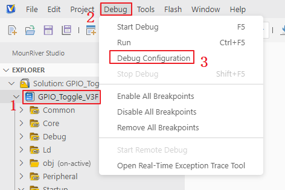

2、如图1-2取消勾选联合调试选项。

图 12 调试配置

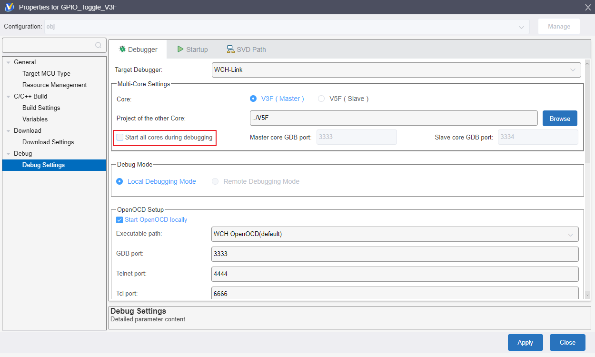

3、修改配置完成后，点击应用保存配置，随后开启调试如图1-3。

图 13 调试按钮

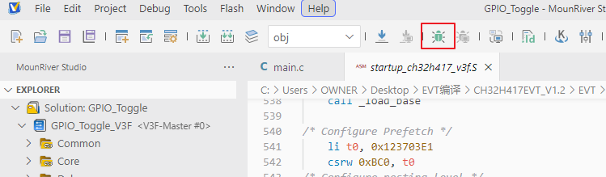

4、调试成功后，会在BP标签处暂停，如图1-4。

图 14 调试界面1

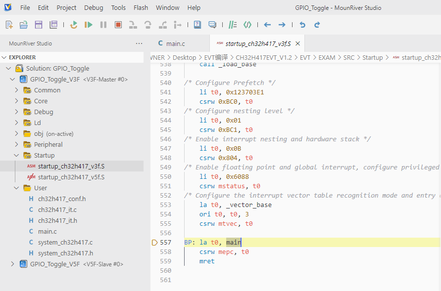

5、V3核调试支持单步，可以正常设置断点，调试。如图1-5。

图 15 调试界面2

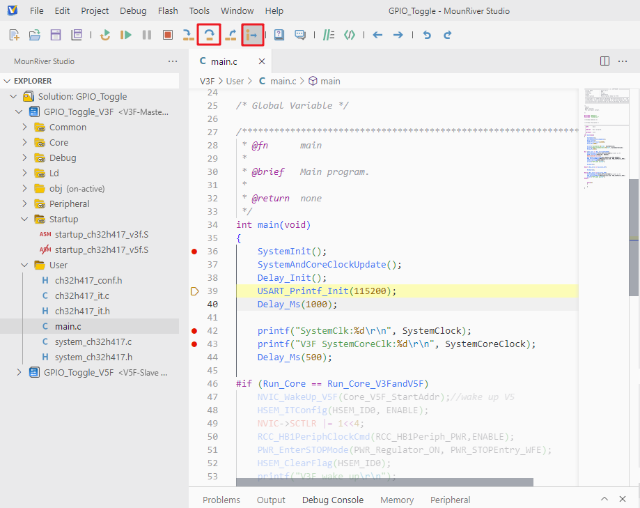

# 双核芯片对V3/V5核调试

## 双核V3/V5调试

当双核芯片，同时使用到两核时，调试时需要设置启用联合调试。

1、即工程配置中使用到V5核时，V3核可以同样处于运行状态或者在唤醒V5后进入睡眠状态，工程配置如图2-1所示。

图 21 工程配置示意图

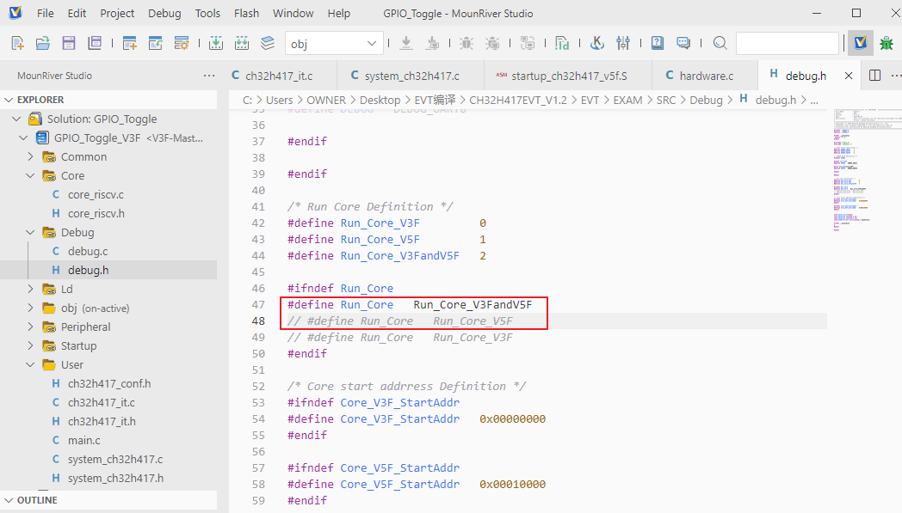

2、如图2-2 分别需要在V3和V5核 调试配置中勾选“start all cores during debugging”选项，修改后应用保存配置

图 22 调试配置示意图

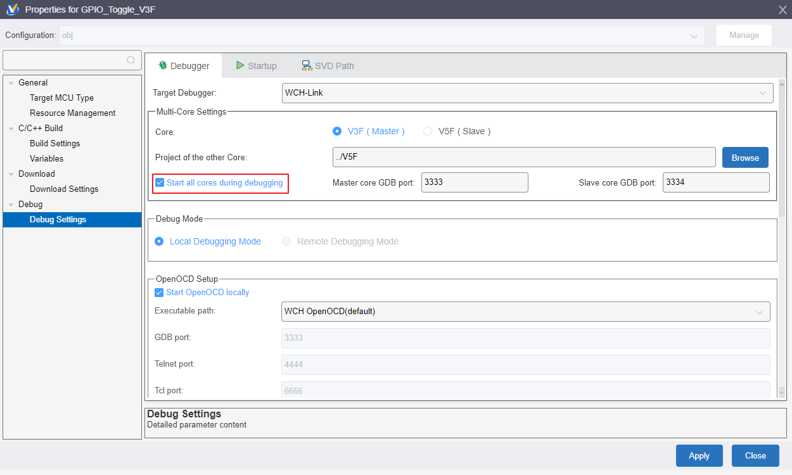

3、选中其中一个工程并启用调试，会将新建另一个工程的调试窗口“Debugging dual core project”，新建调试工程如图2-3所示。

图 23 调试工程示意图

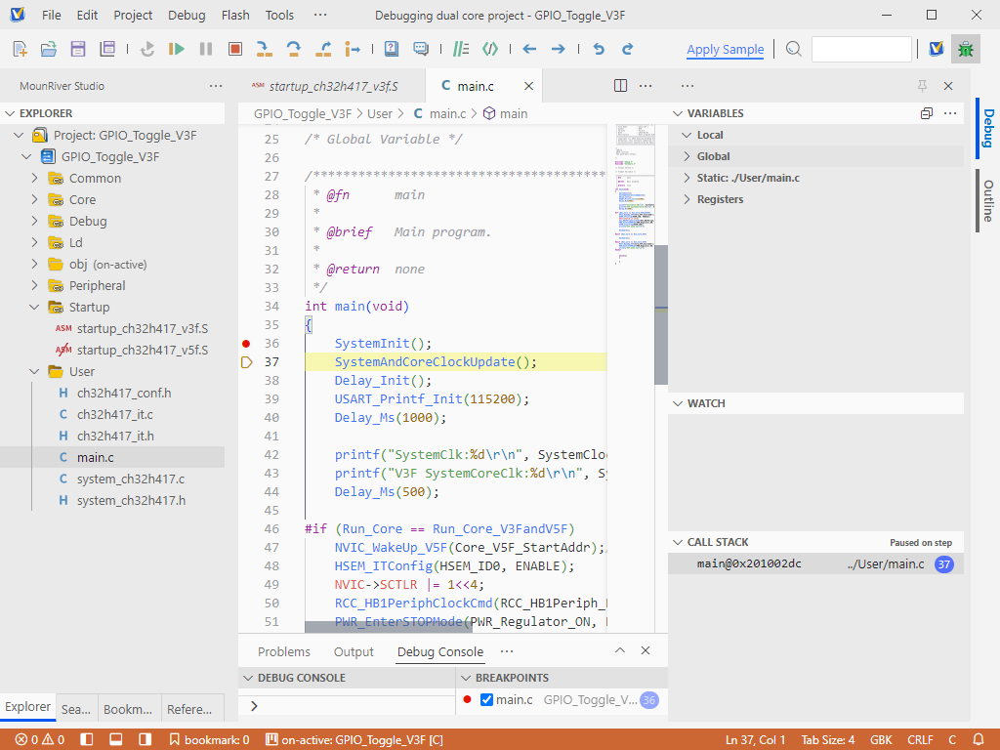

4、联合调试V3核同样会停在BP标签处，V3调试流程同1.1节，执行到唤醒V5核后进入睡眠。此时V5核被唤醒，首次会在临时断点handle_reset处暂停如图2-4，后续的复位（ReStart）操作，handle_reset断点将无效，如需要在V5核暂停，需要设置额外断点。

图 24 V5核默认临时断点示意图

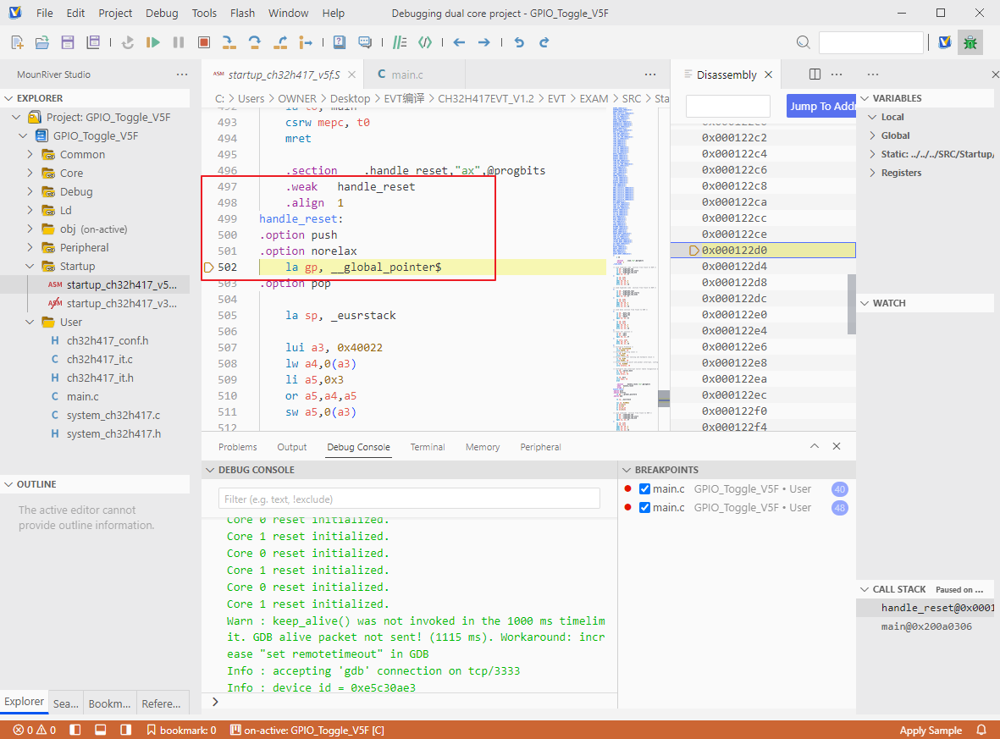

5、V3/V5核都支持汇编单步调试，可以在汇编文件中打断点，并进行单步跳转调试，如图2-5所示，按键1为汇编单步调试开关，按键2可实现单步跳转。

图 25 V5核单步调试

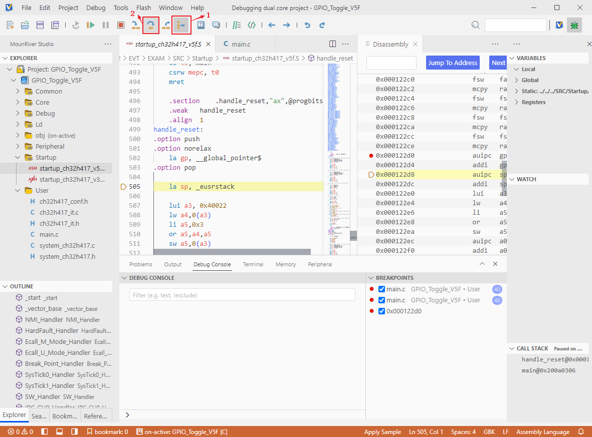

6、在V5核运行到release 硬件型号量（HSEM）前，V3核均为睡眠状态，无法进行调试操作，如图2-6所示。

图 26 V3核当前调试状态1

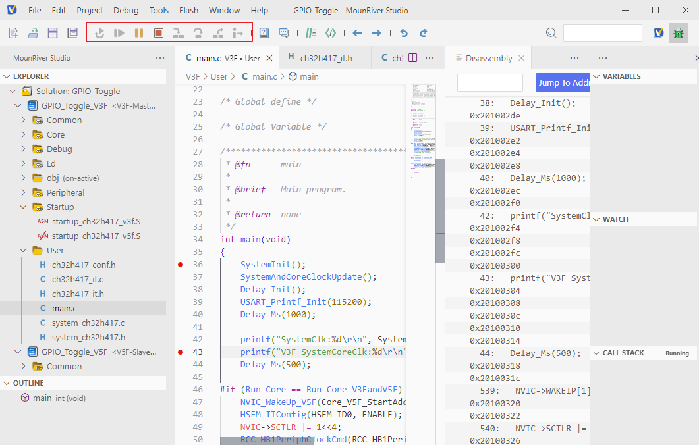

7、当V5核释放硬件信号量（HSEM）后唤醒V3，完成双核的时钟同步，随后可以对V3核进行调试，如图2-7所示。

图 27 V3核当前调试状态2

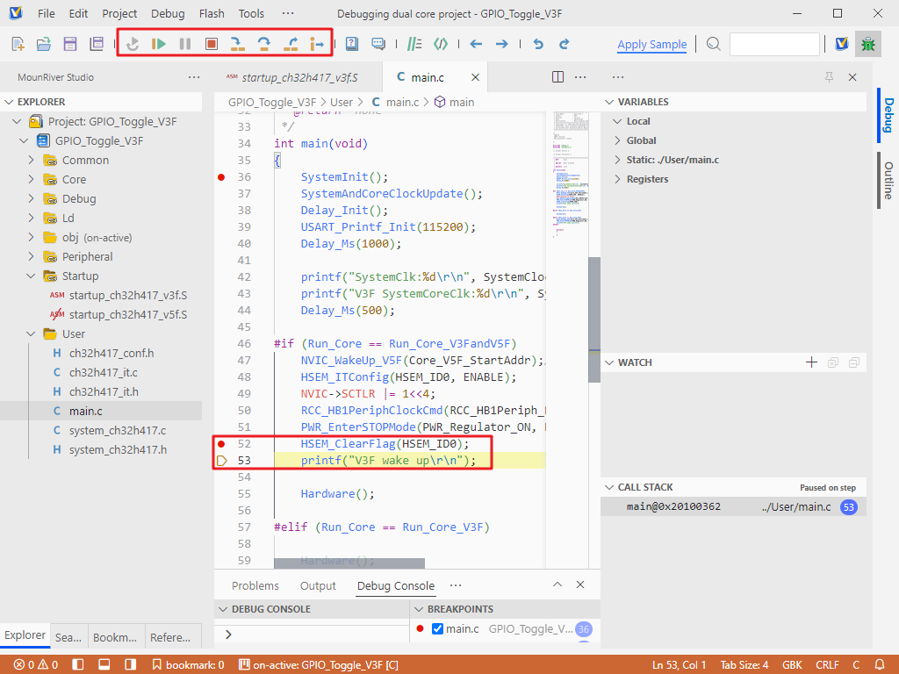

随后的V3和V5核 可以自由进行调试。

# MRS2常用调试设置

## MRS2常用调试功能

1、在调试过程中，内核暂停后可以直接读取固定地址的数据，查看对应的地址的值。使用方式如图3-1，在1处填写目标地址，每次暂停后点击2按键获取最新的数据，（不会自动刷新）。适用于批量读取地址数据。如果读取少量地址数据时，可以通过 “WATCH”窗口查看，如图3-2，调试过程中会自动更新。

图 31 批量读数据

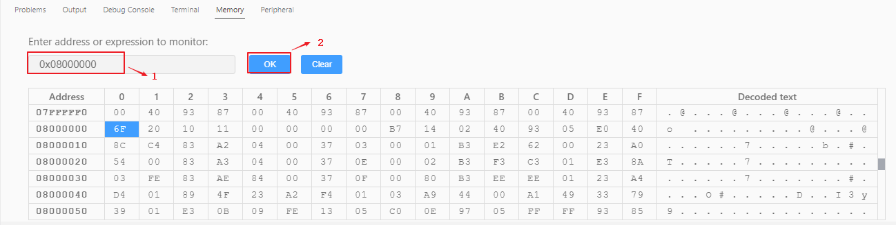

图 32 指定窗口读数据

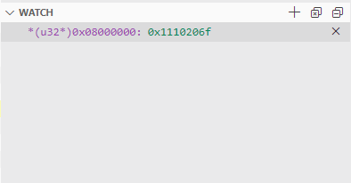

2、在调试过程中，内核暂停后可以直接读取目标外设寄存器的值。使用方式，在左侧选择目标外设，右侧查看对应寄存器值，调试过程中寄存器值会实时更新，如图3-3。

图 33 读寄存器值

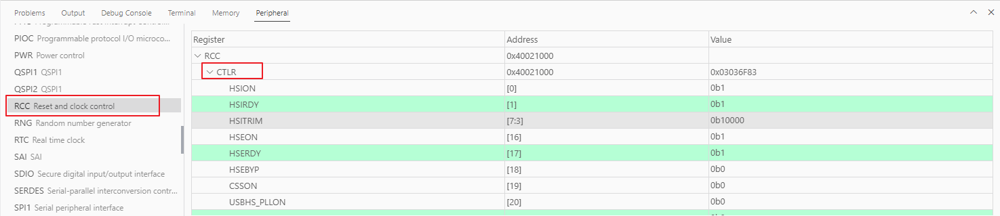

3、在调试过程中，内核暂停后可以直接查看内核寄存器值，对应窗口如图3-4，标号1对应局部变量；标号2对应全局变量；标号3对应静态全局变量；标号4对应内核寄存器。所有数值显示都可以右键设置显示格式，以及添加到窗口观测，如图3-5所示。

图 34 变量窗口

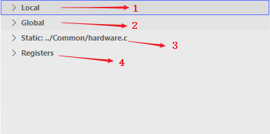

图 35 参数显示格式

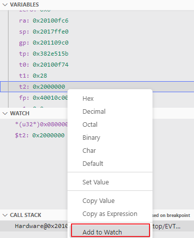

## 调试前的编译配置

在开始调试前可以根据实际需求，设置工程的优化级别以及调试级别。此外对于双核芯片，需要编译并生成合并后的 Merge.bin 文件，从而方便在包含下载流程的调试过程中，更新硬件调试固件。

如图3-6为编译的优化级别配置，默认-Os ，可以根据实际需求在编译器切换。如在开发调试阶段可以选择-Og，能够避免不必要的调试优化，可以保持良好的调试体验。

图 36 编译优化级别配置

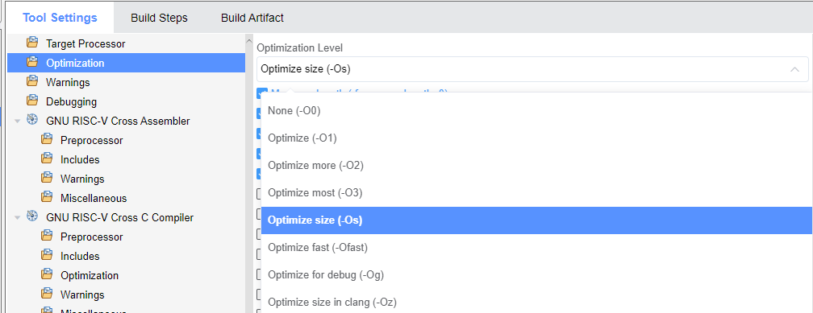

如图3-7 为调试级别配置，gcc下默认-g等同于-g2，包含标准调试信息；-g1仅包含最小调试信息，函数以及局部变量；-g3在-g2标准下额外包括了宏定义，所以有调试宏需求，可选-g3。

图 37 调试级别配置

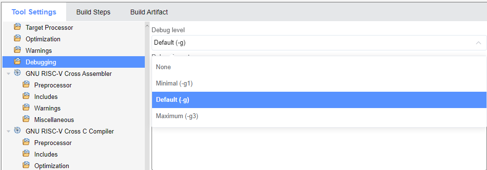

如图3-8为调试工具链配置，一般默认即可。如有特殊需求，或者有兼容旧工具链的要求可以自由选择。

图 38 调试工具链选择

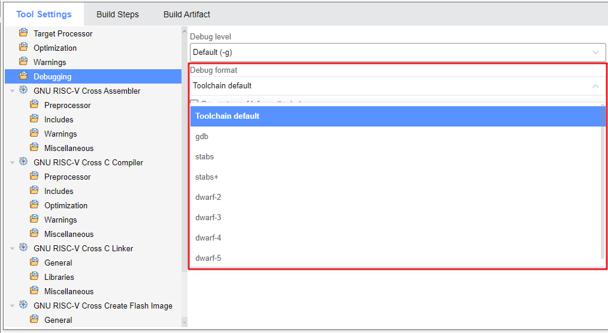

## 半主机模式

半主机模式即可以通过控制台输出打印信息，代替硬件串口\<printf\>输出。根据实际需求，可以在调试设置界面开启功能，如图3-9，注意每次切换模式后都需要重新编译工程。图3-10为半主机模式下控制台输出信息。双核调试时，可以分别选择设置对应工程开启半主机模式，但是如果都开启半主机模式，只会在同一个控制台输出双核打印信息。

图 39半主机模式开关配置

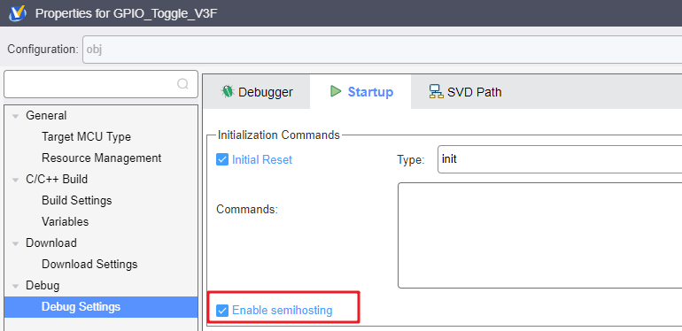

图 310 半主机模式下控制台信息输出

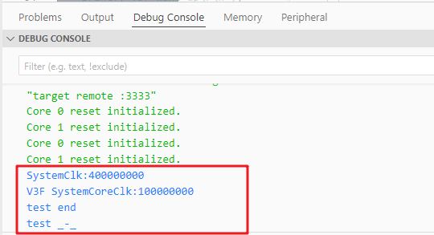

## 外部elf 文件调试

如果有调试外部elf文件的需求，则需要在当前工程的调试配置中添加外部elf文件路径。对于双核工程的调试则需要在两个工程中分别添加路径。

图 311 外部elf文件路径添加

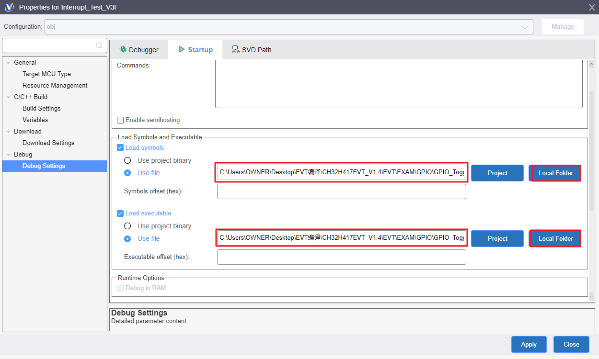

# 双核调试注意事项

## 调试注意事项

1、在调试单核时可以设置调试过程跳过下载，或者可以选择是否勾选“ page eraser ”如图4-1所示。但是在双核调试时，V3相关调试模式不支持配置（状态默认，主动配置无效），如图4-2所示，默认跳过下载步骤。

图 41 单核调试V3设置

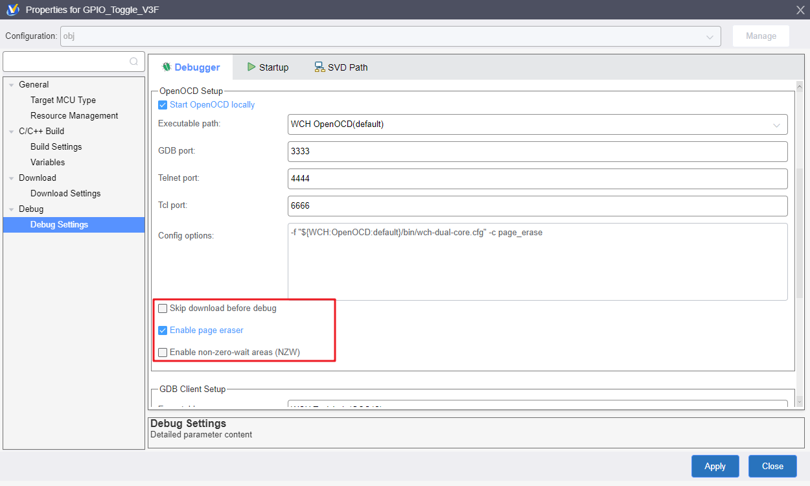

图 42 双核调试V3设置

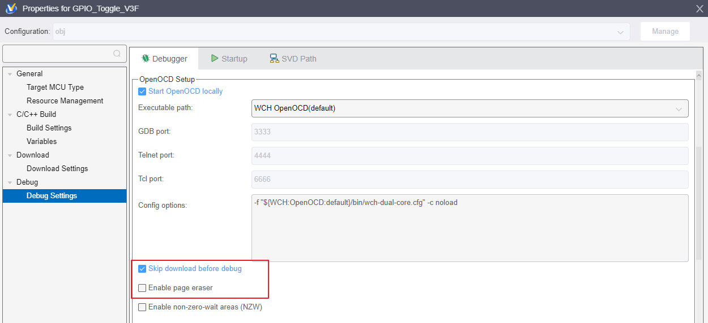

如果双核调试配置V3/V5都设置跳过下载直接调试，会有如图4-3提示，如果想要能继续正常调试，请确保之前已经下载过调试固件。否则建议V5核取消勾选“跳过下载”，如图4-4所示，该下载过程会将V3/V5核固件一起更新。

图 43 双核调试提示

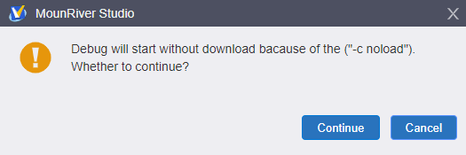

图 44 双核调试V5配置

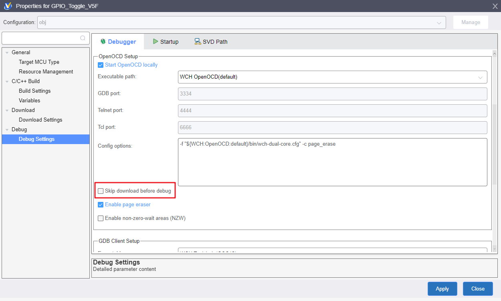

2、需要注意，双核调试V5断点设置需要在唤醒后，或者在启动调试前；如果在中间时间阶段设置断点，会导致调试异常。

历史版本

更新内容

| 日期       | 版本 | 变更内容 |
|------------|------|----------|
| 2025/11/26 | V1.0 | 初版发行 |

声明

本手册版权所有为南京沁恒微电子股份有限公司（Copyright © Nanjing Qinheng Microelectronics Co., Ltd. All Rights Reserved），未经南京沁恒微电子股份有限公司书面许可，任何人不得因任何目的、以任何形式（包括但不限于全部或部分地向任何人复制、泄露或散布）不当使用本产品手册中的任何信息。

任何未经允许擅自更改本产品手册中的内容与南京沁恒微电子股份有限公司无关。

南京沁恒微电子股份有限公司所提供的说明文档只作为相关产品的使用参考，不包含任何对特殊使用目的的担保。南京沁恒微电子股份有限公司保留更改和升级本产品手册以及手册中涉及的产品或软件的权利。

参考手册中可能包含少量由于疏忽造成的错误。已发现的会定期勘误，并在再版中更新和避免出现此类错误
