<table>
<colgroup>
<col style="width: 49%" />
<col style="width: 50%" />
</colgroup>
<thead>
<tr>
<th rowspan="2"></th>
<th>AN91000</th>
</tr>
<tr>
<th>V1.0</th>
</tr>
</thead>
<tbody>
</tbody>
</table>

说明

对于双核芯片的使用，在调试时需要根据不同需求进行相应的软件配置，相较于单核芯片的调试有着些许区别。本文重点介绍CH32H415、416、417双核芯片，在MRS2开发环境下的调试配置，分别列举单核和双核的主要调试流程，以及调试中的注意事项。以下内容的表述基于MRS2
版本2.3.0。

**适用范围**

| 适用范围 | 系列                 |
|----------|----------------------|
| 通用MCU  | CH32H415、416、417等 |

目录

[说明 [1](#_Toc239521107)](#_Toc239521107)

[目录 [2](#_Toc239521108)](#_Toc239521108)

[图片索引 [2](#_Toc239521109)](#_Toc239521109)

[第1章 双核芯片仅对V3核调试
[1](#双核芯片仅对v3核调试)](#双核芯片仅对v3核调试)

[1.1 单核V3调试 [1](#单核v3调试)](#单核v3调试)

[第2章 双核芯片对V3/V5核调试
[3](#双核芯片对v3v5核调试)](#双核芯片对v3v5核调试)

[2.1 双核V3/V5调试 [3](#双核v3v5调试)](#双核v3v5调试)

[第3章 MRS2常用调试设置 [7](#mrs2常用调试设置)](#mrs2常用调试设置)

[3.1 MRS2常用调试功能 [7](#mrs2常用调试功能)](#mrs2常用调试功能)

[3.2 调试前的编译配置 [8](#调试前的编译配置)](#调试前的编译配置)

[3.3 半主机模式 [9](#半主机模式)](#半主机模式)

[3.4 外部elf 文件调试 [10](#外部elf-文件调试)](#外部elf-文件调试)

[第4章 双核调试注意事项 [11](#双核调试注意事项)](#双核调试注意事项)

[4.1 调试注意事项 [11](#调试注意事项)](#调试注意事项)

[历史版本 [13](#_Toc239521121)](#_Toc239521121)

[声明 [14](#_Toc239521122)](#_Toc239521122)

图片索引

[工程调试配置入口 [1](#_Toc239521123)](#_Toc239521123)

[调试配置 [1](#_Toc239521124)](#_Toc239521124)

[调试按钮 [2](#_Toc239521125)](#_Toc239521125)

[调试界面1 [2](#_Toc239521126)](#_Toc239521126)

[调试界面2 [2](#_Toc239521127)](#_Toc239521127)

[工程配置示意图 [3](#_Toc239521128)](#_Toc239521128)

[调试配置示意图 [3](#_Toc239521129)](#_Toc239521129)

[调试工程示意图 [4](#_Toc239521130)](#_Toc239521130)

[V5核默认临时断点示意图 [4](#_Toc239521131)](#_Toc239521131)

[V5核单步调试 [5](#_Toc239521132)](#_Toc239521132)

[V3核当前调试状态1 [5](#_Toc239521133)](#_Toc239521133)

[V3核当前调试状态2 [6](#_Toc239521134)](#_Toc239521134)

[批量读数据 [7](#_Toc239521135)](#_Toc239521135)

[指定窗口读数据 [7](#_Toc239521136)](#_Toc239521136)

[读寄存器值 [7](#_Toc239521137)](#_Toc239521137)

[变量窗口 [7](#_Toc239521138)](#_Toc239521138)

[参数显示格式 [8](#_Toc239521139)](#_Toc239521139)

[编译优化级别配置 [8](#_Toc239521140)](#_Toc239521140)

[调试级别配置 [8](#_Toc239521141)](#_Toc239521141)

[调试工具链选择 [9](#_Toc239521142)](#_Toc239521142)

[半主机模式开关配置 [9](#_Toc239521143)](#_Toc239521143)

[半主机模式下控制台信息输出 [9](#_Toc239521144)](#_Toc239521144)

[外部elf文件路径添加 [10](#_Toc239521145)](#_Toc239521145)

[单核调试V3设置 [11](#_Toc239521146)](#_Toc239521146)

[双核调试V3设置 [11](#_Toc239521147)](#_Toc239521147)

[双核调试提示 [11](#_Toc239521148)](#_Toc239521148)

[双核调试V5配置 [12](#_Toc239521149)](#_Toc239521149)

# 双核芯片仅对V3核调试

## 单核V3调试

对于双核芯片CH32H417，在仅使用V3核时，可以仅对V3核进行调试。需要注意不能执行唤醒V5函数NVIC_WakeUp_V5F，或者在debug.h配置文件中选择仅V3核运行。

EVT工程默认配置支持双核调试，想要单核调试，需要修改工程配置。

1、如图1-1 选择V3核，进入调试配置

<figure>
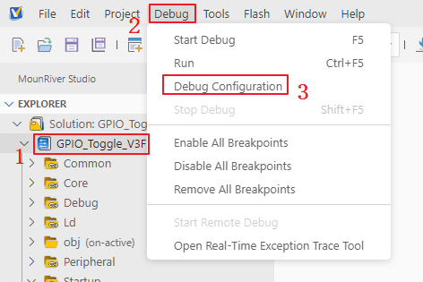
<figcaption>
图 1‑1工程调试配置入口
</figcaption>
</figure>

2、如图1-2取消勾选联合调试选项。

<figure>
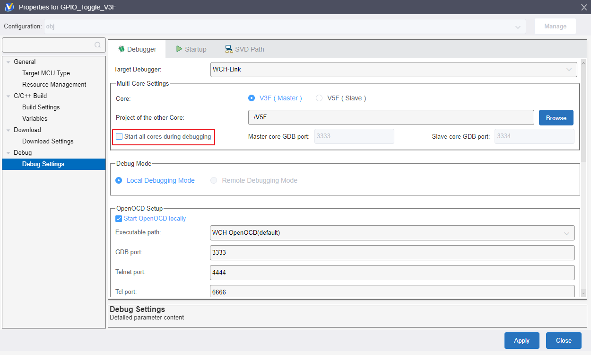
<figcaption>
图 1‑2调试配置
</figcaption>
</figure>

3、修改配置完成后，点击应用保存配置，随后开启调试如图1-3。

<figure>

<figcaption>
图 1‑3调试按钮
</figcaption>
</figure>

4、调试成功后，会在BP标签处暂停，如图1-4。

<figure>

<figcaption>
图 1‑4调试界面1
</figcaption>
</figure>

5、V3核调试支持单步，可以正常设置断点，调试。如图1-5。

<figure>

<figcaption>
图 1‑5调试界面2
</figcaption>
</figure>

# 双核芯片对V3/V5核调试

## 双核V3/V5调试

当双核芯片，同时使用到两核时，调试时需要设置启用联合调试。

1、即工程配置中使用到V5核时，V3核可以同样处于运行状态或者在唤醒V5后进入睡眠状态，工程配置如图2-1所示。

<figure>

<figcaption>
图 2‑1工程配置示意图
</figcaption>
</figure>

2、如图2-2 分别需要在V3和V5核 调试配置中勾选“start all cores during
debugging”选项，修改后应用保存配置

<figure>

<figcaption>
图 2‑2调试配置示意图
</figcaption>
</figure>

3、选中其中一个工程并启用调试，会将新建另一个工程的调试窗口“Debugging
dual core project”，新建调试工程如图2-3所示。

<figure>
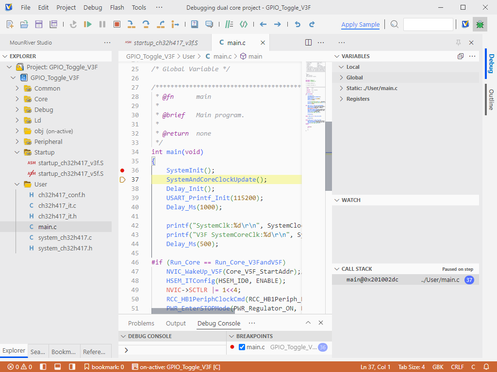
<figcaption>
图 2‑3调试工程示意图
</figcaption>
</figure>

4、联合调试V3核同样会停在BP标签处，V3调试流程同1.1节，执行到唤醒V5核后进入睡眠。此时V5核被唤醒，首次会在临时断点handle_reset处暂停如图2-4，后续的复位（ReStart）操作，handle_reset断点将无效，如需要在V5核暂停，需要设置额外断点。

<figure>

<figcaption>
图 2‑4 V5核默认临时断点示意图
</figcaption>
</figure>

5、V3/V5核都支持汇编单步调试，可以在汇编文件中打断点，并进行单步跳转调试，如图2-5所示，按键1为汇编单步调试开关，按键2可实现单步跳转。

<figure>

<figcaption>
图 2‑5 V5核单步调试
</figcaption>
</figure>

6、在V5核运行到release
硬件型号量（HSEM）前，V3核均为睡眠状态，无法进行调试操作，如图2-6所示。

<figure>
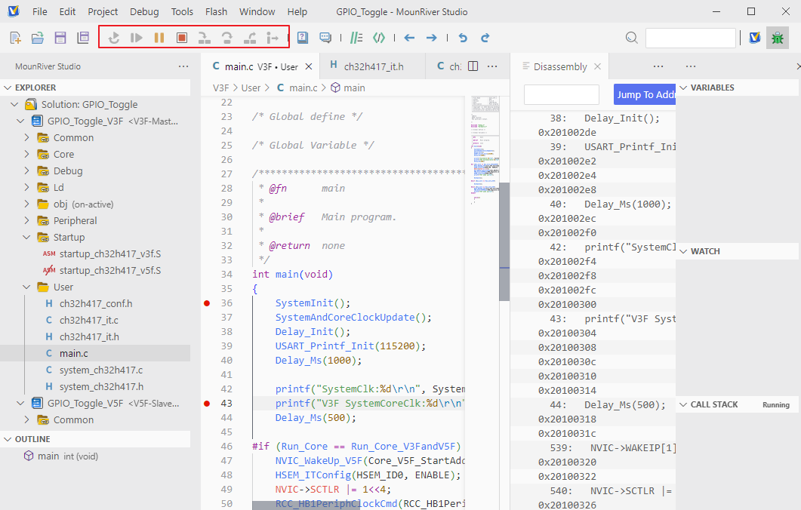
<figcaption>
图 2‑6 V3核当前调试状态1
</figcaption>
</figure>

7、当V5核释放硬件信号量（HSEM）后唤醒V3，完成双核的时钟同步，随后可以对V3核进行调试，如图2-7所示。

<figure>
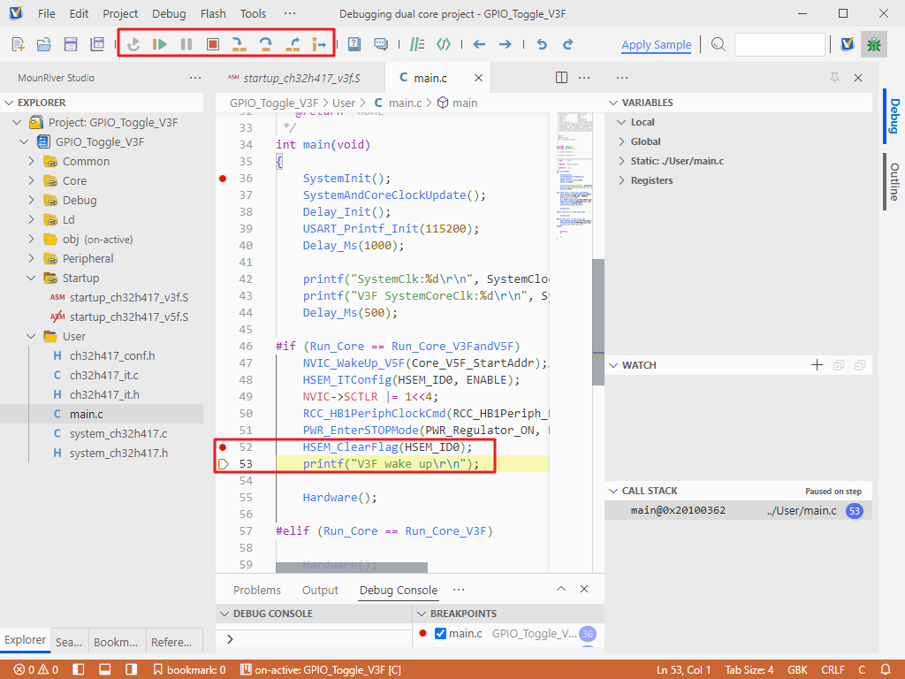
<figcaption>
图 2‑7 V3核当前调试状态2
</figcaption>
</figure>

随后的V3和V5核 可以自由进行调试。

# MRS2常用调试设置

## MRS2常用调试功能

1、在调试过程中，内核暂停后可以直接读取固定地址的数据，查看对应的地址的值。使用方式如图3-1，在1处填写目标地址，每次暂停后点击2按键获取最新的数据，（不会自动刷新）。适用于批量读取地址数据。如果读取少量地址数据时，可以通过
“WATCH”窗口查看，如图3-2，调试过程中会自动更新。

<figure>
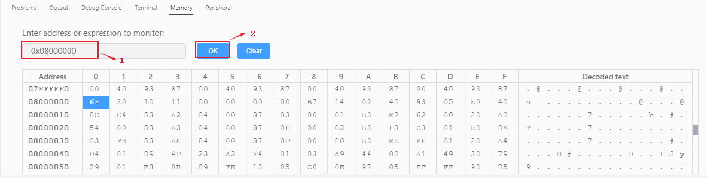
<figcaption>
图 3‑1批量读数据
</figcaption>
</figure>

<figure>
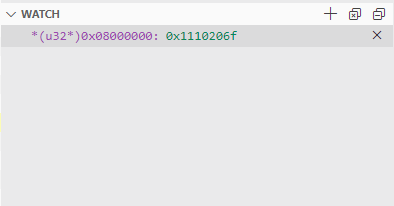
<figcaption>
图 3‑2指定窗口读数据
</figcaption>
</figure>

2、在调试过程中，内核暂停后可以直接读取目标外设寄存器的值。使用方式，在左侧选择目标外设，右侧查看对应寄存器值，调试过程中寄存器值会实时更新，如图3-3。

<figure>
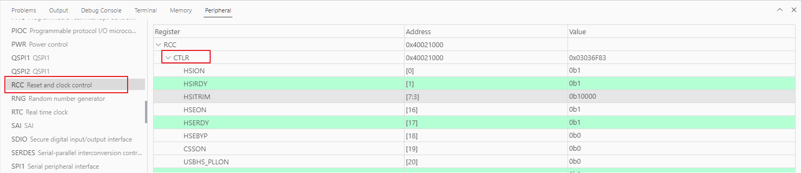
<figcaption>
图 3‑3读寄存器值
</figcaption>
</figure>

<figure>
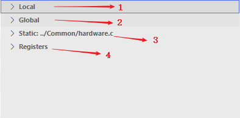
<figcaption>
图 3‑4变量窗口
</figcaption>
</figure>

<figure>
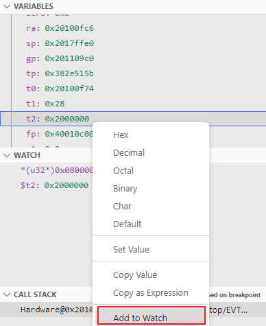
<figcaption>
图 3‑5参数显示格式
</figcaption>
</figure>

## 调试前的编译配置

在开始调试前可以根据实际需求，设置工程的优化级别以及调试级别。此外对于双核芯片，需要编译并生成合并后的
Merge.bin 文件，从而方便在包含下载流程的调试过程中，更新硬件调试固件。

如图3-6为编译的优化级别配置，默认-Os
，可以根据实际需求在编译器切换。如在开发调试阶段可以选择-Og，能够避免不必要的调试优化，可以保持良好的调试体验。

<figure>
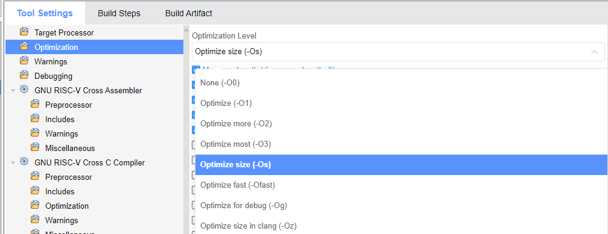
<figcaption>
图 3‑6编译优化级别配置
</figcaption>
</figure>

如图3-7
为调试级别配置，gcc下默认-g等同于-g2，包含标准调试信息；-g1仅包含最小调试信息，函数以及局部变量；-g3在-g2标准下额外包括了宏定义，所以有调试宏需求，可选-g3。

<figure>
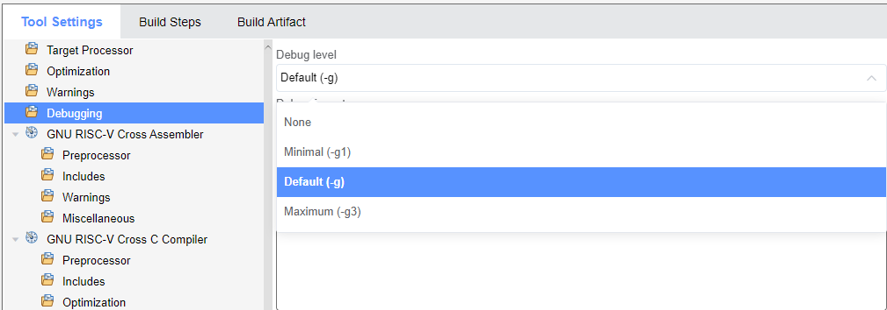
<figcaption>
图 3‑7调试级别配置
</figcaption>
</figure>

如图3-8为调试工具链配置，一般默认即可。如有特殊需求，或者有兼容旧工具链的要求可以自由选择。

<figure>
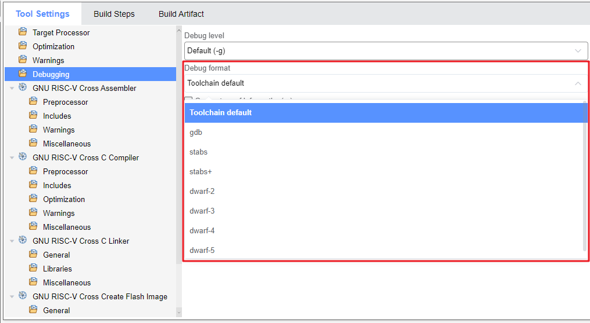
<figcaption>
图 3‑8调试工具链选择
</figcaption>
</figure>

## 半主机模式

半主机模式即可以通过控制台输出打印信息，代替硬件串口\<printf\>输出。根据实际需求，可以在调试设置界面开启功能，如图3-9，注意每次切换模式后都需要重新编译工程。图3-10为半主机模式下控制台输出信息。双核调试时，可以分别选择设置对应工程开启半主机模式，但是如果都开启半主机模式，只会在同一个控制台输出双核打印信息。

<figure>
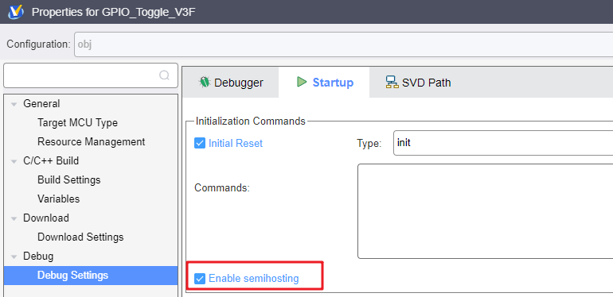
<figcaption>
图 3‑9半主机模式开关配置
</figcaption>
</figure>

<figure>
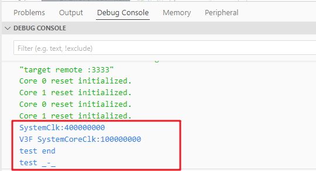
<figcaption>
图 3‑10半主机模式下控制台信息输出
</figcaption>
</figure>

## 外部elf 文件调试

如果有调试外部elf文件的需求，则需要在当前工程的调试配置中添加外部elf文件路径。对于双核工程的调试则需要在两个工程中分别添加路径。

<figure>
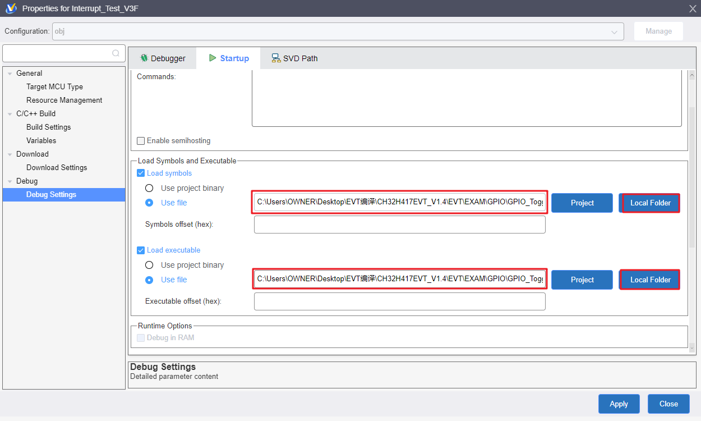
<figcaption>
图 3‑11外部elf文件路径添加
</figcaption>
</figure>

# 双核调试注意事项

## 调试注意事项

1、在调试单核时可以设置调试过程跳过下载，或者可以选择是否勾选“ page
eraser
”如图4-1所示。但是在双核调试时，V3相关调试模式不支持配置（状态默认，主动配置无效），如图4-2所示，默认跳过下载步骤。

<figure>
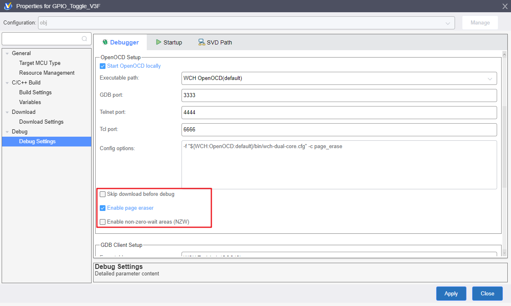
<figcaption>
图 4‑1单核调试V3设置
</figcaption>
</figure>

<figure>
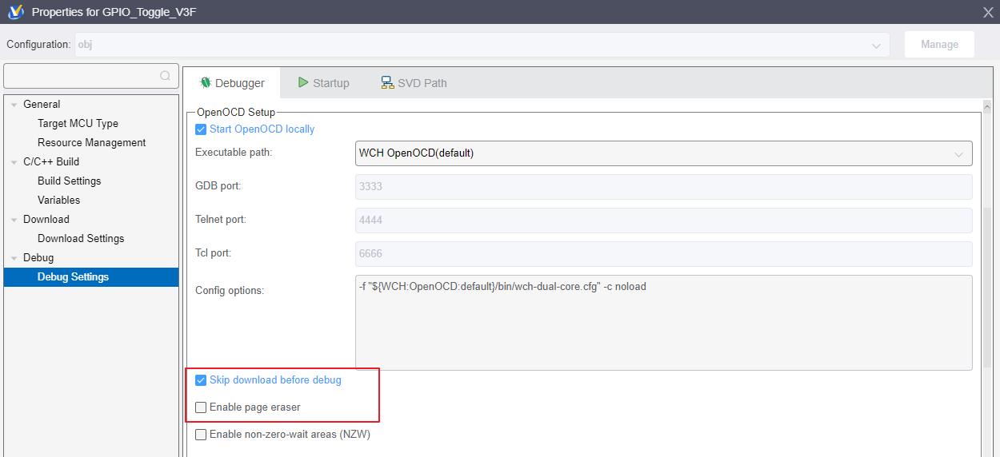
<figcaption>
图 4‑2双核调试V3设置
</figcaption>
</figure>

如果双核调试配置V3/V5都设置跳过下载直接调试，会有如图4-3提示，如果想要能继续正常调试，请确保之前已经下载过调试固件。否则建议V5核取消勾选“跳过下载”，如图4-4所示，该下载过程会将V3/V5核固件一起更新。

<figure>
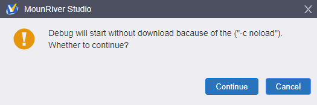
<figcaption>
图 4‑3双核调试提示
</figcaption>
</figure>

<figure>
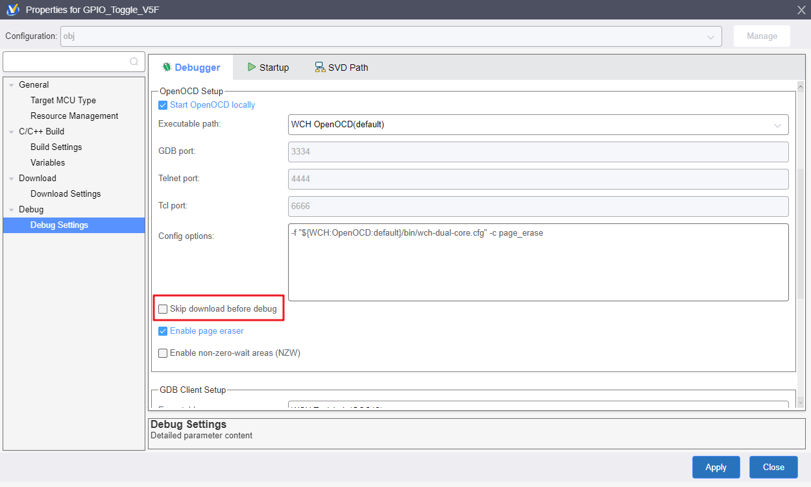
<figcaption>
图 4‑4双核调试V5配置
</figcaption>
</figure>

2、需要注意，双核调试V5断点设置需要在唤醒后，或者在启动调试前；如果在中间时间阶段设置断点，会导致调试异常。

历史版本

| 日期       | 版本 | 变更内容 |
|------------|------|----------|
| 2025/11/26 | V1.0 | 初版发行 |

声明

本手册仅供参考。作者在不另行通知的情况下，可随时进行修改。
