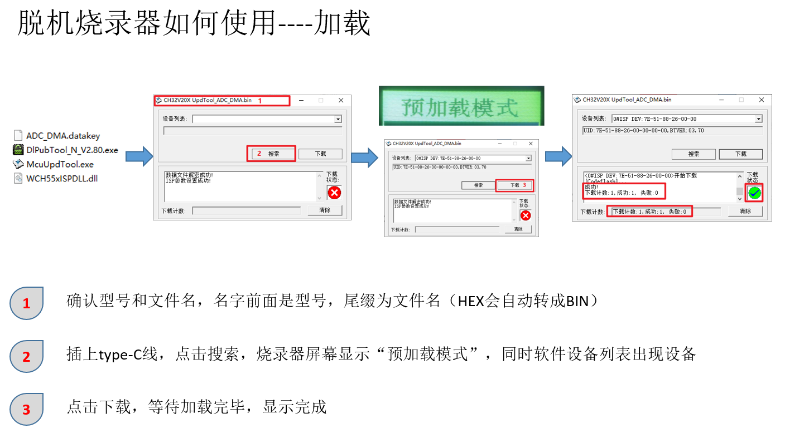
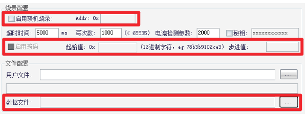
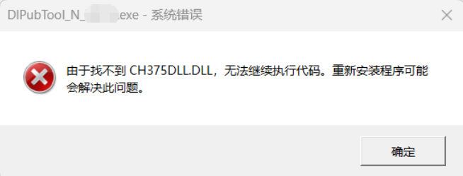
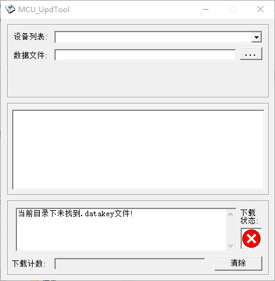
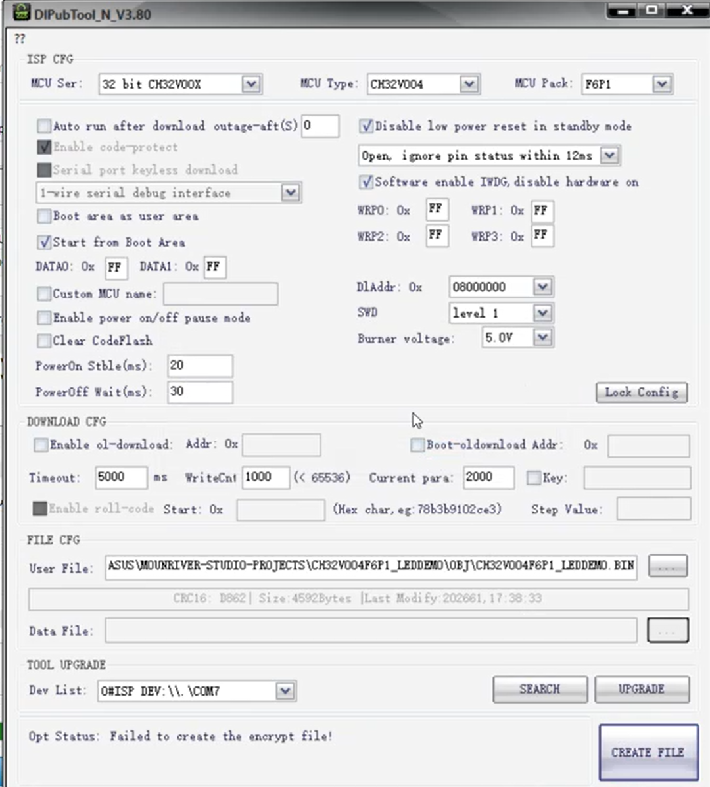

<table>
<colgroup>
<col style="width: 49%" />
<col style="width: 50%" />
</colgroup>
<thead>
<tr>
<th rowspan="2"></th>
<th>AN91001</th>
</tr>
<tr>
<th>V1.0</th>
</tr>
</thead>
<tbody>
</tbody>
</table>

说明

沁恒脱机烧录器（离线烧录器），是一款无需连接电脑，就能批量为沁恒芯片烧录程序的专用工具。脱机烧录器相较于WCH_Link，更适配工厂批量生产等需要反复，大量烧录的场景。沁恒烧录器提供了USB,串口，SWD三种下载方式。其中USB，串口支持沁恒所有芯片，SWD仅适用于支持单线和双线调试协议芯片。本应用文档不仅对沁恒脱机烧录器功能进行介绍，并对用户常遇到的问题进行分析。

**适用范围**

| 适用范围 | 系列         |
|----------|--------------|
| MCU      | 沁恒所有芯片 |

目录

[说明 [1](#_Toc239249144)](#_Toc239249144)

[目录 [2](#_Toc239249145)](#_Toc239249145)

[图片索引 [2](#_Toc239249146)](#_Toc239249146)

[第1章 产品功能 [1](#产品功能)](#产品功能)

[1.1 功能介绍 [1](#功能介绍)](#功能介绍)

[1.1.1 使用方法 [1](#使用方法)](#使用方法)

[1.1.2 联机功能与滚码功能 [2](#联机功能与滚码功能)](#联机功能与滚码功能)

[第2章 常见问题 [4](#常见问题)](#常见问题)

[2.1 常见问题 [4](#常见问题-1)](#常见问题-1)

[2.1.1 驱动安装问题 [4](#驱动安装问题)](#驱动安装问题)

[2.1.2 文件目录问题 [4](#文件目录问题)](#文件目录问题)

[2.1.3 搜索设备问题 [5](#搜索设备问题)](#搜索设备问题)

[2.1.4 下载模式0.0V [5](#下载模式0.0v)](#下载模式0.0v)

[2.1.5 链接超时/编程超时 [6](#链接超时编程超时)](#链接超时编程超时)

[2.1.6 编程失败：U3 [6](#编程失败u3)](#编程失败u3)

[2.1.7 英文模式切换 [7](#英文模式切换)](#英文模式切换)

[历史版本 [8](#_Toc239249160)](#_Toc239249160)

[声明 [9](#_Toc239249161)](#_Toc239249161)

图片索引

[烧录器 [1](#_Toc239249162)](#_Toc239249162)

[脱机烧录器配置 [2](#_Toc239249163)](#_Toc239249163)

[脱机烧录器加载用户代码 [2](#_Toc239249164)](#_Toc239249164)

[联机/滚码配置 [3](#_Toc239249165)](#_Toc239249165)

[驱动导致报错 [4](#_Toc239249166)](#_Toc239249166)

[McuUpdTool.exe提示 [4](#_Toc239249167)](#_Toc239249167)

[DIPubTool_N_VX.xx.exet提示 [5](#_Toc239249168)](#_Toc239249168)

[软件搜索不到设备提示 [5](#_Toc239249169)](#_Toc239249169)

[下载模式0.0V提示 [6](#_Toc239249170)](#_Toc239249170)

[编程失败U3 [6](#_Toc239249171)](#_Toc239249171)

[英文模式切换 [7](#_Toc239249172)](#_Toc239249172)

# 产品功能

脱机烧录器是一款脱机离线、批量烧录沁恒系列芯片工具。目前支持芯片型号包括CH54x、CH55x、CH56x、CH57x、CH58x、CH32F/V
等系列。

脱机烧录器提供了3种下载方式，分别是USB、串口、SWD三种方式，其中USB、串口是适用于所
有芯片，SWD方式仅适用于CH32F/V系列芯片。

## 功能介绍

<figure>

<figcaption><blockquote>

图 ‑1烧录器

</blockquote></figcaption>
</figure>

### 使用方法

用户需要利用上位机软件根据自己的需求生成.datakey，并把生成的.datakey文件加载进脱机烧录器中。用户要在DIPubTool_N_V.exe上选择正确的芯片系列，芯片型号，芯片封装。如果选择错误，在下载过程中脱机烧录器会报：E1

<figure>

<figcaption><blockquote>

图 ‑2脱机烧录器配置

</blockquote></figcaption>
</figure>

<figure>

<figcaption><blockquote>

图 ‑3脱机烧录器加载用户代码

</blockquote></figcaption>
</figure>

脱机烧录器在加载完用户代码后，用户连接好芯片（通过USB,串口，SWD），通过操作S3按键进行程序的下载。

### 联机功能与滚码功能

<figure>

<figcaption><blockquote>

图 ‑4联机/滚码配置

</blockquote></figcaption>
</figure>

联机滚码功能主要是往dataflash区域（存在该区域）填入自定义文件或自动滚码。因为CH32系列芯片没有dataflash,所以自定义文件或滚码数据填入指定flash。

启用联机烧录：当启用联机烧录功能时，如果没有收到串口数据，数据文件将被下载进dataflash。当收到串口数据，收到的数据和数据文件合并下载进dataflash.

启用滚码功能：启用滚码功能，是把滚码自增的六字节数据合并数据文件下载进dataflash.

注：关于脱机烧录器的校验功能；脱机烧录器的升级；密钥功能；机台烧录，可以参考：https://www.wch.cn/bbs/thread-73750-1.html

# 常见问题

## 常见问题

脱机烧录器已经随着沁恒的产品广泛分布海内外。这里汇总了用户在使用过程中遇到的问题。沁恒的脱机烧录器按主控芯片分为两种，一种基于CH32F103,一种基于CH32V208。两种脱机烧录器的软件包并不相同。

### 驱动安装问题

当DlPubTool_N_VX.xx.exe软件打不开，并报找不到CH375DLL.DLL。需要重新安装烧录器相关驱动。

<figure>

<figcaption><blockquote>

图 ‑1 驱动导致报错

</blockquote></figcaption>
</figure>

驱动链接：https://www.wch.cn/downloads/CH372DRV_EXE.html

### 文件目录问题

McuUpdTool.exe软件提示找不到.datakey文件

<figure>

<figcaption><blockquote>

图 ‑2McuUpdTool.exe提示

</blockquote></figcaption>
</figure>

确认生成的.datakey文件和McuUpdTool.exe软件在同一个目录下（新生成的.datakey文件默认和McuUpdTool.exe在同一个文件夹）。当不在同一目录下McuUpdTool.exe将找不到.datakey文件。

DlPubTool_N_VX.xx.exe软件不能生成.datakey文件。

<figure>

<figcaption>
图 ‑3DIPubTool_N_VX.xx.exet提示
</figcaption>
</figure>

当在英文系统下DlPubTool_N_VX.xx.exe应在英文目录中，防止DlPubTool_N_VX.xx.exe因为目录名过长导致找不到用户文件，不能生成.datakey。

### 搜索设备问题

<figure>

<figcaption><blockquote>

图 ‑4软件搜索不到设备提示

</blockquote></figcaption>
</figure>

解决方式：

1.  检查USB建材是否正常，尝试更换USB线材和电脑端口（下载时芯片只能由P_USB1供电）

2.  重新安装设备驱动，先点击“卸载”，再电机“安装”。

### 下载模式0.0V

建议用户使用最新的脱机烧录器和相应的软件包。旧的软件包没有电压配置选项。当使用旧的软件包生成.datakey，下载进脱机烧录器。脱机烧录器会显示：下载模式0.0V.

<figure>

<figcaption><blockquote>

图 ‑5下载模式0.0V提示

</blockquote></figcaption>
</figure>

用户可以直接联系沁恒技术人员，获得最新的脱机烧录器和相应的软件包。

### 链接超时/编程超时

脱机烧录器需要先与芯片进行通信，识别芯片，再进行程序的下载。当烧录器与芯片建立通信失败，及芯片无法链接芯片，脱机烧录器会报：链接超时

解决方法：

1.  检查电压是否设置正确，有些芯片需要设置5V供电。如脱机烧录器直接给评估板供电，请根据评估板供电电压决定脱机烧录器的电压配置。

2.  检查目标芯片的状态，是否可以正常运行，判断是否损坏（通过WCH_Link尝试）

3.  检查线材是否接触不良，引脚是否正确

4.  当选择ISP下载时，检查boot0引脚状态

5.  选择更短线材。过长线材更容易受外界干扰，影响信号的稳定性。

6.  如果之前的代码使芯片进入低功耗。生成新的.datakey文件，需配置上下电暂停模式。

7.  如果使用SWD下载，可以降低两线调试速度。通过串口下载时，可以降低串口波特率。通过降低速度，提高抗干扰能力。SWD烧录时可以尝试更换烧录器的R33/R34电阻为0Ω，可以略微增强信号强度。

8.  增大上电稳定时间配置，上电稳定时间规定了脱机烧录器在给目标芯片上电后，需要等待多长时间才开始尝试与芯片通信。增大时间，避免因为目标评估板电压上升缓慢，导致无法与芯片通信。

9.  检查芯片复位引脚状态，保证芯片处于非复位状态

### 编程失败：U3

当脱机烧录器检测到流过POW的电流过大，超过电流检测阈值，脱机烧录器报：U3

<figure>

<figcaption>
图 ‑6编程失败U3
</figcaption>
</figure>

编程失败报：U3，有以下可能：

1.  用户板子功耗较高，脱机烧录器可以调大电流检测参数。

2.  用户板子或芯片短路，导致检测值超过阈值，用户可以通过换芯片或检测板子硬件

3.  烧录器在未连接任何芯片或评估板的情况下，开机显示U3，可能是烧录器本身问题

### 英文模式切换

沁恒脱机烧录器随着沁恒芯片也被国外用户广泛使用。脱机烧录器软件包会根据系统转换成英文模式。脱机烧录器界面也可以切换成英文。

1.  长按S1按键，直至出现语言切换界面

2.  按S3按键，选择英文语言界面

3.  按S1按键，确认选择

<figure>

<figcaption>
图 ‑7英文模式切换
</figcaption>
</figure>

历史版本

| 日期      | 版本 | 变更内容 |
|-----------|------|----------|
| 2026/7/31 | V1.0 | 初版发行 |

声明

本手册版权所有为南京沁恒微电子股份有限公司（Copyright © Nanjing Qinheng
Microelectronics Co., Ltd. All Rights
Reserved），未经南京沁恒微电子股份有限公司书面许可，任何人不得因任何目的、以任何形式（包括但不限于全部或部分地向任何人复制、泄露或散布）不当使用本产品手册中的任何信息。

任何未经允许擅自更改本产品手册中的内容与南京沁恒微电子股份有限公司无关。

南京沁恒微电子股份有限公司所提供的说明文档只作为相关产品的使用参考，不包含任何对特殊使用目的的担保。南京沁恒微电子股份有限公司保留更改和升级本产品手册以及手册中涉及的产品或软件的权利。

参考手册中可能包含少量由于疏忽造成的错误。已发现的会定期勘误，并在再版中更新和避免出现此类错误。
