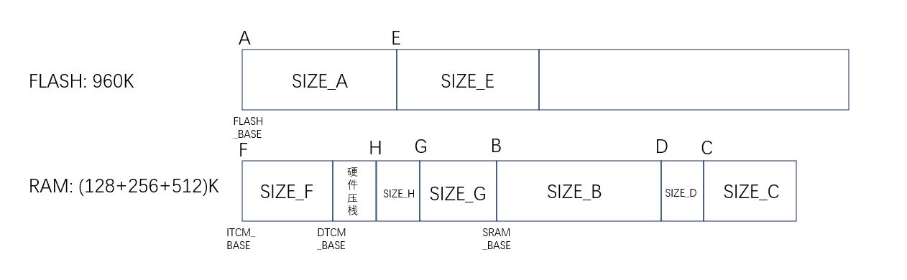

<table>
<colgroup>
<col style="width: 49%" />
<col style="width: 50%" />
</colgroup>
<thead>
<tr>
<th rowspan="2"></th>
<th></th>
</tr>
<tr>
<th></th>
</tr>
</thead>
<tbody>
</tbody>
</table>

说明

MRS编译器环境下，LD和启动文件的配置，可以灵活实现内存分配，固定地址存放，共享变量，搬运取址等操作，一定程度上提高工程应用的灵活性。

**适用范围**

| 适用范围 | 系列              |
|----------|-------------------|
| 通用MCU  | H417及其他通用MCU |

目录

[说明 [1](#_Toc239782046)](#_Toc239782046)

[目录 [2](#_Toc239782047)](#_Toc239782047)

[图片索引 [2](#_Toc239782048)](#_Toc239782048)

[第1章 内存分配与系统配置 [1](#内存分配与系统配置)](#内存分配与系统配置)

[1.1 H417内存分配方案 [1](#h417内存分配方案)](#h417内存分配方案)

[1.2 H417系统配置方案 [2](#h417系统配置方案)](#h417系统配置方案)

[第2章 常见功能配置 [3](#常见功能配置)](#常见功能配置)

[2.1 指定内存段存放数据 [3](#指定内存段存放数据)](#指定内存段存放数据)

[2.1.1 const 常量固定地址定义
[3](#const-常量固定地址定义)](#const-常量固定地址定义)

[2.1.2 函数固定地址定义 [3](#函数固定地址定义)](#函数固定地址定义)

[2.1.3 全局变量固定地址定义（无初始化变量）
[4](#全局变量固定地址定义无初始化变量)](#全局变量固定地址定义无初始化变量)

[2.1.4 全局变量固定地址定义（初始化变量）
[4](#全局变量固定地址定义初始化变量)](#全局变量固定地址定义初始化变量)

[2.1.5 注意事项 [5](#注意事项)](#注意事项)

[2.2 冷启动与热启动 [5](#冷启动与热启动)](#冷启动与热启动)

[历史版本 [7](#_Toc239782060)](#_Toc239782060)

[声明 [8](#_Toc239782061)](#_Toc239782061)

图片索引

[417内存分配 [1](#_Toc239782062)](#_Toc239782062)

# 内存分配与系统配置

## H417内存分配方案

Ld文件中MEMORY
用来定义芯片内存非配的起始地址以及大小。需要注意的是首先定义的内存范围不能重叠，其次不能超过实际内存范围，否则会出现编译报错及程序运行异常

下面以H417为例进行详细解释。H417的内存分配灵活但相对复杂，默认是在FLASH中进行取址运行的，只是运行速率相对慢，因此例程均提供搬运到RAM运行的方案，实际可以根据工程应用需求，重新分配V3于V5的内存大小及位置。下面是V3和V5工程分配的一般抽象表示。

V3:

    MEMORY
    {
        /*FLASH, RAM, and RAM-CODE can be freely configured according to project 
        requirements;Please refer to the datasheet manual for specific allocation*/
        FLASH (rx) : ORIGIN = A, LENGTH = SIZE_A            /* zero_wait flah ,and loaded into RAM_CODE for running */
        RAM_CODE (xrw) : ORIGIN = B, LENGTH = SIZE_B        /* RAM for running code*/
        RAM (xrw) : ORIGIN = C, LENGTH = SIZE_C             /* RAM for .data .bss section and other*/
    RAM_LOAD (xrw) : ORIGIN = D, LENGTH = SIZE_D        /* RAM for .load section*/
    }

V5:

    MEMORY
    {
        /*FLASH, RAM, and RAM-CODE can be freely configured according to project 
        requirements;Please refer to the datasheet manual for specific allocation*/
        FLASH (rx) : ORIGIN = E, LENGTH = SIZE_E             /* zero_wait flah ,and loaded into RAM_CODE for running */
        RAM_CODE (xrw) : ORIGIN = F, LENGTH = SZIE_F         /*ITCM RAM for running code*/
        RAM (xrw) : ORIGIN = G, LENGTH = SIZE_G              /*DTCM RAM for .data .bss section and other*/ 
        RAM_LOAD (xrw) : ORIGIN = H, LENGTH = SIZE_H         /* RAM for .load section*/
    }

<figure>

<figcaption>
图 ‑1 417内存分配
</figcaption>
</figure>

A ：通常为0x00000000,即FLASH起始位置；SIZE_A ：V3分配FLASH大小 (必要)

B ：V3搬运到RAM的起始地址；SIZE_B
：V3搬运的代码大小，实际占用近似FLASH段大小（略小，部分内容如.data段放在Section\<RAM\>），因此大小分配SIZE_B
= SIZE_A。(非必要)

C：.data和.bss
段，起始地址需要注意，其前面为Section\<RAM_CODE\>和Section\<RAM_LOAD\>段，因此起始地址C
\>= B+SIZE_B+SIZE_D；SIZE_C 为Section\<RAM\>分配大小，以417为例C +
SIZE_C \<= 0x20180000 (SRAM末尾地址)。 (必要)

D：预加载段，目的是在RAM中进行代码搬运，Section\<RAM_LOAD\>段前面为Section\<RAM_CODE\>，因此D
\>= B + SIZE_B ；SIZE_D
：加载代码的代码大小，如果启动文件中预加载内容增加，可能编译报错，这时增大SIZE_D即可。
(非必要)

E ：V5 FLASH分配的起始地址，一般E \>= A + SIZE_A；SIZE_E ：V5
分配FLASH大小 (必要)

F ：V5搬运到RAM的起始地址（建议用紧耦合区域）；SIZE_F
：V5搬运的代码大小，实际占用近似FLASH段大小，因此大小分配SIZE_F =
SIZE_E。 (非必要)

G ：.data和.bss
段，起始地址需要注意，其前面为Section\<RAM_CODE\>(ITCM)，硬件压栈地址（默认但是可配置）以及Section\<RAM_LOAD\>(DTCM)段；SIZE_G
为Section\<RAM\>分配大小。

(必要)

H：预加载段在紧耦合区域的DTCM，同样是在RAM中进行代码搬运，Section\<RAM_LOAD\>段前面为硬件压栈的默认地址，因此H
\>=DTCM_BASE + 512B（硬件压栈占用）；SIZE_H
：加载代码的代码大小，如果启动文件中预加载内容增加，可能编译报错，这时增大SIZE_H即可。(非必要)

特殊情况下，V5核内存占用多，可以将ITCM和部分DTCM紧耦合区用于取址运行，注意对于DTCM分配必须预留512B用于V5核的硬件压栈，且硬件压栈地址需要重新设置（机器模式下可读写）。

## H417系统配置方案

RISCV内核芯片启动文件，主要功能为Section属性定义，向量表定义，数据加载以及内核寄存器配置芯片工作模式等。其中Section属性定义往往需要结合LD文件中对应的地址才能合理起效。数据加载，配置data/highcode段的数据加载，bss段清零等；内核寄存器修改，如设置芯片运行模式下，设置浮点功能开关，设置硬件压栈与嵌套级数等。机器模式可读写的内核寄存器基本都可以在启动文件中进行配置，具体内容可参考对应内核手册。

# 常见功能配置

## 指定内存段存放数据

RISCV内核芯片启动文件，主要功能为Section属性定义，向量表定义，数据加载以及内核寄存器配置芯片工作模式等。其中Section属性定义往往需要结合LD文件中对应的地址才能合理起效。

### const 常量固定地址定义

新增内存段：

    FLASH1 (rx) : ORIGIN = 0x0000F000, LENGTH = 2K

内存段定义：

    .flash1 :
    {
      . = ALIGN(4);
      *(.flash1);
      . = ALIGN(4);
    } >FLASH1 AT>FLASH1

定义调用：

    const uint32_t tmp_value __attribute__((section(".flash1"))) = 0x1234567;
    const uint32_t tmp_value2[2]  __attribute__((section(".flash1"))) = {9,8};

### 函数固定地址定义

新增内存段：

    FLASH2 (rx) : ORIGIN = 0x0000F800, LENGTH = 2K

内存段定义：

    .flash2 :
    {
      . = ALIGN(4);
      *(.flash2);
      . = ALIGN(4);
    } >FLASH2 AT>FLASH2

定义调用：

     __attribute__((section(".flash2")))
    void GPIO_Toggle_INIT(void)
    {
        GPIO_InitTypeDef GPIO_InitStructure = {0};
        RCC_PB2PeriphClockCmd(RCC_PB2Periph_GPIOD, ENABLE);
        GPIO_InitStructure.GPIO_Pin = GPIO_Pin_0;
        GPIO_InitStructure.GPIO_Mode = GPIO_Mode_Out_PP;
        GPIO_InitStructure.GPIO_Speed = GPIO_Speed_50MHz;
        GPIO_Init(GPIOD, &GPIO_InitStructure);
    }

### 全局变量固定地址定义（无初始化变量）

新增内存段：

    RAM1 (xrw) : ORIGIN = 0x20004000, LENGTH = 2K

内存段定义：

    .ran1 (NOLOAD) :
    {
      . = ALIGN(4);
      *(.ram1_data);
      . = ALIGN(4);
    } >RAM1

定义调用：

    __attribute__((section(".ram1_data")))
    uint32_t buff_ram1[64];
    __attribute__((section(".ram1_data")))
    u32 value_ram1;

### 全局变量固定地址定义（初始化变量）

如果全局变量需要保留初始化值，需要在启动文件中补充搬运流程

新增内存段：

    RAM2 (xrw) : ORIGIN = 0x20004800, LENGTH = 2K

内存段定义及标记搬运地址：

    .ram2codelalign : 
    {       
      . = ALIGN(4);
      PROVIDE(_ram2code_lma = .); 
    } >FLASH AT>FLASH 

    .ran2 :
    {
      . = ALIGN(4);
      PROVIDE(_ram2code_vma_start = .);
      *(.ram2_data);
      . = ALIGN(4);
      PROVIDE(_ram2code_vma_end = .);
    } >RAM2 AT>FLASH

启动文件添加搬运流程：

    /* Load ram2 data section from flash to RAM */
    la a0, _ram2code_lma
    la a1, _ram2code_vma_start
    la a2, _ram2code_vma_end
    bgeu a1, a2, 2f
    1:
    lw t0, (a0)
    sw t0, (a1)
    addi a0, a0, 4
    addi a1, a1, 4
    2:

定义调用，数组与变量初始值将会被加载到RAM区域

    __attribute__((section(".ram2_data")))
    uint32_t buff_ram2[64] = {0};
    __attribute__((section(".ram2_data")))
    u32 value_ram2 = 0x5aa55aa5;

### 注意事项

在链接文件中定义段时可以用KEEP，防止被--gc-sections链接选项优化，如：

    KEEP(*(.ram2_data));

类似定义但是未操作的全局变量，如果所在的段有KEEP属性，编译后将会在目标内存区域保留，而不会被优化。

如果要保证对应段中的顺序，可以加上 SORT_NONE
关键字，禁止排序，确保输入节按在链接脚本中出现的原始顺序排列，如：

    KEEP(*(SORT_NONE(.ram2_data)))

部分section内容需要严格的首地址对齐，比如向量表通常1KB对齐，可以在LD中设置，如：

    .vector :
    {
      . = ALIGN(1024);
        *(.vector);
        KEEP(*(SORT_NONE(.vector_handler)))
      . = ALIGN(4);
    } >FLASH AT>FLASH

## 冷启动与热启动

冷启动与热启动，具体指在系统初次上电时进行全局变量初始化，当软硬件复位或者睡眠后唤醒时，能加快启动流程，并且能保持运行参数。如跳过清除bss段流程。

首先在LD文件添加Section，用来搬运全局变量到RAM ，标记数组。

    .bssjudge :
    {
        . = ALIGN(4);
        PROVIDE( _bssjudge_start = .);
        KEEP(*(.bssjudge));
        PROVIDE( _bssjudge_end = .);
        . = ALIGN(4);
    } >RAM AT>FLASH

其次在启动文件中添加，bssjudgerTab
用来预存储对比数据，可以根据需求增加bssjudgerTab中的数据量

        .section    .text.bssjudgerTab,"ax",@progbits
        .align      1
    bssjudgerTab:
        .byte 0x5
        .byte 0xA

在data
section搬运结束后，增加bssjudge的搬运，以及与bssjudgerTab内容对比流程，如果两者内容匹配，则会跳过bss段的清零过程，否则每次复位流程都会清楚bss段内容。

    //load data section end
    2: 
        la t0, _bssjudge_start
        la t1, _bssjudge_end
        beq t0, t1, 2f
        la t2, bssjudgerTab
    bssjudge_func:
        lb a0, 0(t0)
        lb a1, 0(t2)
        bne a0, a1, 2f
        addi t0, t0, 1
        addi t2, t2, 1
        bne t0, t1, bssjudge_func
        j cmdafterbss
    2:
    /* Clear bss section */
        la a0, _sbss
        la a1, _ebss
        bgeu a0, a1, 2f
    1:
        sw zero, (a0)
        addi a0, a0, 4
        bltu a0, a1, 1b
    2:
    cmdafterbss:
    //CSR config start

与bssjudgerTab内容对比，还需要在bssjudge段中建一个u8类型的数组，数组的长度必须与bssjudgerTab定义的常值数量一致，并加上\_\_attribute\_\_()，如下：

    __IO uint8_t __attribute__((section(".bssjudge"),unused)) FirstStart[2];

在程序执行过程中修改数组FirstStart的值，若与bssjudgerTab内容匹配则会在复位后跳过清bss步骤。

        FirstStart[0] = 0x05;
        FirstStart[1] = 0x0a;

bss段存放内容包括，未初始化的的全局/静态变量，以及初始化为0的全局/静态变量。

历史版本

| 日期     | 版本 | 变更内容 |
|----------|------|----------|
| 2026/7/8 | V1.0 | 初版发行 |

声明

本手册仅供参考。作者在不另行通知的情况下，可随时进行修改。
