<table>
<colgroup>
<col style="width: 49%" />
<col style="width: 50%" />
</colgroup>
<thead>
<tr>
<th rowspan="2"></th>
<th>AN91003</th>
</tr>
<tr>
<th>V1.0</th>
</tr>
</thead>
<tbody>
</tbody>
</table>

说明

片外FLASH在芯片内部存储空间不足的情况使用，通常用SPI或者QSP连接。可以将一些特殊的大块数据存储起来，如图片信息等，再让芯片读取并显示。本文提到的基于现有工具，适配外部FLASH下载的方式，一定程度上可以有效提高效率。

**适用范围**

| 适用范围 | 系列                                     |
|----------|------------------------------------------|
| 通用MCU  | CH32L103、CH32V203、CH32V205、CH32V006等 |

目录

[说明 [1](#_Toc239069313)](#_Toc239069313)

[目录 [2](#_Toc239069314)](#_Toc239069314)

[表格索引 [2](#_Toc239069315)](#_Toc239069315)

[图片索引 [2](#_Toc239069316)](#_Toc239069316)

[第1章 Link工具实现 [1](#link工具实现)](#link工具实现)

[1.1 外部FLASH下载原理框图
[1](#外部flash下载原理框图)](#外部flash下载原理框图)

[第2章 操作教程 [2](#操作教程)](#操作教程)

[2.1 外部FLASH下载算法工程配置
[2](#外部flash下载算法工程配置)](#外部flash下载算法工程配置)

[2.2 Link外部FLASH配置流程
[3](#link外部flash配置流程)](#link外部flash配置流程)

[第3章 下载速度测试 [4](#下载速度测试)](#下载速度测试)

[3.1 外部FLASH下载速度测试
[4](#外部flash下载速度测试)](#外部flash下载速度测试)

[历史版本 [5](#_Toc239069324)](#_Toc239069324)

[声明 [6](#_Toc239069325)](#_Toc239069325)

表格索引

[下载速度测试结果 [4](#_Toc239069326)](#_Toc239069326)

图片索引

[内部FLASH下载流程 [1](#_Toc239069327)](#_Toc239069327)

[外部FLASH下载流程 [1](#_Toc239069328)](#_Toc239069328)

[SPI引脚映射 [2](#_Toc239069329)](#_Toc239069329)

[SPI时钟分频 [2](#_Toc239069330)](#_Toc239069330)

[FLASH 指令 [2](#_Toc239069331)](#_Toc239069331)

[SPI片选引脚 [2](#_Toc239069332)](#_Toc239069332)

[算法工程配置 [3](#_Toc239069333)](#_Toc239069333)

[Memory Type [3](#_Toc239069334)](#_Toc239069334)

[芯片列表 [3](#_Toc239069335)](#_Toc239069335)

[算发固件添加 [3](#_Toc239069336)](#_Toc239069336)

[下载目标固件添加 [3](#_Toc239069337)](#_Toc239069337)

# Link工具实现

外部FLASH下载，Link工具实现原理，是在原有Link下载模式基础上，将软件上报的文件，通过SPI/QSPI硬件模块向外部FLASH中传输。

## 外部FLASH下载原理框图

首先，内部FLASH下载流程，参考如图1-1所示。单/双线连接后，进行内部FLASH算法下载，完成后开始目标文件的数据传输，算法接收数据通过FLASH寄存器控制下载并校验，校验通过即流程结束。

<figure>
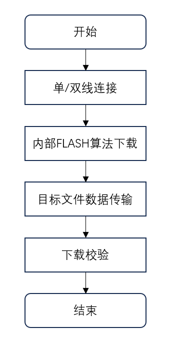
<figcaption>
图 1‑1 内部FLASH下载流程
</figcaption>
</figure>

外部FLASH下载流程如图1-2所示，部分结构有变化，首先是两线连接后的算法不同，算法使能SPI/QSPI功能，用于通信外部FLASH；其次在软件开始文件传输后，因为外部FLASH
通过SPI/QSPI物理连接，所以需要通过外设连接控制数据下载。

<figure>
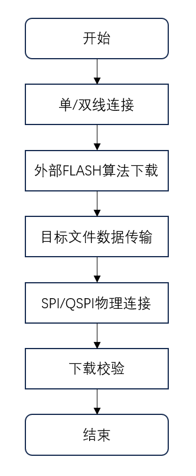
<figcaption>
图 1‑2 外部FLASH下载流程
</figcaption>
</figure>

# 操作教程

Link下载外部FLASH
流程，区别于下载内部FLASH，主要在于需要添加合适的下载算法，目前支持的芯片，均提供下载算法配置工程，可以根据实际需求，配置SPI/QSPI参数。

## 外部FLASH下载算法工程配置

以CH32V203外部FLASH下载算法配置工程为例，可修改的配置都通过宏形式，定义在flash_conf.h文件中。

选择SPI映射引脚，如图2-1所示。

<figure>
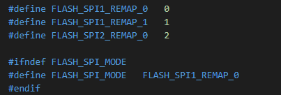
<figcaption>
图 2‑1 SPI引脚映射
</figcaption>
</figure>

选择SPI速度，如图2-2所示

<figure>
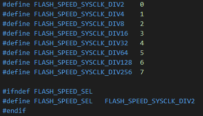
<figcaption>
图 2‑2 SPI时钟分频
</figcaption>
</figure>

可以根据FLASH芯片支持的指令选择，擦写命令，如图2-3所示。

<figure>
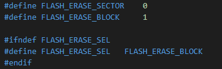
<figcaption>
图 2‑3 FLASH 指令
</figcaption>
</figure>

SPI软件片选引脚自定义，如图2-4所示。

<figure>
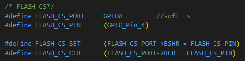
<figcaption>
图 2‑4 SPI片选引脚
</figcaption>
</figure>

工程配置，勾选”Creat algorithm
file”，编译后将生成目标算法文件algorithm.bin，如图2-5所示。

<figure>
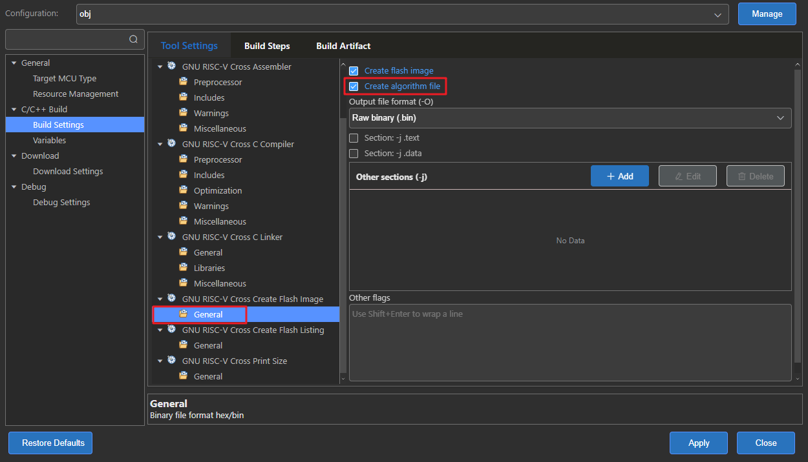
<figcaption>
图 2‑5 算法工程配置
</figcaption>
</figure>

## Link外部FLASH配置流程

首先Memory Type选择External模式，如图2-6所示。

<figure>
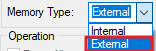
<figcaption>
图 2‑6 Memory Type
</figcaption>
</figure>

并选择对应的芯片系列，如图2-7。

<figure>
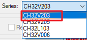
<figcaption>
图 2‑7 芯片列表
</figcaption>
</figure>

添加工程编译的算法工程

<figure>
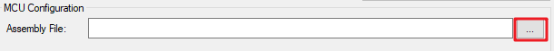
<figcaption>
图 2‑8 算发固件添加
</figcaption>
</figure>

添加下载固件，点击下载校验。

<figure>
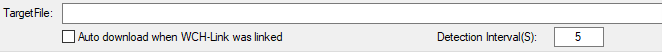
<figcaption>
图 2‑9 下载目标固件添加
</figcaption>
</figure>

注：若下载校验出错，建议检查算法工程的，配置是否正确，擦除指令是否支持，尝试降低SPI频率等

# 下载速度测试

## 外部FLASH下载速度测试

当前支持该功能的芯片，由于两线频率以及SPI频率差异，导致实际的外部FLASH下载速度有差异。测试FLASH
芯片为W25Q16，并通过与CH347 芯片的USB转SPI测试下载速度对比。

结果如下表所示。

|       | SPI下载速度 | QSPI下载速度 |
|:-----:|:-----------:|:------------:|
| V006  |  29.15KB/s  |      \-      |
| L103  |  31.48KB/s  |      \-      |
| V203  |  53.04KB/s  |      \-      |
| V205  |  66.56KB/s  |   72.8KB/s   |
| CH347 | 120.41KB/s  |      \-      |

表 1 下载速度测试结果

从结果可以看出，当前方案不同芯片的下载速度有差异的，其原因主要表现在两线速度及SPI速度，并且两线速度影响占比更大。如V006芯片最高主频低，实测整体速度会慢。此外在一些支持单双线的芯片上，双线速度比单线速度有很大提升，所以，使用时优先双线连接。

历史版本

| 日期     | 版本 | 变更内容 |
|----------|------|----------|
| 2026/7/8 | V1.0 | 初版发行 |

声明

本手册版权所有为南京沁恒微电子股份有限公司（Copyright © Nanjing Qinheng
Microelectronics Co., Ltd. All Rights
Reserved），未经南京沁恒微电子股份有限公司书面许可，任何人不得因任何目的、以任何形式（包括但不限于全部或部分地向任何人复制、泄露或散布）不当使用本产品手册中的任何信息。

任何未经允许擅自更改本产品手册中的内容与南京沁恒微电子股份有限公司无关。

南京沁恒微电子股份有限公司所提供的说明文档只作为相关产品的使用参考，不包含任何对特殊使用目的的担保。南京沁恒微电子股份有限公司保留更改和升级本产品手册以及手册中涉及的产品或软件的权利。

参考手册中可能包含少量由于疏忽造成的错误。已发现的会定期勘误，并在再版中更新和避免出现此类错误。
