<table>
<colgroup>
<col style="width: 49%" />
<col style="width: 50%" />
</colgroup>
<thead>
<tr>
<th rowspan="2"></th>
<th>AN91004</th>
</tr>
<tr>
<th>V1.0</th>
</tr>
</thead>
<tbody>
</tbody>
</table>

说明

LINK 和 MounRiver Studio 2
是目前主要开发工具，随着版本的迭代，软件功能也在不断完善。本文旨在描述上述工具的常见用法，方便开发使用。本文适用LINK软件版本V3.00；MRS2软件版本V2.50。

**适用范围**

| 适用范围 | 系列           |
|----------|----------------|
| 通用MCU  | RISC-V内核芯片 |

目录

[说明 [1](#_Toc239067252)](#_Toc239067252)

[目录 [2](#_Toc239067253)](#_Toc239067253)

[图片索引 [2](#_Toc239067254)](#_Toc239067254)

[第1章 LINK常见功能 [1](#link常见功能)](#link常见功能)

[1.1 下载功能配置 [1](#下载功能配置)](#下载功能配置)

[1.2 FLASH指定地址数据读取及保存
[1](#flash指定地址数据读取及保存)](#flash指定地址数据读取及保存)

[1.3 芯片功能配置 [2](#芯片功能配置)](#芯片功能配置)

[1.4 一键下载 [2](#一键下载)](#一键下载)

[1.5 内部FLASH指定下载地址
[2](#内部flash指定下载地址)](#内部flash指定下载地址)

[1.6 外部FLASH下载 [2](#外部flash下载)](#外部flash下载)

[1.7 LINK模式切换 [3](#link模式切换)](#link模式切换)

[第2章 MRS常见功能 [4](#mrs常见功能)](#mrs常见功能)

[2.1 工程配置 [4](#工程配置)](#工程配置)

[2.2 工程编译 [7](#工程编译)](#工程编译)

[2.3 工程下载 [9](#工程下载)](#工程下载)

[2.4 工程调试 [10](#工程调试)](#工程调试)

[历史版本 [11](#_Toc239067268)](#_Toc239067268)

[声明 [12](#_Toc239067269)](#_Toc239067269)

图片索引

[LINK下载配置 [1](#_Toc239067270)](#_Toc239067270)

[LINK读FLASH数据配置 [1](#_Toc239067271)](#_Toc239067271)

[FLASH读功能 [1](#_Toc239067272)](#_Toc239067272)

[数据保存 [1](#_Toc239067273)](#_Toc239067273)

[芯片功能配置 [2](#_Toc239067274)](#_Toc239067274)

[一键下载 [2](#_Toc239067275)](#_Toc239067275)

[FLASH 下载地址指定 [2](#_Toc239067276)](#_Toc239067276)

[外部FLASH下载模式选择 [2](#_Toc239067277)](#_Toc239067277)

[LINK模式切换 [3](#_Toc239067278)](#_Toc239067278)

[LINK DAP模式配置 [3](#_Toc239067279)](#_Toc239067279)

[工程属性菜单入口 [4](#_Toc239067280)](#_Toc239067280)

[工程属性菜单入口 [4](#_Toc239067281)](#_Toc239067281)

[常用工程配置 [5](#_Toc239067282)](#_Toc239067282)

[浮点打印配置 [5](#_Toc239067283)](#_Toc239067283)

[编译生成目标文件选择 [5](#_Toc239067284)](#_Toc239067284)

[list文件生成配置参数 [6](#_Toc239067285)](#_Toc239067285)

[工程快捷功能设置 [6](#_Toc239067286)](#_Toc239067286)

[工程编译配置项 [7](#_Toc239067287)](#_Toc239067287)

[资源占用显示 [7](#_Toc239067288)](#_Toc239067288)

[简洁资源占用显示 [8](#_Toc239067289)](#_Toc239067289)

[函数调用图形化分析 [8](#_Toc239067290)](#_Toc239067290)

[栈调用分析 [8](#_Toc239067291)](#_Toc239067291)

[自定义GCC工具链 [9](#_Toc239067292)](#_Toc239067292)

[下载配置 [9](#_Toc239067293)](#_Toc239067293)

[调试配置 [10](#_Toc239067294)](#_Toc239067294)

# LINK常见功能

## 下载功能配置

<figure>
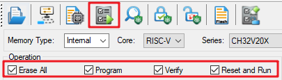
<figcaption>
图 1‑1 LINK下载配置
</figcaption>
</figure>

如图1-1，可以通过复选框，自定义选择下载流程包含内容。如实现仅擦除、实现仅校验、实现仅软件复位，已经各种组合功能等。

## FLASH指定地址数据读取及保存

<figure>
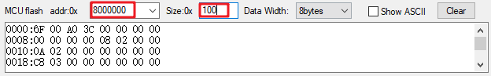
<figcaption>
图 1‑2 LINK读FLASH数据配置
</figcaption>
</figure>

如图1-2，填写地址和大小；随后执行读FLASH，如图1-3。注意，读取内存数据需要芯片在非读保护情况下进行，如果当前处于读保护状态，无法读取数据，且解除读保护后，用户区将被自动清空。

<figure>
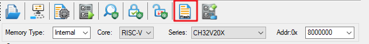
<figcaption>
图 1‑3 FLASH读功能
</figcaption>
</figure>

在读出的数据显示界面使用鼠标右键可选保存为文件，如图1-4。

图 1‑4 数据保存

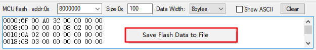

## 芯片功能配置

<figure>
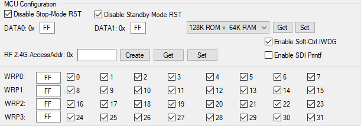
<figcaption>
图 1‑5 芯片功能配置
</figcaption>
</figure>

对于支持功能配置芯片，LINK在下载流程中，
会将软件界面的设定值，写入指定地址，如图1-5所示。典型的用户字区域功能位配置，包括，STOP模式复位、DATA0/DATA1值、硬件看门狗使能、读/写保护等。不同芯片可能涉及的可配置功能位不同，详情请参考对应手册。部分用户字区域实际分配大小不止16字节，除用户字功能区域外的地址均可作为用户DATA
FLASH，即掉电不丢失。需要注意

LINK下载更新用户字会先调用用户字区域擦除，且仅能在下载过程中更新用户字区域前16字节的值，若16字节后的区域有用作DATA
FLASH时，建议在程序中加入判断重入过程，防止被下载流程擦除。不同芯片的用户字区的编程方式不同，大致分为两类，一类是支持半字写，如CH32V30x等；另一类是不支持半字写，只支持页编程写用户字区域，如CH32X035等。

## 一键下载

<figure>
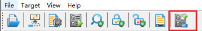
<figcaption>
图 1‑6 一键下载
</figcaption>
</figure>

如图1-6所示，按键将多种功能整合，包括5V/3V断电上电，掉电擦除用户区，解除读保护，固件重新下载流程。可以有效解决芯片代码跑飞，内部关两线等，导致两线连接异常的问题。

## 内部FLASH指定下载地址

<figure>

<figcaption>
图 1‑7 FLASH 下载地址指定
</figcaption>
</figure>

如图1-7，内部FLASH下载可以指定下载地址，需要注意限制4K对齐

## 外部FLASH下载

<figure>
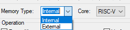
<figcaption>
图 1‑8 外部FLASH下载模式选择
</figcaption>
</figure>

如图1-8，选择External模式，可以对支持的型号进行外部FLASH下载。目前仅支持部分型号，更多的芯片类型支持将在后续更新中逐步完善

## LINK模式切换

LINK同样支持ARM核的芯片下载，在Core类型选择ARM，如图1-9。

<figure>
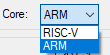
<figcaption>
图 1‑9 LINK模式切换
</figcaption>
</figure>

此外，需额外设置Link Mode为DAP，否则不能正常连接两线如图1-10。

<figure>
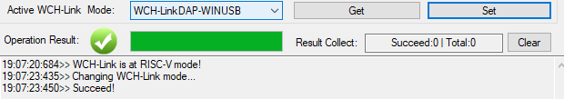
<figcaption>
图 1‑10 LINK DAP模式配置
</figcaption>
</figure>

## 掉电擦除时间延长

<figure>

<figcaption>
图 1‑11 掉电延时
</figcaption>
</figure>

支持掉电擦的芯片如果程序中关两线时间过早，则无法连两线进调试模式。部分有硬件BOOT引脚的芯片可以选择，进BOOT运行程序，再通过两线接口进调试，全擦用户区，解决问题，如V20x、V30x等。一些没有硬件BOOT脚的芯片如V00x等，可以通过如图1-11选项功能，适当延长掉电时间，可以一定程度解决当前问题。注意：软件关两线时间，尽量不能太早，否则可能出现芯片彻底变砖的情况。

# MRS常见功能

## 工程配置

通常可以选中工程，右键菜单中选择Properties，如图2-1。或者点击快捷按键进入工程配置，如图2-2。

<figure>
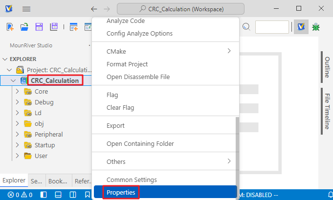
<figcaption>
图 2‑1工程属性菜单入口
</figcaption>
</figure>

<figure>
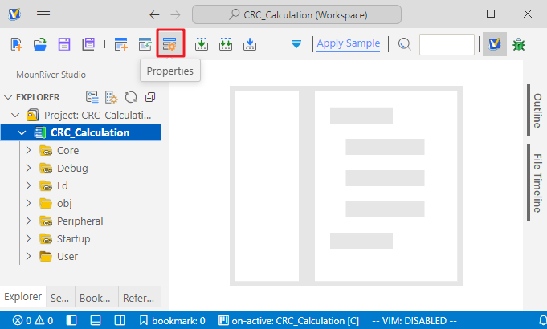
<figcaption>
图 2‑2工程属性菜单入口
</figcaption>
</figure>

常用配置如下，如图2-3所示

菜单1：工具链选择

菜单2：工程编译优化等级

菜单3：汇编文件（Startup）路径

菜单4：为全局宏定义

菜单5：为头文件路径

菜单6：为链接（LD）文件路径

菜单7：为静态库（.a）路径

<figure>
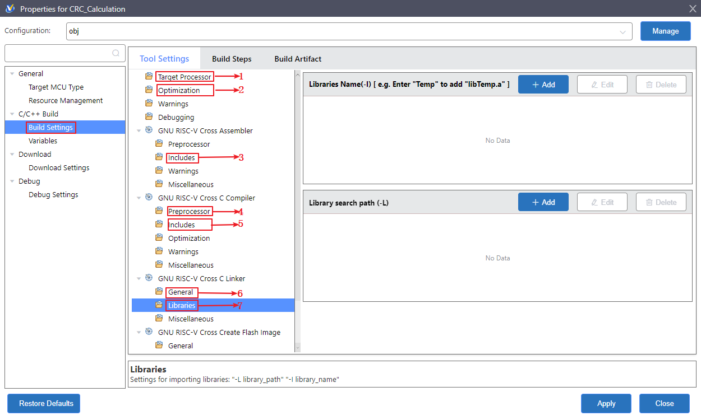
<figcaption>
图 2‑3 常用工程配置
</figcaption>
</figure>

浮点打印如图2-4 所示。

<figure>
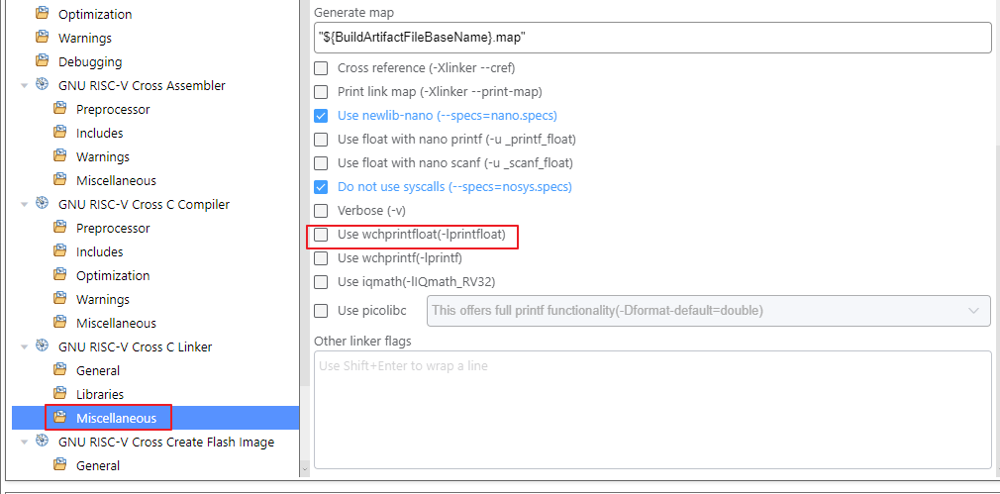
<figcaption>
图 2‑4 浮点打印配置
</figcaption>
</figure>

编译生成文件选择，如图2-5所示。

<figure>
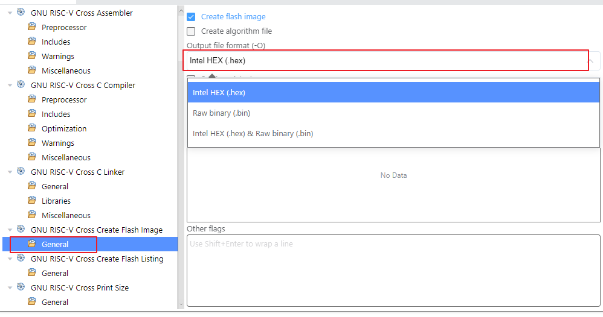
<figcaption>
图 2‑5 编译生成目标文件选择
</figcaption>
</figure>

生成的list文件的参数，如图2-6所示。

<figure>
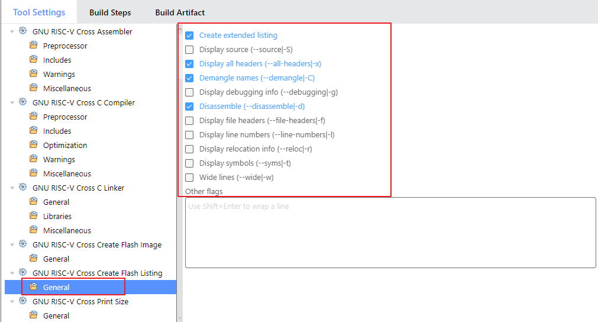
<figcaption>
图 2‑6 list文件生成配置参数
</figcaption>
</figure>

工程快捷功能设置，如图2-7所示，可以配置输出目标文件类型，浮点打印，math库等常用功能。

<figure>
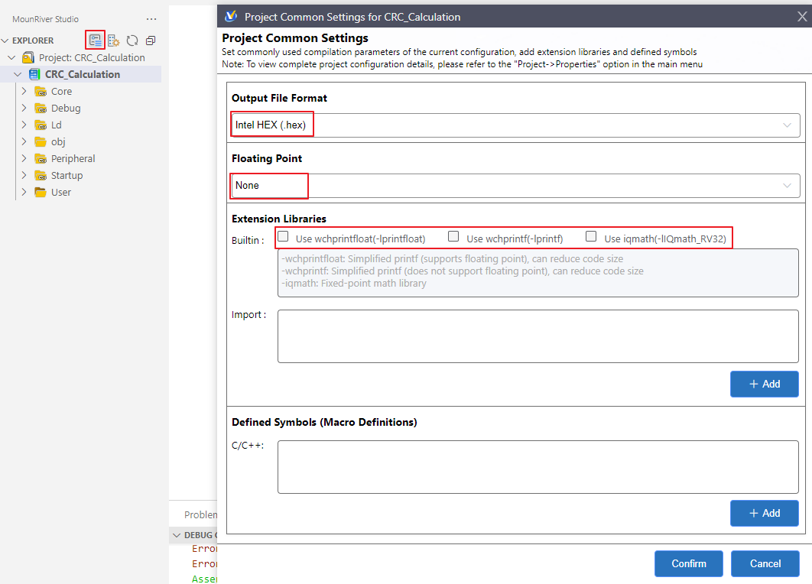
<figcaption>
图 2‑7 工程快捷功能设置
</figcaption>
</figure>

## 工程编译

<figure>
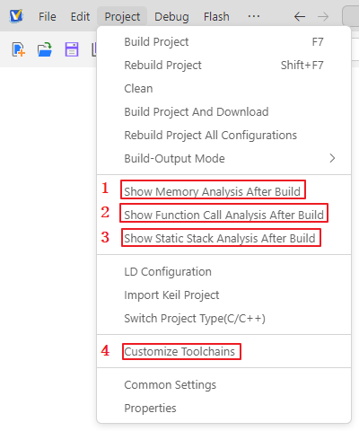
<figcaption>
图 2‑8 工程编译配置项
</figcaption>
</figure>

编译配置菜单主要如图2-8所示，点击启用。

菜单1：主要功能包括显示资源占用，查看具体函数，所在Section，以及编译后的函数地址及大小，如图2-9。

<figure>
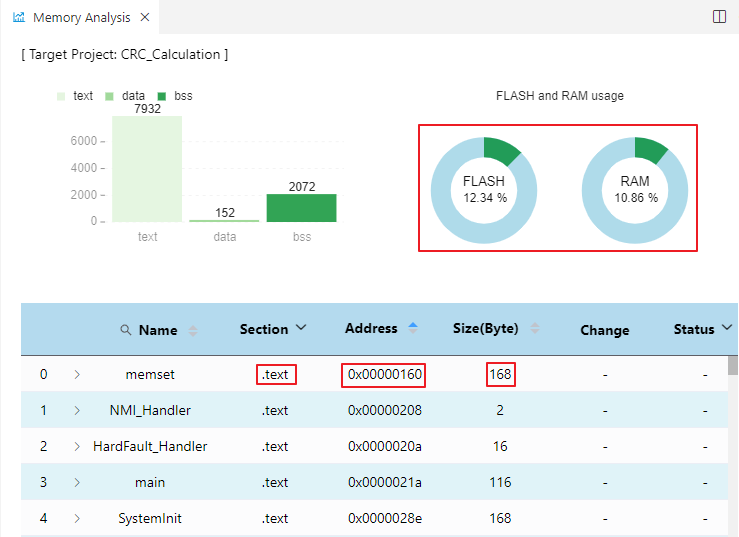
<figcaption>
图 2‑9 资源占用显示
</figcaption>
</figure>

如果仅想在编译输出界面显示当前资源占比，可以在Properties-\>GNU RISC-V
Cross C Linker -\>Miscellaneous菜单的Linker flags
添加“--print-memory-usage”效果如图2-10所示

<figure>
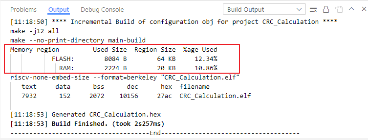
<figcaption>
图 2‑10 简洁资源占用显示
</figcaption>
</figure>

菜单2：主要功能为函数调用图形化分析，如图2-11

<figure>
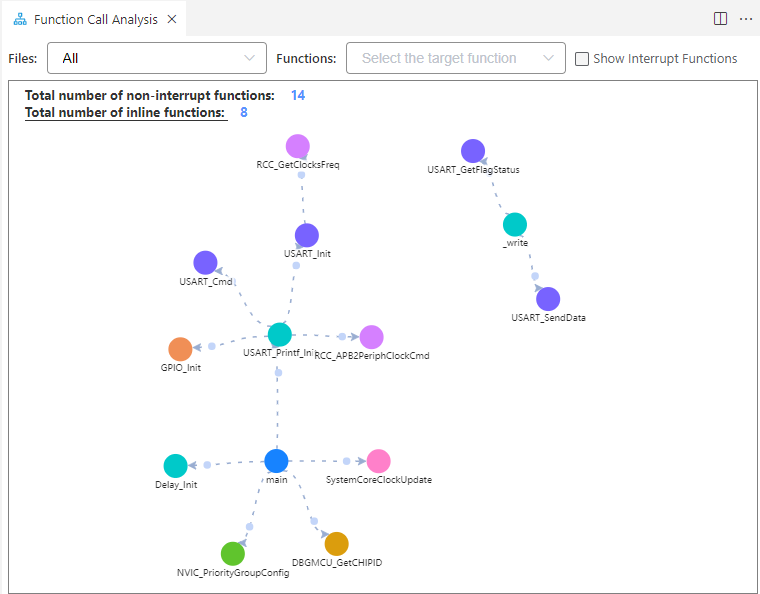
<figcaption>
图 2‑11 函数调用图形化分析
</figcaption>
</figure>

菜单3：主要功能为栈调用分析，如图2-12

<figure>
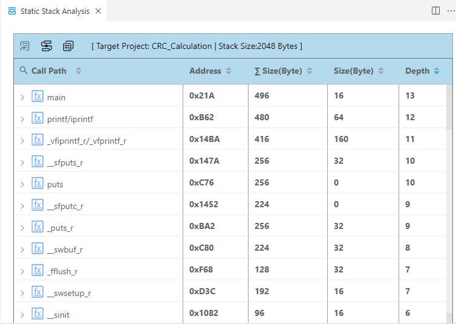
<figcaption>
图 2‑12 栈调用分析
</figcaption>
</figure>

菜单4：自定义GCC工具链，如图2-13，需要注意仅支持GCC，可以在当前界面添加并使用管理

<figure>
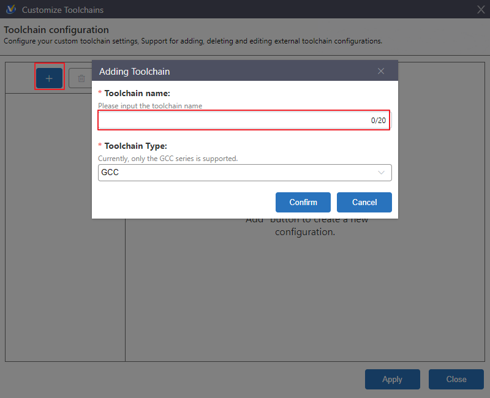
<figcaption>
图 2‑13 自定义GCC工具链
</figcaption>
</figure>

## 工程下载

下载配置界面如图2-14所示

<figure>
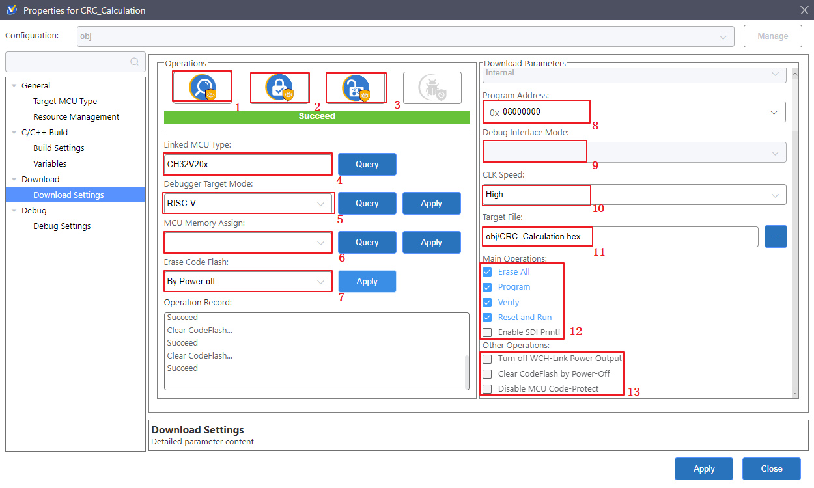
<figcaption>
图 2‑14 下载配置
</figcaption>
</figure>

菜单1：查询读/写保护状态

菜单2：使能读保护状态

菜单3：解除读保护状态

菜单4：获取芯片型号

菜单5：LINK模式查询及设置，RISC-V 或者 ARM

菜单6：FLASH/RAM容量分配（仅对支持的芯片生效）

菜单7：掉电擦和复位擦功能，擦除用户区。需要注意复位擦对于支持单双线切换的芯片，只有在单线下才支持复位擦。

菜单8：编程地址可自定义但是同样有对齐要求

菜单9：调试接口模式，单双线选择（仅对支持的芯片生效）

菜单10：调试接口速度，默认三挡可调。（当PCB走线等因素影响，从而导致下载校验异常，可尝试降低调试口速度）

菜单11：下载目标文件

菜单12：通用下载流程，同LinkUtility工具

菜单13：通用下载流程前的补充步骤，包括电压断电上电，掉电擦除用户区，关闭芯片读保护。

## 工程调试

调试配置界面可以通过Properties打开，如图2-15所示。可配置调试选项有跳过调试重新下载固件步骤（确保FLASH中存在调试固件）；在调试前下载调试固件时，使用页擦；使能非零等待区域的调试。

<figure>
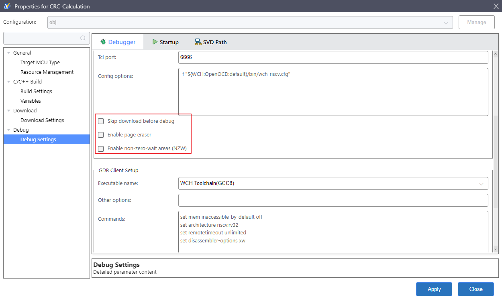
<figcaption>
图 2‑15调试配置
</figcaption>
</figure>

历史版本

| 日期      | 版本 | 变更内容 |
|-----------|------|----------|
| 2026/8/31 | V1.0 | 初版发行 |

声明

本手册仅供参考。作者在不另行通知的情况下，可随时进行修改。
