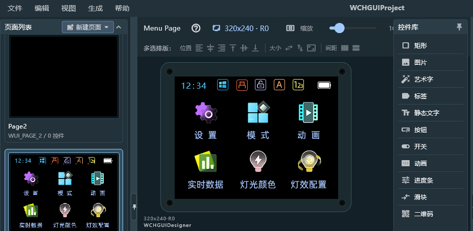

<table>
<colgroup>
<col style="width: 50%" />
<col style="width: 50%" />
</colgroup>
<thead>
<tr>
<th rowspan="2"></th>
<th></th>
</tr>
<tr>
<th></th>
</tr>
</thead>
<tbody>
</tbody>
</table>

说明

CH32 系列各型号的显示驱动能力差别很大：从 CH32V006
只能驱动简单的屏幕，到 CH32V407 具备多种能力。本文整理 CH32
各型号可用的驱屏接口、典型用法、配置要点和选型建议。带宽与帧率均为估算，实际
SCK/FSMC/LTDC
时钟由各型号时钟树与分频决定，以具体的数据手册、参考手册和厂商最新文档为准。

**适用范围**

| 适用范围 | 系列 |
|----|----|
| 通用MCU | CH32V006 / V103 / V203 / V205 / V30x / V4x7 / L103 / X035 / X315 等 |

目录

[说明 [1](#_Toc241659348)](#_Toc241659348)

[目录 [2](#_Toc241659349)](#_Toc241659349)

[表格索引 [2](#_Toc241659350)](#_Toc241659350)

[图片索引 [2](#_Toc241659351)](#_Toc241659351)

[第1章 常用接口与用法 [1](#常用接口与用法)](#常用接口与用法)

[1.1 接口区分 [1](#接口区分)](#接口区分)

[1.2 I2C 接口 [1](#i2c-接口)](#i2c-接口)

[1.3 SPI 接口 [1](#spi-接口)](#spi-接口)

[1.4 QSPI 接口 [1](#qspi-接口)](#qspi-接口)

[1.5 8080 并口 [2](#并口)](#并口)

[1.6 RGB 接口与LTDC控制器
[2](#rgb-接口与ltdc控制器)](#rgb-接口与ltdc控制器)

[第2章 CH32 驱屏接口简介 [3](#ch32-驱屏接口简介)](#ch32-驱屏接口简介)

[2.1 驱屏能力一览 [3](#驱屏能力一览)](#驱屏能力一览)

[2.2 带 GRAM 屏的帧率估算
[3](#带-gram-屏的帧率估算)](#带-gram-屏的帧率估算)

[2.3 无 GRAM 屏的带宽估算
[3](#无-gram-屏的带宽估算)](#无-gram-屏的带宽估算)

[2.4 现有CH32的驱动例程 [4](#现有ch32的驱动例程)](#现有ch32的驱动例程)

[2.5 WGUI [4](#wgui)](#wgui)

[历史版本 [5](#_Toc241659365)](#_Toc241659365)

[声明 [6](#_Toc241659366)](#_Toc241659366)

表格索引

[MCU能力一览 [3](#_Toc241659367)](#_Toc241659367)

[GRAM 屏帧率估算 [3](#_Toc241659368)](#_Toc241659368)

[无 GRAM 屏的带宽 [4](#_Toc241659369)](#_Toc241659369)

图片索引

[WGUI的编辑界面 [4](#_Toc241659370)](#_Toc241659370)

# 常用接口与用法

## 接口区分

选型时需优先区分屏幕是否内置 GRAM：

- 带 GRAM 屏（I2C / SPI / QSPI / 8080 并口）：

> MCU 仅在画面更新时发送局部或全屏数据，屏幕自主维持约 60Hz 刷屏。对 MCU
> 的 SRAM 容积和连续输出带宽要求低。

- 无 GRAM 屏（RGB并口）：

> 需要 MCU 的 LTDC
> 外设持续以像素时钟（PCLK）刷出帧数据，一旦中断画面即闪烁。要求 MCU
> 拥有足够大的 SRAM/PSRAM 充当 FrameBuffer。

## I2C 接口

I2C 更适合低分辨率、低刷新率的显示设备，例如 SSD1306 128×64 单色
OLED、段码屏和字符屏。彩色点阵屏也可以通过 I2C
连接，但刷新带宽通常不够，实际项目中很少把它作为彩色屏的主要接口。其控制信号一般有SCL和SDA两个，一般还可能有RST和BL作为配合。

> I2C接口特性

- 400 kHz 下的理论原始数据率约 50 KB/s，考虑协议开销后实际有效数据率约
  40 KB/s。

- 接线简单，主要就是 SCL、SDA，另外根据屏模块需要连接 RST、BL。

- 多数 I2C 屏驱动 IC 内置 GRAM 或显示数据 RAM，MCU 写入后由驱动 IC
  自行扫描显示。

- SSD1306 等器件也经常提供 SPI 版本。如果允许，SPI
  通常更适合需要较快刷新的场景。

## SPI 接口

SPI 是 CH32 上最常见的彩色屏接口之一。常见的 4 线接法为
SCK、MOSI、CS、DC，再根据模块增加 RST 和 BL。

3 线 SPI 会把 D/C 信息放到额外的数据位中，例如 9-bit SPI。多数 CH32 SPI
的数据宽度是 8/16 位，因此不能直接按原生 9-bit SPI
使用；在速率要求不高的情况下用 GPIO 模拟。

使用 SPI 屏时，屏控制器一般会把数据写进自己的 GRAM。MCU
可以只更新发生变化的区域。如果屏提供 TE 引脚，还可以通过 EXTI 捕获
TE，与屏的刷新周期配合，减少撕裂。

SPI控制器的初始化代码比较常见，通常可以直接移植现有驱动，如果有需要再根据
CH32 的 SPI/DMA 接口调整底层发送函数。

## QSPI 接口

QSPI是 SPI
接口的扩展，将传统的单数据线扩展为四条数据线（IO0~IO3），在保持串行接口接线简单性的同时，通过四线并行传输大幅提升数据吞吐量。QSPI
屏通过四条数据线和一条时钟线高速传输图像数据和控制命令，适用于高分辨率或高刷新率的
LCD。其控制信号由
SCLK、CS、IO0-3这条核心线组成，常用的型号还会有RST和BL这两个引脚。

在 QSPI 模式下，原本SPI 中的
DC（数据/命令选择）引脚被复用，命令与数据的区分通过协议本身来识别，而非独立的
DC 引脚。这与 SPI 屏通过独立 DC 引脚或额外数据位传递 D/C
信息的做法不同。

SPI 屏使用单条数据线串行逐位传输，速率受限于时钟频率。QSPI
的四条数据线可在同一时钟周期内并行传输 4 位数据，理论吞吐量是标准 SPI 的
4 倍。此外，QSPI 外设支持 Dual SPI 和 Quad SPI
等多种传输模式，命令、地址和数据可以分别配置为不同的线宽模式——例如命令和地址以标准
SPI 发送，数据部分切换为 Quad SPI 传输。命令帧的典型结构为 8 位命令头 +
24 位命令字 + 若干位像素数据，但具体格式因屏驱动 IC 而异。

刷屏流程与 SPI 屏类似：先通过命令设置 GRAM
的写入窗口（起始/结束行列地址），然后连续写入像素数据，利用 GRAM
地址自增机制完成区域填充。

## 8080 并口

8080 并口（也称 I80 接口或 MCU
屏接口）是最常见的并行彩色屏接口之一。其控制信号由 CS、WR、RD、DC
四条核心线组成，数据线宽度通常为 8 位或 16 位。8 位模式下使用 D0~D7
八条数据线，16 位模式下使用 D15~D0
十六条数据线，具体宽度由屏控制器接口模式配置决定。

8080 是并行接口，相比 SPI 的串行逐位传输，一次可并行送出 8 位或 16
位数据，刷新速率更高，但引脚占用也更多。其数据/命令选择通过独立的 DC（或
RS）引脚控制：DC 为低时写入命令，DC 为高时写入数据 。

使用 8080 屏时，屏控制器同样会把数据写进自己的 GRAM，MCU
可以先通过指令设置好 GRAM
的窗口区域（起始和结束坐标），然后连续写入像素数据，利用 GRAM
地址自增机制自动填充，只更新发生变化的区域。

MCU 端通常利用 FSMC/FMC 外设驱动 8080 接口，将 8080 时序映射为类似 SRAM
的读写操作：访问不同地址即可产生命令或数据时序，DC 引脚由某根地址线（如
FSMC_Ax）控制，CS 由片选信号（如 FSMC_NE）控制。初始化代码通常包括
FSMC/FMC
外设配置、屏初始化序列发送，以及底层写命令、写数据、读数据函数的封装，之后即可按区域更新
GRAM 实现显示刷新。

## RGB 接口与LTDC控制器

LTDC（LCD-TFT Display
Controller）是MCU内部集成的显示控制器，专门用于驱动RGB接口的LCD屏。与SPI、8080、QSPI屏最大的不同在于：RGB屏通常不带显示控制器（无GRAM），需要MCU持续不断地输出像素流来维持画面显示。

RGB接口也是并行接口，LTDC 硬件接口提供 24 位并行 RGB 数据总线（每色 8
位，即
RGB888），同时输出时序控制信号，包括LCD_CLK像素时钟，LCD_HSYNC水平同步信号，LCD_VSYNC垂直同步信号，LCD_DE数据使能信号。

对于 RGB666 或 RGB565 等低位宽屏，连接时需将 LTDC
数据总线的高位对应接到屏的数据线上。LTDC 的所有 GPIO
必须配置为高速模式，以保证像素时钟下的信号完整性。

RGB 屏的接口模式分为 DE 模式和 SYNC 模式。DE 模式下，数据有效性由 DE
信号决定，无需配置消隐区域寄存器；SYNC 模式下则不使用 DE 信号，依赖
VSYNC 和 HSYNC 的消隐期来界定有效数据区域。部分 RGB 屏还采用 SPI + RGB
组合接口：SPI 用于初始化屏驱动 IC
的寄存器（如设置镜像、色彩格式等），RGB
接口则负责后续的高速像素数据传输。

与 其他屏的核心差异

SPI、8080、QSPI 屏的驱动 IC 内部一般都有 GRAM，MCU 只需把数据写入
GRAM，驱动 IC 自己负责刷新面板。但 RGB 屏的驱动 IC 通常没有
GRAM，面板上的每个像素必须由 MCU 通过 RGB
接口实时发送数据。这意味着：MCU 必须在显存中维护完整的帧缓冲区（Frame
Buffer）。LTDC 控制器作为总线主设备，自动从显存中按行读取像素数据，无需
CPU 干预。一旦像素流停止，屏幕会立刻黑屏或花屏。

# CH32 驱屏接口简介

## 驱屏能力一览

<table style="width:97%;">
<caption>
表 2‑1 MCU能力一览
</caption>
<colgroup>
<col style="width: 20%" />
<col style="width: 20%" />
<col style="width: 27%" />
<col style="width: 29%" />
</colgroup>
<thead>
<tr>
<th><strong>型号</strong></th>
<th><strong>内核/主频</strong></th>
<th><strong>SRAM</strong></th>
<th><strong>与显示相关的外设能力</strong></th>
</tr>
</thead>
<tbody>
<tr>
<td>CH32V006</td>
<td>V2C，48 MHz</td>
<td>8 KB</td>
<td>I2C、SPI</td>
</tr>
<tr>
<td>CH32V103</td>
<td>V3A，72 MHz</td>
<td>10 KB</td>
<td>I2C、SPI</td>
</tr>
<tr>
<td>CH32V203</td>
<td>V4B，144 MHz</td>
<td>10~32 KB</td>
<td>I2C、SPI</td>
</tr>
<tr>
<td>CH32V205</td>
<td>V3B，192 MHz</td>
<td>32 KB</td>
<td>I2C、SPI、QSPI</td>
</tr>
<tr>
<td>CH32V307</td>
<td>V4F，144 MHz</td>
<td>32~128 KB</td>
<td>I2C、SPI、FSMC</td>
</tr>
<tr>
<td>CH32L103</td>
<td>V4C，96 MHz</td>
<td>20 KB</td>
<td>I2C、SPI</td>
</tr>
<tr>
<td>CH32X035</td>
<td>V4C，48 MHz</td>
<td>20 KB</td>
<td>I2C、SPI</td>
</tr>
<tr>
<td>CH32X315</td>
<td>V3F，480 MHz</td>
<td>64 KB</td>
<td>I2C、SPI</td>
</tr>
<tr>
<td>CH32V407/V467</td>
<td>V3V，200 MHz</td>
<td>200 KB 
（V467 另带 PSRAM）</td>
<td>I2C、SPI、FSMC、LTDC</td>
</tr>
</tbody>
</table>

## 带 GRAM 屏的帧率估算

下表为使用CH32的MCU驱动带GRAM的屏幕时，可以达到的帧率理论值：

<table style="width:98%;">
<caption>
表 2‑2 GRAM
屏帧率估算
</caption>
<colgroup>
<col style="width: 13%" />
<col style="width: 13%" />
<col style="width: 15%" />
<col style="width: 17%" />
<col style="width: 20%" />
<col style="width: 17%" />
</colgroup>
<thead>
<tr>
<th><strong>分辨率（RGB565）</strong></th>
<th><strong>整帧大小</strong></th>
<th><strong>SPI@20 MHz 
（理论）</strong></th>
<th><strong>SPI@40 MHz 
（理论）</strong></th>
<th><strong>QSPI 4线 
@60 MHz（理论）</strong></th>
<th><strong>8080-16 位 
（理论）</strong></th>
</tr>
</thead>
<tbody>
<tr>
<td>128×160</td>
<td>40 KiB</td>
<td>约 61 fps</td>
<td>约 122 fps</td>
<td>充裕</td>
<td>充裕</td>
</tr>
<tr>
<td>240×240</td>
<td>113 KiB</td>
<td>约 22 fps</td>
<td>约 43 fps</td>
<td>约 150 fps</td>
<td>约 100 fps</td>
</tr>
<tr>
<td>240×320</td>
<td>150 KiB</td>
<td>约 16 fps</td>
<td>约 33 fps</td>
<td>约 120 fps</td>
<td>约 90 fps</td>
</tr>
<tr>
<td>320×480</td>
<td>300 KiB</td>
<td>约 8 fps</td>
<td>约 16 fps</td>
<td>约 60 fps</td>
<td>约 40 fps</td>
</tr>
<tr>
<td>480×480</td>
<td>450 KiB</td>
<td>约 5 fps</td>
<td>约 11 fps</td>
<td>约 40 fps</td>
<td>约 25 fps</td>
</tr>
<tr>
<td>480×272</td>
<td>255 KiB</td>
<td>约 10 fps</td>
<td>约 19 fps</td>
<td>约 70 fps</td>
<td>约 50 fps</td>
</tr>
</tbody>
</table>

## 无 GRAM 屏的带宽估算

常见的RGB屏幕接受的帧率为50-70Hz
左右，低于这个值，屏幕可能出现闪烁，花屏等情况。

适用 V407/V467 的 LTDC 驱动的 RGB 屏。像素时钟由屏时序决定：

PCLK = (Hres + HBP + HFP + HSPW) × (Vres + VBP + VFP + VSPW) × fps

像素带宽 = PCLK × bpp / 8

| **分辨率** | **PCLK@60 Hz** | **RGB565 带宽** | **RGB565 帧缓存** |
|------------|----------------|-----------------|-------------------|
| 480×272    | 约 10 MHz      | 约 19 MB/s      | 255 KB            |
| 800×480    | 约 33 MHz      | 约 66 MB/s      | 750 KB            |

表 2‑3无 GRAM 屏的带宽

## 现有CH32的驱动例程

官方 EVT 工程包中的显示相关例程和芯片手册，可在沁恒官网下载对应 EVT
压缩包后找到。

- CH32V30x FSMC/LCD（16 位 8080）、FSMC/LCD_8bit
  使用8080驱动LCD屏幕SPI/SPI_LCD 使用SPI驱动LCD屏幕

- CH32V4x7 LTDC/LTDC_Display：RGB 屏例程，FSMC/8080 LCD
  例程，另外包含lvgl和LTDC一起使用的例程。

## WGUI 

WGUI 是 沁恒微电子提供的轻量级嵌入式图形界面库，用于其带 LCD 屏的
MCU（如 CH32V、CH58x/ 等）。

主要特点：

- 轻量，Flash/SRAM 占用小，适合资源受限的 MCU

- 提供按钮、标签、进度条、滑动条、列表、复选框等常见控件

- 以 C 语言库形式提供，可直接集成到工程

- 兼容 TFT、OLED 等常见 LCD 接口

- 可以图形化编辑界面

<figure>

<figcaption>
图 ‑1 WGUI的编辑界面
</figcaption>
</figure>

历史版本

| 日期     | 版本 | 变更内容 |
|----------|------|----------|
| 2026/7/8 | V1.0 | 初版发行 |

声明

本手册仅供参考。作者在不另行通知的情况下，可随时进行修改。
