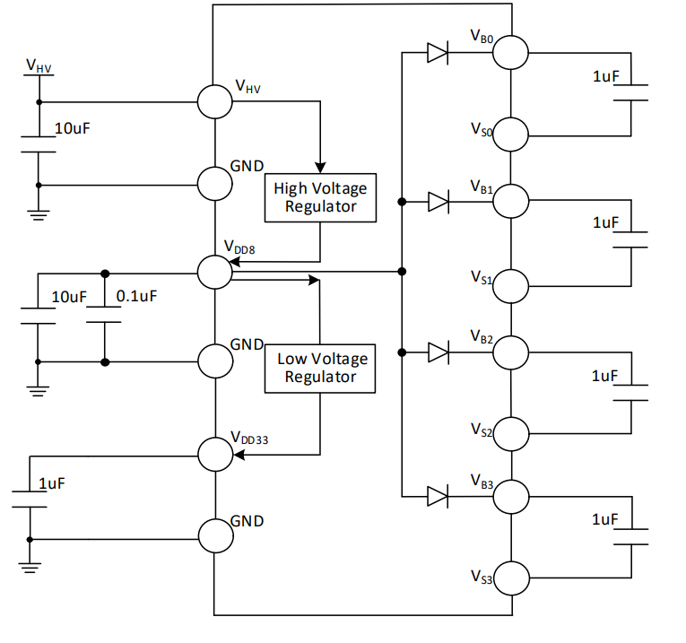
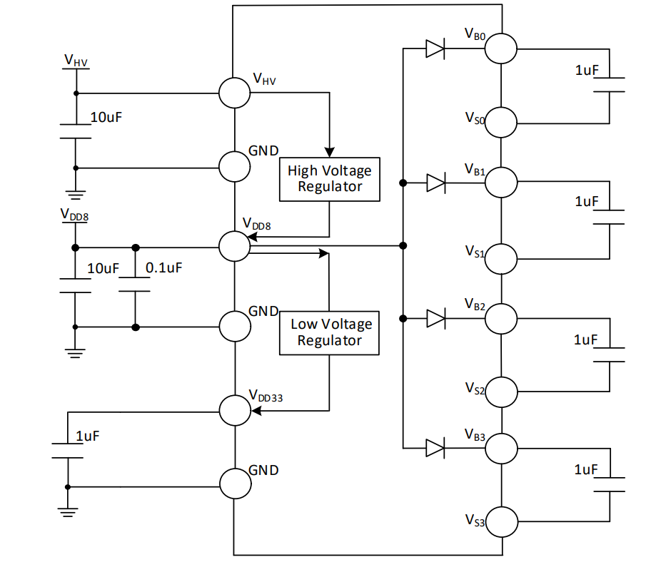
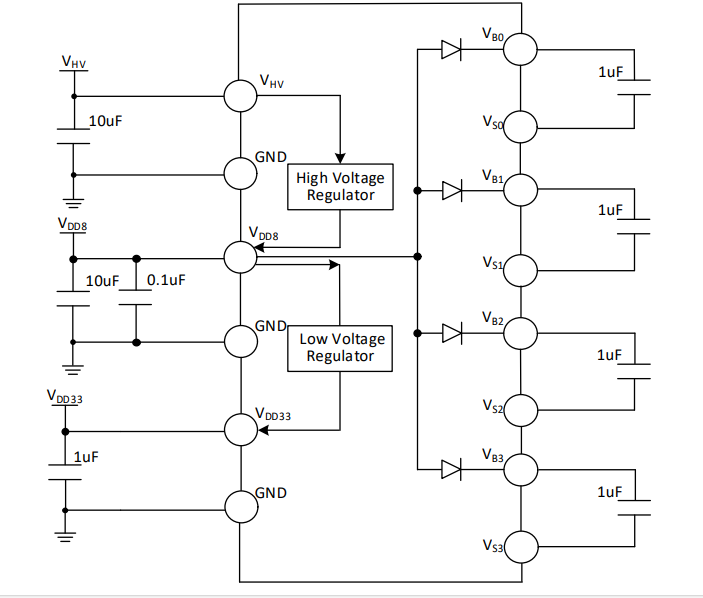
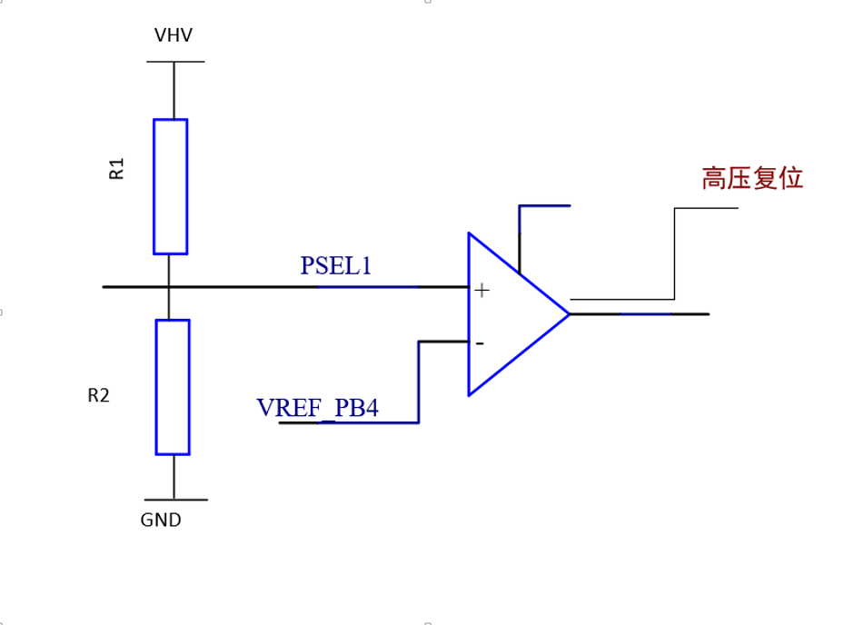
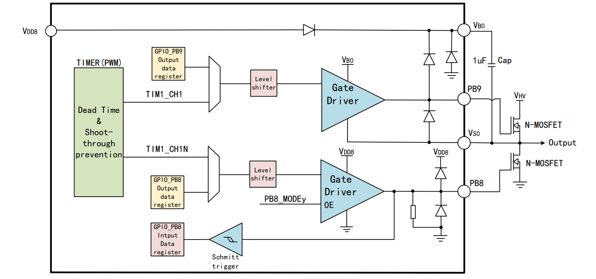
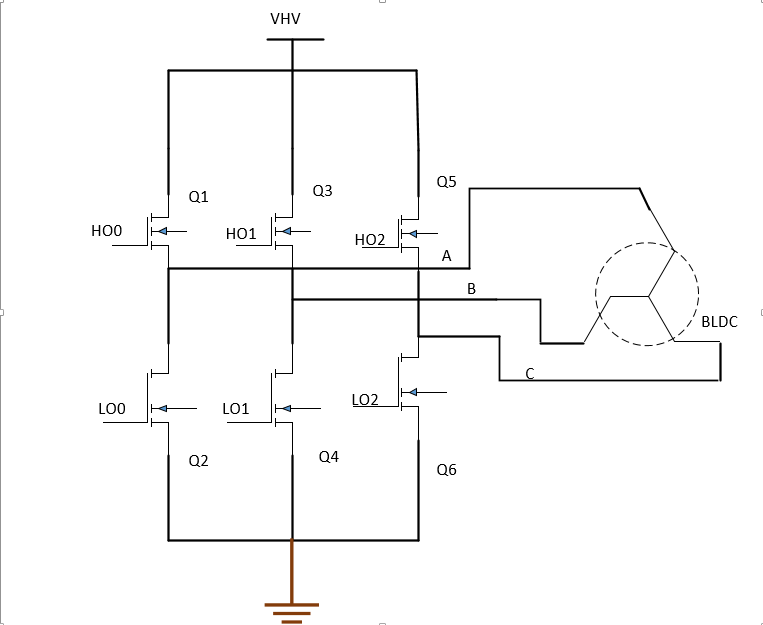
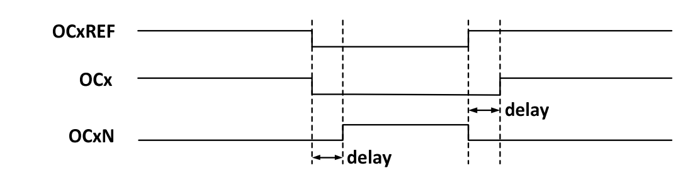
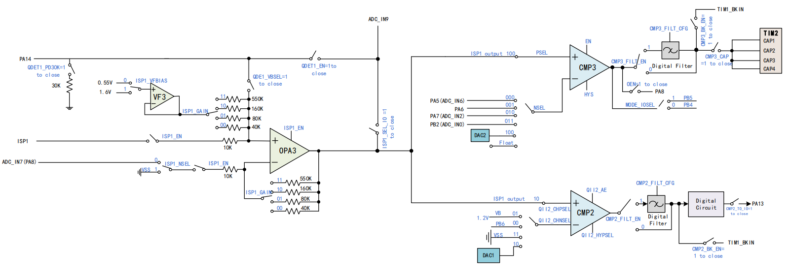

<table>
<colgroup>
<col style="width: 49%" />
<col style="width: 50%" />
</colgroup>
<thead>
<tr>
<th rowspan="2"></th>
<th></th>
</tr>
<tr>
<th></th>
</tr>
</thead>
<tbody>
</tbody>
</table>

说明

工业级电机微控制器作为CH32M030基础功能之一，本文介绍芯片供电系统，与电机应用介绍，其主要特性具有电源支持宽范围高电压输入支持4对N型功率管栅极预驱。

**适用范围**

| 适用范围 | 系列     |
|----------|----------|
| 通用MCU  | CH32M030 |

目录

[说明 [1](#_Toc241658697)](#_Toc241658697)

[目录 [2](#_Toc241658698)](#_Toc241658698)

[表格索引 [2](#_Toc241658699)](#_Toc241658699)

[图片索引 [2](#_Toc241658700)](#_Toc241658700)

[第1章 供电方案详解 [1](#供电方案详解)](#供电方案详解)

[1.1 电压引脚与电压域 [1](#电压引脚与电压域)](#电压引脚与电压域)

[1.2 不同供电方案 [1](#不同供电方案)](#不同供电方案)

[1.2.1 使用VHV单独供电 [1](#使用vhv单独供电)](#使用vhv单独供电)

[1.2.2 使用VDD8单独供电 [2](#使用vdd8单独供电)](#使用vdd8单独供电)

[1.2.3 使用VDD33单独供电 [2](#使用vdd33单独供电)](#使用vdd33单独供电)

[1.3 设计注意事项 [3](#设计注意事项)](#设计注意事项)

[1.3.1 退耦电容 [3](#退耦电容)](#退耦电容)

[1.3.2 过压/过温保护 [4](#过压过温保护)](#过压过温保护)

[1.3.3 高压IO与预驱供电 [4](#高压io与预驱供电)](#高压io与预驱供电)

[第2章 电机域驱使用 [6](#电机域驱使用)](#电机域驱使用)

[2.1 半桥驱动详解 [6](#半桥驱动详解)](#半桥驱动详解)

[2.2 定时器配置 [7](#定时器配置)](#定时器配置)

[2.2.1 信号生成 [7](#信号生成)](#信号生成)

[2.2.2 死区功能 [7](#死区功能)](#死区功能)

[2.2.3 刹车信号 [9](#刹车信号)](#刹车信号)

[历史版本 [11](#_Toc241658717)](#_Toc241658717)

[声明 [12](#_Toc241658718)](#_Toc241658718)

表格索引

[引脚和负载功能功能表 [1](#_Toc241658719)](#_Toc241658719)

[转子导通状态 [6](#_Toc241658720)](#_Toc241658720)

[高级定时器配置 [7](#_Toc241658721)](#_Toc241658721)

图片索引

[单VHV供电 [1](#_Toc241658722)](#_Toc241658722)

[外部直接为VDD8供电 [2](#_Toc241658723)](#_Toc241658723)

[外部直接为VDD33和VDD8供电 [2](#_Toc241658724)](#_Toc241658724)

[芯片过压/过温复位保护拓扑图 [4](#_Toc241658725)](#_Toc241658725)

[单个半桥驱动器结构框图 [4](#_Toc241658726)](#_Toc241658726)

[无刷电机（BLDC）拓扑结构 [6](#_Toc241658727)](#_Toc241658727)

[互补输出和死区 [8](#_Toc241658728)](#_Toc241658728)

[内部ISP电流采样电路 [9](#_Toc241658729)](#_Toc241658729)

# 供电方案详解

这CH32M030供电系统设计较为复杂，支持宽范围高压输入，本章节介绍芯片芯片供电方案及典型电路以及注意事项，帮助用户正确完成电源设计。

## 电压引脚与电压域

CH32M030供电可以看作成为内置3级LDO调节器，其架构可以分为：VHV为高电压输入引脚，经由内部高压调压器输出电压为VDD8供电，VDD8经由部低压调压器产生电压为VDD33供电。对应的引脚和负载功能见下表。

| 电压域 | 引脚名称 | 额定电压 |              供电负载               |
|:------:|:--------:|:--------:|:-----------------------------------:|
| 高压域 |   VHV    |  4-29V   |  内部高压调压器和HV高压I/O引脚供电  |
| 中压域 |   VDD8   | 4-10.5V  | MV预驱动I/O引脚供电和内部低压调压器 |
| 低压域 |  VDD33   | 3.1-3.5V |  为普通I/O引脚和ADC以及内核 调压器  |

表 1‑1引脚和负载功能功能表

## 不同供电方案

CH32M030根据系统应用需求，提供三种典型的供电配置方案。设计时需根据系统功耗、效率和成本综合考虑选择合适的方案

### 使用VHV单独供电

由于内部CH32M030内部有3级LDO调节器，因此可以对VHV单独供电就仅使用VHV一个外部电源输入，芯片内部的高压LDO和低压LDO分别为VDD8和VDD33提供电源。在该供电模式下VDD8与VDD33引脚可看错成电压输出端，无需额外供电芯片即可正常工作。单独VHV供电典型电路如图所示。

<figure>

<figcaption>
图 1‑1单VHV供电
</figcaption>
</figure>

VDD8输入电压可依据寄存器调节，但在调节前需要注意VHV供电电压，虽然VHV供电电压范围为4-29V，但当供电较低时，会使得LDO输出电压存在压降。如果VHV供电为5V，VDD8选取电压为5V，LDO工作仍处于压差区，VDD8输出电压约为VHV-0.2V。因此需要VDD8整除输出设定电压，VHV供电电压建议为：VDD8+0.8V。

### 使用VDD8单独供电

在此方案中，VDD8由外部LDO或开关电源单独供电，VHV仍为芯片高压部分供电。此方案可降低内部LDO的功耗负担。单独VDD8供电典型电路如图所示。

<figure>

<figcaption>
图 1‑2 外部直接为VDD8供电
</figcaption>
</figure>

在此方案中，使用外部供电可有效减少芯片内部功耗过大，引起芯片发热问题，根据LDO特性，其转换率可以简单看作成：$`\sigma = \frac{Vout}{Vin}*100\%`$，功耗损率为耗散功率以热量的形式进行散发，当芯片运行时，耗散功率可以看作成为：$`PD = (Vin - VOUT)*IOUT`$，可以看出在同等运行条件下，当输入电压越大时，内部LDO转换功率越低，耗散功率越高导致芯片温升更严重，因此可以使用VDD8外部供电，在供电时需要输入电压高于VDD8的输出电压，确保内部LDO处于空载状态。

在此方案中，虽然VHV供电核心为高压引脚供电，但不适用VHV高压引脚应用的情况下仍需为VHV单独供电，防止内部LDO倒灌，根据LDO基础，当VOUT比VIN电压高出源极与漏极之间二极管压降时，二极管正向导通形成倒灌通路，若通电电流过大会可能会导致LDO损坏，运行时会有大电流流出，导致芯片运行异常。因此供需要VDD8与VHV都需供电才能正常运行且供电电压要求为：
VDD8 ≤ VHV

### 使用VDD33单独供电

使用VDD33单独供电，这是性能最优的供电方案，VDD8和VDD33均由外部电源独立供电，芯片内部的两个LDO均不工作。可适用于对功耗和温升有极致要求的应用，单独VDD33供电典型电路如图所示。

<figure>

<figcaption>
图 1‑3外部直接为VDD33和VDD8供电
</figcaption>
</figure>

此方案中仍需为VHV与VDD8单独供电，且电压关系需要满足VDD33 \<= VDD8 \<=
VHV。VDD3电压源既为内部ADC作为供电源也是ADC参考电压，因此在此方案中单独为VDD33供电可以稳定稳压源供电，可以有效减少电源干扰，此外若想使用不同的电压参考源，可以使用同一个稳压源为VDD33、VDD8与VHV同时供电。

## 设计注意事项

根据CH32M030供电特性，从退耦电容选择与过压/过温保护电路设计以及高压IO与预驱供电出发，帮助规避硬件设计风险。

### 退耦电容

退耦电容核心意义用于稳定电源电压，抑制电源噪声。正确的选择退耦电容的容量与参数直接影响信号完整性与电源完整性。

1)选用电容大小，在CH32M030上电时往往伴随着极高的电流变化率（di/dt），当供电电压在高压下，依据电磁感应定律$`V = L*\frac{di}{dt}`$：，当供电电压越高时，输出的电压峰值会增大，可能会导致上电时导致芯片过压复位。因此在选用退耦电容时，VHV与VDD8电压引脚选用10uF//0.1uF的方式进行抑制电压过冲的影响。

2）选用电容规格，当使用电容时应选择合适的额定电压，若使用低额定电压电容，若VHV高压输入大于电容额定电压会引起电容偏压系数升高甚至可能导致电容击穿从而短路，对于不同的篇压衰减对比见表以供参考。

一般来讲输入最高电压不能超过正常陶瓷电容额定电压2-3倍以上，因此正常为VHV供电时可以考虑选用50V左右的额定电压电容。

3）布线建议，电源布线时应减少过孔与绕线减少寄生电感，避免芯片上电瞬态电压过冲，退耦电容应靠近引脚，退耦电容依据容值大小电源应过10uF电容然后0.1uF电容，以改善ESL与ESR特性。

### 过压/过温保护

CH32M030支持过压/过温保护，VHV电压可通过电阻分压的方式与PB4复位比较电压进行比较，进行芯片过压/过温复位保护。

<figure>

<figcaption>
图 1‑4芯片过压/过温复位保护拓扑图
</figcaption>
</figure>

VHV通过片外两个电阻分压后连接到PB4可通过配置寄存器方式进行配置功能用途：

1.选用OV_CFG配置为0时，为强制过压保护，当PB4引脚电压超过OVP过压复位阈值电压时，置系统于复位状态。例如：上电阻200K和下电阻15K，依据VOVP_REF复位电压点将得到约21.5V的过压复位电压。根据这项功能可以使用：1）R2可选用热敏电阻在同压下，检测温度进行过温保护。2）R2为定值电阻根据VHV电压范围进行过压保护。

2\.
选用OV_CFG配置为1时，检测功能由SEL_IO_VHV配置字决定。当SEL_IO_VHV\[1:0\]配置字为10b时，VHV分压监测，可读取通道值进行ADC采样，01b时则是PB4作为普通IO使用，11b为强制过压保护；

### 高压IO与预驱供电

CH32M030内置4对半桥栅极预驱，支持N-MOSFET半桥驱动，其内部半桥驱动解构如下图所示。

<figure>

<figcaption>
图 1‑5单个半桥驱动器结构框图
</figcaption>
</figure>

可以看出下半桥由VB电压GPIO引脚控制，输出高电平时下桥管导通输出低电平，上桥由高压引脚控制，引脚输出高电平时上桥管导通输出电压为VHV电平，由此当下桥导通时引脚输出为VDD8电压，达到下桥管导通条件。当上桥导通时，需外部自举电容，提高高压引脚输出电压（VB0）；当下半桥导通时，VS0电压与GND相连，通过VDD8电压为电容充电，直到与VDD8电平相等；当上半桥导通时，通往VDD8电源二极管反向截至自居电容无法向VDD8充电，其电荷通往VD0，此时VS0电平为VHV，PB9的输出电平为VHV+VDD8；选用自举电容在每个半桥VB-VS之间需外接自举电容，当选用自举电容时应需注意：1.自举电容充放电时间，当下半桥导通为自举电容充电时若导通时间短选举电容充电电压可能会较小无从而导致无法满足上半桥导通条件，因此高频下选用小容量电容，高频下选用大容量电容。2.与走线电感形成LC谐振导致半桥误触发，因此VB-VS之间走线尽量走线短而宽。3.上半桥驱动延时，由于自举电容有放电过程因此在上半桥导通时存在放电延时。因此自举电容不应过大导致硬件损坏，过小时可能会导致储能不足导致上半桥无法完全导通，选取自举电容为1uF左右为适。

# 电机域驱使用

## 半桥驱动详解

CH32M030内置4个半桥驱动，拓扑结构可适配无刷直流电机与步进电机使用。使用三相无刷电机（BLDC）拓扑结构如下所示：

<figure>

<figcaption>
图 2‑1无刷电机（BLDC）拓扑结构
</figcaption>
</figure>

通过控制半桥MOS管按转子位置，电子式的切换电流方向控制电机相位移动，在每个时刻，半桥一相通正电（上半桥），一相同负电（下半桥），第三相悬空。以A相为例，按照转子位置依次导通为：

| 状态 | 导通管 | 电流路径 | 定子磁场方向 |
|------|--------|----------|--------------|
| 1    | Q1,Q4  | A-\>B    | 30°          |
| 2    | Q1,Q6  | A-\>C    | 90°          |
| 3    | Q3,Q4  | B-\>C    | 150°         |
| 4    | Q3,Q2  | B-\>A    | 210°         |
| 5    | Q5,Q2  | C-\>A    | 270°         |
| 6    | Q5,Q4  | C-\>B    | 330°         |

表 2‑1 转子导通状态

当上半桥管开关时，由于寄生会存在感性负载因此会由反电势会导致由电压尖峰存在，在选用N-mos时选用规格至少要高于母线电压50%-100%，例如供电电压为25V应当选用42V左右的耐压N-mos管。

由于自举电容原因，正常使用的情况下VGS电压为VDD8，驱动半桥为N-mos因此可以调节VDD8的电压用于增加负载电流，VDD8可通过调节位VDD8_SEL\[1:0\]可选为5/8/9/10V。通常电机启动瞬间在进行限流基础上选择N-mos的ID电流也会比额定电流高约50%-100%以上以防止器件损坏。

## 定时器配置

CH32M030控制域区引脚无需额外器件，可以直接使用定时器输出功能完成对电机的控制。

### 信号生成

CH32M030可输出2路互补信号，比较捕获通道一般有两个输出引脚（比较捕获通道
4
只有一个输出引脚），能输出两个互补的信号（OCx和OCxN），OCx和OCxN可以通过CCxP和CCxNP
位独立地设置极性，通过CCxE和CCxNE独立地设置输出使能，通过MOE、OIS、OISN、OSSI、OSSR位进行死区和其他的控制，器控制位与输出状态见下表所示

<table style="width:100%;">
<caption>
表 2‑2高级定时器配置
</caption>
<colgroup>
<col style="width: 9%" />
<col style="width: 9%" />
<col style="width: 9%" />
<col style="width: 9%" />
<col style="width: 9%" />
<col style="width: 18%" />
<col style="width: 18%" />
<col style="width: 18%" />
</colgroup>
<thead>
<tr>
<th colspan="5" style="text-align: center;">控制位</th>
<th colspan="2" style="text-align: center;">输出状态</th>
<th rowspan="2" style="text-align: center;">典型应用</th>
</tr>
<tr>
<th style="text-align: center;">MOE</th>
<th style="text-align: center;">OSSI</th>
<th style="text-align: center;">OSSR</th>
<th style="text-align: center;">OCxE</th>
<th style="text-align: center;">OCxNE</th>
<th style="text-align: center;">OCx 输出状态</th>
<th style="text-align: center;">OCxN 输出状态</th>
</tr>
</thead>
<tbody>
<tr>
<td rowspan="8" style="text-align: center;">1</td>
<td style="text-align: center;">x</td>
<td style="text-align: center;">0</td>
<td style="text-align: center;">0</td>
<td style="text-align: center;">0</td>
<td style="text-align: center;">禁止输出</td>
<td style="text-align: center;">禁止输出</td>
<td rowspan="3" style="text-align: center;">通用</td>
</tr>
<tr>
<td style="text-align: center;">x</td>
<td style="text-align: center;">0</td>
<td style="text-align: center;">0</td>
<td style="text-align: center;">1</td>
<td style="text-align: center;">禁止输出</td>
<td style="text-align: center;">
OCxREF

+ 极性
</td>
</tr>
<tr>
<td style="text-align: center;">x</td>
<td style="text-align: center;">0</td>
<td style="text-align: center;">1</td>
<td style="text-align: center;">0</td>
<td style="text-align: center;">
OCxREF

+ 极性
</td>
<td style="text-align: center;">禁止输出</td>
</tr>
<tr>
<td style="text-align: center;">x</td>
<td style="text-align: center;">0</td>
<td style="text-align: center;">1</td>
<td style="text-align: center;">1</td>
<td style="text-align: center;">
OCxREF

+ 极性

+ 死区
</td>
<td style="text-align: center;">
（无 OCxREF）

+ 极性

+ 死区
</td>
<td rowspan="5" style="text-align: center;">电机控制</td>
</tr>
<tr>
<td style="text-align: center;">x</td>
<td style="text-align: center;">1</td>
<td style="text-align: center;">0</td>
<td style="text-align: center;">0</td>
<td style="text-align: center;">禁止输出</td>
<td style="text-align: center;">禁止输出</td>
</tr>
<tr>
<td style="text-align: center;">x</td>
<td style="text-align: center;">1</td>
<td style="text-align: center;">0</td>
<td style="text-align: center;">1</td>
<td style="text-align: center;">关闭状态</td>
<td style="text-align: center;">
OCxREF

+ 极性
</td>
</tr>
<tr>
<td style="text-align: center;">x</td>
<td style="text-align: center;">1</td>
<td style="text-align: center;">1</td>
<td style="text-align: center;">0</td>
<td style="text-align: center;">OCxREF + 极性</td>
<td style="text-align: center;">关闭状态</td>
</tr>
<tr>
<td style="text-align: center;">x</td>
<td style="text-align: center;">1</td>
<td style="text-align: center;">1</td>
<td style="text-align: center;">1</td>
<td style="text-align: center;">
OCxREF

+ 极性

+ 死区
</td>
<td style="text-align: center;">
（无 OCxREF）

+ 极性

+ 死区
</td>
</tr>
<tr>
<td style="text-align: center;">MOE</td>
<td style="text-align: center;">OSSI</td>
<td style="text-align: center;">OSSR</td>
<td style="text-align: center;">OCxE</td>
<td style="text-align: center;">OCxNE</td>
<td style="text-align: center;">OCx 输出状态</td>
<td style="text-align: center;">OCxN 输出状态</td>
<td style="text-align: center;">注释</td>
</tr>
<tr>
<td rowspan="8" style="text-align: center;">0</td>
<td style="text-align: center;">0</td>
<td style="text-align: center;">x</td>
<td style="text-align: center;">0</td>
<td style="text-align: center;">0</td>
<td colspan="2" rowspan="4" style="text-align: center;">禁止输出</td>
<td rowspan="4" style="text-align: center;">输出与I/O 端口断开连接</td>
</tr>
<tr>
<td style="text-align: center;">0</td>
<td style="text-align: center;">x</td>
<td style="text-align: center;">0</td>
<td style="text-align: center;">1</td>
</tr>
<tr>
<td style="text-align: center;">0</td>
<td style="text-align: center;">x</td>
<td style="text-align: center;">1</td>
<td style="text-align: center;">0</td>
</tr>
<tr>
<td style="text-align: center;">0</td>
<td style="text-align: center;">x</td>
<td style="text-align: center;">1</td>
<td style="text-align: center;">1</td>
</tr>
<tr>
<td style="text-align: center;">1</td>
<td style="text-align: center;">x</td>
<td style="text-align: center;">0</td>
<td style="text-align: center;">0</td>
<td colspan="2" rowspan="4" style="text-align: center;">
关闭状态

（首先将输出强制为相应的无效电平，经过一段死区后，再强制为相应的空闲电平。）
</td>
<td rowspan="4" style="text-align: center;">所有 PWM 均关闭</td>
</tr>
<tr>
<td style="text-align: center;">1</td>
<td style="text-align: center;">x</td>
<td style="text-align: center;">0</td>
<td style="text-align: center;">1</td>
</tr>
<tr>
<td style="text-align: center;">1</td>
<td style="text-align: center;">x</td>
<td style="text-align: center;">1</td>
<td style="text-align: center;">0</td>
</tr>
<tr>
<td style="text-align: center;">1</td>
<td style="text-align: center;">x</td>
<td style="text-align: center;">1</td>
<td style="text-align: center;">1</td>
</tr>
</tbody>
</table>

例如：当配置为输出的通道上由于断路事件或软件写操作导致 MOE=1
时，会使用空闲模式 (OSSI) 位的关闭状态选项。当该位置 1 时，首先将 OCx 和
OCxN
输出强制为相应的无效电平，经过一段死区后，再强制为相应的空闲电平。定时器会保持对输出的控制。

### 死区功能

在理想的情况下两个开关状态是互补的状态：上桥开启时，下桥立刻关闭，下桥开启时，上桥立刻关闭，这样电流才能按照既定的方向流过电机。然而，功率器件存在开同与关断延时（大概几百纳秒），如果按照互补输出的方式就会导致在器件开关的同时，在这短暂的瞬间，上下桥会处于同时导通状态，这样会引起电源与地之间形成短路，瞬间会产生巨大的短路电流，可能会导致上下桥mos管烧毁。因此需要硬件插补死区的方式使得开关时间错开，以避免上下桥同时导通。

使能OCx和OCxN 输出将插入死区，每个通道都有一个 10
位的死区发生器。如果OCx和OCxN为高有效：1.
OCx输出信号与参考信号相同，只是它的上升沿相对于参考信号的上升沿有一个延迟。2.
OCxN输出信号与参考信号相反，只是它的上升沿相对于参考信号的下降沿有一个延迟。如下图所示，展示了
OCx 和 OCxN 与 OCxREF 的关系，并展示出死区。

<figure>

<figcaption>
图 2‑2互补输出和死区
</figcaption>
</figure>

使用DTG\[7:0\]与死区时钟(Tdtg)计算死区参数，死区时钟与死区持续时间（DT）按照如下方式进行计算：

- 如果DTG\[7:5\] = 0xxb时，Tdtg = TDTS，DT =DTG\[7:0\]\*Tdtg

- 如果DTG\[7:5\] = 10xb时，Tdtg =2\*TDTS，DT=(64+DTG\[5:0\])\*Tdtg

- 如果DTG\[7:5\] = 110b时，Tdtg = 8\*TDTS，DT=(32+DTG\[4:0\])\*Tdtg

- 如果DTG\[7:5\] = 111b时，Tdtg = 16\*TDTS，DT=(32+DTG\[4:0\])\*Tdtg

其中TDTS通过CKD\[1:0\]进行配置：

- 如果CKD\[1:0\] = 00b时，TDTS = TCK_INT

- 如果CKD\[1:0\] = 01b时，TDTS = 2\*TCK_INT

- 如果CKD\[1:0\] = 10b时，TDTS = 4\*TCK_INT

> 使用库函数时，插入互补通道插入死区配置如下：

    void TIM1_Dead_Time_Init(u16 arr, u16 psc, u16 ccp)
    {
        GPIO_InitTypeDef        GPIO_InitStructure = {0};
        TIM_OCInitTypeDef       TIM_OCInitStructure = {0};
        TIM_TimeBaseInitTypeDef TIM_TimeBaseInitStructure = {0};
        TIM_BDTRInitTypeDef     TIM_BDTRInitStructure = {0};

        RCC_PB2PeriphClockCmd(RCC_PB2Periph_GPIOB | RCC_PB2Periph_TIM1, ENABLE);

        /* TIM1_CH1 */
        GPIO_InitStructure.GPIO_Pin = GPIO_Pin_9;
        GPIO_InitStructure.GPIO_Mode = GPIO_Mode_AF_PP;
        GPIO_InitStructure.GPIO_Speed = GPIO_Speed_30MHz;
        GPIO_Init(GPIOB, &GPIO_InitStructure);

        /* TIM1_CH1N */
        GPIO_InitStructure.GPIO_Pin = GPIO_Pin_8;
        GPIO_InitStructure.GPIO_Mode = GPIO_Mode_AF_PP;
        GPIO_InitStructure.GPIO_Speed = GPIO_Speed_30MHz;
        GPIO_Init(GPIOB, &GPIO_InitStructure);

        TIM_TimeBaseInitStructure.TIM_Period = arr;
        TIM_TimeBaseInitStructure.TIM_Prescaler = psc;
        TIM_TimeBaseInitStructure.TIM_ClockDivision = TIM_CKD_DIV1;
        TIM_TimeBaseInitStructure.TIM_CounterMode = TIM_CounterMode_Up;
        TIM_TimeBaseInit(TIM1, &TIM_TimeBaseInitStructure);

        TIM_OCInitStructure.TIM_OCMode = TIM_OCMode_PWM2;
        TIM_OCInitStructure.TIM_OutputState = TIM_OutputState_Enable;
        TIM_OCInitStructure.TIM_OutputNState = TIM_OutputNState_Enable;
        TIM_OCInitStructure.TIM_Pulse = ccp;
        TIM_OCInitStructure.TIM_OCPolarity = TIM_OCPolarity_High;
        TIM_OCInitStructure.TIM_OCNPolarity = TIM_OCNPolarity_High;
        TIM_OCInitStructure.TIM_OCIdleState = TIM_OCIdleState_Reset;
        TIM_OCInitStructure.TIM_OCNIdleState = TIM_OCNIdleState_Reset;
        TIM_OC1Init(TIM1, &TIM_OCInitStructure);

        TIM_BDTRInitStructure.TIM_OSSIState = TIM_OSSIState_Disable;
        TIM_BDTRInitStructure.TIM_OSSRState = TIM_OSSRState_Disable;
        TIM_BDTRInitStructure.TIM_LOCKLevel = TIM_LOCKLevel_OFF;
        TIM_BDTRInitStructure.TIM_DeadTime = 0x03;
        TIM_BDTRConfig(TIM1, &TIM_BDTRInitStructure);

        TIM_CtrlPWMOutputs(TIM1, ENABLE);
        TIM_OC1PreloadConfig(TIM1, TIM_OCPreload_Disable);
        TIM_ARRPreloadConfig(TIM1, ENABLE);
        TIM_Cmd(TIM1, ENABLE);
    }

### 刹车信号

刹车信号会将 TIM
输出关断，为故障保护机制，CH32M030刹车信号即可通过定时器刹车引脚进行极性进行关闭定时器也可以使用比较器输出比较，通过输出状态完成刹车信号。CH32M030中CMP2与CMP2均有刹车功能，通过设置CMPx_BK_EN=1，使能刹车输入，通过检测比较电流值通过输出，用于保护功率器件。CH32M030支持ISP电流采样，可通过运放输入端采集电流值，经由运放送入比较器输出，MCP2与CMP3均配有内置比较电压可通过专用DAC配置，无需额外增加器件完成电压比较：

<figure>

<figcaption>
图 2‑3内部ISP电流采样电路
</figcaption>
</figure>

使用CMP功能使用刹车信号配置为：

        TIM_BDTRInitStructure.TIM_Break = TIM_Break_Enable;
        TIM_BDTRInitStructure.TIM_BreakPolarity = TIM_BreakPolarity_High;
    TIM_BDTRInitStructure.TIM_AutomaticOutput = TIM_AutomaticOutput_Disable;

历史版本

| 日期     | 版本 | 变更内容 |
|----------|------|----------|
| 2026/7/8 | V1.0 | 初版发行 |

声明

本手册仅供参考。作者在不另行通知的情况下，可随时进行修改。
