<table>
<colgroup>
<col style="width: 49%" />
<col style="width: 50%" />
</colgroup>
<thead>
<tr>
<th rowspan="2"></th>
<th>AN97000</th>
</tr>
<tr>
<th>V1.0</th>
</tr>
</thead>
<tbody>
</tbody>
</table>

说明

本应用笔记介绍了基于CH32的USB-DFU固件升级实现方法，仅通过USB控制传输即可将固件下载到设备，无需烧录器或额外引脚。片内Flash划分为Bootloader与应用程序两个分区，配合通用主机工具dfu-util，即可实现应用程序固件的下载与回读。

**适用范围**

| 适用范围 | 系列                     |
|----------|--------------------------|
| 通用MCU  | CH32L103等支持USBFS的MCU |

目录

[说明 [1](#_Toc239509634)](#_Toc239509634)

[目录 [2](#_Toc239509635)](#_Toc239509635)

[表格索引 [2](#_Toc239509636)](#_Toc239509636)

[图片索引 [3](#_Toc239509637)](#_Toc239509637)

[第1章 DFU协议概述 [1](#dfu协议概述)](#dfu协议概述)

[1.1 DFU类请求 [1](#dfu类请求)](#dfu类请求)

[1.2 DFU状态机 [1](#dfu状态机)](#dfu状态机)

[1.3 主要数据帧 [1](#主要数据帧)](#主要数据帧)

[1.3.1 GET STATUS帧 [1](#get-status帧)](#get-status帧)

[1.3.2 DOWNLOAD FIRMWARE帧
[2](#download-firmware帧)](#download-firmware帧)

[1.3.3 UPLOAD FIRMWARE帧 [2](#upload-firmware帧)](#upload-firmware帧)

[1.3.4 零长度DNLOAD帧 [2](#零长度dnload帧)](#零长度dnload帧)

[1.3.5 ABORT帧 [2](#abort帧)](#abort帧)

[第2章 DFU 实现 [4](#dfu-实现)](#dfu-实现)

[2.1 总体方案 [4](#总体方案)](#总体方案)

[2.2 USB描述符设计 [4](#usb描述符设计)](#usb描述符设计)

[2.3 软件实现 [4](#软件实现)](#软件实现)

[2.3.1 软件架构 [4](#软件架构)](#软件架构)

[2.4 软件流程 [5](#软件流程)](#软件流程)

[2.4.1 DFU状态机与延迟操作机制
[5](#dfu状态机与延迟操作机制)](#dfu状态机与延迟操作机制)

[2.4.2 主机发送固件流程 [6](#主机发送固件流程)](#主机发送固件流程)

[2.4.3 擦除和设置地址流程 [7](#擦除和设置地址流程)](#擦除和设置地址流程)

[2.4.4 固件写入和读取流程 [9](#固件写入和读取流程)](#固件写入和读取流程)

[第3章 主机工具与升级操作
[13](#主机工具与升级操作)](#主机工具与升级操作)

[3.1 驱动安装 [13](#驱动安装)](#驱动安装)

[3.2 主机工具 [14](#主机工具)](#主机工具)

[历史版本 [16](#_Toc239509660)](#_Toc239509660)

[声明 [17](#_Toc239509661)](#_Toc239509661)

表格索引

[DFU类请求定义 [1](#_Toc239509662)](#_Toc239509662)

[DFU状态定义 [1](#_Toc239509663)](#_Toc239509663)

[GET STATUS响应格式 [2](#_Toc239509664)](#_Toc239509664)

[命令帧格式 [2](#_Toc239509665)](#_Toc239509665)

[零长度DNLOAD帧格式 [2](#_Toc239509666)](#_Toc239509666)

[ABORT帧格式 [3](#_Toc239509667)](#_Toc239509667)

[设备描述符关键参数 [4](#_Toc239509668)](#_Toc239509668)

[DFU功能描述符字段 [4](#_Toc239509669)](#_Toc239509669)

[Bootloader工程文件组成 [5](#_Toc239509670)](#_Toc239509670)

[主循环操作类型 [5](#_Toc239509671)](#_Toc239509671)

[dfu-util常用命令 [14](#_Toc239509672)](#_Toc239509672)

图片索引

[总体结构图 [4](#_Toc239509606)](#_Toc239509606)

[主机执行流程 [6](#_Toc239509607)](#_Toc239509607)

[擦除和设置地址抓包 [7](#_Toc239509608)](#_Toc239509608)

[擦除流程 [7](#_Toc239509609)](#_Toc239509609)

[固件写入抓包 [9](#_Toc239509610)](#_Toc239509610)

[固件写入流程 [9](#_Toc239509611)](#_Toc239509611)

[固件读取抓包 [11](#_Toc239509612)](#_Toc239509612)

[固件读取流程 [11](#_Toc239509613)](#_Toc239509613)

[未安装驱动设备状态 [13](#_Toc239509614)](#_Toc239509614)

[驱动安装完成后设备状态 [13](#_Toc239509615)](#_Toc239509615)

[列举DFU设备演示 [14](#_Toc239509616)](#_Toc239509616)

[下载固件演示 [14](#_Toc239509617)](#_Toc239509617)

[读取固件演示 [15](#_Toc239509618)](#_Toc239509618)

# DFU协议概述

## DFU类请求

DFU类请求通过控制传输的SETUP阶段下发，请求类型为0x21(OUT方向)或0xA1(IN方向)，wIndex携带接口号。各请求定义如表1-1所示。

| **bRequest** | **名称** | **数据方向** | **wValue** | **功能说明** |
|----|----|----|----|----|
| 0x00 | DFU_DETACH | 主机→设备 | 超时时间 | 请求设备脱离当前接口 |
| 0x01 | DFU_DNLOAD | 主机→设备 | wBlockNum | 向设备下载数据块，零长度表示传输结束 |
| 0x02 | DFU_UPLOAD | 设备→主机 | wBlockNum | 从设备回读数据块 |
| 0x03 | DFU_GETSTATUS | 设备→主机 | 0 | 查询状态，返回6字节状态结构 |
| 0x04 | DFU_CLRSTATUS | 主机→设备 | 0 | 清除错误状态 |
| 0x05 | DFU_GETSTATE | 设备→主机 | 0 | 查询状态码，返回1字节，不改变状态 |
| 0x06 | DFU_ABORT | 主机→设备 | 0 | 中止当前操作并返回dfuIDLE |

表 1‑1DFU类请求定义

## DFU状态机

协议共定义11个状态，主机与设备依靠GETSTATUS/GETSTATE同步状态。常用状态及含义如表1-2所示。

| **状态码** | **状态名称** | **含义说明** |
|----|----|----|
| 0/1 | appIDLE/appDETACH | 运行态空闲/等待USB复位 |
| 2 | dfuIDLE | 升级态空闲，可接受DNLOAD、UPLOAD |
| 3 | dfuDNLOAD-SYNC | 已收到DNLOAD请求，等待数据接收完成 |
| 4 | dfuDNBUSY | 正在执行擦除/编程，主机应等待bwPollTimeout |
| 5 | dfuDNLOAD-IDLE | 一个数据块处理完成，可继续下一块 |
| 6 | dfuMANIFEST-SYNC | 收到零长度DNLOAD，传输结束进入固化阶段 |
| 7 | dfuMANIFEST | 固化处理中 |
| 8 | dfuMANIFEST-WAIT-RESET | 等待复位/重新枚举 |
| 9 | dfuUPLOAD-IDLE | 回读态，可继续UPLOAD |
| 10 | dfuERROR | 错误态，需CLRSTATUS清除后恢复 |

表 1‑2DFU状态定义

## 主要数据帧

### GET STATUS帧

该帧的作用是轮询设备状态，当从机回复空闲时进行下一步数据传输，否则将会在设备回复的bwPollTimeout后再次轮询。设备响应主机的GET
STATUS包的格式如表1-3所示。

| **偏移** | **字段** | **长度** | **说明** |
|----|----|----|----|
| 0 | bStatus | 1 | 0x00=OK,0x03=errWRITE,0X04=errERASE,0x0E=errUNKNOWN |
| 1-3 | bwPollTimeout | 3 | 主机等待多久再次发起轮询，单位ms |
| 4 | bState | 1 | 0x02=dfuIDLE, 0x03=dfuDNLOAD_SYNC, 0x04=dfuDNBUSY, 0x05=dfuDNLOAD_IDLE, 0x06=dfuMANIFEST_SYNC, 0x0A=dfuERROR |
| 5 | iString | 1 | 状态描述字符串索引(0x00) |

表 1‑3GET STATUS响应格式

### DOWNLOAD FIRMWARE帧

DOWNLOAD FIRMWARE的帧格式为\[bmRequestType\] \[bRequest\] \[wValue\]
\[wIndex\]
\[wLength\]其中wValue代表着wBlockNum，wBlockNum\<2代表着特殊命令，wBlockNum≥2代表着数据块索引，其中第一块数据块索引为2。当wBlockNum\<2时主机发送的为命令帧，当wBlockNum≥2时主机发送的为1024个字节的数据。命令帧格式如表1-4所示。

| **偏移** | **长度** | **字段** | **含义说明**                           |
|----------|----------|----------|----------------------------------------|
| 0        | 1        | command  | 0x41=擦除页命令，0x21=设置地址指针命令 |
| 1-4      | 4        | address  | Flash起始地址                          |

表 1‑4命令帧格式

### UPLOAD FIRMWARE帧

UPLOAD FIRMWARE的帧格式为\[bmRequestType\] \[bRequest\] \[wValue\]
\[wIndex\]
\[wLength\]其中wValue代表着wBlockNum，在该帧中wBlockNum≥2，2代表着主机想读取的第一个数据块。

### 零长度DNLOAD帧

该帧的含义为所有固件数据已发送完毕，进入Manifest阶段。零长度DNLOAD帧格式如表1-5所示。

| **偏移** | **长度** | **字段**      | **含义说明**                             |
|----------|----------|---------------|------------------------------------------|
| 0        | 1        | bmRequestType | 0x21=OUT(0x00) \| 类(0x20) \| 接口(0x01) |
| 1        | 1        | bRequest      | DFU_DNLOAD                               |
| 2-3      | 2        | wValue        | 0                                        |
| 4-5      | 2        | wIndex        | DFU 接口编号                             |
| 6-7      | 2        | wLength       | 长度为0                                  |

表 1‑5零长度DNLOAD帧格式

### ABORT帧

该帧的含义为中止当前操作，bRequest字段的值为0X06。ABORT帧格式如表1-6所示。

| **偏移** | **长度** |   **字段**    |               **含义说明**               |
|:--------:|:--------:|:-------------:|:----------------------------------------:|
|    0     |    1     | bmRequestType | 0x21=OUT(0x00) \| 类(0x20) \| 接口(0x01) |
|    1     |    1     |   bRequest    |                DFU_ABORT                 |
|   2-3    |    2     |    wValue     |                    0                     |
|   4-5    |    2     |    wIndex     |               DFU 接口编号               |
|   6-7    |    2     |    wLength    |                 长度为0                  |

表 1‑6ABORT帧格式

# DFU 实现

## 总体方案

升级系统由三部分组成：PC端的升级工具dfu-util、CH32单片机片内Flash中的DFU
Bootloader以及用户应用程序APP。总体结构如图2-1所示。

<figure>

<figcaption>
图 2‑1总体结构图
</figcaption>
</figure>

## USB描述符设计

设备描述符关键参数如表2-1所示。

| **字段**        | **取值**     | **说明**          |
|-----------------|--------------|-------------------|
| bcdUSB          | 0x0110       | USB1.10，全速设备 |
| bDeviceClass    | 0x00         | 类定义在接口级    |
| bMaxPacketSize0 | 64字节       | 控制端点包长      |
| idVendor        | 0x1A86       | WCH厂商VID        |
| idProduct       | PID          | 无要求            |
| iProduct        | CH32 DFU Dev | 产品字符串        |

表 2‑1设备描述符关键参数

配置描述符由配置描述符、接口描述符与DFU功能描述符组成，总长27字节，接口不使用额外端点（bNumEndpoints=0）。DFU功能描述符各字段如表2-2所示。

| **字段**       | **取值** | **说明**                                      |
|----------------|----------|-----------------------------------------------|
| bmAttributes   | 0x0B     | bitCanDnload \| bitCanUpload \| bitWillDetach |
| wDetachTimeOut | 255ms    | 脱离超时时间                                  |
| wTransferSize  | 1024字节 | 单次DNLOAD/UPLOAD最大数据量                   |
| bcdDFUVersion  | 0x011A   | DFU1.1a                                       |

表 2‑2DFU功能描述符字段

接口字符串（iInterface=4）承载存储器布局字符串：以@Internal
Flash/0x08005000/044\*001Kg为例，声明从0x08005000起连续44个1KB扇区、属性“g”表示可读可写可擦。dfu-util解析该字符串后即可自动完成分区擦除与下载。

## 软件实现

### 软件架构

Bootloader工程在CH32
USB标准工程基础上增加DFU相关文件，各文件职责如表2-3所示。

| **文件** | **职责** |
|----|----|
| main.c | 主流程：系统初始化、APP有效性检查、DFU初始化与主循环 |
| usb_dfu.c/usb_dfu.h | DFU类请求处理、状态机、延迟操作、Flash编程与APP跳转 |
| usb_desc.c/usb_desc.h | 设备/配置/DFU功能/字符串描述符 |
| ch32l103_usbfs_device.c/.h | USBFS设备栈：枚举、标准请求、EP0中断分发 |

表 2‑3Bootloader工程文件组成

USB设备栈在EP0中断中完成标准请求分发，类请求（请求类型0x21/0xA1）则转交DFU_SetupRequest()处理；数据阶段按方向分别回调DFU_EP0_OutHandler()（接收DNLOAD数据）与DFU_EP0_InHandler()（发送UPLOAD数据及GETSTATUS应答）。主程序完成启动判定后进入主循环，调用DFU_Process()处理延迟执行的任务。

EP0中断中的类请求分发代码如下：

    if ( ( USBFS_SetupReqType & USB_REQ_TYP_MASK ) == USB_REQ_TYP_CLASS ){
        errflag = DFU_SetupRequest();
        if( errflag == 0xFF ){
            USBFSD->UEP0_TX_CTRL = USBFS_UEP_T_TOG | USBFS_UEP_T_RES_STALL;
            USBFSD->UEP0_RX_CTRL = USBFS_UEP_R_TOG | USBFS_UEP_R_RES_STALL;
        }
        break;
    }

## 软件流程

### DFU状态机与延迟操作机制

Flash擦写耗时远超USB事务时限，若在中断中直接编程会阻塞EP0应答。为此状态机采用“中断内准备、主循环执行”的两段式设计：USB中断中的处理只完成参数校验并登记待执行操作（DFU_OP_WRITE/DFU_OP_ERASE/DFU_OP_SET_ADDR），随后进入dfuDNBUSY并在应答中返回bwPollTimeout；真正的擦写和写入由主循环DFU_Process()执行，完成后状态切换为dfuDNLOAD-IDLE，主机再次GETSTATUS
即得到该状态并继续下一块。主循环操作类型表如表2-4所示。

| **类型**        | **值** |
|-----------------|--------|
| DFU_OP_NONE     | 0      |
| DFU_OP_WRITE    | 1      |
| DFU_OP_ERASE    | 2      |
| DFU_OP_SET_ADDR | 3      |
| DFU_OP_JUMP_APP | 4      |

表 2‑4主循环操作类型

### 主机发送固件流程

升级流程启动后，主机轮询设备状态，待设备空闲后依次下发擦除命令、设置地址指针命令，每发送一条指令都循环轮询等待设备回到空闲状态，之后循环发送固件数据包并持续查询设备状态，直至全部固件传输完成，最后主机发送零长度DNLOAD包，结束整个升级流程。主机执行流程图如图2-2所示。

<figure>
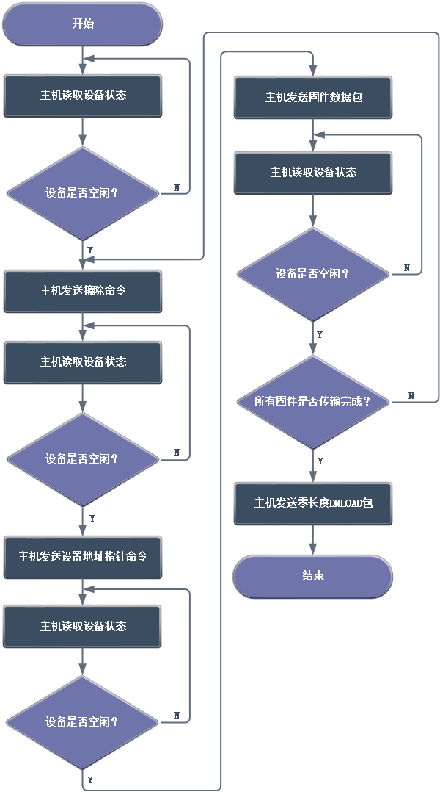
<figcaption>
图 2‑2主机执行流程
</figcaption>
</figure>

### 擦除和设置地址流程

主机下发Download固件块命令与擦除命令，设备接收后保存擦除地址并更新DFU状态机为忙状态、主循环标记为擦除操作，主机循环发送Get
Status轮询查询设备状态，设备返回忙碌状态后由主循环执行实际擦除操作；擦除完成后设备更新DFU同步状态，主机继续轮询Get
Status，设备更新为空闲状态并回复空闲状态，流程结束，设置地址流程与该擦除流程逻辑类似，同样依靠主机下发命令、设备更新状态机、主机轮询状态、设备主循环执行对应操作完成。擦除和设置地址抓包图如图2-3所示，擦除流程图如图2-4所示。

<figure>
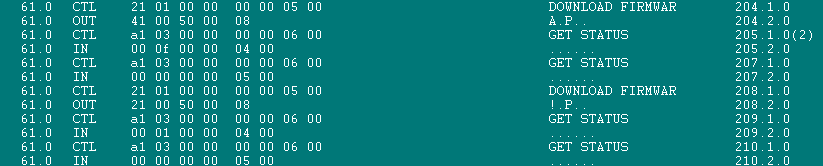
<figcaption>
图 2‑3擦除和设置地址抓包
</figcaption>
</figure>

<figure>
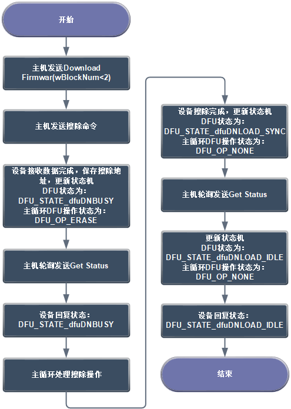
<figcaption>
图 2‑4擦除流程
</figcaption>
</figure>

擦除与设置地址命令登记的相关代码如下**：**

    static void DFU_PrepareDownload(void)
    {
        uint32_t addr;
        if (dfu_block_num == 0)
        {
            uint8_t cmd = dfu_buffer[0];
            switch (cmd) {
                case DFU_CMD_SET_ADDRESS_POINTER:
                    dfu_prog_addr = dfu_buffer[1]
                        | ((uint32_t)dfu_buffer[2] << 8)
                        | ((uint32_t)dfu_buffer[3] << 16)
                        | ((uint32_t)dfu_buffer[4] << 24);
                    dfu_pending_op = DFU_OP_SET_ADDR;
                    dfu_poll_timeout = 1;
                    dfu_state = DFU_STATE_dfuDNBUSY;
                    break;

                case DFU_CMD_ERASE:
                    addr = dfu_buffer[1]
                        | ((uint32_t)dfu_buffer[2] << 8)
                        | ((uint32_t)dfu_buffer[3] << 16)
                        | ((uint32_t)dfu_buffer[4] << 24);
                    if (addr >= DFU_APP_START_ADDR && addr <= DFU_FLASH_END_ADDR){
                        dfu_pending_op = DFU_OP_ERASE;
                        dfu_pending_addr = addr;
                        dfu_poll_timeout = 15;
                        dfu_state = DFU_STATE_dfuDNBUSY;
                    }
                    else{
                        dfu_status = DFU_STATUS_errADDRESS;
                        dfu_state = DFU_STATE_dfuERROR;
                    }
                    break;
            }
        }
    }

主循环处理擦除和设置地址的相关代码如下：

    case DFU_OP_ERASE:
            {
                uint8_t i;
                FLASH_Unlock_Fast();
                for (i = 0; i < 4; i++) {
                    FLASH_ErasePage_Fast(dfu_pending_addr + i * DFU_FLASH_PAGE_SIZE);
                }
                FLASH_Lock_Fast();
                dfu_state = DFU_STATE_dfuDNLOAD_SYNC;
                break;
            }
            case DFU_OP_SET_ADDR:
                dfu_state = DFU_STATE_dfuDNLOAD_SYNC;
                break;

### 固件写入和读取流程

固件写入时，主机发送Download固件命令以及数据包，设备接收完成后更新状态机为忙碌状态，主循环标记为写入操作；主机持续轮询发送Get
Status获取设备状态，设备返回忙状态，由主循环完成实际固件写入；写入完成后设备更新同步状态，主机继续轮询Get
Status，设备切换为空闲状态并回复空闲状态，完成本次固件数据包写入流程。固件写入抓包图如图2-5所示，固件写入流程图如图2-6所示。

<figure>
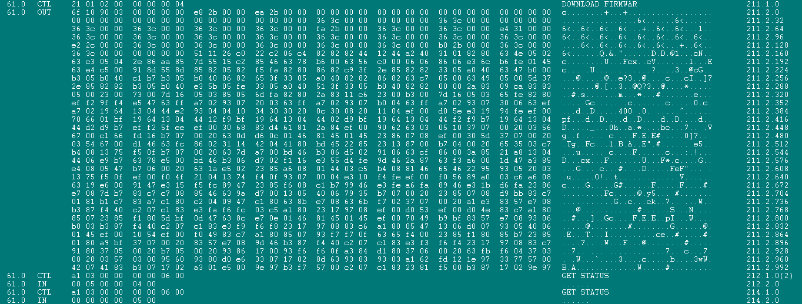
<figcaption>
图 2‑5固件写入抓包
</figcaption>
</figure>

<figure>
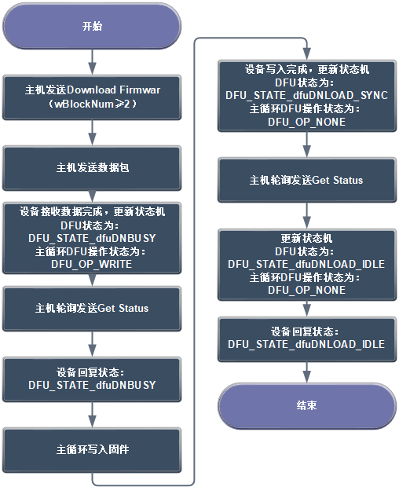
<figcaption>
图 2‑6固件写入流程
</figcaption>
</figure>

EP0接收DNLOAD数据的相关代码如下：

    void DFU_EP0_OutHandler(void)
    {
        uint16_t rx_len;
        if (USBFS_SetupReqCode == DFU_DNLOAD){
            rx_len = USBFSD->RX_LEN;
            if (dfu_download_off + rx_len <= DFU_TRANSFER_SIZE){
                memcpy(&dfu_buffer[dfu_download_off], USBFS_EP0_Buf, rx_len);
                dfu_download_off += rx_len;
            }
            if ((rx_len < DEF_USBD_UEP0_SIZE) ||(dfu_download_off >= dfu_download_len)){
                USBFSD->UEP0_TX_LEN = 0;
                USBFSD->UEP0_TX_CTRL = USBFS_UEP_T_TOG | USBFS_UEP_T_RES_ACK;
                dfu_data_ready = 1;
            }
            else{
                USBFSD->UEP0_RX_CTRL ^= USBFS_UEP_R_TOG;
            }
        }
    }

固件数据块（wBlockNum≥2）登记的相关代码如下：

    else if (dfu_block_num >= 2)
    {
        uint32_t addr = dfu_prog_addr + (uint32_t)(dfu_block_num - 2) * DFU_TRANSFER_SIZE;
        if (addr < DFU_APP_START_ADDR || addr > DFU_FLASH_END_ADDR){
            dfu_status = DFU_STATUS_errADDRESS;
            dfu_state = DFU_STATE_dfuERROR;
            return;
        }
        dfu_pending_op = DFU_OP_WRITE;
        dfu_pending_addr = addr;
        dfu_pending_len = dfu_download_len;
        dfu_poll_timeout = 5;
        dfu_state = DFU_STATE_dfuDNBUSY;
    }

主循环调用的写入执行的相关代码如下：

    static void DFU_ExecuteDownload(void)
    {
        switch (dfu_pending_op){
            case DFU_OP_WRITE:
                DFU_FlashProgram(dfu_pending_addr, dfu_buffer, dfu_pending_len);
                dfu_state = DFU_STATE_dfuDNLOAD_SYNC;
                break;
    }
          dfu_pending_op = DFU_OP_NONE;
          dfu_poll_timeout = 0;
    }

与写入不同，固件读取的Flash读取操作耗时短，无需延迟执行机制，在USB中断内直接完成。固件读取的流程为主机发送Upload固件读取命令，设备向主机回传指定大小的数据包，判断固件是否全部回传完成，若未完成则循环继续执行上传操作，全部固件回传完毕后，主机发送ABORT包，中止固件上传流程。固件读取抓包图如图2-7所示，固件读取流程图如图2-8所示。

<figure>
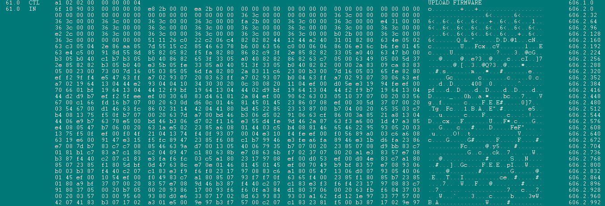
<figcaption>
图 2‑7固件读取抓包
</figcaption>
</figure>

<figure>
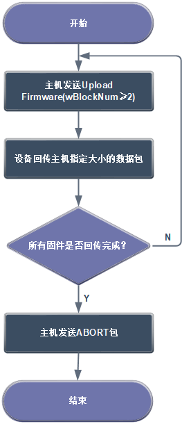
<figcaption>
图 2‑8固件读取流程
</figcaption>
</figure>

UPLOAD回读的数据源选择的相关代码如下：

    if (dfu_block_num >= 2)
    {
        uint32_t addr = dfu_prog_addr + (uint32_t)(dfu_block_num - 2) * DFU_TRANSFER_SIZE;
        if (addr > DFU_FLASH_END_ADDR){
            dfu_upload_src = 0; dfu_upload_avail = 0;
        }
        else{
            dfu_upload_src = (const uint8_t *)addr;
            uint32_t remaining = DFU_FLASH_END_ADDR - addr + 1;
            dfu_upload_avail = (remaining < DFU_TRANSFER_SIZE) ? (uint16_t)remaining : DFU_TRANSFER_SIZE;
    }

EP0发送UPLOAD数据的相关代码如下：

    void DFU_EP0_InHandler(void)
    {
        uint16_t len;
        if (USBFS_SetupReqCode == DFU_UPLOAD){
            len = (USBFS_SetupReqLen > DEF_USBD_UEP0_SIZE) ?DEF_USBD_UEP0_SIZE : USBFS_SetupReqLen;
            if (len > 0 && dfu_upload_src != 0){
                memcpy(USBFS_EP0_Buf, dfu_upload_src, len);
                dfu_upload_src += len;
            }
            USBFS_SetupReqLen -= len;
            dfu_upload_off += len;
            USBFSD->UEP0_TX_LEN = len;
            USBFSD->UEP0_TX_CTRL ^= USBFS_UEP_T_TOG;
        }
    }
    }

# 主机工具与升级操作

## 驱动安装

DFU设备需安装WinUSB驱动后方可正常使用。若未安装适配驱动，设备管理器中对应设备将显示黄色感叹号标识。当变更VID或PID后，需要为设备重新安装驱动才能正常使用；未安装驱动的DFU设备状态如图3-1所示，驱动安装完成后的设备状态如图3-2所示。

<figure>
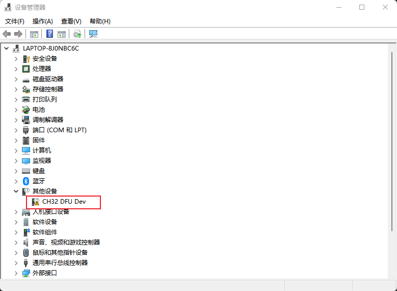
<figcaption>
图 3‑1未安装驱动设备状态
</figcaption>
</figure>

<figure>
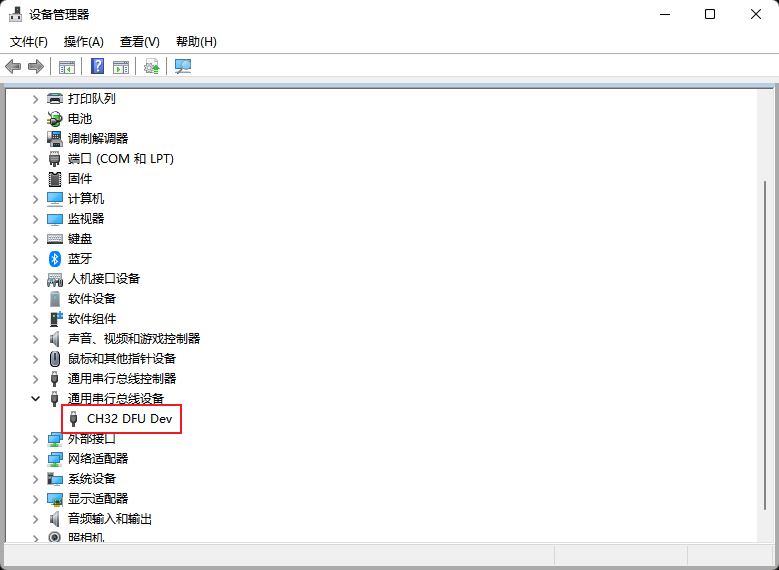
<figcaption>
图 3‑2驱动安装完成后设备状态
</figcaption>
</figure>

## 主机工具

可直接使用开源命令行工具**dfu-util**进行固件写入和读取。dfu-util
常用命令如表3-1所示。

| **命令** | **功能** |
|----|----|
| dfu-util -l | 列举当前DFU设备 |
| .\dfu-util -d \[VID\]:\[PID\] -s \[APP程序的FLASH起始地址\]:leave -D \[APP.bin\] | 指定特定的VID和PID设备从APP程序的FLASH起始地址开始下载固件 |
| .\dfu‑util -d \[VID\]:\[PID\] -s \[读取起始地址\] -Z \[读取字节数\] -U \[read.bin\] | 读取设备固件，将Flash内容回读到本地bin文件 |

表 3‑1dfu-util常用命令

在命令行中输入dfu-util
-l可以列举出当前的DFU设备的相关信息。列举DFU设备演示图如图3-3所示。

<figure>
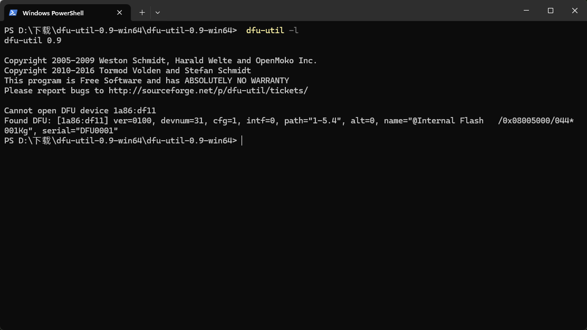
<figcaption>
图 3‑3列举DFU设备演示
</figcaption>
</figure>

在命令行输入.\dfu‑util -d 1a86:df11 -s 0x08005000:leave -D
app.bin，即可将app.bin固件下载至设备Flash，下载起始地址为0x08005000。下载固件演示图如图3-4所示。

<figure>
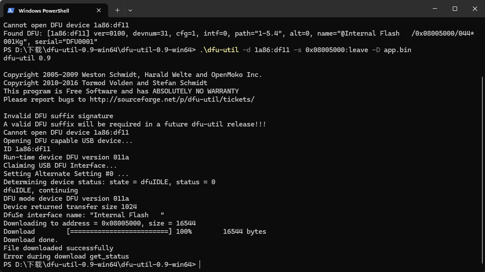
<figcaption>
图 3‑4下载固件演示
</figcaption>
</figure>

在命令行中输入.\dfu-util -d 1a86:df11 -s 0x08005000 -Z 45056 -U
read.bin可以从设备的Flash地址0x08005000开始读取45056字节固件至read.bin中。读取固件演示图如图3-5所示。

<figure>
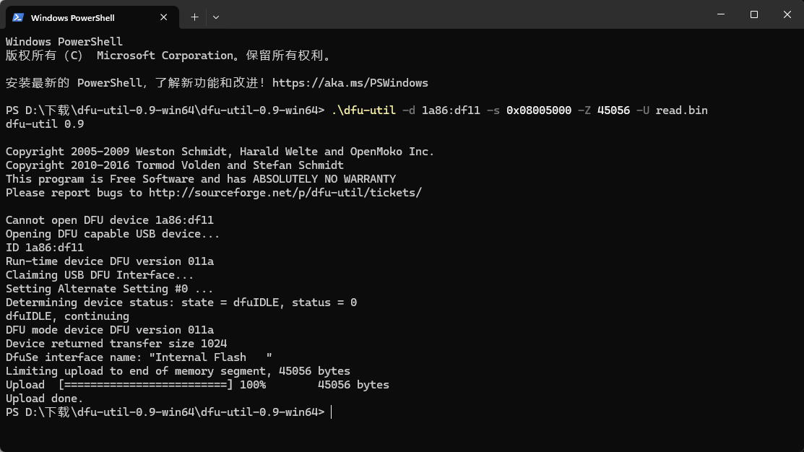
<figcaption>
图 3‑5读取固件演示
</figcaption>
</figure>

历史版本

| 日期      | 版本 | 变更内容 |
|-----------|------|----------|
| 2026/8/27 | V1.0 | 初版发行 |

声明

本手册仅供参考。作者在不另行通知的情况下，可随时进行修改。
